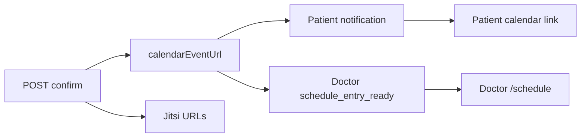
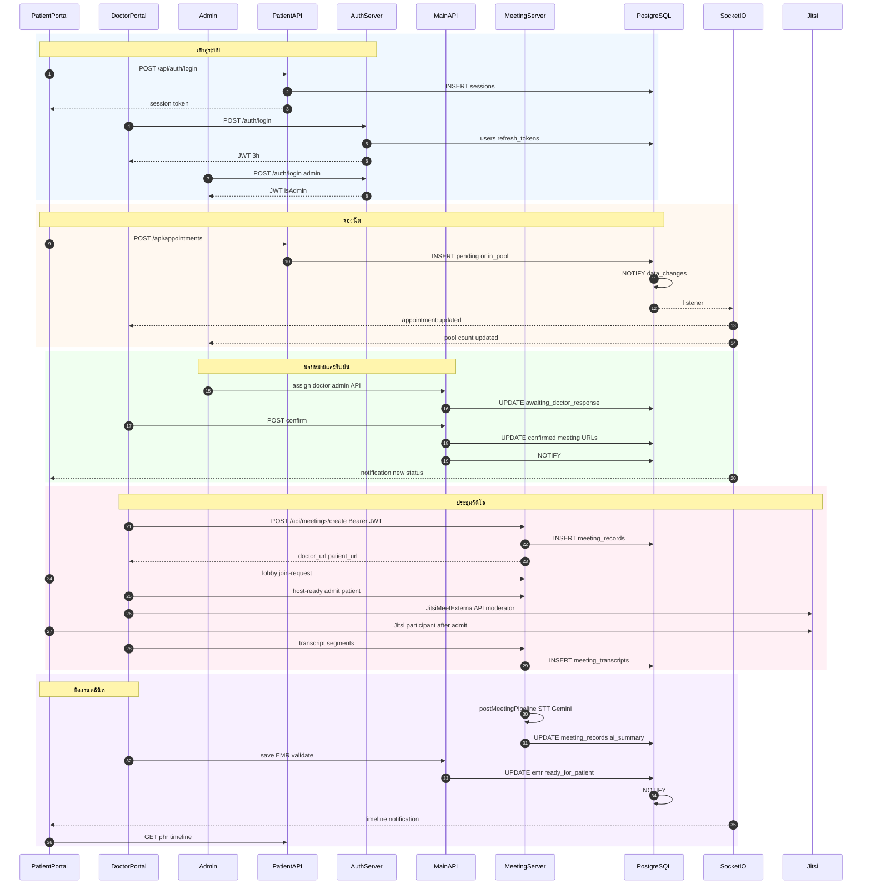

# โครงสร้างระบบและขั้นตอนการทำงาน (System Architecture & Workflow)

> **อัปเดต:** 22 มิถุนายน 2569 (v1.7.53) | **ชุดเอกสาร:** `Documents/Technical_Documents` (แท็ก `v1.0-docs`)  
> **ขอบเขต:** As-is ตาม codebase — ไม่มีข้อเสนอแนะ · **GCP:** `izara-telemedicine` / `asia-southeast1`  
> **ดัชนี:** [Documents/README.md](../README.md) · [docs/README.md](../Documents/docs/README.md) · [Presentations](../Presentations/README.md)  
> **ถัดไป:** [02](02_Authentication_and_Authorization.md) · [03](03_Data_Storage_Architecture.md) · [04](04_Jitsi_Integration_and_Code_Examples.md) · [05 ขั้นตอนเต็ม](05_Appendix_Full_Process_Steps.md)

---

## สารบัญ

1. [ภาพรวมระบบ](#1-ภาพรวมระบบ)
2. [หลักการทำงานของแพลตฟอร์ม](#2-หลักการทำงานของแพลตฟอร์ม)
3. [ชุดเทคโนโลยี (Technology Stack)](#3-ชุดเทคโนโลยี-technology-stack)
4. [โครงสร้างระบบระดับสูง](#4-โครงสร้างระบบระดับสูง)
5. [พอร์ทัลผู้ใช้ — หน้าจอและเส้นทาง (Routes)](#5-พอร์ทัลผู้ใช้--หน้าจอและเส้นทาง-routes)
6. [บริการฝั่งเซิร์ฟเวอร์ (Backend)](#6-บริการฝั่งเซิร์ฟเวอร์-backend)
7. [โครงสร้างพื้นฐาน (Infrastructure)](#7-โครงสร้างพื้นฐาน-infrastructure)
8. [การสื่อสารและข้อมูลเรียลไทม์](#8-การสื่อสารและข้อมูลเรียลไทม์)
9. [สถานะนัดหมาย (Appointment Lifecycle)](#9-สถานะนัดหมาย-appointment-lifecycle)
10. [ขั้นตอนการทำงานแยกตามบทบาท](#10-ขั้นตอนการทำงานแยกตามบทบาท)
11. [ข้อกำหนดระบบที่ต้องคงไว้เสมอ (Global Invariants)](#11-ข้อกำหนดระบบที่ต้องคงไว้เสมอ-global-invariants)
12. [แผนภาพ Mermaid — ลำดับการทำงาน](#12-แผนภาพ-mermaid--ลำดับการทำงาน)
13. [แผนภาพ draw.io — โครงสร้างภาพรวม](#13-แผนภาพ-drawio--โครงสร้างภาพรวม)
14. [เอกสารอ้างอิงใน repo](#14-เอกสารอ้างอิงใน-repo)
15. [ภาคผนวก — สังเคราะห์จาก Processes/Pages และ Processes/*.md](#15-ภาคผนวก--สังเคราะห์จาก-processespages-และ-processesmd)

---

## 1. ภาพรวมระบบ

**Izara Telemedicine (Isara Anywhere)** เป็นแพลตฟอร์มเทเลเมดิซินสำหรับประเทศไทย ที่เชื่อม **ผู้ป่วย**, **แพทย์**, และ **ผู้ดูแลระบบ (Admin)** เข้าด้วยกันผ่านเว็บแอปพลิเคชัน

ความสามารถหลักที่ระบบมีอยู่จริงใน Phase 1:

| หมวด | รายละเอียด |
|------|------------|
| นัดหมาย | จองออนไลน์, คิวรอแพทย์ (pool), มอบหมายและยืนยันนัด |
| ปรึกษาทางวิดีโอ | Jitsi Meet (`meet.jit.si`) + Izara Lobby |
| ข้อมูลสุขภาพ | PHR (ผู้ป่วย), EMR/SOAP (แพทย์), สั่งยา, lab |
| AI ช่วยคลินิก | Gemini สรุปหลังประชุม — แพทย์เป็นผู้ตัดสินใจสุดท้าย |
| PDPA / Living Will | ความยินยอมและเอกสารทางกฎหมายสุขภาพ |
| แจ้งเตือน | แบบเรียลไทม์ผ่าน Socket.IO |

### คำศัพท์ที่ใช้ในเอกสาร

| คำ | ความหมาย |
|----|----------|
| **Portal** | เว็บแอปสำหรับกลุ่มผู้ใช้หนึ่งกลุ่ม (ผู้ป่วย หรือ แพทย์/แอดมิน) |
| **SPA** | Single Page Application — หน้าเว็บที่โหลดครั้งเดียวแล้วเปลี่ยนหน้าภายในแอป |
| **API** | บริการฝั่งเซิร์ฟเวอร์ที่รับคำขอ HTTP จากเบราว์เซอร์ |
| **Meeting Server** | บริการกลางสำหรับห้องประชุม, lobby, บันทึก, transcript |
| **Realtime** | อัปเดตหน้าจอทันทีโดยไม่รีเฟรช (Socket.IO + PostgreSQL NOTIFY) |
| **Man-in-the-Loop** | AI สร้างร่าง — แพทย์ตรวจและอนุมัติก่อนส่งให้ผู้ป่วยเห็น |

### โครงสร้างแบบย่อ (สามแอป + ฐานข้อมูลเดียว)

```text
┌────────────────────────────────────────────────────────────────────┐
│                    IZARA TELEMEDICINE (As-is)                        │
├────────────────────────────────────────────────────────────────────┤
│  Patient Portal :3005    Doctor Portal :3010    Meeting :3020       │
│  (React+Express)         (React+nginx+API)      (Express+Socket.IO) │
│         └────────────────────┬────────────────────┘                 │
│                              ▼                                      │
│              PostgreSQL 18 · izara_phase1 · pgvector               │
│                              ▼                                      │
│         Jitsi (วิดีโอ) · Gemini (AI) · Google Maps / OAuth        │
└────────────────────────────────────────────────────────────────────┘
```

---

## 2. หลักการทำงานของแพลตฟอร์ม

จาก `Processes/System_Architecture_Overview.md` และ `Processes/FULL_WORKFLOW_CONTRACT.md`:

> **AI เป็นผู้ช่วยทางคลินิก — แพทย์มีอำนาจตัดสินใจสุดท้ายในทุกผลลัพธ์ทางการแพทย์**

ผลลัพธ์ที่ระบบปฏิบัติตามหลักนี้:

- สรุป SOAP จาก AI อยู่ในสถานะร่าง (`pending_review`) จนแพทย์ validate
- คำแนะนำให้ผู้ป่วย (`patient_instructions`) เปิดให้ผู้ป่วยเห็นเมื่อ `ready_for_patient = true` เท่านั้น
- บันทึกภายในแพทย์ไม่แสดงในหน้าผู้ป่วย

---

## 3. ชุดเทคโนโลยี (Technology Stack)

### 3.1 Frontend (ทั้งสองพอร์ทัล)

| เทคโนโลยี | การใช้งานในระบบ |
|-----------|------------------|
| React 18 | UI หลัก |
| TypeScript | ตรวจสอบชนิดข้อมูล |
| Vite | build และ dev server |
| Tailwind CSS | สไตล์, โหมดมืด/สว่าง |
| React Router v6 | เปลี่ยนหน้าใน SPA |
| Socket.IO Client | แจ้งเตือน, อัปเดตนัด/คิว |
| Lucide React | ไอคอน |

### 3.2 Backend

| เทคโนโลยี | การใช้งานในระบบ |
|-----------|------------------|
| Node.js 22+ | รันเซิร์ฟเวอร์ API |
| Express.js | REST API |
| PostgreSQL 18 | ฐานข้อมูลหลัก `izara_phase1` |
| pgvector | ค้นหา embedding (knowledge base, AI chat) |
| Socket.IO | WebSocket เรียลไทม์ |
| jsonwebtoken | JWT แพทย์/แอดมิน/Meeting API |
| bcryptjs | เข้ารหัสรหัสผ่าน |
| google-auth-library | ตรวจ Google SSO |

### 3.3 วิดีโอและ AI

| เทคโนโลยี | การใช้งานในระบบ |
|-----------|------------------|
| Jitsi Meet (`meet.jit.si`) | สื่อวิดีโอ/เสียง (iframe + External API) |
| Google Gemini | สรุปประชุม, AI Doctor, CDS |
| Web Speech API / Google STT | transcript ระหว่าง/หลังประชุม |

### 3.4 DevOps

| เทคโนโลยี | การใช้งานในระบบ |
|-----------|------------------|
| Docker Compose | รันทั้งสแต็กบนเครื่อง dev |
| Google Cloud Run | production / dev-testing |
| Cloud Build | `cloudbuild.yaml` ต่อพอร์ทัล |
| Playwright + Vitest | ทดสอบ UI และ unit |

---

## 4. โครงสร้างระบบระดับสูง

### 4.1 สามพอร์ทัล + บทบาทผู้ใช้

| พอร์ทัล | โฟลเดอร์ | ผู้ใช้หลัก | พอร์ต (local) |
|--------|----------|------------|---------------|
| **Patient Portal** | `Isara-patient-portal/` | ผู้ป่วย | **3005** |
| **Doctor Portal** | `Isara-doctor-portal/` | แพทย์, พยาบาล, **Admin** | **3010** (nginx ใน container ฟัง **8080**) |
| **Meeting Server** | `Izara-jitsi-server/` | ไม่มี UI หลัก — เป็น API/Realtime | **3020** |

**สำคัญ:** Admin **ไม่ได้แยก deploy** — ล็อกอินที่ Doctor Portal (`/login`) ด้วย `role = 'admin'` หรือ `is_admin = true` แล้วใช้เมนู `/admin/*`

### 4.2 สถาปัตยกรรมบริการ (Shared Database)

ระบบเป็น **หลายบริการ Node.js ที่แชร์ PostgreSQL ชุดเดียว** — ไม่แยกฐานข้อมูลต่อ service:

```text
                    ┌─────────────────┐
                    │  Cloud SQL /    │
                    │  izara_phase1   │
                    └────────▲────────┘
                             │
        ┌────────────────────┼────────────────────┐
        │                    │                    │
  Patient API          Doctor Auth + Main API   Meeting Server
  (port 3005)          (3011 auth, 3010 API)    (port 3020)
```

### 4.3 บริการภายนอก

| บริการ | จุดเชื่อมในระบบ |
|--------|------------------|
| **meet.jit.si** | iframe ใน `MeetingRoom` / `VirtualMeeting` |
| **Google Gemini** | Patient AI Doctor, สรุปหลังประชุม, Clinical Resources RAG |
| **Google Maps** | หน้า `/map` (Patient) |
| **Google OAuth** | ปุ่ม Sign in with Google → ส่ง ID token ไป backend |

---

## 5. พอร์ทัลผู้ใช้ — หน้าจอและเส้นทาง (Routes)

รายละเอียดหน้าจออ้างอิง `Processes/System_Architecture_Overview.md` และ `Processes/Pages/`

### 5.1 Patient Portal — เส้นทางตาม `App.tsx` / `Processes/Pages/Patient-Portal/`

พื้นฐาน URL: `http://localhost:3005` (Cloud Run ดู `CLOUD_ACCESS_TH.md`)

| เส้นทาง | สเปก Processes | หน้าที่หลัก (As-is) |
|---------|----------------|---------------------|
| `/login` | `01_Login_Page.md` | session opaque 7 วัน, Google SSO |
| `/register` | `02_Register_Page.md` | ลงทะเบียน 2 ขั้น → `users` + PHR |
| `/reset-password` | `03_Reset_Password_Page.md` | `password_resets` token |
| `/` | `04_Dashboard_Page.md` | แดชบอร์ด, KPI, ทางเข้านัด/PHR |
| `/appointments` | `05_Appointments_Page.md` | รายการนัด, สถานะ, เข้าประชุม |
| `/book-appointment` | `05` (wizard) | 3 ขั้น: อาการ → เวลา/แพทย์ → ยืนยัน |
| `/appointments/:id` | `05` (detail) | รายละเอียด, share guest link, ผลหลังประชุม |
| `/phr` | `06_PHR_Page.md` | PHR 5 แท็บ, vital, allergy |
| `/ai-doctor` | `07_AI_Doctor_Page.md` | Gemini chat + RAG |
| `/health-library` | `08_Medical_Content_Library.md` | บทความที่อนุมัติ |
| `/map` | `09_Map_Page.md` | Google Maps สถานพยาบาล |
| `/pdpa` | `10_PDPA_Page.md` | consent toggle → `patient_consents` |
| `/living-will` | `11_Living_Will_Page.md` | wizard → `living_wills` |
| `/profile` | `12_Profile_Page.md` | แก้ไขโปรไฟล์ |
| `/settings` | `13_Settings_Page.md` | ภาษา, ธีม, แจ้งเตือน |
| `/timeline` | `14_Timeline_Page.md` | ประวัติรักษา (หลัง EMR ปิด) |
| (Header) | `15_Notification_System.md` | Socket.IO + `notifications` |

### 5.2 Doctor Portal — เส้นทางภายใต้ `/doctor/:userId/*` (`DoctorPortal.tsx`)

พื้นฐาน URL: `http://localhost:3010` · หลังล็อกอิน redirect ไป `/doctor/{userId}/dashboard`

| เส้นทาง (relative ภายใต้ `/doctor/:userId/`) | สเปก Processes | สิทธิ์ |
|---------------------------------------------|----------------|-------|
| `/login` (root) | `01_Login_Page.md` | Public |
| `/reset-password` | `02_Reset_Password_Page.md` | Public |
| `dashboard` | `03_Dashboard_Page.md` | doctor/admin |
| `schedule` | `04_Schedule_Page.md` | doctor/admin |
| `patients`, `patients/:patientId` | `05_Patient_Management_Page.md` | doctor/admin |
| `health-meeting` | `06_Health_Meeting.md` + `21_Queue_Management.md` | doctor — คิว+ประชุมรวม |
| `meeting/:appointmentId` | `07_Virtual_Meeting.md` | doctor HOST |
| `meeting/:appointmentId/results` | `06` (แท็บผล) | doctor — man-in-the-loop |
| `virtual-meeting/:appointmentId` | `07` (legacy modal path) | doctor |
| `appointment-pool` | Redirect → `06_Health_Meeting_Page.md` (`?tab=queue`) | doctor/admin |
| `doctor-management` | `18_Admin_Doctor_Management.md` | **admin** |
| `appointment-management` | `17_Admin_Appointment_Management.md` | **admin** |
| `doctors` | `19_Doctors_Management_Page.md` | admin/directory |
| `medical-content` | `13_Medical_Content_Page.md` | doctor/admin |
| `clinical-resources` | `14_Clinical_Resources_Page.md` | doctor/admin |
| `profile` | `16_Doctor_Profile_Page.md` | doctor |
| (FAB modal) | `15_Gemini_AI_Studio.md` | doctor |
| (side panel modal) | `08_EMR`, `09_Prescribing`, `10_Lab`, `11_Patient_Record_Viewer` | doctor |
| `consultants`, `ai-studio` | `12` (redirect → dashboard) | stub As-is |
| `admin/doctors` → `doctor-management` | alias | admin |
| `admin/appointments` → `appointment-management` | alias | admin |
| `admin/pool` → `health-meeting?tab=queue` | alias redirect | admin |

### 5.3 Meeting Server — ความสามารถ (`Processes/Pages/Meeting-Server/00_Meeting_Server_Overview.md`)

พอร์ต `3020` · ไม่มี SPA ผู้ใช้ — พอร์ทัลเรียกผ่าน `VITE_MEETING_SERVER_URL`

| ความสามารถ | API / ช่องทาง |
|------------|----------------|
| สร้าง/คืนห้องประชุม | `POST /api/meetings/create` |
| Izara Lobby | `/api/meetings/:id/lobby/*`, `host-ready`, admit/reject |
| บันทึกและ transcript | `save-recording`, `meeting_transcripts`, embeddings |
| Pipeline หลังประชุม | STT → Gemini → `meeting_records`, `pending_review` |
| Realtime | Socket.IO + `pgNotifyListener` (`meeting-summary-ready` ฯลฯ) |
| Guest invite | token URL ไม่ต้องล็อกอินเต็มรูปแบบ |

---

## 6. บริการฝั่งเซิร์ฟเวอร์ (Backend)

### 6.1 Patient Portal (`Isara-patient-portal/server/`)

| ส่วน | ไฟล์/โฟลเดอร์ | หน้าที่ |
|------|---------------|--------|
| API หลัก | Express ใน unified image | REST `/api/*` |
| Auth | `routes/auth.ts` | login, register, Google SSO |
| Middleware | `middleware/auth.ts` | ตรวจ `sessions.token` |
| ข้อมูล | `services/postgresDataService.ts` | query PostgreSQL |
| OWASP RBAC | `middleware/owasp-middleware.ts` | `ROLE_PERMISSIONS` |

**การยืนยันตัวตนผู้ป่วย:** opaque token ในตาราง `sessions` (ไม่ใช่ JWT) — รายละเอียดในเอกสาร [02](02_Authentication_and_Authorization.md)

### 6.2 Doctor Portal — สองกระบวนการ

| บริการ | พอร์ต (typical) | ไฟล์ | หน้าที่ |
|--------|-----------------|------|--------|
| **Auth Server** | 3011 | `server/authServer.cjs` | login, refresh, Google SSO, อนุมัติแพทย์ (`requireAdmin`) |
| **Main API** | 3010 (หรือ 8080 ผ่าน nginx) | `server/mainApiServer.cjs` | EMR, appointments, pool, PHR แพทย์, เนื้อหา |
| **nginx** | 8080 ใน container | `Dockerfile.unified` | เสิร์ฟ static React + proxy ไป API |

**การยืนยันตัวตนแพทย์/แอดมิน:** JWT HS256 อายุ 3 ชม. + `refresh_tokens`

### 6.3 Meeting Server (`Izara-jitsi-server/server/`)

| ไฟล์ | หน้าที่ |
|------|--------|
| `index.js` | routes ประชุม, สร้าง room, Jitsi JWT (self-hosted) |
| `jitsiConfig.js` | URL, ปิด Jitsi lobby — ใช้ Izara lobby |
| `jwtPolicy.js` | ตรวจ JWT แอปก่อนเข้า API |
| `postMeetingPipeline.js` | บันทึก, GCS (ถ้ามี env), AI สรุป |
| `pgNotifyListener.js` | รับ NOTIFY → ส่ง Socket.IO |
| `lobbySession.js` | สถานะรอ admit |

---

## 7. โครงสร้างพื้นฐาน (Infrastructure)

### 7.1 Docker Compose (เครื่องพัฒนา)

จาก `docker-compose.yml`:

| Container | Host port → ภายใน | บทบาท |
|-----------|-------------------|--------|
| `izara-postgres` | **5433** → 5432 | DB + init SQL + migrations + seed |
| `izara-pgadmin` | **5050** → 80 | จัดการ DB (ทางเลือก) |
| `izara-patient-portal` | **3005** | SPA + API รวม |
| `izara-doctor-portal` | **3010** → **8080** | nginx + API |
| `izara-meeting-server` | **3020** | Meeting + Socket.IO |

- **Network:** `izara-network` (bridge)
- **Volumes:** `postgres_data`, `izara_uploads`, `izara_recordings`
- **Env:** `.env.docker` (รหัส DB, JWT, API keys)
- **คำสั่งเริ่ม:** `docker-compose up -d --build`

Init DB โหลดจาก `scripts/database/izara-database.sql` และ migrations ใน `docker-entrypoint-initdb.d/`

### 7.2 Google Cloud (dev-testing ที่ใช้งานจริง)

จาก `Documents/docs/markdown/operations/CLOUD_ACCESS_TH.md`:

| บริการ | URL (ตัวอย่าง) |
|--------|----------------|
| Patient Portal | `https://izara-patient-portal-dev-testing-724889190329.asia-southeast1.run.app` |
| Doctor Portal | `https://izara-doctor-portal-dev-testing-724889190329.asia-southeast1.run.app` |
| Meeting Server | `https://izara-meeting-server-dev-testing-724889190329.asia-southeast1.run.app` |

| องค์ประกอบ GCP | รายละเอียด |
|----------------|------------|
| **Cloud Run** | 3 services, region `asia-southeast1`, project `izara-telemedicine` |
| **Cloud SQL** | instance `izara-postgres-server`, database `izara_phase1` |
| **Cloud Build** | `Isara-*-portal/cloudbuild.yaml`, `Izara-jitsi-server/cloudbuild.yaml` |
| **GCS** | เก็บวิดีโอบันทึกเมื่อตั้ง `GCS_BUCKET` บน Meeting Server |
| **Secret Manager / env** | คีย์ JWT, DB URL, Gemini ผ่าน env ตอน deploy |

**Health check:**

```bash
curl https://izara-patient-portal-dev-testing-724889190329.asia-southeast1.run.app/health
curl https://izara-doctor-portal-dev-testing-724889190329.asia-southeast1.run.app/health
curl https://izara-meeting-server-dev-testing-724889190329.asia-southeast1.run.app/health
```

### 7.3 โครงสร้างโฟลเดอร์ repo (ระดับสูง)

```text
Isara-Anywhere/
├── Isara-patient-portal/     # Patient SPA + API
├── Isara-doctor-portal/      # Doctor SPA + auth + main API
├── Izara-jitsi-server/       # Meeting
├── scripts/database/         # SQL schema, seed, db-tool
├── Processes/                # สเปก workflow และหน้าจอ
├── Documents/
│   ├── docs/                 # คู่มือ, diagrams, screenshots
│   ├── Presentations/        # Mermaid, HTML diagrams
│   └── Technical_Documents/  # เอกสารชุดนี้
├── docker-compose.yml
└── tests/                    # Playwright, Vitest
```

---

## 8. การสื่อสารและข้อมูลเรียลไทม์

### 8.1 แผนภาพการไหลของข้อมูล

```text
[เบราว์เซอร์ Patient/Doctor SPA]
        │ HTTPS
        │ Authorization: Bearer <token>
        ▼
[Portal Express API] ──SQL──► [PostgreSQL izara_phase1]
        │
        │ REST  VITE_MEETING_SERVER_URL / MEETING_SERVER_URL
        ▼
[Meeting Server :3020] ──SQL──► [PostgreSQL]
        │
        │ WebRTC (ตรงจากเบราว์เซอร์ ไม่ผ่าน Meeting Server)
        ▼
[meet.jit.si]
```

### 8.2 ประเภทการสื่อสาร

| ช่องทาง | ใช้เมื่อ | ตัวอย่าง |
|---------|---------|----------|
| REST JSON | CRUD นัด, PHR, EMR, login | `POST /api/auth/login` |
| Bearer token | ทุก API ที่ต้องล็อกอิน | JWT (แพทย์) หรือ session (ผู้ป่วย) |
| Socket.IO | แจ้งเตือน, คิว, อัปเดตนัด | event จาก NOTIFY |
| WebRTC | วิดีโอ/เสียง | Jitsi iframe |
| PostgreSQL NOTIFY | trigger หลัง INSERT/UPDATE | channel `data_changes` |

### 8.3 กลไก Realtime (As-is)

1. ตารางสำคัญ (เช่น `appointments`, `notifications`) มี trigger ส่ง `NOTIFY`  
   ไฟล์: `scripts/database/v2.2.0-notify-triggers.sql`
2. แต่ละพอร์ทัล / Meeting Server มี listener (`pgNotifyListener` ฯลฯ)
3. Listener แปลงเป็น event Socket.IO → ห้อง `user-{id}` หรือ role-specific rooms
4. React ฝั่ง client รับ event แล้วอัปเดต state — **ไม่ต้องกดรีเฟรช**

บน Cloud Run อาจใช้ **Redis adapter** สำหรับ Socket.IO เมื่อมีหลาย instance (`socketRedisAdapter.cjs` ใน doctor portal)

---

## 9. สถานะนัดหมาย (Appointment Lifecycle)

อ้างอิง `Processes/Appointment_Workflows.md` และ GATE0

### 9.1 สถานะหลักและความหมาย

| สถานะ | ความหมาย (ภาษาง่าย) | ใครเป็นคนดำเนินการถัดไป |
|--------|---------------------|-------------------------|
| `pending` | จองแล้ว ระบุแพทย์แล้ว รอแพทย์ยืนยัน | แพทย์ที่เลือก |
| `in_pool` | จองแล้ว ยังไม่มีแพทย์ — อยู่ในคิวกลาง | Admin มอบหมาย |
| `awaiting_doctor_response` | Admin มอบหมายแล้ว รอแพทย์ที่ได้รับมอบหมายตอบ | แพทย์ที่ได้รับมอบหมาย |
| `confirmed` | แพทย์ยืนยันแล้ว พร้อมประชุม | ทั้งสองฝ่ายเข้าห้อง |
| `in_progress` | กำลังประชุม/ให้บริการ | แพทย์ (HOST) |
| `completed` | ปิดนัดและงานคลินิกแล้ว | — |
| `cancelled` / `declined` | ยกเลิกหรือปฏิเสธ | — |

### 9.2 แผนภาพสถานะ

```text
                    ┌─────────────┐
         จองเลือกแพทย์ ──►│   pending   │
                    └──────┬──────┘
                           │
         จองไม่ระบุแพทย์ ──┼──► ┌─────────────┐
                           │    │   in_pool   │
                           │    └──────┬──────┘
                           │           │ Admin assign
                           │           ▼
                           │    ┌──────────────────────────┐
                           └──► │ awaiting_doctor_response │
                                └────────────┬─────────────┘
                                             │ แพทย์ confirm
                                             ▼
                                      ┌─────────────┐
                                      │  confirmed  │
                                      └──────┬──────┘
                                             │
                                             ▼
                                   ประชุม → EMR → completed
```

### 9.3 ฟิลด์ที่เกี่ยวกับการประชุมและปฏิทิน (หลัง confirm)

ในตาราง `appointments` มีคอลัมน์ที่ระบบใช้จริง เช่น:

- `jitsi_room_name`
- `doctor_meeting_url`, `patient_meeting_url`, `guest_meeting_url`
- `meeting_link`, `meet_link`
- `confirmed_date`, `confirmed_time`, `scheduled_date`, `scheduled_time`

และแถวใน `meeting_records` ที่ Meeting Server สร้างหรือคืนซ้ำ (idempotent ตาม `appointment_id`)

#### 9.3.1 Calendar sync (v1.7.51 — Teams/Zoom/Google Meet parity)

เมื่อแพทย์ที่ได้รับมอบหมายยืนยันนัด (`POST /api/appointments/:id/confirm`):

| ขั้นตอน | ไฟล์ / API | ผลลัพธ์ |
|---------|------------|---------|
| 1 | `calendarEventLinks.cjs` → `buildTelehealthCalendarUrl` | สร้าง `calendarEventUrl` (Google Calendar `action=TEMPLATE`, timezone Asia/Bangkok, 30 นาที) |
| 2 | `appointmentMapper.cjs` → `mapAppointmentForClient` | `GET /api/appointments` คืน camelCase (`appointmentDate`, `doctorId`, `meetingLink`) |
| 3 | `mainApiServer.cjs` | แจ้งเตือนผู้ป่วย `appointment_confirmed` + `meeting_link_ready` พร้อม `data.calendarEventUrl` |
| 4 | `mainApiServer.cjs` | แจ้งเตือนแพทย์ `schedule_entry_ready` |
| 5 | Doctor UI `/schedule` | `schedule/CompleteSchedule.tsx` — กรอง `confirmed`/`scheduled`, `data-testid=schedule-appointment-{id}` |
| 6 | Patient UI | `MainLayout` MiniCalendar — จุดสี emerald บนวันที่มีนัด; รายละเอียดนัด — `appointment-calendar-link` |
| 7 | Patient fallback | `buildCalendarEventUrl.ts` สร้าง URL ซ้ำหาก notification เก่าไม่มีฟิลด์ |



**การทดสอบ:** Playwright **D4cal** (`group-D`); Vitest `calendarEventLinks.test.ts`, `appointmentMapper.test.ts`, `buildCalendarEventUrl.test.ts`, DPDF-CAL1/CAL2

### 9.4 คิว Pool — ยืนยันแล้วไม่หาย (Accept traceability)

เมื่อแพทย์กด **ยืนยัน** จาก pool ระบบ **อัปเดตแถว** ในตาราง `appointments` (ไม่ลบ) — สถานะ DB เป็น `confirmed` แต่ UI/API pool แสดงเป็น **`accepted`**

| หัวข้อ | พฤติกรรม As-is |
|--------|----------------|
| Accept | `PUT /api/appointment-pool/:id/confirm` หรือ `POST .../confirm` → ตั้ง `status=confirmed`, `doctor_id` (UUID), `confirmed_by`, `confirmed_at` |
| Decline | กลับเป็น `in_pool` (ไม่ลบแถว) |
| Pool GET | `GET /api/appointment-pool?includeAccepted=true` — **default `true`**; pending (`in_pool`, `pending`, `awaiting_doctor_response`) ยังแสดงควบคู่ accepted |
| หน้าต่าง accepted | แถว `confirmed` ที่ `confirmed_at` ไม่เกิน **7 วัน** (`ACCEPTED_VISIBILITY_DAYS` ใน `appointmentPoolQuery.cjs`) |
| Mapper | `derivePoolStatus('confirmed')` → `'accepted'`; ฟิลด์ `acceptedBy`, `queueVisibility: 'accepted'` |
| Realtime | Socket event `pool-updated` หลัง accept/decline — Health Meeting + Appointment Pool Management sync |

ไฟล์อ้างอิง: `Isara-doctor-portal/server/appointmentPoolQuery.cjs`, `appointmentQueueMapper.cjs`, `mainApiServer.cjs` · Vitest: `queueAcceptTraceability.test.ts`, `queueLifecycle.integration.test.ts`

---

## 10. ขั้นตอนการทำงานแยกตามบทบาท

### 10.1 ผู้ป่วย — ตั้งแต่ล็อกอินจนถึงเห็นผลการรักษา

| ลำดับ | ขั้นตอน | สิ่งที่เกิดขึ้นในระบบ |
|-------|---------|----------------------|
| 1 | เปิด Patient Portal → `/login` | กรอก email/รหัสผ่าน หรือ Google (ถ้าเปิด) |
| 2 | ระบบตรวจสอบ | `POST /api/auth/login` → แถวใน `sessions`, คืน token |
| 3 | เข้า Dashboard | route guard ผ่าน — เก็บ token ใน `localStorage` |
| 4 | เมนู Appointments → เริ่มจอง | wizard: อาการ, วันที่, เลือกแพทย์หรือ pool |
| 5 | ส่งคำขอนัด | `INSERT appointments` สถานะ `pending` หรือ `in_pool` |
| 6 | รอแจ้งเตือน | NOTIFY → Socket.IO → กระดิ่ง/รายการนัดอัปเดต |
| 7 | เมื่อสถานะ `confirmed` | เห็นลิงก์/ปุ่มเข้าประชุม + จุดปฏิทิน sidebar + **Add to Calendar** (`calendarEventUrl`) |
| 8 | ก่อนเข้าห้อง | หน้า agreement → **Izara Lobby** รอแพทย์ admit (`prejoinPageEnabled: false`) |
| 9 | หลัง admit | iframe Jitsi — display name จาก auth (`getIzaraDisplayName`); ไม่ใช่ moderator |
| 10 | หลังประชุม | รอแพทย์ปิด EMR — ผู้ป่วยยังไม่เห็นสรุป AI จนกว่าแพทย์ validate |
| 11 | ดูผล | PHR (แท็บเอกสาร `patient_documents`), Timeline, Notifications — EMR/lab/Rx หลัง sign/deliver |

### 10.2 แพทย์ — ตั้งแต่ล็อกอินจนปิดเคส

| ลำดับ | ขั้นตอน | สิ่งที่เกิดขึ้นในระบบ |
|-------|---------|----------------------|
| 1 | `/login` Doctor Portal | `POST /auth/login` → JWT + refresh |
| 2 | ถ้า `approval_status = pending` | แสดงหน้ารออนุมัติ (แพทย์ใหม่) — ต้องรอ Admin |
| 3 | Dashboard / Schedule | เห็นนัดที่รอ confirm หรือ confirmed — `/schedule` แสดงเฉพาะ `confirmed`/`scheduled` พร้อมลิงก์ประชุม |
| 4 | นัดจากคิว | รับจาก **Health Meeting → Patient Queue** (`/health-meeting?tab=queue`) — Claim / AI Match / Admin assign |
| 5 | Confirm นัด | อัปเดต `confirmed` — แถว accepted ยังอยู่ในคิว 7 วัน |
| 6 | Health Meeting / Queue | คิวรอจัดสรร + รอตอบรับ + ที่รับแล้ว แบบ realtime |
| 7 | เริ่มประชุม | `POST /api/meetings/create` (ถ้ายังไม่มี record) |
| 8 | เข้า Jitsi ก่อนผู้ป่วย | **HOST/moderator** — `buildDoctorJitsiMountOptions`; บน meet.jit.si ใช้ `configOverwrite.moderator: true` |
| 9 | ระหว่างประชุม | transcript segments → `meeting_transcripts` |
| 10 | จบประชุม | pipeline: บันทึก → STT → Gemini ร่าง SOAP |
| 11 | EMR Editor | แพทย์แก้/ลงนาม — man-in-the-loop |
| 12 | Prescribing / Lab | บันทึก `prescriptions`, `lab_orders` → publish `patient_documents` + แจ้งเตือน |
| 13 | ปิดงาน | ผู้ป่วยดาวน์โหลดเอกสารจาก PHR + Timeline |

### 10.3 Admin — งานที่ทำบน Doctor Portal

| ลำดับ | ขั้นตอน | สิ่งที่เกิดขึ้นในระบบ |
|-------|---------|----------------------|
| 1 | ล็อกอินด้วยบัญชี `admin` | JWT + `isAdmin` / `requireAdmin` routes |
| 2 | `/admin/doctors` | อนุมัติ/ปฏิเสธแพทย์ `approval_status` |
| 3 | `/admin/appointments` หรือ Health Meeting queue | มอบหมาย `doctor_id` → `awaiting_doctor_response` |
| 4 | ติดตามคิว | dashboard แอดมิน sync จำนวนคิวกับแพทย์ — หลักฐาน UI: Group W W03 (Health Meeting queue) |


| 5 | เนื้อหา | อนุมัติ `medical_content` (ถ้ามี workflow รออนุมัติ) |

**ข้อจำกัด As-is:** Admin **ไม่ใช่** Jitsi HOST — เฉพาะแพทย์ที่ได้รับมอบหมายเท่านั้น

### 10.4 แขก (Guest) — เข้าร่วมประชุม

| ลำดับ | ขั้นตอน |
|-------|---------|
| 1 | ได้รับ `guest_meeting_url` พร้อม **scoped invite token** (`type: guest-invite`) |
| 2 | เปิดลิงก์ (ไม่ต้องมีบัญชีผู้ป่วยเต็มรูปแบบ) — anonymous join-config **ถูกปฏิเสธ** หากไม่มี token |
| 3 | กรอกชื่อแสดง → Izara Lobby |
| 4 | รอแพทย์ admit → เข้า Jitsi เป็น guest (`affiliation: none`, ไม่ใช่ moderator) |

---

## 11. ข้อกำหนดระบบที่ต้องคงไว้เสมอ (Global Invariants)

จาก `Processes/FULL_WORKFLOW_CONTRACT.md` — พฤติกรรมที่ regression ต้องผ่าน:

| หมวด | สิ่งที่ระบบต้องทำได้เสมอ |
|------|-------------------------|
| Auth | แยก route ผู้ป่วย/แพทย์ — token ไม่ข้ามพอร์ทัล |
| นัดหมาย | สถานะเปลี่ยนตามชุดที่อนุญาต — ฟิลด์ `doctorId` / `assignedDoctorId` สอดคล้อง |
| ประชุม | **แพทย์ที่ได้รับมอบหมายเท่านั้น** เป็น HOST/moderator |
| Lobby | ผู้ป่วย/แขกรอ admit — แพทย์เป็นผู้ปล่อยเข้า |
| Realtime | NOTIFY → Socket.IO — UI อัปเดตครั้งเดียวต่อ event |
| คลินิก | AI เป็นร่างจนแพทย์ validate — ผู้ป่วยไม่เห็นโน้ตภายในแพทย์ |

---

## 12. แผนภาพ Mermaid — ลำดับการทำงาน



---

## 13. แผนภาพ draw.io — โครงสร้างภาพรวม

นำ XML ด้านล่างไปวางใน [diagrams.net](https://app.diagrams.net) → **Arrange → Insert → Advanced → XML**

```xml
<mxfile host="app.diagrams.net" agent="Isara-Anywhere-Technical-Doc" version="21.0.0">
  <diagram name="System Architecture Overview" id="sys-arch-as-is">
    <mxGraphModel dx="1200" dy="800" grid="1" gridSize="10" guides="1" tooltips="1" connect="1" arrows="1" fold="1" page="1" pageScale="1" pageWidth="1400" pageHeight="900" math="0" shadow="0">
      <root>
        <mxCell id="0" />
        <mxCell id="1" parent="0" />
        <mxCell id="title" value="Izara Telemedicine — โครงสร้างระบบ (As-is)" style="text;html=1;strokeColor=none;fillColor=none;align=center;fontSize=18;fontStyle=1;" vertex="1" parent="1">
          <mxGeometry x="300" y="20" width="800" height="40" as="geometry" />
        </mxCell>
        <mxCell id="users_box" value="ผู้ใช้งาน" style="swimlane;startSize=30;fillColor=#E8F5E9;strokeColor=#4CAF50;" vertex="1" parent="1">
          <mxGeometry x="40" y="80" width="160" height="200" as="geometry" />
        </mxCell>
        <mxCell id="u_patient" value="ผู้ป่วย" style="rounded=1;whiteSpace=wrap;html=1;fillColor=#C8E6C9;" vertex="1" parent="users_box">
          <mxGeometry x="20" y="40" width="120" height="40" as="geometry" />
        </mxCell>
        <mxCell id="u_doctor" value="แพทย์" style="rounded=1;whiteSpace=wrap;html=1;fillColor=#C8E6C9;" vertex="1" parent="users_box">
          <mxGeometry x="20" y="90" width="120" height="40" as="geometry" />
        </mxCell>
        <mxCell id="u_admin" value="Admin (Doctor Portal)" style="rounded=1;whiteSpace=wrap;html=1;fillColor=#FFF9C4;" vertex="1" parent="users_box">
          <mxGeometry x="20" y="140" width="120" height="40" as="geometry" />
        </mxCell>
        <mxCell id="pp_box" value="Patient Portal :3005&#xa;React + Express" style="swimlane;startSize=40;fillColor=#E3F2FD;strokeColor=#2196F3;" vertex="1" parent="1">
          <mxGeometry x="240" y="80" width="200" height="120" as="geometry" />
        </mxCell>
        <mxCell id="dp_box" value="Doctor Portal :3010&#xa;React + nginx + Express" style="swimlane;startSize=40;fillColor=#E8EAF6;strokeColor=#3F51B5;" vertex="1" parent="1">
          <mxGeometry x="240" y="220" width="200" height="120" as="geometry" />
        </mxCell>
        <mxCell id="ms_box" value="Meeting Server :3020&#xa;Express + Socket.IO" style="swimlane;startSize=40;fillColor=#FFF3E0;strokeColor=#FF9800;" vertex="1" parent="1">
          <mxGeometry x="240" y="360" width="200" height="100" as="geometry" />
        </mxCell>
        <mxCell id="gcp_box" value="Google Cloud (asia-southeast1)" style="swimlane;startSize=30;fillColor=#ECEFF1;strokeColor=#607D8B;" vertex="1" parent="1">
          <mxGeometry x="500" y="80" width="320" height="380" as="geometry" />
        </mxCell>
        <mxCell id="crun" value="Cloud Run&#xa;Patient | Doctor | Meeting" style="rounded=1;whiteSpace=wrap;html=1;fillColor=#CFD8DC;" vertex="1" parent="gcp_box">
          <mxGeometry x="20" y="50" width="280" height="60" as="geometry" />
        </mxCell>
        <mxCell id="sql" value="Cloud SQL&#xa;PostgreSQL izara_phase1" style="shape=cylinder3;whiteSpace=wrap;html=1;boundedLbl=1;backgroundOutline=1;size=12;fillColor=#B39DDB;" vertex="1" parent="gcp_box">
          <mxGeometry x="80" y="140" width="160" height="80" as="geometry" />
        </mxCell>
        <mxCell id="gcs" value="GCS (เมื่อตั้ง GCS_BUCKET)" style="rounded=1;whiteSpace=wrap;html=1;fillColor=#CFD8DC;" vertex="1" parent="gcp_box">
          <mxGeometry x="20" y="250" width="280" height="50" as="geometry" />
        </mxCell>
        <mxCell id="ext_box" value="บริการภายนอก" style="swimlane;startSize=30;fillColor=#FCE4EC;strokeColor=#E91E63;" vertex="1" parent="1">
          <mxGeometry x="880" y="80" width="200" height="200" as="geometry" />
        </mxCell>
        <mxCell id="jitsi" value="Jitsi meet.jit.si" style="rounded=1;whiteSpace=wrap;html=1;fillColor=#F8BBD0;" vertex="1" parent="ext_box">
          <mxGeometry x="20" y="45" width="160" height="40" as="geometry" />
        </mxCell>
        <mxCell id="gemini" value="Google Gemini" style="rounded=1;whiteSpace=wrap;html=1;fillColor=#F8BBD0;" vertex="1" parent="ext_box">
          <mxGeometry x="20" y="95" width="160" height="40" as="geometry" />
        </mxCell>
        <mxCell id="oauth" value="Google OAuth" style="rounded=1;whiteSpace=wrap;html=1;fillColor=#F8BBD0;" vertex="1" parent="ext_box">
          <mxGeometry x="20" y="145" width="160" height="40" as="geometry" />
        </mxCell>
        <mxCell id="e1" style="edgeStyle=orthogonalEdgeStyle;rounded=0;endArrow=classic;" edge="1" parent="1" source="u_patient" target="pp_box">
          <mxGeometry relative="1" as="geometry" />
        </mxCell>
        <mxCell id="e2" style="edgeStyle=orthogonalEdgeStyle;rounded=0;endArrow=classic;" edge="1" parent="1" source="u_doctor" target="dp_box">
          <mxGeometry relative="1" as="geometry" />
        </mxCell>
        <mxCell id="e3" style="edgeStyle=orthogonalEdgeStyle;rounded=0;endArrow=classic;" edge="1" parent="1" source="u_admin" target="dp_box">
          <mxGeometry relative="1" as="geometry" />
        </mxCell>
        <mxCell id="e4" value="REST" style="edgeStyle=orthogonalEdgeStyle;rounded=0;endArrow=classic;" edge="1" parent="1" source="pp_box" target="ms_box">
          <mxGeometry relative="1" as="geometry" />
        </mxCell>
        <mxCell id="e5" value="REST" style="edgeStyle=orthogonalEdgeStyle;rounded=0;endArrow=classic;" edge="1" parent="1" source="dp_box" target="ms_box">
          <mxGeometry relative="1" as="geometry" />
        </mxCell>
        <mxCell id="e6" value="SQL" style="edgeStyle=orthogonalEdgeStyle;rounded=0;endArrow=classic;" edge="1" parent="1" source="ms_box" target="sql">
          <mxGeometry relative="1" as="geometry" />
        </mxCell>
        <mxCell id="e7" value="WebRTC iframe" style="edgeStyle=orthogonalEdgeStyle;rounded=0;endArrow=classic;dashed=1;" edge="1" parent="1" source="pp_box" target="jitsi">
          <mxGeometry relative="1" as="geometry" />
        </mxCell>
        <mxCell id="e8" value="WebRTC iframe" style="edgeStyle=orthogonalEdgeStyle;rounded=0;endArrow=classic;dashed=1;" edge="1" parent="1" source="dp_box" target="jitsi">
          <mxGeometry relative="1" as="geometry" />
        </mxCell>
      </root>
    </mxGraphModel>
  </diagram>
</mxfile>
```

---

## 14. เอกสารอ้างอิงใน repo

| เอกสาร | เนื้อหา | สะท้อนในเอกสารชุดนี้ |
|--------|---------|----------------------|
| `Processes/Pages/README.md` | ดัชนี 37+ หน้า + สายงานประชุม | §15 |
| `Processes/System_Architecture_Overview.md` | สถาปัตยกรรมฉบับเต็ม | §1–§8 |
| `Processes/FULL_WORKFLOW_CONTRACT.md` | สัญญา regression | §11 |
| `Processes/Appointment_Workflows.md` | นัด→ประชุม→EMR→ส่งผู้ป่วย | §9–§10, §15.6 |
| `Processes/VIDEO_MEETING_JITSI_GEMINI.md` | Jitsi + STT + Gemini | เอกสาร [04](04_Jitsi_Integration_and_Code_Examples.md) |
| `Processes/Combined_Workflows_And_Actions.md` | การกระทำรวมข้ามหน้า | §15.7 |
| `Processes/Separated_Workflows_And_Functions.md` | ฟังก์ชันแยกบทบาท | §10 |
| `Processes/UI_Pages_Workflows.md` | ผูก UI กับ workflow | §5, §15 |
| `Processes/PHASE1_REQUIREMENTS.md` | ข้อกำหนด Phase 1 | §2 |
| `Processes/GATE0_IMPLEMENTATION_STATUS.md` | pool/HOST/sync | §9 |
| `Processes/ENV_AND_STACK_CHECK.md` | env ทั้ง 3 แอป | §7 |
| `Processes/FULL_WORKFLOW_CONTRACT.md` | สัญญา workflow / gate | §11 |
| `Processes/TWO_ROUND_CLOUD_TESTING.md` | ทดสอบ cloud 2 รอบ | (อ้างอิง QA) |
| `docker-compose.yml` | บริการ local | §7.1 |
| `Documents/docs/markdown/operations/CLOUD_ACCESS_TH.md` | URL cloud จริง | §7.2 |
| `Documents/Technical_Documents/05_Appendix_Full_Process_Steps.md` | ขั้นตอน Processes เต็ม | §15 + 05 |

---

## 15. ภาคผนวก — สังเคราะห์จาก Processes/Pages และ Processes/*.md

> **ขอบเขต:** สรุป As-is จากสเปกใน `Processes/` — **ขั้นตอนและ Workflow เต็ม** อยู่ใน [05_Appendix_Full_Process_Steps.md](05_Appendix_Full_Process_Steps.md) (สร้างด้วย `python scripts/build-appendix-process-steps.py`)

### 15.1 สายงานหลัก Phase 1 (Meeting → EMR → Patient)

จาก `Processes/Pages/README.md` และ `Appointment_Workflows.md`:

```text
จองนัด (Patient 05) → pool/confirm (Admin 17,20 / Doctor 04,06)
    → สร้างห้อง POST /api/meetings/create (Meeting 00)
    → Izara Lobby → Jitsi (Doctor 07 HOST, Patient 05 join)
    → บันทึก + transcript + POST .../end → Gemini สรุป
    → แพทย์ validate (06 results) → EMR 08 → สั่งยา 09 / lab 10
    → ผู้ป่วยเห็นผล: Dashboard 04, Timeline 14, PHR 06, Notifications 15
```

### 15.2 เอกสาร Processes ระดับระบบ — สาระสำคัญ

| ไฟส์ Processes | สาระที่สะท้อนในเอกสาร 01–04 |
|----------------|------------------------------|
| `Appointment_Workflows.md` | สถานะนัด, HOST, guest, instruction sheet PDF |
| `Clinical_Resources_&_Medical_Library_Workflows.md` | หน้า 08 Patient, 13–14 Doctor, RAG |
| `Health_Records_Processes.md` | PHR, EMR, Timeline, Patient Record Viewer |
| `Living_Will_Processes.md` | หน้า 10–11 Patient |
| `Medical_Consultants_Workflows.md` | หน้า 12 Doctor (redirect stub) |
| `Medicine_Content_Processes.md` | medical_content, drugs, CDS |
| `Notification_Workflows.md` | NOTIFY → Socket, หน้า 15 Patient, 03 Doctor |
| `User_management_Workflows.md` | ล็อกอิน, อนุมัติแพทย์ → เอกสาร 02 |
| `Data_Sync_Documentation.md` | PG NOTIFY, idempotent sync → เอกสาร 03 |
| `PostgreSQL_Database_Architecture.md` | 37+ ตาราง, ERD → เอกสาร 03 |
| `PHASE1_BASELINE_WORKFLOW_CONTRACT.md` | must-pass ย่อยของ FULL_WORKFLOW |
| `Combined_Workflows_And_Actions.md` | การกระทำข้ามพอร์ทัล (จอง→มอบหมาย→ประชุม) |
| `Separated_Workflows_And_Functions.md` | แยก patient / doctor / admin / guest |

### 15.3 Patient Portal — ดัชนีสเปกหน้า (ครบ 16 ไฟล์)

| ไฟล์ Processes | Workflow หลักที่สรุปแล้ว |
|----------------|---------------------------|
| `00_Patient_Portal_Overview.md` | เมนู 9 รายการ, layout, stack |
| `01_Login_Page.md` | email/password, Google SSO, session |
| `02_Register_Page.md` | 2-step, สร้าง patient + PHR |
| `03_Reset_Password_Page.md` | request-reset → token → reset |
| `04_Dashboard_Page.md` | KPI, นัดถัดไป, ลิงก์เข้าประชุม |
| `05_Appointments_Page.md` | wizard 3 ขั้น, pool, join lobby, guest share, cancel |
| `06_PHR_Page.md` | 5 แท็บ, vitals, allergy, medication |
| `07_AI_Doctor_Page.md` | `/api/ai/*`, chat history, memory |
| `08_Medical_Content_Library.md` | อ่าน `medical_content` ที่ publish |
| `09_Map_Page.md` | Maps API, facility types |
| `10_PDPA_Page.md` | consent per doctor, revoke |
| `11_Living_Will_Page.md` | wizard 4 ขั้น, versions |
| `12_Profile_Page.md` | อัปเดต `users` / `patient_profiles` |
| `13_Settings_Page.md` | theme, language, notifications prefs |
| `14_Timeline_Page.md` | ประวัติจาก EMR ที่ปิดแล้ว |
| `15_Notification_System.md` | bell, mark read, realtime |

### 15.4 Doctor Portal — ดัชนีสเปกหน้า (ครบ 22 ไฟล์)

| ไฟล์ Processes | Workflow หลักที่สรุปแล้ว |
|----------------|---------------------------|
| `00_Doctor_Portal_Overview.md` | route map, side panel, AI FAB, ตาราง API รวม |
| `01_Login_Page.md` | JWT, pending approval, Google SSO |
| `02_Reset_Password_Page.md` | `/auth/request-password-reset` |
| `03_Dashboard_Page.md` | สถิติ, นัดวันนี้, quick actions |
| `04_Schedule_Page.md` | `doctor_schedules`, calendar CRUD |
| `05_Patient_Management_Page.md` | รายชื่อ, เปิด PHR/EMR modal |
| `06_Health_Meeting_Page.md` | คิว, confirm, create meeting, validate AI |
| `07_Virtual_Meeting.md` | Jitsi HOST, transcript, recording, chat |
| `08_EMR_Editor.md` | SOAP JSONB, AI pre-fill, sign/finalize |
| `09_Prescribing.md` | CDS, `prescriptions`, drug interaction |
| `10_Lab_Orders.md` | `lab_orders` สั่ง/ผล |
| `11_Patient_Record_Viewer.md` | PHR+EMR รวม, PDPA guard |
| `12_Medical_Consultants_Page.md` | consultants (redirect ในโค้ดปัจจุบัน) |
| `13_Medical_Content_Page.md` | CRUD บทความ, อนุมัติ |
| `14_Clinical_Resources_Page.md` | protocols, RAG embeddings |
| `15_Gemini_AI_Studio.md` | FAB modal, calculators, chat |
| `16_Doctor_Profile_Page.md` | `doctor_profiles` |
| `17_Admin_Appointment_Management.md` | assign, auto-assign, ทุกนัด |
| `18_Admin_Doctor_Management.md` | approve/reject `approval_status` |
| `19_Doctors_Management_Page.md` | ไดเรกทอรีแพทย์ |
| `20_Appointment_Pool_Management.md` | `in_pool` → รับ/มอบหมาย |
| `21_Queue_Management.md` | realtime คิว (รวมใน health-meeting) |

### 15.5 Meeting Server

| ไฟล์ | สาระ |
|------|------|
| `Meeting-Server/00_Meeting_Server_Overview.md` | routes ทั้งหมด, pipeline, Socket events, env |

### 15.6 API ข้ามหน้าที่ใช้บ่อย (จากสเปกหน้า)

| โดเมน | Endpoint ตัวอย่าง | หน้าที่เรียก |
|--------|-------------------|-------------|
| นัด | `GET/POST/PATCH /api/appointments`, `POST /api/appointment-pool` | Patient 05, Doctor 06, Admin 17 |
| ประชุม | `POST /api/meetings/create`, `.../end`, `.../validate` | Doctor 06–07, Meeting 00 |
| คลินิก | `POST/PUT /api/emr`, `/api/prescriptions`, `/api/lab-orders` | Doctor 08–10 |
| AI | `POST /api/ai/symptom-triage`, `/api/ai/*` | Patient 05, 07 |
| แอดมิน | `/api/admin/*` | Doctor 17–18 |

---

**ไฟล์ถัดไปในชุด:** [02_Authentication_and_Authorization.md](02_Authentication_and_Authorization.md)
