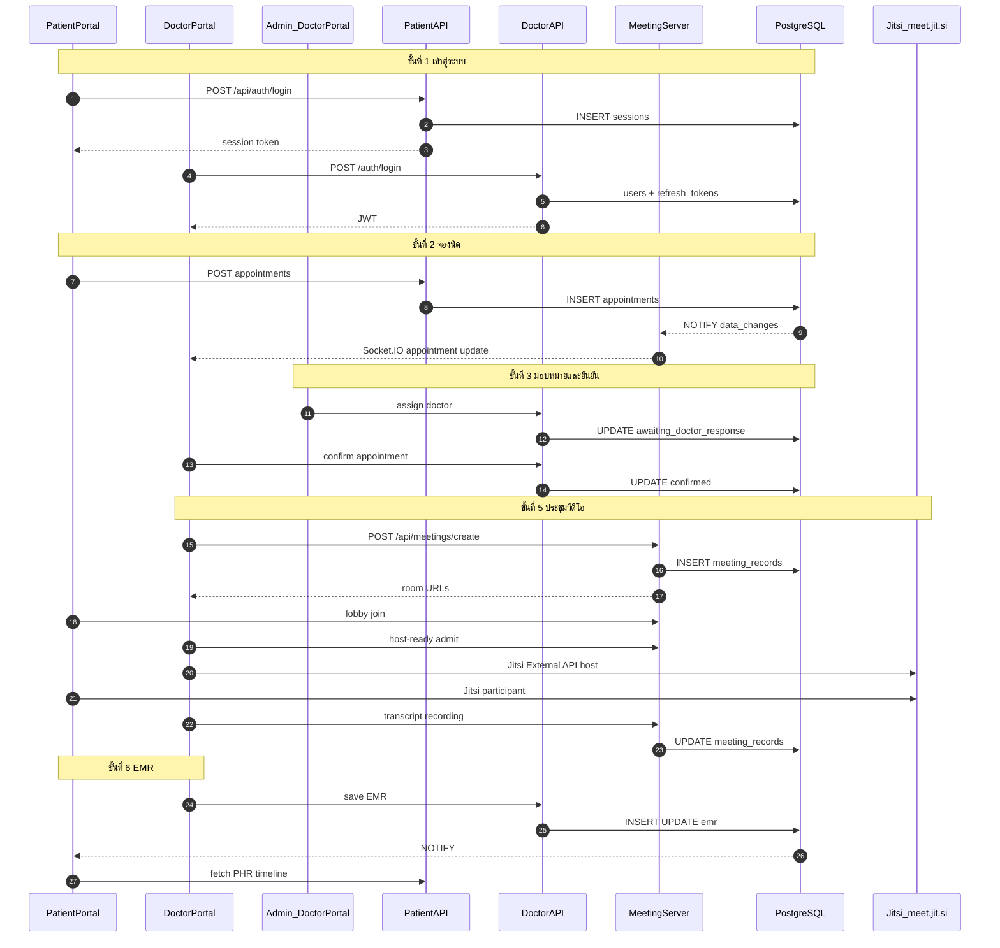

# โครงสร้างระบบและขั้นตอนการทำงาน (System Architecture & Workflow)

> **อัปเดต:** 2 มิถุนายน 2569 | **ขอบเขต:** As-is ตาม codebase Isara-Anywhere เท่านั้น  
> **โปรเจกต์ Google Cloud:** `izara-telemedicine` | **ภูมิภาค:** `asia-southeast1`

---

## สารบัญ

1. [ภาพรวมระบบ](#1-ภาพรวมระบบ)
2. [โครงสร้างระบบระดับสูง](#2-โครงสร้างระบบระดับสูง)
3. [โครงสร้างพื้นฐาน (Infrastructure)](#3-โครงสร้างพื้นฐาน-infrastructure)
4. [การสื่อสารระหว่างส่วนประกอบ](#4-การสื่อสารระหว่างส่วนประกอบ)
5. [ขั้นตอนการทำงานของผู้ใช้ (Workflow)](#5-ขั้นตอนการทำงานของผู้ใช้-workflow)
6. [แผนภาพ Mermaid — ลำดับการทำงาน](#6-แผนภาพ-mermaid--ลำดับการทำงาน)
7. [แผนภาพ draw.io — โครงสร้างภาพรวม](#7-แผนภาพ-drawio--โครงสร้างภาพรวม)

---

## 1. ภาพรวมระบบ

**Izara Telemedicine (Isara Anywhere)** เป็นแพลตฟอร์มเทเลเมดิซินสำหรับประเทศไทย ที่เชื่อมผู้ป่วย แพทย์ และผู้ดูแลระบบผ่านเว็บแอปพลิเคชัน การนัดหมายออนไลน์ การปรึกษาทางวิดีโอ และข้อมูลสุขภาพ (PHR/EMR)

คำศัพท์ที่ใช้ในเอกสารนี้:

| คำ | ความหมาย |
|----|----------|
| **Portal** | เว็บแอปสำหรับกลุ่มผู้ใช้หนึ่งกลุ่ม (ผู้ป่วย / แพทย์) |
| **API** | บริการฝั่งเซิร์ฟเวอร์ที่รับคำขอจากเบราว์เซอร์ |
| **Realtime** | การอัปเดตหน้าจอทันทีผ่าน Socket.IO โดยไม่ต้องรีเฟรช |

หลักการที่ระบบใช้อยู่จริง:

- **สามแอปพลิเคชันหลัก** บน Node.js + React แยกตามบทบาทผู้ใช้
- **ฐานข้อมูล PostgreSQL ชุดเดียว** (`izara_phase1`) ที่ทุกแอปเชื่อมต่อร่วมกัน
- **วิดีโอประชุม** ผ่าน Jitsi Meet แบบ SaaS (`meet.jit.si`) ฝังในเบราว์เซอร์
- **การอัปเดตแบบเรียลไทม์** ผ่าน PostgreSQL `NOTIFY` → Socket.IO

---

## 2. โครงสร้างระบบระดับสูง

### 2.1 User Portals (พอร์ทัลผู้ใช้)

| พอร์ทัล | โฟลเดอร์ใน repo | ผู้ใช้ | พอร์ต local (Docker) |
|--------|------------------|--------|----------------------|
| **Patient Portal** | `Isara-patient-portal/` | ผู้ป่วย | 3005 |
| **Doctor Portal** | `Isara-doctor-portal/` | แพทย์, พยาบาล, **Admin** | 3010 (nginx ภายใน container ฟัง 8080) |
| **Meeting Server** | `Izara-jitsi-server/` | API + Socket.IO สำหรับการประชุม | 3020 |

**หมายเหตุ:** Admin **ไม่ใช่** แอปแยก — ใช้ Doctor Portal เดียวกัน โดย `role = 'admin'` หรือ `is_admin = true` แล้วเข้าเมนู `/admin/*`

### 2.2 Backend Services (บริการฝั่งเซิร์ฟเวอร์)

ระบบเป็นสถาปัตยกรรม **หลายบริการที่แชร์ฐานข้อมูลเดียว** (ไม่แยก DB ต่อ microservice):

| บริการ | ไฟล์หลัก | หน้าที่ |
|--------|----------|---------|
| Patient Express API | `Isara-patient-portal/server/` | ล็อกอิน, นัดหมาย, PHR, PDPA, แจ้งเตือน |
| Doctor Auth Server | `authServer.cjs` (พอร์ต 3011) | ล็อกอินแพทย์/แอดมิน, JWT, refresh token, Google SSO |
| Doctor Main API | `mainApiServer.cjs` (พอร์ต 3010) | EMR, คิว, pool, สั่งยา, lab, เนื้อหาทางการแพทย์ |
| Meeting Server | `Izara-jitsi-server/server/index.js` | สร้างห้องประชุม, lobby, บันทึก, transcript, pipeline AI หลังประชุม |

### 2.3 บริการภายนอกที่เชื่อมต่ออยู่จริง

| บริการ | การใช้งานในระบบ |
|--------|------------------|
| **Jitsi Meet** (`meet.jit.si`) | สื่อวิดีโอ/เสียงใน iframe |
| **Google Gemini** | สรุป SOAP, AI ช่วยคลินิก |
| **Google Maps** | แผนที่สถานพยาบาล (Patient Portal) |
| **Google OAuth** | ปุ่ม Sign in with Google (ส่ง ID token มาที่ backend) |

---

## 3. โครงสร้างพื้นฐาน (Infrastructure)

### 3.1 การรันบนเครื่องพัฒนา (Docker Compose)

จาก `docker-compose.yml`:

| Container | Host port | หมายเหตุ |
|-----------|-----------|----------|
| `patient-portal` | 3005 | React + Express ใน image เดียว |
| `doctor-portal` | 3010 → 8080 | nginx เสิร์ฟ SPA + proxy ไป API |
| `meeting-server` | 3020 | Meeting API + Socket.IO |
| `postgres` | 5433 → 5432 | DB `izara_phase1` |
| `pgadmin` | 5050 | UI จัดการ DB (ทางเลือก) |

Network: `izara-network` (bridge)

### 3.2 การรันบน Google Cloud (ตามเอกสารใน repo)

| องค์ประกอบ | รายละเอียด As-is |
|------------|------------------|
| **Cloud Run** | Patient, Doctor, Meeting Server ใน `asia-southeast1` |
| **Cloud SQL** | ฐานข้อมูล `izara-postgres-server` |
| **Cloud Build** | `cloudbuild.yaml` ในแต่ละพอร์ทัล |
| **GCS** | เก็บไฟล์บันทึกการประชุมเมื่อตั้งค่า env `GCS_BUCKET` |

อ้างอิง URL จริง: `Documents/docs/markdown/operations/CLOUD_ACCESS_TH.md`

---

## 4. การสื่อสารระหว่างส่วนประกอบ

```text
เบราว์เซอร์ (Patient/Doctor SPA)
    │ HTTPS + Bearer Token
    ▼
Portal Express API ──────────────┐
    │                             │
    │ REST (MEETING_SERVER_URL)   │ Socket.IO
    ▼                             ▼
Meeting Server (:3020) ◄──► PostgreSQL (izara_phase1)
    │
    │ WebRTC (iframe)
    ▼
meet.jit.si (Jitsi SaaS)
```

- **REST + JWT หรือ session token** ระหว่างเบราว์เซอร์กับ API ของแต่ละพอร์ทัล
- **PostgreSQL NOTIFY** → listener ในแต่ละบริการ → **Socket.IO** แจ้ง UI
- **สื่อวิดีโอ** ไปที่ Jitsi โดยตรงจากเบราว์เซอร์ ไม่ผ่าน Meeting Server

---

## 5. ขั้นตอนการทำงานของผู้ใช้ (Workflow)

อ้างอิง `Processes/FULL_WORKFLOW_CONTRACT.md`

### ขั้นที่ 1 — เข้าสู่ระบบ

| ผู้ใช้ | หน้าจอ | ผลลัพธ์ |
|--------|--------|---------|
| ผู้ป่วย | `/login` (Patient Portal) | session token ในตาราง `sessions` |
| แพทย์/แอดมิน | `/login` (Doctor Portal) | JWT อายุ 3 ชม. + refresh token |
| ทั้งสอง | Google Sign-In (ถ้าเปิด) | ตรวจ email ที่มีในระบบแล้วเท่านั้น |

### ขั้นที่ 2 — จองนัดหมาย (ผู้ป่วย)

1. เปิดเมนู Appointments → ตัวช่วยจอง (wizard)
2. กรอกอาการ / ข้อมูลที่จำเป็น
3. เลือกแพทย์ หรือปล่อยให้ระบบจัดคิว (pool)
4. ระบบบันทึกสถานะเริ่มต้น: `pending` หรือ `in_pool`

### ขั้นที่ 3 — มอบหมายและยืนยันนัด

1. **Admin** มอบหมายแพทย์จาก Appointment Pool → `awaiting_doctor_response`
2. **แพทย์ที่ได้รับมอบหมาย** ยืนยันหรือปฏิเสธ
3. เมื่อยืนยัน → `confirmed` พร้อม metadata ห้องประชุม

### ขั้นที่ 4 — ซิงค์แบบเรียลไทม์

- การเปลี่ยนสถานะนัดส่งผ่าน PostgreSQL NOTIFY → Socket.IO
- Dashboard, คิว, รายการนัดอัปเดตโดยไม่ต้องรีเฟรช

### ขั้นที่ 5 — การประชุมทางวิดีโอ

1. แพทย์ที่ได้รับมอบหมายเป็น **HOST** เท่านั้น
2. ผู้ป่วย/แขกรอใน **Izara Lobby** จนแพทย์ admit
3. Meeting Server สร้าง/คืน `meeting_records` และ URL join
4. เบราว์เซอร์โหลด Jitsi External API (`meet.jit.si`)

### ขั้นที่ 6 — หลังประชุมและส่งมอบผลทางคลินิก

1. Pipeline หลังประชุม: บันทึก → STT → Gemini สรุปร่าง SOAP
2. แพทย์ตรวจและลงนาม EMR (man-in-the-loop)
3. ผู้ป่วยเห็นผลใน PHR, Timeline, Notifications

### สถานะนัดหมาย (สรุป)

```text
pending | in_pool → awaiting_doctor_response → confirmed → (ประชุม + ปิดงานคลินิก)
```

---

## 6. แผนภาพ Mermaid — ลำดับการทำงาน



---

## 7. แผนภาพ draw.io — โครงสร้างภาพรวม

นำ XML ด้านล่างไปวางใน [diagrams.net](https://app.diagrams.net) → **Arrange → Insert → Advanced → XML**

```xml
<mxfile host="app.diagrams.net" agent="Isara-Anywhere-Technical-Doc" version="21.0.0">
  <diagram name="System Architecture Overview" id="sys-arch-as-is">
    <mxGraphModel dx="1200" dy="800" grid="1" gridSize="10" guides="1" tooltips="1" connect="1" arrows="1" fold="1" page="1" pageScale="1" pageWidth="1400" pageHeight="900" math="0" shadow="0">
      <root>
        <mxCell id="0" />
        <mxCell id="1" parent="0" />
        <mxCell id="title" value="Izara Telemedicine — โครงสร้างระบบ (As-is)" style="text;html=1;strokeColor=none;fillColor=none;align=center;fontSize=18;fontStyle=1;" vertex="1" parent="1">
          <mxGeometry x="300" y="20" width="800" height="40" as="geometry" />
        </mxCell>
        <mxCell id="users_box" value="ผู้ใช้งาน" style="swimlane;startSize=30;fillColor=#E8F5E9;strokeColor=#4CAF50;" vertex="1" parent="1">
          <mxGeometry x="40" y="80" width="160" height="200" as="geometry" />
        </mxCell>
        <mxCell id="u_patient" value="ผู้ป่วย" style="rounded=1;whiteSpace=wrap;html=1;fillColor=#C8E6C9;" vertex="1" parent="users_box">
          <mxGeometry x="20" y="40" width="120" height="40" as="geometry" />
        </mxCell>
        <mxCell id="u_doctor" value="แพทย์" style="rounded=1;whiteSpace=wrap;html=1;fillColor=#C8E6C9;" vertex="1" parent="users_box">
          <mxGeometry x="20" y="90" width="120" height="40" as="geometry" />
        </mxCell>
        <mxCell id="u_admin" value="Admin (Doctor Portal)" style="rounded=1;whiteSpace=wrap;html=1;fillColor=#FFF9C4;" vertex="1" parent="users_box">
          <mxGeometry x="20" y="140" width="120" height="40" as="geometry" />
        </mxCell>
        <mxCell id="pp_box" value="Patient Portal :3005&#xa;React + Express" style="swimlane;startSize=40;fillColor=#E3F2FD;strokeColor=#2196F3;" vertex="1" parent="1">
          <mxGeometry x="240" y="80" width="200" height="120" as="geometry" />
        </mxCell>
        <mxCell id="dp_box" value="Doctor Portal :3010&#xa;React + nginx + Express" style="swimlane;startSize=40;fillColor=#E8EAF6;strokeColor=#3F51B5;" vertex="1" parent="1">
          <mxGeometry x="240" y="220" width="200" height="120" as="geometry" />
        </mxCell>
        <mxCell id="ms_box" value="Meeting Server :3020&#xa;Express + Socket.IO" style="swimlane;startSize=40;fillColor=#FFF3E0;strokeColor=#FF9800;" vertex="1" parent="1">
          <mxGeometry x="240" y="360" width="200" height="100" as="geometry" />
        </mxCell>
        <mxCell id="gcp_box" value="Google Cloud (asia-southeast1)" style="swimlane;startSize=30;fillColor=#ECEFF1;strokeColor=#607D8B;" vertex="1" parent="1">
          <mxGeometry x="500" y="80" width="320" height="380" as="geometry" />
        </mxCell>
        <mxCell id="crun" value="Cloud Run&#xa;Patient | Doctor | Meeting" style="rounded=1;whiteSpace=wrap;html=1;fillColor=#CFD8DC;" vertex="1" parent="gcp_box">
          <mxGeometry x="20" y="50" width="280" height="60" as="geometry" />
        </mxCell>
        <mxCell id="sql" value="Cloud SQL&#xa;PostgreSQL izara_phase1" style="shape=cylinder3;whiteSpace=wrap;html=1;boundedLbl=1;backgroundOutline=1;size=12;fillColor=#B39DDB;" vertex="1" parent="gcp_box">
          <mxGeometry x="80" y="140" width="160" height="80" as="geometry" />
        </mxCell>
        <mxCell id="gcs" value="GCS (เมื่อตั้ง GCS_BUCKET)" style="rounded=1;whiteSpace=wrap;html=1;fillColor=#CFD8DC;" vertex="1" parent="gcp_box">
          <mxGeometry x="20" y="250" width="280" height="50" as="geometry" />
        </mxCell>
        <mxCell id="ext_box" value="บริการภายนอก" style="swimlane;startSize=30;fillColor=#FCE4EC;strokeColor=#E91E63;" vertex="1" parent="1">
          <mxGeometry x="880" y="80" width="200" height="200" as="geometry" />
        </mxCell>
        <mxCell id="jitsi" value="Jitsi meet.jit.si" style="rounded=1;whiteSpace=wrap;html=1;fillColor=#F8BBD0;" vertex="1" parent="ext_box">
          <mxGeometry x="20" y="45" width="160" height="40" as="geometry" />
        </mxCell>
        <mxCell id="gemini" value="Google Gemini" style="rounded=1;whiteSpace=wrap;html=1;fillColor=#F8BBD0;" vertex="1" parent="ext_box">
          <mxGeometry x="20" y="95" width="160" height="40" as="geometry" />
        </mxCell>
        <mxCell id="oauth" value="Google OAuth" style="rounded=1;whiteSpace=wrap;html=1;fillColor=#F8BBD0;" vertex="1" parent="ext_box">
          <mxGeometry x="20" y="145" width="160" height="40" as="geometry" />
        </mxCell>
        <mxCell id="e1" style="edgeStyle=orthogonalEdgeStyle;rounded=0;endArrow=classic;" edge="1" parent="1" source="u_patient" target="pp_box">
          <mxGeometry relative="1" as="geometry" />
        </mxCell>
        <mxCell id="e2" style="edgeStyle=orthogonalEdgeStyle;rounded=0;endArrow=classic;" edge="1" parent="1" source="u_doctor" target="dp_box">
          <mxGeometry relative="1" as="geometry" />
        </mxCell>
        <mxCell id="e3" style="edgeStyle=orthogonalEdgeStyle;rounded=0;endArrow=classic;" edge="1" parent="1" source="u_admin" target="dp_box">
          <mxGeometry relative="1" as="geometry" />
        </mxCell>
        <mxCell id="e4" value="REST" style="edgeStyle=orthogonalEdgeStyle;rounded=0;endArrow=classic;" edge="1" parent="1" source="pp_box" target="ms_box">
          <mxGeometry relative="1" as="geometry" />
        </mxCell>
        <mxCell id="e5" value="REST" style="edgeStyle=orthogonalEdgeStyle;rounded=0;endArrow=classic;" edge="1" parent="1" source="dp_box" target="ms_box">
          <mxGeometry relative="1" as="geometry" />
        </mxCell>
        <mxCell id="e6" value="SQL" style="edgeStyle=orthogonalEdgeStyle;rounded=0;endArrow=classic;" edge="1" parent="1" source="ms_box" target="sql">
          <mxGeometry relative="1" as="geometry" />
        </mxCell>
        <mxCell id="e7" value="WebRTC iframe" style="edgeStyle=orthogonalEdgeStyle;rounded=0;endArrow=classic;dashed=1;" edge="1" parent="1" source="pp_box" target="jitsi">
          <mxGeometry relative="1" as="geometry" />
        </mxCell>
        <mxCell id="e8" value="WebRTC iframe" style="edgeStyle=orthogonalEdgeStyle;rounded=0;endArrow=classic;dashed=1;" edge="1" parent="1" source="dp_box" target="jitsi">
          <mxGeometry relative="1" as="geometry" />
        </mxCell>
      </root>
    </mxGraphModel>
  </diagram>
</mxfile>
```

---

## เอกสารอ้างอิงใน repo

- `Processes/System_Architecture_Overview.md`
- `Processes/FULL_WORKFLOW_CONTRACT.md`
- `docker-compose.yml`
- `Documents/docs/markdown/operations/CLOUD_ACCESS_TH.md`
