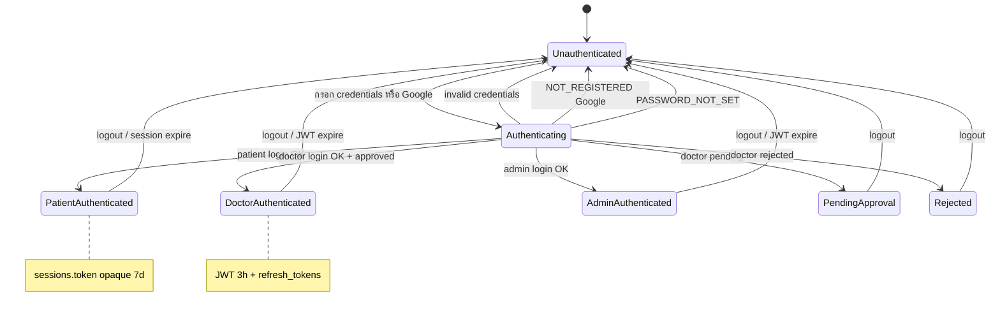

# การจัดการสิทธิ (Authentication & Authorization)

> **อัปเดต:** 2 มิถุนายน 2569 | **ขอบเขต:** As-is ตาม codebase Isara-Anywhere เท่านั้น

---

## สารบัญ

1. [ภาพรวม](#1-ภาพรวม)
2. [โครงสร้าง RBAC](#2-โครงสร้าง-rbac)
3. [การยืนยันตัวตน (Authentication)](#3-การยืนยันตัวตน-authentication)
4. [การอนุญาต (Authorization)](#4-การอนุญาต-authorization)
5. [Token และ Session](#5-token-และ-session)
6. [แผนภาพ Mermaid — สถานะการเข้าสู่ระบบ](#6-แผนภาพ-mermaid--สถานะการเข้าสู่ระบบ)
7. [แผนภาพ draw.io — ขอบเขตความปลอดภัย](#7-แผนภาพ-drawio--ขอบเขตความปลอดภัย)

---

## 1. ภาพรวม

ระบบ Izara ใช้ **การยืนยันตัวตนแบบกำหนดเองบน Express** ไม่ใช้ Passport.js

- **ผู้ป่วย:** token แบบ opaque string เก็บในตาราง `sessions`
- **แพทย์/แอดมิน:** JWT (HS256) + refresh token ในตาราง `refresh_tokens`
- **Google SSO:** ส่ง Google ID token มาที่ backend แล้วตรวจด้วย `google-auth-library`

---

## 2. โครงสร้าง RBAC

### 2.1 บทบาทในตาราง `users`

| ค่า `role` | พอร์ทัล | คำอธิบาย |
|------------|---------|----------|
| `patient` | Patient Portal | ผู้ป่วย — ลงทะเบียนผ่าน `/api/auth/register` |
| `doctor` | Doctor Portal | แพทย์ — อาจมี `approval_status` เป็น `pending` จนแอดมินอนุมัติ |
| `admin` | Doctor Portal | ผู้ดูแล — `is_admin = true` หรือ `role = 'admin'` |

### 2.2 สิทธิ์ตาม OWASP Middleware

จาก `Isara-patient-portal/server/middleware/owasp-middleware.ts` (Doctor portal มีชุดคล้ายกันใน `security/owasp-middleware.cjs`):

| บทบาท | สิทธิ์ที่กำหนด |
|--------|----------------|
| `admin` | `read:all`, `write:all`, `delete:all`, `manage:users`, `view:audit` |
| `doctor` | `read:patients`, `write:emr`, `read:appointments`, `write:appointments` (+ prescribing/lab ใน doctor portal) |
| `patient` | `read:own`, `write:own`, `read:appointments`, `write:appointments`, `read:phr`, `write:phr` |

ฟังก์ชัน `checkPermission(requiredPermission)` ใช้ตรวจสิทธิ์ก่อนเข้าถึงบาง route

---

## 3. การยืนยันตัวตน (Authentication)

### 3.1 ผู้ป่วย

| ขั้นตอน | รายละเอียด |
|---------|------------|
| หน้า UI | `Isara-patient-portal/src/pages/auth/LoginPage.tsx` |
| API | `POST /api/auth/login` |
| ตรวจรหัสผ่าน | bcrypt |
| ผลลัพธ์ | แถวใน `sessions` อายุ 7 วัน, คืน `{ user, token }` |
| เก็บฝั่ง client | `localStorage`: `auth_token`, `izara_user` |

### 3.2 แพทย์และแอดมิน

| ขั้นตอน | รายละเอียด |
|---------|------------|
| หน้า UI | `Isara-doctor-portal/src/pages/auth/LoginPage.tsx` |
| Auth API | `POST /auth/login` → `authServer.cjs` |
| ตรวจรหัสผ่าน | bcrypt + lockout (`login_attempts`, `locked_until`) |
| ผลลัพธ์ | JWT 3 ชม. + `refreshToken` + แถว `sessions` (ถ้ามี) |
| เก็บฝั่ง client | `localStorage`: `token`, `izara_refresh_token`, `izara_current_user` |

### 3.3 Google SSO (ทั้งสองพอร์ทัล)

| พอร์ทัล | Endpoint |
|---------|----------|
| ผู้ป่วย | `POST /api/auth/google-auth` |
| แพทย์ | `POST /auth/google-auth` |

กฎที่ backend บังคับ (As-is):

- อีเมลต้องมีในระบบแล้ว (ไม่สร้างบัญชีใหม่อัตโนมัติ)
- บัญชีต้องมีรหัสผ่านจริง (ไม่ใช่ `!google-sso!` เท่านั้น)
- แพทย์ที่ `approval_status = pending` ได้รับ `PENDING_APPROVAL`
- แพทย์ที่ถูกปฏิเสธได้รับ `ACCOUNT_REJECTED`

### 3.4 การลงทะเบียนแพทย์ใหม่

- `POST /auth/register` → `role = 'doctor'`, มัก `approval_status = 'pending'`
- แอดมินอนุมัติผ่าน route ที่มี `requireAdmin`

---

## 4. การอนุญาต (Authorization)

### 4.1 Middleware หลัก

| Middleware | ไฟล์ | การทำงาน |
|------------|------|-----------|
| `authMiddleware` | Patient `middleware/auth.ts` | อ่าน `Authorization: Bearer` → `AuthService.validateSession(token)` |
| `authenticateToken` | Doctor `mainApiServer.cjs` | `jwt.verify` ด้วย `JWT_SECRET`, issuer `izara-telemedicine` |
| `requireAdmin` | `authServer.cjs` | ต้อง `role === 'admin'` หรือ `isAdmin` |
| `requireRole(...)` | Meeting `jwtPolicy.js` | ตรวจ role สำหรับ API ประชุม |

### 4.2 การเข้าถึงข้อมูลผู้ป่วย (PDPA)

`validateDoctorPatientAccess` ใน `mainApiServer.cjs` ตรวจ `patient_consents` ว่า `granted = true` และ `status = 'active'` ก่อนเปิด PHR/EMR

### 4.3 การแยก route ตามบทบาท (UI)

- Patient Portal: `App.tsx` redirect ไป `/login` ถ้ายังไม่ล็อกอิน
- Doctor Portal: `AuthProvider.tsx` redirect ไป `/doctor/{id}/dashboard` หรือ `/patient/...` ตาม role

---

## 5. Token และ Session

### 5.1 การตั้งค่า JWT (แพทย์/แอดมิน/Meeting)

| ค่า env | ค่าในระบบ |
|---------|-----------|
| `JWT_SECRET` / `VITE_JWT_SECRET` | คีย์ลงนาม (บังคับ) |
| `JWT_ISSUER` | `izara-telemedicine` |
| `JWT_EXPIRES_IN` | `3h` |
| Algorithm | HS256 เท่านั้น |

Payload JWT จาก `generateJWT()`:

```javascript
{
  userId, email, role, name,
  doctorId, isAdmin
}
```

### 5.2 Refresh Token

- `POST /auth/refresh` — เก็บ hash ใน `refresh_tokens`, อายุ 30 วัน, มีการ rotate

### 5.3 Session ผู้ป่วย

- Token รูปแบบ `token_${timestamp}_...`
- ตรวจใน SQL: `sessions.token` และ `expires_at > NOW()` และ `logged_out_at IS NULL`

### 5.4 Timeout ฝั่ง client

- Patient: `izara_patient_last_activity` ใน `AuthContext.tsx`
- Doctor: inactivity ~3 ชม. ใน `authServices.ts` / `useAuth.ts`

### 5.5 WebSocket (Auth Server)

Socket.IO บน auth server ตรวจ session แล้ว join room `user-{user_id}`

---

## 6. แผนภาพ Mermaid — สถานะการเข้าสู่ระบบ



---

## 7. แผนภาพ draw.io — ขอบเขตความปลอดภัย

```xml
<mxfile host="app.diagrams.net" agent="Isara-Auth-Boundary" version="21.0.0">
  <diagram name="Security Boundaries" id="auth-boundary-as-is">
    <mxGraphModel dx="1100" dy="700" grid="1" gridSize="10" guides="1" tooltips="1" connect="1" arrows="1" fold="1" page="1" pageScale="1" pageWidth="1200" pageHeight="800" math="0" shadow="0">
      <root>
        <mxCell id="0" />
        <mxCell id="1" parent="0" />
        <mxCell id="zone_public" value="Zone 1 — Public (เบราว์เซอร์)" style="swimlane;startSize=30;fillColor=#FFEBEE;strokeColor=#C62828;dashed=1;" vertex="1" parent="1">
          <mxGeometry x="40" y="60" width="280" height="200" as="geometry" />
        </mxCell>
        <mxCell id="browser" value="React SPA&#xa;localStorage token/session" style="rounded=1;whiteSpace=wrap;html=1;" vertex="1" parent="zone_public">
          <mxGeometry x="30" y="50" width="220" height="60" as="geometry" />
        </mxCell>
        <mxCell id="google" value="Google OAuth ID Token" style="rounded=1;whiteSpace=wrap;html=1;fillColor=#FFF9C4;" vertex="1" parent="zone_public">
          <mxGeometry x="30" y="130" width="220" height="50" as="geometry" />
        </mxCell>
        <mxCell id="zone_api" value="Zone 2 — Portal API (Cloud Run)" style="swimlane;startSize=30;fillColor=#E3F2FD;strokeColor=#1565C0;" vertex="1" parent="1">
          <mxGeometry x="360" y="60" width="300" height="280" as="geometry" />
        </mxCell>
        <mxCell id="patient_api" value="Patient API :3005&#xa;authMiddleware → sessions" style="rounded=1;whiteSpace=wrap;html=1;" vertex="1" parent="zone_api">
          <mxGeometry x="30" y="50" width="240" height="50" as="geometry" />
        </mxCell>
        <mxCell id="main_api" value="Doctor Main API :3010&#xa;authenticateToken JWT" style="rounded=1;whiteSpace=wrap;html=1;" vertex="1" parent="zone_api">
          <mxGeometry x="30" y="115" width="240" height="50" as="geometry" />
        </mxCell>
        <mxCell id="meeting_api" value="Meeting Server :3020&#xa;jwtPolicy requireRole" style="rounded=1;whiteSpace=wrap;html=1;" vertex="1" parent="zone_api">
          <mxGeometry x="30" y="180" width="240" height="50" as="geometry" />
        </mxCell>
        <mxCell id="zone_auth" value="Zone 3 — Auth Server :3011" style="swimlane;startSize=30;fillColor=#E8F5E9;strokeColor=#2E7D32;" vertex="1" parent="1">
          <mxGeometry x="360" y="360" width="300" height="120" as="geometry" />
        </mxCell>
        <mxCell id="auth_srv" value="login / refresh / google-auth&#xa;requireAdmin" style="rounded=1;whiteSpace=wrap;html=1;" vertex="1" parent="zone_auth">
          <mxGeometry x="30" y="45" width="240" height="60" as="geometry" />
        </mxCell>
        <mxCell id="zone_data" value="Zone 4 — Data (Cloud SQL)" style="swimlane;startSize=30;fillColor=#F3E5F5;strokeColor=#6A1B9A;" vertex="1" parent="1">
          <mxGeometry x="700" y="60" width="260" height="420" as="geometry" />
        </mxCell>
        <mxCell id="users_tbl" value="users (role, is_admin)" style="rounded=1;whiteSpace=wrap;html=1;" vertex="1" parent="zone_data">
          <mxGeometry x="30" y="50" width="200" height="40" as="geometry" />
        </mxCell>
        <mxCell id="sessions_tbl" value="sessions (patient token)" style="rounded=1;whiteSpace=wrap;html=1;" vertex="1" parent="zone_data">
          <mxGeometry x="30" y="105" width="200" height="40" as="geometry" />
        </mxCell>
        <mxCell id="refresh_tbl" value="refresh_tokens (doctor)" style="rounded=1;whiteSpace=wrap;html=1;" vertex="1" parent="zone_data">
          <mxGeometry x="30" y="160" width="200" height="40" as="geometry" />
        </mxCell>
        <mxCell id="consent_tbl" value="patient_consents (PDPA)" style="rounded=1;whiteSpace=wrap;html=1;" vertex="1" parent="zone_data">
          <mxGeometry x="30" y="215" width="200" height="40" as="geometry" />
        </mxCell>
        <mxCell id="b1" value="HTTPS Bearer" style="endArrow=classic;" edge="1" parent="1" source="browser" target="patient_api">
          <mxGeometry relative="1" as="geometry" />
        </mxCell>
        <mxCell id="b2" value="HTTPS Bearer JWT" style="endArrow=classic;" edge="1" parent="1" source="browser" target="main_api">
          <mxGeometry relative="1" as="geometry" />
        </mxCell>
        <mxCell id="b3" value="login" style="endArrow=classic;" edge="1" parent="1" source="browser" target="auth_srv">
          <mxGeometry relative="1" as="geometry" />
        </mxCell>
        <mxCell id="b4" value="SQL" style="endArrow=classic;" edge="1" parent="1" source="auth_srv" target="sessions_tbl">
          <mxGeometry relative="1" as="geometry" />
        </mxCell>
      </root>
    </mxGraphModel>
  </diagram>
</mxfile>
```

---

## เอกสารอ้างอิงใน repo

- `Isara-doctor-portal/server/authServer.cjs`
- `Isara-doctor-portal/server/mainApiServer.cjs`
- `Isara-patient-portal/server/routes/auth.ts`
- `Izara-jitsi-server/server/jwtPolicy.js`
