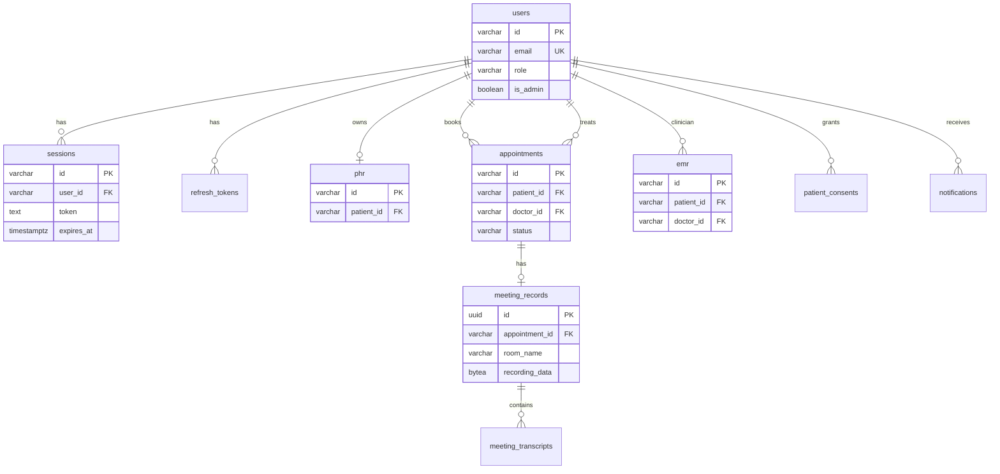

# สถาปัตยกรรมการจัดเก็บข้อมูล (Data Storage Architecture)

> **อัปเดต:** 2 มิถุนายน 2569 | **ขอบเขต:** As-is บน Google Cloud เท่านั้น  
> **หมายเหตุ:** โปรเจกต์นี้ **ไม่มี** Nextcloud ใน codebase

---

## สารบัญ

1. [ภาพรวม](#1-ภาพรวม)
2. [ฐานข้อมูลเชิงสัมพันธ์ (PostgreSQL / Cloud SQL)](#2-ฐานข้อมูลเชิงสัมพันธ์-postgresql--cloud-sql)
3. [การจัดเก็บไฟล์และข้อมูลไบนารี](#3-การจัดเก็บไฟล์และข้อมูลไบนารี)
4. [Data Sovereignty บน Google Cloud](#4-data-sovereignty-บน-google-cloud)
5. [การสำรองข้อมูลและการเก็บรักษา](#5-การสำรองข้อมูลและการเก็บรักษา)
6. [แผนภาพ Mermaid — ER Diagram](#6-แผนภาพ-mermaid--er-diagram)
7. [แผนภาพ draw.io — การจัดเก็บและสำรองข้อมูล](#7-แผนภาพ-drawio--การจัดเก็บและสำรองข้อมูล)

---

## 1. ภาพรวม

ระบบ Izara แยกการจัดเก็บเป็น 2 ประเภทหลัก:

| ประเภท | ที่เก็บจริง | ตัวอย่างข้อมูล |
|--------|------------|----------------|
| **Relational** | PostgreSQL (`izara_phase1`) | users, appointments, emr, phr |
| **ไฟล์/ไบนารี** | BYTEA ใน PostgreSQL, โฟลเดอร์ชั่วคราวบน Meeting Server, GCS (เมื่อตั้ง env) | วิดีโอบันทึกการประชุม, transcript |

---

## 2. ฐานข้อมูลเชิงสัมพันธ์ (PostgreSQL / Cloud SQL)

### 2.1 แหล่ง Schema

- ไฟล์หลัก: `scripts/database/izara-database.sql` (v5.1.0)
- Extensions: `uuid-ossp`, `pgcrypto`, `vector` (pgvector)
- Local: Docker `izara-postgres` พอร์ต host `5433`
- Cloud: Cloud SQL `izara-postgres-server` โปรเจกต์ `izara-telemedicine`

### 2.2 กลุ่มตารางหลัก

| กลุ่ม | ตาราง |
|-------|-------|
| ผู้ใช้และ auth | `users`, `sessions`, `password_resets`, `refresh_tokens` |
| ผู้ป่วย | `patient_profiles`, `phr`, `vital_signs`, `living_wills`, `patient_consents` |
| แพทย์ | `doctor_profiles`, `doctors`, `doctor_schedules` |
| นัดหมายและประชุม | `appointments`, `meeting_records`, `meeting_transcripts` |
| คลินิก | `emr`, `prescriptions`, `lab_orders` |
| ระบบ | `notifications`, `audit_logs`, `medical_content` |

### 2.3 Realtime (LISTEN/NOTIFY)

- ไฟล์: `scripts/database/v2.2.0-notify-triggers.sql`
- Channel: `data_changes`
- ใช้ sync UI ระหว่าง Patient/Doctor/Meeting Server ผ่าน Socket.IO

---

## 3. การจัดเก็บไฟล์และข้อมูลไบนารี

### 3.1 ในฐานข้อมูล (BYTEA)

ตาราง `meeting_records` มีคอลัมน์:

- `recording_data` (BYTEA)
- `recording_filename`, `recording_mimetype`, `recording_size_bytes`

### 3.2 บนดิสก์ Meeting Server (ชั่วคราว)

- ตัวแปร env: `RECORDINGS_DIR` (production ค่าเริ่มต้น `/tmp/recordings`)
- รูปแบบ path: `{RECORDINGS_DIR}/meetings/{doctorId}/{meetingId}/video.webm`
- HTTP playback: `/api/recordings/meetings/{doctorId}/{meetingId}/{filename}`

### 3.3 Google Cloud Storage (เมื่อตั้ง env)

- ตัวแปร: `GCS_BUCKET`
- Object key: `meetings/{doctorId}/{meetingId}/video.{ext}`
- ใช้ใน `Izara-jitsi-server/server/postMeetingPipeline.js` เมื่อ env ถูกกำหนด

### 3.4 นโยบายลบไฟล์บันทึก (Recording Retention)

จาก `Izara-jitsi-server/server/recordingCleanup.js` — ค่า `RECORDING_LOCAL_RETENTION`:

| ค่า | พฤติกรรม |
|-----|----------|
| `keep` | เก็บไฟล์ local (มักใช้ dev) |
| `delete_after_persist` | ลบหลังบันทึกลง DB |
| `delete_after_gcs` | ลบหลังอัปโหลด GCS |
| `delete` | ลบทันทีหลัง persist |

Production บน Cloud Run ใช้ `delete_after_persist` เป็นค่าเริ่มต้น

---

## 4. Data Sovereignty บน Google Cloud

ข้อมูลแอปพลิเคชันอยู่ในบริการ Google Cloud ภูมิภาค **asia-southeast1** (สิงคโปร์) ตามเอกสาร `Documents/docs/markdown/operations/CLOUD_ACCESS_TH.md`:

| องค์ประกอบ | รายละเอียด As-is |
|------------|------------------|
| **Cloud SQL** | ฐานข้อมูลหลัก `izara_phase1` |
| **Cloud Run** | Patient, Doctor, Meeting Server |
| **Secrets** | ผ่าน environment variables / Secret Manager ตาม deployment |
| **GCS** | เก็บ recording เมื่อเปิด `GCS_BUCKET` |

การแยกขอบเขตข้อมูล:

- ข้อมูลโครงสร้าง (นัดหมาย, EMR, ผู้ใช้) → PostgreSQL
- สื่อการประชุม → BYTEA และ/หรือ GCS ตามการตั้งค่า env

---

## 5. การสำรองข้อมูลและการเก็บรักษา

### 5.1 สำรองฐานข้อมูล

จาก `Processes/PostgreSQL_Database_Architecture.md` และ `scripts/database/README.md`:

| วิธี | คำสั่ง/เครื่องมือ |
|------|------------------|
| `pg_dump` | ผ่าน Docker: `docker exec izara-postgres pg_dump ...` |
| db-tool | `node scripts/database/db-tool.cjs --export` |
| Import | `--import-local`, `--import-dev` |

เอกสารระบุ: ควรสำรองก่อนรัน migration บน production

### 5.2 Session และ Token

- `sessions.expires_at` — หมดอายุตามที่ insert
- `refresh_tokens.expires_at` — 30 วัน
- JWT แพทย์ — 3 ชม.

---

## 6. แผนภาพ Mermaid — ER Diagram



---

## 7. แผนภาพ draw.io — การจัดเก็บและสำรองข้อมูล

```xml
<mxfile host="app.diagrams.net" agent="Isara-Storage-Doc" version="21.0.0">
  <diagram name="Data Storage and Backup" id="storage-backup-as-is">
    <mxGraphModel dx="1100" dy="700" grid="1" gridSize="10" guides="1" tooltips="1" connect="1" arrows="1" fold="1" page="1" pageScale="1" pageWidth="1200" pageHeight="700" math="0" shadow="0">
      <root>
        <mxCell id="0" />
        <mxCell id="1" parent="0" />
        <mxCell id="title" value="Izara — การจัดเก็บและสำรองข้อมูล (GCP As-is)" style="text;html=1;align=center;fontSize=16;fontStyle=1;" vertex="1" parent="1">
          <mxGeometry x="250" y="20" width="700" height="30" as="geometry" />
        </mxCell>
        <mxCell id="gcp" value="Google Cloud asia-southeast1" style="swimlane;startSize=28;fillColor=#ECEFF1;" vertex="1" parent="1">
          <mxGeometry x="40" y="70" width="520" height="380" as="geometry" />
        </mxCell>
        <mxCell id="crun" value="Cloud Run&#xa;Patient | Doctor | Meeting" style="rounded=1;whiteSpace=wrap;html=1;" vertex="1" parent="gcp">
          <mxGeometry x="30" y="45" width="200" height="60" as="geometry" />
        </mxCell>
        <mxCell id="cloudsql" value="Cloud SQL&#xa;izara_phase1&#xa;(relational + BYTEA)" style="shape=cylinder3;whiteSpace=wrap;html=1;boundedLbl=1;size=12;fillColor=#B39DDB;" vertex="1" parent="gcp">
          <mxGeometry x="280" y="40" width="200" height="90" as="geometry" />
        </mxCell>
        <mxCell id="gcs" value="GCS Bucket&#xa;(เมื่อ GCS_BUCKET ตั้งค่า)" style="shape=folder;fontStyle=1;spacingTop=10;fillColor=#CFD8DC;" vertex="1" parent="gcp">
          <mxGeometry x="30" y="140" width="200" height="70" as="geometry" />
        </mxCell>
        <mxCell id="tmpdir" value="Meeting Server /tmp/recordings&#xa;(ชั่วคราว Cloud Run)" style="rounded=1;whiteSpace=wrap;html=1;fillColor=#FFF3E0;" vertex="1" parent="gcp">
          <mxGeometry x="280" y="160" width="200" height="60" as="geometry" />
        </mxCell>
        <mxCell id="backup_box" value="การสำรองข้อมูล" style="swimlane;startSize=28;fillColor=#E8F5E9;" vertex="1" parent="1">
          <mxGeometry x="600" y="70" width="280" height="200" as="geometry" />
        </mxCell>
        <mxCell id="pgdump" value="pg_dump&#xa;(Docker / Cloud SQL)" style="rounded=1;whiteSpace=wrap;html=1;" vertex="1" parent="backup_box">
          <mxGeometry x="30" y="45" width="220" height="50" as="geometry" />
        </mxCell>
        <mxCell id="dbtool" value="db-tool.cjs&#xa;--export / --import" style="rounded=1;whiteSpace=wrap;html=1;" vertex="1" parent="backup_box">
          <mxGeometry x="30" y="110" width="220" height="50" as="geometry" />
        </mxCell>
        <mxCell id="rel_label" value="Relational: users, appointments, emr, phr..." style="text;html=1;align=left;fontSize=11;" vertex="1" parent="1">
          <mxGeometry x="60" y="470" width="400" height="30" as="geometry" />
        </mxCell>
        <mxCell id="file_label" value="ไฟล์: recording BYTEA | local tmp | GCS" style="text;html=1;align=left;fontSize=11;" vertex="1" parent="1">
          <mxGeometry x="60" y="500" width="400" height="30" as="geometry" />
        </mxCell>
        <mxCell id="e_sql" value="read/write" style="endArrow=classic;" edge="1" parent="1" source="crun" target="cloudsql">
          <mxGeometry relative="1" as="geometry" />
        </mxCell>
        <mxCell id="e_gcs" value="upload ถ้า env" style="endArrow=classic;dashed=1;" edge="1" parent="1" source="crun" target="gcs">
          <mxGeometry relative="1" as="geometry" />
        </mxCell>
        <mxCell id="e_backup" value="backup" style="endArrow=classic;" edge="1" parent="1" source="pgdump" target="cloudsql">
          <mxGeometry relative="1" as="geometry" />
        </mxCell>
      </root>
    </mxGraphModel>
  </diagram>
</mxfile>
```

---

## เอกสารอ้างอิงใน repo

- `scripts/database/izara-database.sql`
- `Processes/PostgreSQL_Database_Architecture.md`
- `Izara-jitsi-server/server/recordingCleanup.js`
- `Izara-jitsi-server/server/postMeetingPipeline.js`
