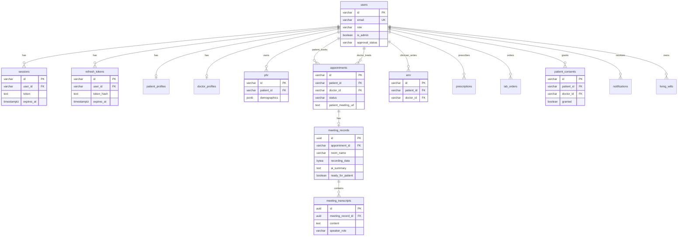

# สถาปัตยกรรมการจัดเก็บข้อมูล (Data Storage Architecture)

> **อัปเดต:** 2 มิถุนายน 2569 | **ขอบเขต:** As-is บน Google Cloud เท่านั้น  
> **หมายเหตุสำคัญ:** โปรเจกต์นี้ **ไม่มี Nextcloud** ใน codebase — การจัดเก็บไฟล์ใช้ PostgreSQL, ดิสก์ชั่วคราวบน Meeting Server, และ GCS (เมื่อตั้ง env)  
> **เอกสารก่อนหน้า:** [02 Authentication](02_Authentication_and_Authorization.md) · **ถัดไป:** [04 Jitsi](04_Jitsi_Integration_and_Code_Examples.md)

---

## สารบัญ

1. [ภาพรวมการจัดเก็บ](#1-ภาพรวมการจัดเก็บ)
2. [ฐานข้อมูลเชิงสัมพันธ์ (PostgreSQL / Cloud SQL)](#2-ฐานข้อมูลเชิงสัมพันธ์-postgresql--cloud-sql)
3. [ตารางหลักและความสัมพันธ์](#3-ตารางหลักและความสัมพันธ์)
4. [JSONB และ pgvector](#4-jsonb-และ-pgvector)
5. [การจัดเก็บไฟล์และข้อมูลไบนารี](#5-การจัดเก็บไฟล์และข้อมูลไบนารี)
6. [Data Sovereignty บน Google Cloud](#6-data-sovereignty-บน-google-cloud)
7. [Realtime — LISTEN/NOTIFY](#7-realtime--listennotify)
8. [การสำรองข้อมูลและการเก็บรักษา](#8-การสำรองข้อมูลและการเก็บรักษา)
9. [Migration และเครื่องมือ DB](#9-migration-และเครื่องมือ-db)
10. [แผนภาพ Mermaid — ER Diagram](#10-แผนภาพ-mermaid--er-diagram)
11. [แผนภาพ draw.io](#11-แผนภาพ-drawio)
12. [เอกสารอ้างอิง](#12-เอกสารอ้างอิง)
13. [ภาคผนวก — สังเคราะห์จาก Processes (ข้อมูล/หน้าจอ)](#13-ภาคผนวก--สังเคราะห์จาก-processes-ข้อมูลหน้าจอ)

---

## 1. ภาพรวมการจัดเก็บ

ระบบ Izara แยกข้อมูลออกเป็น **สองชั้นหลัก** ตามที่ implement จริง:

| ชั้น | ที่เก็บ | ชนิดข้อมูล | ตัวอย่าง |
|------|---------|------------|----------|
| **Relational** | PostgreSQL `izara_phase1` | โครงสร้าง, ความสัมพันธ์, ข้อความ | users, appointments, emr, phr |
| **Binary / Media** | BYTEA ใน DB, `/tmp/recordings`, GCS | วิดีโอ/เสียงบันทึกประชุม | `meeting_records.recording_data` |

```text
┌──────────────────────────────────────────────────────────────┐
│  APPLICATION DATA (โครงสร้าง + คลินิก + auth)               │
│  → Cloud SQL / Docker PostgreSQL  izara_phase1               │
├──────────────────────────────────────────────────────────────┤
│  MEETING MEDIA (วิดีโอ/เสียง)                                 │
│  → BYTEA (persist) + ชั่วคราว Cloud Run disk + GCS (optional) │
└──────────────────────────────────────────────────────────────┘
```

---

## 2. ฐานข้อมูลเชิงสัมพันธ์ (PostgreSQL / Cloud SQL)

### 2.1 ข้อมูลพื้นฐาน

| รายการ | ค่า |
|--------|-----|
| ชื่อฐานข้อมูล | `izara_phase1` |
| เวอร์ชัน | PostgreSQL **18** |
| Schema master | `scripts/database/izara-database.sql` (v5.1.0) |
| Extensions | `uuid-ossp`, `pgcrypto`, `vector` (pgvector) |

### 2.2 การเชื่อมต่อ — Local (Docker)

| รายการ | ค่า |
|--------|-----|
| Container | `izara-postgres` |
| Host จากเครื่อง dev | `localhost:5433` |
| ภายใน Docker network | `postgres:5432` |
| User/DB | จาก `.env.docker` (`POSTGRES_USER`, `POSTGRES_DB`) |
| Init | SQL ใน `/docker-entrypoint-initdb.d/` |

### 2.3 การเชื่อมต่อ — Google Cloud

| รายการ | ค่า (ตามเอกสารใน repo) |
|--------|-------------------------|
| Production / dev-testing | Cloud SQL instance `izara-postgres-server` |
| Region | `asia-southeast1` |
| Project | `izara-telemedicine` |
| Connection | `DATABASE_URL` ใน env ของ Cloud Run services |

เอกสาร `Processes/PostgreSQL_Database_Architecture.md` ยังอ้าง GCE VM `35.240.157.230` สำหรับบาง environment — ตรวจ env จริงของ deployment ที่ใช้งาน

### 2.4 จำนวนตารางโดยประมาณ

จาก `Processes/PostgreSQL_Database_Architecture.md` — **37+ ตาราง** ใน schema หลัก + ตารางเพิ่มจาก migrations ใน `scripts/database/migrations/`

---

## 3. ตารางหลักและความสัมพันธ์

### 3.1 กลุ่มตาราง (สรุป)

| กลุ่ม | ตาราง | จำนวนโดยประมาณ |
|-------|-------|----------------|
| User & Auth | `users`, `sessions`, `password_resets`, `refresh_tokens`, `device_tokens`, `biometric_credentials` | 6 |
| Patient | `patient_profiles`, `phr`, `vital_signs`, `living_wills`, `living_will_versions`, `patient_consents`, `push_subscriptions` | 7 |
| Doctor | `doctor_profiles`, `doctors`, `doctor_schedules`, `doctor_reviews`, `consultants` | 5 |
| Appointment & Meeting | `appointments`, `meeting_records`, `meeting_transcripts` | 3+ |
| Clinical | `emr`, `prescriptions`, `lab_orders` | 3+ |
| Content & AI | `medical_content`, `clinical_resources`, `knowledge_base`, `ai_chat_history`, `transcript_embeddings` | หลายตาราง |
| System | `notifications`, `audit_logs`, `user_settings`, `sync_queue` | หลายตาราง |

### 3.2 ตาราง `users` (ศูนย์กลาง)

| คอลัมน์สำคัญ | ความหมาย |
|--------------|----------|
| `id` | PK (VARCHAR) |
| `email` | UNIQUE |
| `password_hash` | bcrypt |
| `role` | `patient` \| `doctor` \| `admin` |
| `patient_id` / `doctor_id` | อ้างอิงบทบาท |
| `is_admin`, `admin_privileges` | แอดมิน |
| `approval_status`, `is_approved` | workflow แพทย์ |
| `preferences`, `notification_settings` | JSONB |

### 3.3 ตาราง `appointments`

| คอลัมน์สำคัญ | ความหมาย |
|--------------|----------|
| `patient_id`, `doctor_id` | FK → `users` |
| `status` | lifecycle (pending, in_pool, confirmed, …) |
| `symptoms`, `ai_triage` | JSONB |
| `jitsi_room_name`, `doctor_meeting_url`, `patient_meeting_url`, `guest_meeting_url` | ลิงก์ประชุม |
| `confirmed_by`, `confirmed_at` | การยืนยันนัด |

### 3.4 ตาราง `meeting_records`

| คอลัมน์สำคัญ | ความหมาย |
|--------------|----------|
| `id` | UUID PK |
| `appointment_id` | FK |
| `room_name`, `jitsi_domain` | Jitsi |
| `meeting_url`, `doctor_url`, `patient_url`, `guest_url` | URL แยกบทบาท |
| `status` | scheduled, active, completed, … |
| `meeting_config` | JSONB (lobby, hostRole, …) |
| `transcript`, `ai_summary` | ข้อความ |
| `recording_data` | **BYTEA** — ไฟล์บันทึกในฐานข้อมูล |
| `doctor_validation_status`, `ready_for_patient` | man-in-the-loop |

### 3.5 ตาราง `emr` และ `phr`

| ตาราง | ผู้เป็นเจ้าของข้อมูล | การใช้ |
|-------|---------------------|--------|
| `phr` | ผู้ป่วย | ประวัติสุขภาพส่วนบุคคล — JSONB หลายฟิลด์ |
| `emr` | แพทย์บันทึกต่อ patient/appointment | SOAP, การวินิจฉัย |

---

## 4. JSONB และ pgvector

### 4.1 JSONB

ใช้กว้างขวางสำหรับข้อมูลที่ยืดหยุ่น:

- `phr.demographics`, `phr.allergies`, `phr.medications`
- `appointments.symptoms`
- `meeting_records.meeting_config`, `section_summaries`
- `users.preferences`, `users.admin_privileges`

### 4.2 pgvector

- Extension `vector` ติดตั้งตอน init
- ใช้ใน `knowledge_base`, `ai_chat_history` (embedding 768 มิติ) สำหรับค้นหา similarity / RAG

---

## 5. การจัดเก็บไฟล์และข้อมูลไบนารี

### 5.1 ในฐานข้อมูล — BYTEA

ตาราง `meeting_records`:

```sql
recording_data           BYTEA,
recording_filename       TEXT,
recording_mimetype       TEXT DEFAULT 'audio/webm',
recording_size_bytes     INTEGER,
recording_started_at     TIMESTAMPTZ,
recording_stopped_at     TIMESTAMPTZ,
```

Pipeline หลังประชุมอาจ persist ลง `recording_data` ก่อนลบไฟล์ชั่วคราว

### 5.2 ดิสก์ชั่วคราว — Meeting Server

| รายการ | ค่า |
|--------|-----|
| Env | `RECORDINGS_DIR` |
| Production default | `/tmp/recordings` |
| รูปแบบ path | `meetings/{doctorId}/{meetingId}/video.webm` |
| HTTP serve | `GET /api/recordings/meetings/{doctorId}/{meetingId}/{filename}` |
| เหตุผล | Cloud Run มี ephemeral filesystem — ไม่ถือเป็น storage ถาวร |

### 5.3 Google Cloud Storage (เมื่อตั้ง env)

| รายการ | ค่า |
|--------|-----|
| Env | `GCS_BUCKET` |
| Object key | `meetings/{doctorId}/{meetingId}/video.{ext}` |
| Code | `Izara-jitsi-server/server/postMeetingPipeline.js` → `uploadToGcs` |
| เงื่อนไข | ทำงานเมื่อ env ถูกกำหนดเท่านั้น — ไม่บังคับในทุก deployment |

### 5.4 นโยบายลบไฟล์ local (`recordingCleanup.js`)

| `RECORDING_LOCAL_RETENTION` | พฤติกรรม |
|-----------------------------|----------|
| `keep` | เก็บไฟล์บน disk (มัก dev) |
| `delete_after_persist` | ลบหลังบันทึกลง PostgreSQL (**default prod**) |
| `delete_after_gcs` | ลบหลังอัปโหลด GCS สำเร็จ |
| `delete` | ลบทันทีหลัง persist |

Production Cloud Run: sweep โฟลเดอร์ว่างทุกชั่วโมง (`RECORDING_SWEEP_INTERVAL_MS`)

### 5.5 เปรียบเทียบชั้นการเก็บ (As-is)

| ชั้น | เหมาะกับ | ถาวร? |
|------|----------|-------|
| PostgreSQL relational | ธุรกิจ, คลินิก, auth | ใช่ (Cloud SQL) |
| PostgreSQL BYTEA | recording ขนาดเล็ก-กลาง | ใช่ |
| `/tmp/recordings` | ประมวลผลระหว่าง upload | ไม่ (ephemeral) |
| GCS | recording ขนาดใหญ่ (ถ้าเปิด env) | ใช่ (ใน bucket GCP) |

---

## 6. Data Sovereignty บน Google Cloud

ข้อมูลแอปพลิเคชันอยู่ในบริการ **Google Cloud Platform** ภูมิภาค **asia-southeast1** (สิงคโปร์)

| องค์ประกอบ | รายละเอียด As-is |
|------------|------------------|
| **Cloud SQL** | ฐานข้อมูลหลัก — ข้อมูลผู้ป่วย/คลินิก/นัดหมาย |
| **Cloud Run** | รัน Patient, Doctor, Meeting — ไม่เก็บข้อมูลถาวรบน instance |
| **GCS** | วิดีโอบันทึก (ถ้า `GCS_BUCKET` ตั้งค่า) — อยู่ใน project/region เดียวกัน |
| **Secrets** | `JWT_SECRET`, `DATABASE_URL`, API keys ผ่าน env / Secret Manager |
| **External** | Jitsi (`meet.jit.si`), Gemini, Google Maps — ส่งเฉพาะข้อมูลที่ API ต้องการ |

การแยกขอบเขตตาม PDPA ในแอป: `patient_consents` ควบคุมว่าแพทย์คนใดเข้าถึง PHR ของผู้ป่วยคนใดได้

---

## 7. Realtime — LISTEN/NOTIFY

### 7.1 กลไก

1. Trigger บนตาราง (เช่น `appointments`, `notifications`) ส่ง `pg_notify('data_changes', payload)`
2. ไฟล์: `scripts/database/v2.2.0-notify-triggers.sql`
3. แต่ละ service: `LISTEN data_changes` ผ่าน `pgNotifyListener` หรือเทียบเท่า
4. แปลงเป็น Socket.IO event → UI อัปเดต

### 7.2 ผลต่อ UX

| เหตุการณ์ | UI ที่อัปเดต |
|-----------|--------------|
| เปลี่ยนสถานะนัด | Patient appointments, Doctor queue, Admin pool |
| แจ้งเตือนใหม่ | Notification bell |
| อัปเดต meeting | Dashboard ประชุม |

---

## 8. การสำรองข้อมูลและการเก็บรักษา

### 8.1 สำรองฐานข้อมูล

จาก `Processes/PostgreSQL_Database_Architecture.md` §11 และ `scripts/database/README.md`:

| วิธี | คำสั่งตัวอย่าง |
|------|----------------|
| pg_dump ผ่าน Docker | `docker exec izara-postgres pg_dump -U postgres izara_phase1 > backup.sql` |
| db-tool export | `node scripts/database/db-tool.cjs --export` |
| db-tool import local | `node scripts/database/db-tool.cjs --import-local` |
| db-tool import dev | `node scripts/database/db-tool.cjs --import-dev` |

เอกสารระบุ: **ควรสำรองก่อนรัน migration บน production**

### 8.2 อายุข้อมูล Session/Token (ไม่ใช่ backup แต่เป็น retention logic)

| ข้อมูล | อายุ |
|--------|------|
| Patient `sessions` | 7 วัน (`expires_at`) |
| Doctor JWT | 3 ชม. |
| `refresh_tokens` | 30 วัน |
| Recording local disk | ลบตาม `RECORDING_LOCAL_RETENTION` |

### 8.3 Cloud SQL Backup (ระดับ GCP)

การสำรองอัตโนมัติของ Cloud SQL เป็นความสามารถของ GCP — การตั้งค่าจริงอยู่ที่ console/ IaC ของ deployment ไม่ได้ hard-code ใน repo แอป

---

## 9. Migration และเครื่องมือ DB

### 9.1 ไฟล์ Migration สำคัญ (ใน repo)

| ไฟล์ | เนื้อหา |
|------|---------|
| `migrations/v2.0.0-phase2-tables.sql` | device_tokens, sync_queue, user_settings |
| `migrations/v2.1.0-phase2-ai-his.sql` | ตาราง AI/HIS เพิ่ม |
| `migrations/v2.2.0-ai-specialty-matching.sql` | appointment_ai_suggestions |
| `migrations/add_meeting_url_columns.sql` | คอลัมน์ Jitsi บน appointments |
| `v2.2.0-notify-triggers.sql` | NOTIFY triggers |
| `migrations/pdpa-access-control-migration.sql` | access_audit |

### 9.2 db-tool.cjs

เครื่องมือ CLI ใน `scripts/database/db-tool.cjs` สำหรับ fix, seed, verify, migrate, export/import — ใช้ใน workflow dev และ ops ตาม README

---

## 10. แผนภาพ Mermaid — ER Diagram



---

## 11. แผนภาพ draw.io

```xml
<mxfile host="app.diagrams.net" agent="Isara-Storage-Doc-v2" version="21.0.0">
  <diagram name="Data Storage and Backup" id="storage-backup-as-is">
    <mxGraphModel dx="1200" dy="750" grid="1" gridSize="10" guides="1" tooltips="1" connect="1" arrows="1" fold="1" page="1" pageScale="1" pageWidth="1300" pageHeight="750" math="0" shadow="0">
      <root>
        <mxCell id="0" />
        <mxCell id="1" parent="0" />
        <mxCell id="title" value="Izara — การจัดเก็บและสำรองข้อมูล (GCP As-is)" style="text;html=1;align=center;fontSize=16;fontStyle=1;" vertex="1" parent="1">
          <mxGeometry x="250" y="15" width="800" height="30" as="geometry" />
        </mxCell>
        <mxCell id="gcp" value="Google Cloud asia-southeast1" style="swimlane;startSize=28;fillColor=#ECEFF1;" vertex="1" parent="1">
          <mxGeometry x="40" y="60" width="560" height="420" as="geometry" />
        </mxCell>
        <mxCell id="crun" value="Cloud Run&#xa;Patient | Doctor | Meeting" style="rounded=1;whiteSpace=wrap;html=1;" vertex="1" parent="gcp">
          <mxGeometry x="25" y="40" width="220" height="55" as="geometry" />
        </mxCell>
        <mxCell id="cloudsql" value="Cloud SQL izara_phase1&#xa;Relational + BYTEA + pgvector" style="shape=cylinder3;whiteSpace=wrap;html=1;boundedLbl=1;size=12;fillColor=#B39DDB;" vertex="1" parent="gcp">
          <mxGeometry x="280" y="35" width="250" height="95" as="geometry" />
        </mxCell>
        <mxCell id="gcs" value="GCS Bucket&#xa;(เมื่อ GCS_BUCKET)" style="shape=folder;fillColor=#CFD8DC;" vertex="1" parent="gcp">
          <mxGeometry x="25" y="130" width="220" height="65" as="geometry" />
        </mxCell>
        <mxCell id="tmpdir" value="/tmp/recordings&#xa;Meeting Server ephemeral" style="rounded=1;fillColor=#FFF3E0;" vertex="1" parent="gcp">
          <mxGeometry x="280" y="160" width="250" height="55" as="geometry" />
        </mxCell>
        <mxCell id="notify" value="LISTEN/NOTIFY data_changes&#xa;→ Socket.IO" style="rounded=1;fillColor=#C8E6C9;" vertex="1" parent="gcp">
          <mxGeometry x="25" y="220" width="505" height="45" as="geometry" />
        </mxCell>
        <mxCell id="ext" value="External: meet.jit.si (media) · Gemini (API)" style="text;html=1;align=center;fontSize=11;" vertex="1" parent="gcp">
          <mxGeometry x="25" y="290" width="505" height="30" as="geometry" />
        </mxCell>
        <mxCell id="backup_box" value="การสำรอง (Ops)" style="swimlane;startSize=28;fillColor=#E8F5E9;" vertex="1" parent="1">
          <mxGeometry x="640" y="60" width="300" height="220" as="geometry" />
        </mxCell>
        <mxCell id="pgdump" value="pg_dump&#xa;docker exec izara-postgres" style="rounded=1;whiteSpace=wrap;html=1;" vertex="1" parent="backup_box">
          <mxGeometry x="25" y="45" width="250" height="50" as="geometry" />
        </mxCell>
        <mxCell id="dbtool" value="db-tool.cjs&#xa;--export | --import-local | --import-dev" style="rounded=1;whiteSpace=wrap;html=1;" vertex="1" parent="backup_box">
          <mxGeometry x="25" y="110" width="250" height="50" as="geometry" />
        </mxCell>
        <mxCell id="note" value="ไม่มี Nextcloud ในโปรเจกต์" style="text;html=1;align=left;fontStyle=2;fontSize=11;" vertex="1" parent="1">
          <mxGeometry x="40" y="500" width="400" height="25" as="geometry" />
        </mxCell>
        <mxCell id="e_sql" value="SQL" style="endArrow=classic;" edge="1" parent="1" source="crun" target="cloudsql">
          <mxGeometry relative="1" as="geometry" />
        </mxCell>
        <mxCell id="e_gcs" value="optional" style="endArrow=classic;dashed=1;" edge="1" parent="1" source="crun" target="gcs">
          <mxGeometry relative="1" as="geometry" />
        </mxCell>
        <mxCell id="e_backup" value="backup" style="endArrow=classic;" edge="1" parent="1" source="pgdump" target="cloudsql">
          <mxGeometry relative="1" as="geometry" />
        </mxCell>
      </root>
    </mxGraphModel>
  </diagram>
</mxfile>
```

---

## 12. เอกสารอ้างอิง

| ไฟล์ | เนื้อหา |
|------|---------|
| `scripts/database/izara-database.sql` | Schema master |
| `scripts/database/README.md` | db-tool, backup คำแนะนำ |
| `Processes/PostgreSQL_Database_Architecture.md` | ERD และตารางละเอียด |
| `Processes/Data_Sync_Documentation.md` | NOTIFY, sync patterns |
| `Processes/Health_Records_Processes.md` | PHR/EMR flow |
| `Izara-jitsi-server/server/postMeetingPipeline.js` | Persist + GCS |
| `Izara-jitsi-server/server/recordingCleanup.js` | Retention local |

---

## 13. ภาคผนวก — สังเคราะห์จาก Processes (ข้อมูล/หน้าจอ)

### 13.1 แมปหน้าจอ → กลุ่มตาราง (จากสเปกแต่ละหน้า)

| กลุ่มตาราง | หน้า Processes ที่เขียน § PostgreSQL Integration |
|------------|--------------------------------------------------|
| User Mgmt | Patient 01–03, 12; Doctor 01–02, 16, 18–19 |
| Patient Data | Patient 06, 10–11, 14; Doctor 05, 11 |
| Appointments | Patient 04–05; Doctor 03–04, 06, 17, 20–21 |
| Clinical | Doctor 08–10, 11; Patient 14 (read) |
| Meetings | Patient 05; Doctor 06–07; Meeting 00 |
| Content/AI | Patient 07–08; Doctor 13–15, 14 |
| Audit/Notify | Patient 15; Doctor 03 |

### 13.2 `PostgreSQL_Database_Architecture.md` — สาระที่สะท้อนแล้ว

| หัวข้อใน Processes | ในเอกสาร 03 |
|-------------------|-------------|
| 37+ tables, 8 categories | §3 |
| Extensions uuid-ossp, pgcrypto, vector | §2, §4 |
| LISTEN/NOTIFY `data_changes` | §7 |
| Migration scripts ใน `docker-entrypoint-initdb.d/` | §9 |
| Access control matrix | §2 + เอกสาร 02 PDPA |
| Backup pg_dump / db-tool | §8 |

> **As-is บน GCP:** การ deploy จริงใช้ **Cloud SQL** (`izara-postgres-server`) ตาม `CLOUD_ACCESS_TH.md` — สเปก Processes บางส่วนอ้าง GCE VM เป็นประวัติการ deploy ในเอกสาร ENRICH; โค้ดและ Cloud Run ชี้ Cloud SQL

### 13.3 `Data_Sync_Documentation.md`

- การเปลี่ยน `appointments` → NOTIFY → Socket.IO → อัปเดต Dashboard/Pool/Queue โดยไม่ refresh
- Idempotent `meeting_records` ตาม `appointment_id`
- ฟิลด์ ownership (`doctorId`, `assignedDoctorId`, `confirmedBy`) ต้องสอดคล้องกับ filter UI

### 13.4 `Health_Records_Processes.md` + หน้าคลินิก

| ขั้นตอน | ตาราง | หน้าที่เกี่ยวข้อง |
|---------|-------|------------------|
| ผู้ป่วยกรอก PHR | `phr`, `vital_signs` | Patient 06 |
| แพทย์เขียน EMR | `emr` (SOAP JSONB) | Doctor 08 |
| AI ร่างจากประชุม | `meeting_records`, `ai_validations` | Doctor 06–08 |
| สั่งยา/lab | `prescriptions`, `lab_orders`, `cds_logs` | Doctor 09–10 |
| ผู้ป่วยอ่านผล | Timeline, PHR — `ready_for_patient` | Patient 14, 06 |

### 13.5 Living Will & PDPA

| Processes | ตาราง | หมายเหตุ |
|-----------|-------|----------|
| `Living_Will_Processes.md`, `Living_Will_Implementation_Plan.md` | `living_wills`, `living_will_versions` | Patient 11 |
| `Patient-Portal/10_PDPA_Page.md` | `patient_consents` | แยกจาก living will |

### 13.6 เนื้อหาและ RAG

| Processes | ตาราง | หน้า |
|-----------|-------|------|
| `Medicine_Content_Processes.md` | `medical_content`, `drugs` | Patient 08, Doctor 13 |
| `Clinical_Resources_&_Medical_Library_Workflows.md` | `clinical_resources`, `knowledge_base`, embeddings | Doctor 14, Patient 07 |

### 13.7 การจัดเก็บบันทึกประชุม (จาก Doctor 06 + Meeting 00)

| ขั้น | ที่เก็บ |
|------|---------|
| อัปโหลด ≤50MB | `POST .../save-recording` → BYTEA หรือ path |
| ชั่วคราว | `/tmp/recordings` บน Meeting Server |
| Production (ถ้ามี env) | GCS `meetings/{doctorId}/{meetingId}/video.webm` |
| Transcript | `meeting_transcripts`, `transcriptions_embeddings` |

---

**ไฟล์ถัดไป:** [04_Jitsi_Integration_and_Code_Examples.md](04_Jitsi_Integration_and_Code_Examples.md)
