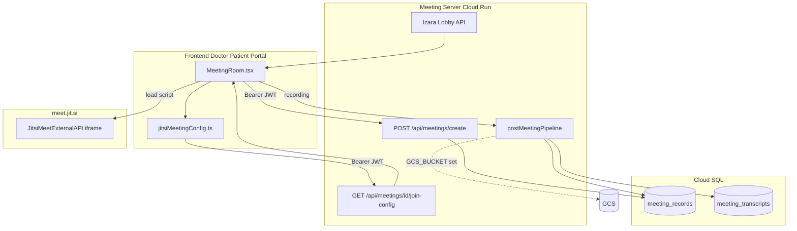

# การเชื่อมโยง Jitsi และโค้ดตัวอย่าง (Jitsi Integration & Code Examples)

> **อัปเดต:** 2 มิถุนายน 2569 | **ขอบเขต:** As-is ตาม codebase Isara-Anywhere เท่านั้น

---

## สารบัญ

1. [ภาพรวมการเชื่อมต่อ](#1-ภาพรวมการเชื่อมต่อ)
2. [กลไก API และ Webhook](#2-กลไก-api-และ-webhook)
3. [โค้ดตัวอย่าง — ทีมพี่เบียร์ (Frontend)](#3-โค้ดตัวอย่าง--ทีมพี่เบียร์-frontend)
4. [โค้ดตัวอย่าง — ทีมพี่ต้นชนินทร์ (Backend / Infrastructure)](#4-โค้ดตัวอย่าง--ทีมพี่ต้นชนินทร์-backend--infrastructure)
5. [แผนภาพ Mermaid — Flowchart](#5-แผนภาพ-mermaid--flowchart)
6. [แผนภาพ draw.io — Network Topology](#6-แผนภาพ-drawio--network-topology)

---

## 1. ภาพรวมการเชื่อมต่อ

| องค์ประกอบ | ค่าที่ใช้จริง |
|------------|---------------|
| โดเมน Jitsi (production) | `meet.jit.si` |
| Meeting Server | `Izara-jitsi-server` พอร์ต 3020 |
| Lobby | **Izara Lobby** บน Meeting Server — ปิด Jitsi lobby (`enableLobby=false`) |
| Host ประชุม | แพทย์ที่ได้รับมอบหมายเท่านั้น (`hostRole: doctor`) |

บน `meet.jit.si` ระบบ **ไม่ส่ง** JWT moderator ของ Jitsi (public SaaS ไม่รองรับ) — ใช้ Izara lobby + แพทย์เข้าห้องก่อนแทน

---

## 2. กลไก API และ Webhook

### 2.1 API หลัก (Meeting Server)

| Method | Path | หน้าที่ |
|--------|------|---------|
| POST | `/api/meetings/create` | สร้างห้อง + INSERT `meeting_records` |
| GET | `/api/meetings/:id/join-config` | คืน domain, roomName, jwt (ถ้า self-hosted) |
| POST | `/api/meetings/:id/host-present` | แจ้งว่าแพทย์เข้าห้องแล้ว |
| POST | `/api/meetings/:id/host-ready` | admit ผู้ป่วยจาก lobby |
| POST | `/api/meetings/:id/save-recording` | อัปโหลดบันทึกจาก client |
| POST | `/api/webhooks/jibri-recording` | รับไฟล์จาก Jibri (self-hosted เท่านั้น) |

### 2.2 ชื่อห้อง (Room Name)

รูปแบบ: `izara-{appointmentId 12 ตัว}-{timestamp base36}` หรือรับ `roomName` จาก client

### 2.3 JWT สำหรับ Jitsi (self-hosted)

เปิดใช้เมื่อ:

- มี `JITSI_JWT_SECRET` / `JITSI_APP_SECRET`
- โดเมน **ไม่ใช่** `meet.jit.si`
- ไม่ได้ตั้ง `JITSI_FORCE_JWT_ON_PUBLIC=1`

---

## 3. โค้ดตัวอย่าง — ทีมพี่เบียร์ (Frontend)

ไฟล์อ้างอิง: `Isara-doctor-portal/src/utils/jitsiMeetingConfig.ts`, `MeetingRoom.tsx`

### 3.1 ดึง config เข้าห้องพร้อม Bearer Token

```typescript
/**
 * เรียก Meeting Server เพื่อรับ domain, roomName และ jwt (ถ้ามี)
 * ส่ง JWT ของแพทย์/ผู้ป่วยใน Authorization header
 */
export async function fetchMeetingJoinConfig(
  meetingServerUrl: string,
  meetingId: string,
  role: JitsiMeetingRole,
  displayName?: string,
  token?: string | null,
): Promise<MeetingJoinConfig | null> {
  try {
    const q = new URLSearchParams({ role });
    if (displayName?.trim()) q.set('name', displayName.trim());
    const headers: Record<string, string> = {};
    // แนบ token แอป Izara — Meeting Server ตรวจด้วย jwtPolicy
    if (token) headers.Authorization = `Bearer ${token}`;
    const res = await fetch(
      `${meetingServerUrl}/api/meetings/${meetingId}/join-config?${q}`,
      { headers },
    );
    if (!res.ok) return null;
    return res.json();
  } catch {
    return null;
  }
}
```

### 3.2 เลือก JWT สำหรับ Jitsi (เฉพาะ self-hosted)

```typescript
/**
 * บน meet.jit.si ไม่ส่ง jwt — คืน undefined
 * บนโดเมน Jitsi ขององค์กรเอง ใช้ cfg.jwt จาก join-config
 */
export function pickJitsiJwt(
  cfg: MeetingJoinConfig | null | undefined,
  explicit?: string | null,
): string | undefined {
  if (cfg?.tokenAuthEnabled === false) return undefined;
  const domain = cfg?.domain || resolveJitsiDomain();
  if (domain === 'meet.jit.si' || domain.endsWith('.jit.si')) return undefined;
  const token = cfg?.jwt || explicit;
  return token && String(token).length > 10 ? String(token) : undefined;
}
```

### 3.3 ตั้งค่า External API — ปิด Jitsi lobby

```typescript
export function getJitsiExternalApiOptions(role: JitsiMeetingRole, displayName: string) {
  const isHost = role === 'doctor' || role === 'admin' || role === 'host';
  return {
    configOverwrite: {
      prejoinPageEnabled: false,
      defaultLanguage: 'th',
      // Izara lobby จัดการ admission — ไม่ใช้ lobby ของ Jitsi
      enableLobby: false,
      lobbyModeEnabled: false,
      startWithAudioMuted: !isHost,
    },
    interfaceConfigOverwrite: {
      APP_NAME: 'Izara Telemedicine',
      SHOW_JITSI_WATERMARK: false,
    },
  };
}
```

### 3.4 MeetingRoom — Header สำหรับ API ประชุม

```typescript
// จาก MeetingRoom.tsx — ใช้ JWT แพทย์จาก authServices
function getAuthHeaders(): Record<string, string> {
  const token = getToken();
  const headers: Record<string, string> = { 'Content-Type': 'application/json' };
  if (token) headers['Authorization'] = `Bearer ${token}`;
  return headers;
}
```

---

## 4. โค้ดตัวอย่าง — ทีมพี่ต้นชนินทร์ (Backend / Infrastructure)

ไฟล์อ้างอิง: `Izara-jitsi-server/server/index.js`, `jitsiConfig.js`, `postMeetingPipeline.js`

### 4.1 สร้าง JWT บทบาทใน Jitsi (self-hosted)

```javascript
/**
 * สร้าง JWT สำหรับ Jitsi — ใช้ได้เมื่อ JITSI_TOKEN_AUTH_ENABLED = true
 * แพทย์/host ได้ moderator: true
 */
function createJitsiRoleJwt(roomName, user = {}, role = 'guest') {
  if (!JITSI_TOKEN_AUTH_ENABLED) return null;
  const normalizedRole = String(role || '').toLowerCase();
  const isModerator =
    normalizedRole === 'doctor' ||
    normalizedRole === 'host' ||
    normalizedRole === 'moderator';
  const now = Math.floor(Date.now() / 1000);
  return jwt.sign(
    {
      aud: 'jitsi',
      iss: JITSI_TOKEN_ISSUER,
      sub: JITSI_DOMAIN,
      room: roomName,
      nbf: now - 10,
      exp: now + 4 * 60 * 60,
      context: {
        user: {
          id: user.id || '',
          name: user.name || 'Guest',
          email: user.email || '',
          affiliation: isModerator ? 'owner' : 'member',
          moderator: isModerator,
        },
      },
    },
    JITSI_SIGNING_SECRET,
    { algorithm: 'HS256' },
  );
}
```

### 4.2 สร้างห้องและบันทึก PostgreSQL

```javascript
// POST /api/meetings/create — สรุปจาก index.js
const meetingId = uuidv4();
const roomName =
  providedRoomName ||
  `izara-${appointmentId?.substring(0, 12) || meetingId.substring(0, 8)}-${Date.now().toString(36)}`;

const doctorJwt = createJitsiRoleJwt(roomName, { id: doctorId, name: doctorName }, 'doctor');
const urls = buildMeetingUrls(JITSI_DOMAIN, roomName, { doctorJwt, /* ... */ });

await pool.query(
  `INSERT INTO meeting_records (
    id, appointment_id, doctor_id, patient_id, room_name, jitsi_domain,
    meeting_url, doctor_url, patient_url, guest_url, status, meeting_config, created_at
  ) VALUES ($1, $2, $3, $4, $5, $6, $7, $8, $9, $10, $11, $12, NOW())
  RETURNING *`,
  [
    meetingId,
    safeAppointmentId,
    safeDoctorId,
    safePatientId,
    roomName,
    JITSI_DOMAIN,
    meetingUrl,
    doctorUrl,
    patientUrl,
    guestUrl,
    'scheduled',
    JSON.stringify({
      lobbyEnabled: true,
      hostRole: 'doctor',
      tokenAuthEnabled: JITSI_TOKEN_AUTH_ENABLED,
    }),
  ],
);
```

### 4.3 Environment ที่เกี่ยวข้อง (จาก `.env.example`)

```bash
# โดเมน Jitsi — production ใช้ meet.jit.si
JITSI_DOMAIN=meet.jit.si
MEETING_SERVER_URL=http://localhost:3020

# JWT แอป Izara (ตรงกับ Doctor Portal)
JWT_SECRET=your-secret
JWT_ISSUER=izara-telemedicine

# Self-hosted Jitsi เท่านั้น
# JITSI_JWT_SECRET=
# JIBRI_WEBHOOK_SECRET=

# บันทึก
RECORDINGS_DIR=/tmp/recordings
GCS_BUCKET=
RECORDING_LOCAL_RETENTION=delete_after_persist
```

### 4.4 Webhook Jibri (self-hosted)

```javascript
// jibriWebhook.js — ตรวจ secret และ payload
export function validateJibriWebhookRequest(body, { expectedSecret, providedSecret } = {}) {
  if (expectedSecret && providedSecret !== expectedSecret) {
    return { ok: false, status: 401, error: 'Invalid webhook secret' };
  }
  const hasPayload = Boolean(body?.localFilePath || body?.videoBase64);
  if (!meetingId || !hasPayload) {
    return { ok: false, status: 400, error: 'meetingId and payload required' };
  }
  return { ok: true };
}
```

---

## 5. แผนภาพ Mermaid — Flowchart



---

## 6. แผนภาพ draw.io — Network Topology

```xml
<mxfile host="app.diagrams.net" agent="Isara-Jitsi-Topology" version="21.0.0">
  <diagram name="Jitsi Network Topology" id="jitsi-net-as-is">
    <mxGraphModel dx="1100" dy="700" grid="1" gridSize="10" guides="1" tooltips="1" connect="1" arrows="1" fold="1" page="1" pageScale="1" pageWidth="1200" pageHeight="700" math="0" shadow="0">
      <root>
        <mxCell id="0" />
        <mxCell id="1" parent="0" />
        <mxCell id="title" value="Jitsi Integration — Network Topology (As-is)" style="text;html=1;align=center;fontSize=16;fontStyle=1;" vertex="1" parent="1">
          <mxGeometry x="280" y="15" width="640" height="30" as="geometry" />
        </mxCell>
        <mxCell id="browser_doc" value="Doctor Browser" style="rounded=1;fillColor=#E8F5E9;" vertex="1" parent="1">
          <mxGeometry x="60" y="80" width="140" height="50" as="geometry" />
        </mxCell>
        <mxCell id="browser_pat" value="Patient Browser" style="rounded=1;fillColor=#E3F2FD;" vertex="1" parent="1">
          <mxGeometry x="60" y="160" width="140" height="50" as="geometry" />
        </mxCell>
        <mxCell id="cr_meeting" value="Cloud Run&#xa;Meeting Server :3020&#xa;REST + Socket.IO" style="rounded=1;fillColor=#FFF3E0;strokeColor=#FF9800;" vertex="1" parent="1">
          <mxGeometry x="280" y="100" width="200" height="80" as="geometry" />
        </mxCell>
        <mxCell id="cr_portals" value="Cloud Run&#xa;Patient / Doctor Portal" style="rounded=1;fillColor=#E8EAF6;" vertex="1" parent="1">
          <mxGeometry x="280" y="220" width="200" height="60" as="geometry" />
        </mxCell>
        <mxCell id="jitsi_ext" value="meet.jit.si&#xa;WebRTC media" style="ellipse;whiteSpace=wrap;html=1;fillColor=#FCE4EC;" vertex="1" parent="1">
          <mxGeometry x="560" y="90" width="160" height="80" as="geometry" />
        </mxCell>
        <mxCell id="cloudsql" value="Cloud SQL&#xa;meeting_records" style="shape=cylinder3;whiteSpace=wrap;html=1;boundedLbl=1;size=12;fillColor=#B39DDB;" vertex="1" parent="1">
          <mxGeometry x="560" y="220" width="160" height="70" as="geometry" />
        </mxCell>
        <mxCell id="gcs_opt" value="GCS (optional)" style="shape=folder;fillColor=#CFD8DC;" vertex="1" parent="1">
          <mxGeometry x="560" y="320" width="140" height="60" as="geometry" />
        </mxCell>
        <mxCell id="e1" value="HTTPS API + Bearer" style="endArrow=classic;" edge="1" parent="1" source="browser_doc" target="cr_meeting">
          <mxGeometry relative="1" as="geometry" />
        </mxCell>
        <mxCell id="e2" value="HTTPS API + Bearer" style="endArrow=classic;" edge="1" parent="1" source="browser_pat" target="cr_meeting">
          <mxGeometry relative="1" as="geometry" />
        </mxCell>
        <mxCell id="e3" value="WebRTC iframe" style="endArrow=classic;dashed=1;" edge="1" parent="1" source="browser_doc" target="jitsi_ext">
          <mxGeometry relative="1" as="geometry" />
        </mxCell>
        <mxCell id="e4" value="WebRTC iframe" style="endArrow=classic;dashed=1;" edge="1" parent="1" source="browser_pat" target="jitsi_ext">
          <mxGeometry relative="1" as="geometry" />
        </mxCell>
        <mxCell id="e5" value="SQL" style="endArrow=classic;" edge="1" parent="1" source="cr_meeting" target="cloudsql">
          <mxGeometry relative="1" as="geometry" />
        </mxCell>
        <mxCell id="e6" value="upload if GCS_BUCKET" style="endArrow=classic;dashed=1;" edge="1" parent="1" source="cr_meeting" target="gcs_opt">
          <mxGeometry relative="1" as="geometry" />
        </mxCell>
      </root>
    </mxGraphModel>
  </diagram>
</mxfile>
```

---

## เอกสารอ้างอิงใน repo

- `Processes/VIDEO_MEETING_JITSI_GEMINI.md`
- `Izara-jitsi-server/server/index.js`
- `Izara-jitsi-server/server/jitsiConfig.js`
- `Isara-doctor-portal/src/pages/meetings/MeetingRoom.tsx`
