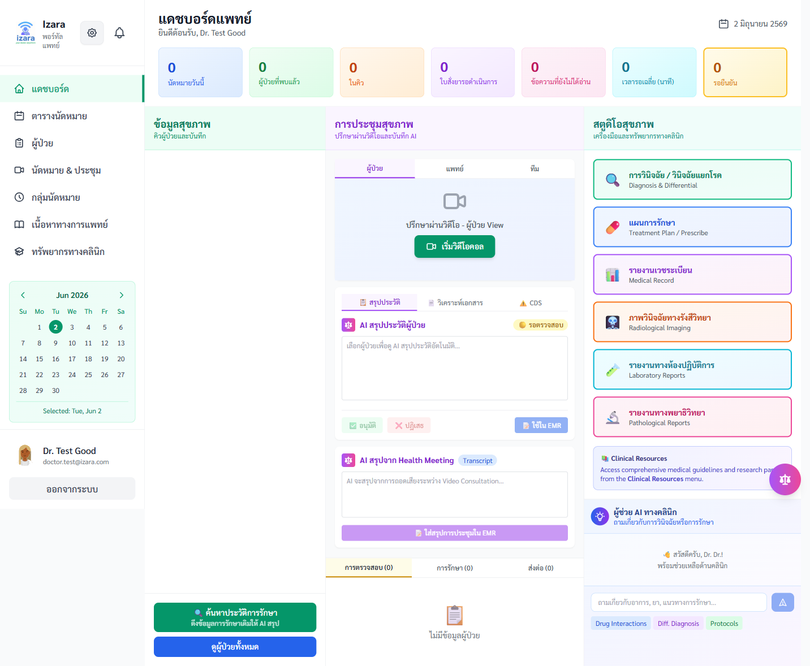
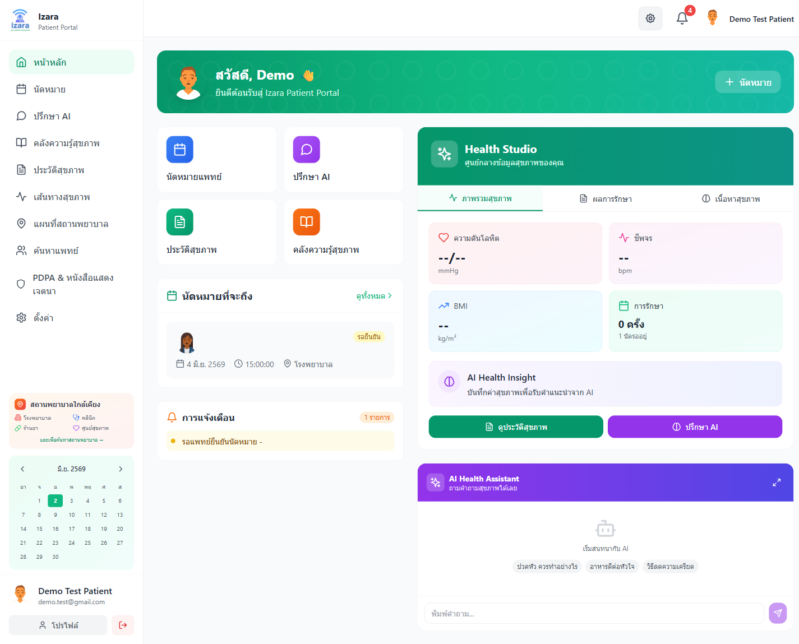
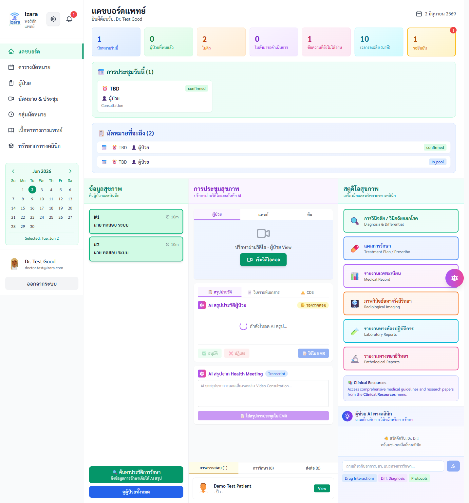

# Installation Guide — Issara Anywhere (sibling layout)

## Prerequisites

- Node.js 20+
- npm 10+
- Docker Desktop (**required** on Windows for real Istanbul unit coverage)
- PostgreSQL reachable (default local compose uses `postgres` service; host often `:5433` / `:5432`)
- Playwright browsers: `npx playwright install chromium firefox webkit`
- Windows: PowerShell 7+ recommended for `pwsh` gate scripts

## Sibling clone layout

```
New-Isara-Anywhere/
  issara-workspace/     ← orchestration, tests, Processes, Documents
  issara-patient/
  issara-doctor/
  issara-jitsi/
```

Optional Windows junctions: `issara-workspace/issara-*` → `../issara-*` so unit contracts and Docker build contexts resolve.

## First-time install

```powershell
cd issara-workspace
npm install
npm run install:all
npm --prefix tests/unit install
npx playwright install chromium firefox webkit
```

## Environment

```powershell
# Canonical secrets template: .env.docker
npm run env:sync          # writes ../issara-*/.env + root .env
npm run env:sync:dry      # preview
```

Confirm after sync:

| Var | Typical local |
|-----|----------------|
| PATIENT_URL | http://127.0.0.1:3005 |
| DOCTOR_URL | http://127.0.0.1:3010 |
| MEETING_URL | http://127.0.0.1:3020 |
| DB | host Postgres / compose `postgres` |

For **cloud** tests/cleanup also set `CLOUD_DB_PASSWORD` (and optional `CLOUD_*_URL`) in `.env`.

## Start local stack

```powershell
npm run dev
# or
docker compose --env-file .env.docker --profile full up -d --build
npm run docker:probe-health
```

## Local-first test ladder (required before cloud)

**Hard gate:** local unit coverage + pre-deploy + expanded headed E2E + UI showup + uniqueness must **all pass** before any cloud deploy. Do not treat prior report files as green until re-run under this ladder.

```powershell
# Phase 1 — real Istanbul coverage (Windows: Docker; stub with USE_DOCKER_COVERAGE=0 is not a pass)
$env:USE_DOCKER_COVERAGE='1'
npm run test:unit:coverage:gate
# or: npm run test:unit:docker:coverage
# Thresholds: lines 60 / functions 55 / branches 50 / statements 60

# Phase 2 — stack + headed matrix (default beyond A–J)
$env:PW_HEADED='1'; $env:BASELINE_VISUAL='1'; $env:PW_SKIP_LIVE_GEMINI='1'
$env:GATE_SKIP_DOCKER_BUILD='1'   # if stack already up via npm run dev / compose
$env:PLAYWRIGHT_BROWSERS_PATH='0'
npm run verify:gate0:local
npm run test:local:pre-deploy-gate   # includes expanded e2e-full-headed
npm run test:e2e:ui-showup           # headed A/B/C — archive under tests/output/screenshots/local/
npm run test:screenshots:all
npm run test:screenshots:global
npm run cleanup:local-test-only       # post-phase demo purge — no re-seed
```

**Default local E2E matrix** (`test:local:e2e-full` / pre-deploy `e2e-full-headed`):  
`A B C D D-queue D-host Q E F L G H I J J-prejoin K R S Defect`  
Follow-ons still explicit: `Q2 M N O P U MEET R1 W-core-*` (see [FULL_COVERAGE_REVERIFY_AUDIT.md](../../../../reports/FULL_COVERAGE_REVERIFY_AUDIT.md)).

## Cloud (only after local green checkpoint)

```powershell
npm run cloud:deploy -- -Tag v1.7.61
npm run cloud:smoke
npm run verify:gate0
npm run test:gate:ui-showup       # headed A/B/C + S — docs screenshot source
npm run test:cloud:full           # required: zero residuals (incl. prior E2/Q01 class)
npm run test:screenshots:all
npm run test:screenshots:global
npm run docs:sync-screenshots      # cloud-pass PNGs → docs/screenshots/
npm run docs:evidence:cloud
python scripts/build-portal-user-guides.py
npm run cleanup:cloud-test-only   # purge test rows on GCE VM Postgres 35.240.157.230 (NOT Cloud SQL); retain seed
```

**Ops note (2026-07-17, baseline `20260717-1300`):** Cloud Run patient/doctor/meeting **and** demo purge use **GCE VM PostgreSQL** `35.240.157.230:5432` / `izara_phase1` / `DB_SSL=false` only — **not Cloud SQL** (`/cloudsql/...`). See [CLOUD_GREEN_CHECKPOINT.md](../../../../reports/CLOUD_GREEN_CHECKPOINT.md) and [CLOUD_DEMO_DATA_CLEANUP.md](../../../../reports/CLOUD_DEMO_DATA_CLEANUP.md). Password = Secret Manager `db-password` as `DB_PASSWORD` / `CLOUD_DB_PASSWORD`. Cloudbuild sets `_DB_HOST=35.240.157.230`, discrete `DB_*` only (**do not mount** `DATABASE_URL` / `database-url`), and `--clear-cloudsql-instances` for portals + meeting.

Published Installation / Guidelines / User Guide images come from **cloud UI showup** unique PNGs only (not `tests/output/screenshots/local/`).

## UI screenshots (cloud — published)








Canonical path: `docs/screenshots/{group}/` after uniqueness audit (`reports/screenshot-global-audit-latest.json`).

## Evidence paths (required process — re-verify before trusting)

| Environment | Evidence path |
|-------------|---------------|
| Unit coverage gate | `reports/local-unit-gate-latest.json` + `tests/unit/coverage/` (baseline `20260716-093250`: **68.24** / **68.24** / **65.61** / **67.09** lines/stmts/funcs/branches) |
| Fix loop rounds | `reports/FIX_LOOP_ROUNDS.md` |
| Local headed matrix | `reports/HEADED_UI_RUN_RESULTS.md` (expanded matrix + follow-ons) |
| Local UI showup | `reports/LOCAL_UI_SHOWUP_RESULTS.md` (**15 passed**) |
| Local green checkpoint | [LOCAL_GREEN_CHECKPOINT.md](../../../../reports/LOCAL_GREEN_CHECKPOINT.md) · archive `reports/archive/local-green-20260716-102721/` |
| Local pre-deploy gate | `reports/phase2-pre-deploy-resume.txt` (`GATE_FROM_STEP=screenshots-all`) |
| Cloud green checkpoint | [CLOUD_GREEN_CHECKPOINT.md](../../../../reports/CLOUD_GREEN_CHECKPOINT.md) — hard gate before Documents |
| Cloud UI showup | [CLOUD_UI_SHOWUP_RESULTS.md](../../../../reports/CLOUD_UI_SHOWUP_RESULTS.md) (**15 passed**; docs PNG source) |
| Cloud full matrix | [CLOUD_FULL_COVERAGE_RESULTS.md](../../../../reports/CLOUD_FULL_COVERAGE_RESULTS.md) (**all-pass / zero residual**) |
| Cloud demo purge | [CLOUD_DEMO_DATA_CLEANUP.md](../../../../reports/CLOUD_DEMO_DATA_CLEANUP.md) (TCP purge soft-blocked; SSO seed via GCE SSH) |
| Published screenshots | [`docs/screenshots/`](../../../docs/screenshots/) after `docs:sync-screenshots` + uniqueness PASS |
| User guides | `Documents/docs/guides/patient/` · `Documents/docs/guides/doctor/` |

See also: [LOCAL_INSTALL.md](../../../docs/runbooks/LOCAL_INSTALL.md), [PROJECT_GUIDELINES.md](./PROJECT_GUIDELINES.md), [FULL_COVERAGE_REVERIFY_AUDIT.md](../../../../reports/FULL_COVERAGE_REVERIFY_AUDIT.md), [PROCESS_TO_TEST_GATE.md](../../../../Processes/PROCESS_TO_TEST_GATE.md).
