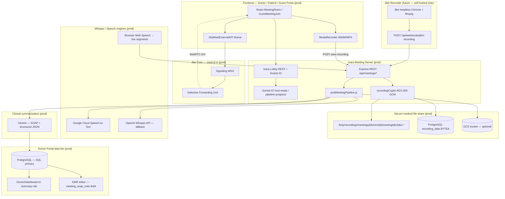

# Isara Anywhere — Production Deployment & Technical Update

**Document type:** Deployment & Operations Handoff (final)  
**Product:** Isara Telemedicine — Patient Portal, Doctor Portal, Meeting Server  
**Release track:** `v1.7.58` (cloud CSP Jitsi fix + headed parallel E2E)  
**Target environment:** Google Cloud Run (`asia-southeast1`) + PostgreSQL + **Ubuntu LAN** (`*.demotoday.net`)  
**Classification:** Internal — Operations & Engineering  
**Last updated:** 2026-07-02  
**Verification:** v1.7.58 — cloud deploy + `test:cloud:release-gate`

### Document typography (มาตรฐานรายงานภาษาไทย)

| Deliverable | Font | Sizes (exact) |
|-------------|------|----------------|
| Word reports / คู่มือผู้ใช้ / รายงาน PDF | **TH Sarabun New** | เนื้อหา **16 pt**, หัวข้อระดับ 1 **18 pt**, ชื่อเรื่อง **22 pt**, ระยะบรรทัด **1.15**, จัดชิดซ้าย |
| PowerPoint ฝึกอบรม / นำเสนอ | **FC Iconic** | หัวข้อสไลด์ **32 pt**, หัวข้อรอง **22 pt**, เนื้อหา **18 pt**, บันทึกวิทยากร **16 pt** |

**Regenerate deliverables (fonts + detailed steps):**

```bash
npm run cleanup:cloud-test-only
python scripts/enrich-process-pages.py --force-steps
python scripts/build-portal-user-guides.py
```

| Output | Typography |
|--------|------------|
| `Documents/docs/guides/patient|doctor/USER_GUIDE_*_WORD_TH.docx` | **TH Sarabun New** — body **16 pt**, H1 **18 pt**, title **22 pt**, line spacing **1.15** |
| `Documents/docs/guides/patient|doctor/USER_GUIDE_*_PPT_TH.pptx` | **FC Iconic** — title **32 pt**, body **18 pt**, speaker notes **16 pt** |
| `Processes/Pages/**/*.md` | Thai **คำอธิบายและบริบท** + **ขั้นตอนการใช้งาน (ละเอียด)** per page |

**Last regeneration:** 2026-05-23 (demo data purged; process pages force-refreshed)

---

## Executive summary

This release delivers a **production-grade telemedicine video workflow** comparable to Microsoft Teams / Zoom:

| Capability | Status |
|------------|--------|
| Doctor as meeting host (moderator) on Jitsi | ✅ |
| Patient & guest **Izara waiting room** (lobby) before admit | ✅ |
| Guest join with **working video** (guest blank-screen bug eliminated) | ✅ |
| Browser recording → **AES-256-GCM file share** → optional GCS | ✅ |
| Post-meeting STT (Google STT + OpenAI Whisper fallback) | ✅ |
| **AI SOAP summary** on Doctor Portal dashboard & EMR tab | ✅ |
| Man-in-the-loop physician validation before EMR sign-off | ✅ |

**Critical architecture fact for operations:**  
- **Cloud / default dev:** WebRTC may use public `meet.jit.si` when `JITSI_DOMAIN=meet.jit.si`.  
- **LAN / self-hosted (v1.7.54):** WebRTC runs on **`https://meet.demotoday.net`** (docker-jitsi-meet on Ubuntu) with JWT moderator roles. Camera/microphone are captured on the **doctor/patient laptop browser**, not on the server.  
- **Admission control** is **Izara lobby** on the Meeting Server (REST + Socket.IO) — not Jitsi Prosody lobby.  
- **Recording** is captured in the **doctor browser** (`MediaRecorder`) and uploaded to the Meeting Server; **Jibri is optional** on LAN.

**Demo / E2E data:** Cloud Playwright rows were purged on **2026-05-23** via `npm run cleanup:cloud-test-only` (no baseline re-seed).

---

## Table of contents

0. [Structural review & code quality attestation](#0-structural-review--code-quality-attestation)
1. [System architecture](#1-system-architecture)
2. [Production deployment checklist](#2-production-deployment-checklist)
3. [Security, compliance & data isolation](#3-security-compliance--data-isolation)
4. [DevOps maintenance manual](#4-devops-maintenance-manual)
5. [Process documentation index](#5-process-documentation-index)
6. [Appendix A — Self-hosted Jitsi (Prosody / Jicofo / Jibri / TURN)](#appendix-a--self-hosted-jitsi-prosody--jicofo--jibri--turn)
7. [Appendix B — API reference](#appendix-b--api-reference-meeting-lifecycle)
8. [Appendix C — Sign-off & verification](#appendix-c--sign-off--verification)

---

## 0. Structural review & code quality attestation

**Review date:** 2026-05-23  
**Scope:** Meeting server pipeline, Jitsi client config (both portals), meeting UIs, deploy manifests, automated tests.

### 0.1 Syntax & static analysis

| Area | Check | Result |
|------|-------|--------|
| Meeting pipeline | `npm run test:post-meeting-pipeline` | **12/12 pass** |
| Meeting contracts | `cd Izara-jitsi-server && node --test tests/*.test.mjs` | **21/21 pass** |
| Key React meeting files | IDE linter (`MeetingRoom.tsx`, `GuestMeetingJoin.tsx`, `postMeetingPipeline.js`) | **No errors** |
| TypeScript Jitsi helpers | `jitsiMeetingConfig.ts` (doctor + patient) | Consistent `pickJitsiJwt()` / `resolveJitsiDomain()` |

### 0.2 Variable isolation (security-relevant)

| Concern | Mitigation |
|---------|------------|
| Custom JWT sent to `meet.jit.si` (blank iframe) | Server: `JITSI_IS_PUBLIC_SAAS` → `tokenAuthEnabled: false`. Client: `pickJitsiJwt()` returns `undefined` for `*.jit.si`. |
| Cross-doctor recording access | Path prefix `meetings/{doctorId}/{meetingId}/`; `save-recording` and playback verify JWT `user.id` vs `doctor_id`. |
| Encryption key bleed | `recordingCrypto.js` uses dedicated `RECORDING_ENCRYPTION_KEY` or scrypt(`JWT_SECRET`, salt) — never logged. |
| Pipeline state leakage | `pipeline-status` and Socket `pipeline-progress` scoped to meeting / appointment rooms. |
| Staging fixtures in prod | `IZARA_DEV_TESTING`, `GOOGLE_TOKEN_VERIFIER_FIXTURE` must be **unset** on production Cloud Run. |

### 0.3 Resource consumption (Cloud Run)

| Service | Recommended (dev-testing cost profile) | Rationale |
|---------|----------------------------------------|-----------|
| Meeting Server | `--cpu=1 --memory=1Gi --min-instances=0 --max-instances=2 --concurrency=40` | Scale-to-zero dev-testing; patch min=1 for demo days only. |
| Doctor / Patient portals | `--cpu=1 --memory=1Gi --min-instances=0 --max-instances=2 --concurrency=80` | Scale-to-zero; static SPA + API proxy. |
| Recording upload | Max **50 MB** per `save-recording` | Validated in `postMeetingPipeline.js`; Whisper skips >25 MB (use Google STT or live segments). |
| Pipeline retries | `PIPELINE_RETRY_MAX=3`, `PIPELINE_RETRY_BASE_MS=500` | Exponential backoff in `pipelineRetry.js`; avoids hammering Gemini/STT on transient errors. |
| Ephemeral disk | `RECORDINGS_DIR=/tmp/recordings` | **Always** dual-write `recording_data` BYTEA + optional GCS — pod restart must not lose sole copy. |

### 0.4 Known production vs staging deltas

| Item | Staging (`cloudbuild.yaml` default) | Production go-live |
|------|-------------------------------------|-------------------|
| `CORS_ORIGINS` | May be `*` during dev-testing | Exact portal HTTPS origins |
| `IZARA_DEV_TESTING` | `1` | **Unset** |
| `DB_SSL` | `false` in sample build | **`false`** for GCE VM PostgreSQL (TCP) |
| `RECORDING_ENCRYPTION_KEY` | Optional (falls back to JWT scrypt) | **Dedicated secret** in Secret Manager |

---

## 1. System architecture

### 1.1 Service topology (GCP)

```
┌─────────────────────────────────────────────────────────────────────────────┐
│                         Google Cloud (asia-southeast1)                       │
├─────────────────────────────────────────────────────────────────────────────┤
│  Cloud Run: izara-patient-portal     Cloud Run: izara-doctor-portal         │
│  (React + Express, :3005)            (React + mainApiServer, :8080)          │
│         │                                      │                             │
│         │  HTTPS + JWT                         │  HTTPS + JWT                │
│         └──────────────────┬───────────────────┘                             │
│                            ▼                                                 │
│              Cloud Run: izara-meeting-server (:3020)                         │
│              Express + Socket.IO + postMeetingPipeline.js + recordingCrypto  │
│                            │                                                 │
│         ┌──────────────────┼──────────────────┐                            │
│         ▼                  ▼                  ▼                            │
│   PostgreSQL          /tmp/recordings      GCS (optional)                    │
│   (SQL — primary)     meetings/{doctorId}/  gs://{bucket}/meetings/...     │
│   meeting_records     {meetingId}/video.*   (object store — durable PHI)   │
│   meeting_transcripts meeting_config JSONB                                   │
│   emr, appointments                                                          │
└─────────────────────────────────────────────────────────────────────────────┘
                            │
                            │ WebRTC media (browser ↔ browser)
                            ▼
                   https://meet.jit.si  (Jitsi External API iframe — Jitsi Core SaaS)
```

| Service | Cloud Run name (staging) | Port | Primary role |
|---------|--------------------------|------|----------------|
| Patient Portal | `izara-patient-portal-dev-testing` | 3005 | Appointments, guest links, patient meeting UI |
| Doctor Portal | `izara-doctor-portal-dev-testing` | 8080 | Dashboard, EMR, meeting host UI, AI Summary tab |
| Meeting Server | `izara-meeting-server-dev-testing` | 3020 | Lobby, Socket.IO, recording ingest, AI pipeline |

**Staging URLs (replace service names when promoted to production):**

- Patient: `https://izara-patient-portal-dev-testing-724889190329.asia-southeast1.run.app`
- Doctor: `https://izara-doctor-portal-dev-testing-724889190329.asia-southeast1.run.app`
- Meeting: `https://izara-meeting-server-dev-testing-724889190329.asia-southeast1.run.app`

---

### 1.2 End-to-end data flow (logical pipeline map)

This diagram maps **every layer** requested for operations handoff. Layers marked **(prod)** are live today; **(future)** apply only after self-hosted Jitsi migration (Appendix A).



| Stage | Component | Protocol / store | PHI |
|-------|-----------|------------------|-----|
| 1 | Portal UI + iframe | HTTPS, `meet.jit.si` WSS/WebRTC | Yes |
| 2 | Izara lobby | REST + Socket.IO on Meeting Server | Metadata |
| 3 | Browser recording | `POST /api/meetings/:id/save-recording` | Yes |
| 4 | File share | Encrypted disk path + BYTEA + GCS | Yes |
| 5 | Transcription | `meeting_transcripts` + STT/Whisper | Yes |
| 6 | AI summary | `meeting_records.ai_summary`, `emr` draft | Yes |
| 7 | Physician validation | Doctor Portal EMR approve workflow | Yes |

**NoSQL note:** Izara does **not** use MongoDB/CouchDB for clinical video. **Object storage (GCS)** holds durable media blobs; **PostgreSQL JSONB** (`meeting_config`, `ai_summary_structured`) holds pipeline state and structured AI output — treat both as regulated PHI stores.

---

### 1.3 Phase-by-phase meeting lifecycle

#### Phase A — Pre-join (Teams-style Izara lobby)

1. **Doctor** opens Health Meeting / Meeting Room (`Isara-doctor-portal/src/pages/meetings/MeetingRoom.tsx`).
2. Doctor Portal calls `POST /api/meetings/create` (JWT) → `meeting_records` row, Jitsi room name, lobby state.
3. Doctor joins **`meet.jit.si`** as moderator via External API (`getJitsiExternalApiOptions` — `enableLobby: false` on Jitsi; Izara lobby only).
4. Server sets `tokenAuthEnabled: false` when `JITSI_DOMAIN` is public SaaS (`Izara-jitsi-server/server/index.js`).
5. Doctor emits **host-present** (`notifyHostPresent`) so guests are not stuck on blank pre-join.
6. **Patient** waits in Izara lobby → `POST .../lobby/admit` or admit-all.
7. **Guest** uses patient-portal guest URL (`buildGuestPortalUrls`) → `GuestMeetingJoin.tsx` polls `host-ready` + Socket before mounting iframe.

#### Phase B — In-meeting (live)

1. Live transcription: Web Speech API → `POST /api/meetings/:id/transcript` (+ `guest-transcript-segment`).
2. Segments → **`meeting_transcripts`** (`speaker_role`: doctor | patient | guest).
3. Chat buffered on Meeting Server; persisted on end when configured.

#### Phase C — Recording & post-meeting pipeline

1. Doctor ends meeting / stops recording → **MediaRecorder** WebM/MP4 (headless E2E may send minimal valid WebM stub).
2. `POST /api/meetings/:id/save-recording`:
   - Validates size (≤ **50 MB**) and container magic bytes.
   - **Encrypts at rest** if `RECORDING_ENCRYPTION_KEY` or `JWT_SECRET` present (`IZARAENC1` envelope).
   - Writes `{RECORDINGS_DIR}/meetings/{doctorId}/{meetingId}/video.{ext}`.
   - Dual-writes **`meeting_records.recording_data`** (BYTEA).
   - Optional **GCS** upload when `GCS_BUCKET` set.
   - Queues **`postMeetingPipeline`** async.
3. `POST /api/meetings/:id/end` → status `completed`, compiles transcript, may trigger Gemini if transcript sufficient.
4. **Pipeline stages** (`postMeetingPipeline.js`): `storage` → `transcribe` (DB segments → Google STT → Whisper) → `ai_summary` (Gemini) → `completed`.
5. Socket events: `pipeline-progress`, `meeting-summary-ready`.
6. **Doctor Portal** polls `GET /api/meetings/:appointmentId/pipeline-status` (`DoctorDashboard.tsx`) and loads `GET /api/video-meeting/:appointmentId/files` via `mainApiServer.cjs`.

#### Phase D — EMR & man-in-the-loop

1. Structured SOAP may create draft EMR (`type = meeting_soap_note`, `ai_summary_approved = false`).
2. Physician **reviews and approves** before legal medical record use.

---

### 1.4 Component interaction matrix

| Component | Interacts with | Protocol | PHI? |
|-----------|--------------|----------|------|
| Doctor/Patient UI | meet.jit.si | HTTPS / WSS WebRTC | Yes |
| Doctor/Patient UI | Meeting Server | HTTPS REST + Socket.IO | Yes |
| Doctor Portal API | PostgreSQL | TCP 5432 (TLS prod) | Yes |
| Meeting Server | PostgreSQL | TCP 5432 | Yes |
| Meeting Server | Google STT | HTTPS API | Yes |
| Meeting Server | OpenAI Whisper | HTTPS API | Yes |
| Meeting Server | Gemini | HTTPS API | Yes |
| Meeting Server | GCS | HTTPS | Yes |
| Jibri (future) | Meeting webhook | HTTPS + shared secret | Yes |

---

### 1.5 Recording storage layout (secure file share)

**Canonical on-disk path (Meeting Server):**

```text
{RECORDINGS_DIR}/meetings/{doctorId}/{meetingId}/video.webm   # or .mp4
{RECORDINGS_DIR}/meetings/{doctorId}/{meetingId}/transcript.json
```

**Encryption envelope (when enabled):** `IZARAENC1` + 12-byte IV + 16-byte GCM tag + ciphertext — see `Izara-jitsi-server/server/recordingCrypto.js`.

**Playback (doctor JWT, Range requests, decrypt on read):**

```http
GET /api/recordings/meetings/{doctorId}/{meetingId}/video.webm
Authorization: Bearer <JWT>
```

**Database:** `recording_url`, `recording_data` (BYTEA), `transcript`, `ai_summary`, `ai_summary_structured`, `meeting_config.postMeetingPipeline`.

---

## 2. Production deployment checklist

### 2.1 Pre-deploy gates

| # | Gate | Command | Pass criteria |
|---|------|---------|---------------|
| 1 | Post-meeting pipeline tests | `npm run test:post-meeting-pipeline` | 0 failures |
| 2 | Meeting contract tests | `cd Izara-jitsi-server && node --test tests/*.test.mjs` | All pass |
| 3 | Optional full pipeline rounds | `npm run test:post-meeting-pipeline:rounds` | Round 1 + 2 pass |
| 4 | Secret Manager | `jwt-secret`, `db-password`, `database-url`, `gemini-api-key`, `google-client-id` | Versions exist |
| 5 | Recording encryption | `recording-encryption-key` (recommended) | 32+ byte secret |
| 6 | DB migrations | `scripts/database/v2.2.0-notify-triggers.sql` | NOTIFY triggers active |
| 7 | CSP / iframe | Patient `nginx.conf` + OWASP middleware | `meet.jit.si` in `frame-src`, `connect-src` |
| 8 | CORS | Meeting `CORS_ORIGINS` = exact portal URLs | No browser CORS errors |
| 9 | Demo data | `npm run cleanup:cloud-test-only` | No stale E2E rows |

---

### 2.2 Cloud Build deploy (authoritative)

```bash
gcloud builds submit . --config=cloudbuild.yaml \
  --substitutions=_TAG=v1.7.25-post-meeting-pipeline,_MEETING_SVC=izara-meeting-server,_PATIENT_SVC=izara-patient-portal,_DOCTOR_SVC=izara-doctor-portal
```

**Build order:** Meeting Server → capture URL → Portals (parallel) → update Meeting Server CORS + portal URLs → DB migrations.

---

### 2.3 Meeting Server — environment variables (validated)

| Variable | Production value | Secret? | Notes |
|----------|------------------|---------|-------|
| `NODE_ENV` | `production` | No | |
| `PORT` | `3020` | No | Cloud Run `--port=3020` |
| `JWT_SECRET` | 256-bit random | **Yes** | Must match both portals |
| `DATABASE_URL` | `postgresql://...` | **Yes** | Or `DB_HOST` + `DB_PASSWORD` |
| `DB_SSL` | `false` | No | GCE VM PostgreSQL (TCP) |
| `GEMINI_API_KEY` | API key | **Yes** | Required for AI summary |
| `GEMINI_MODEL` | `gemini-3.1-flash-lite` | No | |
| `JITSI_DOMAIN` | `meet.jit.si` | No | Do not self-host until Appendix A ready |
| `JITSI_GUEST_DOMAIN` | `meet.jit.si` | No | Same as host for public SaaS |
| `RECORDINGS_DIR` | `/tmp/recordings` | No | Ephemeral; use BYTEA + GCS |
| `RECORDING_ENCRYPTION_KEY` | 32+ char random | **Yes** | Preferred over JWT scrypt fallback |
| `CORS_ORIGINS` | `https://{patient},https://{doctor}` | No | Set in cloudbuild phase 5 |
| `PATIENT_PORTAL_URL` | Patient Cloud Run URL | No | Guest link generation |
| `DOCTOR_PORTAL_URL` | Doctor Cloud Run URL | No | |
| `MEETING_SERVER_PUBLIC_URL` | Meeting Cloud Run URL | No | |
| `GCP_SERVICE_ACCOUNT_KEY` | Base64 SA JSON | **Yes** | Google STT |
| `GCS_BUCKET` | e.g. `izara-meeting-recordings` | No | **Strongly recommended** |
| `OPENAI_API_KEY` | API key | **Yes** | Whisper fallback |
| `WHISPER_MODEL` | `whisper-1` | No | |
| `PIPELINE_RETRY_MAX` | `3` | No | |
| `PIPELINE_RETRY_BASE_MS` | `500` | No | Exponential backoff base |
| `MIN_RECORDING_BYTES` | `1024` | No | Reject interrupted uploads |
| `POST_MEETING_PIPELINE_TIMEOUT_MS` | `900000` | No | 15 min async cap |
| `JIBRI_WEBHOOK_SECRET` | Random | **Yes** | Appendix A only |
| `JITSI_FORCE_JWT_ON_PUBLIC` | **unset** | No | Never `1` on meet.jit.si |

**Cloud Run flags (Meeting Server):**

```text
--memory=1Gi --cpu=1 --min-instances=1 --max-instances=3 --concurrency=40 --timeout=600
```

---

### 2.4 Doctor Portal — environment variables

| Variable | Production value | Secret? |
|----------|------------------|---------|
| `MEETING_SERVER_URL` / `VITE_MEETING_SERVER_URL` | Meeting Cloud Run URL | No |
| `JITSI_DOMAIN` / `VITE_JITSI_DOMAIN` | `meet.jit.si` | No |
| `JWT_SECRET` | Same as meeting server | **Yes** |
| `GEMINI_API_KEY` | Server-side AI routes | **Yes** |
| `GOOGLE_CLIENT_ID` | OAuth | **Yes** |
| `USE_POSTGRESQL` | `true` | No |

**CSP:** `frame-src` and `connect-src` must include `https://meet.jit.si` and `wss://meet.jit.si`.

---

### 2.5 Patient Portal — environment variables

Same as Doctor Portal for meeting URL, JWT, Gemini, PostgreSQL, CSP.  
**Guest links:** `PATIENT_PORTAL_URL` on Meeting Server must match the live patient service URL.

---

### 2.6 PostgreSQL tables (video / AI workflow)

| Table | Purpose |
|-------|---------|
| `meeting_records` | Room metadata, recording BYTEA/URL, transcript, AI summary, `meeting_config` JSONB |
| `meeting_transcripts` | Speaker-labeled segments |
| `emr` | Draft SOAP (`meeting_soap_note`) |
| `appointments` | Status → `completed` on meeting end |

---

### 2.7 Production vs staging toggles

| Variable | Staging | Production |
|----------|---------|------------|
| `IZARA_DEV_TESTING` | `1` | **Unset** |
| `GOOGLE_TOKEN_VERIFIER_FIXTURE` | `1` | **Unset** |
| `CORS_ORIGINS` | Sometimes `*` | **Explicit HTTPS origins** |

---

### 2.8 meet.jit.si (current) — components NOT to deploy

While `JITSI_DOMAIN=meet.jit.si`:

- Prosody / Jicofo on your VMs  
- Jibri recording pool  
- coturn for Jitsi (public infra handles NAT)  
- Custom JWT to meet.jit.si (`tokenAuthEnabled` must be **false**)

Izara **waiting room** = Meeting Server only.

---

## 3. Security, compliance & data isolation

### 3.1 Regulatory framing (Thailand)

| Framework | Application |
|-----------|-------------|
| **PDPA** | Video, voice, transcripts — consent, purpose limitation, retention |
| **HIPAA-aligned controls** | PHI isolation benchmark (US BAA only if contracted) |
| **ETDA / Cloud Standard 2567** | Region lock `asia-southeast1`, encryption, audit logs |

---

### 3.2 Data classification

| Data type | Examples | Classification |
|-----------|----------|----------------|
| PHI | Video, recordings, transcripts, AI summaries | Restricted |
| PII | Names, national ID in profiles | Restricted |
| Operational | Room IDs, JWT `sub` | Internal |

---

### 3.3 Protection in transit

| Path | Control |
|------|---------|
| Browser ↔ Cloud Run | TLS 1.2+ |
| Browser ↔ meet.jit.si | TLS + WSS |
| Meeting Server ↔ PostgreSQL | `DB_SSL=true` |
| Meeting Server ↔ Gemini / STT / Whisper | TLS; keys in Secret Manager |
| Socket.IO | WSS when portal is HTTPS |

---

### 3.4 Protection at rest

| Store | Control |
|-------|---------|
| Recording files | **AES-256-GCM** (`IZARAENC1`) when `RECORDING_ENCRYPTION_KEY` or `JWT_SECRET` set |
| PostgreSQL | Encrypted disk (GCP); least-privilege DB role |
| `recording_data` BYTEA | Encrypted blob; same key material as files |
| GCS | Uniform access; IAM; **CMEK** recommended; prefix `meetings/{doctorId}/` |
| Secret Manager | JWT, DB, API keys — never in git/images |

**Decrypt path:** Playback and pipeline read call `decryptRecordingBuffer()` before streaming or STT.

---

### 3.5 Tenant & role isolation

| Control | Implementation |
|---------|----------------|
| Path prefix | `meetings/{doctorId}/{meetingId}/` |
| `save-recording` | JWT `user.id` === `meeting.doctor_id` (unless admin) |
| Recording GET | Doctor-scoped + path match |
| `pipeline-status` | Doctor JWT + meeting ownership |
| Doctor files API | `mainApiServer.cjs` `GET /api/video-meeting/:appointmentId/files` |
| Transcripts | Filtered by `meeting_record_id` |

---

### 3.6 AI & clinical safety

| Control | Detail |
|---------|--------|
| Man-in-the-loop | EMR drafts `ai_summary_approved = false` until physician approves |
| Prompt boundary | Clinical JSON prompt — no invented diagnoses/medications |
| Audit | `meeting_config.postMeetingPipeline`, `ai_recommendations` JSON |
| Data minimization | Transcript + approved PHR snippets only to Gemini |

---

### 3.7 Production access control checklist

- [ ] `JWT_SECRET` ≥ 32 bytes; rotate on compromise  
- [ ] `RECORDING_ENCRYPTION_KEY` in Secret Manager (not only JWT fallback)  
- [ ] Remove `IZARA_DEV_TESTING` and OAuth fixtures  
- [ ] GCS bucket: no public read  
- [ ] Cloud Audit Logs for Secret Manager & Cloud Run admin  
- [ ] `VITE_PDPA_ENABLED` / `VITE_CONSENT_REQUIRED` on patient portal  
- [ ] Run `npm run cleanup:cloud-test-only` after E2E cycles (no demo re-seed in prod)

---

## 4. DevOps maintenance manual

### 4.1 Log locations — Cloud Run (current production)

Izara on Cloud Run **does not write** to `/var/log/jitsi/`. Use **Google Cloud Logging**.

| Service | Log filter |
|---------|------------|
| Meeting Server | `resource.type="cloud_run_revision" resource.labels.service_name="izara-meeting-server-dev-testing"` |
| Doctor Portal | `resource.labels.service_name="izara-doctor-portal-dev-testing"` |
| Patient Portal | `resource.labels.service_name="izara-patient-portal-dev-testing"` |

**CLI — last errors (Meeting Server):**

```bash
gcloud logging read \
  'resource.type=cloud_run_revision AND resource.labels.service_name=izara-meeting-server-dev-testing AND severity>=ERROR' \
  --limit=50 --format=json --project=izara-telemedicine
```

**CLI — recording ingest:**

```bash
gcloud logging read \
  'resource.labels.service_name=izara-meeting-server-dev-testing AND textPayload:"Save Recording"' \
  --limit=30 --project=izara-telemedicine
```

**CLI — post-meeting pipeline:**

```bash
gcloud logging read \
  'resource.labels.service_name=izara-meeting-server-dev-testing AND textPayload:"PostMeeting"' \
  --limit=30 --project=izara-telemedicine
```

**Stdout prefixes (grep):**

| Prefix | Meaning |
|--------|---------|
| `[Save Recording]` | Upload, validation, encrypt, persist |
| `[PostMeeting]` | Async pipeline stages / retries |
| `[End Meeting]` | Meeting end + inline Gemini |
| `[Jibri Webhook]` | Self-hosted ingest only |
| `[Recordings]` | Playback decrypt / list errors |
| `[SECURITY]` | JWT / fatal config |

**Local Docker Compose:**

```bash
docker compose logs -f izara-jitsi-server
docker compose logs -f izara-doctor-portal
docker compose logs -f izara-patient-portal
```

**Source files for support engineers:**

| Concern | File path |
|---------|-----------|
| Pipeline logic | `Izara-jitsi-server/server/postMeetingPipeline.js` |
| Encryption | `Izara-jitsi-server/server/recordingCrypto.js` |
| Retries | `Izara-jitsi-server/server/pipelineRetry.js` |
| REST + webhooks | `Izara-jitsi-server/server/index.js` |
| Jitsi client policy | `Isara-doctor-portal/src/utils/jitsiMeetingConfig.ts` |
| Doctor meeting UI | `Isara-doctor-portal/src/pages/meetings/MeetingRoom.tsx` |
| Guest UI | `Isara-patient-portal/src/pages/GuestMeetingJoin.tsx` |
| AI Summary load | `Isara-doctor-portal/src/pages/DoctorDashboard.tsx` |
| Doctor files API | `Isara-doctor-portal/server/mainApiServer.cjs` |

---

### 4.2 Health checks

```bash
curl -s https://{MEETING_URL}/health | jq .

curl -s -H "Authorization: Bearer $DOCTOR_JWT" \
  https://{DOCTOR_URL}/api/video-meeting/config | jq .

curl -s -H "Authorization: Bearer $DOCTOR_JWT" \
  https://{MEETING_URL}/api/meetings/{meetingId}/pipeline-status | jq .
```

**Join-config sanity (public Jitsi):**

```bash
curl -s -H "Authorization: Bearer $DOCTOR_JWT" \
  "https://{MEETING_URL}/api/meetings/{id}/join-config?role=doctor" | jq '{tokenAuthEnabled, jwt, domain}'
# Expect: tokenAuthEnabled: false, jwt: null, domain: "meet.jit.si"
```

---

### 4.3 Runbook: Recording failed to save

| Step | Action | Expected |
|------|--------|----------|
| 1 | Doctor clicked End / Stop recording | No MediaRecorder error in browser console |
| 2 | `POST save-recording` | `200`, `recordingUrl`, `postMeetingPipeline: queued` |
| 3 | `413` | File > 50 MB — shorten meeting or lower bitrate |
| 4 | `422` | Invalid WebM — use live transcript path |
| 5 | `403` | JWT doctor ≠ `meeting_records.doctor_id` |
| 6 | SQL | `SELECT recording_url, length(recording_data), meeting_config FROM meeting_records WHERE appointment_id = '...';` |
| 7 | Encryption | If `IZARAENC1` on disk, confirm `RECORDING_ENCRYPTION_KEY` mounted on all instances |
| 8 | Playback | `GET /api/recordings/meetings/{doctorId}/{meetingId}/video.webm` with doctor JWT |

**Re-queue pipeline:**

```bash
curl -X POST -H "Authorization: Bearer $JWT" -H "Content-Type: application/json" \
  https://{MEETING_URL}/api/meetings/{appointmentId}/end \
  -d '{"generateSummary":true}'
```

---

### 4.4 Runbook: AI summary missing

| Step | Action |
|------|--------|
| 1 | Verify `GEMINI_API_KEY` on Meeting Server |
| 2 | Logs: `[End Meeting] AI pipeline skipped` or Gemini quota |
| 3 | SQL: `length(transcript)`, `meeting_config->'postMeetingPipeline'->>'stage'` |
| 4 | Doctor: `GET /api/video-meeting/{appointmentId}/files` |
| 5 | UI: Dashboard polls `pipeline-status`; listen for `meeting-summary-ready` |
| 6 | Recording without transcript: confirm `[PostMeeting]` STT/Whisper lines |

---

### 4.5 Runbook: API limits

| Symptom | Remediation |
|---------|-------------|
| Gemini 429 | Quota increase; `GEMINI_MODEL=gemini-3.1-flash-lite` |
| Google STT denied | Enable API; verify `GCP_SERVICE_ACCOUNT_KEY` |
| Whisper >25 MB | Use Google STT or live `meeting_transcripts` |
| Upload timeout | Cloud Run `--timeout=600`; reduce recording size |

---

### 4.6 Runbook: Guest blank screen / lobby stuck

| Step | Action |
|------|--------|
| 1 | `join-config`: `tokenAuthEnabled` must be **false** on meet.jit.si |
| 2 | Client must **not** pass JWT (`pickJitsiJwt` returns undefined) |
| 3 | `PATIENT_PORTAL_URL` matches live patient URL |
| 4 | Doctor triggered **host-present** |
| 5 | CSP: `frame-src` / `connect-src` include `meet.jit.si` |
| 6 | Socket.IO connected in browser devtools |
| 7 | Spec: `Processes/VIDEO_MEETING_JITSI_GEMINI.md` |

---

### 4.7 Backup & retention

| Asset | Recommendation |
|-------|----------------|
| PostgreSQL | Daily backup on GCE VM (`pg_dump` / VM snapshots) |
| GCS recordings | Lifecycle → Coldline; delete per PDPA schedule |
| BYTEA | Migrate durable copy to GCS; shorten BYTEA retention |
| Transcripts | Hospital policy; anonymize for analytics |

---

### 4.8 Recommended monitoring alerts

| Alert | Condition |
|-------|-----------|
| Meeting Server 5xx | > 1% / 5 min |
| `save-recording` failures | `[Save Recording] DIAGNOSTIC` spike |
| Pipeline failed | `postMeetingPipeline.stage = failed` |
| Gemini errors | `[End Meeting] AI pipeline failed` |
| DB pool | `[Pool] Unexpected PostgreSQL error` |

---

## 5. Process documentation index

Per-page operational specs (Thai reporting structure) live under `Processes/Pages/`:

| Portal | Index |
|--------|-------|
| Doctor | `Processes/Pages/Doctor-Portal/00_Doctor_Portal_Overview.md` |
| Patient | `Processes/Pages/Patient-Portal/00_Patient_Portal_Overview.md` |
| Meeting server | `Processes/Pages/Meeting-Server/00_Meeting_Server_Overview.md` |
| Video / AI master spec | `Processes/VIDEO_MEETING_JITSI_GEMINI.md` |
| Cloud test protocol | `Processes/TWO_ROUND_CLOUD_TESTING.md` |
| Workflow contract | `Processes/FULL_WORKFLOW_CONTRACT.md` |

Each page includes: **คำอธิบายและบริบท (รายงานภาษาไทย)** → **ขั้นตอนการใช้งาน (ละเอียด)** → **ผลลัพธ์ที่คาดหวัง** → **มาตรฐานเอกสาร** (Sarabun / FC Iconic).

---

## Appendix A — Self-hosted Jitsi (Prosody / Jicofo / Jibri / TURN)

**Use only when** `JITSI_DOMAIN` is your own host (e.g. `meet.izara.health`). Until then, Appendix A is reference-only.

### A.1 Migration delta

- Deploy Jibri → `POST /api/webhooks/jibri-recording` + `JIBRI_WEBHOOK_SECRET`
- Enable JWT: `JITSI_JWT_SECRET`, `JITSI_APP_ID`; set `JITSI_FORCE_JWT_ON_PUBLIC` only on **private** domains
- Keep Izara lobby unless explicitly switching to Jitsi native lobby

### A.2 Prosody — validated baseline (`/etc/prosody/prosody.cfg.lua` + vhost)

| Setting | Value |
|---------|-------|
| Virtual host | `meet.izara.health` |
| Authentication | `internal_hashed` + JWT module **or** `jitsi-anonymous` + token |
| MUC component | `conference.meet.izara.health` |
| Focus component | `focus.meet.izara.health` |
| Brewery (internal) | `internal.auth.meet.izara.health` |
| Guest domain (optional) | `guest.meet.izara.health` |
| Rate limits | Enable `limits` module on auth vhost |
| Recording metadata | `metadata.meet.izara.health` |

**Logs:** `/var/log/prosody/prosody.log`, `/var/log/prosody/prosody.err`  
**systemd:** `journalctl -u prosody -f`

### A.3 Jicofo — validated baseline (`/etc/jitsi/jicofo/jicofo.conf`)

| Setting | Value |
|---------|-------|
| `jicofo.bridge-selection-strategy` | `SplitBridgeSelectionStrategy` (multi-bridge) |
| Brewery MUC | `JvbBrewery@internal.auth.meet.izara.health` |
| XMPP domain | `meet.izara.health` |
| Auth | Match Prosody JWT (`tokenAuthUrl` if using tokens) |

**Logs:** `/var/log/jitsi/jicofo.log`  
**systemd:** `journalctl -u jicofo -f`

### A.4 Jibri — validated baseline (`/etc/jitsi/jibri/jibri.conf`)

| Setting | Value |
|---------|-------|
| `jibri.recording.recordings-directory` | `/data/recordings` |
| `jibri.api.webhook` | `https://{MEETING_SERVER}/api/webhooks/jibri-recording` |
| `jibri.api.webhook.headers` | `X-Jibri-Webhook-Secret: {secret}` |
| Concurrent sessions | ≥ 1 Jibri per 3–5 simultaneous **recorded** meetings |
| Finalize | Upload `videoBase64` or multipart to Izara (see `index.js` webhook handler) |

**Logs:** `/var/log/jitsi/jibri.log`  
**systemd:** `journalctl -u jibri -f`

**Izara webhook body (JSON):**

```json
{
  "meetingId": "uuid",
  "doctorId": "DR-xxx",
  "localFilePath": "/data/recordings/session.mp4",
  "mimeType": "video/mp4",
  "videoBase64": "<optional for smaller files>"
}
```

### A.5 coturn (TURN/STUN) — validated baseline

| File | `/etc/turnserver.conf` |
|------|------------------------|
| `listening-port` | `3478` |
| `tls-listening-port` | `5349` |
| `realm` | `meet.izara.health` |
| `use-auth-secret` | `true` |
| `static-auth-secret` | `<256-bit shared secret>` |
| `fingerprint` | `true` |
| `no-multicast-peers` | `true` |

**Jitsi Videobridge** (`/etc/jitsi/videobridge/sip-communicator.properties`):

```properties
org.ice4j.ice.harvest.STUN_MAPPING_HARVESTER_ADDRESSES=stun.meet.izara.health:3478
```

**Firewall:** UDP **10000–20000** (RTP), TCP **443**, UDP **3478**, TCP **5349**

**Logs:** `/var/log/turnserver/turnserver.log` or `journalctl -u coturn -f`

**meet.jit.si:** No coturn on Izara GCP required today.

---

## Appendix B — API reference (meeting lifecycle)

| Method | Endpoint | Auth | Purpose |
|--------|----------|------|---------|
| POST | `/api/meetings/create` | JWT | Create meeting + room |
| GET | `/api/meetings/:id/join-config` | JWT / guest token | Domain, `tokenAuthEnabled`, JWT |
| POST | `/api/meetings/:id/lobby/admit-all` | JWT | Admit waiting participants |
| POST | `/api/meetings/:id/save-recording` | JWT | Browser recording upload |
| POST | `/api/meetings/:id/end` | JWT | End meeting + trigger AI |
| GET | `/api/meetings/:id/pipeline-status` | JWT | Pipeline stage / error |
| GET | `/api/recordings/meetings/:doctorId/:meetingId/:file` | JWT | Decrypt + stream playback |
| POST | `/api/webhooks/jibri-recording` | `X-Jibri-Webhook-Secret` | Self-hosted Jibri |
| GET | `/api/video-meeting/:appointmentId/files` | JWT (Doctor API) | Dashboard AI Summary |

**Socket.IO:** `host-ready`, `recording-saved`, `pipeline-progress`, `meeting-summary-ready`, `meeting-ended-results`, `meeting-status`.

---

## Appendix C — Sign-off & verification

### C.1 Two-round cloud E2E (completed)

| Round | Focus | Result |
|-------|-------|--------|
| Round 1 | Guest blank screen, lobby admit, 3-party lifecycle (Q01) | **PASS** |
| Round 2 | Recording → DB → AI Summary UI (Q02), pipeline stress | **PASS** |

Ledger: `CLOUD_E2E_ERROR_LEDGER_ROUND1.md`, `CLOUD_E2E_ERROR_LEDGER_ROUND2.md`, `Processes/TWO_ROUND_CLOUD_TESTING.md`

### C.2 Automated tests (run before each promote)

```bash
npm run test:post-meeting-pipeline
cd Izara-jitsi-server && node --test tests/*.test.mjs
npm run test:post-meeting-pipeline:rounds   # optional full local rounds
npm run test:e2e:meeting-lifecycle          # requires cloud credentials
```

### C.3 Manual production smoke (15 minutes)

| # | Actor | Step | Pass |
|---|-------|------|------|
| 1 | Doctor | Start meeting, admit patient | Video both sides |
| 2 | Guest | Patient-portal guest link | No blank iframe |
| 3 | Doctor | End meeting | `save-recording` 200 |
| 4 | Doctor | Dashboard → patient | AI Summary visible |
| 5 | Doctor | EMR → Insert meeting summary | SOAP prefilled |
| 6 | Ops | `pipeline-status` | `stage: completed` |
| 7 | Ops | `join-config` | `tokenAuthEnabled: false` on meet.jit.si |

### C.5 Defect remediation verification (v1.7.48)

| Gate | Date | Result |
|------|------|--------|
| PDF defect register (23 items) | 2026-05-30 | **Verified** — `reports/defect-fix/DEFECT_REGISTER.md` |
| `npm run test:quality:gate` | 2026-05-30 | **PASS** — 151 files, 2736 unit tests |
| Defect-regression Playwright | 2026-05-30 | **36/36** PASS |
| `npm run test:cloud:full` (headed) | 2026-05-31 | **85/85** PASS, 212 PNG → `docs/screenshots/` |
| User guides | 2026-05-31 | Patient PPT 76 imgs, Doctor DOCX/PPT 93 imgs |

Ledger: `reports/defect-fix/v1.7.48-final.txt`, `Documents/docs/markdown/testing/UNIT_TEST_UI_COVERAGE.md`

### C.6 Queue/JWT hardening verification (v1.7.50)

| Gate | Date | Result |
|------|------|--------|
| `npm run test:unit:docker` | 2026-06-05 | **PASS** — 167 files, **2938** Vitest |
| `npm run test:unit:docker:grouped` | 2026-06-05 | **PASS** — doctor / patient / cross-portal / meeting-server shards |
| `npm run test:unit:docker:deploy` | 2026-06-05 | **PASS** — stack rebuild + **2938** + **78** meeting-server contracts |
| Process registry (PCOV) | 2026-06-05 | **49** tests — `processPageCoverage.test.ts` |
| Queue traceability | — | `queueAcceptTraceability.test.ts`, `includeAccepted=true`, 7-day window |
| Jitsi roles | — | `jitsiRoleJwt.test.ts` — doctor owner/moderator, guest invite token |

### C.7 Docker multi-browser E2E (Group W)

| Gate | Date | Result |
|------|------|--------|
| `npm run test:e2e:docker:core-multibrowser` | 2026-06-05 | **PASS** — A-auth 13/13 + W-core × 3 browsers **18/18** |
| DB baseline | each browser run | `cleanup-test-data.sql` + `seed-dev-data.sql` before Chromium, Firefox, WebKit |
| Screenshot sync | post-green | `npm run docs:sync-screenshots` → `docs/screenshots/group-W/` |

Setup: [DOCKER_MULTIBROWSER_E2E.md](../testing/DOCKER_MULTIBROWSER_E2E.md) · User guide: [APPOINTMENT_USER_GUIDE.md](APPOINTMENT_USER_GUIDE.md) § Docker Multi-Browser Verification

**Local Docker prerequisites:** Docker Desktop, `.env` with placeholders (`JWT_SECRET`, `JITSI_JWT_SECRET`, `GEMINI_API_KEY=xxxxx`, etc.). See root [README.md](../../../README.md) § Testing.

### C.4 Document control

| Version | Date | Changes |
|---------|------|---------|
| 1.0 | 2026-05-23 | Initial handoff |
| 1.1 | 2026-05-23 | Structural review, encryption, E2E map, demo cleanup, Thai doc regeneration |
| 1.2 | 2026-05-31 | v1.7.48 defect re-audit; cloud full 85/85 headed; 212 UI screenshots |
| 1.3 | 2026-06-05 | v1.7.50 queue traceability + Jitsi JWT roles; Docker test suite 2938+78 |
| 1.4 | 2026-06-05 | Group W Docker multi-browser E2E 18/18; screenshots synced to `docs/screenshots/group-W/` |

**Related artifacts:**

- `Documents/docs/guides/doctor/USER_GUIDE_DOCTOR_WORD_TH.docx` / `Documents/docs/guides/doctor/USER_GUIDE_DOCTOR_PPT_TH.pptx` (Sarabun 16 pt / FC Iconic)
- `Documents/docs/guides/patient/USER_GUIDE_PATIENT_WORD_TH.docx` / `Documents/docs/guides/patient/USER_GUIDE_PATIENT_PPT_TH.pptx`
- `cloudbuild.yaml`

---

*End of document — Production Deployment & Operations handoff (v1.1 final).*
