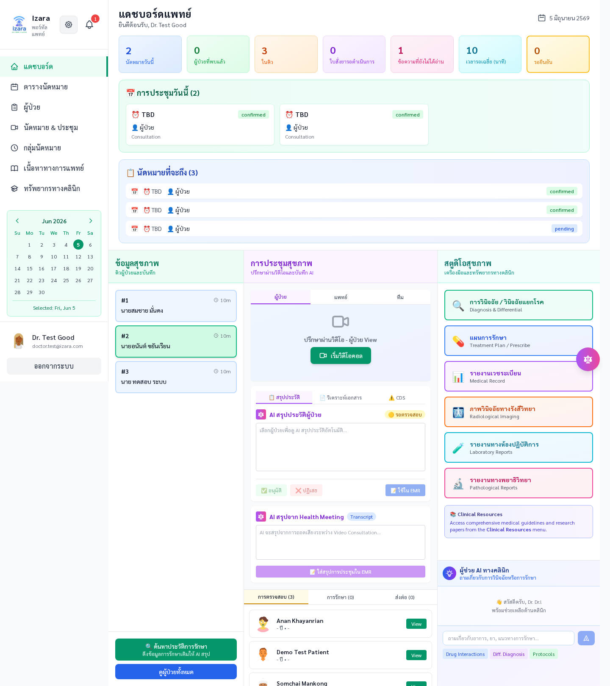
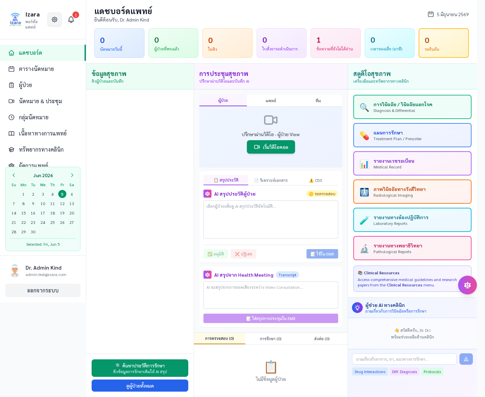
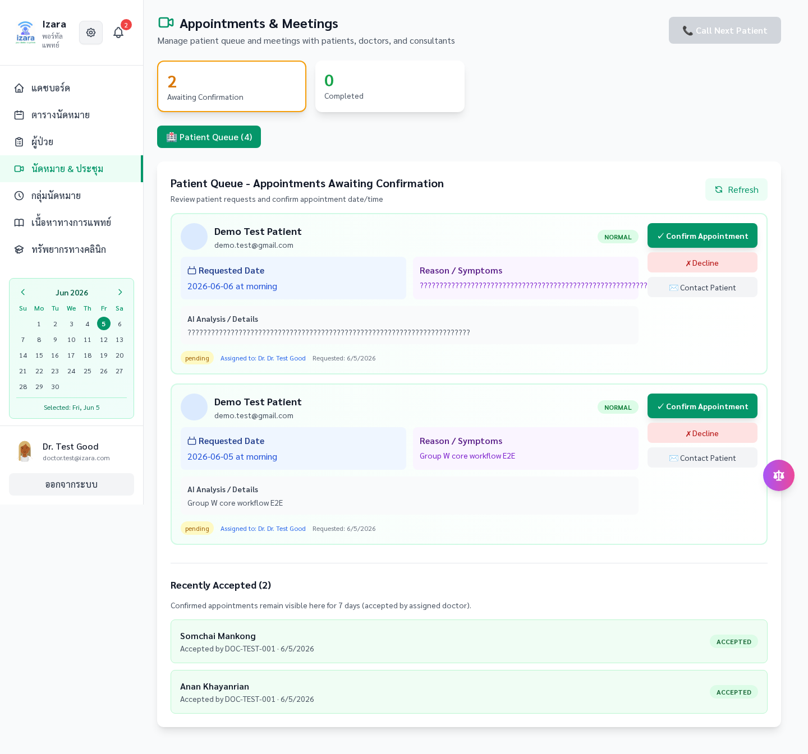
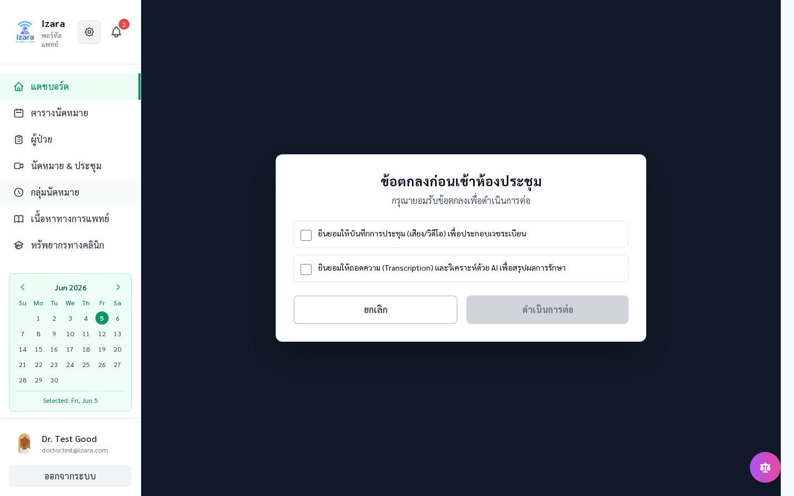
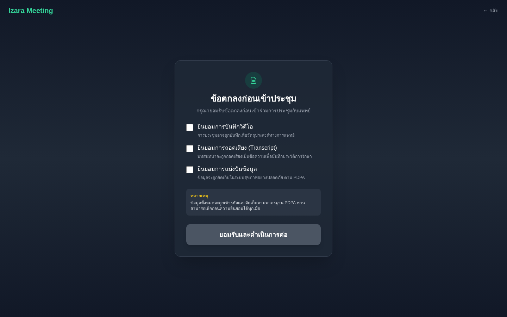
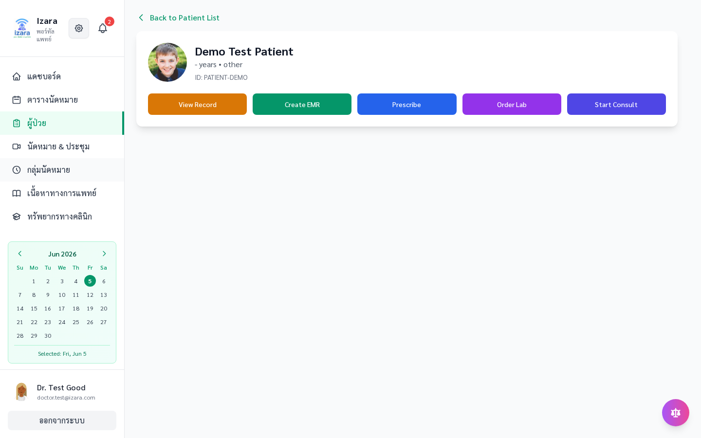
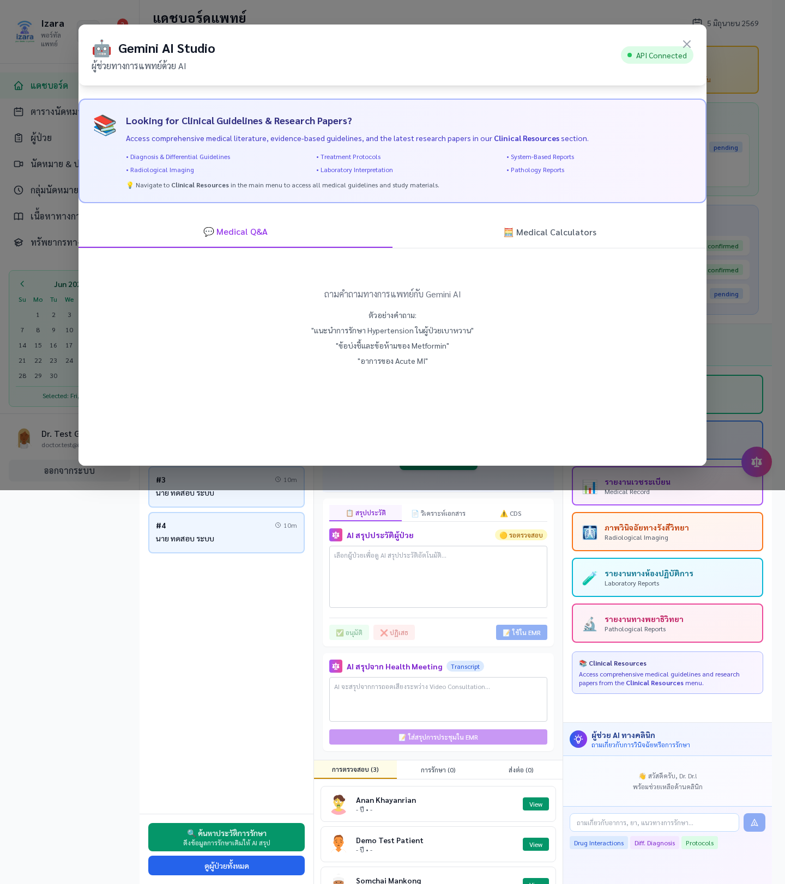

# Docker Multi-Browser E2E — Group W Core Workflow

> **Last verified:** 2026-06-05 · **App:** v1.7.50 · **Browsers:** Chromium, Firefox, WebKit  
> **Result:** 6/6 workflows × 3 engines = **18/18 PASS** (+ A-auth gate 13/13)

Group W exercises the canonical paths from [Processes/FULL_WORKFLOW_CONTRACT.md](../../../Processes/FULL_WORKFLOW_CONTRACT.md):

login & dashboards → appointments → virtual meetings → EMR editor → Gemini AI Studio.

---

## Prerequisites

| Requirement | Notes |
|-------------|-------|
| Docker Desktop | Running with `host.docker.internal` support |
| `.env.docker` | Copy from `.env.example`; use placeholder secrets (`GEMINI_API_KEY=xxxxx`, etc.) |
| Disk space | ~4 GB for Playwright image + portal builds |
| RAM | 8 GB+ recommended; runner uses `--shm-size=2g` |

Test credentials (seeded by `scripts/database/seed-dev-data.sql`):

| Role | User ID | Password env |
|------|---------|--------------|
| Patient | `PATIENT-DEMO` | `TEST_PATIENT_PASSWORD` (default `P@ssw0rd`) |
| Doctor | `DOC-TEST-001` | `TEST_DOCTOR_PASSWORD` (default `IzaraDoctor@2024`) |
| Admin | `ADMIN-TEST-001` | `TEST_ADMIN_PASSWORD` (default `IzaraAdmin@2024`) |

---

## One-command full run

From repository root:

```bash
npm run test:e2e:docker:core-multibrowser
```

This script (`scripts/docker/run-e2e-core-multibrowser.mjs`):

1. `docker compose down -v` — fresh Postgres volume
2. Builds and starts `postgres`, `patient-portal`, `doctor-portal`, `meeting-server`
3. Waits for `/api/health` on all three services
4. **Resets DB** (`cleanup-test-data.sql` + `seed-dev-data.sql`)
5. Runs **A-auth** (13 tests) inside Playwright container
6. For each browser (`chromium`, `firefox`, `webkit`):
   - **Resets DB again** (clean baseline per engine)
   - Runs **W-core-{browser}** (6 serial workflow tests, 1 worker)

Success screenshots are written to `tests/output/screenshots/{browser}/group-W/`.

---

## Quick iteration (stack already up)

```powershell
# Reset database baseline
Get-Content scripts\database\cleanup-test-data.sql | docker exec -i izara-postgres psql -U postgres -d izara_phase1 -v ON_ERROR_STOP=1
Get-Content scripts\database\seed-dev-data.sql | docker exec -i izara-postgres psql -U postgres -d izara_phase1 -v ON_ERROR_STOP=1

# Single browser (set PW_CORE_BROWSER=chromium|firefox|webkit)
docker run --rm --add-host host.docker.internal:host-gateway --shm-size=2g `
  -v "${PWD}:/workspace" -w /workspace `
  -e LOCAL_PATIENT_URL=http://host.docker.internal:3005 `
  -e LOCAL_DOCTOR_URL=http://host.docker.internal:3010 `
  -e LOCAL_MEETING_URL=http://host.docker.internal:3020 `
  -e PW_HEADLESS=1 -e PW_CORE_BROWSER=chromium `
  -e TEST_DOCTOR_PASSWORD=IzaraDoctor@2024 `
  -e TEST_ADMIN_PASSWORD=IzaraAdmin@2024 `
  -e TEST_PATIENT_PASSWORD=P@ssw0rd `
  mcr.microsoft.com/playwright:v1.58.2-jammy `
  sh -c "npx playwright test --project=W-core-chromium --workers=1"
```

After changing portal source code, rebuild the affected service:

```bash
docker compose -f docker-compose.yml --env-file .env.docker up -d --build doctor-portal
```

Use `--no-cache` when Docker layer cache may serve stale frontend bundles.

---

## Refresh documentation screenshots

After a **100% green** run:

```bash
npm run docs:sync-screenshots
```

Copies PNGs from `tests/output/screenshots/` into `docs/screenshots/group-W/`:

| Path | Content |
|------|---------|
| `group-W/*.png` | Canonical Chromium captures (used in guides) |
| `group-W/browsers/chromium/` | Chromium originals |
| `group-W/browsers/firefox/` | Firefox originals |
| `group-W/browsers/webkit/` | WebKit originals |
| `group-W/manifest.json` | Sync metadata + workflow file list |

Then update markdown image references if workflow step names changed. Primary consumer guides:

- [APPOINTMENT_USER_GUIDE.md](../operations/APPOINTMENT_USER_GUIDE.md)
- [UNIT_TEST_UI_COVERAGE.md](UNIT_TEST_UI_COVERAGE.md)
- [Documents hub README.md](../../README.md)

---

## Workflow map (Group W)

| Test | Process area | Screenshot files |
|------|--------------|------------------|
| W01 | Auth dashboards (patient, doctor, admin) | `W01-patient-dashboard.png`, `W01-doctor-dashboard.png`, `W01-admin-dashboard.png` |
| W02 | Patient appointments list + booking | `W02-appointments-list.png`, `W02-appointment-created.png` |
| W03 | Doctor Health Meeting + Appointment Pool | `W03-health-meeting.png`, `W03-appointment-pool.png` |
| W04 | Virtual meeting (doctor + patient) | `W04-doctor-virtual-meeting.png`, `W04-patient-meeting-room.png` |
| W05 | EMR editor + autosave | `W05-patient-detail.png`, `W05-emr-editor.png` |
| W06 | Gemini AI Studio + API Connected | `W06-gemini-studio-open.png`, `W06-gemini-api-connected.png` |

Playwright project names: `W-core-chromium`, `W-core-firefox`, `W-core-webkit`.  
Test file: [tests/group-W-core-multibrowser.ui-test.ts](../../../tests/group-W-core-multibrowser.ui-test.ts).

---

## Verified UI evidence (Chromium — canonical)

### W01 — Dashboards






### W02 — Appointments


### W03 — Queue & pool




### W04 — Virtual meeting





### W05 — EMR editor




### W06 — Gemini AI Studio




---

## Multi-browser parity

Each workflow above was captured independently on **Chromium**, **Firefox**, and **WebKit** with a fresh DB seed per browser run. Compare per-engine renders:

```
docs/screenshots/group-W/browsers/chromium/
docs/screenshots/group-W/browsers/firefox/
docs/screenshots/group-W/browsers/webkit/
```

---

## Data hygiene note

Screenshots use **seeded demo accounts** (`PATIENT-DEMO`, `DOC-TEST-001`, `ADMIN-TEST-001`) and synthetic appointment IDs (`APT-*`). No production PHI appears in captures. Before publishing externally, re-run sync after E2E and spot-check for accidental env placeholders in visible UI chrome.

---

## Related commands

| Command | Purpose |
|---------|---------|
| `npm run test:unit:docker` | Vitest **2938** tests in Docker |
| `npm run test:unit:docker:deploy` | Stack rebuild + unit + meeting contracts |
| `npm run test:e2e:docker:queue-traceability` | Queue lifecycle Docker E2E |
| `npm run test:e2e:docker:jitsi-roles` | Jitsi JWT role Docker E2E |

Process matrix: [tests/PROCESS_COVERAGE_MATRIX.md](../../../tests/PROCESS_COVERAGE_MATRIX.md)
