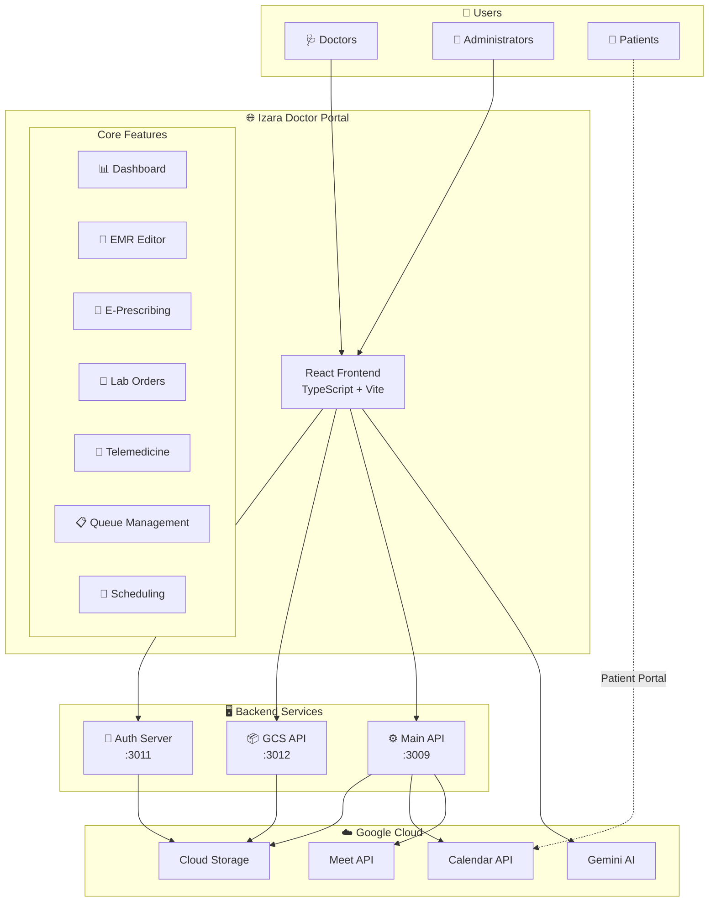
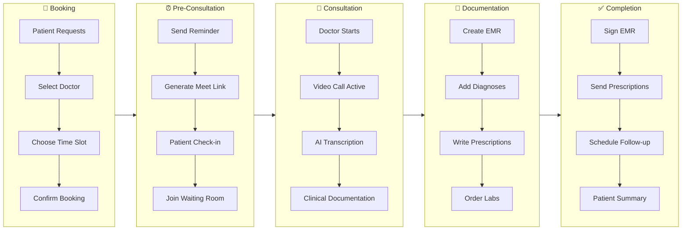
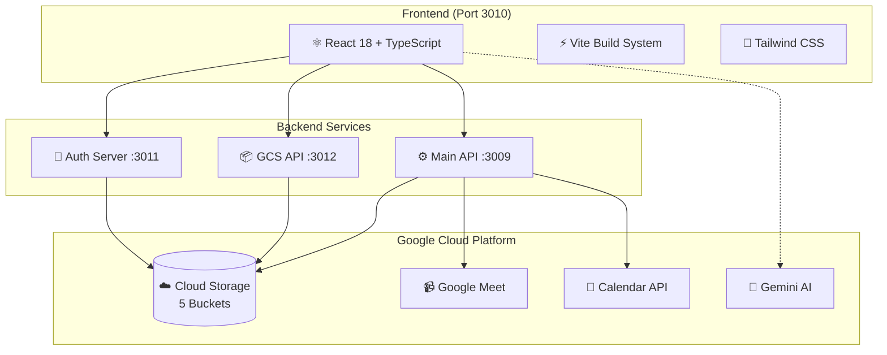

# 📚 Izara Doctor Portal - Documentation

**AI-Powered Telemedicine Platform Documentation**

Welcome to the comprehensive documentation for the Izara Doctor Portal. This documentation provides detailed information about the system architecture, features, data structures, and workflows.

---

## 🚀 Version Information

| Component | Version | Status |
|-----------|---------|--------|
| **Portal Version** | 1.0.0 | ✅ Stable |
| **Documentation Version** | 2.0.0 | ✅ Updated |
| **API Version** | v1 | ✅ Production |
| **Last Updated** | December 2025 | |
| **Node.js** | 18+ | Required |
| **React** | 18.x | Latest |

### 📌 Release Highlights (v1.0.0)
- 🤖 **AI-Powered Clinical Copilot** - Gemini 2.0 integration for clinical decision support
- 🎥 **Telemedicine** - Google Meet integration with real-time transcription
- 📝 **Complete EMR System** - SOAP notes, ICD-10 coding, treatment plans
- 💊 **E-Prescribing** - Drug interaction checking, digital signatures
- 🧪 **Lab Orders** - Integrated lab ordering and results tracking
- 📅 **Smart Scheduling** - Calendar management with availability settings
- 🔒 **PDPA Compliant** - Thailand's data protection compliance

---

## 📊 System Overview Flowchart



---

## 🔄 Complete Consultation Workflow



---

## 📁 Documentation Structure

```
doc/
├── 📄 README.md                        # This file - Documentation index
├── 📄 CHANGELOG.md                     # Version history and changes
│
├── 📁 overview/                        # System Overview
│   ├── system-overview.md             # Overall system explanation
│   ├── architecture.md                # Technical architecture
│   ├── technology-stack.md            # Technologies used
│   └── diagrams/
│       ├── system-architecture.mermaid
│       └── user-journey.mermaid
│
├── 📁 doctor/                          # Doctor Portal Documentation
│   ├── doctor-features.md             # Doctor portal features
│   ├── doctor-workflows.md            # Doctor user workflows
│   ├── doctor-access-control.md       # Doctor permissions
│   └── diagrams/
│       ├── doctor-workflow.mermaid
│       └── doctor-navigation.mermaid
│
├── 📁 admin/                           # Admin Portal Documentation
│   ├── admin-features.md              # Admin portal features
│   ├── admin-workflows.md             # Admin user workflows
│   ├── admin-access-control.md        # Admin permissions
│   └── diagrams/
│       ├── admin-workflow.mermaid
│       └── admin-approval.mermaid
│
├── 📁 data-structures/                 # Data Architecture
│   ├── data-models.md                 # All data models
│   ├── database-schema.dbml           # DBML schema definition
│   ├── json-schemas.md                # JSON structure documentation
│   ├── gcs-bucket-structure.md        # GCS bucket organization
│   └── diagrams/
│       ├── data-flow.mermaid
│       └── entity-relationship.mermaid
│
├── 📁 api/                             # API Documentation
│   ├── api-reference.md               # API documentation
│   └── authentication.md              # Auth flow documentation
│
├── 📁 workflows/                       # Workflow Documentation
│   ├── appointment-workflow.md        # Appointment management
│   ├── emr-workflow.md                # EMR creation workflow
│   ├── prescribing-workflow.md        # E-prescribing workflow
│   ├── telemedicine-workflow.md       # Virtual consultation workflow
│   └── diagrams/
│       ├── consultation-flow.mermaid
│       └── queue-states.mermaid
│
├── 📄 deployment.md                    # 🚀 Deployment guide (NEW)
└── 📄 files-reference.md               # 📂 Project files reference (NEW)
```

---

## 🚀 Quick Links

### 👨‍⚕️ For Doctors
| Document | Description |
|----------|-------------|
| [Doctor Features Guide](./doctor/doctor-features.md) | Complete feature overview |
| [Doctor Workflows](./doctor/doctor-workflows.md) | Step-by-step workflows |
| [Doctor Access Control](./doctor/doctor-access-control.md) | Permissions & security |

### 👔 For Administrators
| Document | Description |
|----------|-------------|
| [Admin Features Guide](./admin/admin-features.md) | Admin dashboard features |
| [Admin Workflows](./admin/admin-workflows.md) | Management workflows |
| [Admin Access Control](./admin/admin-access-control.md) | Admin permissions |

### 🔧 Technical Documentation
| Document | Description |
|----------|-------------|
| [System Overview](./overview/system-overview.md) | Architecture overview |
| [Architecture](./overview/architecture.md) | Technical details |
| [Technology Stack](./overview/technology-stack.md) | Tech specifications |
| [Data Structures](./data-structures/data-models.md) | Data models |
| [API Reference](./api/api-reference.md) | API endpoints |

### 🚀 Deployment & Operations
| Document | Description |
|----------|-------------|
| [Deployment Guide](./deployment.md) | Docker & GCP deployment |
| [Files Reference](./files-reference.md) | Complete project file index |

### 📋 Workflow Documentation
| Document | Description |
|----------|-------------|
| [Appointment Workflow](./workflows/appointment-workflow.md) | Booking & scheduling |
| [EMR Workflow](./workflows/emr-workflow.md) | Medical records |
| [Prescribing Workflow](./workflows/prescribing-workflow.md) | E-prescriptions |
| [Telemedicine Workflow](./workflows/telemedicine-workflow.md) | Video consultations |

---

## 🏗️ Architecture at a Glance



---

## 📈 Key Metrics & Capabilities

| Capability | Status | Description |
|------------|--------|-------------|
| **Concurrent Users** | ✅ | Supports multiple doctors simultaneously |
| **Real-time Updates** | ✅ | WebSocket-based queue & notifications |
| **AI Integration** | ✅ | Gemini 2.0 for clinical assistance |
| **Video Calls** | ✅ | Google Meet integration |
| **Mobile Responsive** | ✅ | Optimized for all screen sizes |
| **Offline Support** | 🚧 | Planned for future release |
| **Multi-language** | ✅ | Thai & English support |

---

## 📞 Support & Contact

For technical support or questions about this documentation:

- 📧 **Email**: dev-team@izara.health
- 📖 **GitHub**: [Repository Issues](https://github.com/chiraleo2000/Telemedicine-Google-MoC/issues)
- 📚 **Wiki**: Check the GitHub Wiki for FAQs

---

## 📜 License & Compliance

- **PDPA Compliant** - Thailand's Personal Data Protection Act
- **HIPAA Considerations** - Healthcare data security standards
- **Medical Records** - Audit logging enabled
