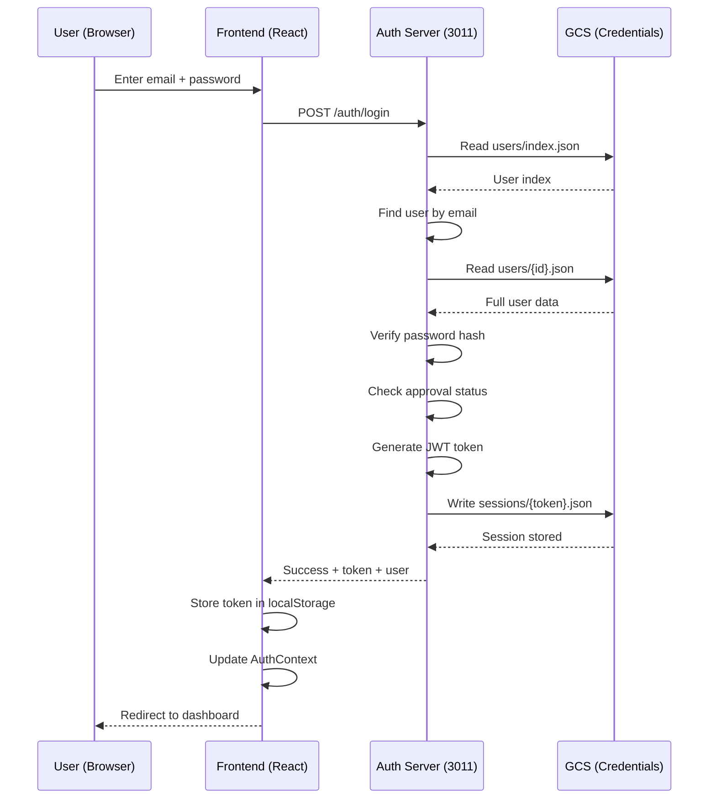
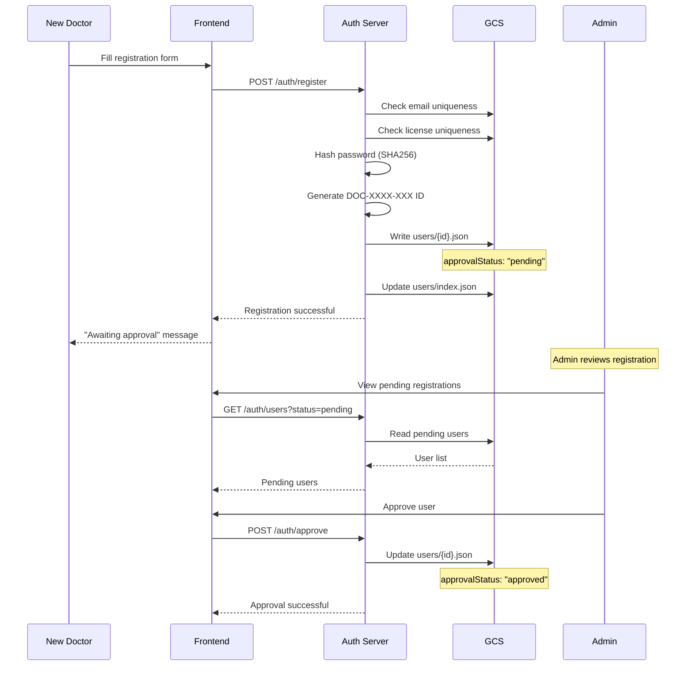
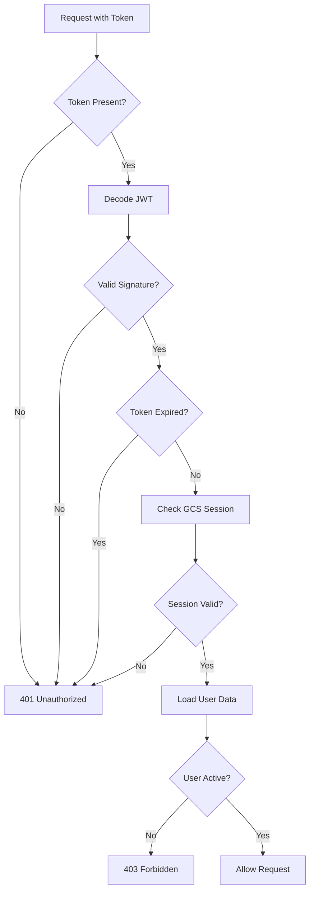
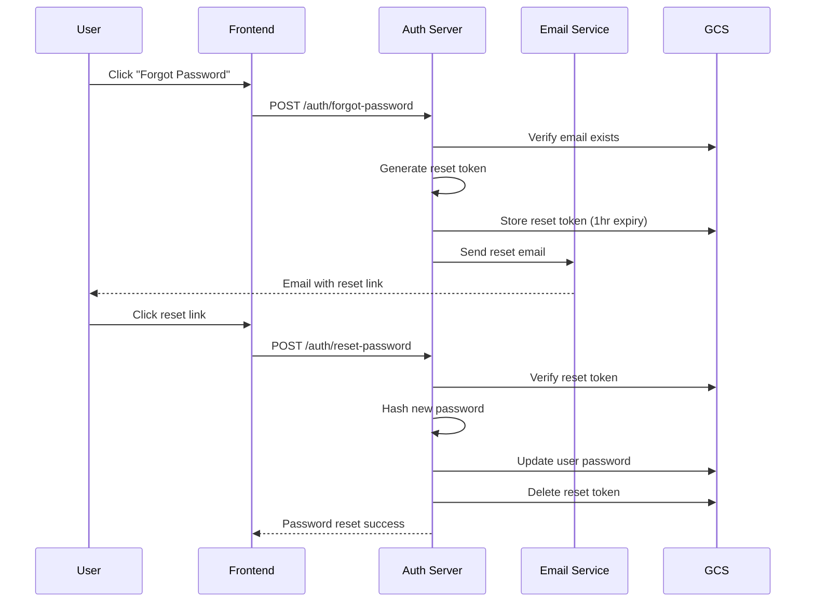

# 🔐 Authentication Flow

## Overview

The Izara Doctor Portal implements a token-based authentication system with session management, role-based access control, and multi-level approval workflows.

---

## 🏗️ Authentication Architecture

```
┌─────────────────┐     ┌─────────────────┐     ┌─────────────────┐
│   React App     │────▶│   Auth Server   │────▶│   GCS Bucket    │
│   (Frontend)    │◀────│   (Port 3011)   │◀────│   (Credentials) │
└─────────────────┘     └─────────────────┘     └─────────────────┘
        │                       │
        │                       │
        ▼                       ▼
┌─────────────────┐     ┌─────────────────┐
│  Local Storage  │     │  Session Store  │
│  (Token/User)   │     │  (GCS Sessions) │
└─────────────────┘     └─────────────────┘
```

---

## 🔄 Login Flow



---

## 📝 Registration Flow



---

## 🔑 Token Structure

### JWT Payload

```json
{
  "userId": "DOC-1234-567",
  "email": "doctor@example.com",
  "role": "doctor",
  "doctorId": "DOC-1234-567",
  "isAdmin": false,
  "adminPrivileges": null,
  "iat": 1718892000,
  "exp": 1718978400
}
```

### Token Lifecycle

| Stage | Duration | Action |
|-------|----------|--------|
| Creation | Login | Generated with 24h expiry |
| Validation | Each request | Verified by auth middleware |
| Refresh | Near expiry | Auto-refresh if active |
| Expiration | 24 hours | Force re-login |
| Revocation | Logout | Session deleted from GCS |

---

## 🛡️ Session Management

### Session Storage

**Location:** `izara-users-credentials/sessions/{token}.json`

```json
{
  "token": "eyJhbGciOiJIUzI1NiIs...",
  "userId": "DOC-1234-567",
  "createdAt": "2024-06-20T10:00:00.000Z",
  "expiresAt": "2024-06-21T10:00:00.000Z",
  "userAgent": "Mozilla/5.0 (Windows NT 10.0; Win64; x64)...",
  "ipAddress": "192.168.1.100",
  "isValid": true
}
```

### Session Validation Flow



---

## 👤 User Roles & Permissions

### Role Hierarchy

```
super_admin
    │
    ├── admin
    │       │
    │       └── moderator
    │
    └── doctor (standard)
```

### Permission Matrix

| Permission | Doctor | Moderator | Admin | Super Admin |
|------------|--------|-----------|-------|-------------|
| View own patients | ✅ | ✅ | ✅ | ✅ |
| Create EMR | ✅ | ✅ | ✅ | ✅ |
| Write prescriptions | ✅ | ✅ | ✅ | ✅ |
| View all patients | ❌ | ✅ | ✅ | ✅ |
| Manage appointments | ❌ | ✅ | ✅ | ✅ |
| Approve doctors | ❌ | ❌ | ✅ | ✅ |
| Manage doctors | ❌ | ❌ | ✅ | ✅ |
| View analytics | ❌ | ❌ | ✅ | ✅ |
| Manage settings | ❌ | ❌ | ❌ | ✅ |
| Assign roles | ❌ | ❌ | ❌ | ✅ |

---

## 🔒 Password Security

### Password Requirements

- Minimum 8 characters
- At least 1 uppercase letter
- At least 1 lowercase letter
- At least 1 number
- At least 1 special character

### Password Storage

```javascript
// Password hashing (SHA256)
const crypto = require('crypto');
const passwordHash = crypto
  .createHash('sha256')
  .update(password)
  .digest('hex');
```

### Password Reset Flow



---

## 🚫 Account Lockout

### Lockout Rules

| Condition | Action |
|-----------|--------|
| 3 failed attempts | Warning message |
| 5 failed attempts | Account locked 15 minutes |
| 10 failed attempts | Account locked 1 hour |
| Admin intervention | Manual unlock required |

### Lockout Storage

```json
{
  "loginAttempts": 5,
  "lockedUntil": "2024-06-20T10:15:00.000Z",
  "lastFailedAttempt": "2024-06-20T10:00:00.000Z"
}
```

---

## 🔄 Auth Context (Frontend)

### AuthContext Structure

```typescript
interface AuthContextType {
  user: User | null;
  isAuthenticated: boolean;
  isLoading: boolean;
  isAdmin: boolean;
  login: (email: string, password: string) => Promise<LoginResult>;
  logout: () => Promise<void>;
  register: (data: RegisterData) => Promise<RegisterResult>;
  updateProfile: (data: ProfileData) => Promise<void>;
  refreshToken: () => Promise<void>;
}
```

### Auth State Management

```typescript
// localStorage keys
const AUTH_TOKEN_KEY = 'izara_auth_token';
const AUTH_USER_KEY = 'izara_auth_user';

// On app load
useEffect(() => {
  const token = localStorage.getItem(AUTH_TOKEN_KEY);
  const user = localStorage.getItem(AUTH_USER_KEY);
  if (token && user) {
    verifyToken(token).then(valid => {
      if (valid) {
        setUser(JSON.parse(user));
        setIsAuthenticated(true);
      } else {
        logout();
      }
    });
  }
}, []);
```

---

## 🛤️ Protected Routes

### Route Protection

```tsx
// App.tsx route structure
<Routes>
  {/* Public routes */}
  <Route path="/login" element={<LoginPage />} />
  <Route path="/register" element={<RegisterPage />} />
  
  {/* Protected doctor routes */}
  <Route
    path="/doctor/:userId/*"
    element={
      <ProtectedRoute requiredRole="doctor">
        <DoctorPortal />
      </ProtectedRoute>
    }
  />
  
  {/* Protected admin routes */}
  <Route
    path="/admin/*"
    element={
      <ProtectedRoute requiredRole="admin">
        <AdminPortal />
      </ProtectedRoute>
    }
  />
</Routes>
```

### ProtectedRoute Component

```tsx
function ProtectedRoute({ children, requiredRole }) {
  const { isAuthenticated, user, isLoading } = useAuth();
  
  if (isLoading) return <LoadingSpinner />;
  
  if (!isAuthenticated) {
    return <Navigate to="/login" replace />;
  }
  
  if (requiredRole === 'admin' && !user.isAdmin) {
    return <Navigate to="/unauthorized" replace />;
  }
  
  return children;
}
```

---

## 🔍 API Authentication Middleware

### Server-Side Validation

```javascript
// authServer.cjs middleware
async function authenticateToken(req, res, next) {
  const authHeader = req.headers['authorization'];
  const token = authHeader && authHeader.split(' ')[1];
  
  if (!token) {
    return res.status(401).json({ error: 'No token provided' });
  }
  
  try {
    // Verify JWT
    const decoded = jwt.verify(token, JWT_SECRET);
    
    // Check session in GCS
    const session = await readSessionFromGCS(token);
    if (!session || !session.isValid) {
      return res.status(401).json({ error: 'Invalid session' });
    }
    
    // Check if session expired
    if (new Date(session.expiresAt) < new Date()) {
      return res.status(401).json({ error: 'Session expired' });
    }
    
    // Load user data
    const user = await readUserFromGCS(decoded.userId);
    if (!user.isActive) {
      return res.status(403).json({ error: 'Account disabled' });
    }
    
    req.user = user;
    next();
  } catch (error) {
    return res.status(401).json({ error: 'Invalid token' });
  }
}
```

### Admin-Only Middleware

```javascript
function requireAdmin(req, res, next) {
  if (!req.user.isAdmin) {
    return res.status(403).json({ 
      error: 'Admin access required' 
    });
  }
  next();
}
```

---

## 📊 Authentication Events Audit

### Logged Events

| Event | Data Captured |
|-------|---------------|
| Login Success | userId, IP, userAgent, timestamp |
| Login Failed | email, IP, userAgent, reason |
| Logout | userId, IP, timestamp |
| Registration | email, IP, userAgent |
| Password Reset | email, IP, timestamp |
| Account Locked | userId, IP, attempts |
| Admin Approval | adminId, userId, action |

### Audit Log Format

```json
{
  "event": "login_success",
  "userId": "DOC-1234-567",
  "email": "doctor@example.com",
  "ipAddress": "192.168.1.100",
  "userAgent": "Mozilla/5.0...",
  "timestamp": "2024-06-20T10:00:00.000Z",
  "metadata": {
    "sessionId": "sess_xxx",
    "method": "password"
  }
}
```
