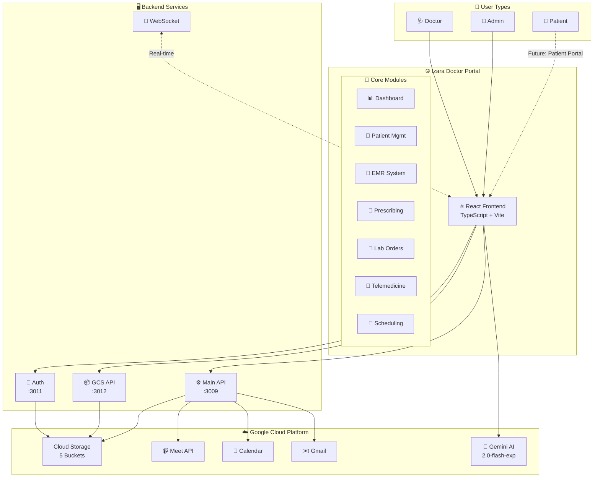
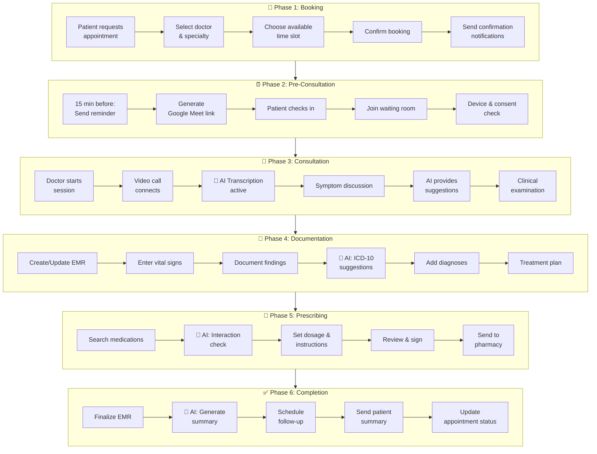
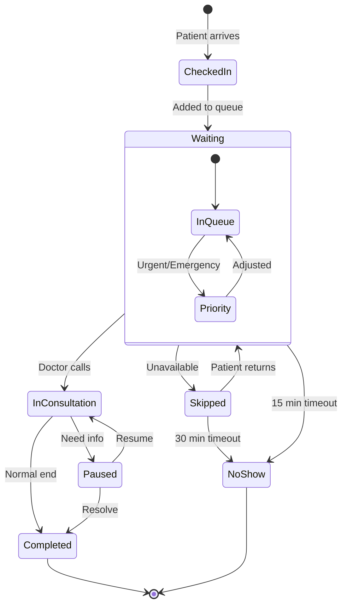

# 🏥 Izara Doctor Portal - System Overview

## Version Information

| Component | Version | Status |
|-----------|---------|--------|
| **Portal Version** | 1.0.0 | ✅ Stable |
| **API Version** | v1 | ✅ Production |
| **Last Updated** | December 2025 | |

## Introduction

The **Izara Doctor Portal** is a comprehensive AI-powered telemedicine platform designed for healthcare providers. It enables doctors and healthcare administrators to manage patients, appointments, electronic medical records (EMR), prescriptions, lab orders, and virtual consultations - all within a unified, modern web interface.

---

## 🎯 Purpose & Goals

### Primary Objectives
1. **Streamline Clinical Workflows** - Reduce administrative burden on healthcare providers
2. **Enable Telemedicine** - Support virtual consultations via video conferencing
3. **Digitize Medical Records** - Comprehensive EMR/EHR management with AI assistance
4. **Enhance Patient Care** - AI-powered clinical decision support
5. **Ensure Compliance** - PDPA (Thailand's Personal Data Protection Act) compliance

### Target Users
| User Type | Description |
|-----------|-------------|
| **Doctors** | Primary care physicians, specialists conducting consultations |
| **Administrators** | Healthcare admins managing doctors, appointments, and system settings |
| **Medical Staff** | Nurses, assistants supporting clinical operations |

---

## 🔄 High-Level System Flowchart



---

## ✨ Key Features Overview

### 🤖 AI-Powered Clinical Support
- **Gemini AI Integration** - Google's AI for clinical assistance
- **Diagnosis Suggestions** - AI-suggested ICD-10 codes
- **Drug Interaction Checking** - Automated safety alerts
- **Voice Transcription** - Real-time consultation transcription
- **Clinical Note Summarization** - AI-generated SOAP notes

### 👨‍⚕️ Doctor Portal Features
| Feature | Description |
|---------|-------------|
| **Health Studio Dashboard** | AI-powered clinical dashboard with patient visualization |
| **Patient Management** | View/manage patient records, demographics, medical history |
| **EMR Editor** | Create/edit SOAP notes, assessments, treatment plans |
| **E-Prescribing** | Drug search, interaction checking, digital prescriptions |
| **Lab Orders** | Order tests, view results, trend analysis |
| **Schedule Management** | Calendar views, appointment booking, availability |
| **Queue Management** | Real-time patient queue with priority indicators |
| **Virtual Consultations** | Google Meet integration with AI transcription |

### 🔧 Admin Features
| Feature | Description |
|---------|-------------|
| **Doctor Management** | Approve/reject doctor registrations, manage accounts |
| **Appointment Management** | Assign appointments to doctors, track status |
| **System Analytics** | Usage statistics, performance metrics |
| **User Management** | Account activation/deactivation |

---

## 🏗️ System Architecture

```
┌─────────────────────────────────────────────────────────────────────────────┐
│                           IZARA DOCTOR PORTAL                               │
│                        (React + TypeScript + Vite)                          │
├─────────────────────────────────────────────────────────────────────────────┤
│                                                                             │
│  ┌──────────────────┐  ┌──────────────────┐  ┌──────────────────┐          │
│  │  Doctor Portal   │  │  Admin Portal    │  │  Shared Components │         │
│  │  • Dashboard     │  │  • Doctor Mgmt   │  │  • Auth Provider   │         │
│  │  • Patients      │  │  • Appointments  │  │  • Layout          │         │
│  │  • EMR Editor    │  │  • Analytics     │  │  • UI Components   │         │
│  │  • Prescribing   │  │                  │  │                    │         │
│  │  • Lab Orders    │  │                  │  │                    │         │
│  │  • Virtual Meet  │  │                  │  │                    │         │
│  └──────────────────┘  └──────────────────┘  └──────────────────┘          │
│                                                                             │
├─────────────────────────────────────────────────────────────────────────────┤
│                              SERVICES LAYER                                  │
├─────────────────────────────────────────────────────────────────────────────┤
│  Auth Service │ Patient Data │ EMR Service │ Appointment │ Gemini AI │ GCS │
└─────────────────────────────────────────────────────────────────────────────┘
                                      │
                                      ▼
┌─────────────────────────────────────────────────────────────────────────────┐
│                           BACKEND SERVERS                                    │
├─────────────────────────────────────────────────────────────────────────────┤
│  Auth Server (3011) │ GCS API Server (3012) │ Main API Server (3009)       │
└─────────────────────────────────────────────────────────────────────────────┘
                                      │
                                      ▼
┌─────────────────────────────────────────────────────────────────────────────┐
│                         GOOGLE CLOUD PLATFORM                                │
├─────────────────────────────────────────────────────────────────────────────┤
│  Cloud Storage Buckets:                                                      │
│  • izara-users-credentials  (Auth & Users)                                  │
│  • izara-doctors-data       (Doctor Profiles)                               │
│  • izara-patients-data      (Patient Records, EMRs)                         │
│  • izara-appointments       (Appointments & Bookings)                       │
│  • izara-meta-data          (Reference Data)                                │
├─────────────────────────────────────────────────────────────────────────────┤
│  Google APIs:                                                                │
│  • Gemini AI  │  Calendar API  │  Gmail API  │  Meet API                    │
└─────────────────────────────────────────────────────────────────────────────┘
```

---

## 🔐 Security & Compliance

### Authentication
- SHA256 password hashing
- Session token management
- Account lockout after failed attempts
- Admin approval workflow for new doctors

### PDPA Compliance
- Patient consent management
- Data access audit logging
- Configurable data retention
- Right to access/delete personal data

### Access Control
- Role-based access (Doctor, Admin)
- Feature-level permissions
- Admin privileges system

---

## 🌐 Deployment Architecture

### Development Environment
```
Frontend:  http://localhost:3010 (Vite Dev Server)
Auth API:  http://localhost:3011
GCS API:   http://localhost:3012
Main API:  http://localhost:3009
```

### Production Deployment
- Docker containerization
- Nginx reverse proxy
- GCS private buckets with signed URLs
- HTTPS/TLS encryption

---

## 📱 User Interface

### Responsive Design
- **Desktop** - Full-featured sidebar navigation
- **Tablet** - Collapsible sidebar
- **Mobile** - Bottom navigation bar

### Design System
- **Primary Color** - Emerald/Teal gradient
- **Framework** - Tailwind CSS
- **Icons** - Custom SVG icons + Heroicons
- **Typography** - System fonts with Thai language support

---

## 🔗 Integration Points

| Integration | Purpose |
|-------------|---------|
| **Google Meet** | Video consultations |
| **Google Calendar** | Appointment scheduling |
| **Gmail API** | Email notifications |
| **Gemini AI** | Clinical AI assistance |
| **Google Cloud Storage** | Data persistence |

---

## 📊 Data Flow Overview

```
User Request → Frontend (React) → Services Layer → Backend API → GCS Buckets
                    ↓                    ↓
              AI Processing      Session Management
              (Gemini API)        (Auth Server)
```

---

## 🚦 System Status Indicators

| Indicator | Meaning |
|-----------|---------|
| 🟢 Healthy | All services operational |
| 🟡 Warning | Degraded performance |
| 🔴 Error | Service unavailable |

---

## 📈 Scalability Considerations

- **Horizontal Scaling** - Multiple frontend instances
- **Data Partitioning** - Patient data by ID prefix
- **Caching** - In-memory cache for reference data
- **CDN** - Static asset delivery (planned)

---

## 🔄 Complete Workflow Overview

### End-to-End Consultation Flowchart



### Queue State Machine



---

## 🔄 Version History

| Version | Date | Changes |
|---------|------|---------|
| 1.0.0 | Dec 2025 | Stable release with full doctor portal |
| 0.0.2 | Nov 2025 | Beta with core features |
| 0.0.1 | Oct 2025 | Initial alpha release |

For detailed changes, see [CHANGELOG.md](../CHANGELOG.md)
