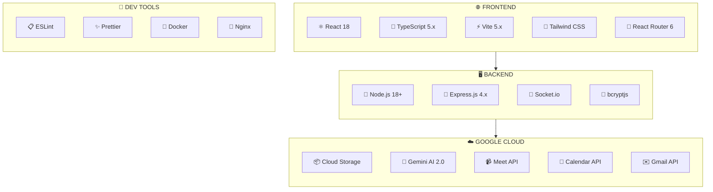

# 🛠️ Technology Stack

## Version Information

| Component | Version | Status |
|-----------|---------|--------|
| **Portal Version** | 1.0.0 | ✅ Stable |
| **Stack Version** | 2.0 | ✅ Production |
| **Last Updated** | December 2025 | |

## Overview

The Izara Doctor Portal is built with modern web technologies focused on performance, developer experience, and scalability.

---

## 📊 Technology Stack Diagram



---

## 📦 Frontend Technologies

### Core Framework
| Technology | Version | Purpose |
|------------|---------|---------|
| **React** | 18.x | UI component library |
| **TypeScript** | 5.x | Type-safe JavaScript |
| **Vite** | 5.x | Build tool & dev server |
| **React Router** | 6.x | Client-side routing |

### Styling
| Technology | Purpose |
|------------|---------|
| **Tailwind CSS** | Utility-first CSS framework |
| **CSS Modules** | Component-scoped styles |
| **Custom SVG Icons** | Optimized icon system |

### State Management
| Technology | Purpose |
|------------|---------|
| **React Context** | Global state (Auth, User) |
| **useState/useEffect** | Component state |
| **Custom Hooks** | Reusable state logic |

---

## 🖥️ Backend Technologies

### Runtime
| Technology | Version | Purpose |
|------------|---------|---------|
| **Node.js** | 18+ | JavaScript runtime |
| **Express.js** | 4.x | HTTP server framework |

### Server Components
| Component | Port | Purpose |
|-----------|------|---------|
| **Auth Server** | 3011 | Authentication, user management |
| **GCS API Server** | 3012 | Google Cloud Storage proxy |
| **Main API Server** | 3009 | Business logic APIs |

### Real-time
| Technology | Purpose |
|------------|---------|
| **Socket.io** | WebSocket for real-time updates |
| **Polling** | Fallback for queue updates |

---

## ☁️ Google Cloud Platform

### Storage
| Service | Bucket Name | Data Type |
|---------|-------------|-----------|
| **Cloud Storage** | izara-users-credentials | User accounts, sessions |
| **Cloud Storage** | izara-doctors-data | Doctor profiles, queues |
| **Cloud Storage** | izara-patients-data | Patient EMRs, records |
| **Cloud Storage** | izara-appointments | Appointment data |
| **Cloud Storage** | izara-meta-data | Reference data |

### APIs
| API | Purpose |
|-----|---------|
| **Gemini AI** | Clinical AI assistance, summarization |
| **Calendar API** | Appointment scheduling |
| **Meet API** | Video consultations |
| **Gmail API** | Email notifications |
| **Maps API** | Location services (planned) |

---

## 🤖 AI Integration

### Google Gemini
```typescript
// Configuration
const GEMINI_MODEL = 'gemini-2.5-flash';

// Features
- Clinical summary generation
- Diagnosis suggestions (ICD-10)
- Drug interaction checking
- Voice transcription
- Note summarization
```

### AI Service Methods
| Method | Purpose |
|--------|---------|
| `chat()` | Interactive AI conversation |
| `generateClinicalSummary()` | SOAP note generation |
| `suggestDiagnosis()` | ICD-10 code suggestions |
| `checkDrugInteraction()` | Drug safety checking |
| `transcribeAudio()` | Voice-to-text conversion |

---

## 📚 Key Libraries

### UI Components
| Library | Purpose |
|---------|---------|
| **@heroicons/react** | SVG icon components |
| **react-hot-toast** | Toast notifications |
| **date-fns** | Date formatting |

### API & Data
| Library | Purpose |
|---------|---------|
| **@google/generative-ai** | Gemini AI SDK |
| **fetch API** | HTTP requests |
| **bcryptjs** | Password hashing |

### Development Tools
| Tool | Purpose |
|------|---------|
| **ESLint** | Code linting |
| **Prettier** | Code formatting |
| **TypeScript** | Type checking |

---

## 🗂️ Data Formats

### JSON Schema
All data is stored as JSON in Google Cloud Storage:
```json
{
  "id": "unique-identifier",
  "createdAt": "ISO-8601 timestamp",
  "updatedAt": "ISO-8601 timestamp",
  "...": "domain-specific fields"
}
```

### File Organization
```
bucket-name/
├── collection.json          # Index file
├── collection/
│   ├── item-001.json       # Individual records
│   ├── item-002.json
│   └── ...
└── metadata/
    └── schema.json         # Optional schema definition
```

---

## 🔐 Security Libraries

| Library | Purpose |
|---------|---------|
| **bcryptjs** | Password hashing |
| **crypto (Node.js)** | Token generation |
| **Web Crypto API** | Client-side hashing |
| **CORS** | Cross-origin security |

---

## 📱 Responsive Design

### Breakpoints (Tailwind)
| Breakpoint | Min Width | Target Device |
|------------|-----------|---------------|
| `sm` | 640px | Mobile landscape |
| `md` | 768px | Tablet |
| `lg` | 1024px | Laptop |
| `xl` | 1280px | Desktop |
| `2xl` | 1536px | Large desktop |

### Custom Hook
```typescript
// useResponsive.ts
const { isMobile, isTablet, isDesktop } = useResponsive();
```

---

## 🧪 Testing Tools (Planned)

| Tool | Purpose |
|------|---------|
| **Jest** | Unit testing |
| **React Testing Library** | Component testing |
| **Cypress** | E2E testing |
| **MSW** | API mocking |

---

## 🚀 Build & Deploy Tools

### Development
```bash
npm run dev        # Vite dev server + backend
```

### Production
| Tool | Purpose |
|------|---------|
| **Vite** | Production build |
| **Docker** | Containerization |
| **nginx** | Reverse proxy |

### Configuration Files
| File | Purpose |
|------|---------|
| `vite.config.ts` | Vite configuration |
| `tsconfig.json` | TypeScript config |
| `package.json` | Dependencies & scripts |
| `.env` | Environment variables |
| `Dockerfile` | Container definition |
| `nginx.conf` | Nginx configuration |

---

## 📊 Performance Monitoring (Planned)

| Tool | Purpose |
|------|---------|
| **Google Analytics** | User analytics |
| **Sentry** | Error tracking |
| **Lighthouse** | Performance auditing |

---

## 🌐 Browser Support

| Browser | Minimum Version |
|---------|-----------------|
| Chrome | 90+ |
| Firefox | 90+ |
| Safari | 14+ |
| Edge | 90+ |

### Required Features
- ES2020+
- Web Crypto API
- MediaDevices API (for video)
- WebSocket
- CSS Grid/Flexbox
