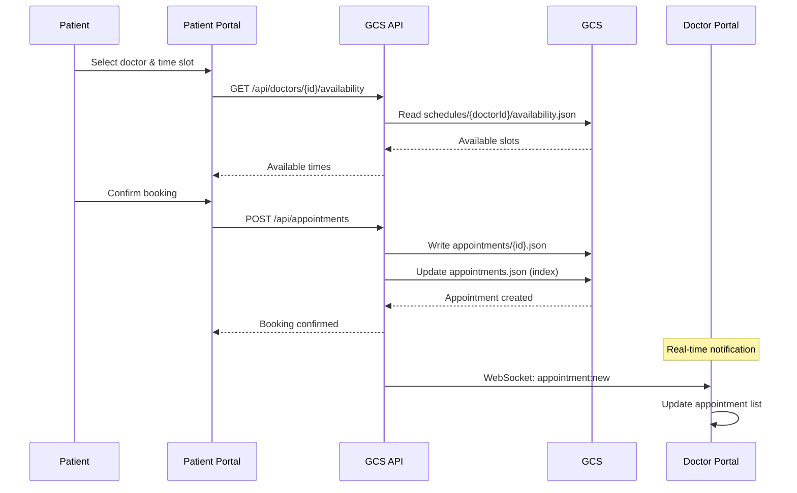
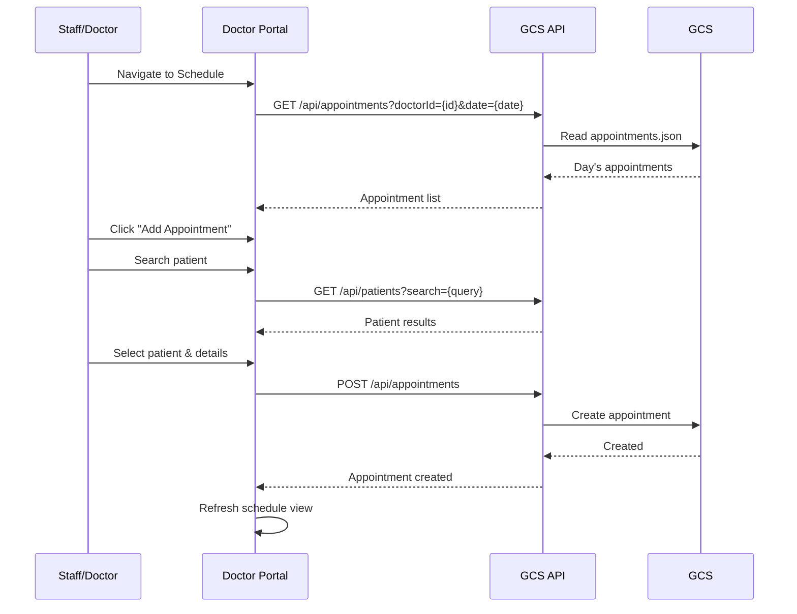
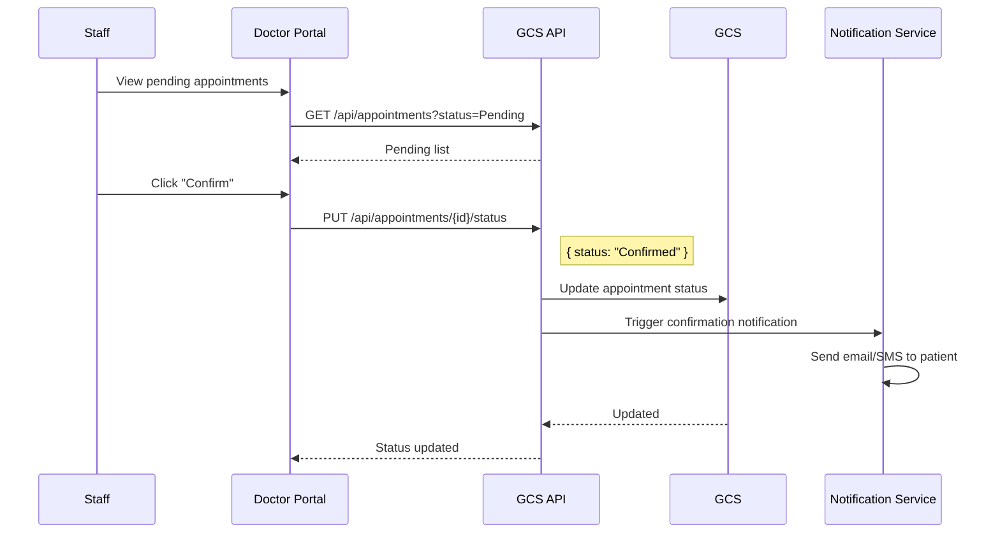
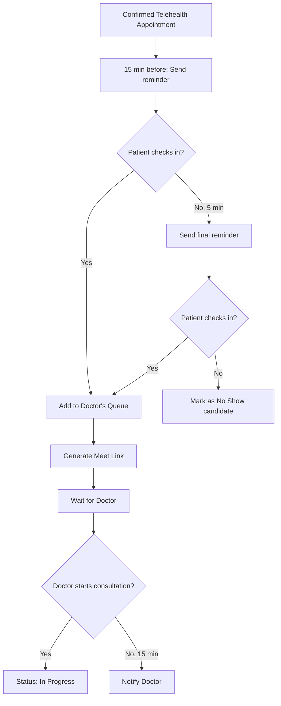
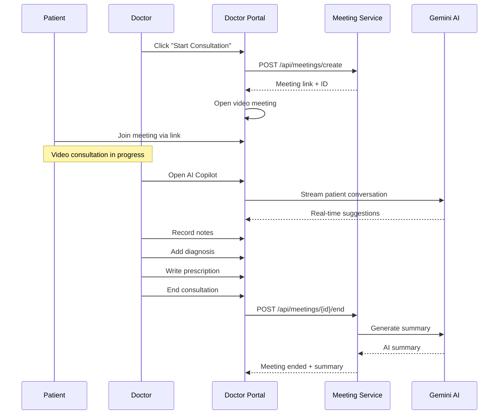
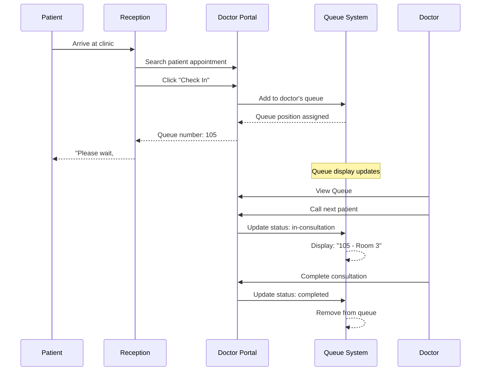
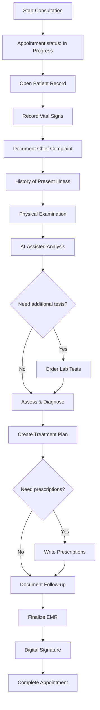
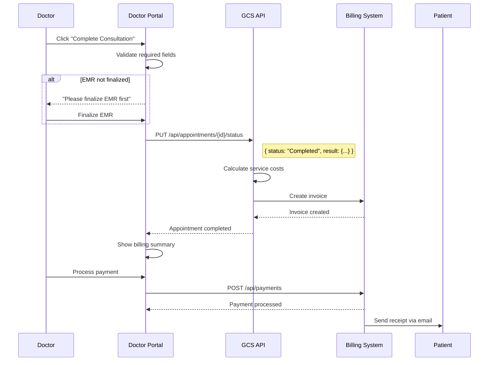
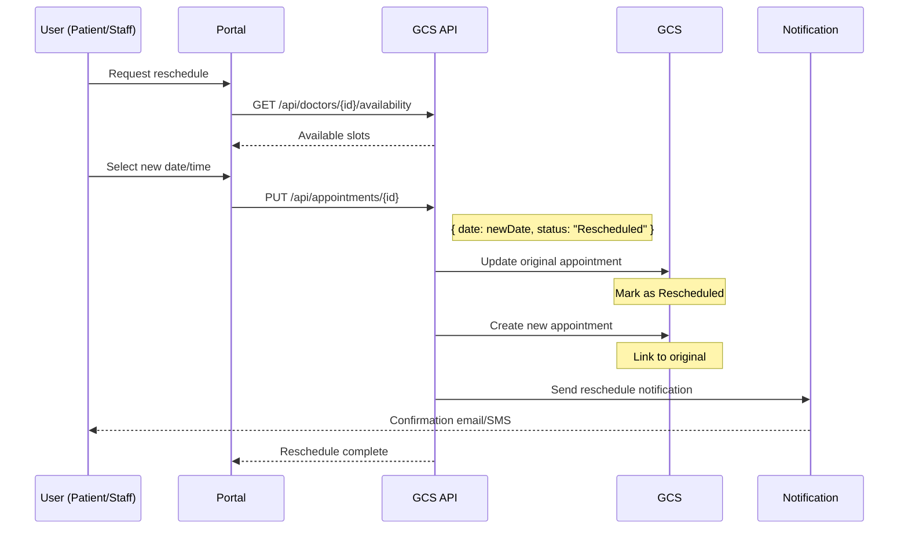
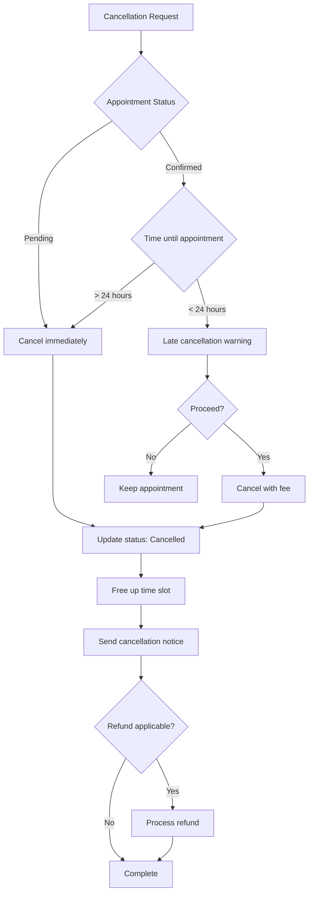

# 📋 Appointment Workflow

## Overview

This document details the complete appointment lifecycle in the Izara Doctor Portal, from booking through completion.

---

## 📊 Appointment States

```
┌──────────┐     ┌───────────┐     ┌─────────────┐     ┌───────────┐
│ Pending  │────▶│ Confirmed │────▶│ In Progress │────▶│ Completed │
└──────────┘     └───────────┘     └─────────────┘     └───────────┘
     │                │                   │                  
     │                │                   │                  
     ▼                ▼                   ▼                  
┌──────────┐     ┌───────────┐     ┌───────────┐
│Cancelled │     │Rescheduled│     │  No Show  │
└──────────┘     └───────────┘     └───────────┘
```

### State Definitions

| State | Description | Next States |
|-------|-------------|-------------|
| **Pending** | Newly created, awaiting confirmation | Confirmed, Cancelled, Rescheduled |
| **Confirmed** | Doctor/staff confirmed | In Progress, Cancelled, No Show, Rescheduled |
| **In Progress** | Consultation active | Completed, Cancelled |
| **Completed** | Consultation finished | - (Final state) |
| **Cancelled** | Cancelled by patient/doctor | - (Final state) |
| **No Show** | Patient didn't attend | Rescheduled |
| **Rescheduled** | Moved to new date | Pending (new appointment) |

---

## 🔄 Booking Flow

### Patient Booking (From Patient Portal)



### Staff Booking (From Doctor Portal)



---

## ✅ Confirmation Flow



---

## 📱 Telehealth Appointment Flow

### Pre-Consultation



### During Consultation



---

## 🏥 In-Person Appointment Flow

### Check-In Process



---

## 📝 Consultation Documentation

### EMR Creation During Appointment



---

## 💰 Post-Consultation Workflow

### Billing & Completion



---

## 🔄 Rescheduling Flow



---

## ❌ Cancellation Flow



---

## 📊 Appointment Types

### Telehealth

| Aspect | Details |
|--------|---------|
| Duration | 15-30 minutes |
| Requirements | Video-capable device, stable internet |
| Meet Link | Generated 15 min before |
| Recording | With patient consent |
| AI Features | Real-time transcription, suggestions |

### In-Person

| Aspect | Details |
|--------|---------|
| Duration | 15-60 minutes |
| Check-in | Required at reception |
| Queue | Physical queue system |
| Documentation | Same-day EMR required |

### Emergency

| Aspect | Details |
|--------|---------|
| Priority | Highest |
| Queue Position | Immediate/Front |
| Documentation | Can be retrospective |
| Billing | Emergency rates apply |

### Follow-up

| Aspect | Details |
|--------|---------|
| Duration | 10-20 minutes |
| Link | Connected to previous appointment |
| Preparation | Previous EMR loaded |
| Billing | Reduced rate |

---

## 🔔 Notifications

### Notification Timeline

| Timing | Notification Type | Channel |
|--------|-------------------|---------|
| Booking | Confirmation | Email + SMS |
| 24 hours before | Reminder | Email + SMS + Push |
| 1 hour before | Final reminder | Push |
| 15 min before (Telehealth) | Join link | Email + SMS |
| After completion | Summary + follow-up | Email |
| Payment received | Receipt | Email |

---

## 📈 Reporting & Analytics

### Appointment Metrics Tracked

- Total appointments by type
- Completion rate
- No-show rate
- Average consultation duration
- Time to confirmation
- Rescheduling frequency
- Revenue per appointment
- Patient satisfaction scores
