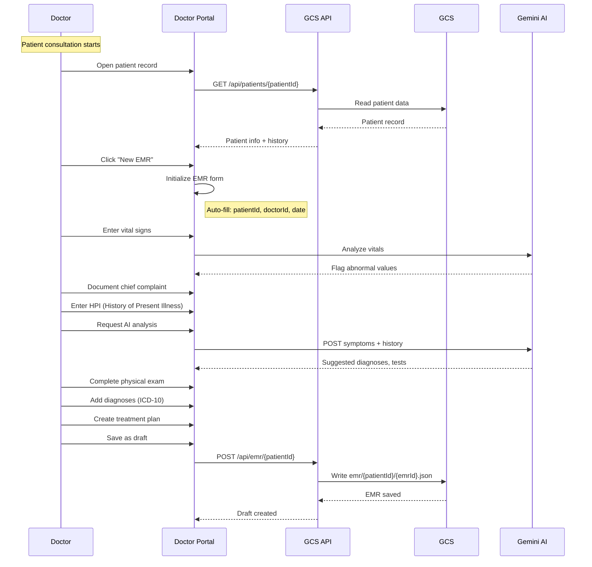
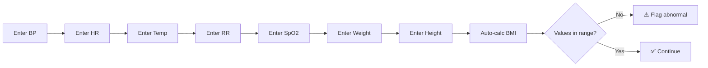
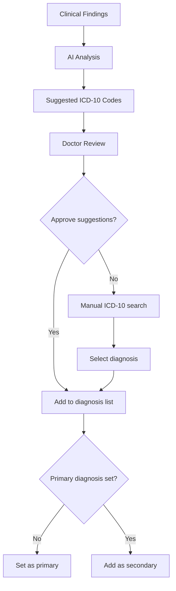
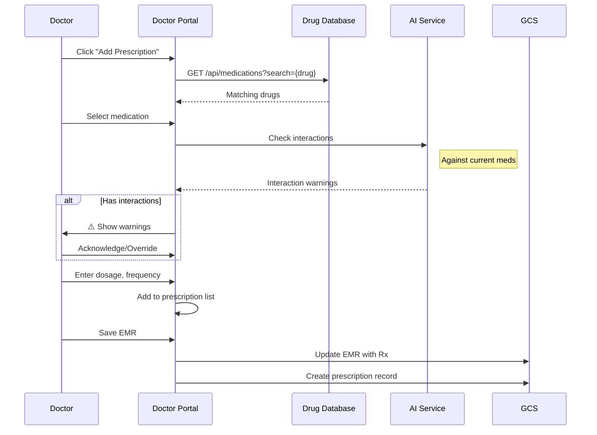
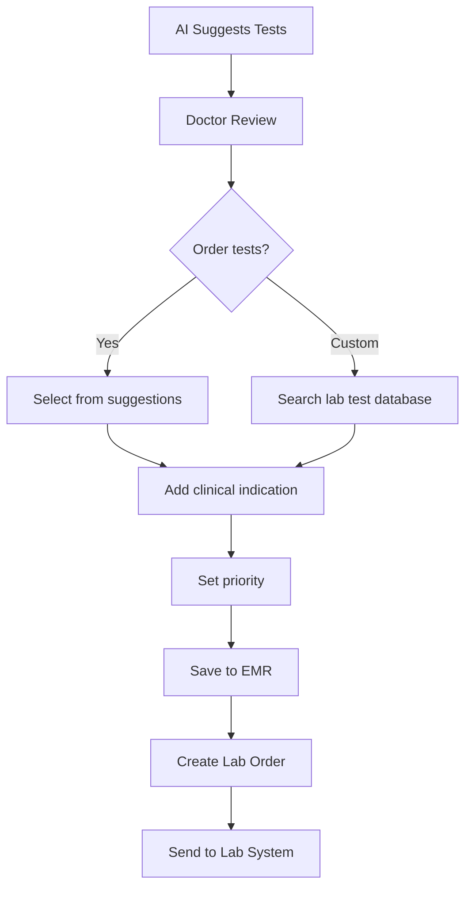
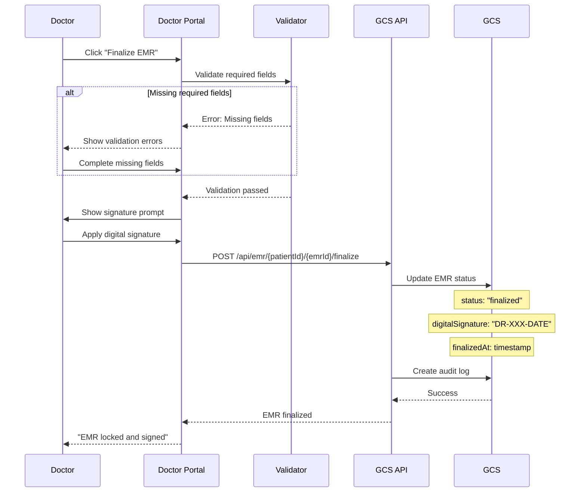
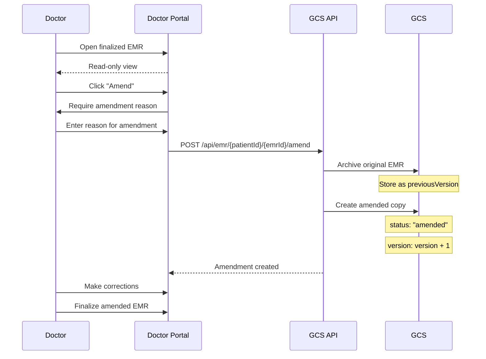
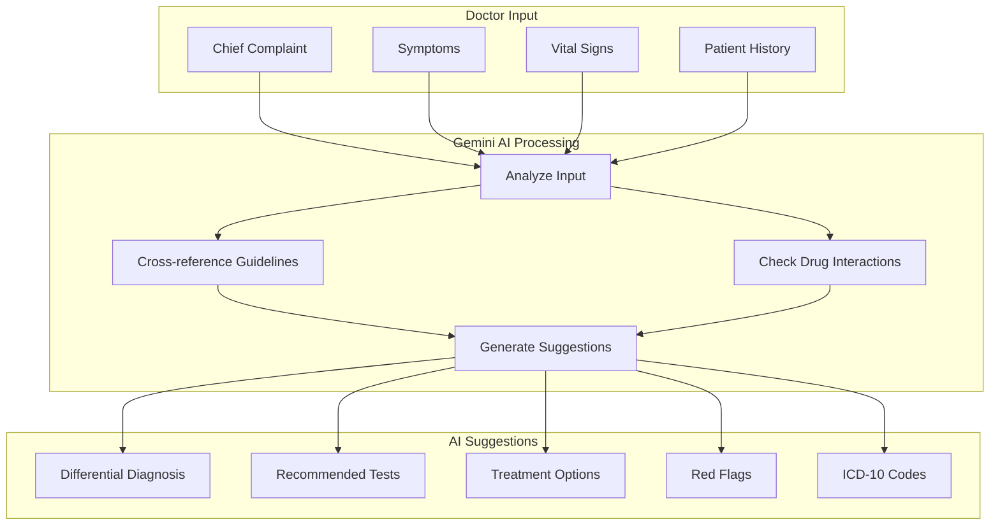
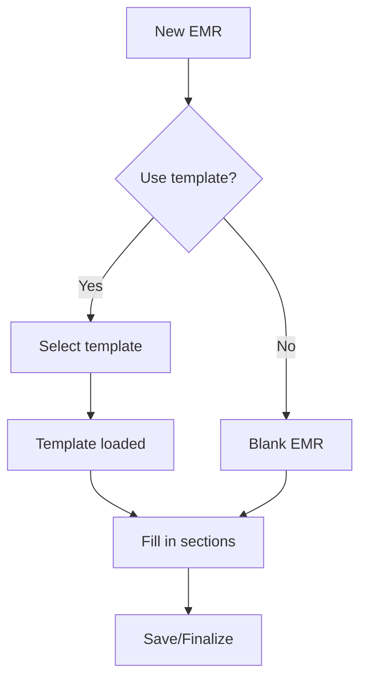

# 📝 EMR Workflow

## Overview

This document details the Electronic Medical Record (EMR) creation, management, and finalization workflow in the Izara Doctor Portal.

---

## 📊 EMR Lifecycle

```
┌─────────┐     ┌──────────┐     ┌───────────┐     ┌─────────┐
│  Draft  │────▶│ In Review│────▶│ Finalized │────▶│ Amended │
└─────────┘     └──────────┘     └───────────┘     └─────────┘
     │                                                  │
     │                                                  │
     ▼                                                  │
┌─────────┐                                            │
│ Deleted │◀───────────────────────────────────────────┘
└─────────┘   (Only drafts can be deleted)
```

### State Definitions

| Status | Description | Editable | Signature |
|--------|-------------|----------|-----------|
| **Draft** | Work in progress | ✅ Full | Not required |
| **In Review** | Pending review/signature | ⚠️ Limited | Required |
| **Finalized** | Completed, locked | ❌ No | Required |
| **Amended** | Correction to finalized | ❌ No | Required |

---

## 🔄 EMR Creation Flow

### Step-by-Step Process



---

## 📋 EMR Sections

### 1. Patient Demographics (Auto-populated)

```json
{
  "patientId": "PAT-2024-0001",
  "patientName": "Somsak Wongchai",
  "dateOfBirth": "1985-03-20",
  "age": 39,
  "gender": "male",
  "bloodType": "O+"
}
```

### 2. Vital Signs Entry



**Vital Signs Form:**

| Field | Unit | Normal Range | Auto-flag |
|-------|------|--------------|-----------|
| Systolic BP | mmHg | 90-120 | < 90 or > 140 |
| Diastolic BP | mmHg | 60-80 | < 60 or > 90 |
| Heart Rate | bpm | 60-100 | < 50 or > 110 |
| Temperature | °C | 36.1-37.2 | < 36 or > 38 |
| Respiratory Rate | /min | 12-20 | < 10 or > 24 |
| SpO2 | % | 95-100 | < 94 |
| BMI | kg/m² | 18.5-24.9 | < 18.5 or > 30 |

### 3. Chief Complaint

Free-text entry with AI suggestions:

```typescript
// AI analyzes chief complaint
const suggestions = await geminiService.analyzeChiefComplaint({
  complaint: "Chest pain for 2 days",
  patientAge: 39,
  gender: "male",
  chronicConditions: ["Diabetes", "Hypertension"]
});

// Returns
{
  urgency: "high",
  suggestedQuestions: [
    "Character of pain (sharp, dull, crushing)?",
    "Radiation to arm, jaw, or back?",
    "Associated symptoms (diaphoresis, nausea)?"
  ],
  redFlags: ["Cardiac risk factors present"],
  differentialDiagnosis: [
    "Acute Coronary Syndrome",
    "Costochondritis",
    "GERD"
  ]
}
```

### 4. History of Present Illness (HPI)

Structured documentation using **OPQRST** format:

| Component | Description | Example |
|-----------|-------------|---------|
| **O**nset | When did it start? | "Started 2 days ago" |
| **P**rovocation | What makes it worse/better? | "Worse with exertion" |
| **Q**uality | Describe the sensation | "Sharp, pressure-like" |
| **R**egion/Radiation | Location and spread | "Left chest, no radiation" |
| **S**everity | Pain scale 1-10 | "6/10" |
| **T**iming | Pattern, duration | "Intermittent, 5-10 min" |

### 5. Review of Systems (ROS)

System-by-system checklist:

```typescript
interface ReviewOfSystems {
  constitutional: string;     // Fever, weight change, fatigue
  eyes: string;               // Vision changes, pain
  entNoseThroat: string;      // Hearing, congestion, sore throat
  cardiovascular: string;     // Chest pain, palpitations, edema
  respiratory: string;        // Cough, SOB, wheezing
  gastrointestinal: string;   // Nausea, vomiting, diarrhea
  genitourinary: string;      // Frequency, urgency, dysuria
  musculoskeletal: string;    // Joint pain, weakness
  integumentary: string;      // Rashes, lesions
  neurological: string;       // Headache, dizziness, numbness
  psychiatric: string;        // Mood, anxiety, sleep
  endocrine: string;          // Polyuria, polydipsia
  hematologicLymphatic: string;
  allergicImmunologic: string;
}
```

### 6. Physical Examination

Structured examination findings:

```typescript
interface PhysicalExam {
  generalAppearance: string;  // "Alert, oriented, no acute distress"
  heent: string;              // Head, eyes, ears, nose, throat
  neck: string;               // Lymph nodes, thyroid, JVD
  cardiovascular: string;     // Heart sounds, murmurs
  respiratory: string;        // Breath sounds, percussion
  abdomen: string;            // Bowel sounds, tenderness
  extremities: string;        // Edema, pulses, ROM
  neurological: string;       // CN, motor, sensory, reflexes
  skin: string;               // Color, lesions, turgor
  psychiatric: string;        // Mood, affect, cognition
}
```

### 7. Assessment & Diagnosis



**Diagnosis Entry:**

```json
{
  "diagnosis": [
    {
      "code": "R07.9",
      "description": "Chest pain, unspecified",
      "type": "primary",
      "status": "active"
    },
    {
      "code": "I10",
      "description": "Essential hypertension",
      "type": "secondary",
      "status": "chronic"
    }
  ]
}
```

### 8. Treatment Plan

Free-text with structured options:

```typescript
interface TreatmentPlan {
  medications: string;       // New prescriptions
  procedures: string;        // Procedures performed
  therapies: string;         // Physical therapy, etc.
  lifestyle: string;         // Diet, exercise recommendations
  education: string;         // Patient education provided
  followUp: string;          // Follow-up instructions
}
```

---

## 💊 Prescription Integration

### Adding Prescriptions to EMR



---

## 🧪 Lab Order Integration

### Ordering Labs from EMR



---

## ✅ EMR Finalization

### Finalization Process



### Required Fields for Finalization

| Section | Required Fields |
|---------|-----------------|
| Encounter | Date, Type |
| Chief Complaint | Description |
| Assessment | Text |
| Diagnosis | At least 1 primary diagnosis |
| Treatment Plan | Description |
| Vital Signs | At least BP and HR |

---

## ✏️ EMR Amendment

### Amendment Workflow

When a finalized EMR needs correction:



### Amendment Record

```json
{
  "id": "EMR-2024-0001-001",
  "version": 2,
  "status": "finalized",
  "amendmentReason": "Corrected diagnosis code",
  "amendedAt": "2024-06-16T10:00:00.000Z",
  "amendedBy": "DOC-1234-567",
  "previousVersions": [
    "EMR-2024-0001-001-v1"
  ]
}
```

---

## 🤖 AI-Assisted Documentation

### AI Features in EMR



### AI Prompt Example

```typescript
const clinicalPrompt = `
You are a clinical decision support AI. Analyze the following case:

Patient: ${patient.age} year old ${patient.gender}
Chief Complaint: ${emr.chiefComplaint}
History: ${emr.historyOfPresentIllness}
Vital Signs: BP ${vitals.bp}, HR ${vitals.hr}, Temp ${vitals.temp}
Past Medical History: ${patient.medicalInfo.chronicConditions.join(', ')}
Current Medications: ${patient.medicalInfo.currentMedications.join(', ')}
Allergies: ${patient.medicalInfo.allergies.join(', ')}

Provide:
1. Top 3 differential diagnoses with ICD-10 codes
2. Recommended diagnostic tests
3. Red flags to watch for
4. Treatment considerations
`;
```

---

## 📊 EMR Templates

### Template Types

| Template | Use Case | Pre-filled Sections |
|----------|----------|---------------------|
| **SOAP** | Standard consultation | Subjective, Objective, Assessment, Plan |
| **SBAR** | Handoff/Referral | Situation, Background, Assessment, Recommendation |
| **Admission** | Hospital admission | Full H&P, Orders |
| **Discharge** | Discharge summary | Summary, Medications, Follow-up |
| **Progress** | Daily progress note | Interval history, Exam, Plan |

### Using Templates



---

## 📁 EMR Storage Structure

```
izara-patients-data/
└── emr/
    └── PAT-2024-0001/
        ├── index.json              # EMR list for patient
        ├── EMR-2024-0001-001.json  # Current version
        ├── EMR-2024-0001-001-v1.json  # Previous version (if amended)
        └── EMR-2024-0001-002.json  # Second encounter
```

### Index File

```json
[
  {
    "id": "EMR-2024-0001-001",
    "encounterDate": "2024-06-15T10:30:00.000Z",
    "encounterType": "consultation",
    "chiefComplaint": "Chest pain",
    "primaryDiagnosis": "R07.9",
    "doctorId": "DOC-1234-567",
    "doctorName": "Dr. Smith",
    "status": "finalized",
    "version": 1
  }
]
```

---

## 🔐 EMR Security & Compliance

### Access Control

| Role | Create | Read Own | Read All | Edit Draft | Amend | Delete |
|------|--------|----------|----------|------------|-------|--------|
| Doctor | ✅ | ✅ | ❌ | ✅ | ✅ | ✅ |
| Admin | ❌ | ✅ | ✅ | ❌ | ❌ | ❌ |
| Patient | ❌ | ✅ | N/A | ❌ | ❌ | ❌ |

### Audit Trail

Every EMR action is logged:

```json
{
  "action": "emr_finalized",
  "emrId": "EMR-2024-0001-001",
  "patientId": "PAT-2024-0001",
  "doctorId": "DOC-1234-567",
  "timestamp": "2024-06-15T11:00:00.000Z",
  "ipAddress": "192.168.1.100",
  "changes": {
    "status": ["draft", "finalized"],
    "digitalSignature": [null, "DR-SMITH-2024-06-15"]
  }
}
```
