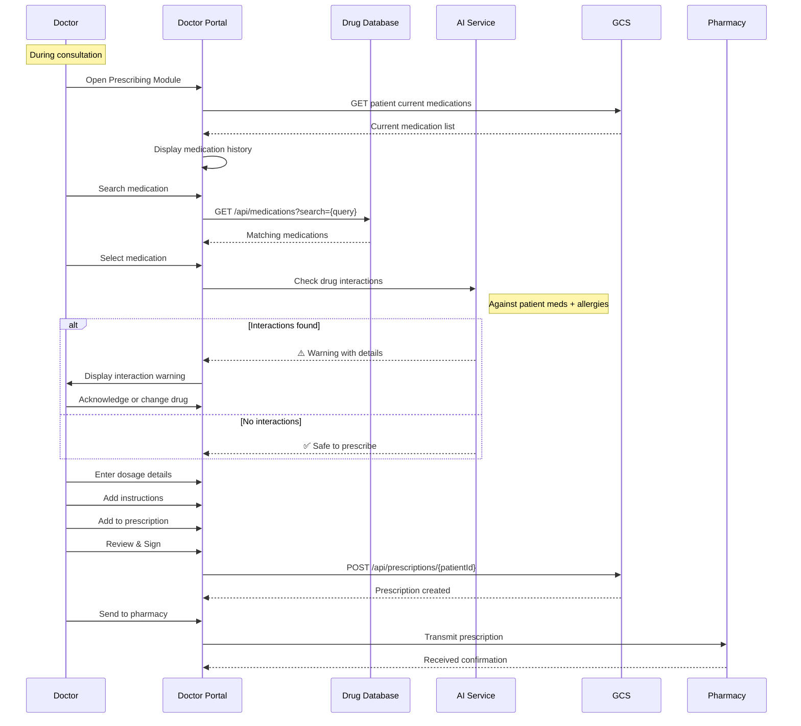
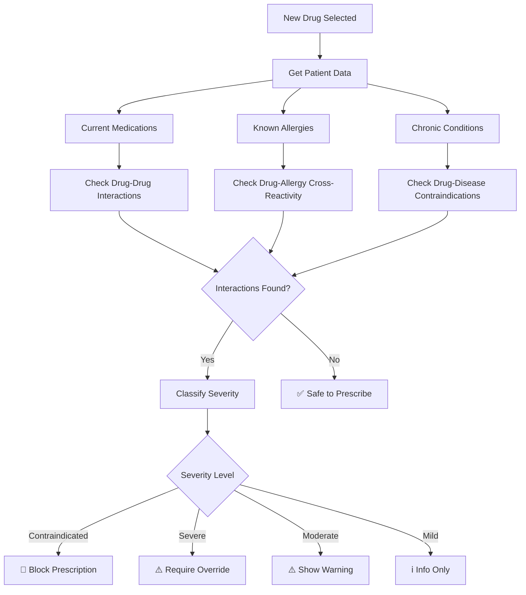
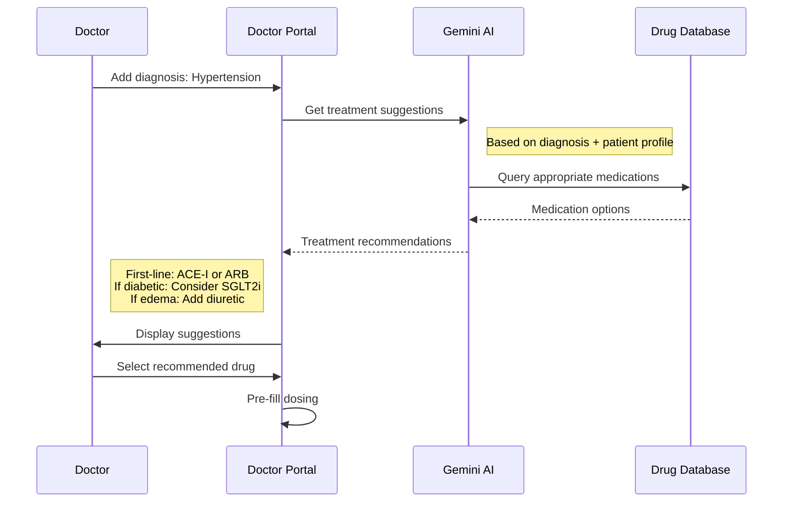
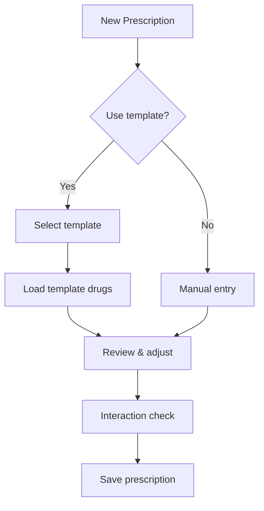
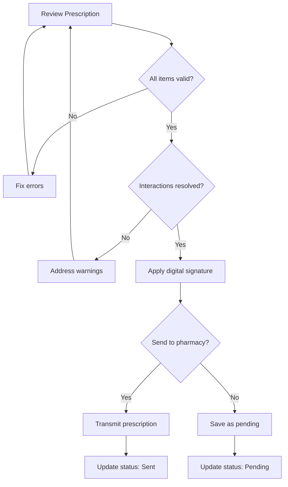
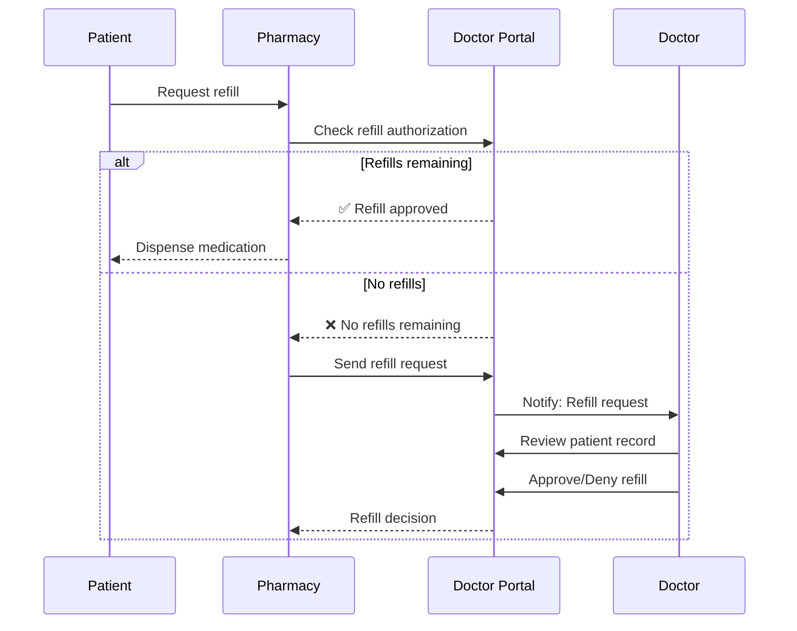
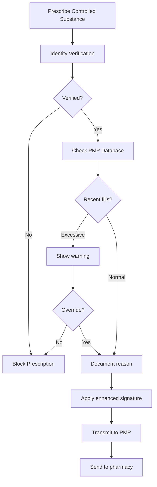

# 💊 Prescribing Workflow

## Overview

This document details the medication prescribing workflow in the Izara Doctor Portal, including drug selection, interaction checking, and prescription generation.

---

## 📊 Prescription Lifecycle

```
┌──────────┐     ┌───────────┐     ┌──────────┐     ┌───────────┐
│ Creating │────▶│  Pending  │────▶│   Sent   │────▶│ Dispensed │
└──────────┘     └───────────┘     └──────────┘     └───────────┘
                      │
                      ▼
                ┌───────────┐
                │ Cancelled │
                └───────────┘
```

### Status Definitions

| Status | Description | Actions Available |
|--------|-------------|-------------------|
| **Creating** | Being composed by doctor | Edit, Cancel |
| **Pending** | Awaiting pharmacy send | Send, Edit, Cancel |
| **Sent** | Transmitted to pharmacy | View only |
| **Dispensed** | Patient received medication | View only |
| **Cancelled** | Voided before dispensing | View only |

---

## 🔄 Prescription Creation Flow

### Step-by-Step Process



---

## 💊 Drug Selection

### Drug Search Interface

```typescript
// Search endpoint
GET /api/medications?search={query}&category={category}

// Response
{
  "data": [
    {
      "id": "MED-001",
      "name": "Amlodipine Besylate",
      "genericName": "Amlodipine",
      "brandNames": ["Norvasc", "Amlor", "Amlocard"],
      "category": "Calcium Channel Blocker",
      "dosageForms": ["Tablet", "Capsule"],
      "strengths": ["2.5mg", "5mg", "10mg"],
      "defaultDosage": "5mg once daily",
      "indications": ["Hypertension", "Angina"],
      "contraindications": ["Severe aortic stenosis"],
      "sideEffects": ["Peripheral edema", "Dizziness"],
      "pregnancyCategory": "C"
    }
  ]
}
```

### Drug Categories

| Category | Examples |
|----------|----------|
| Cardiovascular | ACE Inhibitors, Beta Blockers, CCBs |
| Endocrine | Metformin, Insulin, Thyroxine |
| Respiratory | Bronchodilators, Corticosteroids |
| GI | PPIs, Antacids, Antiemetics |
| Analgesics | NSAIDs, Opioids, Acetaminophen |
| Antibiotics | Penicillins, Cephalosporins, Macrolides |
| Psychiatric | SSRIs, Benzodiazepines, Antipsychotics |

---

## ⚠️ Drug Interaction Checking

### Interaction Detection Flow



### Interaction Severity Levels

| Level | Action | Example |
|-------|--------|---------|
| **Contraindicated** | Block prescription | MAOIs + SSRIs |
| **Severe** | Require override + reason | Warfarin + NSAIDs |
| **Moderate** | Display warning | Amlodipine + Simvastatin |
| **Mild** | Information only | ACE-I + Potassium foods |

### Interaction Warning Display

```typescript
interface DrugInteraction {
  interactingDrug: string;
  severity: 'contraindicated' | 'severe' | 'moderate' | 'mild';
  mechanism: string;
  clinicalEffect: string;
  management: string;
  reference: string;
}

// Example
{
  interactingDrug: "Warfarin",
  severity: "severe",
  mechanism: "NSAIDs inhibit platelet function and may displace warfarin from protein binding",
  clinicalEffect: "Increased bleeding risk",
  management: "Avoid combination. If necessary, monitor INR closely and watch for bleeding signs.",
  reference: "Drug Interaction Database v2024"
}
```

---

## 📝 Prescription Form

### Required Fields

| Field | Type | Required | Validation |
|-------|------|----------|------------|
| Drug Name | Select | ✅ | From database |
| Strength | Select | ✅ | Drug-specific options |
| Dosage | Text | ✅ | Format check |
| Route | Select | ✅ | oral/injection/topical/etc |
| Frequency | Select/Text | ✅ | Common patterns available |
| Duration | Text | ✅ | Days/weeks/months |
| Quantity | Number | ✅ | Auto-calculated |
| Refills | Number | ❌ | 0-12, default 0 |
| Instructions | Text | ✅ | Patient directions |

### Frequency Options

| Code | Display | Meaning |
|------|---------|---------|
| QD | Once daily | Every day |
| BID | Twice daily | Every 12 hours |
| TID | Three times daily | Every 8 hours |
| QID | Four times daily | Every 6 hours |
| QHS | At bedtime | Once at night |
| PRN | As needed | When required |
| QOD | Every other day | Alternate days |
| QW | Once weekly | Every week |

### Prescription Item Schema

```json
{
  "drugName": "Amlodipine Besylate",
  "genericName": "Amlodipine",
  "brandName": "Norvasc",
  "dosage": "1 tablet",
  "strength": "5mg",
  "route": "oral",
  "frequency": "Once daily in the morning",
  "duration": "30 days",
  "quantity": 30,
  "refills": 2,
  "instructions": "Take with or without food. May cause ankle swelling. Report dizziness.",
  "interactions": [],
  "notes": "Increased from 2.5mg due to suboptimal BP control"
}
```

---

## 🤖 AI-Assisted Prescribing

### AI Suggestions



### AI Dosing Recommendations

```typescript
interface DosingRecommendation {
  drug: string;
  patientFactors: {
    age: number;
    weight: number;
    renalFunction: string;
    hepaticFunction: string;
  };
  recommendedDose: string;
  adjustments: string[];
  monitoring: string[];
}

// Example output
{
  drug: "Metformin",
  patientFactors: {
    age: 65,
    weight: 78,
    renalFunction: "eGFR 45",
    hepaticFunction: "Normal"
  },
  recommendedDose: "500mg twice daily",
  adjustments: [
    "Reduced dose due to renal impairment (eGFR 30-45)",
    "Consider holding if contrast dye procedure planned"
  ],
  monitoring: [
    "Monitor renal function every 3-6 months",
    "Check B12 levels annually",
    "Watch for lactic acidosis symptoms"
  ]
}
```

---

## 📋 Prescription Templates

### Common Templates

| Template Name | Use Case | Pre-filled Drugs |
|---------------|----------|------------------|
| Hypertension Starter | New HTN diagnosis | Amlodipine 5mg |
| Diabetes Type 2 | New T2DM | Metformin 500mg |
| UTI Treatment | Uncomplicated UTI | Ciprofloxacin 500mg |
| Pain Management | Acute pain | Ibuprofen 400mg, Paracetamol |
| GERD | Acid reflux | Omeprazole 20mg |

### Using Templates



---

## ✅ Prescription Finalization

### Review & Sign Process



### Digital Signature

```json
{
  "digitalSignature": "DR-SOMCHAI-RX-2024-06-15",
  "signedAt": "2024-06-15T11:00:00.000Z",
  "signedBy": {
    "doctorId": "DOC-1234-567",
    "name": "Dr. Somchai Prasert",
    "medicalLicenseNumber": "MD-123456"
  },
  "signatureMethod": "electronic"
}
```

---

## 📤 Pharmacy Transmission

### Transmission Options

| Method | Description | Use Case |
|--------|-------------|----------|
| **Electronic** | Direct system integration | Hospital pharmacy |
| **Print** | Generate PDF prescription | External pharmacy |
| **Email** | Send to patient's pharmacy | Remote pharmacies |
| **Save Only** | Store without sending | In-house dispensing |

### Prescription Document (PDF)

```
╔══════════════════════════════════════════════════════════╗
║                  IZARA TELEMEDICINE                       ║
║                   PRESCRIPTION                            ║
╠══════════════════════════════════════════════════════════╣
║ Rx #: RX-2024-0001-001        Date: June 15, 2024        ║
║                                                           ║
║ PATIENT: Somsak Wongchai                                  ║
║ DOB: March 20, 1985                                       ║
║ ID: PAT-2024-0001                                         ║
╠══════════════════════════════════════════════════════════╣
║                                                           ║
║ ℞ Amlodipine 5mg Tablet                                   ║
║   Sig: Take 1 tablet by mouth once daily in the morning  ║
║   Disp: #30 (Thirty)                                      ║
║   Refills: 2                                              ║
║                                                           ║
║ ℞ Metformin 500mg Tablet                                  ║
║   Sig: Take 1 tablet by mouth twice daily with meals     ║
║   Disp: #60 (Sixty)                                       ║
║   Refills: 2                                              ║
║                                                           ║
╠══════════════════════════════════════════════════════════╣
║                                                           ║
║ PRESCRIBER: Dr. Somchai Prasert                           ║
║ License #: MD-123456                                      ║
║ Specialty: Internal Medicine                              ║
║                                                           ║
║ [Digital Signature]                                       ║
║ DR-SOMCHAI-RX-2024-06-15                                  ║
║                                                           ║
║ Valid Until: September 15, 2024                           ║
╚══════════════════════════════════════════════════════════╝
```

---

## 🔄 Prescription Refills

### Refill Request Flow



---

## 🚨 Controlled Substance Handling

### Special Requirements

| Requirement | Description |
|-------------|-------------|
| **Verification** | Additional ID verification |
| **Limits** | Maximum quantity/duration |
| **No Refills** | New prescription each time |
| **Reporting** | Report to prescription monitoring |
| **E-Prescribing** | Mandatory electronic transmission |

### Controlled Substance Workflow



---

## 📊 Prescription Analytics

### Tracked Metrics

| Metric | Purpose |
|--------|---------|
| Prescriptions per encounter | Utilization tracking |
| Generic vs brand ratio | Cost efficiency |
| Interaction overrides | Safety monitoring |
| Refill patterns | Compliance tracking |
| Controlled substance trends | Abuse prevention |

### Dashboard View

```
╔═══════════════════════════════════════════════════╗
║          PRESCRIBING DASHBOARD - June 2024        ║
╠═══════════════════════════════════════════════════╣
║ Total Prescriptions:    245                       ║
║ Unique Patients:        180                       ║
║ Average per Encounter:  1.4                       ║
║                                                   ║
║ Generic Prescribing:    78%  [████████░░] Target: 80% ║
║ E-Prescribing Rate:     95%  [█████████░] Target: 90% ║
║                                                   ║
║ Top 5 Medications:                                ║
║   1. Amlodipine          45 (18%)                 ║
║   2. Metformin           38 (16%)                 ║
║   3. Omeprazole          32 (13%)                 ║
║   4. Atorvastatin        28 (11%)                 ║
║   5. Losartan            25 (10%)                 ║
║                                                   ║
║ Interaction Alerts:                               ║
║   - Moderate: 12 (all acknowledged)               ║
║   - Severe: 2 (overridden with documentation)     ║
║   - Contraindicated: 0                            ║
╚═══════════════════════════════════════════════════╝
```

---

## 📁 Prescription Storage

### Storage Structure

```
izara-patients-data/
└── prescriptions/
    └── PAT-2024-0001/
        ├── index.json              # Prescription list
        ├── RX-2024-0001-001.json   # First prescription
        ├── RX-2024-0001-002.json   # Second prescription
        └── ...
```

### Full Prescription Record

```json
{
  "id": "RX-2024-0001-001",
  "patientId": "PAT-2024-0001",
  "doctorId": "DOC-1234-567",
  "emrId": "EMR-2024-0001-001",
  "encounterDate": "2024-06-15T10:30:00.000Z",
  "medications": [
    {
      "drugName": "Amlodipine Besylate",
      "genericName": "Amlodipine",
      "strength": "5mg",
      "dosage": "1 tablet",
      "route": "oral",
      "frequency": "Once daily",
      "duration": "30 days",
      "quantity": 30,
      "refills": 2,
      "refillsUsed": 0,
      "instructions": "Take in the morning with or without food",
      "interactionsAcknowledged": []
    }
  ],
  "pharmacyId": "PHARM-001",
  "pharmacyName": "Central Hospital Pharmacy",
  "status": "sent",
  "digitalSignature": "DR-SOMCHAI-RX-2024-06-15",
  "signedAt": "2024-06-15T11:00:00.000Z",
  "sentAt": "2024-06-15T11:01:00.000Z",
  "createdAt": "2024-06-15T10:45:00.000Z",
  "validUntil": "2024-09-15T11:00:00.000Z"
}
```
