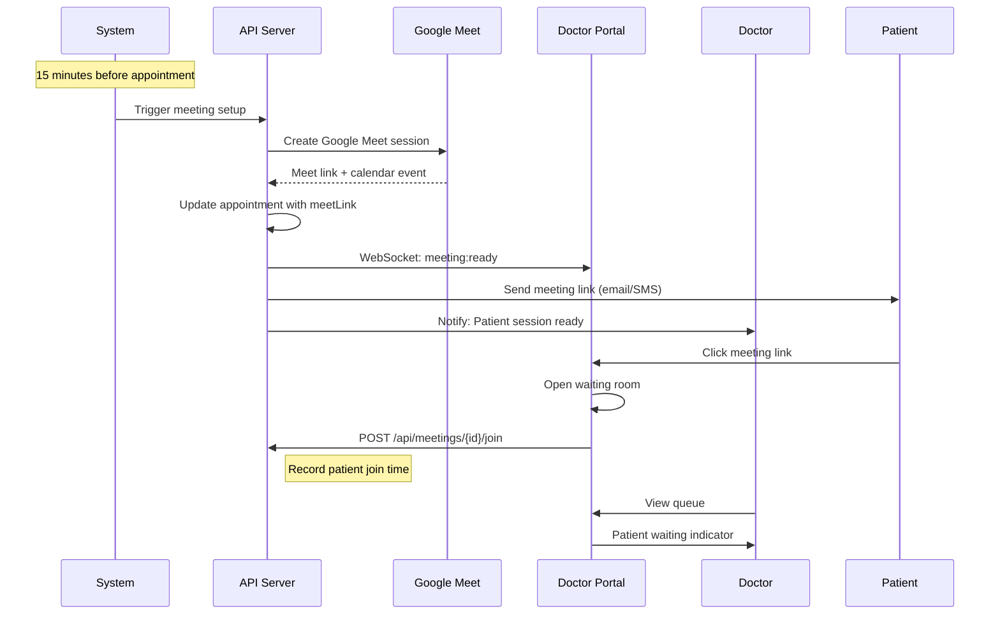
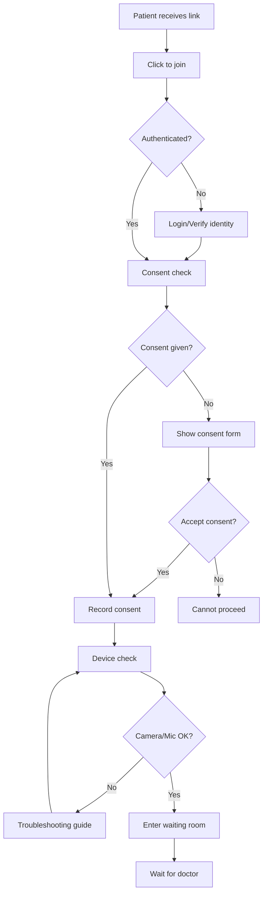
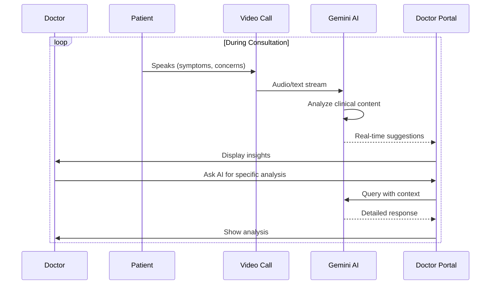
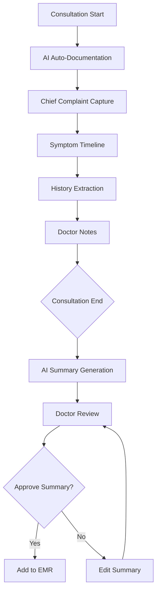
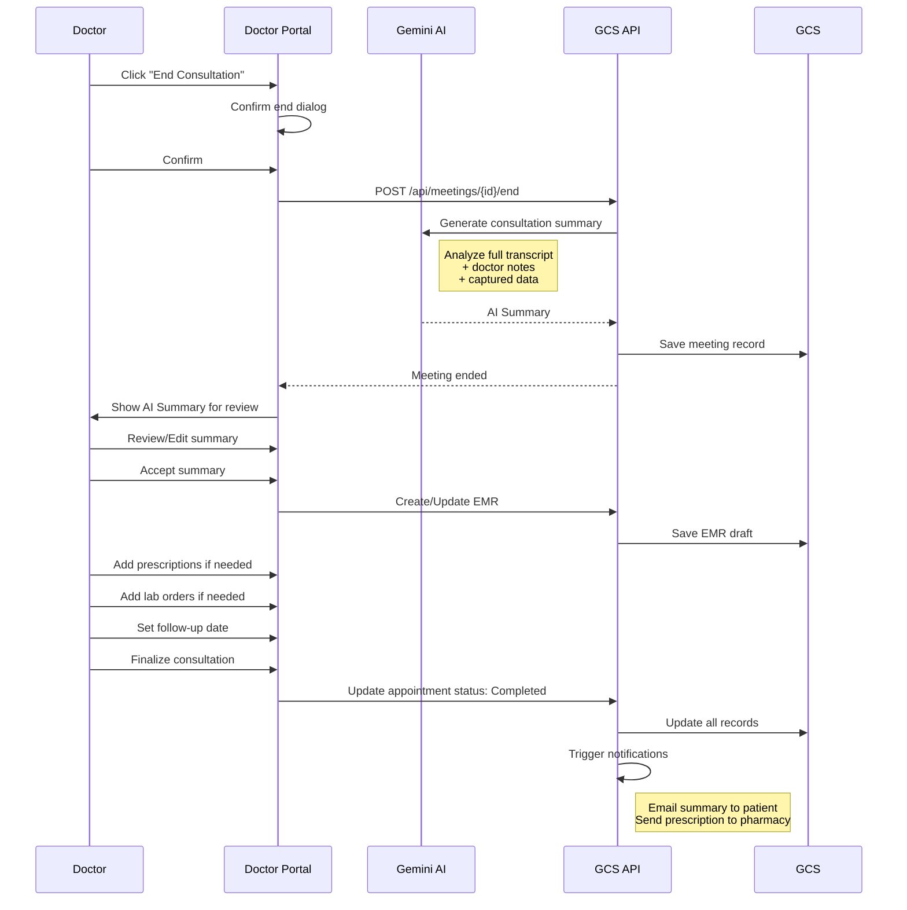
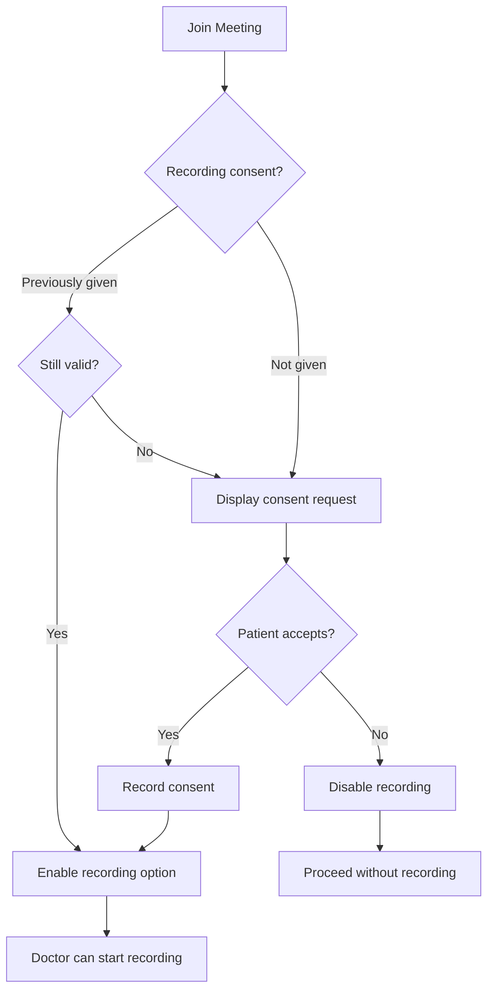
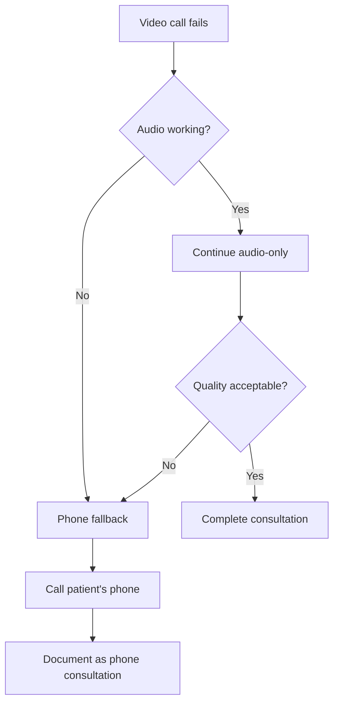

# 🎥 Telemedicine Workflow

## Overview

This document details the complete telemedicine consultation workflow in the Izara Doctor Portal, including video meeting setup, real-time AI assistance, and post-consultation documentation.

---

## 📊 Telemedicine Session States

```
┌───────────┐     ┌─────────┐     ┌────────┐     ┌───────────┐
│ Scheduled │────▶│ Waiting │────▶│ Active │────▶│ Completed │
└───────────┘     └─────────┘     └────────┘     └───────────┘
      │                │               │
      │                │               │
      ▼                ▼               ▼
┌───────────┐     ┌─────────┐     ┌───────────┐
│ Cancelled │     │ No Show │     │ Technical │
└───────────┘     └─────────┘     │   Issue   │
                                  └───────────┘
```

### State Definitions

| State | Description | Duration |
|-------|-------------|----------|
| **Scheduled** | Appointment booked, meeting not started | Until 15 min before |
| **Waiting** | Waiting room active, participants can join | 15 min before to start |
| **Active** | Video consultation in progress | During call |
| **Completed** | Session ended normally | Final state |
| **No Show** | Patient didn't join within grace period | After 15 min wait |
| **Technical Issue** | Technical failure prevented session | Needs reschedule |

---

## 🔄 Pre-Consultation Flow

### Meeting Setup (15 minutes before)



### Patient Check-in Flow



---

## 💻 Video Consultation Interface

### Doctor Portal - Meeting View

```
╔════════════════════════════════════════════════════════════════════╗
║  🎥 Telemedicine Consultation - Somsak Wongchai          [X] Close ║
╠════════════════════════════════════════════════════════════════════╣
║                                                                    ║
║  ┌─────────────────────────────────┐  ┌─────────────────────────┐ ║
║  │                                 │  │    PATIENT INFO         │ ║
║  │      VIDEO FEED                 │  │                         │ ║
║  │      (Patient)                  │  │  Name: Somsak W.        │ ║
║  │                                 │  │  Age: 39 M              │ ║
║  │                                 │  │  Blood: O+              │ ║
║  │                                 │  │                         │ ║
║  │                                 │  │  Allergies:             │ ║
║  │                                 │  │  • Penicillin           │ ║
║  │                                 │  │  • Shellfish            │ ║
║  │                                 │  │                         │ ║
║  │  ┌──────────┐                   │  │  Chronic Conditions:    │ ║
║  │  │ Dr.Self  │                   │  │  • Type 2 Diabetes      │ ║
║  │  │  (You)   │                   │  │  • Hypertension         │ ║
║  │  └──────────┘                   │  │                         │ ║
║  └─────────────────────────────────┘  │  Current Meds:          │ ║
║                                        │  • Metformin 500mg      │ ║
║   🎤 Mute   📹 Video   📱 Share   🔴 End │  • Amlodipine 5mg       │ ║
║                                        └─────────────────────────┘ ║
║  ┌─────────────────────────────────────────────────────────────┐   ║
║  │  🤖 AI CLINICAL COPILOT                            [Expand] │   ║
║  │  ─────────────────────────────────────────────────────────  │   ║
║  │  💬 Detected: "chest pain", "shortness of breath"           │   ║
║  │                                                              │   ║
║  │  ⚠️ Suggested Questions:                                     │   ║
║  │  • Character of chest pain (sharp, dull, crushing)?         │   ║
║  │  • Any radiation to arm or jaw?                              │   ║
║  │  • Associated with diaphoresis or nausea?                    │   ║
║  │                                                              │   ║
║  │  🔍 Differential Considerations:                             │   ║
║  │  • ACS (patient has cardiac risk factors)                    │   ║
║  │  • Costochondritis                                           │   ║
║  │  • GERD                                                      │   ║
║  └─────────────────────────────────────────────────────────────┘   ║
║                                                                    ║
║  [📝 Open EMR]  [💊 Prescriptions]  [🧪 Lab Orders]  [📋 Summary]  ║
╚════════════════════════════════════════════════════════════════════╝
```

### Video Controls

| Control | Function | Keyboard Shortcut |
|---------|----------|-------------------|
| 🎤 Mute | Toggle microphone | `M` |
| 📹 Video | Toggle camera | `V` |
| 📱 Share | Share screen | `S` |
| 💬 Chat | Text chat panel | `C` |
| 🔴 End | End consultation | `Esc` (with confirm) |

---

## 🤖 AI Clinical Copilot

### Real-Time Analysis Flow



### AI Features During Consultation

| Feature | Description | Trigger |
|---------|-------------|---------|
| **Symptom Detection** | Identifies mentioned symptoms | Automatic |
| **Red Flag Alerts** | Warns of concerning symptoms | Automatic |
| **Question Suggestions** | Recommends follow-up questions | On symptom detection |
| **Differential Diagnosis** | Lists possible conditions | On request |
| **Drug Lookup** | Quick drug information | On mention |
| **Lab Suggestions** | Recommends appropriate tests | On diagnosis |
| **Guideline Reference** | Links to clinical guidelines | On request |

### AI Copilot Interface

```typescript
interface AICopilotState {
  isActive: boolean;
  detectedSymptoms: string[];
  suggestedQuestions: string[];
  differentialDiagnosis: DiagnosisSuggestion[];
  redFlags: RedFlag[];
  recommendedTests: string[];
  drugInteractionAlerts: DrugInteraction[];
  confidence: number;
}

interface RedFlag {
  symptom: string;
  severity: 'warning' | 'critical';
  action: string;
  reason: string;
}
```

---

## 📝 Documentation During Session

### Real-Time Documentation Flow



### Documentation Panel

```
╔════════════════════════════════════════════════╗
║  📝 CONSULTATION NOTES                  [Save] ║
╠════════════════════════════════════════════════╣
║                                                ║
║  Chief Complaint:                              ║
║  ┌──────────────────────────────────────────┐  ║
║  │ Chest pain and shortness of breath for   │  ║
║  │ 2 days                                   │  ║
║  └──────────────────────────────────────────┘  ║
║                                                ║
║  📎 AI-Captured Symptoms:                      ║
║  [x] Chest pain - intermittent, 2 days         ║
║  [x] Shortness of breath - with exertion       ║
║  [ ] Palpitations                              ║
║  [ ] Diaphoresis                               ║
║                                                ║
║  Doctor's Notes:                               ║
║  ┌──────────────────────────────────────────┐  ║
║  │ Patient describes pain as "pressure"     │  ║
║  │ located in left chest, no radiation.     │  ║
║  │ Pain worse with physical activity.       │  ║
║  │ No associated nausea or sweating.        │  ║
║  │                                          │  ║
║  │ Given cardiac risk factors (DM, HTN),    │  ║
║  │ will order ECG to r/o cardiac cause.     │  ║
║  │ _                                        │  ║
║  └──────────────────────────────────────────┘  ║
║                                                ║
║  🏷️ Tags: #chest-pain #hypertension #diabetes  ║
╚════════════════════════════════════════════════╝
```

---

## 🔚 Post-Consultation Flow

### Session End Process



### AI-Generated Summary

```json
{
  "id": "AISUM-2024-0615-001",
  "meetingId": "MEET-2024-0615-001",
  "generatedAt": "2024-06-15T10:30:00.000Z",
  "confidence": 0.92,
  
  "chiefComplaint": "Chest pain and shortness of breath for 2 days",
  
  "symptoms": [
    {
      "symptom": "Chest pain",
      "characteristics": "Intermittent, pressure-like, left-sided",
      "duration": "2 days",
      "aggravatingFactors": ["Physical exertion"],
      "relievingFactors": ["Rest"],
      "severity": "6/10"
    },
    {
      "symptom": "Shortness of breath",
      "characteristics": "With exertion only",
      "duration": "2 days"
    }
  ],
  
  "relevantHistory": [
    "Type 2 Diabetes - diagnosed 5 years ago",
    "Hypertension - on Amlodipine",
    "No prior cardiac history"
  ],
  
  "assessment": "Atypical chest pain in patient with cardiac risk factors. Most likely musculoskeletal, but cardiac cause needs to be ruled out.",
  
  "differentialDiagnosis": [
    { "condition": "Costochondritis", "likelihood": "high" },
    { "condition": "Unstable Angina", "likelihood": "moderate" },
    { "condition": "GERD", "likelihood": "low" }
  ],
  
  "treatmentPlan": [
    "ECG to rule out cardiac ischemia",
    "Increase Amlodipine from 5mg to 10mg for better BP control",
    "Continue current diabetes management",
    "Patient education on warning signs"
  ],
  
  "prescriptions": [
    {
      "medication": "Amlodipine",
      "dose": "10mg",
      "frequency": "Once daily",
      "duration": "30 days"
    }
  ],
  
  "labOrders": ["ECG - 12 lead"],
  
  "followUp": {
    "recommended": true,
    "timeframe": "2 weeks",
    "reason": "Review ECG results, BP check"
  },
  
  "redFlags": [],
  
  "patientEducation": [
    "Seek immediate care if: chest pain worsens, spreads to arm/jaw, associated with sweating/nausea",
    "Take medication as prescribed",
    "Monitor blood pressure at home"
  ]
}
```

---

## 🔒 Consent & Recording

### Consent Flow



### Consent Record

```json
{
  "id": "CON-2024-0615-001",
  "patientId": "PAT-2024-0001",
  "doctorId": "DOC-1234-567",
  "consentType": "recording",
  "granted": true,
  "grantedAt": "2024-06-15T10:02:00.000Z",
  "scope": [
    "audio_recording",
    "video_recording",
    "ai_transcription",
    "ai_analysis"
  ],
  "expiresAt": "2024-06-15T11:00:00.000Z"
}
```

---

## 🛠️ Technical Requirements

### Patient Requirements

| Requirement | Minimum | Recommended |
|-------------|---------|-------------|
| Browser | Chrome 80+, Safari 14+, Firefox 80+ | Latest Chrome |
| Internet | 1 Mbps up/down | 5 Mbps up/down |
| Camera | 720p | 1080p |
| Microphone | Built-in | Headset |
| Device | Smartphone, tablet, PC | PC/Laptop |

### Doctor Portal Requirements

| Requirement | Specification |
|-------------|---------------|
| Display | Minimum 1280x720 |
| Browser | Chrome (recommended) |
| Internet | Stable 5+ Mbps |
| Camera/Mic | High quality recommended |
| Dual Monitor | Recommended for EMR access |

### Bandwidth Usage

| Quality | Video | Audio | Total |
|---------|-------|-------|-------|
| Low | 0.5 Mbps | 0.1 Mbps | ~0.6 Mbps |
| Medium | 1.5 Mbps | 0.1 Mbps | ~1.6 Mbps |
| High | 3.0 Mbps | 0.1 Mbps | ~3.1 Mbps |
| HD | 4.0 Mbps | 0.1 Mbps | ~4.1 Mbps |

---

## ❗ Troubleshooting

### Common Issues

| Issue | Cause | Solution |
|-------|-------|----------|
| No video | Camera blocked | Check browser permissions |
| No audio | Mic muted/blocked | Check device settings |
| Poor quality | Low bandwidth | Switch to audio only |
| Connection drops | Network issue | Reconnect, check WiFi |
| Delay/Lag | Network latency | Close other apps |

### Fallback Options



---

## 📊 Quality Metrics

### Session Quality Tracking

| Metric | Description | Target |
|--------|-------------|--------|
| Connection Success | Sessions started successfully | > 98% |
| Completion Rate | Sessions completed normally | > 95% |
| Average Duration | Mean consultation time | 15-20 min |
| Patient Satisfaction | Post-session rating | > 4.5/5 |
| Technical Issues | Sessions with problems | < 5% |
| AI Accuracy | Summary accuracy rating | > 90% |

### Post-Session Survey

```
╔═══════════════════════════════════════════════╗
║  How was your telemedicine experience?        ║
╠═══════════════════════════════════════════════╣
║                                               ║
║  Video Quality:     ⭐⭐⭐⭐⭐                  ║
║  Audio Quality:     ⭐⭐⭐⭐⭐                  ║
║  Ease of Use:       ⭐⭐⭐⭐⭐                  ║
║  Doctor's Care:     ⭐⭐⭐⭐⭐                  ║
║  Overall:           ⭐⭐⭐⭐⭐                  ║
║                                               ║
║  Comments: ________________________________   ║
║                                               ║
║              [Submit Feedback]                ║
╚═══════════════════════════════════════════════╝
```
