# 🔄 Workflows Overview

## Introduction

This document provides a comprehensive overview of all workflows in the Izara Doctor Portal. Each workflow is designed to be intuitive, efficient, and supported by AI assistance where applicable.

---

## 📊 Workflow Categories

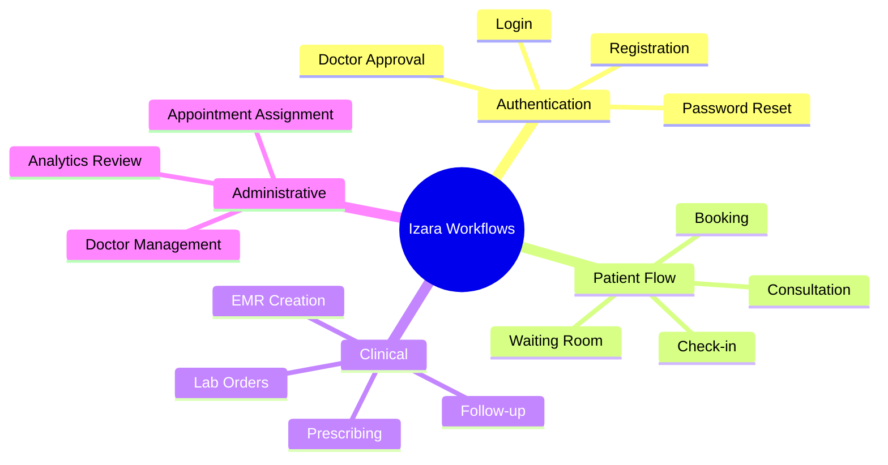
```mermaid
mindmap
  root((Izara Workflows))
    Authentication
      Login
      Registration
      Doctor Approval
      Password Reset
    Patient Flow
      Booking
      Check-in
      Waiting Room
      Consultation
    Clinical
      EMR Creation
      Prescribing
      Lab Orders
      Follow-up
    Administrative
      Doctor Management
      Appointment Assignment
      Analytics Review
```

---

## 🔐 Authentication Workflows

### Doctor Login Flow

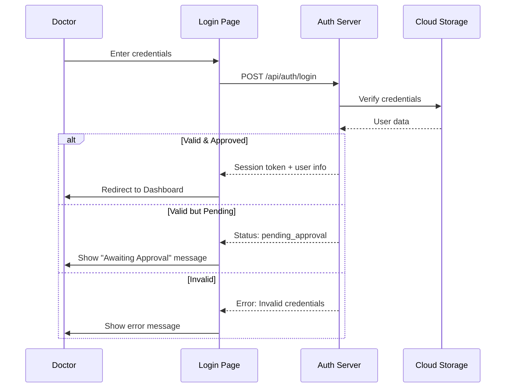
```mermaid
sequenceDiagram
    participant D as Doctor
    participant UI as Login Page
    participant Auth as Auth Server
    participant GCS as Cloud Storage
    
    D->>UI: Enter credentials
    UI->>Auth: POST /api/auth/login
    Auth->>GCS: Verify credentials
    GCS-->>Auth: User data
    
    alt Valid & Approved
        Auth-->>UI: Session token + user info
        UI->>D: Redirect to Dashboard
    else Valid but Pending
        Auth-->>UI: Status: pending_approval
        UI->>D: Show "Awaiting Approval" message
    else Invalid
        Auth-->>UI: Error: Invalid credentials
        UI->>D: Show error message
    end
```

### Doctor Registration Flow

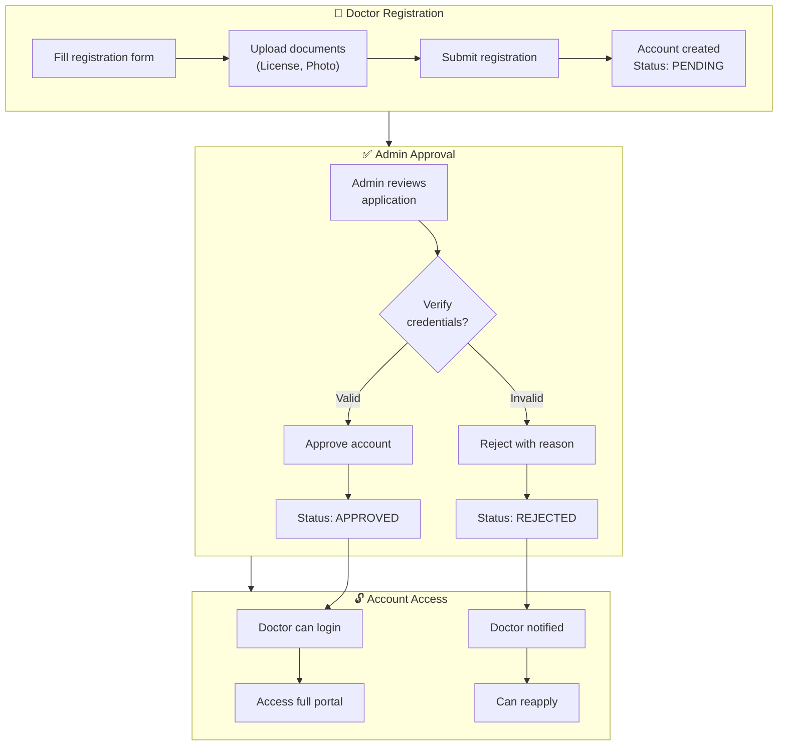
```mermaid
flowchart TB
    subgraph Registration["📝 Doctor Registration"]
        R1["Fill registration form"] --> R2["Upload documents<br/>(License, Photo)"]
        R2 --> R3["Submit registration"]
        R3 --> R4["Account created<br/>Status: PENDING"]
    end
    
    subgraph Approval["✅ Admin Approval"]
        A1["Admin reviews<br/>application"] --> A2{"Verify<br/>credentials?"}
        A2 -->|"Valid"| A3["Approve account"]
        A2 -->|"Invalid"| A4["Reject with reason"]
        A3 --> A5["Status: APPROVED"]
        A4 --> A6["Status: REJECTED"]
    end
    
    subgraph Access["🔓 Account Access"]
        A5 --> AC1["Doctor can login"]
        AC1 --> AC2["Access full portal"]
        A6 --> AC3["Doctor notified"]
        AC3 --> AC4["Can reapply"]
    end
    
    Registration --> Approval
    Approval --> Access
```

---

## 📅 Appointment Workflows

### Complete Appointment Lifecycle

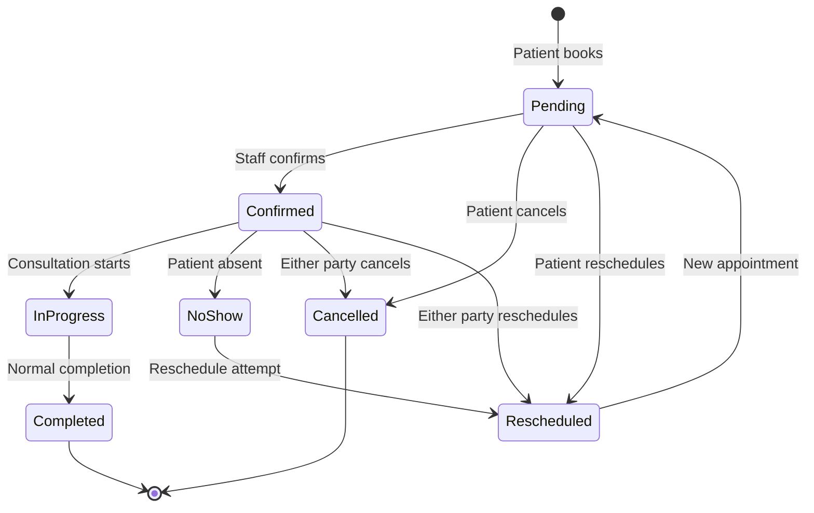
```mermaid
stateDiagram-v2
    [*] --> Pending: Patient books
    
    Pending --> Confirmed: Staff confirms
    Pending --> Cancelled: Patient cancels
    Pending --> Rescheduled: Patient reschedules
    
    Confirmed --> InProgress: Consultation starts
    Confirmed --> NoShow: Patient absent
    Confirmed --> Cancelled: Either party cancels
    Confirmed --> Rescheduled: Either party reschedules
    
    InProgress --> Completed: Normal completion
    
    NoShow --> Rescheduled: Reschedule attempt
    Rescheduled --> Pending: New appointment
    
    Completed --> [*]
    Cancelled --> [*]
```

### Booking Flow Details

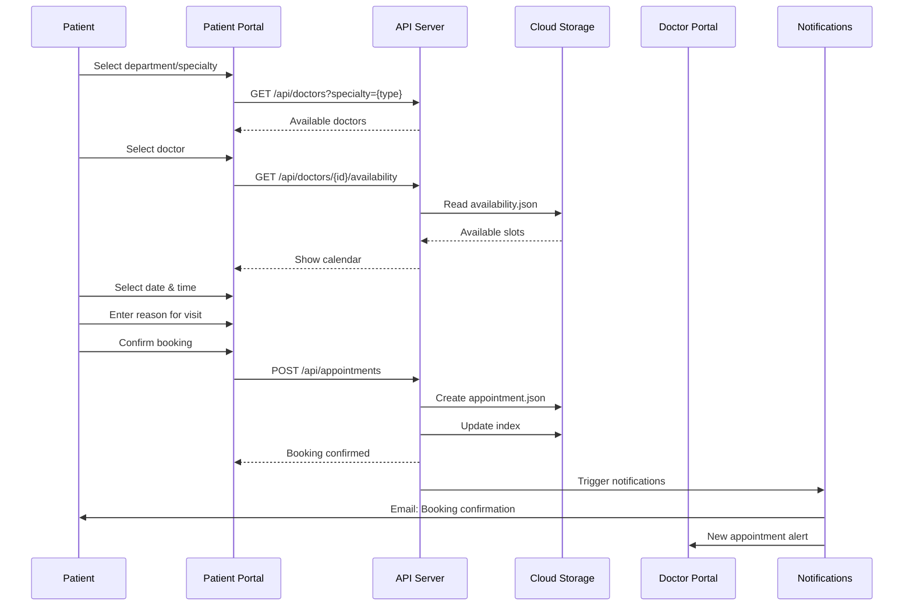
```mermaid
sequenceDiagram
    participant P as Patient
    participant UI as Patient Portal
    participant API as API Server
    participant GCS as Cloud Storage
    participant DOC as Doctor Portal
    participant N as Notifications
    
    P->>UI: Select department/specialty
    UI->>API: GET /api/doctors?specialty={type}
    API-->>UI: Available doctors
    
    P->>UI: Select doctor
    UI->>API: GET /api/doctors/{id}/availability
    API->>GCS: Read availability.json
    GCS-->>API: Available slots
    API-->>UI: Show calendar
    
    P->>UI: Select date & time
    P->>UI: Enter reason for visit
    P->>UI: Confirm booking
    
    UI->>API: POST /api/appointments
    API->>GCS: Create appointment.json
    API->>GCS: Update index
    API-->>UI: Booking confirmed
    
    API->>N: Trigger notifications
    N->>P: Email: Booking confirmation
    N->>DOC: New appointment alert
```

---

## 🎥 Telemedicine Workflow

### Complete Virtual Consultation Flow

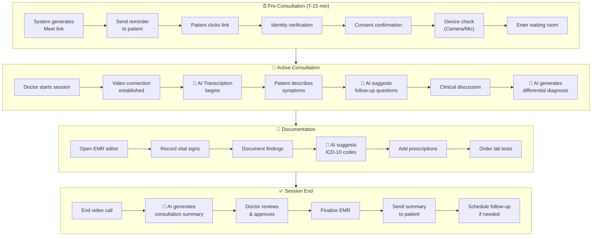
```mermaid
flowchart TB
    subgraph Prep["⏰ Pre-Consultation (T-15 min)"]
        PR1["System generates<br/>Meet link"] --> PR2["Send reminder<br/>to patient"]
        PR2 --> PR3["Patient clicks link"]
        PR3 --> PR4["Identity verification"]
        PR4 --> PR5["Consent confirmation"]
        PR5 --> PR6["Device check<br/>(Camera/Mic)"]
        PR6 --> PR7["Enter waiting room"]
    end
    
    subgraph Consult["🎥 Active Consultation"]
        C1["Doctor starts session"] --> C2["Video connection<br/>established"]
        C2 --> C3["🤖 AI Transcription<br/>begins"]
        C3 --> C4["Patient describes<br/>symptoms"]
        C4 --> C5["🤖 AI suggests<br/>follow-up questions"]
        C5 --> C6["Clinical discussion"]
        C6 --> C7["🤖 AI generates<br/>differential diagnosis"]
    end
    
    subgraph Doc["📝 Documentation"]
        D1["Open EMR editor"] --> D2["Record vital signs"]
        D2 --> D3["Document findings"]
        D3 --> D4["🤖 AI suggests<br/>ICD-10 codes"]
        D4 --> D5["Add prescriptions"]
        D5 --> D6["Order lab tests"]
    end
    
    subgraph End["✅ Session End"]
        E1["End video call"] --> E2["🤖 AI generates<br/>consultation summary"]
        E2 --> E3["Doctor reviews<br/>& approves"]
        E3 --> E4["Finalize EMR"]
        E4 --> E5["Send summary<br/>to patient"]
        E5 --> E6["Schedule follow-up<br/>if needed"]
    end
    
    Prep --> Consult --> Doc --> End
```

### Video Call Interface States

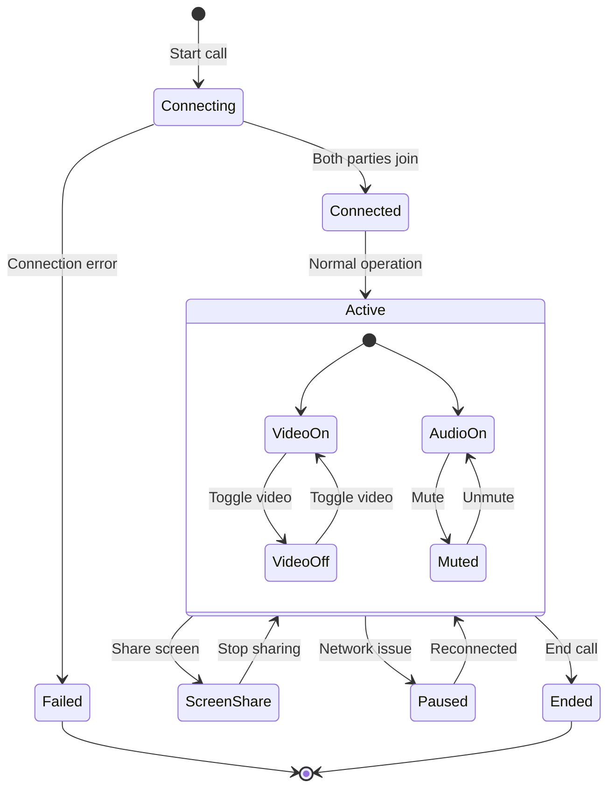
```mermaid
stateDiagram-v2
    [*] --> Connecting: Start call
    
    Connecting --> Connected: Both parties join
    Connecting --> Failed: Connection error
    
    Connected --> Active: Normal operation
    
    state Active {
        [*] --> VideoOn
        VideoOn --> VideoOff: Toggle video
        VideoOff --> VideoOn: Toggle video
        
        [*] --> AudioOn
        AudioOn --> Muted: Mute
        Muted --> AudioOn: Unmute
    }
    
    Active --> ScreenShare: Share screen
    ScreenShare --> Active: Stop sharing
    
    Active --> Paused: Network issue
    Paused --> Active: Reconnected
    
    Active --> Ended: End call
    Failed --> [*]
    Ended --> [*]
```

---

## 📝 EMR Creation Workflow

### SOAP Note Creation Flow

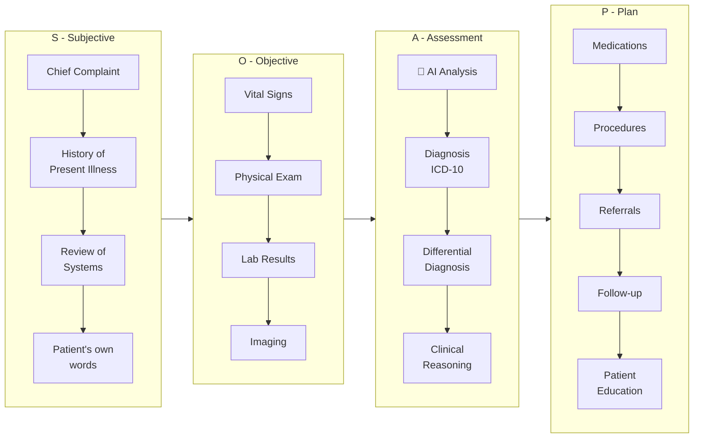
```mermaid
flowchart LR
    subgraph S["S - Subjective"]
        S1["Chief Complaint"] --> S2["History of<br/>Present Illness"]
        S2 --> S3["Review of<br/>Systems"]
        S3 --> S4["Patient's own<br/>words"]
    end
    
    subgraph O["O - Objective"]
        O1["Vital Signs"] --> O2["Physical Exam"]
        O2 --> O3["Lab Results"]
        O3 --> O4["Imaging"]
    end
    
    subgraph A["A - Assessment"]
        A1["🤖 AI Analysis"] --> A2["Diagnosis<br/>ICD-10"]
        A2 --> A3["Differential<br/>Diagnosis"]
        A3 --> A4["Clinical<br/>Reasoning"]
    end
    
    subgraph P["P - Plan"]
        P1["Medications"] --> P2["Procedures"]
        P2 --> P3["Referrals"]
        P3 --> P4["Follow-up"]
        P4 --> P5["Patient<br/>Education"]
    end
    
    S --> O --> A --> P
```

### EMR Workflow with AI Assistance

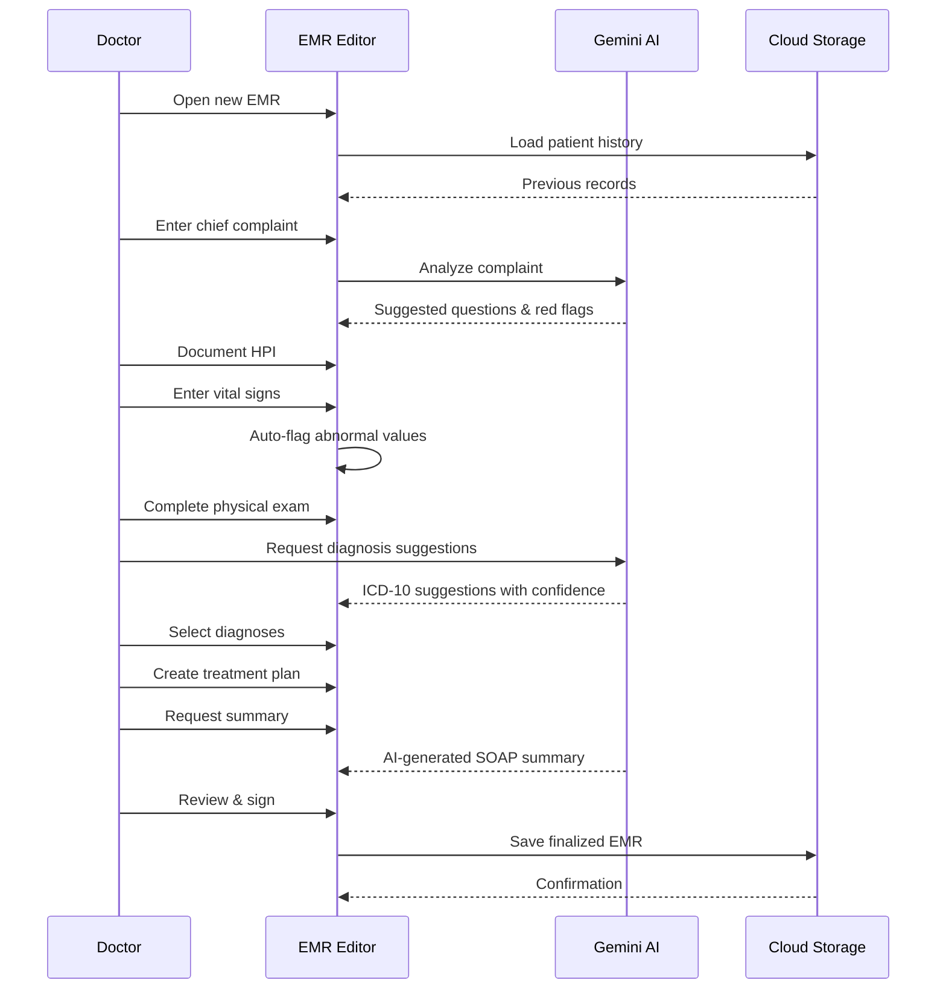
```mermaid
sequenceDiagram
    participant D as Doctor
    participant UI as EMR Editor
    participant AI as Gemini AI
    participant GCS as Cloud Storage
    
    D->>UI: Open new EMR
    UI->>GCS: Load patient history
    GCS-->>UI: Previous records
    
    D->>UI: Enter chief complaint
    UI->>AI: Analyze complaint
    AI-->>UI: Suggested questions & red flags
    
    D->>UI: Document HPI
    D->>UI: Enter vital signs
    UI->>UI: Auto-flag abnormal values
    
    D->>UI: Complete physical exam
    D->>AI: Request diagnosis suggestions
    AI-->>UI: ICD-10 suggestions with confidence
    
    D->>UI: Select diagnoses
    D->>UI: Create treatment plan
    
    D->>UI: Request summary
    AI-->>UI: AI-generated SOAP summary
    
    D->>UI: Review & sign
    UI->>GCS: Save finalized EMR
    GCS-->>UI: Confirmation
```

---

## 💊 Prescribing Workflow

### Safe Prescribing Flow

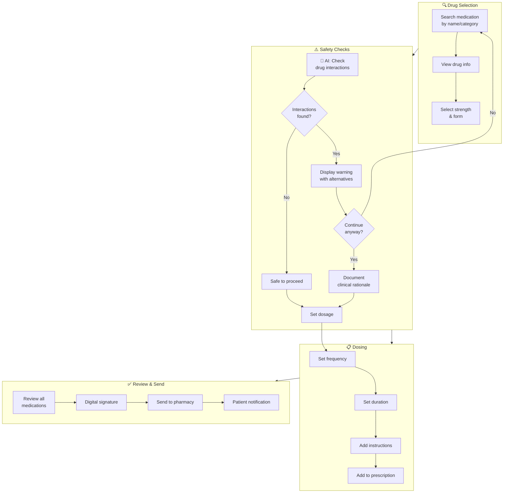
```mermaid
flowchart TB
    subgraph Search["🔍 Drug Selection"]
        SE1["Search medication<br/>by name/category"] --> SE2["View drug info"]
        SE2 --> SE3["Select strength<br/>& form"]
    end
    
    subgraph Safety["⚠️ Safety Checks"]
        SA1["🤖 AI: Check<br/>drug interactions"] --> SA2{"Interactions<br/>found?"}
        SA2 -->|"Yes"| SA3["Display warning<br/>with alternatives"]
        SA2 -->|"No"| SA4["Safe to proceed"]
        SA3 --> SA5{"Continue<br/>anyway?"}
        SA5 -->|"Yes"| SA6["Document<br/>clinical rationale"]
        SA5 -->|"No"| SE1
        SA4 --> DO1
        SA6 --> DO1
    end
    
    subgraph Dosing["📋 Dosing"]
        DO1["Set dosage"] --> DO2["Set frequency"]
        DO2 --> DO3["Set duration"]
        DO3 --> DO4["Add instructions"]
        DO4 --> DO5["Add to prescription"]
    end
    
    subgraph Review["✅ Review & Send"]
        RE1["Review all<br/>medications"] --> RE2["Digital signature"]
        RE2 --> RE3["Send to pharmacy"]
        RE3 --> RE4["Patient notification"]
    end
    
    Search --> Safety
    Safety --> Dosing
    Dosing --> Review
```

### Drug Interaction Check Flow

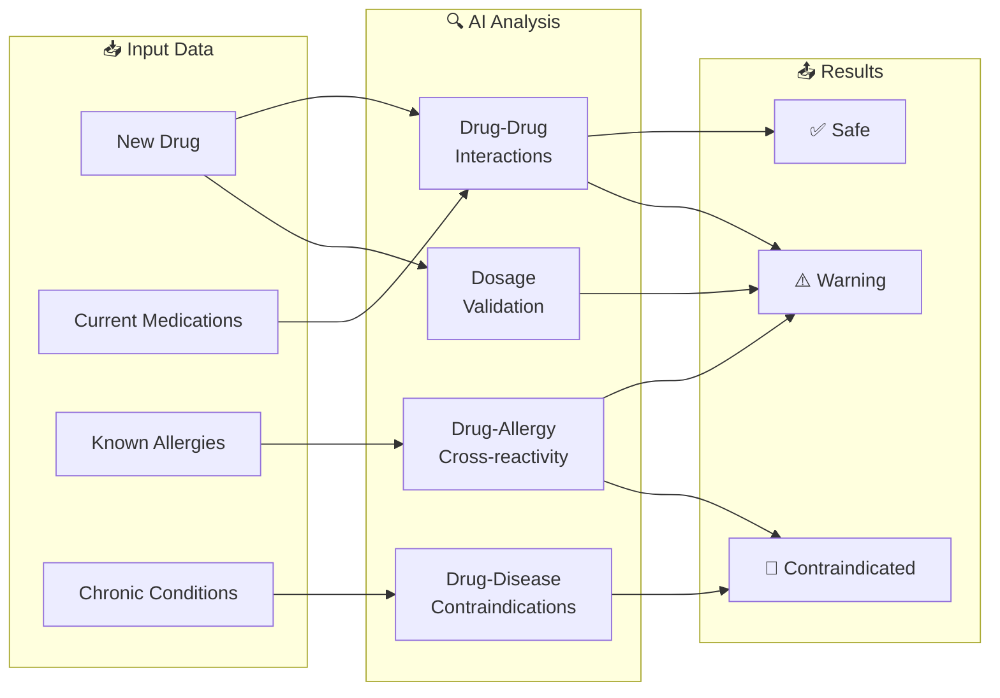
```mermaid
flowchart LR
    subgraph Input["📥 Input Data"]
        I1["New Drug"]
        I2["Current Medications"]
        I3["Known Allergies"]
        I4["Chronic Conditions"]
    end
    
    subgraph Check["🔍 AI Analysis"]
        C1["Drug-Drug<br/>Interactions"]
        C2["Drug-Allergy<br/>Cross-reactivity"]
        C3["Drug-Disease<br/>Contraindications"]
        C4["Dosage<br/>Validation"]
    end
    
    subgraph Output["📤 Results"]
        O1["✅ Safe"]
        O2["⚠️ Warning"]
        O3["🚫 Contraindicated"]
    end
    
    I1 --> C1
    I2 --> C1
    I3 --> C2
    I4 --> C3
    I1 --> C4
    
    C1 --> O1
    C1 --> O2
    C2 --> O2
    C2 --> O3
    C3 --> O3
    C4 --> O2
```

---

## 🧪 Lab Orders Workflow

### Lab Test Ordering Flow

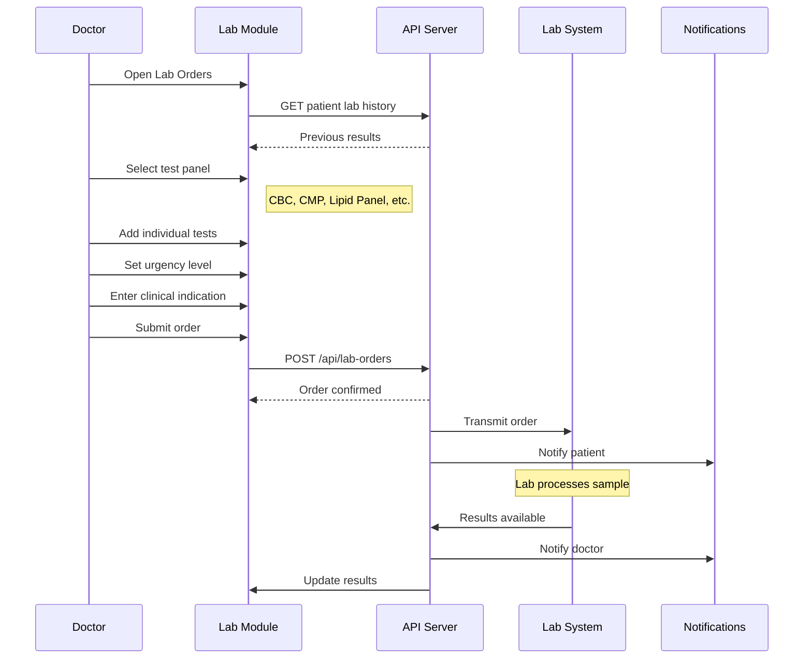
```mermaid
sequenceDiagram
    participant D as Doctor
    participant UI as Lab Module
    participant API as API Server
    participant LAB as Lab System
    participant N as Notifications
    
    D->>UI: Open Lab Orders
    UI->>API: GET patient lab history
    API-->>UI: Previous results
    
    D->>UI: Select test panel
    Note right of UI: CBC, CMP, Lipid Panel, etc.
    
    D->>UI: Add individual tests
    D->>UI: Set urgency level
    D->>UI: Enter clinical indication
    
    D->>UI: Submit order
    UI->>API: POST /api/lab-orders
    API-->>UI: Order confirmed
    
    API->>LAB: Transmit order
    API->>N: Notify patient
    
    Note over LAB: Lab processes sample
    
    LAB->>API: Results available
    API->>N: Notify doctor
    API->>UI: Update results
```

### Lab Result Review Flow

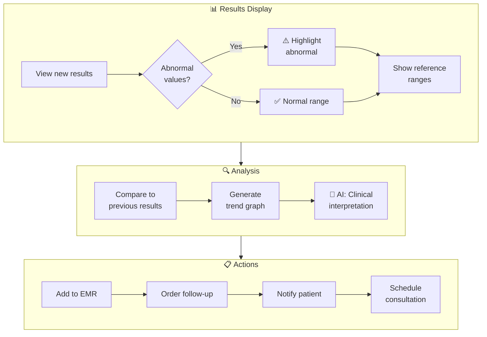
```mermaid
flowchart TB
    subgraph Results["📊 Results Display"]
        R1["View new results"] --> R2{"Abnormal<br/>values?"}
        R2 -->|"Yes"| R3["⚠️ Highlight<br/>abnormal"]
        R2 -->|"No"| R4["✅ Normal range"]
        R3 --> R5["Show reference<br/>ranges"]
        R4 --> R5
    end
    
    subgraph Analysis["🔍 Analysis"]
        A1["Compare to<br/>previous results"] --> A2["Generate<br/>trend graph"]
        A2 --> A3["🤖 AI: Clinical<br/>interpretation"]
    end
    
    subgraph Action["📋 Actions"]
        AC1["Add to EMR"] --> AC2["Order follow-up"]
        AC2 --> AC3["Notify patient"]
        AC3 --> AC4["Schedule<br/>consultation"]
    end
    
    Results --> Analysis --> Action
```

---

## 👔 Admin Workflows

### Doctor Approval Workflow

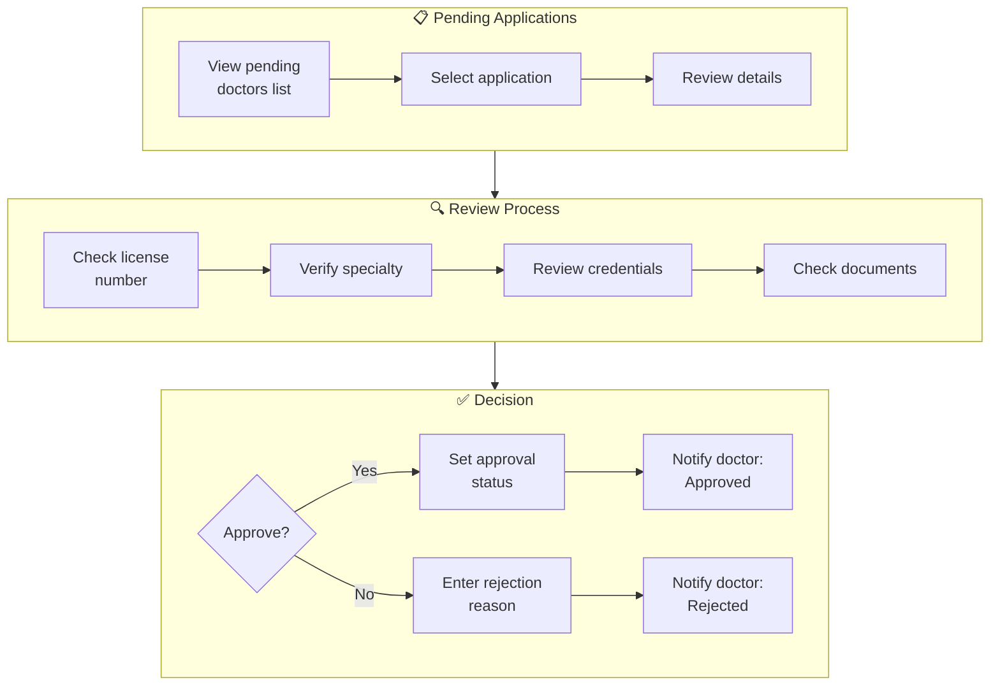
```mermaid
flowchart TB
    subgraph Applications["📋 Pending Applications"]
        A1["View pending<br/>doctors list"] --> A2["Select application"]
        A2 --> A3["Review details"]
    end
    
    subgraph Review["🔍 Review Process"]
        R1["Check license<br/>number"] --> R2["Verify specialty"]
        R2 --> R3["Review credentials"]
        R3 --> R4["Check documents"]
    end
    
    subgraph Decision["✅ Decision"]
        D1{"Approve?"}
        D1 -->|"Yes"| D2["Set approval<br/>status"]
        D1 -->|"No"| D3["Enter rejection<br/>reason"]
        D2 --> D4["Notify doctor:<br/>Approved"]
        D3 --> D5["Notify doctor:<br/>Rejected"]
    end
    
    Applications --> Review --> Decision
```

### Appointment Assignment Flow

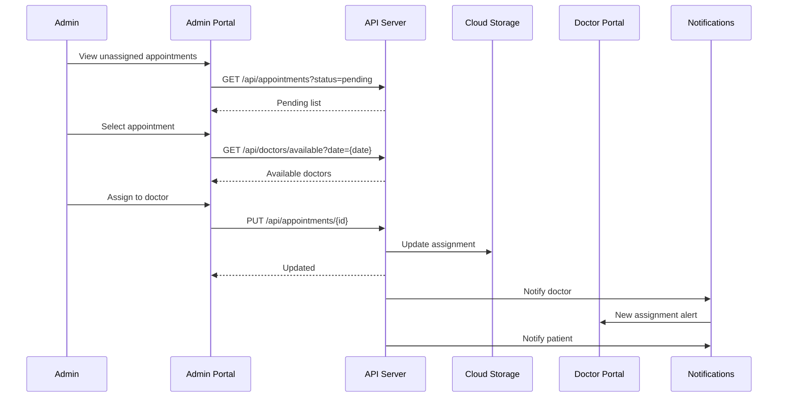
```mermaid
sequenceDiagram
    participant A as Admin
    participant UI as Admin Portal
    participant API as API Server
    participant GCS as Cloud Storage
    participant D as Doctor Portal
    participant N as Notifications
    
    A->>UI: View unassigned appointments
    UI->>API: GET /api/appointments?status=pending
    API-->>UI: Pending list
    
    A->>UI: Select appointment
    UI->>API: GET /api/doctors/available?date={date}
    API-->>UI: Available doctors
    
    A->>UI: Assign to doctor
    UI->>API: PUT /api/appointments/{id}
    API->>GCS: Update assignment
    API-->>UI: Updated
    
    API->>N: Notify doctor
    N->>D: New assignment alert
    API->>N: Notify patient
```

---

## 📊 Queue Management Workflow

### Queue State Transitions

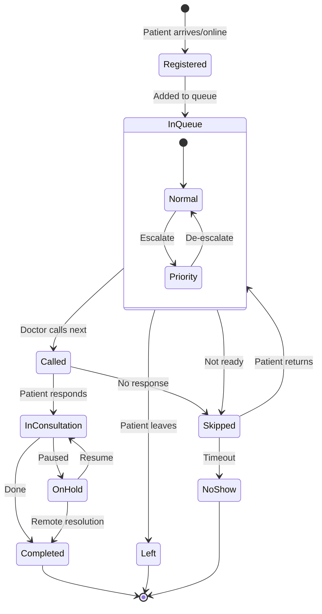
```mermaid
stateDiagram-v2
    [*] --> Registered: Patient arrives/online
    
    Registered --> InQueue: Added to queue
    
    state InQueue {
        [*] --> Normal
        Normal --> Priority: Escalate
        Priority --> Normal: De-escalate
    }
    
    InQueue --> Called: Doctor calls next
    InQueue --> Skipped: Not ready
    InQueue --> Left: Patient leaves
    
    Called --> InConsultation: Patient responds
    Called --> Skipped: No response
    
    Skipped --> InQueue: Patient returns
    Skipped --> NoShow: Timeout
    
    InConsultation --> Completed: Done
    InConsultation --> OnHold: Paused
    
    OnHold --> InConsultation: Resume
    OnHold --> Completed: Remote resolution
    
    Completed --> [*]
    Left --> [*]
    NoShow --> [*]
```

### Real-time Queue Updates

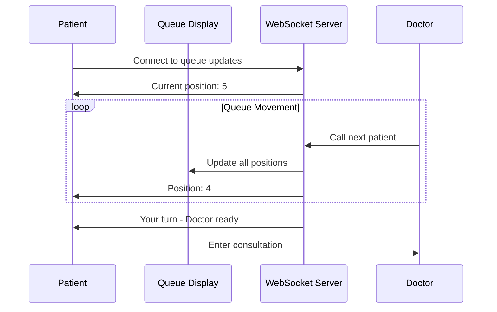
```mermaid
sequenceDiagram
    participant P as Patient
    participant Q as Queue Display
    participant WS as WebSocket Server
    participant D as Doctor
    
    P->>WS: Connect to queue updates
    WS->>P: Current position: 5
    
    loop Queue Movement
        D->>WS: Call next patient
        WS->>Q: Update all positions
        WS->>P: Position: 4
    end
    
    WS->>P: Your turn - Doctor ready
    P->>D: Enter consultation
```

---

## 🔗 Related Documentation

- [Appointment Workflow Details](./appointment-workflow.md)
- [EMR Workflow Details](./emr-workflow.md)
- [Prescribing Workflow Details](./prescribing-workflow.md)
- [Telemedicine Workflow Details](./telemedicine-workflow.md)
- [System Architecture](../overview/architecture.md)
- [Data Models](../data-structures/data-models.md)
