# 6. Feature Workflows

## 6.1 User Registration Workflow

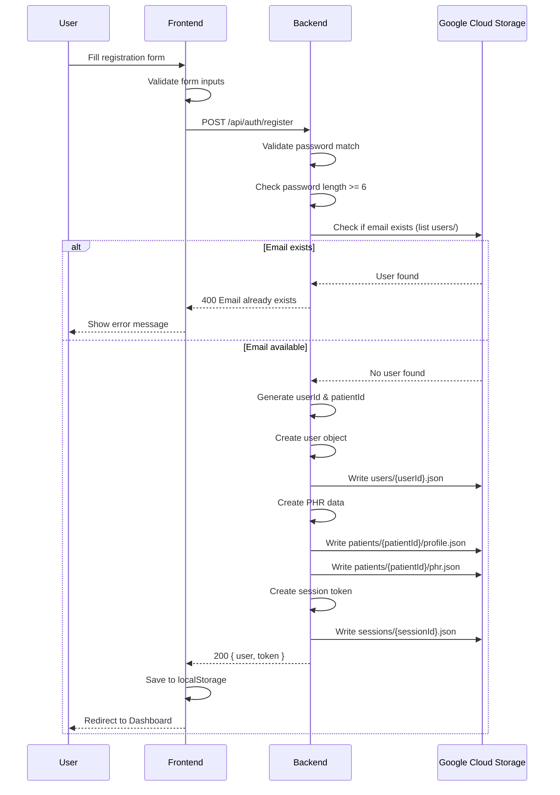

---

## 6.2 User Login Workflow

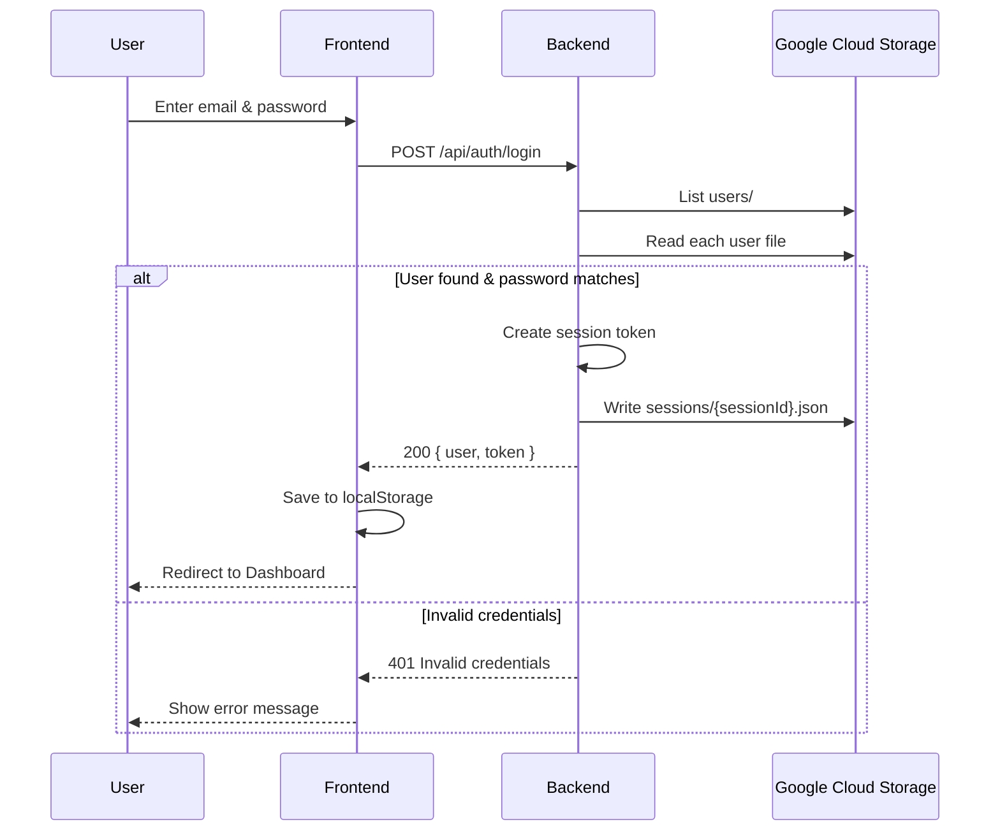

---

## 6.3 Appointment Booking Workflow

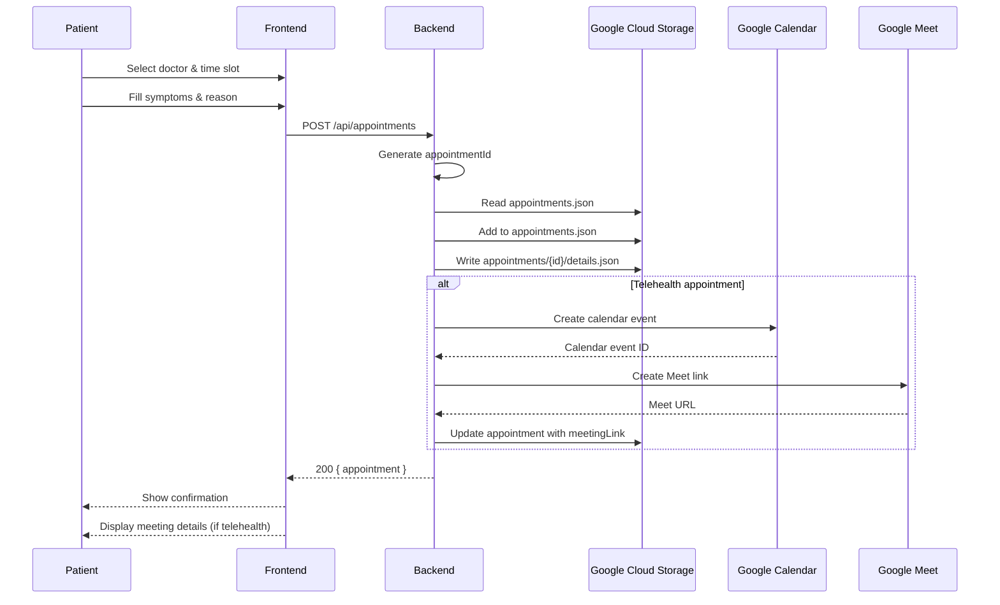

---

## 6.4 PHR Update Workflow

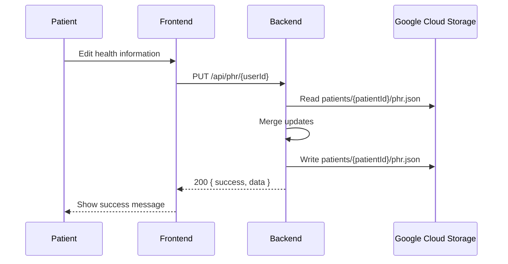

---

## 6.5 Vital Signs Recording Workflow

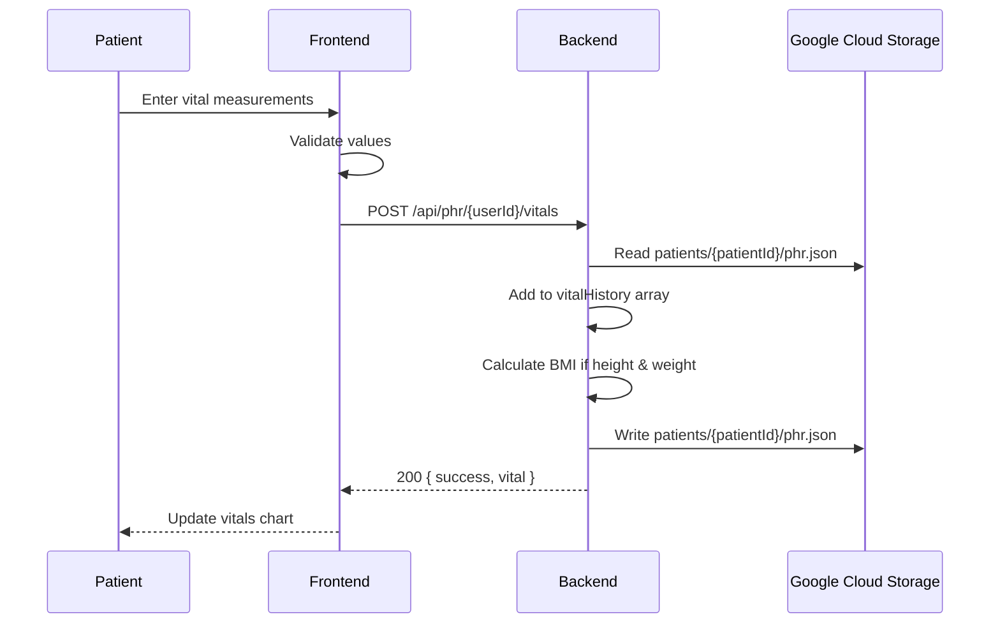

---

## 6.6 Living Will Management Workflow

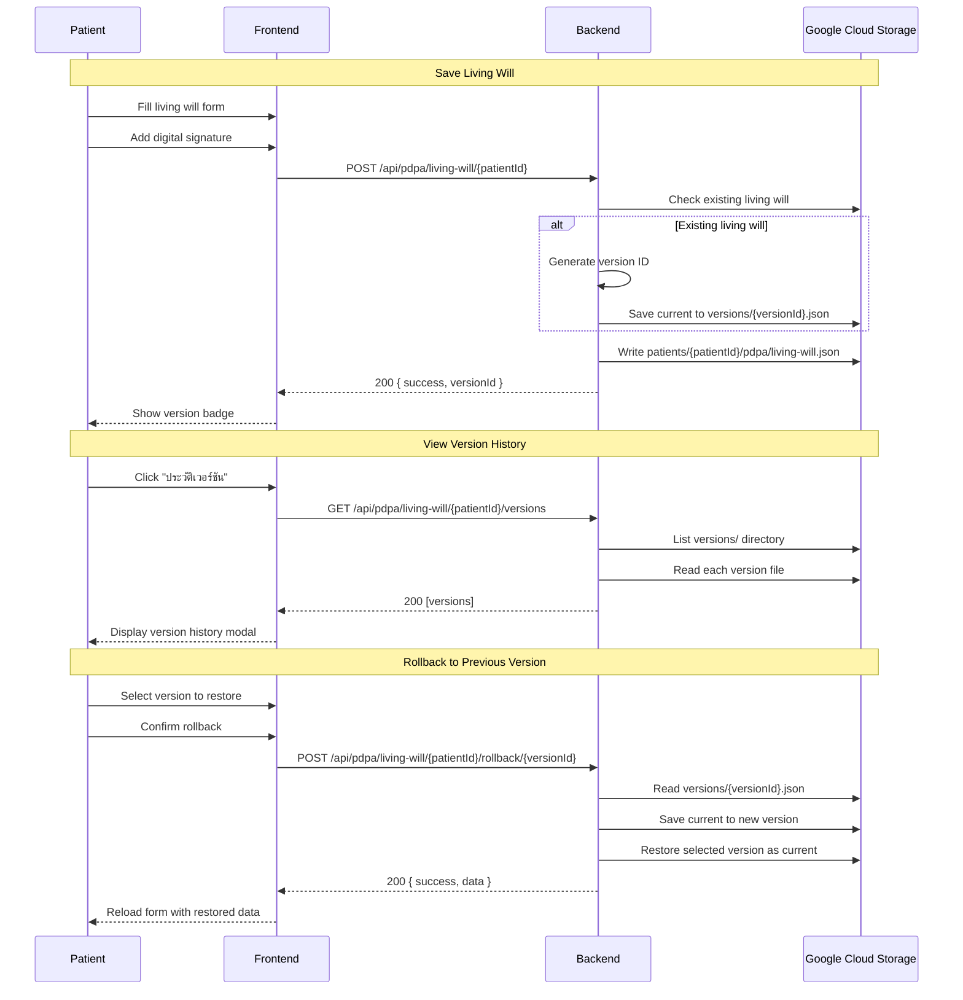

---

## 6.7 PDPA Consent Management Workflow

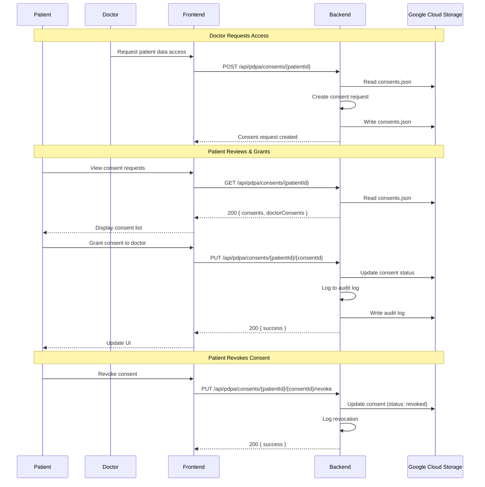

---

## 6.8 AI Health Chat Workflow

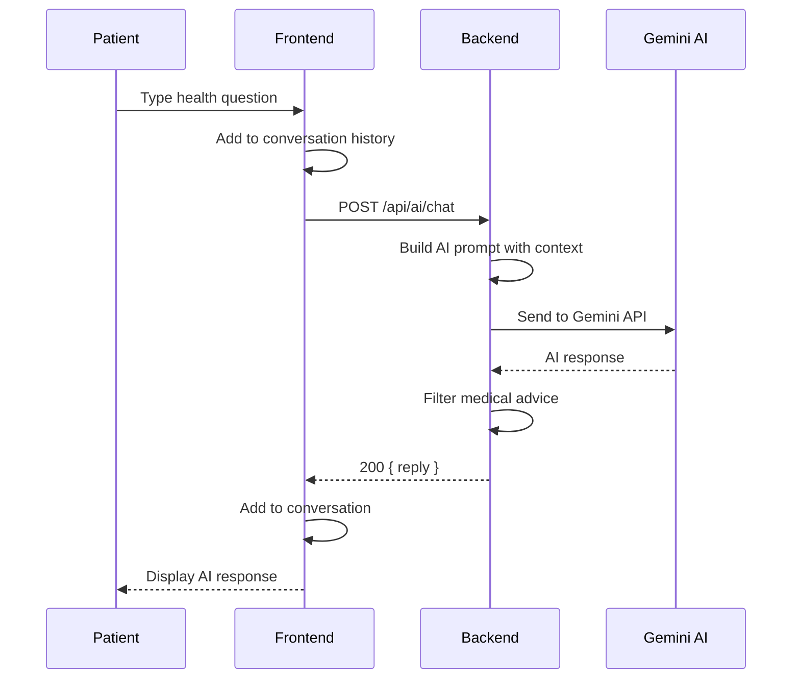

---

## 6.9 Map Location Search Workflow

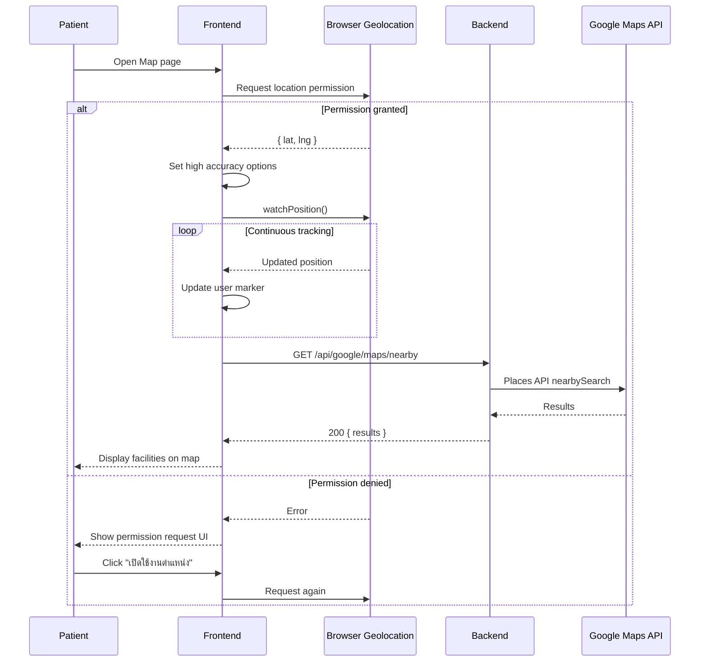

---

## 6.10 Treatment Results Filter Workflow

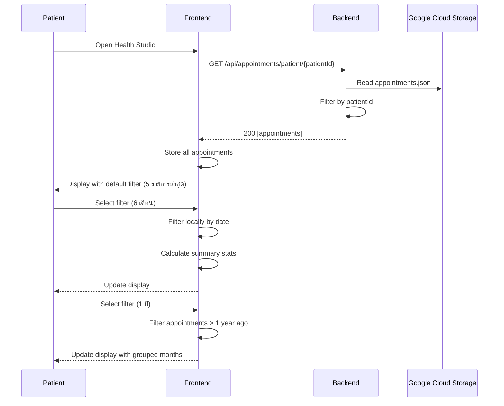

---

## 6.11 Telehealth Session Workflow

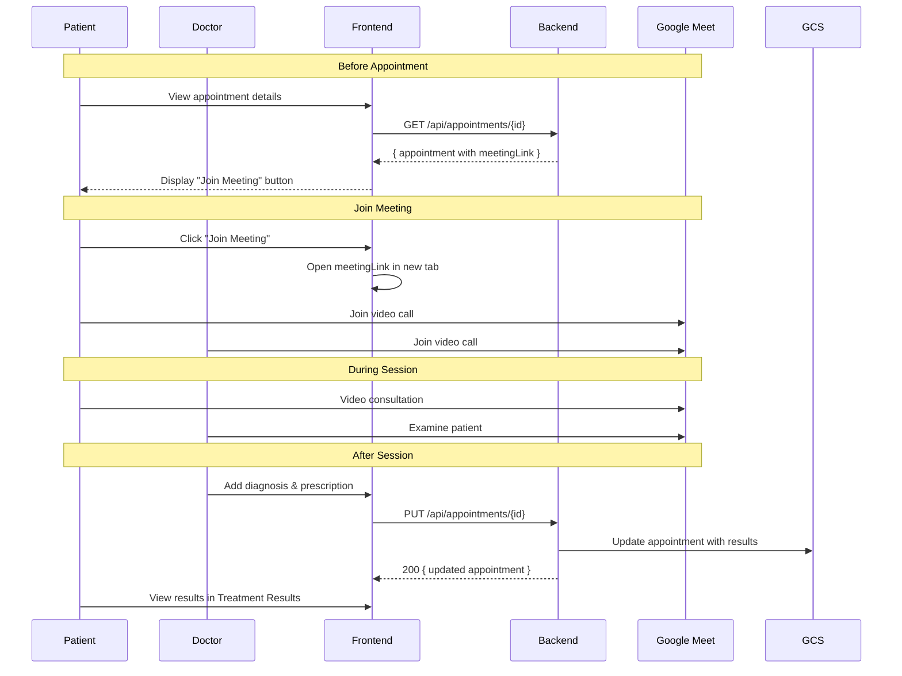

---

## 6.12 Data Flow Summary

```
┌─────────────────────────────────────────────────────────────────┐
│                    OVERALL DATA FLOW                             │
└─────────────────────────────────────────────────────────────────┘

                         ┌─────────────┐
                         │   Patient   │
                         └──────┬──────┘
                                │
                    ┌───────────┼───────────┐
                    │           │           │
                    ▼           ▼           ▼
             ┌──────────┐ ┌──────────┐ ┌──────────┐
             │  Health  │ │Appointment│ │  PDPA/   │
             │  Data    │ │  Booking │ │  Legal   │
             └────┬─────┘ └────┬─────┘ └────┬─────┘
                  │            │            │
                  └────────────┼────────────┘
                               │
                               ▼
                    ┌─────────────────────┐
                    │   Backend Server    │
                    │   (Express.js)      │
                    └──────────┬──────────┘
                               │
          ┌────────────────────┼────────────────────┐
          │                    │                    │
          ▼                    ▼                    ▼
   ┌─────────────┐     ┌─────────────┐     ┌─────────────┐
   │    GCS      │     │   Google    │     │   Gemini    │
   │   Storage   │     │   APIs      │     │     AI      │
   └─────────────┘     └─────────────┘     └─────────────┘
         │                    │
         │            ┌───────┴───────┐
         │            │               │
         │     ┌──────┴────┐   ┌──────┴────┐
         │     │ Calendar  │   │   Maps    │
         │     │   Meet    │   │           │
         │     └───────────┘   └───────────┘
         │
   ┌─────┴─────────────────────────────────────┐
   │                                           │
   ▼           ▼           ▼           ▼       │
┌──────┐  ┌────────┐  ┌────────┐  ┌────────┐  │
│Users │  │Patients│  │Doctors │  │Appoint-│  │
│Bucket│  │ Bucket │  │ Bucket │  │ ments  │  │
└──────┘  └────────┘  └────────┘  └────────┘  │
                                              │
```

---

[← Previous: API Reference](./05-api-reference.md) | [Next: Authentication →](./07-authentication.md)
