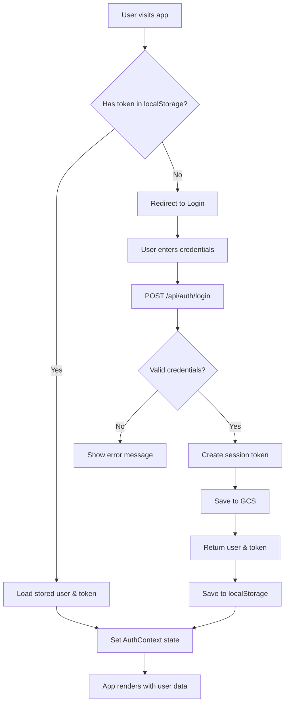

# 7. Authentication System

## 7.1 Overview

Isara Patient Portal ใช้ระบบ Session-based Authentication โดยจัดเก็บข้อมูล User และ Session ไว้ใน Google Cloud Storage

---

## 7.2 Authentication Flow Diagram



---

## 7.3 AuthContext Implementation

### 7.3.1 Context Structure

```typescript
interface AuthContextType {
  user: User | null;           // Current logged-in user
  token: string | null;        // Session token
  isLoading: boolean;          // Loading state
  isAuthenticated: boolean;    // Auth status
  login: (email: string, password: string) => Promise<void>;
  register: (data: RegisterInput) => Promise<void>;
  logout: () => Promise<void>;
  updateUser: (user: User) => void;
}
```

### 7.3.2 Storage Keys

| Key | Description | Storage |
|-----|-------------|---------|
| `izara_user` | User profile JSON | localStorage |
| `auth_token` | Session token | localStorage |

### 7.3.3 Auth Flow Code

```typescript
// On app load
useEffect(() => {
  loadStoredAuth();
}, []);

const loadStoredAuth = () => {
  try {
    const storedUser = localStorage.getItem('izara_user');
    const storedToken = localStorage.getItem('auth_token');
    if (storedUser && storedToken) {
      setUser(JSON.parse(storedUser));
      setToken(storedToken);
    }
  } catch (e) {
    clearAuth();
  } finally {
    setIsLoading(false);
  }
};
```

---

## 7.4 Route Protection

### 7.4.1 Protected Route Component

```typescript
function ProtectedRoute({ children }: { children: React.ReactNode }) {
  const { isAuthenticated, isLoading } = useAuth();

  if (isLoading) {
    return <LoadingSpinner />;
  }

  return isAuthenticated ? <>{children}</> : <Navigate to="/login" replace />;
}
```

### 7.4.2 Public Route Component

```typescript
function PublicRoute({ children }: { children: React.ReactNode }) {
  const { isAuthenticated, isLoading } = useAuth();

  if (isLoading) {
    return <LoadingSpinner />;
  }

  return isAuthenticated ? <Navigate to="/" replace /> : <>{children}</>;
}
```

### 7.4.3 Route Configuration

```typescript
<Routes>
  {/* Public routes */}
  <Route path="/login" element={<PublicRoute><LoginPage /></PublicRoute>} />
  <Route path="/register" element={<PublicRoute><RegisterPage /></PublicRoute>} />
  
  {/* Protected routes */}
  <Route path="/" element={<ProtectedRoute><MainLayout /></ProtectedRoute>}>
    <Route index element={<DashboardPage />} />
    <Route path="appointments" element={<AppointmentListPage />} />
    <Route path="phr" element={<PHRPage />} />
    {/* ... more routes */}
  </Route>
</Routes>
```

---

## 7.5 Backend Authentication

### 7.5.1 User Storage Structure (GCS)

```
izara-users-credentials/
├── users/
│   └── user_xxx.json
└── sessions/
    └── session_xxx.json
```

**User File (`users/{userId}.json`):**
```json
{
  "id": "user_1733556000000_abc123",
  "patientId": "patient_1733556000000_xyz789",
  "email": "patient@example.com",
  "passwordHash": "cGFzc3dvcmQxMjM=",
  "profile": {
    "id": "user_xxx",
    "name": "สมชาย ใจดี",
    "email": "patient@example.com",
    "phone": "0812345678",
    "dateOfBirth": "1990-01-15",
    "gender": "male"
  },
  "createdAt": "2025-12-01T00:00:00.000Z",
  "updatedAt": "2025-12-07T00:00:00.000Z"
}
```

**Session File (`sessions/{sessionId}.json`):**
```json
{
  "id": "session_1733556000000_def456",
  "userId": "user_xxx",
  "token": "session_1733556000000_def456",
  "createdAt": "2025-12-07T10:00:00.000Z",
  "expiresAt": "2025-12-14T10:00:00.000Z"
}
```

### 7.5.2 Password Handling

**Current Implementation (Development):**
```typescript
// Encoding (NOT secure for production)
const passwordHash = Buffer.from(password).toString('base64');

// Verification
const isValid = Buffer.from(passwordHash, 'base64').toString() === password;
```

**Recommended for Production:**
```typescript
import bcrypt from 'bcrypt';

// Hashing
const saltRounds = 10;
const passwordHash = await bcrypt.hash(password, saltRounds);

// Verification
const isValid = await bcrypt.compare(password, passwordHash);
```

### 7.5.3 Auth Middleware

```typescript
// server/middleware/auth.ts
export const authMiddleware = async (
  req: Request, 
  res: Response, 
  next: NextFunction
) => {
  try {
    const authHeader = req.headers.authorization;
    
    if (!authHeader || !authHeader.startsWith('Bearer ')) {
      return res.status(401).json({ error: 'No token provided' });
    }

    const token = authHeader.split(' ')[1];
    
    // Validate session in GCS
    const session = await readJSON(
      GCS_BUCKETS.AUTH, 
      `sessions/${token}.json`
    );
    
    if (!session || new Date(session.expiresAt) < new Date()) {
      return res.status(401).json({ error: 'Invalid or expired token' });
    }

    // Attach user to request
    req.userId = session.userId;
    next();
  } catch (error) {
    return res.status(401).json({ error: 'Authentication failed' });
  }
};
```

---

## 7.6 Registration Flow

### 7.6.1 Registration Form Fields

| Field | Required | Validation |
|-------|----------|------------|
| `email` | Yes | Valid email format |
| `password` | Yes | Min 6 characters |
| `confirmPassword` | Yes | Must match password |
| `name` | Yes | Not empty |
| `phone` | Yes | Not empty |
| `dateOfBirth` | Yes | Valid date |
| `gender` | Yes | male/female/other |
| `height` | No | Number (cm) |
| `weight` | No | Number (kg) |
| `bloodType` | No | A+, B-, etc. |
| `allergies` | No | Comma-separated |
| `chronicConditions` | No | Comma-separated |
| `emergencyContactName` | No | String |
| `emergencyContactPhone` | No | String |
| `emergencyContactRelation` | No | String |

### 7.6.2 Registration Process

1. **Validate Input**
   - Check password match
   - Check password length
   - Validate required fields

2. **Check Email Uniqueness**
   - List all files in `users/` directory
   - Check if email exists in any user file

3. **Generate IDs**
   - `userId`: `user_{timestamp}_{random}`
   - `patientId`: `patient_{timestamp}_{random}`

4. **Create User Record**
   - Save to `users/{userId}.json`

5. **Create PHR Record**
   - Initialize with registration data
   - Save to `patients/{patientId}/profile.json`
   - Save to `patients/{patientId}/phr.json`

6. **Create Session**
   - Generate session token
   - Save to `sessions/{sessionId}.json`

7. **Return Response**
   - User profile
   - Session token

---

## 7.7 Login Flow

### 7.7.1 Login Process

1. **Receive Credentials**
   - Email and password from request body

2. **Find User**
   - List files in `users/` directory
   - Read each file and match email

3. **Verify Password**
   - Compare with stored passwordHash

4. **Create Session**
   - Generate new session token
   - Set expiration (7 days default)
   - Save session file

5. **Return Response**
   - User profile (without passwordHash)
   - Session token

### 7.7.2 Session Expiration

```typescript
// Default session duration: 7 days
const expiresAt = new Date();
expiresAt.setDate(expiresAt.getDate() + 7);
```

---

## 7.8 Logout Flow

### 7.8.1 Logout Process

1. **Receive Token**
   - Token from request body

2. **Delete Session**
   - Remove session file from GCS

3. **Client Cleanup**
   - Remove from localStorage
   - Clear AuthContext state

```typescript
// Frontend
const logout = async () => {
  try {
    if (token) {
      await fetch('/api/auth/logout', {
        method: 'POST',
        body: JSON.stringify({ token }),
      });
    }
  } finally {
    clearAuth(); // Always clear local state
  }
};

// Backend
router.post('/logout', async (req, res) => {
  const { token } = req.body;
  
  try {
    await storage.bucket(GCS_BUCKETS.AUTH)
      .file(`sessions/${token}.json`)
      .delete();
  } catch (e) {
    // Session might not exist
  }
  
  res.json({ success: true });
});
```

---

## 7.9 Security Considerations

### 7.9.1 Current Implementation

| Aspect | Status | Notes |
|--------|--------|-------|
| Password Storage | ⚠️ Basic | Base64 only - use bcrypt for production |
| Session Tokens | ✅ Good | Random, unique per session |
| Token Storage | ⚠️ Basic | localStorage - consider httpOnly cookies |
| CORS | ✅ Good | Configured for development |
| HTTPS | ⚠️ Missing | Required for production |

### 7.9.2 Production Recommendations

1. **Use bcrypt for password hashing**
2. **Use httpOnly cookies for tokens**
3. **Implement token refresh mechanism**
4. **Add rate limiting on auth endpoints**
5. **Enable HTTPS**
6. **Add CSRF protection**
7. **Implement account lockout after failed attempts**

---

## 7.10 Authentication State Diagram

```
┌─────────────────────────────────────────────────────────────────┐
│                    AUTHENTICATION STATES                         │
└─────────────────────────────────────────────────────────────────┘

                        ┌─────────────┐
                        │   Initial   │
                        │   Loading   │
                        └──────┬──────┘
                               │
                    ┌──────────┴──────────┐
                    │                     │
                    ▼                     ▼
           ┌──────────────┐      ┌──────────────┐
           │ Authenticated │      │   Logged    │
           │    (token)    │      │     Out     │
           └───────┬──────┘      └──────┬──────┘
                   │                    │
        ┌──────────┴────┐               │
        │               │               │
        ▼               ▼               │
  ┌───────────┐  ┌───────────┐         │
  │  Access   │  │  Logout   │─────────┘
  │ Protected │  │  Action   │
  │  Routes   │  └───────────┘
  └───────────┘
```

---

[← Previous: Workflows](./06-workflows.md) | [Next: PDPA Consent →](./08-pdpa-consent.md)
