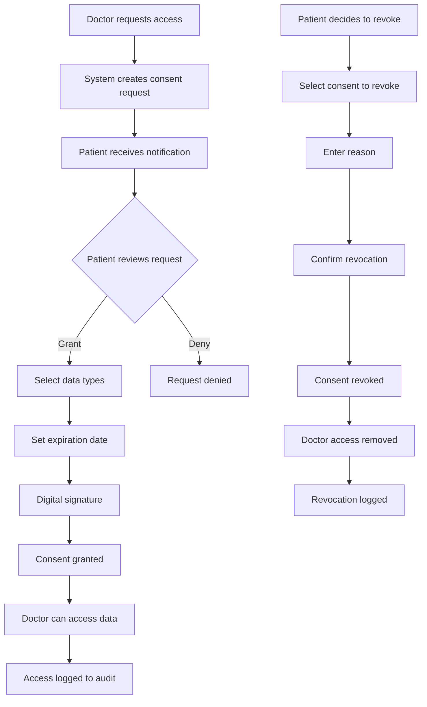
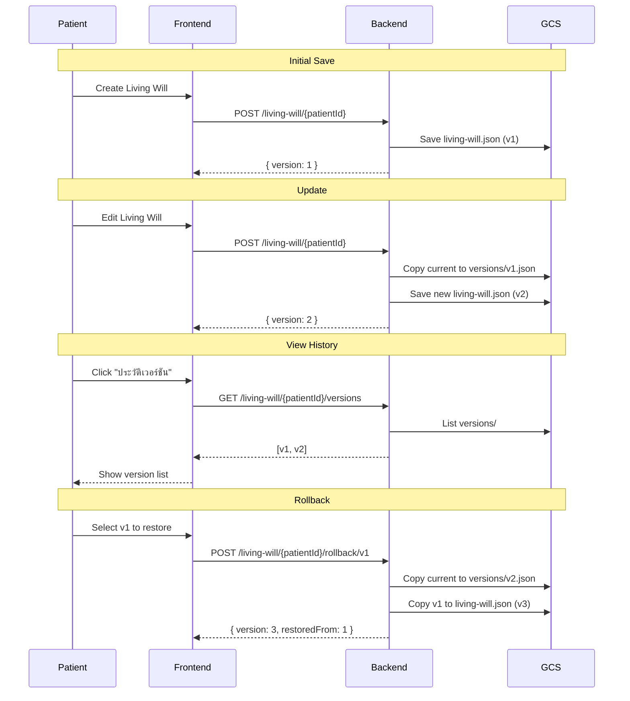

# 8. PDPA & Consent Management

## 8.1 Overview

ระบบจัดการความยินยอม (Consent Management) ตาม พ.ร.บ. คุ้มครองข้อมูลส่วนบุคคล (PDPA) ของประเทศไทย ซึ่งกำหนดให้ผู้ป่วยต้องให้ความยินยอมก่อนที่แพทย์จะสามารถเข้าถึงข้อมูลส่วนบุคคลได้

---

## 8.2 PDPA Compliance Features

### 8.2.1 Core Features

| Feature | Description | Status |
|---------|-------------|--------|
| **Consent Collection** | เก็บความยินยอมจากผู้ป่วย | ✅ Active |
| **Granular Control** | เลือกประเภทข้อมูลที่อนุญาต | ✅ Active |
| **Consent Revocation** | เพิกถอนความยินยอมได้ตลอดเวลา | ✅ Active |
| **Audit Logging** | บันทึกการเข้าถึงข้อมูลทั้งหมด | ✅ Active |
| **Expiration** | ตั้งวันหมดอายุของความยินยอม | ✅ Active |
| **Doctor-specific** | ความยินยอมแยกตามแพทย์แต่ละคน | ✅ Active |

### 8.2.2 Data Types Subject to Consent

```typescript
type PDPADataType =
  | 'demographics'      // ข้อมูลส่วนบุคคล
  | 'medical_history'   // ประวัติการรักษา
  | 'medications'       // ยาที่ใช้
  | 'allergies'         // ข้อมูลการแพ้
  | 'lab_results'       // ผลตรวจแล็บ
  | 'imaging_results'   // ผลตรวจภาพ
  | 'prescriptions'     // ใบสั่งยา
  | 'vital_signs'       // สัญญาณชีพ
  | 'emr_records'       // EMR
  | 'phr'               // PHR
  | 'living_will'       // หนังสือแสดงเจตนา
  | 'all';              // ทั้งหมด
```

---

## 8.3 Consent Flow Diagram



---

## 8.4 Data Storage Structure

### 8.4.1 Consent File Location

```
izara-patients-data/
└── patients/
    └── {patientId}/
        └── pdpa/
            ├── consents.json         # All consents
            ├── living-will.json      # Living will document
            └── versions/             # Living will versions
                └── {versionId}.json
```

### 8.4.2 Consent Data Structure

```json
{
  "consents": [
    {
      "id": "consent_basic_collection",
      "type": "data_collection",
      "granted": true,
      "grantedAt": "2025-12-01T00:00:00.000Z",
      "updatedAt": "2025-12-01T00:00:00.000Z"
    },
    {
      "id": "consent_data_processing",
      "type": "data_processing",
      "granted": true,
      "grantedAt": "2025-12-01T00:00:00.000Z",
      "updatedAt": "2025-12-01T00:00:00.000Z"
    }
  ],
  "doctorConsents": [
    {
      "id": "consent_1733556000000_abc123",
      "patientId": "patient_xxx",
      "doctorId": "doctor_001",
      "doctorName": "นพ. สมศักดิ์ ใจดี",
      "hospitalId": "hospital_001",
      "hospitalName": "โรงพยาบาลกรุงเทพ",
      "dataTypes": ["demographics", "medical_history", "lab_results"],
      "purpose": "การรักษาต่อเนื่อง",
      "status": "granted",
      "grantedAt": "2025-12-05T10:00:00.000Z",
      "expiresAt": "2026-12-05T10:00:00.000Z",
      "digitalSignature": "base64...",
      "ipAddress": "192.168.1.1",
      "auditLog": []
    }
  ]
}
```

---

## 8.5 Consent Types

### 8.5.1 Basic Consent Types

| Type ID | Thai Name | Description |
|---------|-----------|-------------|
| `data_collection` | การเก็บรวบรวมข้อมูล | ยินยอมให้เก็บข้อมูลส่วนบุคคล |
| `data_processing` | การประมวลผลข้อมูล | ยินยอมให้ประมวลผลข้อมูลเพื่อการรักษา |
| `data_sharing` | การแบ่งปันข้อมูล | ยินยอมให้แบ่งปันข้อมูลกับบุคคลที่สาม |
| `marketing` | การตลาด | ยินยอมรับข้อมูลข่าวสารด้านสุขภาพ |
| `research` | การวิจัย | ยินยอมให้ใช้ข้อมูลในการวิจัย |

### 8.5.2 Doctor-specific Consent

```json
{
  "doctorConsent": {
    "doctorId": "doctor_xxx",
    "doctorName": "Dr. Smith",
    "dataTypes": [
      "demographics",
      "medical_history",
      "medications",
      "allergies",
      "lab_results"
    ],
    "purpose": "Ongoing treatment for diabetes",
    "duration": "1 year",
    "status": "granted"
  }
}
```

---

## 8.6 Consent Management UI

### 8.6.1 PDPA Page Components

```
┌─────────────────────────────────────────────────────────────────┐
│                        PDPA CONSENT PAGE                         │
├─────────────────────────────────────────────────────────────────┤
│                                                                  │
│  ┌────────────────────────────────────────────────────────────┐ │
│  │                   BASIC CONSENTS                            │ │
│  │  ┌─────────────────────────────────────────────────────┐   │ │
│  │  │ □ การเก็บรวบรวมข้อมูล                              │   │ │
│  │  │   ยินยอมให้ระบบเก็บข้อมูลส่วนบุคคลของท่าน            │   │ │
│  │  └─────────────────────────────────────────────────────┘   │ │
│  │  ┌─────────────────────────────────────────────────────┐   │ │
│  │  │ □ การประมวลผลข้อมูล                                │   │ │
│  │  │   ยินยอมให้ประมวลผลข้อมูลเพื่อการรักษา               │   │ │
│  │  └─────────────────────────────────────────────────────┘   │ │
│  └────────────────────────────────────────────────────────────┘ │
│                                                                  │
│  ┌────────────────────────────────────────────────────────────┐ │
│  │              DOCTOR-SPECIFIC CONSENTS                       │ │
│  │  ┌─────────────────────────────────────────────────────┐   │ │
│  │  │ 👨‍⚕️ นพ. สมศักดิ์ ใจดี                              │   │ │
│  │  │    โรงพยาบาลกรุงเทพ                                  │   │ │
│  │  │    สถานะ: ✅ อนุญาต                                  │   │ │
│  │  │    ข้อมูลที่เข้าถึง: ส่วนบุคคล, ประวัติรักษา, ผลแล็บ    │   │ │
│  │  │    หมดอายุ: 5 ธ.ค. 2569                              │   │ │
│  │  │    [ดูรายละเอียด] [เพิกถอน]                           │   │ │
│  │  └─────────────────────────────────────────────────────┘   │ │
│  └────────────────────────────────────────────────────────────┘ │
│                                                                  │
│  ┌────────────────────────────────────────────────────────────┐ │
│  │                    AUDIT LOG                                │ │
│  │  📋 7 ธ.ค. 2568 10:30 - นพ.สมศักดิ์ เข้าดูผลแล็บ          │ │
│  │  📋 5 ธ.ค. 2568 14:15 - นพ.สมศักดิ์ เข้าดูประวัติรักษา    │ │
│  └────────────────────────────────────────────────────────────┘ │
│                                                                  │
└─────────────────────────────────────────────────────────────────┘
```

---

## 8.7 Audit Logging

### 8.7.1 Audit Log Structure

```json
{
  "auditLog": [
    {
      "timestamp": "2025-12-07T10:30:00.000Z",
      "doctorId": "doctor_001",
      "doctorName": "นพ. สมศักดิ์ ใจดี",
      "dataAccessed": "lab_results",
      "purpose": "Review patient lab results",
      "ipAddress": "192.168.1.100"
    }
  ]
}
```

### 8.7.2 Audit Events

| Event Type | Description | Logged Data |
|------------|-------------|-------------|
| `consent_granted` | ผู้ป่วยให้ความยินยอม | doctorId, dataTypes, timestamp |
| `consent_revoked` | ผู้ป่วยเพิกถอนความยินยอม | doctorId, reason, timestamp |
| `data_accessed` | แพทย์เข้าถึงข้อมูล | doctorId, dataType, purpose, IP |
| `consent_expired` | ความยินยอมหมดอายุ | consentId, timestamp |

---

## 8.8 Living Will Management

### 8.8.1 Living Will Structure

```json
{
  "id": "livingwill_xxx",
  "patientId": "patient_xxx",
  "version": 3,
  "healthcareProxy": {
    "primary": {
      "name": "นางสมศรี ใจดี",
      "relationship": "ภรรยา",
      "phone": "0812345678",
      "email": "somsri@example.com",
      "address": "123 ถ.สุขุมวิท กทม."
    },
    "alternate": {
      "name": "นายสมชาย ใจดี",
      "relationship": "บุตร",
      "phone": "0823456789",
      "email": "somchai@example.com"
    }
  },
  "preferences": {
    "cpr": false,
    "mechanicalVentilation": false,
    "artificialNutrition": false,
    "dialysis": true,
    "organDonation": true,
    "painManagement": "ต้องการยาแก้ปวดเต็มที่",
    "additionalWishes": "ไม่ต้องการเครื่องช่วยหายใจหากไม่มีโอกาสหาย"
  },
  "religiousPreferences": "พุทธ - ต้องการพระมาสวดมนต์",
  "digitalSignature": "base64...",
  "witnessSignatures": ["base64...", "base64..."],
  "createdAt": "2025-11-01T00:00:00.000Z",
  "updatedAt": "2025-12-07T00:00:00.000Z",
  "sharedWith": ["doctor_001", "doctor_002"]
}
```

### 8.8.2 Version Control Flow



### 8.8.3 Version History UI

```
┌─────────────────────────────────────────────────────────────────┐
│                    VERSION HISTORY MODAL                         │
├─────────────────────────────────────────────────────────────────┤
│                                                                  │
│  ประวัติเวอร์ชันทั้งหมด                                          │
│                                                                  │
│  ┌─────────────────────────────────────────────────────────┐    │
│  │ 📌 เวอร์ชัน 3 (ปัจจุบัน)                                 │    │
│  │    7 ธ.ค. 2568 10:30                                    │    │
│  │    [ดูตัวอย่าง]                                          │    │
│  └─────────────────────────────────────────────────────────┘    │
│                                                                  │
│  ┌─────────────────────────────────────────────────────────┐    │
│  │ ⏱️ เวอร์ชัน 2                                           │    │
│  │    15 พ.ย. 2568 14:20                                   │    │
│  │    [ดูตัวอย่าง] [กู้คืนเวอร์ชันนี้]                       │    │
│  └─────────────────────────────────────────────────────────┘    │
│                                                                  │
│  ┌─────────────────────────────────────────────────────────┐    │
│  │ ⏱️ เวอร์ชัน 1                                           │    │
│  │    1 พ.ย. 2568 09:00                                    │    │
│  │    [ดูตัวอย่าง] [กู้คืนเวอร์ชันนี้]                       │    │
│  └─────────────────────────────────────────────────────────┘    │
│                                                                  │
│                                            [ปิด]               │
│                                                                  │
└─────────────────────────────────────────────────────────────────┘
```

---

## 8.9 API Endpoints Summary

| Method | Endpoint | Description |
|--------|----------|-------------|
| GET | `/api/pdpa/consents/:patientId` | Get all consents |
| PUT | `/api/pdpa/consents/:patientId/:consentId` | Toggle consent |
| POST | `/api/pdpa/consents/:patientId` | Grant new consent |
| PUT | `/api/pdpa/consents/:patientId/:consentId/revoke` | Revoke consent |
| GET | `/api/pdpa/doctor-consents/:patientId` | Get doctor consents |
| GET | `/api/pdpa/audit/:patientId` | Get audit log |
| GET | `/api/pdpa/living-will/:patientId` | Get living will |
| POST | `/api/pdpa/living-will/:patientId` | Save living will |
| GET | `/api/pdpa/living-will/:patientId/versions` | Get versions |
| GET | `/api/pdpa/living-will/:patientId/versions/:id` | Get version |
| POST | `/api/pdpa/living-will/:patientId/rollback/:id` | Rollback |

---

## 8.10 PDPA Compliance Checklist

| Requirement | Implementation | Status |
|-------------|----------------|--------|
| Informed consent | Detailed consent form | ✅ |
| Purpose specification | Required field | ✅ |
| Data minimization | Granular data type selection | ✅ |
| Right to access | PHR access | ✅ |
| Right to rectification | Edit PHR | ✅ |
| Right to erasure | Revoke consent | ✅ |
| Right to portability | Export (TODO) | ⚠️ |
| Consent withdrawal | Revoke anytime | ✅ |
| Audit trail | Access logging | ✅ |
| Data breach notification | (TODO) | ⚠️ |

---

[← Previous: Authentication](./07-authentication.md) | [Next: Appointments →](./09-appointments.md)
