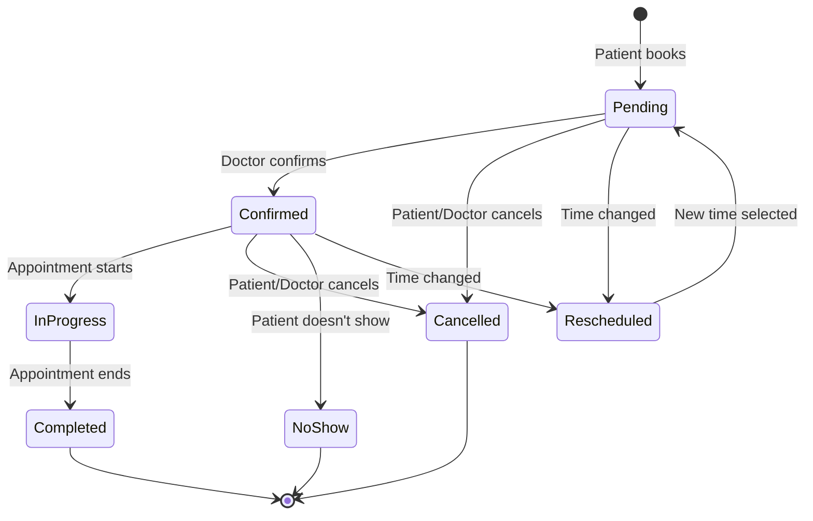
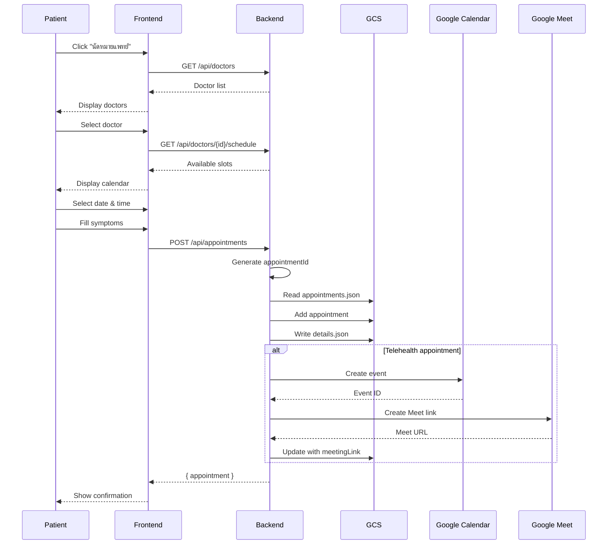
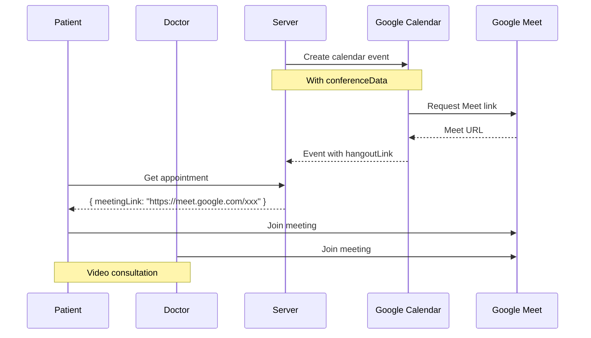

# 9. Appointment System

## 9.1 Overview

ระบบนัดหมายแพทย์ที่รองรับทั้งการนัดพบแพทย์แบบ In-person และ Telehealth ผ่าน Google Meet พร้อมการเชื่อมต่อกับ Google Calendar

---

## 9.2 Appointment Types

| Type | Thai Name | Description | Features |
|------|-----------|-------------|----------|
| `telehealth` | การปรึกษาออนไลน์ | วิดีโอคอลกับแพทย์ | Google Meet link |
| `in_person` | พบแพทย์ที่โรงพยาบาล | นัดพบแพทย์ | Location info |
| `emergency` | ฉุกเฉิน | กรณีเร่งด่วน | Priority queue |
| `consultation` | ปรึกษาทั่วไป | ปรึกษาปัญหาสุขภาพ | - |
| `follow_up` | นัดติดตามผล | ติดตามผลการรักษา | Previous visit reference |

---

## 9.3 Appointment Status Flow



---

## 9.4 Booking Workflow

### 9.4.1 Patient Booking Flow



### 9.4.2 Symptom Input Form

```
┌─────────────────────────────────────────────────────────────────┐
│                     SYMPTOM INPUT FORM                           │
├─────────────────────────────────────────────────────────────────┤
│                                                                  │
│  อาการหลัก *                                                     │
│  ┌─────────────────────────────────────────────────────────────┐│
│  │ ปวดหัว                                                      ││
│  └─────────────────────────────────────────────────────────────┘│
│                                                                  │
│  รายละเอียดอาการ *                                               │
│  ┌─────────────────────────────────────────────────────────────┐│
│  │ ปวดหัวตุ๊บๆ บริเวณขมับทั้งสองข้าง                            ││
│  │ เริ่มมีอาการตั้งแต่เมื่อวาน                                   ││
│  └─────────────────────────────────────────────────────────────┘│
│                                                                  │
│  ระยะเวลาที่มีอาการ *        ความรุนแรง (1-10) *                  │
│  ┌─────────────────┐        ┌─────────────────┐                 │
│  │ 2 วัน           │        │ 6               │                 │
│  └─────────────────┘        └─────────────────┘                 │
│                                                                  │
│  ตำแหน่งที่มีอาการ                                                │
│  [x] ศีรษะ  [ ] หน้าอก  [ ] ท้อง  [ ] แขน/ขา                    │
│                                                                  │
│  มีไข้หรือไม่?                                                    │
│  ( ) ไม่มี  (•) มี ___°C                                         │
│                                                                  │
│  ยาที่กำลังใช้อยู่                                                 │
│  ┌─────────────────────────────────────────────────────────────┐│
│  │ Paracetamol 500mg                                           ││
│  └─────────────────────────────────────────────────────────────┘│
│                                                                  │
└─────────────────────────────────────────────────────────────────┘
```

---

## 9.5 Data Structure

### 9.5.1 Appointment Object

```json
{
  "id": "apt_1733556000000_abc123",
  "patientId": "patient_xxx",
  "patientName": "สมชาย ใจดี",
  "patientEmail": "somchai@example.com",
  "doctorId": "doctor_001",
  "doctorName": "นพ. สมศักดิ์ รักษาดี",
  "doctorSpecialty": "อายุรกรรมทั่วไป",
  "doctorAvatar": "https://...",
  "doctorEmail": "dr.somsak@hospital.com",
  "hospitalId": "hospital_001",
  "hospitalName": "โรงพยาบาลกรุงเทพ",
  "date": "2025-12-10",
  "appointmentDate": "2025-12-10T00:00:00.000Z",
  "appointmentTime": "10:00",
  "type": "telehealth",
  "status": "confirmed",
  "reason": "ปวดหัวต่อเนื่อง 2 วัน",
  "symptoms": {
    "mainSymptom": "ปวดหัว",
    "description": "ปวดหัวตุ๊บๆ บริเวณขมับทั้งสองข้าง",
    "duration": "2 วัน",
    "severity": 6,
    "bodyParts": ["head"],
    "fever": "37.8",
    "currentMedications": "Paracetamol 500mg"
  },
  "meetingLink": "https://meet.google.com/xxx-yyy-zzz",
  "calendarEventId": "event_xxx",
  "aiAnalysis": "Based on symptoms, possible tension headache...",
  "createdAt": "2025-12-07T08:00:00.000Z",
  "updatedAt": "2025-12-07T08:00:00.000Z"
}
```

### 9.5.2 Appointment Result

```json
{
  "result": {
    "diagnosis": "Tension headache with mild fever",
    "prescriptions": [
      {
        "id": "rx_xxx",
        "medications": [
          {
            "name": "Ibuprofen",
            "dosage": "400mg",
            "frequency": "3 times daily",
            "duration": "5 days"
          }
        ]
      }
    ],
    "labOrders": [
      {
        "id": "lab_xxx",
        "testName": "Complete Blood Count",
        "priority": "routine"
      }
    ],
    "followUpDate": "2025-12-17",
    "notes": "Rest and stay hydrated. Return if fever persists."
  }
}
```

---

## 9.6 GCS Storage Structure

```
izara-appointments/
├── appointments.json           # List of all appointments
└── appointments/
    └── {appointmentId}/
        ├── details.json        # Full appointment data
        ├── recordings/         # Session recordings (if any)
        └── documents/          # Related documents
```

---

## 9.7 Appointment List UI

### 9.7.1 Upcoming Appointments

```
┌─────────────────────────────────────────────────────────────────┐
│                    UPCOMING APPOINTMENTS                         │
├─────────────────────────────────────────────────────────────────┤
│                                                                  │
│  ┌─────────────────────────────────────────────────────────────┐│
│  │ 🎥 วันที่ 10 ธ.ค. 2568 • 10:00 น.                          ││
│  │                                                              ││
│  │ 👨‍⚕️ นพ. สมศักดิ์ รักษาดี                                   ││
│  │    อายุรกรรมทั่วไป • โรงพยาบาลกรุงเทพ                        ││
│  │                                                              ││
│  │ 📋 ปวดหัวต่อเนื่อง 2 วัน                                    ││
│  │                                                              ││
│  │ Status: ✅ ยืนยันแล้ว                                       ││
│  │                                                              ││
│  │ [เข้าร่วมการประชุม] [ดูรายละเอียด] [ยกเลิก]                 ││
│  └─────────────────────────────────────────────────────────────┘│
│                                                                  │
│  ┌─────────────────────────────────────────────────────────────┐│
│  │ 🏥 วันที่ 15 ธ.ค. 2568 • 14:30 น.                          ││
│  │                                                              ││
│  │ 👨‍⚕️ พญ. สมหญิง ดูแลดี                                      ││
│  │    ผิวหนัง • คลินิกผิวหนัง                                   ││
│  │                                                              ││
│  │ 📋 ตรวจติดตามผลผื่นแพ้                                      ││
│  │                                                              ││
│  │ Status: ⏳ รอยืนยัน                                         ││
│  │                                                              ││
│  │ [ดูรายละเอียด] [ยกเลิก]                                    ││
│  └─────────────────────────────────────────────────────────────┘│
│                                                                  │
└─────────────────────────────────────────────────────────────────┘
```

### 9.7.2 Treatment Results (with Filters)

```
┌─────────────────────────────────────────────────────────────────┐
│                    TREATMENT RESULTS (ผลการรักษา)                │
├─────────────────────────────────────────────────────────────────┤
│                                                                  │
│  Filter:                                                         │
│  [5 รายการล่าสุด] [6 เดือน] [1 ปี] [ทั้งหมด]                    │
│                                                                  │
│  Summary:                                                        │
│  ┌────────┐ ┌────────┐ ┌────────┐ ┌────────┐                   │
│  │   5    │ │   12   │ │   18   │ │   25   │                   │
│  │ล่าสุด  │ │ 6เดือน │ │  1ปี  │ │ทั้งหมด │                   │
│  └────────┘ └────────┘ └────────┘ └────────┘                   │
│                                                                  │
│  ธันวาคม 2568                                                    │
│  ┌─────────────────────────────────────────────────────────────┐│
│  │ ✅ 5 ธ.ค. 2568                                              ││
│  │    นพ. สมศักดิ์ • อายุรกรรม                                  ││
│  │    วินิจฉัย: Tension headache                               ││
│  │    💊 Ibuprofen 400mg                                       ││
│  │    🔬 CBC ordered                                           ││
│  └─────────────────────────────────────────────────────────────┘│
│                                                                  │
│  พฤศจิกายน 2568                                                  │
│  ┌─────────────────────────────────────────────────────────────┐│
│  │ ✅ 20 พ.ย. 2568                                             ││
│  │    พญ. สมหญิง • ผิวหนัง                                      ││
│  │    วินิจฉัย: Contact dermatitis                             ││
│  │    💊 Topical steroid                                       ││
│  └─────────────────────────────────────────────────────────────┘│
│                                                                  │
└─────────────────────────────────────────────────────────────────┘
```

---

## 9.8 Telehealth Integration

### 9.8.1 Google Meet Integration Flow



### 9.8.2 Meeting Link Generation

```typescript
// Request body for creating Meet link
const meetRequest = {
  appointmentId: "apt_xxx",
  patientId: "patient_xxx",
  doctorId: "doctor_xxx",
  startDateTime: "2025-12-10T10:00:00+07:00",
  endDateTime: "2025-12-10T11:00:00+07:00",
  patientName: "สมชาย ใจดี",
  doctorName: "นพ. สมศักดิ์ รักษาดี"
};

// Google Calendar event with Meet
const calendarEvent = {
  summary: "นัดพบแพทย์ - สมชาย ใจดี",
  description: "Telehealth appointment",
  start: { dateTime: "2025-12-10T10:00:00+07:00", timeZone: "Asia/Bangkok" },
  end: { dateTime: "2025-12-10T11:00:00+07:00", timeZone: "Asia/Bangkok" },
  attendees: [
    { email: "patient@example.com" },
    { email: "doctor@hospital.com" }
  ],
  conferenceData: {
    createRequest: {
      requestId: "apt_xxx",
      conferenceSolutionKey: { type: "hangoutsMeet" }
    }
  }
};
```

---

## 9.9 API Endpoints

| Method | Endpoint | Description |
|--------|----------|-------------|
| GET | `/api/appointments/patient/:patientId` | Get patient's appointments |
| GET | `/api/appointments/:id` | Get appointment details |
| POST | `/api/appointments` | Create appointment |
| PUT | `/api/appointments/:id` | Update appointment |
| DELETE | `/api/appointments/:id` | Cancel appointment |
| GET | `/api/doctors` | Get all doctors |
| GET | `/api/doctors/:id` | Get doctor details |
| GET | `/api/doctors/:id/schedule` | Get doctor availability |
| POST | `/api/google/meet/create` | Create Meet link |
| POST | `/api/google/calendar/event` | Create calendar event |

---

## 9.10 Appointment Notifications

### 9.10.1 Notification Types

| Trigger | Recipient | Message |
|---------|-----------|---------|
| Booking confirmed | Patient | "นัดหมายของคุณได้รับการยืนยันแล้ว" |
| 1 day before | Patient | "เตือนความจำ: นัดพบแพทย์พรุ่งนี้" |
| 1 hour before | Patient | "นัดหมายของคุณจะเริ่มใน 1 ชั่วโมง" |
| Results available | Patient | "ผลการตรวจพร้อมให้ดูแล้ว" |
| Appointment cancelled | Patient/Doctor | "นัดหมายถูกยกเลิก" |

---

[← Previous: PDPA Consent](./08-pdpa-consent.md) | [Next: Health Records →](./10-phr.md)
