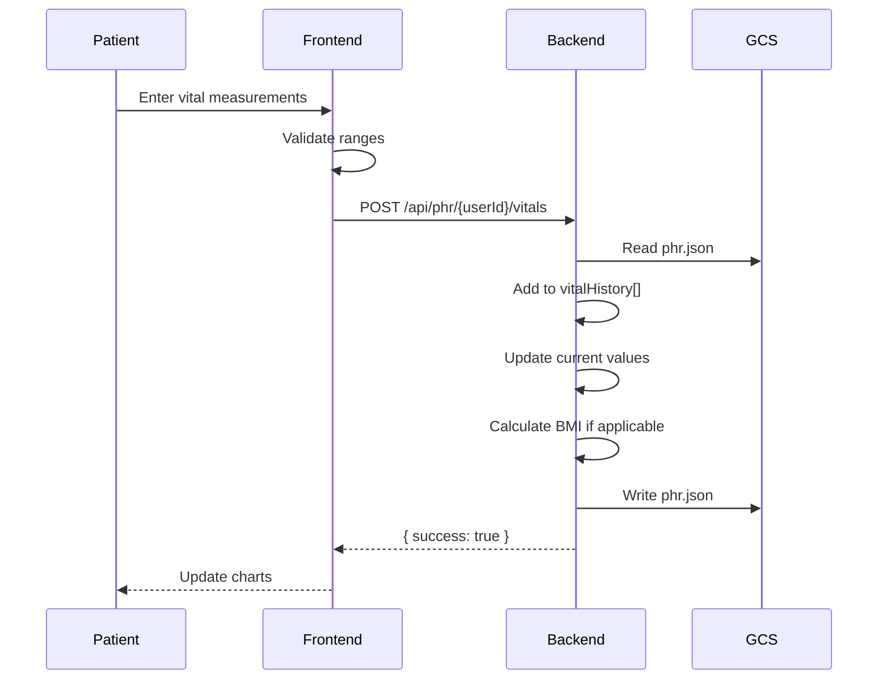
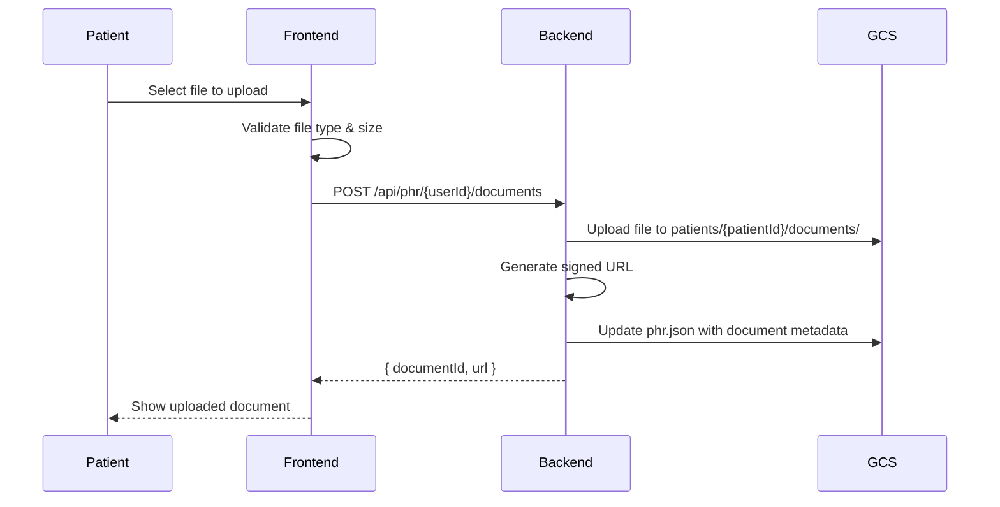

# 10. Personal Health Records (PHR)

## 10.1 Overview

Personal Health Records (PHR) หรือข้อมูลสุขภาพส่วนบุคคล เป็นระบบจัดเก็บข้อมูลสุขภาพของผู้ป่วยแบบครบวงจร รวมถึงข้อมูลส่วนบุคคล ประวัติการรักษา ค่า Vital Signs ยาที่ใช้ และเอกสารทางการแพทย์

---

## 10.2 PHR Components

```
┌─────────────────────────────────────────────────────────────────┐
│                    PHR COMPONENTS                                │
├─────────────────────────────────────────────────────────────────┤
│                                                                  │
│  ┌──────────────┐  ┌──────────────┐  ┌──────────────┐          │
│  │ Demographics │  │   Physical   │  │   Medical    │          │
│  │     Info     │  │    Info      │  │    Info      │          │
│  ├──────────────┤  ├──────────────┤  ├──────────────┤          │
│  │ • Name       │  │ • Height     │  │ • Allergies  │          │
│  │ • DOB        │  │ • Weight     │  │ • Chronic    │          │
│  │ • Gender     │  │ • BMI        │  │   conditions │          │
│  │ • Phone      │  │ • Blood Type │  │ • Medications│          │
│  │ • Email      │  │              │  │              │          │
│  └──────────────┘  └──────────────┘  └──────────────┘          │
│                                                                  │
│  ┌──────────────┐  ┌──────────────┐  ┌──────────────┐          │
│  │ Vital Signs  │  │   Lifestyle  │  │  Emergency   │          │
│  │   History    │  │    Data      │  │   Contact    │          │
│  ├──────────────┤  ├──────────────┤  ├──────────────┤          │
│  │ • BP         │  │ • Smoking    │  │ • Name       │          │
│  │ • Heart Rate │  │ • Alcohol    │  │ • Phone      │          │
│  │ • Temperature│  │ • Exercise   │  │ • Relation   │          │
│  │ • SpO2       │  │ • Diet       │  │              │          │
│  │ • Glucose    │  │ • Sleep      │  │              │          │
│  └──────────────┘  └──────────────┘  └──────────────┘          │
│                                                                  │
│  ┌──────────────┐  ┌──────────────┐  ┌──────────────┐          │
│  │ Lab Results  │  │ Immunizations│  │  Documents   │          │
│  ├──────────────┤  ├──────────────┤  ├──────────────┤          │
│  │ • CBC        │  │ • COVID-19   │  │ • Reports    │          │
│  │ • Lipid      │  │ • Influenza  │  │ • X-rays     │          │
│  │ • Glucose    │  │ • Hepatitis  │  │ • Prescripts │          │
│  │ • Kidney     │  │ • etc.       │  │ • etc.       │          │
│  └──────────────┘  └──────────────┘  └──────────────┘          │
│                                                                  │
└─────────────────────────────────────────────────────────────────┘
```

---

## 10.3 PHR Data Structure

### 10.3.1 Complete PHR Object

```json
{
  "patientId": "patient_xxx",
  "userId": "user_xxx",
  
  "personalInfo": {
    "name": "สมชาย ใจดี",
    "dateOfBirth": "1990-01-15",
    "gender": "male",
    "phone": "0812345678",
    "email": "somchai@example.com",
    "nationalId": "1234567890123",
    "address": "123 ถ.สุขุมวิท แขวงคลองเตย เขตคลองเตย กทม. 10110"
  },
  
  "physicalInfo": {
    "height": 175,
    "weight": 70,
    "bloodType": "O+",
    "bmi": 22.9
  },
  
  "medicalInfo": {
    "allergies": ["Penicillin", "Seafood"],
    "chronicConditions": ["Hypertension", "Type 2 Diabetes"],
    "currentMedications": ["Metformin 500mg", "Losartan 50mg"],
    "bloodPressure": { "systolic": 130, "diastolic": 85 },
    "heartRate": 72,
    "bloodSugar": 110
  },
  
  "emergencyContact": {
    "name": "สมศรี ใจดี",
    "phone": "0823456789",
    "relation": "ภรรยา"
  },
  
  "lifestyle": {
    "smokingStatus": "never",
    "alcoholConsumption": "occasional",
    "exerciseFrequency": "moderate",
    "dietType": "omnivore",
    "sleepHours": 7,
    "stressLevel": "moderate"
  },
  
  "vitalHistory": [
    {
      "measuredAt": "2025-12-07T10:00:00.000Z",
      "bloodPressure": { "systolic": 130, "diastolic": 85, "unit": "mmHg" },
      "heartRate": { "value": 72, "unit": "bpm" },
      "temperature": { "value": 36.5, "unit": "celsius" },
      "oxygenSaturation": { "value": 98, "unit": "%" },
      "weight": { "value": 70, "unit": "kg" },
      "bloodGlucose": { "value": 110, "unit": "mg/dL", "testType": "fasting" }
    }
  ],
  
  "labResults": [
    {
      "id": "lab_xxx",
      "testName": "Complete Blood Count",
      "date": "2025-12-01T00:00:00.000Z",
      "results": [
        { "name": "WBC", "value": 7500, "unit": "/μL", "status": "normal" },
        { "name": "RBC", "value": 4.8, "unit": "M/μL", "status": "normal" },
        { "name": "Hemoglobin", "value": 14.5, "unit": "g/dL", "status": "normal" }
      ]
    }
  ],
  
  "immunizations": [
    {
      "id": "vax_xxx",
      "name": "COVID-19 (Pfizer)",
      "date": "2024-01-15",
      "doseNumber": 4,
      "manufacturer": "Pfizer-BioNTech",
      "lotNumber": "FF1234",
      "administeredBy": "Bangkok Hospital"
    }
  ],
  
  "createdAt": "2025-01-01T00:00:00.000Z",
  "updatedAt": "2025-12-07T10:00:00.000Z"
}
```

---

## 10.4 Vital Signs Management

### 10.4.1 Vital Signs Types

| Vital Sign | Thai Name | Unit | Normal Range |
|------------|-----------|------|--------------|
| Blood Pressure | ความดันโลหิต | mmHg | 120/80 |
| Heart Rate | อัตราการเต้นของหัวใจ | bpm | 60-100 |
| Temperature | อุณหภูมิร่างกาย | °C | 36.1-37.2 |
| Respiratory Rate | อัตราการหายใจ | breaths/min | 12-20 |
| Oxygen Saturation | ออกซิเจนในเลือด | % | 95-100 |
| Blood Glucose | น้ำตาลในเลือด | mg/dL | 70-100 (fasting) |
| Weight | น้ำหนัก | kg | Varies |
| BMI | ดัชนีมวลกาย | kg/m² | 18.5-24.9 |

### 10.4.2 Vital Signs Recording Flow



### 10.4.3 Vitals Chart Component

```
┌─────────────────────────────────────────────────────────────────┐
│                     VITALS CHART                                 │
├─────────────────────────────────────────────────────────────────┤
│                                                                  │
│  Period: [7 วัน] [30 วัน] [90 วัน] [1 ปี]                       │
│                                                                  │
│  Blood Pressure                                                  │
│  ┌─────────────────────────────────────────────────────────────┐│
│  │     140 ─┼─────────────────────────────────────────────────││
│  │     130 ─┼──●──────●─────────●──────────────────────────────││
│  │     120 ─┼─────●──────●──●──────●──●──●──────────────────────││
│  │      85 ─┼──●──●──●──●──●──●──●──●──●──●──────────────────────││
│  │      80 ─┼─────────────────────────────────────────────────││
│  │          └──1──2──3──4──5──6──7──────────────────────────────││
│  │            Dec                                               ││
│  └─────────────────────────────────────────────────────────────┘│
│                                                                  │
│  ● Systolic   ● Diastolic                                       │
│                                                                  │
│  Latest: 130/85 mmHg   Average: 125/82 mmHg                     │
│                                                                  │
└─────────────────────────────────────────────────────────────────┘
```

---

## 10.5 PHR Page UI

```
┌─────────────────────────────────────────────────────────────────┐
│                        PHR PAGE                                  │
├─────────────────────────────────────────────────────────────────┤
│                                                                  │
│  Tabs: [ข้อมูลส่วนตัว] [ค่าสุขภาพ] [ประวัติการรักษา] [เอกสาร]    │
│                                                                  │
│  ════════════════════════════════════════════════════════════   │
│                                                                  │
│  ┌─────────────────────────────────────────────────────────────┐│
│  │                    PERSONAL INFO                             ││
│  │  ┌─────────────────────────────────────────────────────────┐││
│  │  │ 👤 สมชาย ใจดี                                          │││
│  │  │    เพศ: ชาย  อายุ: 34 ปี  หมู่เลือด: O+                │││
│  │  │    📞 081-234-5678   ✉️ somchai@example.com           │││
│  │  └─────────────────────────────────────────────────────────┘││
│  └─────────────────────────────────────────────────────────────┘│
│                                                                  │
│  ┌─────────────────────────────────────────────────────────────┐│
│  │                    PHYSICAL INFO                             ││
│  │  ┌───────────┐ ┌───────────┐ ┌───────────┐ ┌───────────┐   ││
│  │  │ ส่วนสูง   │ │ น้ำหนัก   │ │   BMI    │ │ หมู่เลือด │   ││
│  │  │   175    │ │    70     │ │   22.9   │ │    O+     │   ││
│  │  │   cm     │ │    kg     │ │  ปกติ    │ │           │   ││
│  │  └───────────┘ └───────────┘ └───────────┘ └───────────┘   ││
│  └─────────────────────────────────────────────────────────────┘│
│                                                                  │
│  ┌─────────────────────────────────────────────────────────────┐│
│  │                    MEDICAL INFO                              ││
│  │                                                              ││
│  │  🚨 การแพ้:  Penicillin, Seafood                           ││
│  │                                                              ││
│  │  🏥 โรคประจำตัว:  Hypertension, Type 2 Diabetes            ││
│  │                                                              ││
│  │  💊 ยาที่ใช้:  Metformin 500mg, Losartan 50mg              ││
│  └─────────────────────────────────────────────────────────────┘│
│                                                                  │
│  ┌─────────────────────────────────────────────────────────────┐│
│  │                    EMERGENCY CONTACT                         ││
│  │  👥 สมศรี ใจดี (ภรรยา)                                      ││
│  │  📞 082-345-6789                                            ││
│  └─────────────────────────────────────────────────────────────┘│
│                                                                  │
└─────────────────────────────────────────────────────────────────┘
```

---

## 10.6 Lab Results Management

### 10.6.1 Lab Result Structure

```json
{
  "id": "lab_xxx",
  "orderId": "order_xxx",
  "testName": "Lipid Profile",
  "category": "chemistry",
  "collectedAt": "2025-12-01T08:00:00.000Z",
  "reportedAt": "2025-12-01T14:00:00.000Z",
  "laboratory": "Bangkok Lab",
  "results": [
    {
      "name": "Total Cholesterol",
      "value": 195,
      "unit": "mg/dL",
      "normalRange": "< 200",
      "status": "normal"
    },
    {
      "name": "LDL Cholesterol",
      "value": 130,
      "unit": "mg/dL",
      "normalRange": "< 100",
      "status": "high"
    },
    {
      "name": "HDL Cholesterol",
      "value": 55,
      "unit": "mg/dL",
      "normalRange": "> 40",
      "status": "normal"
    },
    {
      "name": "Triglycerides",
      "value": 145,
      "unit": "mg/dL",
      "normalRange": "< 150",
      "status": "normal"
    }
  ],
  "notes": "LDL slightly elevated. Consider lifestyle modifications."
}
```

### 10.6.2 Lab Results Display

```
┌─────────────────────────────────────────────────────────────────┐
│                    LAB RESULTS                                   │
├─────────────────────────────────────────────────────────────────┤
│                                                                  │
│  📋 Lipid Profile                        1 ธ.ค. 2568             │
│                                                                  │
│  ┌──────────────────┬──────────┬──────────┬─────────┐          │
│  │ Test             │ Result   │ Range    │ Status  │          │
│  ├──────────────────┼──────────┼──────────┼─────────┤          │
│  │ Total Cholesterol│ 195      │ < 200    │ 🟢      │          │
│  │ LDL Cholesterol  │ 130      │ < 100    │ 🔴      │          │
│  │ HDL Cholesterol  │ 55       │ > 40     │ 🟢      │          │
│  │ Triglycerides    │ 145      │ < 150    │ 🟢      │          │
│  └──────────────────┴──────────┴──────────┴─────────┘          │
│                                                                  │
│  📝 หมายเหตุ: LDL สูงเล็กน้อย ควรปรับพฤติกรรมการกิน            │
│                                                                  │
└─────────────────────────────────────────────────────────────────┘
```

---

## 10.7 Immunization Records

### 10.7.1 Immunization Structure

```json
{
  "id": "vax_xxx",
  "name": "COVID-19",
  "vaccineName": "Pfizer-BioNTech BNT162b2",
  "date": "2024-01-15",
  "doseNumber": 4,
  "totalDoses": 4,
  "manufacturer": "Pfizer-BioNTech",
  "lotNumber": "FF1234",
  "site": "Left deltoid",
  "route": "Intramuscular",
  "administeredBy": "Bangkok Hospital",
  "administeredByName": "พยาบาล สมหญิง",
  "nextDueDate": null,
  "sideEffects": ["Mild arm pain", "Fatigue"],
  "notes": "Booster dose completed"
}
```

---

## 10.8 Medical Documents

### 10.8.1 Document Types

| Type | Thai Name | Extensions |
|------|-----------|------------|
| `lab_result` | ผลแล็บ | PDF, JPG |
| `imaging` | ผลภาพถ่าย (X-ray, CT, MRI) | DICOM, JPG, PDF |
| `prescription` | ใบสั่งยา | PDF, JPG |
| `report` | รายงานแพทย์ | PDF |
| `referral` | ใบส่งตัว | PDF |
| `certificate` | ใบรับรองแพทย์ | PDF |
| `other` | อื่นๆ | * |

### 10.8.2 Document Upload Flow



---

## 10.9 Health Studio Integration

### 10.9.1 Dashboard Components

```
┌─────────────────────────────────────────────────────────────────┐
│                    HEALTH STUDIO (Dashboard)                     │
├─────────────────────────────────────────────────────────────────┤
│                                                                  │
│  ┌─────────────────────────────────────────────────────────────┐│
│  │                 LATEST VITALS                                ││
│  │  ┌───────────┐ ┌───────────┐ ┌───────────┐ ┌───────────┐   ││
│  │  │  💓 BP    │ │   ❤️ HR   │ │  🌡️ Temp │ │   🫁 SpO2 │   ││
│  │  │ 130/85   │ │    72     │ │   36.5   │ │    98%    │   ││
│  │  │  mmHg    │ │   bpm     │ │    °C    │ │           │   ││
│  │  └───────────┘ └───────────┘ └───────────┘ └───────────┘   ││
│  └─────────────────────────────────────────────────────────────┘│
│                                                                  │
│  ┌─────────────────────────┐ ┌─────────────────────────────────┐│
│  │    VITALS CHART         │ │    TREATMENT RESULTS            ││
│  │    [Last 7 days]        │ │    [5 รายการล่าสุด ▼]           ││
│  │    ┌─────────────────┐  │ │                                 ││
│  │    │ ~~~~/\~~~~      │  │ │    ✅ 5 ธ.ค. - Headache        ││
│  │    │      \/         │  │ │    ✅ 20 พ.ย. - Dermatitis     ││
│  │    └─────────────────┘  │ │    ✅ 1 พ.ย. - Annual checkup  ││
│  └─────────────────────────┘ └─────────────────────────────────┘│
│                                                                  │
│  ┌─────────────────────────────────────────────────────────────┐│
│  │                    MEDICAL CONTENT                           ││
│  │  📰 แนะนำ: 5 วิธีลดความดันโลหิตด้วยตัวเอง                    ││
│  │  📰 โรคเบาหวานและการดูแลตัวเอง                               ││
│  └─────────────────────────────────────────────────────────────┘│
│                                                                  │
└─────────────────────────────────────────────────────────────────┘
```

---

## 10.10 API Endpoints

| Method | Endpoint | Description |
|--------|----------|-------------|
| GET | `/api/phr/:userId` | Get full PHR |
| PUT | `/api/phr/:userId` | Update PHR |
| GET | `/api/phr/:userId/vitals` | Get vital signs history |
| POST | `/api/phr/:userId/vitals` | Add vital signs |
| GET | `/api/phr/:userId/timeline` | Get medical timeline |
| POST | `/api/phr/:userId/documents` | Upload document |
| GET | `/api/phr/:userId/documents` | List documents |
| DELETE | `/api/phr/:userId/documents/:id` | Delete document |

---

## 10.11 Data Privacy

### 10.11.1 PHR Access Control

| Access Type | Who Can Access | Conditions |
|-------------|----------------|------------|
| Full Access | Patient | Always |
| Limited Access | Doctor | With PDPA consent |
| Read-only | Emergency Contact | Emergency only |
| Audit Access | System | Logged |

### 10.11.2 Data Encryption

- **At Rest:** GCS server-side encryption
- **In Transit:** HTTPS/TLS
- **Sensitive Fields:** Base64 encoding (recommend AES for production)

---

[← Previous: Appointments](./09-appointments.md) | [Next: AI Assistant →](./11-ai-assistant.md)
