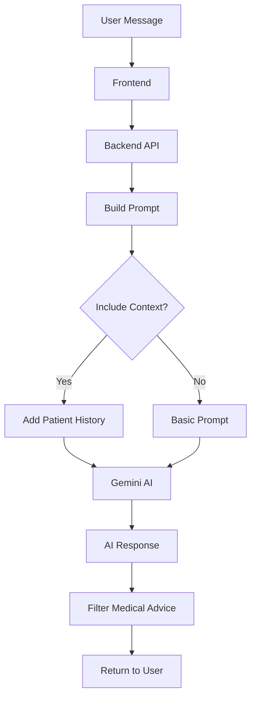
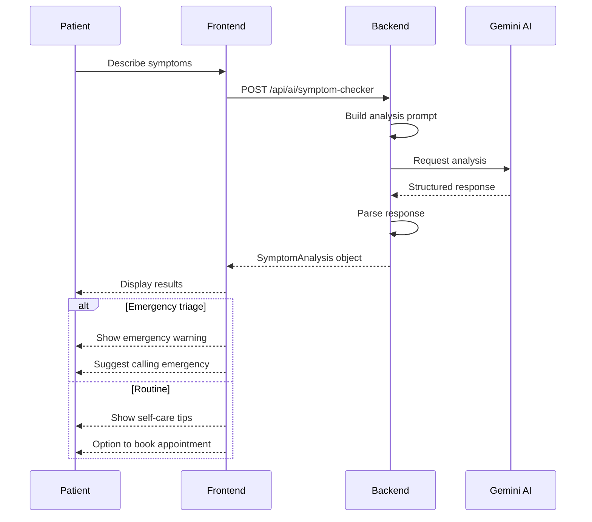

# 11. AI Health Assistant

## 11.1 Overview

AI Health Assistant ใช้ Gemini AI เพื่อให้คำปรึกษาสุขภาพเบื้องต้นแก่ผู้ป่วย สามารถช่วยวิเคราะห์อาการ ให้คำแนะนำการดูแลตัวเอง และแนะนำให้พบแพทย์เมื่อจำเป็น

---

## 11.2 Features

| Feature | Description | Status |
|---------|-------------|--------|
| **Health Chat** | แชทสนทนาเรื่องสุขภาพทั่วไป | ✅ Active |
| **Symptom Analysis** | วิเคราะห์อาการเบื้องต้น | ✅ Active |
| **Triage Assessment** | ประเมินความเร่งด่วน | ✅ Active |
| **Self-care Tips** | แนะนำการดูแลตัวเอง | ✅ Active |
| **Doctor Referral** | แนะนำพบแพทย์ | ✅ Active |
| **Context Awareness** | รับรู้ข้อมูลสุขภาพผู้ป่วย | ✅ Active |

---

## 11.3 AI Chat Architecture



---

## 11.4 AI Chat Component

### 11.4.1 Full Page AI Doctor

```
┌─────────────────────────────────────────────────────────────────┐
│                    AI HEALTH ASSISTANT                           │
├─────────────────────────────────────────────────────────────────┤
│                                                                  │
│  ┌─────────────────────────────────────────────────────────────┐│
│  │ 🤖 สวัสดีครับ! ผมเป็น AI ผู้ช่วยด้านสุขภาพ                  ││
│  │    มีอะไรให้ช่วยไหมครับ?                                     ││
│  └─────────────────────────────────────────────────────────────┘│
│                                                                  │
│  ┌─────────────────────────────────────────────────────────────┐│
│  │ 👤 ผมมีอาการปวดหัวมา 2 วันแล้ว                              ││
│  └─────────────────────────────────────────────────────────────┘│
│                                                                  │
│  ┌─────────────────────────────────────────────────────────────┐│
│  │ 🤖 เข้าใจครับ อาการปวดหัว 2 วันอาจเกิดจากหลายสาเหตุ        ││
│  │    ขอถามเพิ่มเติมนะครับ:                                     ││
│  │                                                              ││
│  │    1. ปวดบริเวณไหนของศีรษะครับ?                             ││
│  │    2. ลักษณะการปวดเป็นอย่างไร (ตุ๊บๆ/ตึงๆ/แปลบๆ)?          ││
│  │    3. มีอาการอื่นร่วมด้วยไหม เช่น คลื่นไส้ มองเห็นแสง?      ││
│  │    4. มีไข้ร่วมด้วยหรือไม่?                                  ││
│  │                                                              ││
│  │    ⚠️ หากอาการรุนแรงมาก ควรพบแพทย์ทันที                     ││
│  └─────────────────────────────────────────────────────────────┘│
│                                                                  │
│  Quick Suggestions:                                              │
│  [ปวดหัวไมเกรน] [ปวดหัวจากเครียด] [ปวดศีรษะฉับพลัน]            │
│                                                                  │
│  ┌─────────────────────────────────────────────────────────────┐│
│  │ พิมพ์ข้อความ...                                 [📎] [🎤] [➡️]││
│  └─────────────────────────────────────────────────────────────┘│
│                                                                  │
└─────────────────────────────────────────────────────────────────┘
```

### 11.4.2 Compact Dashboard Widget (AIHealthChat)

```
┌─────────────────────────────────────────────────────────────────┐
│  ┌─────────────────────────────────────────────────────────────┐│
│  │ 🤖 AI ผู้ช่วยสุขภาพ                                [−] [×] ││
│  └─────────────────────────────────────────────────────────────┘│
│  ┌─────────────────────────────────────────────────────────────┐│
│  │                                                              ││
│  │ 🤖 สวัสดีครับ! มีอะไรให้ช่วยไหมครับ?                        ││
│  │                                                              ││
│  │ 👤 ปวดหัวเล็กน้อย                                           ││
│  │                                                              ││
│  │ 🤖 แนะนำให้พักผ่อน ดื่มน้ำ...                               ││
│  │                                                              ││
│  └─────────────────────────────────────────────────────────────┘│
│  ┌─────────────────────────────────────────────────────────────┐│
│  │ [ปวดหัว] [เป็นหวัด] [ปวดท้อง]                              ││
│  └─────────────────────────────────────────────────────────────┘│
│  ┌─────────────────────────────────────────────────────────────┐│
│  │ พิมพ์คำถาม...                                      [➡️]     ││
│  └─────────────────────────────────────────────────────────────┘│
└─────────────────────────────────────────────────────────────────┘
```

---

## 11.5 Prompt Engineering

### 11.5.1 System Prompt

```
คุณคือผู้ช่วย AI ด้านสุขภาพสำหรับแอปพลิเคชัน Isara Patient Portal

บทบาทของคุณ:
- ให้คำแนะนำด้านสุขภาพทั่วไป
- ช่วยวิเคราะห์อาการเบื้องต้น
- แนะนำการดูแลตัวเองที่บ้าน
- แนะนำให้พบแพทย์เมื่อจำเป็น

ข้อจำกัดสำคัญ:
- ห้ามวินิจฉัยโรค
- ห้ามสั่งยา
- ห้ามให้คำแนะนำทางการแพทย์เฉพาะทาง
- แนะนำให้พบแพทย์หากอาการรุนแรงหรือไม่แน่ใจ

รูปแบบการตอบ:
- ใช้ภาษาไทยที่เข้าใจง่าย
- เป็นมิตรและห่วงใย
- ให้ข้อมูลที่เป็นประโยชน์
- ถามคำถามเพิ่มเติมเมื่อต้องการข้อมูลเพิ่ม
```

### 11.5.2 Context-aware Prompt

```typescript
const buildPrompt = (message: string, patientContext?: any) => {
  let prompt = systemPrompt;
  
  if (patientContext) {
    prompt += `
    
ข้อมูลผู้ป่วย:
- อายุ: ${patientContext.age} ปี
- เพศ: ${patientContext.gender}
- โรคประจำตัว: ${patientContext.chronicConditions?.join(', ') || 'ไม่มี'}
- ยาที่ใช้ประจำ: ${patientContext.currentMedications?.join(', ') || 'ไม่มี'}
- ประวัติแพ้ยา: ${patientContext.allergies?.join(', ') || 'ไม่มี'}
`;
  }
  
  prompt += `

ข้อความจากผู้ป่วย: ${message}
`;
  
  return prompt;
};
```

---

## 11.6 Symptom Checker

### 11.6.1 Symptom Analysis Flow



### 11.6.2 Triage Levels

| Level | Thai Name | Action | Color |
|-------|-----------|--------|-------|
| `emergency` | ฉุกเฉิน | โทร 1669 ทันที | 🔴 Red |
| `urgent` | เร่งด่วน | พบแพทย์ภายใน 24 ชม. | 🟠 Orange |
| `routine` | ปกติ | นัดพบแพทย์ได้ | 🟡 Yellow |
| `self_care` | ดูแลเองได้ | ดูแลตัวเองที่บ้าน | 🟢 Green |

### 11.6.3 Symptom Analysis Response

```json
{
  "symptoms": ["headache", "fever", "fatigue"],
  "additionalInfo": "Started 2 days ago, severity 6/10",
  "triage": "routine",
  "summary": "อาการปวดหัวร่วมกับไข้อาจเป็นสัญญาณของการติดเชื้อไวรัส เช่น ไข้หวัดใหญ่",
  "recommendations": [
    "พักผ่อนให้เพียงพอ",
    "ดื่มน้ำมากๆ",
    "รับประทานยาพาราเซตามอลแก้ปวดลดไข้",
    "ติดตามอาการ หากไข้สูงเกิน 39°C หรืออาการไม่ดีขึ้นใน 3 วัน ควรพบแพทย์"
  ],
  "suggestedActions": [
    "Monitor temperature",
    "Rest at home",
    "Schedule appointment if not improving"
  ],
  "warningSign": false,
  "possibleConditions": [
    "Common cold",
    "Influenza",
    "Viral infection"
  ],
  "confidenceScore": 0.75
}
```

---

## 11.7 Warning Signs Detection

### 11.7.1 Emergency Symptoms

| Symptom | Thai | Action |
|---------|------|--------|
| Chest pain | เจ็บหน้าอก | 🚨 Emergency |
| Difficulty breathing | หายใจลำบาก | 🚨 Emergency |
| Severe headache (sudden) | ปวดหัวรุนแรงฉับพลัน | 🚨 Emergency |
| Weakness on one side | อ่อนแรงซีกเดียว | 🚨 Emergency |
| Slurred speech | พูดไม่ชัด | 🚨 Emergency |
| Loss of consciousness | หมดสติ | 🚨 Emergency |
| Severe abdominal pain | ปวดท้องรุนแรง | ⚠️ Urgent |
| High fever (>39.5°C) | ไข้สูงมาก | ⚠️ Urgent |
| Blood in vomit/stool | อาเจียน/ถ่ายเป็นเลือด | ⚠️ Urgent |

### 11.7.2 Warning Detection Logic

```typescript
const detectWarnings = (symptoms: string): boolean => {
  const emergencyKeywords = [
    'เจ็บหน้าอก', 'chest pain',
    'หายใจลำบาก', 'difficulty breathing',
    'หมดสติ', 'unconscious',
    'อ่อนแรงซีกเดียว', 'weakness one side',
    'ชัก', 'seizure',
    'อุบัติเหตุ', 'accident'
  ];
  
  const lowerSymptoms = symptoms.toLowerCase();
  return emergencyKeywords.some(keyword => 
    lowerSymptoms.includes(keyword.toLowerCase())
  );
};
```

---

## 11.8 Conversation History

### 11.8.1 Chat Message Structure

```typescript
interface ChatMessage {
  id: string;
  role: 'user' | 'assistant' | 'system';
  content: string;
  timestamp: Date;
  metadata?: {
    triage?: string;
    confidence?: number;
    symptoms?: string[];
  };
}
```

### 11.8.2 Conversation Context

```typescript
// Send conversation history to AI
const chatRequest = {
  message: "ปวดหัวมากขึ้น",
  conversationHistory: [
    { role: "user", content: "ผมปวดหัวมา 2 วันแล้ว" },
    { role: "assistant", content: "เข้าใจครับ ปวดบริเวณไหนครับ?" },
    { role: "user", content: "ปวดบริเวณขมับทั้งสองข้าง" },
    { role: "assistant", content: "มีอาการอื่นร่วมด้วยไหมครับ?" }
  ]
};
```

---

## 11.9 API Endpoints

### 11.9.1 Chat Endpoint

```
POST /api/ai/chat
```

**Request:**
```json
{
  "message": "ผมปวดหัวมา 2 วัน",
  "conversationHistory": []
}
```

**Response:**
```json
{
  "reply": "เข้าใจครับ อาการปวดหัว 2 วันอาจเกิดจากหลายสาเหตุ..."
}
```

### 11.9.2 Symptom Checker Endpoint

```
POST /api/ai/symptom-checker
```

**Request:**
```json
{
  "symptoms": "ปวดหัว มีไข้ เหนื่อยง่าย มา 2 วันแล้ว",
  "patientContext": {
    "age": 34,
    "gender": "male",
    "allergies": ["Penicillin"],
    "chronicConditions": ["Hypertension"]
  }
}
```

**Response:**
```json
{
  "triage": "routine",
  "summary": "...",
  "recommendations": [...],
  "warningSign": false
}
```

### 11.9.3 Risk Assessment Endpoint

```
POST /api/ai/risk-assessment
```

**Request:**
```json
{
  "patientData": {
    "age": 55,
    "gender": "male",
    "bloodPressure": { "systolic": 145, "diastolic": 95 },
    "cholesterol": { "total": 240, "ldl": 160 },
    "bloodGlucose": 126,
    "bmi": 28.5,
    "smokingStatus": "former",
    "familyHistory": ["heart disease", "diabetes"]
  }
}
```

**Response:**
```json
{
  "overallRisk": "moderate",
  "cardiovascularRisk": "high",
  "diabetesRisk": "moderate",
  "obesityRisk": "moderate",
  "recommendations": [
    "Monitor blood pressure regularly",
    "Consider statin therapy for cholesterol",
    "Maintain healthy diet and exercise",
    "Regular HbA1c testing"
  ]
}
```

---

## 11.10 Limitations & Disclaimers

### 11.10.1 Standard Disclaimer

```
⚠️ ข้อจำกัดความรับผิดชอบ

AI ผู้ช่วยสุขภาพนี้ให้ข้อมูลทั่วไปเท่านั้น ไม่ใช่คำแนะนำทางการแพทย์
- ไม่สามารถทดแทนการพบแพทย์ได้
- ไม่สามารถวินิจฉัยโรคได้
- ไม่สามารถสั่งยาได้

หากมีอาการรุนแรงหรือไม่แน่ใจ กรุณาพบแพทย์
กรณีฉุกเฉิน โทร 1669 ทันที
```

### 11.10.2 What AI Can Do

✅ ให้ข้อมูลสุขภาพทั่วไป
✅ แนะนำการดูแลตัวเองเบื้องต้น
✅ ช่วยประเมินความเร่งด่วนของอาการ
✅ แนะนำให้พบแพทย์เมื่อจำเป็น
✅ ให้ข้อมูลเตรียมตัวก่อนพบแพทย์

### 11.10.3 What AI Cannot Do

❌ วินิจฉัยโรค
❌ สั่งยาหรือปรับยา
❌ ให้คำแนะนำเฉพาะทาง
❌ ทดแทนแพทย์
❌ จัดการกรณีฉุกเฉิน

---

[← Previous: PHR](./10-phr.md) | [Next: Google Services →](./12-google-services.md)
