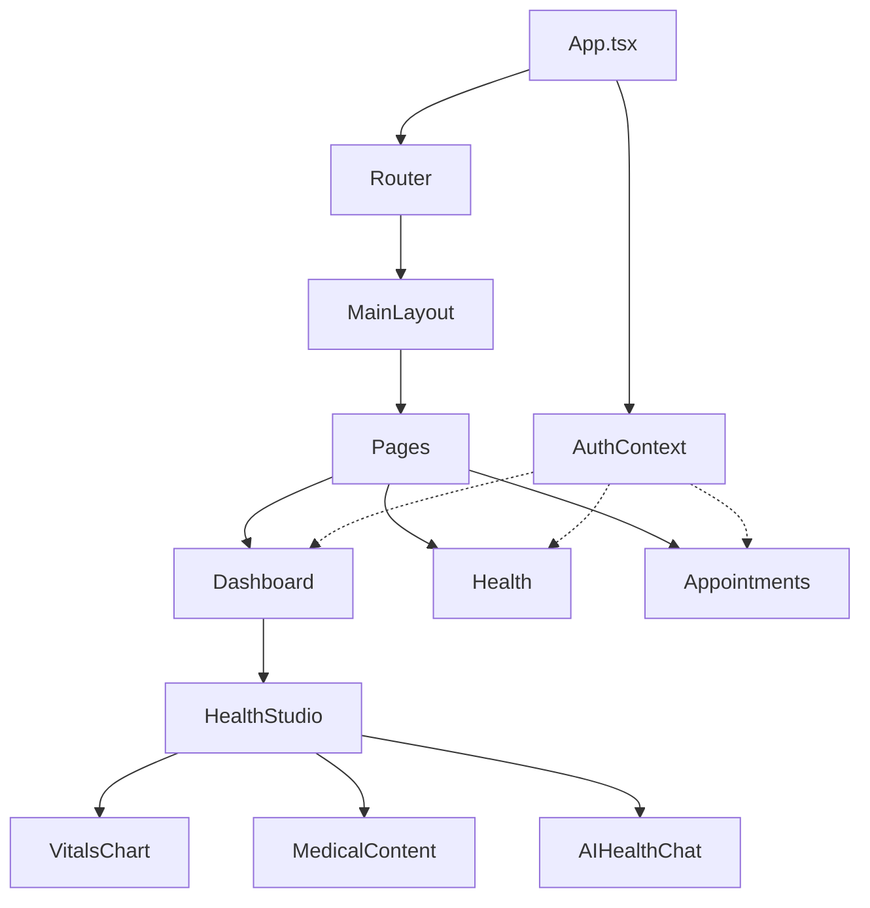

# 14. Frontend Components Reference

## 14.1 Overview

รายละเอียด React Components ที่ใช้ใน Isara Patient Portal

---

## 14.2 Component Architecture

```
src/
├── App.tsx                     # Main router
├── main.tsx                    # Entry point
├── contexts/
│   └── AuthContext.tsx         # Global auth state
├── components/
│   ├── ui/                     # Reusable UI components
│   ├── health/                 # Health-related components
│   └── layout/                 # Layout components
├── pages/                      # Page components
└── lib/                        # Services & utilities
```

---

## 14.3 UI Components (src/components/ui/)

### 14.3.1 Button

```tsx
interface ButtonProps extends React.ButtonHTMLAttributes<HTMLButtonElement> {
  variant?: 'default' | 'outline' | 'ghost' | 'danger' | 'link';
  size?: 'sm' | 'md' | 'lg';
  loading?: boolean;
  icon?: React.ReactNode;
  children: React.ReactNode;
}
```

**Usage:**
```tsx
<Button variant="default" size="md" onClick={handleClick}>
  Submit
</Button>

<Button variant="outline" loading={isSubmitting}>
  <Save className="w-4 h-4 mr-2" />
  Save Changes
</Button>
```

### 14.3.2 Input

```tsx
interface InputProps extends React.InputHTMLAttributes<HTMLInputElement> {
  label?: string;
  error?: string;
  icon?: React.ReactNode;
  helperText?: string;
}
```

**Usage:**
```tsx
<Input
  label="Email"
  type="email"
  placeholder="your@email.com"
  error={errors.email}
  icon={<Mail className="w-4 h-4" />}
/>
```

### 14.3.3 Card

```tsx
interface CardProps {
  children: React.ReactNode;
  className?: string;
  onClick?: () => void;
  hover?: boolean;
}

interface CardHeaderProps {
  title: string;
  subtitle?: string;
  icon?: React.ReactNode;
  action?: React.ReactNode;
}
```

**Usage:**
```tsx
<Card hover onClick={handleCardClick}>
  <CardHeader
    title="Health Summary"
    subtitle="Last updated: Today"
    icon={<Activity className="w-5 h-5" />}
    action={<Button variant="ghost" size="sm">View</Button>}
  />
  <CardContent>
    {/* Content */}
  </CardContent>
</Card>
```

### 14.3.4 Modal

```tsx
interface ModalProps {
  isOpen: boolean;
  onClose: () => void;
  title?: string;
  children: React.ReactNode;
  size?: 'sm' | 'md' | 'lg' | 'xl' | 'full';
  showClose?: boolean;
}
```

**Usage:**
```tsx
<Modal
  isOpen={showConfirm}
  onClose={() => setShowConfirm(false)}
  title="Confirm Action"
  size="md"
>
  <p>Are you sure you want to proceed?</p>
  <div className="flex justify-end gap-2 mt-4">
    <Button variant="outline" onClick={() => setShowConfirm(false)}>
      Cancel
    </Button>
    <Button onClick={handleConfirm}>Confirm</Button>
  </div>
</Modal>
```

### 14.3.5 Tabs

```tsx
interface Tab {
  id: string;
  label: string;
  icon?: React.ReactNode;
  badge?: number;
  disabled?: boolean;
}

interface TabsProps {
  tabs: Tab[];
  activeTab: string;
  onChange: (tabId: string) => void;
  variant?: 'line' | 'pill' | 'card';
}
```

**Usage:**
```tsx
const healthTabs = [
  { id: 'studio', label: 'Health Studio', icon: <Activity /> },
  { id: 'records', label: 'PHR', icon: <FileText /> },
  { id: 'ai', label: 'AI Assistant', icon: <Bot />, badge: 3 },
];

<Tabs
  tabs={healthTabs}
  activeTab={activeTab}
  onChange={setActiveTab}
  variant="pill"
/>
```

### 14.3.6 Calendar

```tsx
interface CalendarProps {
  selectedDate: Date | null;
  onSelect: (date: Date) => void;
  minDate?: Date;
  maxDate?: Date;
  highlightedDates?: Date[];
  disabledDates?: Date[];
}
```

**Usage:**
```tsx
<Calendar
  selectedDate={appointmentDate}
  onSelect={setAppointmentDate}
  minDate={new Date()}
  highlightedDates={availableDates}
/>
```

### 14.3.7 Badge

```tsx
interface BadgeProps {
  children: React.ReactNode;
  variant?: 'default' | 'success' | 'warning' | 'danger' | 'info';
  size?: 'sm' | 'md';
  dot?: boolean;
}
```

**Usage:**
```tsx
<Badge variant="success">Confirmed</Badge>
<Badge variant="warning" dot>Pending</Badge>
<Badge variant="danger">Cancelled</Badge>
```

### 14.3.8 ImageUpload

```tsx
interface ImageUploadProps {
  value?: string;
  onChange: (file: File | null) => void;
  onUpload?: (url: string) => void;
  accept?: string;
  maxSize?: number; // bytes
  aspectRatio?: number;
  circular?: boolean;
}
```

**Usage:**
```tsx
<ImageUpload
  value={profileImage}
  onChange={handleImageChange}
  circular
  maxSize={5 * 1024 * 1024}
/>
```

### 14.3.9 AudioRecorder

```tsx
interface AudioRecorderProps {
  onRecordComplete: (blob: Blob) => void;
  maxDuration?: number; // seconds
  showWaveform?: boolean;
}
```

**Usage:**
```tsx
<AudioRecorder
  onRecordComplete={handleVoiceMessage}
  maxDuration={60}
  showWaveform
/>
```

---

## 14.4 Health Components (src/components/health/)

### 14.4.1 HealthStudio

Main dashboard component for health overview.

```tsx
interface HealthStudioProps {
  userId: string;
}

// Internal tabs:
// - Overview (VitalsChart, LatestAppointmentResult)
// - Treatment Results (TreatmentResults)
// - Medical Content (MedicalContent)
// - AI Chat (AIHealthChat)
```

**Key Features:**
- Vital signs visualization
- Recent appointment results
- Health education content
- AI health assistant integration

### 14.4.2 VitalsChart

```tsx
interface VitalsChartProps {
  data: VitalSign[];
  period: '7d' | '30d' | '90d' | '1y';
  showBPM?: boolean;
  showBloodPressure?: boolean;
  showWeight?: boolean;
}

interface VitalSign {
  date: string;
  heartRate?: number;
  bloodPressure?: { systolic: number; diastolic: number };
  weight?: number;
  temperature?: number;
}
```

### 14.4.3 LatestAppointmentResult

```tsx
interface LatestAppointmentResultProps {
  appointmentId: string;
  compact?: boolean;
}
```

Displays:
- Doctor's diagnosis
- Treatment plan
- Prescribed medications
- Follow-up recommendations

### 14.4.4 TreatmentResults

```tsx
interface TreatmentResultsProps {
  userId: string;
}

// Filter options:
// - Last 5 appointments
// - Last 6 months
// - Last 1 year
// - All records
```

**Filter Logic:**
```tsx
const filterAppointments = (filter: string) => {
  const now = new Date();
  switch (filter) {
    case 'last5':
      return appointments.slice(-5);
    case '6months':
      return appointments.filter(a => 
        new Date(a.date) >= new Date(now.setMonth(now.getMonth() - 6))
      );
    case '1year':
      return appointments.filter(a => 
        new Date(a.date) >= new Date(now.setFullYear(now.getFullYear() - 1))
      );
    default:
      return appointments;
  }
};
```

### 14.4.5 MedicalContent

```tsx
interface MedicalContentProps {
  category?: string;
}

// Categories:
// - featured (แนะนำ)
// - heart (โรคหัวใจ)
// - diabetes (เบาหวาน)
// - nutrition (โภชนาการ)
// - exercise (การออกกำลังกาย)
// - mental (สุขภาพจิต)
```

**Article Interface:**
```tsx
interface Article {
  id: string;
  title: string;
  description: string;
  category: string;
  image: string;
  date: string;
  readTime: string;
  views?: number;
  rating?: number;
  isFeatured?: boolean;
}
```

---

## 14.5 Layout Components

### 14.5.1 MainLayout

```tsx
interface MainLayoutProps {
  children: React.ReactNode;
}
```

**Structure:**
```tsx
<MainLayout>
  <Sidebar />          // Left navigation
  <MainContent>        // Main area
    <Header />         // Top header with user menu
    {children}         // Page content
  </MainContent>
  <BottomNav />        // Mobile navigation
</MainLayout>
```

### 14.5.2 Navigation Items

```tsx
const navItems = [
  { path: '/dashboard', label: 'หน้าหลัก', icon: Home },
  { path: '/health', label: 'สุขภาพ', icon: Heart },
  { path: '/appointments', label: 'นัดหมาย', icon: Calendar },
  { path: '/map', label: 'แผนที่', icon: Map },
  { path: '/timeline', label: 'ไทม์ไลน์', icon: Clock },
  { path: '/pdpa', label: 'PDPA', icon: Shield },
  { path: '/settings', label: 'ตั้งค่า', icon: Settings },
];
```

---

## 14.6 Page Components (src/pages/)

### 14.6.1 Page Structure

```
pages/
├── auth/
│   ├── LoginPage.tsx          # /login
│   └── RegisterPage.tsx       # /register
├── dashboard/
│   └── DashboardPage.tsx      # / (home)
├── health/
│   ├── PHRPage.tsx           # /health/phr
│   └── AIDoctorPage.tsx      # /health/ai
├── appointments/
│   └── AppointmentPages.tsx  # /appointments/*
├── map/
│   └── MapPage.tsx           # /map
├── timeline/
│   └── TimelinePage.tsx      # /timeline
├── pdpa/
│   ├── PDPAPage.tsx          # /pdpa
│   └── LivingWillPage.tsx    # /pdpa/living-will
├── profile/
│   └── ProfilePage.tsx       # /profile
└── settings/
    └── SettingsPage.tsx      # /settings
```

### 14.6.2 DashboardPage

```tsx
// Main sections
- Welcome Header with user greeting
- Quick Actions (Book appointment, View PHR, AI Chat)
- Health Summary Cards
- Upcoming Appointments
- Recent Activity Timeline
- AI Health Chat (bottom section)
```

### 14.6.3 AppointmentPages

```tsx
// Routes
/appointments                 # List all appointments
/appointments/book           # Book new appointment
/appointments/:id            # View single appointment
/appointments/:id/video      # Video call interface
```

### 14.6.4 PHRPage

```tsx
// Tabs
- Overview (health summary)
- Vital Signs (charts & input)
- Medications (current & past)
- Allergies (list & add)
- Lab Results (view & upload)
- Documents (medical files)
```

---

## 14.7 Context Providers

### 14.7.1 AuthContext

```tsx
interface AuthContextType {
  user: User | null;
  isAuthenticated: boolean;
  isLoading: boolean;
  login: (credentials: LoginCredentials) => Promise<void>;
  logout: () => Promise<void>;
  register: (data: RegisterData) => Promise<void>;
  updateProfile: (data: Partial<User>) => Promise<void>;
}

// Usage
const { user, isAuthenticated, login, logout } = useAuth();
```

### 14.7.2 Protected Routes

```tsx
const ProtectedRoute: React.FC<{ children: React.ReactNode }> = ({ children }) => {
  const { isAuthenticated, isLoading } = useAuth();
  const location = useLocation();

  if (isLoading) {
    return <LoadingSpinner />;
  }

  if (!isAuthenticated) {
    return <Navigate to="/login" state={{ from: location }} replace />;
  }

  return <>{children}</>;
};
```

---

## 14.8 Custom Hooks

### 14.8.1 useLocalStorage

```tsx
function useLocalStorage<T>(key: string, initialValue: T) {
  const [storedValue, setStoredValue] = useState<T>(() => {
    try {
      const item = window.localStorage.getItem(key);
      return item ? JSON.parse(item) : initialValue;
    } catch {
      return initialValue;
    }
  });

  const setValue = (value: T | ((val: T) => T)) => {
    const valueToStore = value instanceof Function ? value(storedValue) : value;
    setStoredValue(valueToStore);
    window.localStorage.setItem(key, JSON.stringify(valueToStore));
  };

  return [storedValue, setValue] as const;
}
```

### 14.8.2 useDebounce

```tsx
function useDebounce<T>(value: T, delay: number): T {
  const [debouncedValue, setDebouncedValue] = useState<T>(value);

  useEffect(() => {
    const handler = setTimeout(() => setDebouncedValue(value), delay);
    return () => clearTimeout(handler);
  }, [value, delay]);

  return debouncedValue;
}

// Usage in search
const searchTerm = useDebounce(inputValue, 300);
```

### 14.8.3 useGeolocation

```tsx
interface GeolocationState {
  latitude: number | null;
  longitude: number | null;
  error: string | null;
  loading: boolean;
}

function useGeolocation(options?: PositionOptions): GeolocationState {
  const [state, setState] = useState<GeolocationState>({
    latitude: null,
    longitude: null,
    error: null,
    loading: true,
  });

  useEffect(() => {
    navigator.geolocation.getCurrentPosition(
      (position) => {
        setState({
          latitude: position.coords.latitude,
          longitude: position.coords.longitude,
          error: null,
          loading: false,
        });
      },
      (error) => {
        setState(prev => ({
          ...prev,
          error: error.message,
          loading: false,
        }));
      },
      {
        enableHighAccuracy: true,
        timeout: 10000,
        maximumAge: 60000,
        ...options,
      }
    );
  }, []);

  return state;
}
```

---

## 14.9 Styling

### 14.9.1 Tailwind Configuration

```js
// tailwind.config.js
module.exports = {
  content: ['./index.html', './src/**/*.{js,ts,jsx,tsx}'],
  theme: {
    extend: {
      colors: {
        primary: {
          50: '#f0fdf4',
          500: '#22c55e',
          600: '#16a34a',
          700: '#15803d',
        },
        // ... more colors
      },
      fontFamily: {
        sans: ['Inter', 'Noto Sans Thai', 'sans-serif'],
      },
    },
  },
  plugins: [],
};
```

### 14.9.2 Common Patterns

```tsx
// Card with hover
className="bg-white rounded-lg shadow-sm hover:shadow-md transition-shadow p-4"

// Primary button
className="bg-primary-600 hover:bg-primary-700 text-white px-4 py-2 rounded-lg font-medium transition-colors"

// Input field
className="w-full px-3 py-2 border border-gray-300 rounded-lg focus:ring-2 focus:ring-primary-500 focus:border-transparent"

// Responsive grid
className="grid grid-cols-1 md:grid-cols-2 lg:grid-cols-3 gap-4"
```

---

## 14.10 Component Communication



---

[← Previous: Deployment](./13-deployment.md) | [Back to README →](./README.md)
