# 16. Detailed Flowcharts & Process Diagrams

**Version:** 1.0.0  
**Last Updated:** December 10, 2025

## 16.1 System Overview Flowchart

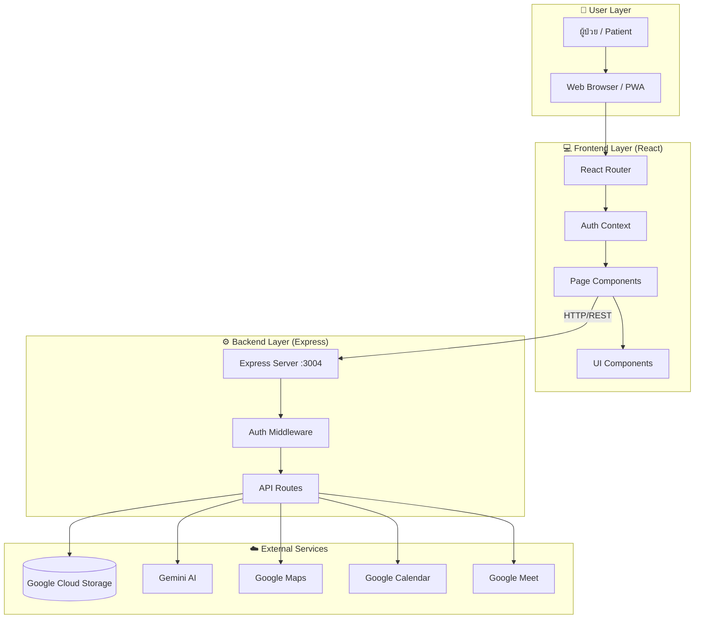

---

## 16.2 Complete User Journey Flowchart

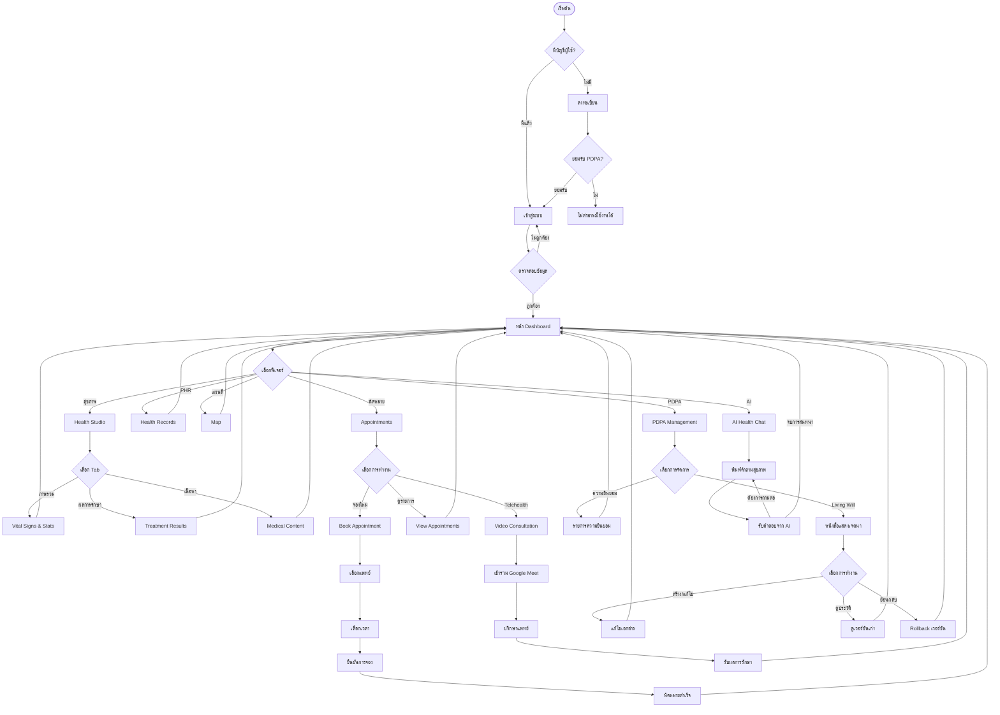

---

## 16.3 Authentication Process Detail

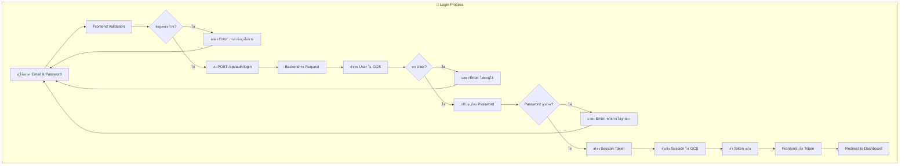

---

## 16.4 Appointment Booking Complete Flow

```mermaid
flowchart TD
    subgraph BOOKING["📅 Appointment Booking Process"]
        B1[เลือกประเภทนัดหมาย]
        B2{ประเภท?}
        B3[Telehealth / Online]
        B4[In-Person / พบแพทย์]
        B5[Home Visit / เยี่ยมบ้าน]
        
        B6[เลือกสาขาการแพทย์]
        B7[แสดงรายชื่อแพทย์]
        B8[ผู้ใช้เลือกแพทย์]
        
        B9[ดึง Calendar Availability]
        B10[แสดง Available Slots]
        B11[ผู้ใช้เลือกวันเวลา]
        
        B12[กรอกอาการ/เหตุผล]
        B13[ยืนยันการจอง]
        
        B14[Backend สร้าง Appointment]
        B15{เป็น Telehealth?}
        B16[สร้าง Google Meet Link]
        B17[สร้าง Calendar Event]
        B18[บันทึกลง GCS]
        
        B19[ส่ง Confirmation]
        B20[แสดงรายละเอียดนัดหมาย]
    end
    
    B1 --> B2
    B2 -->|Online| B3
    B2 -->|At Hospital| B4
    B2 -->|Home| B5
    
    B3 --> B6
    B4 --> B6
    B5 --> B6
    
    B6 --> B7
    B7 --> B8
    B8 --> B9
    B9 --> B10
    B10 --> B11
    B11 --> B12
    B12 --> B13
    
    B13 --> B14
    B14 --> B15
    B15 -->|ใช่| B16
    B16 --> B17
    B15 -->|ไม่| B17
    B17 --> B18
    B18 --> B19
    B19 --> B20
```

---

## 16.5 PHR Data Management Flow

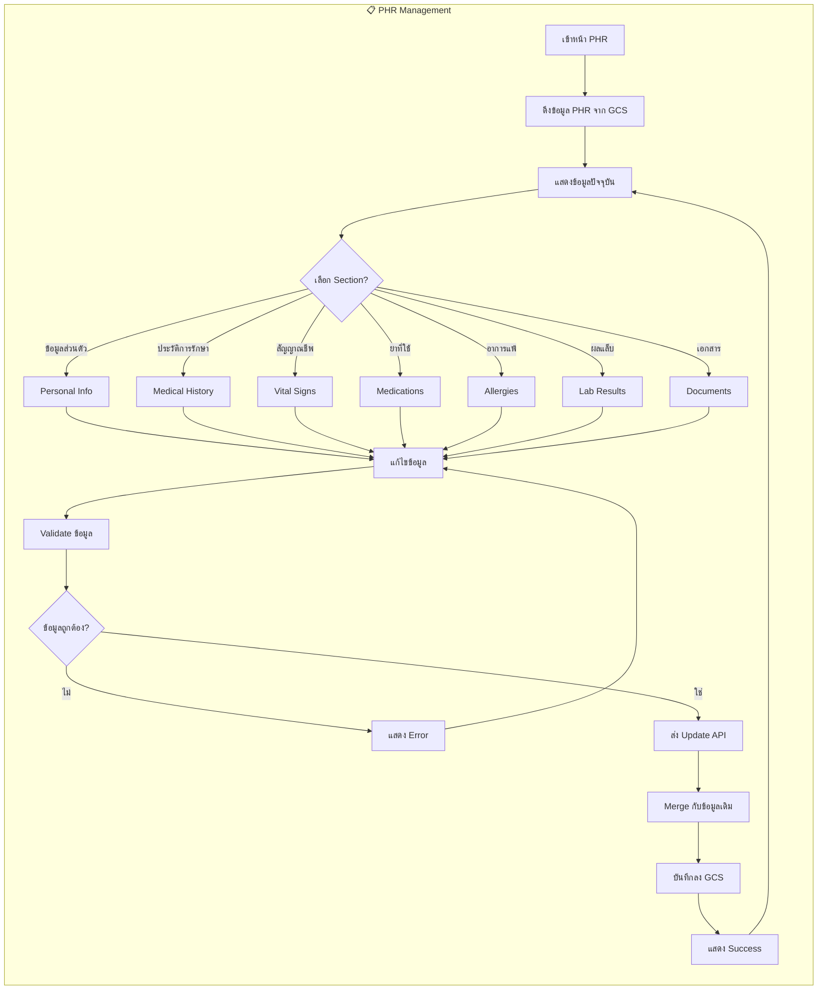

---

## 16.6 Vital Signs Recording Flow

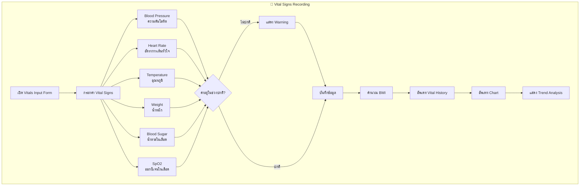

---

## 16.7 Treatment Results Filtering Flow

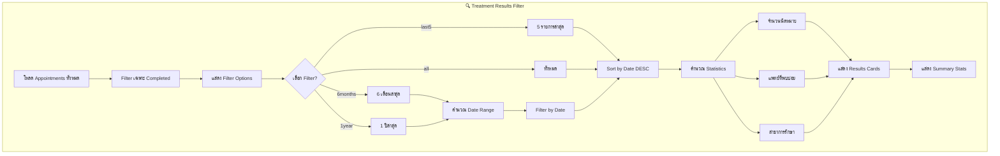

---

## 16.8 Living Will Version Management

```mermaid
flowchart TD
    subgraph LIVING_WILL["📝 Living Will Versioning"]
        LW1[เปิดหน้า Living Will]
        LW2[ดึงข้อมูลปัจจุบัน]
        LW3{มีข้อมูลเดิม?}
        
        LW4[แสดง Form ว่าง]
        LW5[แสดงข้อมูลเดิม + Version Badge]
        
        LW6[ผู้ใช้แก้ไขข้อมูล]
        LW7[เพิ่ม Digital Signature]
        LW8[กด Save]
        
        LW9[สร้าง Version ID ใหม่]
        LW10[สำรองเวอร์ชันเก่า]
        LW11[บันทึกเวอร์ชันใหม่]
        LW12[อัพเดท Current Version]
        
        LW13[แสดง Success + New Version]
        
        LW14[ดูประวัติเวอร์ชัน]
        LW15[ดึงรายการ Versions]
        LW16[แสดง Version Timeline]
        
        LW17[เลือก Rollback]
        LW18[ยืนยัน Rollback]
        LW19[สำรองเวอร์ชันปัจจุบัน]
        LW20[Restore เวอร์ชันที่เลือก]
        LW21[แสดง Restored Data]
    end
    
    LW1 --> LW2
    LW2 --> LW3
    LW3 -->|ไม่มี| LW4
    LW3 -->|มี| LW5
    
    LW4 --> LW6
    LW5 --> LW6
    
    LW6 --> LW7
    LW7 --> LW8
    LW8 --> LW9
    LW9 --> LW10
    LW10 --> LW11
    LW11 --> LW12
    LW12 --> LW13
    
    LW5 --> LW14
    LW14 --> LW15
    LW15 --> LW16
    
    LW16 --> LW17
    LW17 --> LW18
    LW18 --> LW19
    LW19 --> LW20
    LW20 --> LW21
```

---

## 16.9 AI Health Chat Process

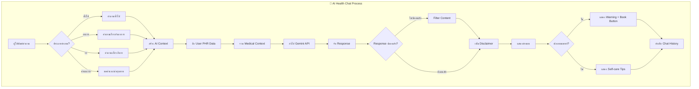

---

## 16.10 PDPA Consent Management

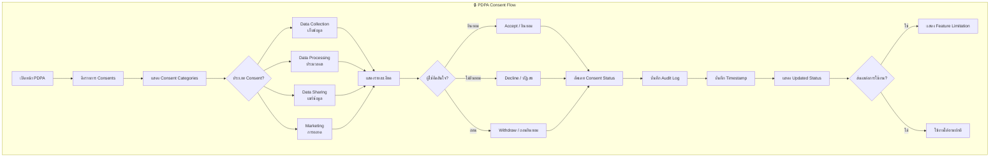

---

## 16.11 Map & Location Services

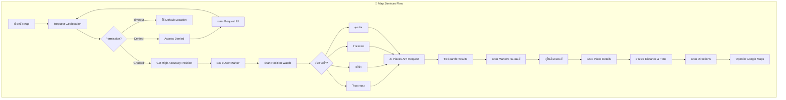

---

## 16.12 Telehealth Video Session

```mermaid
flowchart TD
    subgraph TELEHEALTH["🎥 Telehealth Session"]
        T1[เปิดหน้านัดหมาย]
        T2[ตรวจสอบเวลานัด]
        T3{ถึงเวลา?}
        
        T4[แสดง Waiting Message]
        T5[แสดง Join Button]
        
        T6[คลิก Join Meeting]
        T7[ตรวจสอบ Meet Link]
        T8{Link Valid?}
        
        T9[แสดง Error]
        T10[เปิด Google Meet]
        
        T11[ตรวจสอบ Camera/Mic]
        T12{พร้อมใช้งาน?}
        T13[แสดง Permission Guide]
        T14[เข้าร่วม Video Call]
        
        T15[รอแพทย์เข้าร่วม]
        T16[เริ่มการปรึกษา]
        T17[บันทึก Session Start]
        
        T18[สิ้นสุดการปรึกษา]
        T19[แพทย์บันทึกผล]
        T20[บันทึก Session End]
        
        T21[ผู้ป่วยดูผลการรักษา]
        T22[แสดงใน Treatment Results]
    end
    
    T1 --> T2
    T2 --> T3
    T3 -->|ยังไม่ถึง| T4
    T4 -->|รอ| T2
    T3 -->|ถึงแล้ว| T5
    
    T5 --> T6
    T6 --> T7
    T7 --> T8
    T8 -->|Invalid| T9
    T8 -->|Valid| T10
    
    T10 --> T11
    T11 --> T12
    T12 -->|ไม่พร้อม| T13
    T13 --> T11
    T12 -->|พร้อม| T14
    
    T14 --> T15
    T15 --> T16
    T16 --> T17
    
    T17 --> T18
    T18 --> T19
    T19 --> T20
    
    T20 --> T21
    T21 --> T22
```

---

## 16.13 Data Backup & Recovery Flow

```mermaid
flowchart TD
    subgraph BACKUP["💾 Data Backup & Recovery"]
        B1[Schedule Trigger]
        B2[List Source Buckets]
        
        B3[AUTH Bucket]
        B4[PATIENT Bucket]
        B5[APPOINTMENTS Bucket]
        
        B6[Create Date Folder]
        B7[Copy Files to Backup]
        B8[Verify Integrity]
        
        B9{Success?}
        B10[Log Success]
        B11[Log Error]
        B12[Alert Admin]
        
        B13[Cleanup Old Backups]
        B14[Keep Last 30 Days]
    end
    
    subgraph RECOVERY["🔄 Recovery Process"]
        R1[Admin Request Recovery]
        R2[Select Backup Date]
        R3[List Available Backups]
        
        R4[Preview Backup Content]
        R5[Confirm Recovery]
        
        R6{Recovery Type?}
        R7[Full Recovery]
        R8[Selective Recovery]
        
        R9[Stop Current Operations]
        R10[Restore from Backup]
        R11[Verify Restored Data]
        R12[Resume Operations]
    end
    
    B1 --> B2
    B2 --> B3
    B2 --> B4
    B2 --> B5
    
    B3 --> B6
    B4 --> B6
    B5 --> B6
    
    B6 --> B7
    B7 --> B8
    B8 --> B9
    
    B9 -->|Yes| B10
    B9 -->|No| B11
    B11 --> B12
    
    B10 --> B13
    B13 --> B14
    
    R1 --> R2
    R2 --> R3
    R3 --> R4
    R4 --> R5
    R5 --> R6
    
    R6 -->|Full| R7
    R6 -->|Selective| R8
    
    R7 --> R9
    R8 --> R9
    R9 --> R10
    R10 --> R11
    R11 --> R12
```

---

## 16.14 Error Handling Flow

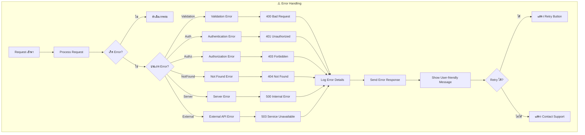

---

## 16.15 Complete System State Diagram

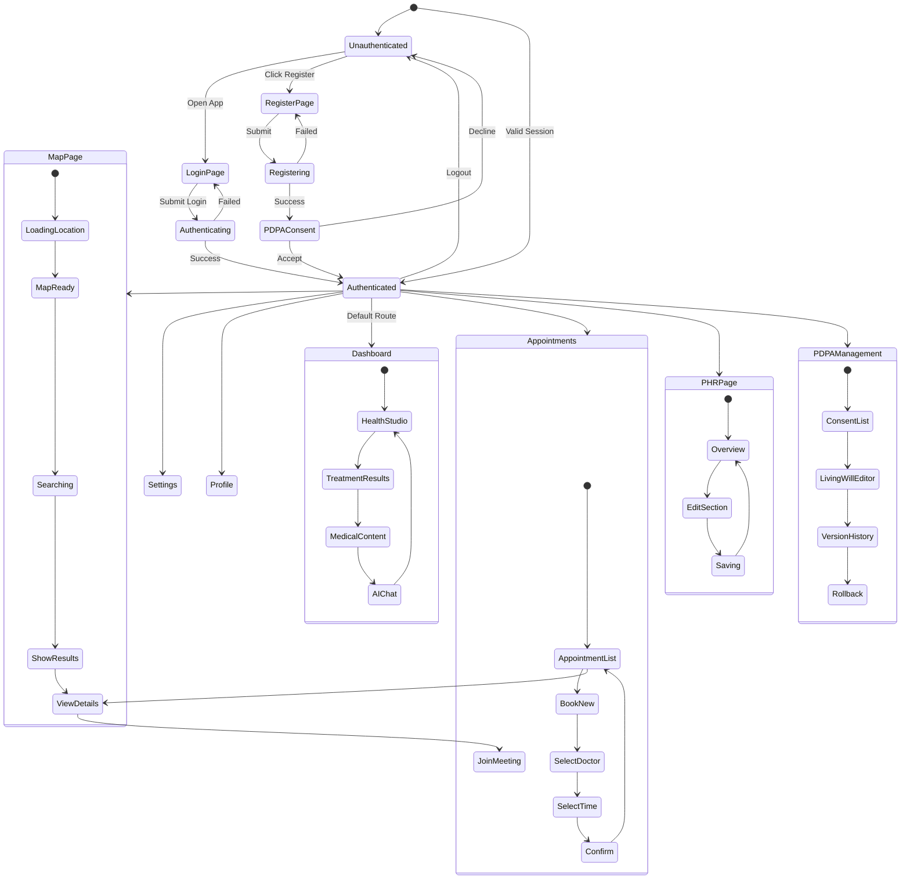

---

[← Previous: Glossary](./15-glossary.md) | [Back to README →](./README.md)
