# Isara Patient Portal - Visual Diagrams

**Version:** 1.0.0  
**Last Updated:** December 10, 2025

Collection of all Mermaid diagrams for the patient portal system.

> 📌 **Note:** For more detailed flowcharts with step-by-step processes, see [16-detailed-flowcharts.md](./16-detailed-flowcharts.md)

---

## 1. System Architecture

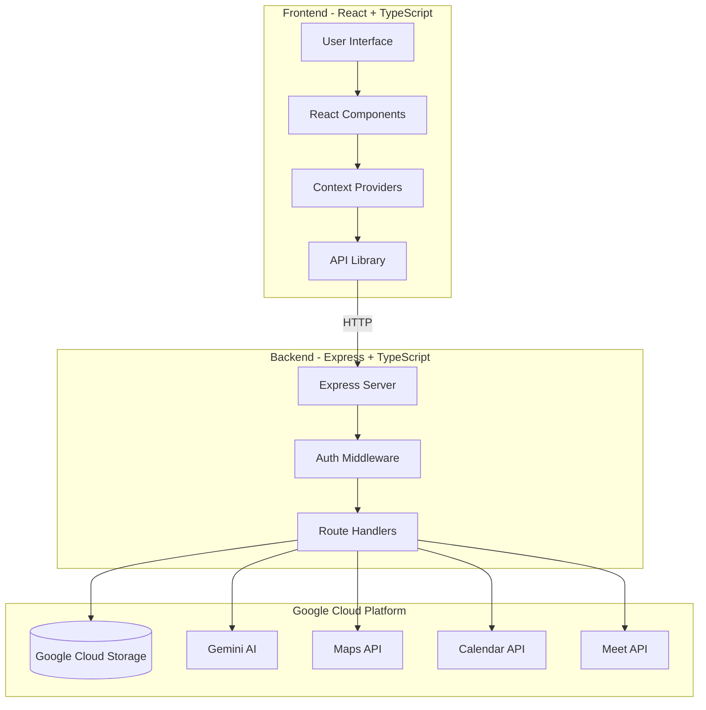

---

## 2. Authentication Flow

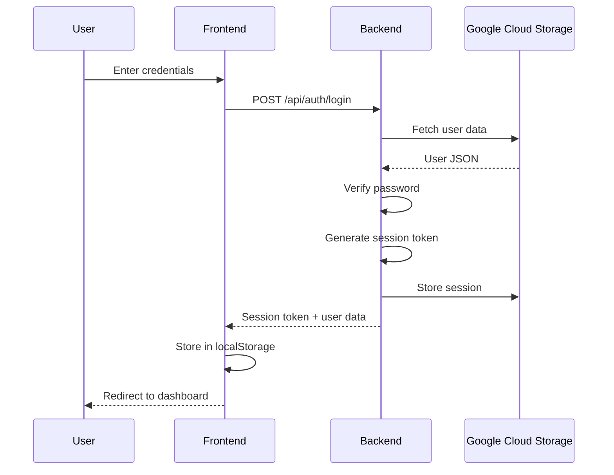

---

## 3. Appointment Booking Flow

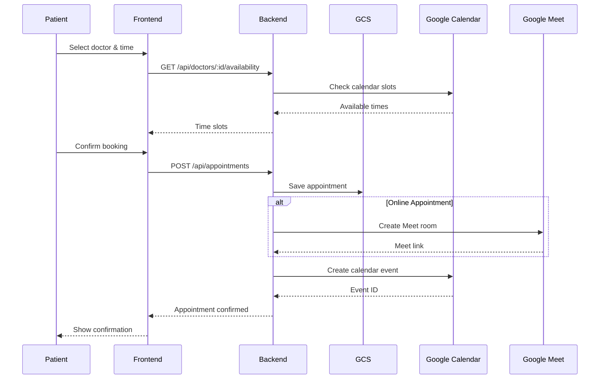

---

## 4. PHR Data Flow

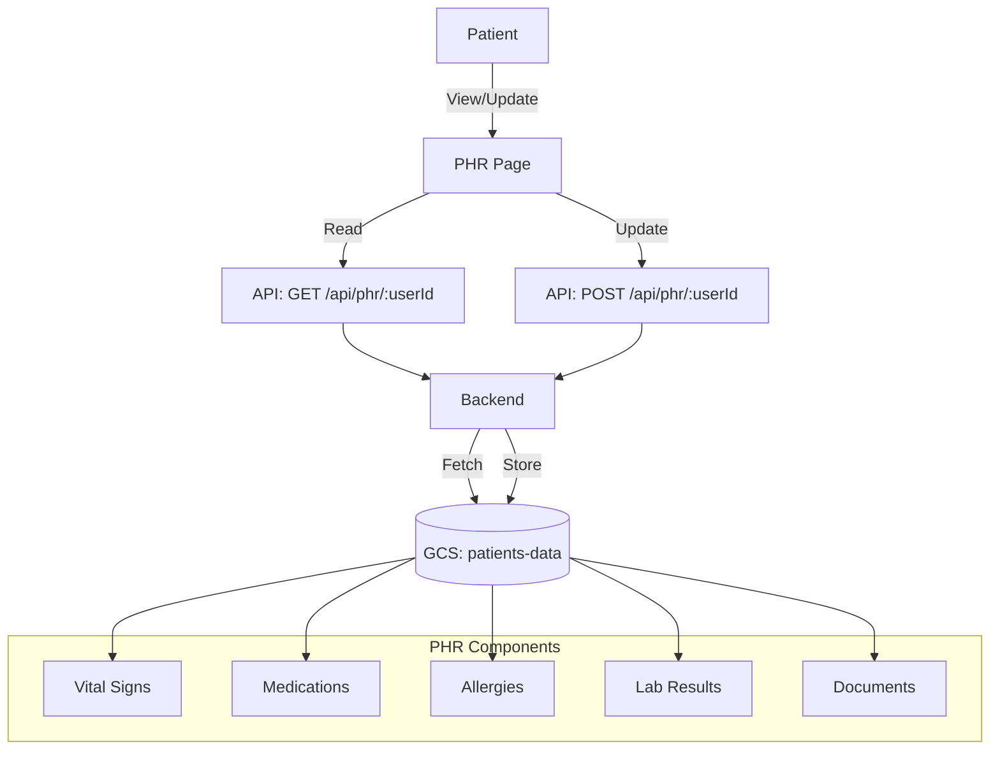

---

## 5. AI Health Assistant Flow

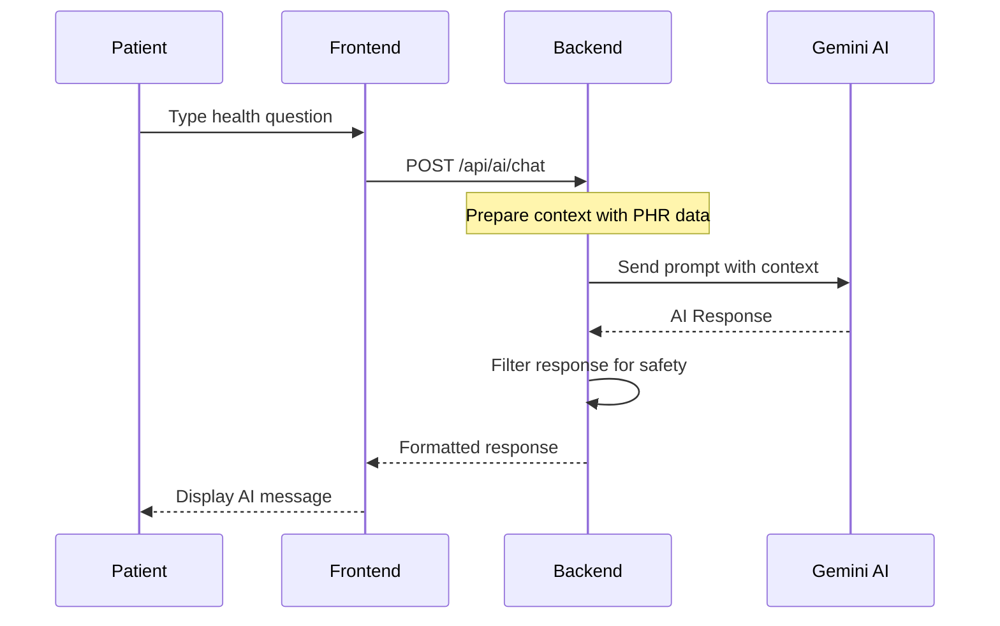

---

## 6. PDPA Consent Flow

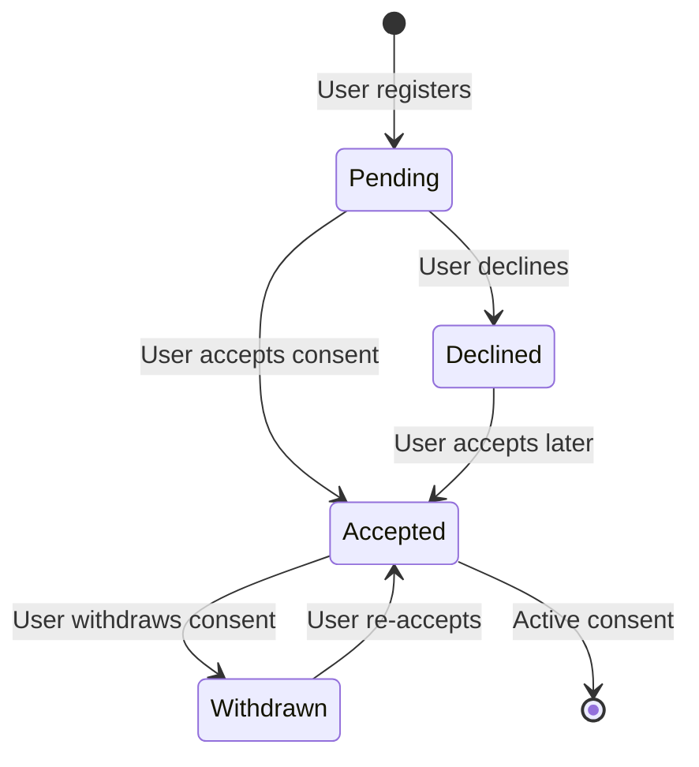

---

## 7. Living Will Versioning

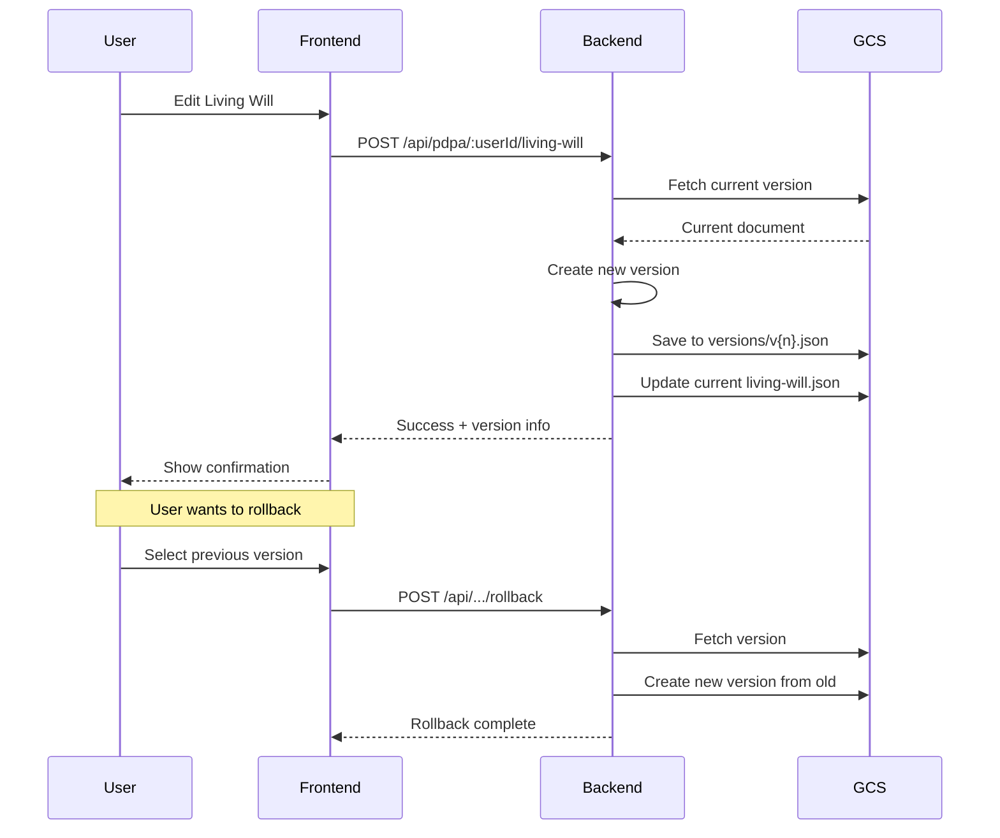

---

## 8. Video Consultation Flow

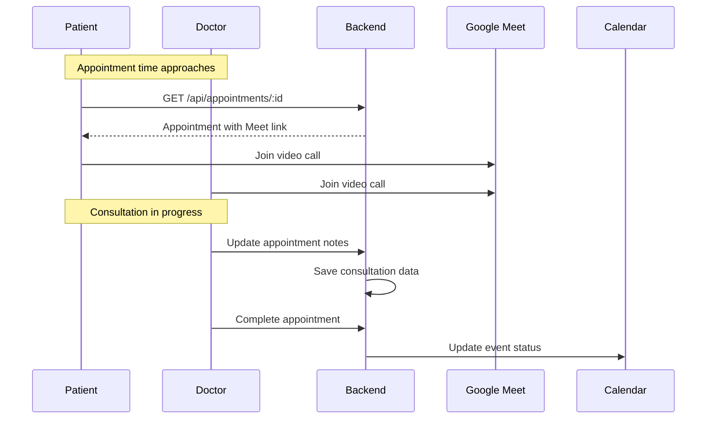

---

## 9. GCS Bucket Structure

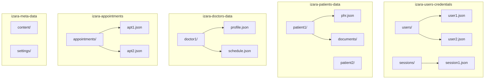

---

## 10. Frontend Component Tree

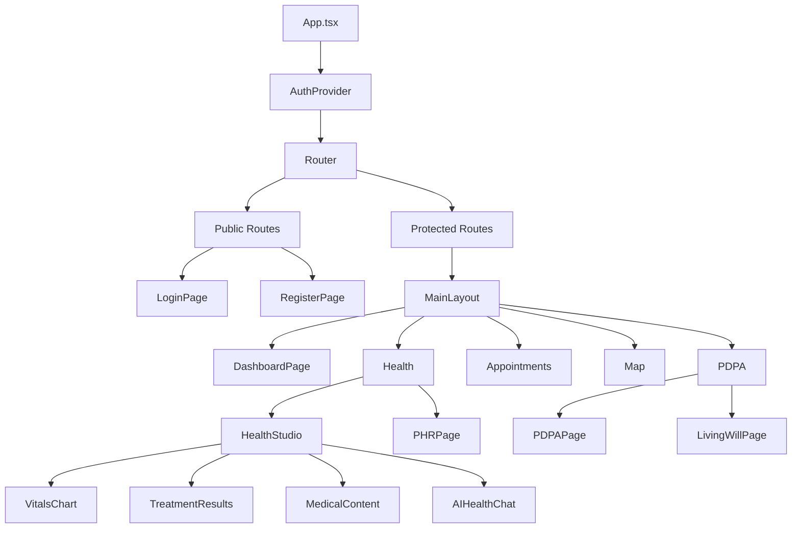

---

## 11. API Request Flow

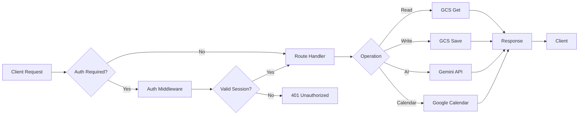

---

## 12. Data Entity Relationships

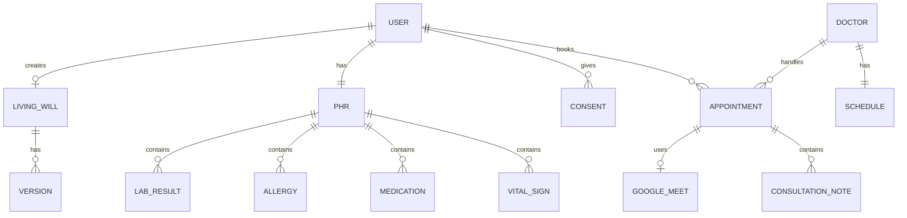

---

## 13. Treatment Results Filter Logic

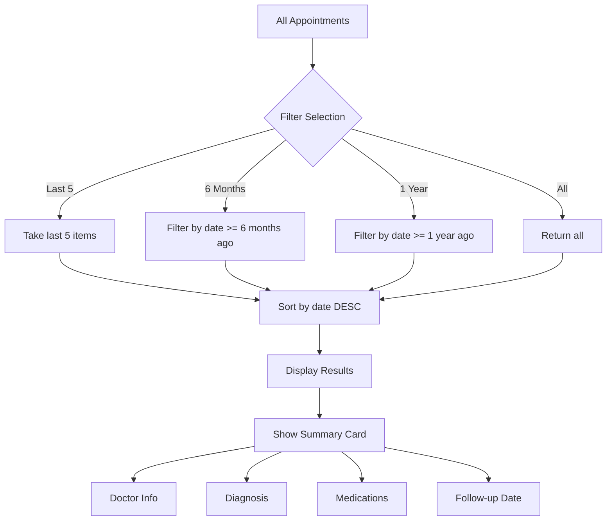

---

## 14. Health Studio Tabs

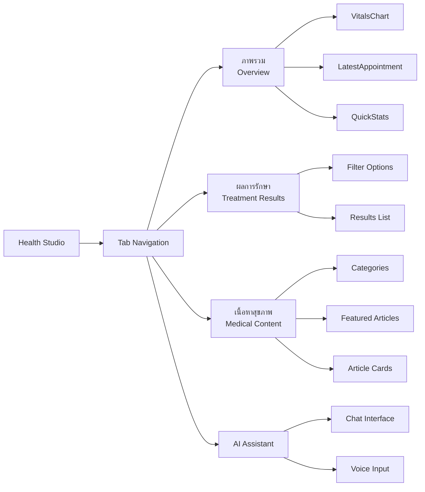

---

## 15. Session Management

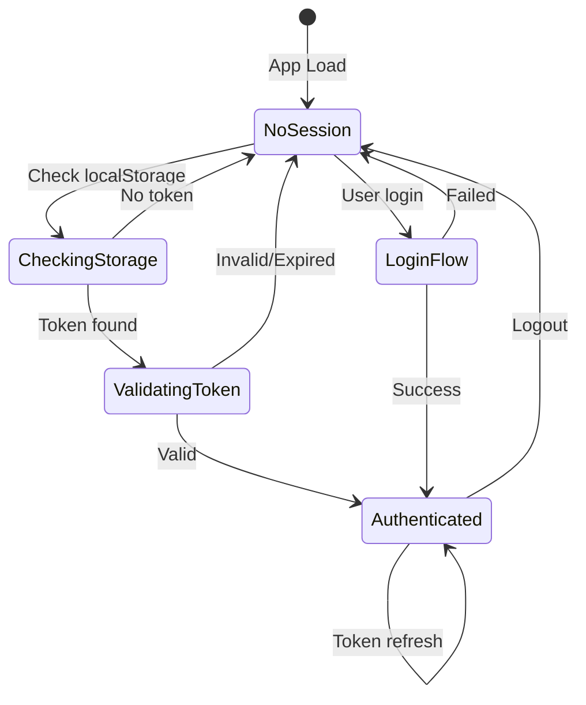

---

## Usage Notes

To render these diagrams:

1. **GitHub/GitLab**: Diagrams render automatically in markdown
2. **VS Code**: Use "Markdown Preview Mermaid Support" extension
3. **Web**: Use [Mermaid Live Editor](https://mermaid.live)
4. **Documentation**: Export as SVG/PNG from live editor

---

[Back to README →](./README.md)
