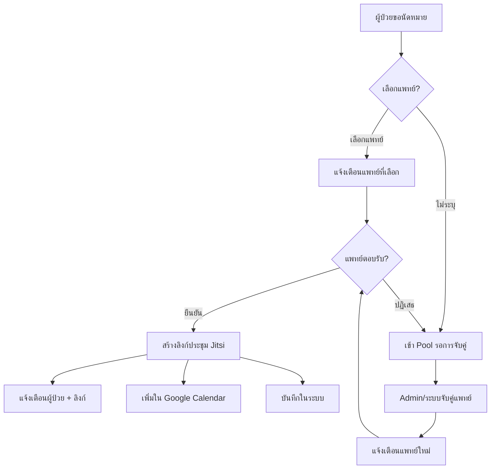
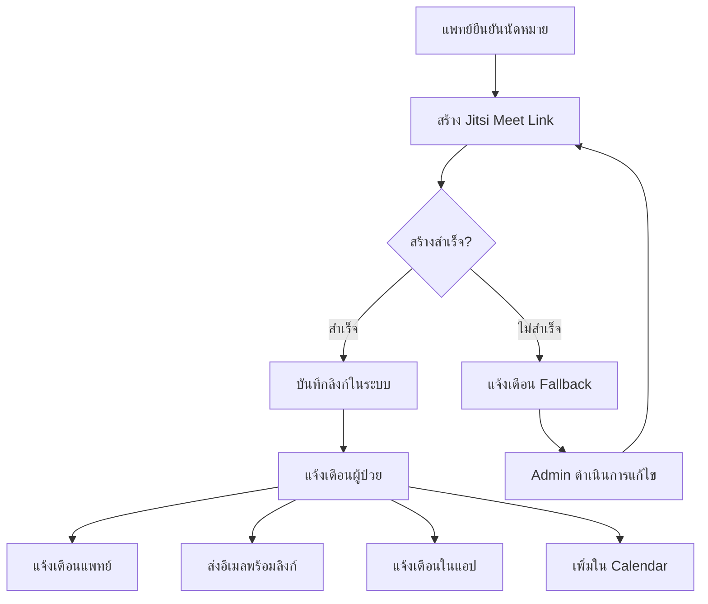
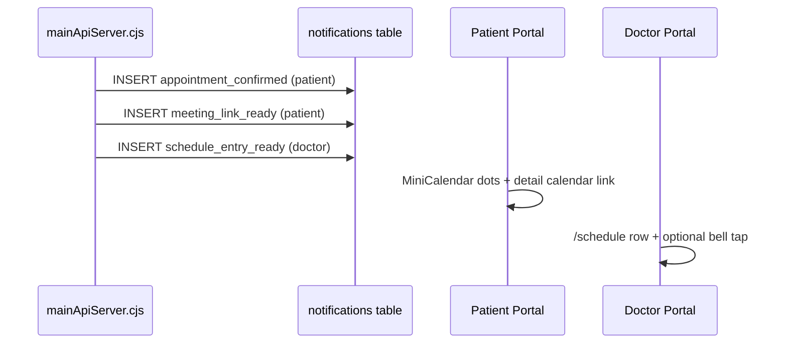

# Notification Workflows — Patient

> **SSOT source:** `Processes/Notification_Workflows.md §1–4.1`
> **Synced:** 2025-06-25
> **Portal:** Patient (`Isara-patient-portal`)
> **Use:** Workflow excerpt — edit canonical copy in platform `Processes/`; refresh via `npm run docs:sync-to-apps`.

---
# Notification Workflows / ขั้นตอนการแจ้งเตือน

**Version:** 1.7.51
**Last Updated:** June 8, 2026
**Status:** ✅ PostgreSQL Implementation Complete + Calendar sync on confirm (`calendarEventUrl`, `schedule_entry_ready`)

---

## 1. ภาพรวมระบบแจ้งเตือน (Notification System Overview)

### 1.1 ช่องทางการแจ้งเตือน (Notification Channels)

| Channel | Thai | Description |
| --------- | ------ | ------------- |
| In-App | แจ้งเตือนในแอป | Real-time notifications within the portal |
| Email | อีเมล | Email notifications via Gmail API |
| Push | Push Notification | Browser push notifications |
| SMS | SMS | SMS notifications (future enhancement) |


### 1.2 ประเภทการแจ้งเตือน (Notification Types)

```text
📅 Appointments (นัดหมาย)
├── appointment_requested    - ผู้ป่วยขอนัดหมายใหม่
├── appointment_confirmed    - แพทย์ยืนยันนัดหมาย + ลิงก์ประชุม + calendarEventUrl
├── appointment_declined     - แพทย์ปฏิเสธ กำลังหาแพทย์ท่านอื่น
├── appointment_cancelled    - นัดหมายถูกยกเลิก
├── appointment_assigned     - ผู้ดูแลมอบหมายนัดหมายให้แพทย์
├── appointment_rescheduled  - นัดหมายถูกเลื่อน
├── appointment_reminder     - แจ้งเตือนก่อนนัด 24 ชม./1 ชม.
└── schedule_entry_ready     - แพทย์: นัดยืนยันแล้ว — ปรากฏบน /schedule + ลิงก์ปฏิทิน

📹 Video Meeting (การประชุมออนไลน์)
├── meeting_link_ready       - ลิงก์ประชุมพร้อมใช้งาน
├── meeting_link_failed      - สร้างลิงก์ไม่สำเร็จ
├── meeting_started          - แพทย์เริ่มห้องประชุม
└── meeting_reminder         - แจ้งเตือน 15 นาทีก่อนประชุม

📄 Medical Records (เวชระเบียน)
├── emr_signed               - แพทย์ลงนามเวชระเบียนแล้ว
├── emr_ready_for_review     - เวชระเบียนพร้อมให้ตรวจสอบ
├── prescription_ready       - ใบสั่งยาพร้อม
└── lab_results_ready        - ผลแล็บพร้อมดู

🔔 System (ระบบ)
├── account_verified         - บัญชีได้รับการยืนยัน
├── password_reset           - รีเซ็ตรหัสผ่าน
└── system_maintenance       - แจ้งการบำรุงรักษาระบบ
```

---

## 2. Notification Flow Diagrams

### 2.1 Appointment Request Flow



### 2.2 Meeting Link Workflow



---

### 3.4 Confirm appointment — notification payloads (v1.7.51)

When `POST /api/appointments/:id/confirm` succeeds in `mainApiServer.cjs`, the server inserts **three** in-app notifications (email optional via existing templates):

| # | Recipient | `type` | `data` fields (JSON) | UI consumer |
|---|-----------|--------|------------------------|-------------|
| 1 | Patient | `appointment_confirmed` | `appointmentId`, `meetingLink`, `calendarEventUrl`, `confirmedDate`, `confirmedTime`, `doctorName` | Notification bell; `AppointmentPages.tsx` reads `calendarEventUrl` for **Add to Calendar** |
| 2 | Patient | `meeting_link_ready` | Same + `meet_link` alias | Redundant channel for meeting-centric UX |
| 3 | Doctor | `schedule_entry_ready` | `appointmentId`, `patientId`, `patientName`, `calendarEventUrl`, `meetingLink`, `confirmedDate`, `confirmedTime` | Doctor bell; links to `/schedule` |

**`calendarEventUrl` format** (built by `calendarEventLinks.cjs`):

```text
https://calendar.google.com/calendar/render?action=TEMPLATE
  &text=Izara+Telehealth+—+{patientName}
  &dates={YYYYMMDDTHHmmss}/{YYYYMMDDTHHmmss}   (Asia/Bangkok, +30 min)
  &details=Meeting+link%3A+{meetingLink}
  &location=Izara+Video+Meeting
```

**Patient fallback:** If notification payload is missing (older rows), `buildCalendarEventUrl.ts` rebuilds the same TEMPLATE URL from appointment fields on the detail page (`data-testid="appointment-calendar-link"`).

**E2E proof:** Playwright **D4cal** — `GET /api/notifications?userId={patientId}` → find `appointment_confirmed` → assert `data.calendarEventUrl` matches `/calendar\.google\.com/`.



---

## 4. Notification UI Components

### 4.1 Patient Portal (พอร์ทัลผู้ป่วย)

| Component | Location | Thai Label |
| ----------- | ---------- | ------------ |
| NotificationBell | MainLayout Header | 🔔 การแจ้งเตือน |
| NotificationDropdown | Header Dropdown | รายการแจ้งเตือน |
| NotificationPage | /notifications | ประวัติการแจ้งเตือน |
| ToastNotification | Global | แจ้งเตือนแบบ popup |