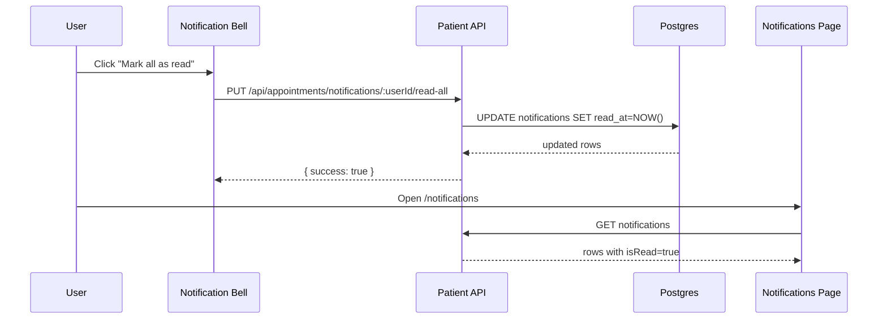
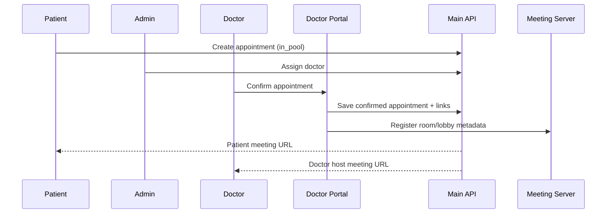

# Izara Telemedicine Platform - Technical Documentation

> **Version:** 1.7.48 (Updated 30 May 2026)
> **Status:** Defect PDF re-audit — all 23 defects verified; **0 failed, 0 skipped** on cloud Defect-regression
> **Database:** PostgreSQL 18 + pgvector (42 tables, port 5432 native)
> **Stack:** PostgreSQL / Express / React / Jitsi / Gemini AI / Google Cloud
> **Tests:** **2,736** Unit (Vitest, 151 files) + Defect-regression Playwright (**36 passed, 0 skipped**) + Full cloud (**85 passed, 0 skipped**)
> **Code Quality:** SonarLint + `npm run sonar:lint`; clinical TSX subcomponents (S6747 structural fix)

---


## 📑 Table of Contents

1. [Project Overview](#1-project-overview)
2. [System Architecture](#2-system-architecture)
3. [Database Design](#3-database-design)
4. [User Management & RBAC](#4-user-management--rbac)
5. [Core Workflows](#5-core-workflows)
6. [DevOps & Deployment](#6-devops--deployment)
7. [Testing](#7-testing)
8. [Future Roadmap](#8-future-roadmap)

---

## Defect Remediation v1.7.48

Re-audit of `Defect หมออิสระ.pdf` (2026-05-30) confirms all **23** defects remain **Verified** (see `pdf-reaudit-v1.7.48.txt`).

- **Gates:** `test:quality:gate` (2736 unit); Defect-regression **36/36** cloud (2026-05-30)
- **Sonar structural fix:** `EmrEditorChrome`, `PrescribingModalChrome`, `LiveTranscriptionView` — eliminates S6747 parser cascade in IDE
- **Sonar types:** `ValidationAction` in `MeetingResults.tsx` (S4323); `ROLE_PATIENT`/`ROLE_DOCTOR` in `technical_architecture_content.py` (S1192)
- **Test guard:** `clinicalComponentStructure.regression.test.ts`
- **Diagram:** `html-diagrams/23-defect-remediation-v1748.html`

See `reports/defect-fix/v1.7.48-final.txt`.

## Defect Remediation v1.7.47

v1.7.47 is the final pass for all 23 PDF defects (`Defect หมออิสระ.pdf`):

- **Gates:** `test:quality:gate` (2731 unit); Defect-regression **36/36**; `test:cloud:full` **85/85**; `verify:cloud-meeting-ai` (sttAvailable=true)
- **Q02 meeting results:** Doctor portal `mainApiServer.cjs` proxies `/api/meetings/:id/results` to meeting server; `MeetingResults.tsx` same-origin fetch with retries; Cloud Run rev **00150-zxx** (`v1.7.47-hotfix2`, no `gcp-service-account-key`)
- **E4 guest lobby:** `Izara-jitsi-server` idempotent reopen (`completed` → `scheduled`); `IZARA_DEV_TESTING=1`; lobby keys use `appointmentId`
- **DN2/DN5 auth:** Playwright `requirePatientAuth()` reads `izara_user` — mark-all-read tests no longer skip
- **A02 flake:** `refreshPatientSession` + re-navigate before sidebar assertion in `group-A-auth-access.ui-test.ts`
- **Draw.io:** Apply `docs/DEFECT_REMEDIATION_DRAWIO_UPDATES.md` §1–§10 manually; export via draw.io Desktop (`npm run guides:drawio` when CLI installed)

See `reports/defect-fix/v1.7.47-final.txt` and `reports/defect-fix/PHASE2_LOG_REPORT.md`.

## Defect Remediation v1.7.45

v1.7.45 closes remaining Sonar issues and Playwright gaps for all 23 PDF defects:

- **Sonar (real):** `emrService.ts` Blob URL print replaces deprecated `document.write` (S1874); `scheduleCountParity.behavior.test.ts` uses `RegExp.exec()` (S6594)
- **Sonar (suppress):** S6747/S6438 on `CompleteEMREditor`, `CompletePrescribing`, `LiveTranscription` — valid JSX; SonarLint parser cascade (see `sonar-project.properties` e7–e12)
- **P5:** DN5 — mark-all-read via UI button on `NotificationsPage` + API verify after reload
- **P6:** DP1 — PHR profile address persists after session clear + re-auth (`group-Defect-profile.ui-test.ts`)
- **P7–P10:** DJ1 map `lang=` + facility parity; DJ2 health-library `img[src]` (`group-Defect-map.ui-test.ts`)
- **Docs:** DOCX/PPTX via `npm run guides:technical`; PDF via extended `guides:pdf`; draw.io §9 handoff (no HTML diagrams)
- **Gates:** 2731 unit tests; `test:quality:gate` + `test:cloud:unit-gate` PASS; Defect-regression 34/36 pass (2 skip when auth unavailable)

See `reports/defect-fix/v1.7.45-final.txt`.

## Defect Remediation v1.7.44

v1.7.44 deepens test coverage for all 23 PDF defects with behavioral Vitest and new Playwright suites:

- **P3:** `notificationRouting.ts` + `notificationBellRoute.behavior.test.ts`; Playwright DN4 (bell → view-all → `/notifications`)
- **G1/G2/G3:** `group-Defect-theme.ui-test.ts` (DT1–DT3), `settingsI18nPlaceholders.behavior.test.ts`
- **D1/D2:** `doctorNotificationNormalize.behavior.test.ts`, `scheduleCountParity.behavior.test.ts`
- **D4–D6:** Mocked `confirmAppointmentApi.regression.test.ts`; `group-Defect-appointments.ui-test.ts`
- **D7/D8:** `group-Defect-clinical.ui-test.ts`
- **M2:** Extended `group-Defect-meeting.ui-test.ts` (DM2 admit button)
- **Sonar:** diagram 20 S5725 comment; HealthMeeting/MeetingRoom type guards; doctor-portal `.substr()` → `.slice()`
- **Gates:** 2731 unit tests; `test:quality:gate` PASS; Defect-regression 31/31 pass (1 skip)

See `reports/defect-fix/v1.7.44-final.txt`.

## Defect Remediation v1.7.43

v1.7.43 is a full from-scratch re-verification of all 23 PDF defects plus Sonar clearance:

- **LivingWill canonical path:** `pages/LivingWillPage.tsx` re-exports `pdpa/LivingWillPage.tsx` (fixes test/production drift for P11–P12, G2)
- **S6551:** `riskToString()` in `meetings/HealthMeeting.tsx` prevents `[object Object]` in pre-consult risk list
- **Orphan removal:** deleted unused `pages/map/MapPage.tsx` (deprecated Marker API)
- **S5725:** HTML diagram SRI security comments on diagrams 10, 17, 18, 19, 21
- **Deploy:** Cloud Build tag `v1.7.43`; post-deploy `shift-cloud-traffic.ps1` routes 100% to latest revision
- **New tests:** `livingWillCanonicalPath.regression.test.ts`, `healthMeetingRiskString.behavior.test.ts`, `defectRegisterCoverage.regression.test.ts` (2718 unit total)
- **Gates:** `test:unit`, `test:quality:gate`, `test:cloud:unit-gate`, defect pack, `test:gate:ui-showup` (41/41), `test:gate:responsive-cloud` (41/41)

See `reports/defect-fix/v1.7.43-final.txt`.

## Defect Remediation v1.7.42

v1.7.42 migrates all Gemini defaults to **gemini-3.1-flash-lite** and re-runs the full quality gate on dev-testing:

- **Model:** Replaced `gemini-2.5-flash` / `gemini-2.5-flash-lite` and typo `gemini-3.1-flash-lite-lite` across env, services, deploy scripts, and docs
- **D3:** Public `/api/ai/gemini/status`, server proxy fallback, `group-Defect-gemini.ui-test.ts` (DG2/DG3 screenshots)
- **Tests:** `geminiModelConfig.regression.test.ts` (11 tests); unit total **2709**
- **Deploy:** Cloud Build tag `v1.7.42`; post-deploy smoke green
- **Gates:** `test:unit`, `test:quality:gate`, `test:cloud:unit-gate`, defect pack, `test:gate:ui-showup` (41/41), `test:gate:responsive-cloud` (41/41)

See `reports/defect-fix/v1.7.42-final.txt`.

## Defect Remediation v1.7.41

v1.7.41 closes remaining IDE SonarLint findings and extends behavioral unit coverage:

- **S4325:** `MedicalContentLibrary` / `LivingWillPage` — use `Language` from SettingsContext; remove redundant type assertions
- **S5725:** HTML diagrams 10, 17, 18, 19 — pinned `mermaid@10.9.3` with Subresource Integrity
- New Vitest: `darkModeSurfaces`, `settingsI18n.behavior`, `medicalContentThumbnail`, `clinicalResourcesMount`
- Gates: `test:unit` 2698 passed, `test:quality:gate`, `test:cloud:unit-gate`, Defect-regression cloud 19 passed

See `reports/defect-fix/v1.7.41-final.txt`.

## Defect Remediation v1.7.40

v1.7.40 adds Sonar/static-analysis remediation on top of v1.7.39 defect closure:

- `tests/unit/tsconfig.json`: `ignoreDeprecations` **5.0** (TypeScript 5.3 compatible)
- Patient `postgresDataService`: `.substr` → `.slice` for ID generation
- Doctor portal: `onKeyPress` → `onKeyDown` (Dashboard, GeminiAIStudio, VirtualMeeting, AIChatCopilot)
- **MapPage**: `libraries=places,marker`, `AdvancedMarkerElement` + `PinElement` when `VITE_GOOGLE_MAPS_MAP_ID` set; `placeIsOpenNow()` instead of deprecated `open_now`
- **NotificationsPage**: logic extracted to [`useNotificationsPage`](Isara-patient-portal/src/hooks/useNotificationsPage.ts)
- Doctor **mainApiServer**: `buildAppointmentPutUpdates()` helper
- HTML diagrams: S5725 security comments on Mermaid CDN scripts
- draw.io handoff: [`docs/DEFECT_REMEDIATION_DRAWIO_UPDATES.md`](../docs/DEFECT_REMEDIATION_DRAWIO_UPDATES.md)

## Defect Remediation v1.7.39

v1.7.39 completes the defect PDF closure pass: doctor notification `isRead` server parity, behavioral unit tests for all 23 IDs, `Defect-regression` Playwright project (DN/DM/DA), and Cloud Run deploy tag `v1.7.39`.

### v1.7.39 additions

- Doctor `postgresDataService.cjs` `normalizeNotificationRow` aligned with patient (`isRead`, `createdAt`, `appointmentId`)
- 10 behavioral Vitest files under `tests/unit/**/**.behavior.test.ts` and `notificationRowNormalize.test.ts`
- `tests/group-Defect-ai.ui-test.ts` — DA1 new chat clear, DA2 English AI reply
- `playwright.config.ts` project `Defect-regression` for `group-Defect-*.ui-test.ts`

See `reports/defect-fix/v1.7.39-final.txt` and `PHASE4_VERIFY_v1739.md`.

## Defect Remediation v1.7.38

This release closes the defect clusters from `Defect หมออิสระ.pdf` through TDD and cloud verification loops.

### Key fixes

- Patient notifications: `/notifications` route, clickable rows, `read-all` API path, and `isRead` normalization on refresh.
- AI Doctor chat: new-chat session clear path and language propagation (`th`/`en`) through client payload + backend prompt instruction.
- PHR profile persistence: profile save now updates `/api/phr/profile/:id` and syncs demographics fields.
- Doctor workflow hardening: confirm/assign flow uses API-backed path; Gemini studio supports server-side runtime key fallback endpoint.
- Meeting UX: doctor join path routes through MeetingRoom flow with lobby-admit controls.
- Defect-touched UI polish: targeted i18n/placeholder/dark-mode updates plus living-will input/signature and map behavior fixes.

### Verification loop

```powershell
npm run test:unit
npm run test:quality:gate
npm run test:cloud:unit-gate
npm run test:gate:ui-showup
npm run test:gate:responsive-cloud
$env:TEST_ENV='cloud'; npx playwright test tests/group-Defect-*.ui-test.ts tests/group-I-*.ui-test.ts tests/group-J-*.ui-test.ts tests/group-Q-meeting-lifecycle.ui-test.ts tests/group-H-*.ui-test.ts --workers=1
```

See:

- `reports/defect-fix/DEFECT_REGISTER.md`
- `reports/defect-fix/PHASE3_FIX_LOG.md`
- `reports/defect-fix/v1.7.38-final.txt`

## 1. Project Overview


### 1.1 Project Structure

```text
Isara-Anywhere/
├── credentials/                    # GCP Service Account Keys (gitignored)
├── Isara-patient-portal/           # 📱 Patient Front-end Application
│   ├── src/                        # React Source Code
│   │   ├── pages/                  # 17 page components (flat structure)
│   │   ├── components/             # Reusable UI components
│   │   ├── hooks/                  # Custom React hooks
│   │   ├── services/               # API service layer
│   │   └── types/                  # TypeScript type definitions
│   ├── server/                     # Express Backend API (Port 3005)
│   │   ├── index.ts                # Main server entry point
│   │   ├── routes/                 # 17 merged route modules
│   │   ├── middleware/             # Auth & security middleware
│   │   └── services/               # PostgresDataService
│   └── Dockerfile.unified          # Production Container Config
├── Isara-doctor-portal/            # 💻 Doctor Clinical Application
│   ├── src/                        # React Source Code
│   ├── server/                     # Express Backend API (Port 3010)
│   └── Dockerfile.unified          # Production Container Config
├── Izara-jitsi-server/             # 📹 Video Meeting & Transcription (Port 3020)
├── specs/                          # 📑 Specification Documents
│   ├── SPEC_KIT_PHASE1.md          # Phase 1 combined requirements
│   └── SPEC_KIT_PHASE2.md          # Phase 2 mobile + sync requirements
├── Presentations/                  # 📚 Documentation Hub (You are here)
│   ├── database/                   # DBML Schemas
│   ├── diagrams/                   # Mermaid.js Workflow Diagrams
│   └── html-diagrams/              # Interactive HTML Visualizations
├── scripts/                        # 🛠️ DevOps & Database Tools
│   ├── izara-cli.ps1               # ⭐ Unified Deployment CLI
│   ├── cloud-db-tool.cjs           # Database Operations Tool
│   ├── database/                   # SQL Init Scripts
│   └── deploy/                     # Cloud deployment scripts
├── tests/                          # 🧪 Testing (3,137 total tests)
│   ├── unit/                       # ⭐ Vitest unit tests (2,013 tests, 58 files)
│   │   ├── doctor-portal/          # 24 test files: auth, API, EMR, CDS, storage, workflows
│   │   ├── patient-portal/         # 22 test files: routes, PHR, AI, PDPA, auth, workflows
│   │   ├── meeting-server/         # 6 test files: Jitsi, AI summary, sockets, workflows
│   │   ├── security/               # 2 test files: OWASP, CORS, rate limiting
│   │   └── database/               # 4 test files: schema, seed, validation
│   └── e2e/                        # Playwright E2E tests (1,124 tests, 32 specs)
│       ├── specs/                  # 32 Playwright spec files (01-30)
│       └── lib/                    # Shared test config & helpers
└── docker-compose.yml              # Local Orchestration Config
```


### 1.2 Core Services

| Service | Port | Description | Technology |
| --------- | ------ | ------------- | ------------ |
| **Patient Portal** | 3005 | Telehealth booking, PHR, Health Assistant | React + Express |
| **Doctor Portal** | 3010 | EMR, Prescribing, Tele-consultation | React + Express |
| **Meeting Server** | 3020 | Jitsi Meet, Recording (BYTEA), AI Transcription (Cloud STT) | Node.js + Jitsi |
| **PostgreSQL** | 5433 | Primary relational database | PostgreSQL 18 |
| **pgAdmin** | 5050 | Database management UI | pgAdmin 4 |


### 1.3 Live URLs


#### Local Environment (Docker)

| Service | URL |
| --------- | ----- |
| Patient Portal | `<http://localhost:3005`> |
| Doctor Portal | `<http://localhost:3010`> |
| Meeting Server | `<http://localhost:3020`> |
| PostgreSQL | localhost:5433 |
| pgAdmin | `<http://localhost:5050`> |


#### Cloud Environment (Google Cloud Run)

| Service | URL |
| --------- | ----- |
| Patient Portal | `<https://izara-patient-portal-dev-testing-724889190329.asia-southeast1.run.app`> |
| Doctor Portal | `<https://izara-doctor-portal-dev-testing-724889190329.asia-southeast1.run.app`> |
| Meeting Server | `<https://izara-meeting-server-dev-testing-724889190329.asia-southeast1.run.app`> |
| pgAdmin | `<https://izara-pgadmin-dev-testing-724889190329.asia-southeast1.run.app`> |
| PostgreSQL VM | 35.240.157.230:5432 |


---


## 2. System Architecture


### 2.1 High-Level Architecture

The platform uses a **Hybrid Cloud-Native Architecture**:

```text
┌─────────────────────────────────────────────────────────────────────────┐
│                           USERS                                          │
│   🧑‍🤝‍🧑 Patients                              👨‍⚕️ Doctors                    │
└─────────────────────────────────────────────────────────────────────────┘
                    │                                    │
                    ▼                                    ▼
┌─────────────────────────────────────────────────────────────────────────┐
│                    🐳 DOCKER CONTAINERS                                  │
│  ┌─────────────────────────┐    ┌─────────────────────────┐            │
│  │   📱 Patient Portal     │    │   💻 Doctor Portal      │            │
│  │   React + Node.js       │    │   React + Node.js       │            │
│  │   Port: 3005            │    │   Port: 3010            │            │
│  └───────────┬─────────────┘    └───────────┬─────────────┘            │
│              │                              │                           │
│              └──────────────┬───────────────┘                           │
│                             │                                           │
│  ┌─────────────────────────────────────────────────────────┐           │
│  │   📹 Meeting Server (Jitsi + AI)    Port: 3020          │           │
│  └─────────────────────────────────────────────────────────┘           │
└─────────────────────────────┼───────────────────────────────────────────┘
                              │
                              ▼
┌─────────────────────────────────────────────────────────────────────────┐
│                        💾 DATA LAYER                                     │
│  ┌─────────────────────────┐    ┌─────────────────────────┐            │
│  │   🐘 PostgreSQL 18      │    │   📦 Google Cloud       │            │
│  │   + pgvector            │    │   Storage (5 Buckets)   │            │
│  │   Port: 5433            │    │   Documents, Images     │            │
│  └─────────────────────────┘    └─────────────────────────┘            │
└─────────────────────────────────────────────────────────────────────────┘
                              │
                              ▼
┌─────────────────────────────────────────────────────────────────────────┐
│                     🔗 EXTERNAL SERVICES                                 │
│  ┌─────────────┐  ┌─────────────┐  ┌─────────────┐  ┌─────────────┐   │
│  │ 📹 Jitsi    │  │ 🤖 Gemini   │  │ 🗺️ Maps    │  │ 📧 Email    │   │
│  │ meet.jit.si │  │ AI 2.5     │  │ API         │  │ SMTP        │   │
│  │ (FREE)      │  │ Flash      │  │             │  │             │   │
│  └─────────────┘  └─────────────┘  └─────────────┘  └─────────────┘   │
└─────────────────────────────────────────────────────────────────────────┘
```


### 2.2 Technology Stack

| Layer | Technology | Version |
| ------- | ------------ | --------- |
| **Frontend** | React, TypeScript, Tailwind CSS, Vite | React 18, Vite 7 |
| **Backend** | Node.js, Express.js | Node 22, Express 4 |
| **Database** | PostgreSQL with pgvector | PostgreSQL 18 |
| **Hosting** | Docker, Google Cloud Run | Latest |
| **AI** | Google Gemini | 2.5 Flash Lite |
| **Video** | Jitsi Meet (meet.jit.si - FREE) | Latest |
| **Maps** | Google Maps Platform | v3 |
| **Testing** | Playwright, Vitest | Playwright 1.58, Vitest 2.1 |


### 2.3 Visualization

> 📊 **Interactive Diagrams:** [Open All Diagrams](html-diagrams/index.html)

| Diagram | Description | View |
| --------- | ------------- | ------ |
| System Architecture | High-level overview | [View](html-diagrams/01-system-architecture.html) |
| Patient Features | Patient portal capabilities | [View](html-diagrams/02-patient-features.html) |
| Doctor Features | Doctor portal capabilities | [View](html-diagrams/03-doctor-features.html) |
| Appointment Workflow | Booking flow | [View](html-diagrams/04-appointment-workflow.html) |
| EMR Workflow | Clinical documentation | [View](html-diagrams/06-emr-workflow.html) |
| AI Integration | Gemini AI features | [View](html-diagrams/07-ai-integration.html) |
| Video Meeting Flow | Jitsi + transcription | [View](html-diagrams/10-video-meeting-flow.html) |
| PHR Management | Personal health records | [View](html-diagrams/11-phr-management.html) |
| Prescription Workflow | E-prescribing with CDS | [View](html-diagrams/12-prescription-workflow.html) |


---


## 3. Database Design


### 3.1 Schema Overview

The system uses a robust **PostgreSQL Relational Database** with:


- **Referential Integrity**: Foreign keys ensure data consistency


- **JSONB**: Flexible storage for clinical data (symptoms, medications)


- **pgvector**: AI embeddings for knowledge base RAG


- **Audit Logging**: Complete trail for PDPA/HIPAA compliance


### 3.2 Schema Reference

| File | Purpose |
| ------ | --------- |
| `database/izara-complete-schema-v4.dbml` | Visual schema (DBML format) |
| `scripts/database/izara-database.sql` | SQL implementation (v5.1.0) |


### 3.3 Table Groups

```text
┌─────────────────────────────────────────────────────────────────────────┐
│                   DATABASE SCHEMA (42 tables)                            │
├─────────────────────┬─────────────────────┬─────────────────────────────┤
│  AUTH TABLES        │  PATIENT TABLES     │  DOCTOR TABLES              │
│  ├─ users           │  ├─ patient_profiles│  ├─ doctor_profiles         │
│  ├─ sessions        │  ├─ phr             │  ├─ doctors                 │
│  └─ password_resets │  ├─ vital_signs     │  ├─ doctor_schedules        │
│                     │  ├─ living_wills    │  └─ doctor_reviews          │
│                     │  ├─ living_will_ver │                             │
│                     │  └─ patient_consents│                             │
├─────────────────────┼─────────────────────┼─────────────────────────────┤
│  APPOINTMENT        │  CLINICAL           │  CONTENT                    │
│  ├─ appointments    │  ├─ emr             │  ├─ medical_content         │
│  ├─ meeting_records │  ├─ prescriptions   │  ├─ clinical_resources      │
│  └─ meeting_transcr │  └─ lab_orders      │  ├─ icd10_codes             │
│                     │                     │  ├─ drugs                   │
│                     │                     │  └─ consultants             │
├─────────────────────┼─────────────────────┼─────────────────────────────┤
│  AI TABLES          │  AUDIT              │  PHASE 2 (Mobile)           │
│  ├─ knowledge_base  │  ├─ audit_logs      │  ├─ device_tokens           │
│  ├─ ai_chat_history │  └─ cds_logs        │  ├─ biometric_credentials   │
│  ├─ ai_chat_memory  │                     │  ├─ refresh_tokens          │
│  ├─ transcript_embed│  NOTIFICATIONS      │  ├─ push_subscriptions      │
│  ├─ ai_document_ana │  └─ notifications   │  ├─ notification_prefs      │
│  └─ ai_validations  │                     │  ├─ user_api_connections    │
│                     │                     │  ├─ api_connection_audit    │
│                     │                     │  ├─ sync_queue              │
│                     │                     │  └─ user_settings           │
└─────────────────────┴─────────────────────┴─────────────────────────────┘
```


### 3.4 Key Tables Detail


#### Users (Unified)

```sql
users (
  id, email, password_hash, role,         -- Core identity
  name, name_thai, phone,                 -- Profile
  doctor_id, medical_license_number,      -- Doctor fields
  patient_id,                             -- Patient fields
  is_active, is_approved, approval_status -- Status
)
```


#### Appointments

```sql
appointments (
  id, patient_id, doctor_id,              -- Participants
  confirmed_date, confirmed_time,          -- Scheduling
  status, urgency_level, symptoms,         -- Clinical
  jitsi_room_name, meeting_link            -- Video meeting
)
```


#### EMR (SOAP Notes)

```sql
emr (
  id, appointment_id, patient_id, doctor_id,
  subjective, objective, assessment, plan,  -- SOAP format (JSONB)
  ai_summary, ai_summary_approved,          -- AI assistance
  patient_instructions, doctor_signature    -- Instructions
)
```


#### PHR (Personal Health Records)

```sql
phr (
  id, patient_id,                           -- Ownership
  medications, allergies, chronic_conditions,-- Clinical (JSONB)
  family_history, surgical_history,         -- History (JSONB)
  updated_at                                -- Timestamp
)
```

---


## 4. User Management & RBAC


### 4.1 User Roles

| Role | Access Level | Capabilities |
| ------ | -------------- | -------------- |
| **Patient** | Basic | View own PHR, book appointments, health assistant |
| **Doctor** | Elevated | View assigned patients, create EMR, prescribe (requires admin approval) |
| **Admin** | System | Manage users, approve doctors, manage content |


### 4.2 Authentication Flow

```text
User Login → bcrypt Verify → Create Session → Store in DB → Return JWT
     ↓
API Request → Validate JWT → Check Session in DB → Authorize → Process
```


### 4.3 Doctor Approval Workflow

```text
1. Doctor registers → status = 'pending'
2. Admin reviews credentials
3. Admin approves/rejects → updates approval_status
4. Doctor gains access to clinical features
```

---


## 5. Core Workflows


### 5.1 Appointment Flow

```text
Patient                     System                      Doctor
   │                          │                           │
   │ 1. Select symptoms       │                           │
   │ ─────────────────────────>                           │
   │                          │                           │
   │ 2. AI analyzes urgency   │                           │
   │ <─────────────────────────                           │
   │                          │                           │
   │ 3. Select doctor & slot  │                           │
   │ ─────────────────────────>                           │
   │                          │ 4. Notify doctor          │
   │                          │ ─────────────────────────>│
   │                          │                           │
   │                          │ 5. Doctor confirms        │
   │                          │ <─────────────────────────│
   │                          │                           │
   │ 6. Jitsi link generated  │                           │
   │ <─────────────────────────                           │
   │                          │                           │
   │ ═══════════════ VIDEO CONSULTATION ════════════════ │
   │                          │                           │
   │                          │ 7. AI transcribes         │
   │                          │ 8. Generate EMR draft     │
   │                          │ ─────────────────────────>│
   │                          │                           │
   │                          │ 9. Doctor reviews & signs │
   │ 10. Patient sees summary │ <─────────────────────────│
   │ <─────────────────────────                           │
```


### 5.2 EMR Documentation (SOAP)

| Section | Content | AI Assistance |
| --------- | --------- | --------------- |
| **S** - Subjective | Patient symptoms, HPI | Extracted from transcript |
| **O** - Objective | Vitals, PE findings, labs | Lab result analysis |
| **A** - Assessment | Diagnosis (ICD-10) | Suggested diagnoses |
| **P** - Plan | Treatment, prescriptions | Drug interaction check |


### 5.3 Prescribing with CDS

```text
Doctor selects medication
        ↓
CDS checks: Drug-drug interactions
           Drug-allergy conflicts
           Dosage appropriateness
        ↓
If warnings → Display alert (severity: info/warning/critical)
        ↓
Doctor reviews → Accept/Reject/Modify
        ↓
Log decision in cds_logs (Man-in-the-Loop)
        ↓
Create prescription
```

---


## 6. DevOps & Deployment


### 6.1 Unified CLI (izara-cli.ps1)

```powershell


# Deploy locally
.\scripts\izara-cli.ps1 deploy local


# Deploy to cloud
.\scripts\izara-cli.ps1 deploy cloud


# Database operations
.\scripts\izara-cli.ps1 db -DbAction seed
.\scripts\izara-cli.ps1 db -DbAction verify
.\scripts\izara-cli.ps1 db -DbAction backup


# Health checks
.\scripts\izara-cli.ps1 health local
.\scripts\izara-cli.ps1 status


# Cleanup
.\scripts\izara-cli.ps1 clean -Full
```


### 6.2 Environment Configuration

```bash


# .env.docker (gitignored)
GEMINI_API_KEY=your_key
GOOGLE_MAPS_API_KEY=your_key
DB_PASSWORD=your_password
```


### 6.3 Docker Services

```yaml
services:
  izara-patient-portal:  # Port 3005
  izara-doctor-portal:   # Port 3010
  izara-meeting-server:  # Port 3020
  izara-postgres:        # Port 5433
  izara-pgadmin:         # Port 5050
```

---


## 7. Testing


### 7.1 Test Summary (May 28, 2026 — v1.7.37)

| Layer | Framework | Files / Specs | Tests | Duration |
| --- | --- | --- | --- | --- |
| **Unit Tests** | Vitest 2.1 | 114 files | **2,646** | ~6s |
| **Quality gate** | sonar:lint + coverage | — | — | ~1 min |
| **Cloud unit gate** | Vitest + smoke + GATE0 | — | API G1–G5 | ~1 min |
| **Cloud UI showup** | Playwright 1.58 (headed) | A + 7×S | **41** | ~3–11 min |
| **E2E (extended)** | Playwright | 32+ specs | 1,100+ | optional full suite |

**Cross-reference:** [docs/UNIT_TEST_UI_COVERAGE.md](../docs/UNIT_TEST_UI_COVERAGE.md) (unit domains → UI screenshots). **Diagram:** [html-diagrams/17-testing-quality-gate.html](html-diagrams/17-testing-quality-gate.html). **Log:** `reports/unit/v1.7.37-full-unit-run.log`.

**Cloud fix (May 28, 2026):** Patient portal traffic shifted to revision `00112-mrm` (v1.7.37 image). `GET /api/phr/PATIENT-DEMO/timeline` returns **200** `[]` — no S03 console 500 during gate showup.

```powershell
npm run test:unit:report    # full unit run + markdown report
npm run test:gate:ui-showup # cloud screenshots -> docs/screenshots/group-A, group-S
```


### 7.1.0 Cloud Test Suites (tests/*.ui-test.ts) — 215 Tests

| Test File | Tests | Coverage |
| --- | --- | --- |
| cloud-ui-screenshots | 39 | 14 patient pages + 12 doctor pages + 13 API health checks |
| cloud-workflow-multiuser | 42 | 8 workflow sections: User Mgmt, Appointments, Health Records, Content, Notifications, Living Will, Medical Consultants, AI Features |
| meeting-multi-user | 27 | Multi-user meeting flows: login, appointment, consent, lobby, transcription, post-meeting |
| workflow-screenshots | 25 | Complete appointment lifecycle: auth, booking, video meeting, health records |
| ui-pages | 44 | All patient + doctor portal page load verification |
| admin-workflows | 8 | Admin dashboard, user management, schedules, appointments, clinical resources, content, notifications, living will |
| admin-register-doctor | 6 | Register patient/doctor, admin approve, promote to admin, verify admin access |
| meeting-screenshots | 8 | Doctor/patient meeting room screenshots, consent, pre-join |
| meeting-recording | 5 | Recording save/retrieve via PostgreSQL BYTEA storage |
| post-meeting-actions | 5 | Post-meeting AI summary, EMR creation, prescription |
| phr-ai-features | 6 | PHR vitals, AI doctor chat, health library |


### 7.1.1 Unit Test Suites (tests/unit/) — 58 Files


#### Doctor Portal (24 files)

| File | Coverage |
| --- | --- |
| adminService | Admin CRUD, doctor approval, user management |
| apiEndpoints | 33 route definitions, response formats, request validation |
| appointmentReschedule | Reschedule logic, time slot validation |
| appointmentService | Time slot conflicts, date validation, queue, business hours 8-18, Jitsi links |
| auditLogService | Audit log creation, formats, PDPA compliance events |
| authServer | JWT generation, password validation (12+ chars), email, reset tokens, RBAC |
| config | GCS bucket names/URLs, feature flags, WebSocket config |
| drugDatabase | Drug data integrity, search, interactions |
| emr-clinical | EMR SOAP note validation, clinical data structures |
| emrService | EMR creation, update, doctor signature, AI summary integration |
| gcsApiServer | Bucket whitelist (5 authorized), path sanitization, upload size, MIME detection |
| geminiService | SOAP/CDS/patient summary prompts, response parsing |
| labOrders | Lab order creation, status flow, result recording |
| labTestDatabase | Lab test reference data, normal ranges |
| mainApiServer | 33 routes, dashboard stats, meeting management, AI service |
| meetingTimeService | Meeting duration calculation, scheduling conflicts |
| owaspMiddleware | Security headers (7), CORS, input sanitization, SQL/XSS injection detection |
| postgresDataService | Connection config, query builders, table sanitization, data transforms |
| prescriptions | Prescription creation, CDS drug interaction checks |
| storageServices | GCS bucket config (5 buckets), URL construction, storage paths, base64 |


#### Patient Portal (22 files)

| File | Coverage |
| --- | --- |
| aiRoute | Chat retention (60 days), memory types, summary truncation, Thai prompt |
| api-service | Endpoint registry, query params, auth headers |
| appointmentsRoute | Appointment validation, status flow (10 statuses), notification triggers |
| auth-context | Auth context provider, session management |
| authMiddleware | Bearer token extraction, patient ID derivation, session expiry, user roles |
| authRoute | Registration validation, session tokens (128-char), bcrypt hashing |
| contentRoute | 4 categories, content types, demo content, category filter, Thai titles |
| notificationService | Push notification handling, token management |
| notificationsRoute | Default settings (7 toggles), unread filtering/counting, ownership check |
| owasp-middleware | OWASP Top 10 middleware, security headers, input validation |
| pdpaRoute | Consent types (3), status derivation, living will versioning/rollback |
| phrRoute | PHR transform (DB→API), vital signs, medications, allergies, Thai text |
| services-logic | Business logic utilities, data formatting |
| sharedPHRTypes | PHR factory, living will, doctor view transforms |
| videoMeetingRoute | Jitsi config, room name generation (SHA-256), URL construction, SOAP parsing |
| appointmentWorkflow | Appointment lifecycle chains, booking, cancellation, cross-workflow |
| dashboardWorkflow | Patient/doctor dashboard loading, stats, quick actions |
| dataSyncWorkflow | Offline-to-sync chains, retry logic, error recovery |
| livingWillWorkflow | Living will lifecycle, draft→activate→share→revoke |
| notificationWorkflow | Notification lifecycle, channels, preferences, read/unread |
| pdpaWorkflow | PDPA consent lifecycle, access grant, audit trail, revocation |
| userManagementWorkflow | Registration→login→session chains, password reset, RBAC |


#### Meeting Server (6 files)

| File | Coverage |
| --- | --- |
| aiSummary | SOAP/CDS/pre-consultation prompts, Gemini config, man-in-the-loop |
| jitsi-meeting | Transcript chunking (incl. Thai), CDS rules, room management |
| meeting-ai-features | AI feature integration, transcription analysis |
| meetingRoutes | Server config, CORS whitelist, JWT validation, meeting status flow |
| socketEvents | 7 event types, room management, chat message format, invite validation |
| videoMeetingWorkflow | Meeting lifecycle chains, lobby control, multi-party, no-show handling |


#### Security (2 files)

| File | Coverage |
| --- | --- |
| corsAndRateLimiting | CORS whitelist (11 ports + Cloud Run), rate limits, SQL/XSS detection |
| security-validation | Password policy (12-char), JWT, CORS, OWASP headers |


#### Database (4 files)

| File | Coverage |
| --- | --- |
| data-validation | Data integrity checks, referential constraints |
| embeddedPg | Embedded PostgreSQL test utilities |
| schema-validation | Table registry, appointment FSM, RBAC, PDPA compliance |
| schemaAndSeed | Core tables (20+), naming conventions, seed users (5), connection config |


### 7.2 E2E Test Specs (32 Total)

| # | Spec | Tests | Coverage |
| --- | --- | --- | --- |
| 01 | User Accounts, Demo & Pages | ~50 | All 5 demo accounts, password reset, all pages |
| 02 | Auth, Health & Multi-User | ~82 | Health checks, 5-user auth, RBAC, registration |
| 03 | Appointment Lifecycle | ~92 | Create, confirm, cancel, reschedule, cross-portal sync |
| 04 | Health Records & EMR | ~95 | PHR, vitals, EMR SOAP, prescriptions, lab orders |
| 05 | Video Meeting & Transcription | ~81 | Jitsi, transcription, AI SOAP, multi-browser |
| 06 | Content Sync & Approval | ~82 | Content CRUD, admin approval, real-time sync |
| 07 | AI Features & CDS | ~72 | AI chat, CDS drug checks, summarization |
| 08 | Multi-User Concurrent | ~60 | 4-browser concurrent flows, stress testing |
| 09 | Phase 2 AI-HIS | ~72 | CTM, geriatric screening, SOS, nursing dashboard |
| 10 | Lab, Imaging & Map Features | ~42 | Lab orders, imaging, healthcare map |
| 11 | Doctor Portal Workflows | ~44 | Doctor-specific clinical workflows |
| 12 | Patient Portal Workflows | ~42 | Patient-specific portal workflows |
| 13 | Multi-User Appointment | ~36 | Cross-user appointment workflows |
| 14 | Admin Management Workflows | ~40 | Admin panel, doctor approval, content management |
| 15 | PHR-EMR Data Flow | ~46 | Cross-portal PHR/EMR data synchronization |
| 16 | Medical Content Workflows | ~38 | Content publishing, categorization, search |
| 17 | Notification & Settings | ~36 | Notification triggers, user settings |
| 18 | Appointment Pipeline E2E | ~44 | Full appointment pipeline from booking to completion |
| 19 | PHR Cross-Portal Sync | ~42 | PHR data consistency across portals |
| 20 | AI Pipeline Man-in-Loop | ~44 | AI validation with doctor approval workflow |
| 21 | Content Rejection Recovery | ~36 | Content rejection, revision, re-approval flow |
| 22 | Notification Triggers | ~38 | Event-driven notification verification |
| 23 | Mixed Simultaneous Workflows | ~40 | Concurrent multi-feature workflows |
| 24 | Registration Approval E2E | ~39 | Full registration to approval pipeline |
| 25 | Register & Login Doctor | ~20 | Doctor registration, login, page navigation |
| 26 | Register & Login Patient | ~24 | Patient registration, login, page refresh |
| 27 | Lab Data Doctor-to-Patient | ~18 | Lab data flow from doctor to patient portal |
| 28a | Patient Pages Verification | ~15 | All patient portal pages load correctly |
| 28b | Doctor Pages Verification | ~15 | All doctor portal pages load correctly |
| 28c | API Health Verification | ~12 | All API health endpoints return 200 |
| 29 | Chat AI Summary Cloud | ~10 | AI chat and summary on cloud |
| 30 | Appointment Meeting AI Pipeline | ~12 | Full appointment → meeting → AI pipeline |


### 7.3 Demo User Accounts

| Role | Email | Password | Portal |
| --- | --- | --- | --- |
| Patient 1 (Demo) | `demo.test@gmail.com` | P@ssw0rd | Patient |
| Patient 2 (Somchai) | `Somchai.Mankong@gmail.com` | P@ssw0rd | Patient |
| Patient 3 (Anan) | `Anan.Khayanrian@gmail.com` | P@ssw0rd | Patient |
| Doctor (Dr. Test Good) | `doctor.test@izara.com` | IzaraDoctor@2024 | Doctor |
| Admin (Dr. Admin Kind) | `admin.test@izara.com` | IzaraAdmin@2024 | Doctor |


### 7.4 Playwright Projects

| Project | Viewport | Target | Headless |
| --- | --- | --- | --- |
| Local | 1920×1080 | localhost:3005/3010/3020 | Configurable |
| Cloud | 1920×1080 | Cloud Run production | Configurable |
| Cloud-Dev | 1920×1080 | Cloud Run dev-testing | true |


### 7.5 Run Tests

```powershell


# ── Unit Tests (2,013 tests, ~4.3 seconds) ──
cd tests/unit
npx vitest run              # All 2,013 unit tests
npx vitest run --coverage    # With coverage report
npx vitest watch             # Watch mode


# ── E2E Tests (1,124 tests, requires Docker running) ──
cd tests/e2e


# Run ALL Local tests (1,124 tests)
$env:CI="true"; npx playwright test --project=Local --workers=6


# Run ALL Cloud-Dev tests
$env:TEST_ENV="cloud-dev"; npx playwright test --project="Cloud-Dev" --workers=2


# Run specific spec
npx playwright test "09-phase2" --project=Local


# View HTML Report
npx playwright show-report


# — Cloud Tests (215 tests, runs against Cloud Run) ——


# Run ALL cloud tests (3 parallel workers)
npx playwright test --reporter=line --workers=3


# Run individual cloud test suites
npx playwright test tests/cloud-ui-screenshots.ui-test.ts       # 39 tests
npx playwright test tests/cloud-workflow-multiuser.ui-test.ts    # 42 tests
npx playwright test tests/meeting-multi-user.ui-test.ts          # 27 tests
npx playwright test tests/workflow-screenshots.ui-test.ts        # 25 tests
npx playwright test tests/ui-pages.ui-test.ts                    # 44 tests
npx playwright test tests/admin-workflows.ui-test.ts             # 8 tests
npx playwright test tests/admin-register-doctor.ui-test.ts       # 6 tests
npx playwright test tests/meeting-screenshots.ui-test.ts         # 8 tests
npx playwright test tests/meeting-recording.ui-test.ts           # 5 tests
npx playwright test tests/post-meeting-actions.ui-test.ts        # 5 tests
npx playwright test tests/phr-ai-features.ui-test.ts             # 6 tests
```

---


## 8. Future Roadmap


### Phase 2: Intelligence & Optimization (In Progress)


- [x] **Security Hardening**: JWT sign/verify consistency, OWASP headers, unified 12-char passwords, CORS production tightening, credential path security


- [x] **Comprehensive Unit Test Layer**: 2,013 Vitest tests across 58 files — pure logic, no server needed


- [x] **E2E Test Expansion**: 1,124 tests across 32 Playwright specs covering all workflows


- [x] **Phase 2 AI-HIS Tables**: CTM, Geriatric Screening, SOS, Follow-up, Nursing


- [x] **Spec Kits**: Phase 1 + Phase 2 combined specification documents


- [x] **Docker Local Dev**: 5-service Docker Compose stack with health checks


- [x] **Test Cleanup**: Removed obsolete mobile tests, reorganized test structure


- [x] **TypeScript Strict Safety**: Eliminated ~250 `error: any` patterns — all server catch blocks use `error: unknown` with `instanceof Error` type guards


- [x] **SonarQube Compliance**: Fixed S6551 (unsafe string interpolation), S4325 (unnecessary assertions), non-null assertions across codebase


- [x] **Codebase Restructuring**: Patient portal pages flattened, server routes merged into 17 consolidated modules, 19 empty folders removed


- [x] **API Verification**: 31/31 GET endpoints + 5/5 write operations returning 200 OK with proper data


- [x] **Cloud Test Suite**: 215 Playwright cloud tests across 10 test files — all passing on Google Cloud Run (v1.5.10)


- [x] **Auth Fix & JWT Verification**: Doctor portal `/auth/verify` JWT fallback, patient auth injection across all test files


- [x] **Parallel Test Execution**: Cloud tests run with 3 workers, `fullyParallel: true`, 120s timeouts


- [x] **AuthenticatedRequest Interface**: Strongly-typed with explicit fields and union role type


- [x] **PostgreSQL BYTEA Recording Storage**: Meeting recordings stored as BYTEA in PostgreSQL, served via `/api/recordings/:meetingId` (v1.5.10)


- [x] **Cloud STT Credential Wiring**: `GCP_SERVICE_ACCOUNT_KEY` base64 decode for Google Cloud Speech-to-Text in Cloud Run (v1.5.10)


- [x] **Admin Register-Doctor Test**: 6-test E2E flow covering patient/doctor registration, admin approval, privilege promotion (v1.5.10)


- [x] **Accessibility (axe) Compliance**: 16 icon-only buttons fixed with `aria-label` + `title` across 9 files (v1.5.10)


- [ ] **Advanced RAG**: Full knowledge_base vector search for clinical decision support


- [ ] **IoMT Integration**: Wearable device sync for vitals


- [ ] **Payment Gateway**: Stripe/Omise for consultation fees


- [ ] **Mobile App**: React Native / Expo mobile client


### Phase 3: Scaling


- [ ] **Microservices Split**: Decouple Auth, Notifications, AI services


- [ ] **Multi-Region**: GCS bucket replication, DB read replicas


- [ ] **FHIR Compliance**: HL7 FHIR R4 for interoperability

---


## Quick Reference

## Defect Remediation v1.7.38

- Added regression-first tests for notification normalization, mark-all route contract, AI new chat reset behavior, schedule parity, and patient notifications route presence.
- Fixed patient notification data mapping (`read_at` to `isRead`, `createdAt`) and moved mark-all to single `PUT /read-all` server endpoint.
- Added patient `/notifications` route and page, with deep-link navigation to appointment detail from notification items.
- Updated AI New Chat to clear session-backed history before local reset, then refresh sessions.
- Aligned doctor schedule filtering statuses with dashboard logic, reducing dashboard/schedule count mismatch.
- Hardened Living Will phone fields (`inputMode`, `pattern`, `maxLength`) and signature canvas DPI scaling.
- Added map loader language reset behavior and thumbnail failure fallback in medical content cards/modals.
- Verified cloud secret wiring for Gemini (`VITE_GEMINI_API_KEY` + `GEMINI_API_KEY`) in Cloud Run dev-testing.

### Notification Read-All Flow (Fixed)



### Appointment Confirm Flow (Current)




### Test Credentials

| Role | Email | Password |
| ------ | ------- | ---------- |
| Patient 1 | `demo.test@gmail.com` | P@ssw0rd |
| Patient 2 | `Somchai.Mankong@gmail.com` | P@ssw0rd |
| Patient 3 | `Anan.Khayanrian@gmail.com` | P@ssw0rd |
| Doctor | `doctor.test@izara.com` | IzaraDoctor@2024 |
| Admin | `admin.test@izara.com` | IzaraAdmin@2024 |


### Key Files

| File | Purpose |
| ------ | --------- |
| `scripts/izara-cli.ps1` | Deployment & management |
| `scripts/cloud-db-tool.cjs` | Database operations |
| `tests/e2e/run-tests.ps1` | Test runner |
| `scripts/database/izara-database.sql` | DB schema (v5.1.0) |


---


### Last Updated: March 13, 2026
