# 📖 IZARA Telemedicine — คู่มือการใช้งาน (User Guide)

**Version 1.5.10** | **Updated: March 27, 2026**

> คู่มือฉบับสมบูรณ์สำหรับผู้ป่วย แพทย์ และผู้ดูแลระบบ  
> Complete User Guide for Patients, Doctors, and Administrators

---

## 📑 Table of Contents

- [1. Getting Started](#1-getting-started)
  - [1.1 Patient Registration](#11-patient-registration)
  - [1.2 Patient Login](#12-patient-login)
  - [1.3 Doctor Login](#13-doctor-login)
- [2. Patient Portal — ระบบผู้ป่วย](#2-patient-portal--ระบบผู้ปวย)
  - [2.1 Dashboard](#21-dashboard--แดชบอรด)
  - [2.2 Book an Appointment](#22-book-an-appointment--นัดหมายแพทย)
  - [2.3 Appointment Lifecycle](#23-appointment-lifecycle--วงจรการนัดหมาย)
  - [2.4 Join a Video Meeting](#24-join-a-video-meeting--เขารวมวดโอคอล)
  - [2.5 Personal Health Records (PHR)](#25-personal-health-records-phr--ประวัตสขภาพ)
  - [2.6 Health Timeline](#26-health-timeline--ไทมไลนสขภาพ)
  - [2.7 AI Doctor Consultation](#27-ai-doctor-consultation--ปรกษา-ai)
  - [2.8 Health Library](#28-health-library--หองสมดสขภาพ)
  - [2.9 Nearby Healthcare Map](#29-nearby-healthcare-map--แผนทสถานพยาบาล)
  - [2.10 Living Will](#210-living-will--หนังสอแสดงเจตนา)
  - [2.11 PDPA Consent](#211-pdpa-consent--ความยนยอม-pdpa)
  - [2.12 Profile & Settings](#212-profile--settings--โปรไฟลและการตั้งคา)
- [3. Doctor Portal — ระบบแพทย์](#3-doctor-portal--ระบบแพทย)
  - [3.1 Doctor Dashboard](#31-doctor-dashboard--แดชบอรดแพทย)
  - [3.2 Schedule Management](#32-schedule-management--จัดการตารางเวลา)
  - [3.3 Patient Queue & Appointment Confirmation](#33-patient-queue--appointment-confirmation)
  - [3.4 Start & Conduct a Video Meeting](#34-start--conduct-a-video-meeting)
  - [3.5 Post-Meeting: AI Summary & EMR](#35-post-meeting-ai-summary--emr)
  - [3.6 EMR, Prescriptions & Lab Orders](#36-emr-prescriptions--lab-orders)
  - [3.7 Patient Management](#37-patient-management--จัดการผูปวย)
  - [3.8 Medical Content Creation](#38-medical-content-creation--สรางเนื้อหาทางการแพทย)
  - [3.9 Clinical Resources](#39-clinical-resources--แหลงขอมูลทางคลนก)
  - [3.10 Medical Consultants Directory](#310-medical-consultants-directory--ทำเนยบแพทยที่ปรกษา)
  - [3.11 Doctor Profile](#311-doctor-profile--โปรไฟลแพทย)
- [4. Admin Features — ระบบผู้ดูแล](#4-admin-features--ระบบผูดูแล)
  - [4.1 Admin Dashboard](#41-admin-dashboard--แดชบอรดผูดูแล)
  - [4.2 Doctor Registration & Approval](#42-doctor-registration--approval)
  - [4.3 Appointment Pool Management](#43-appointment-pool-management)
  - [4.4 Content & Resource Approval](#44-content--resource-approval)
  - [4.5 User & Notification Management](#45-user--notification-management)
- [5. Complete Workflow Examples](#5-complete-workflow-examples)
  - [5.1 Full Telemedicine Consultation](#51-full-telemedicine-consultation-workflow)
  - [5.2 New Doctor Onboarding](#52-new-doctor-onboarding-workflow)
  - [5.3 Content Publishing Workflow](#53-content-publishing-workflow)
- [6. Meeting Recording & Transcription](#6-meeting-recording--transcription)
- [7. Notifications](#7-notifications)
- [8. Troubleshooting & FAQ](#8-troubleshooting--faq)

---

## 1. Getting Started

### 1.1 Patient Registration

New patients can self-register through the Patient Portal registration page.

**Steps:**
1. Open the Patient Portal URL
2. Click **"สมัครสมาชิก" (Register)**
3. Fill in the registration form:
   - ชื่อ-นามสกุล (Full Name)
   - อีเมล (Email Address)
   - รหัสผ่าน (Password)
   - เบอร์โทรศัพท์ (Phone Number)
   - ข้อมูลสุขภาพเบื้องต้น (Basic Health Profile)
4. Click **"ลงทะเบียน" (Submit)**
5. Registration is immediate — you will be redirected to the Dashboard


> **📌 Tip:** After registration, fill in your health profile (allergies, medications, chronic conditions) in the PHR section for better AI-assisted consultations.

---

### 1.2 Patient Login

**Steps:**
1. Open the Patient Portal
2. Enter your **อีเมล (Email)** and **รหัสผ่าน (Password)**
3. Click **"เข้าสู่ระบบ" (Login)**
4. You will be redirected to the Patient Dashboard


> **🔑 Session:** Login sessions last 30 minutes. You will need to re-login after the session expires.

---

### 1.3 Doctor Login

Doctors and Admins log in through the Doctor Portal.

**Steps:**
1. Open the Doctor Portal URL
2. Enter your **อีเมล (Email)** and **รหัสผ่าน (Password)**
3. Click **"เข้าสู่ระบบ" (Login)**
4. You will be redirected to the Doctor Dashboard


> **⚠️ Note:** New doctors must be **approved by an admin** before they can log in. See [Section 4.2](#42-doctor-registration--approval) for the approval process.

---

## 2. Patient Portal — ระบบผู้ป่วย

### 2.1 Dashboard — แดชบอร์ด

The Patient Dashboard is your home page after login. It shows a summary of your health information and upcoming appointments.

**What you'll see:**
- **Upcoming Appointments** — Cards showing scheduled appointments with doctor name, date/time, and status
- **Health Overview** — Latest vital signs, active medications, and allergies
- **Quick Action Buttons** — Book appointment, view PHR, consult AI Doctor
- **Notification Bell** — Alert count for unread notifications


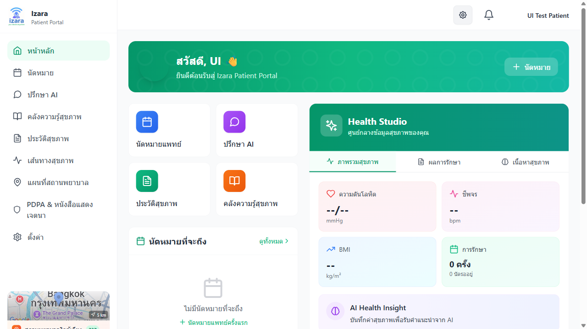

---

### 2.2 Book an Appointment — นัดหมายแพทย์

**Steps to book a new appointment:**

**Step 1: Navigate to Appointments**
- From the Dashboard, click **"นัดหมาย" (Appointments)** in the side menu
- You will see your appointment list (empty if first time)


**Step 2: Click "Book New Appointment"**
- Click the **"จองนัดหมายใหม่" (Book New Appointment)** button
- The booking form will appear

**Step 3: Fill in the Appointment Form**
- **Select Doctor:** Choose a specific doctor or let the system assign one
- **Describe Symptoms:** Type your symptoms/concerns in the text box
- **AI Analysis:** The system will analyze your symptoms and suggest an urgency level
- **Select Date & Time:** Choose your preferred appointment date and time
- **Appointment Type:** Online (telehealth) or Onsite (in-person)
- **Optional:** Invite relatives/consultants via email


**Step 4: Confirm & Submit**
- Review your appointment details
- Click **"ยืนยัน" (Confirm)**
- Your appointment will be created with status **"รอดำเนินการ" (Pending)**


**Step 5: View Appointment Details**
- Click on the appointment card to see full details
- Status will show as **"Pending"** until the doctor confirms


---

### 2.3 Appointment Lifecycle — วงจรการนัดหมาย

Understanding the appointment status flow:

```
📝 Patient Books  →  ⏳ Pending  →  👨‍⚕️ Doctor Reviews  →  ✅ Confirmed  →  📹 Meeting  →  ✔️ Completed
                                          ↓
                                     ❌ Declined
```

| Status | Thai | Description |
|--------|------|-------------|
| **Pending** | รอดำเนินการ | Appointment submitted, waiting for doctor review |
| **Assigned** | มอบหมายแล้ว | Admin assigned to a doctor (from pool) |
| **Confirmed** | ยืนยันแล้ว | Doctor confirmed — meeting link generated |
| **In Progress** | กำลังดำเนินการ | Video meeting is active |
| **Completed** | เสร็จสิ้น | Consultation finished, EMR available |
| **Cancelled** | ยกเลิก | Cancelled by patient or doctor |

**When your appointment is confirmed:**
- You'll receive a notification
- A video meeting link will be auto-generated
- The appointment card will show a **"เข้าร่วมการประชุม" (Join Meeting)** button

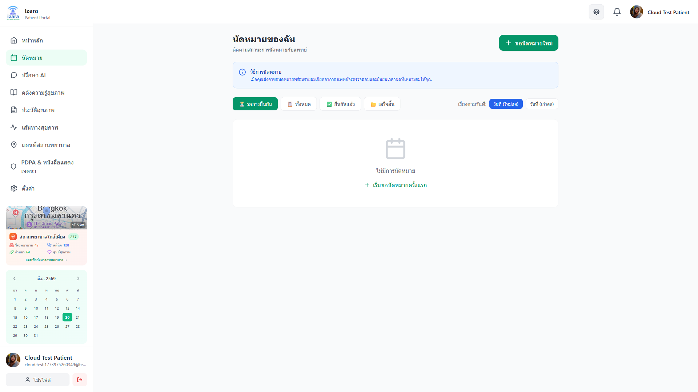


**After the meeting is completed:**


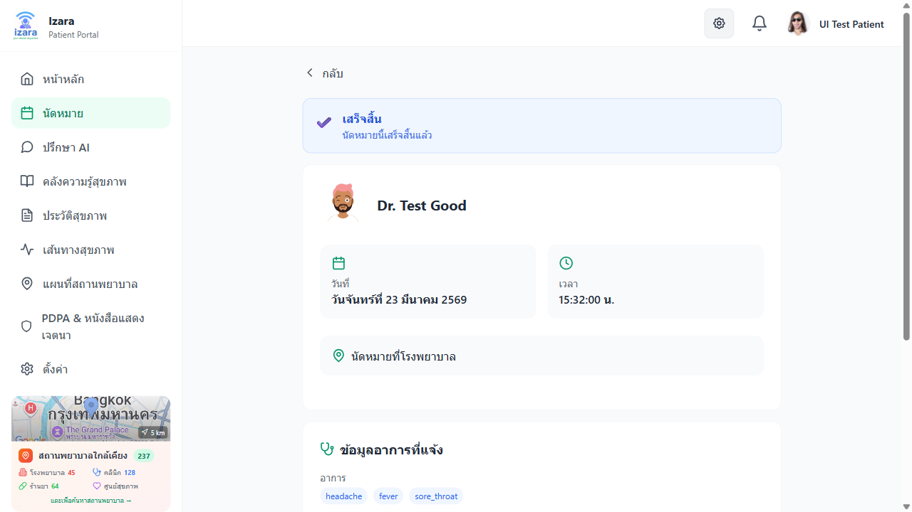

---

### 2.4 Join a Video Meeting — เข้าร่วมวิดีโอคอล

When your appointment is confirmed and the meeting time arrives:

**Step 1: Agreement & Consent**
- Before joining, you must accept the **meeting consent agreement**
- This covers recording consent, PDPA data sharing, and telehealth terms


**Step 2: Pre-Join & Invite Screen**
- After accepting, you'll see the pre-join screen
- Here you can test your camera/microphone
- You can view/share the meeting invite link with family members


**Step 3: Join the Meeting Room**
- Click **"เข้าร่วม" (Join)** to enter the Jitsi video room
- The doctor will approve your entry from the lobby
- Features available during the meeting:
  - 🎥 Video ON/OFF
  - 🎤 Microphone ON/OFF
  - 💬 Text Chat
  - 📱 Screen Sharing


**Step 4: Post-Meeting**
- After the meeting ends, AI will generate:
  - A consultation summary
  - Patient instruction sheet (care instructions, medications, follow-up)
- You can view these in your appointment details and PHR


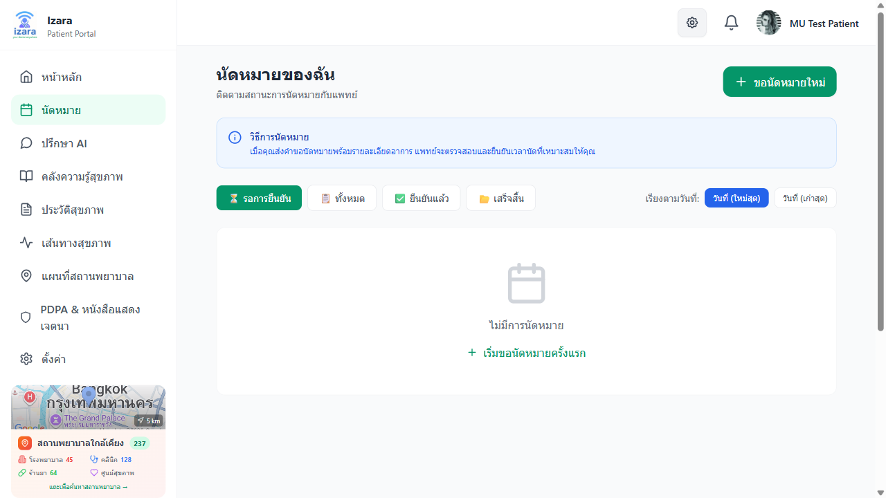

---

### 2.5 Guest Join & Lobby — Microsoft Teams Style

Patients can invite **family, friends, or external participants** to join the video meeting. Guests **do not need an account** — they only enter their name and wait for doctor approval.

**How Guests Join:**

1. **Receive invite link** from patient, e.g. `https://patient-portal/guest-join/meeting-id`
2. **Enter your name** on the Guest Join page (no login, no email required)
3. **Click "ขอเข้าร่วม" (Request to Join)** — the doctor is notified immediately
4. **Wait for approval** — a waiting screen with timer is displayed
5. **Enter the meeting** — once the doctor clicks "Admit", the Jitsi video call opens

**For the Doctor (Host):**

- The **Waiting Room** panel shows all pending lobby participants
- Click **✓ Admit** or **✗ Reject** for each person
- Admin users also join through the lobby — doctor must approve

**Guest Join Pages (Public, No Login Required):**

| Portal | URL |
|--------|-----|
| Patient Portal | `/guest-join/:meetingId` |
| Doctor Portal | `/guest-join/:meetingId` |

---

### 2.6 Personal Health Records (PHR) — ประวัติสุขภาพ

Your PHR is a comprehensive view of your health data, organized in tabs.

**How to access:**
- Click **"สุขภาพของฉัน" (My Health / PHR)** in the side menu


**PHR Tabs Overview:**

| Tab | Thai Name | What It Contains |
|-----|-----------|-----------------|
| **Overview** | ภาพรวม | Latest vitals, active meds, allergies, chronic conditions |
| **Vital Signs** | สัญญาณชีพ | Blood pressure, heart rate, temperature, weight, blood glucose, O₂ |
| **Medications** | ยาที่ใช้ | Current/past medications, dosage, frequency |
| **Allergies** | การแพ้ | Drug allergies, food allergies, severity levels |
| **Lab & Imaging** | ผลแลป/ภาพถ่าย | Lab results, X-ray/ultrasound images, AI analysis |
| **Profile** | ข้อมูลส่วนตัว | Height, weight, blood type, chronic conditions |
| **Lifestyle** | วิถีชีวิต | Diet, exercise, sleep, smoking/alcohol status |


**Adding Health Data:**
1. Navigate to the relevant tab (e.g., Vital Signs)
2. Click **"เพิ่ม" (Add)** button
3. Fill in the values (e.g., blood pressure: 120/80 mmHg)
4. Click **"บันทึก" (Save)**
5. Data is stored in your PHR and visible to authorized doctors

**Lab Reports from Doctor:**
- When your doctor orders lab tests and adds results, they appear in the **Lab & Imaging** tab
- AI analysis of uploaded lab documents is available
- Lab results create entries in your PHR timeline


---

### 2.7 Health Timeline — ไทม์ไลน์สุขภาพ

A chronological view of all your medical events.

**How to access:**
- Click **"ไทม์ไลน์" (Timeline)** in the side menu

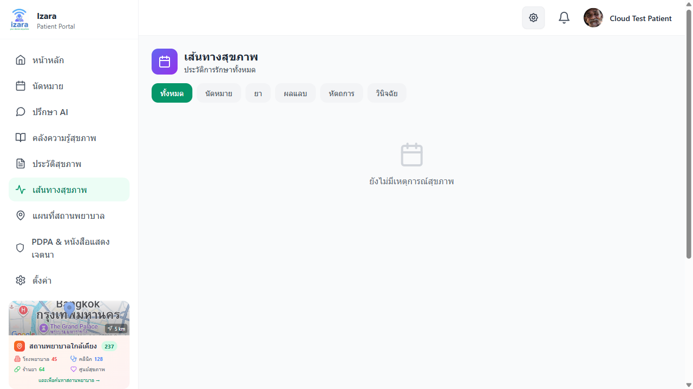


**What appears on the timeline:**
- 📅 Appointment dates (booked, confirmed, completed)
- 💊 Medication changes
- 🔬 Lab results received
- 📝 EMR entries after consultations
- 💉 Procedures and treatments
- 🩺 Diagnosis records

**Filtering:**
- Use the filter buttons at the top to show specific event types
- Click on any timeline card to expand details


---

### 2.8 AI Doctor Consultation — ปรึกษา AI

Chat with an AI-powered health assistant for general health advice.

**How to use:**
1. Click **"AI Doctor"** in the side menu
2. Type your health question in Thai or English
3. The AI will respond with health information and advice
4. You can continue the conversation with follow-up questions


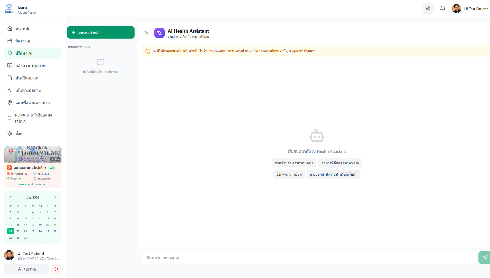


**Features:**
- **Multi-turn Chat:** Continue conversations naturally
- **Session Management:** Save, name, and revisit past chat sessions
- **Bilingual:** Supports both Thai and English
- **Health Education Focus:** Provides educational information

> **⚠️ Disclaimer:** AI Doctor provides general health information only. It is NOT a replacement for professional medical consultation. Always consult a doctor for medical decisions.

---

### 2.9 Health Library — ห้องสมุดสุขภาพ

Browse medical education articles published by doctors.

**How to access:**
- Click **"ห้องสมุด" (Health Library)** in the side menu


**Features:**
- Search articles by keyword or category
- Filter by topic: Diseases, Medications, Wellness, Prevention
- Read articles in Thai (primary) with optional English
- Content verified and approved by admin before publishing

---

### 2.10 Nearby Healthcare Map — แผนที่สถานพยาบาล

Find nearby hospitals, clinics, and pharmacies on an interactive map.

**How to use:**
1. Click **"แผนที่" (Map)** in the side menu
2. Allow location access when prompted
3. The map will show your current location and nearby facilities


**Features:**
- **Interactive Map:** OpenStreetMap-based with facility markers
- **Distance Filter:** Select radius: 1, 3, 5 (default), 10, 15, or 20 km
- **Facility Types:** Hospitals 🏥, Clinics 🩺, Pharmacies 💊, Health Centers
- **Facility Details:** Name, address, phone, distance, opening hours
- **Navigation:** One-tap Google Maps navigation to selected facility

**How to use the distance filter:**
1. Select a distance range from the dropdown (e.g., 5 km)
2. The map refreshes to show only facilities within that radius
3. Facilities are sorted by nearest first

---

### 2.11 Living Will — หนังสือแสดงเจตนา

Create and manage your advance healthcare directive (Living Will) with a guided 4-step wizard.

**How to access:**
- Click **"พินัยกรรมชีวิต" (Living Will)** in the side menu

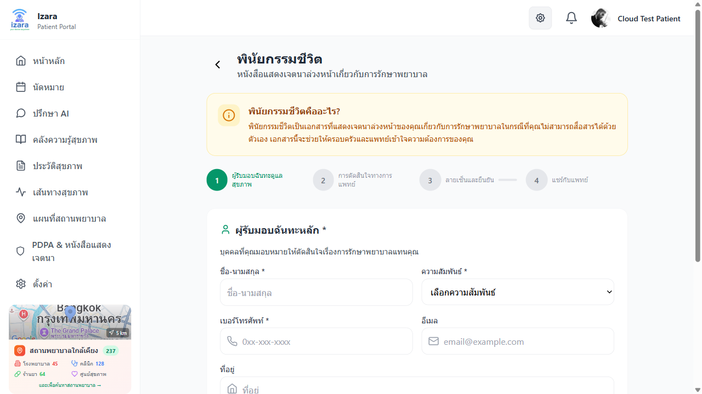


**Step 1: Primary Healthcare Proxy (ตัวแทนหลัก)**
- Enter the name, relationship, and contact details of your primary healthcare proxy
- Relationship options: Spouse, Child, Parent, Sibling, Relative, Close Friend, Other

**Step 2: Alternate Proxy (ตัวแทนสำรอง) — Optional**
- Add a backup healthcare proxy in case the primary is unavailable

**Step 3: Treatment Preferences (ข้อกำหนดการรักษา)**
- Set your preferences for:
  - ❤️ CPR / Resuscitation
  - 🫁 Mechanical Ventilation
  - 🍽️ Artificial Nutrition (tube feeding)
  - 💧 Dialysis
  - 💊 Antibiotics for Life-Threatening Infections
  - 😌 Pain Management & Comfort Care
  - 🫀 Organ Donation
  - 📝 Additional Wishes (free text)

**Step 4: Digital Signature & Sharing**
- Sign digitally to finalize
- Toggle PDPA sharing with authorized doctors


---

### 2.12 PDPA Consent — ความยินยอม PDPA

Manage your data privacy consent under Thailand's Personal Data Protection Act.

**How to access:**
- Click **"PDPA"** in the side menu


**Consent Controls:**
You can individually enable/disable sharing of:
- Demographics (ข้อมูลประชากร)
- Medical History (ประวัติการรักษา)
- Medications (ยาที่ใช้)
- Allergies (การแพ้)
- Lab Results (ผลแลป)
- Imaging Results (ผลภาพถ่าย)
- Prescriptions (ใบสั่งยา)
- Vital Signs (สัญญาณชีพ)
- PHR, EMR, Living Will

**Per-Doctor Controls:** You can set different sharing preferences for each authorized doctor.

---

### 2.13 Profile & Settings — โปรไฟล์และการตั้งค่า

**Profile:**
- View and edit your personal information
- Update avatar, name, contact details
- Set emergency contact information


**Settings:**
- 🌐 **Language:** Switch between Thai and English
- 🎨 **Theme:** Light or Dark mode
- 🔔 **Notifications:** Enable/disable in-app, email, and push notifications
- 🔒 **Privacy:** Data sharing preferences


---

## 3. Doctor Portal — ระบบแพทย์

### 3.1 Doctor Dashboard — แดชบอร์ดแพทย์

The Doctor Dashboard provides an overview of daily work and pending tasks.


**Dashboard Sections:**
- **Welcome Message:** Personalized greeting with today's date
- **Today's Metrics:**
  - Number of appointments today
  - Pending appointments awaiting confirmation
  - Completed consultations count
- **Upcoming Appointments:** List with patient name, time, symptoms preview
  - Quick access to patient history
  - AI pre-consultation summary button
  - "Start Meeting" button for confirmed appointments
- **Pending Documents:** EMR summaries, instruction sheets awaiting validation
- **AI Assistant Panel:** Floating chat button for Gemini AI

---

### 3.2 Schedule Management — จัดการตารางเวลา

Set your availability and view appointment calendar.

**How to access:**
- Click **"ตารางเวลา" (Schedule)** in the side menu


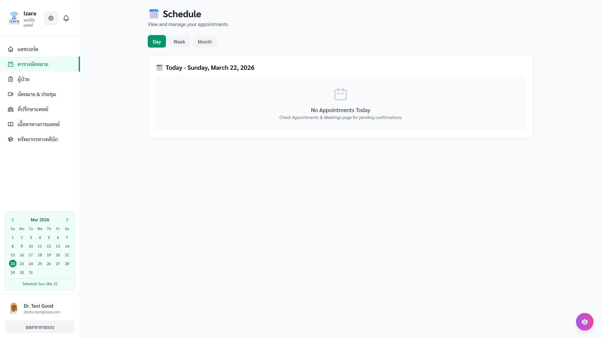


**Setting Availability:**
1. Click on a date/time slot
2. Mark as **Available** or **Unavailable**
3. Set recurring patterns (e.g., every Monday-Friday 9:00-17:00)
4. Block specific dates for vacation/breaks

**Calendar View:**
- Switch between Day, Week, and Month views
- Color-coded appointment statuses
- Click any appointment to view details

---

### 3.3 Patient Queue & Appointment Confirmation

When patients book appointments, they appear in your queue.

**How to access:**
- Click **"สุขภาพการประชุม" (Health Meeting)** in the side menu for the meeting queue
- Or **"การจัดการนัดหมาย" (Appointment Management)** for the full pool


**Confirming an Appointment:**

**Step 1: Review the Request**
- See patient details, symptoms, AI urgency assessment
- Review patient's PHR summary (if PDPA consent given)

**Step 2: Confirm or Decline**
- Click **"ยืนยัน" (Confirm)** to accept the appointment
  - Set final date/time
  - Add optional notes
  - System auto-generates a Jitsi meeting link
  - Patient receives notification
- Or click **"ปฏิเสธ" (Decline)** with a reason


**Doctor Notifications:**
- Notifications appear when new appointments are booked
- Bell icon shows unread count


---

### 3.4 Start & Conduct a Video Meeting

**Step 1: Pre-Meeting Agreement**
- Before starting, accept the meeting agreement (recording consent, PDPA terms)


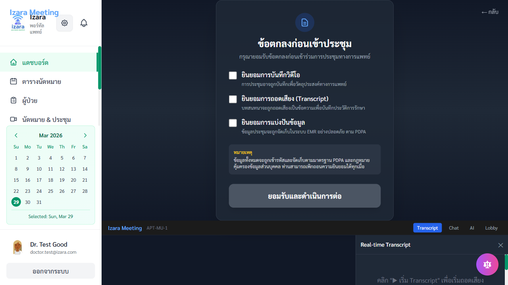

**Step 2: Pre-Join Screen**
- Test camera and microphone
- View patient and guest invite status


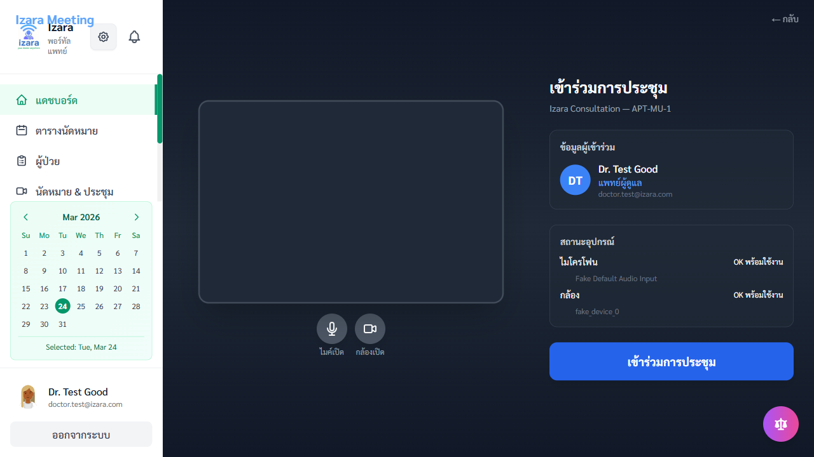

**Step 3: Start Meeting as HOST (Microsoft Teams Style)**
- Click **"เริ่มการประชุม" (Start Meeting)**
- You join as the HOST/moderator
- **Waiting Room (Lobby)** panel shows all pending participants
  - Click **✓ Admit** or **✗ Reject** for each person
  - Guest users join via `/guest-join/:meetingId` with name only (no account needed)
  - Admin users also join through the lobby — you must approve them

**Step 4: During the Meeting**
- **Video/Audio Controls:** Toggle camera and microphone
- **Text Chat:** Send messages to all participants
- **Transcription Controls (Doctor Only):**
  - ▶️ START — Begin real-time transcription
  - ⏸️ PAUSE — Temporarily pause
  - ⏯️ RESUME — Continue transcription
  - ⏹️ STOP — End transcription
- **Speaker Diarization:** Transcript labels speakers (Doctor/Patient/Guest)
- **Language Toggle:** Switch between Thai ↔ English transcription


**Step 5: End Meeting**
- Click **"วางสาย" (Hang Up)** to end the meeting
- AI processing begins automatically

---

### 3.5 Post-Meeting: AI Summary & EMR

After the meeting ends, the AI pipeline activates automatically.

**What AI generates:**
1. **SOAP Summary** — Structured medical summary in OPD Card format
2. **Patient Instruction Sheet** — Patient-friendly care instructions
3. **CDS Recommendations** — Clinical decision support alerts


**Doctor Validation (Man-in-the-Loop):**
AI outputs are NEVER auto-published. The doctor must validate:

| Action | Description |
|--------|-------------|
| ✅ **Approve** | Accept AI output as-is |
| ✏️ **Edit** | Modify specific sections (S/O/A/P) |
| 🔄 **Regenerate** | Request AI to re-generate with refined context |
| ❌ **Reject** | Discard AI output, write manually |


**After approval:**
- EMR is signed and locked
- Patient receives the consultation summary in their PHR
- Lab orders and prescriptions become available
- Timeline entry is created

---

### 3.6 EMR, Prescriptions & Lab Orders

**EMR (Electronic Medical Records):**
- Access patient EMR from the Patients section
- SOAP format: Subjective (S), Objective (O), Assessment (A), Plan (P)
- Digital signature locks the record
- Version history for amendments


**Prescriptions:**
- Create prescriptions linked to the appointment
- Drug name, dosage, frequency, duration
- AI-powered drug interaction and allergy checks
- Patients can view their prescriptions in PHR


**Lab Orders:**
- Order lab tests for patients
- Set priority: Routine, Stat, or Urgent
- Add clinical notes for the lab
- Results appear in patient's PHR when entered


---

### 3.7 Patient Management — จัดการผู้ป่วย

View and manage all patients you have treated.


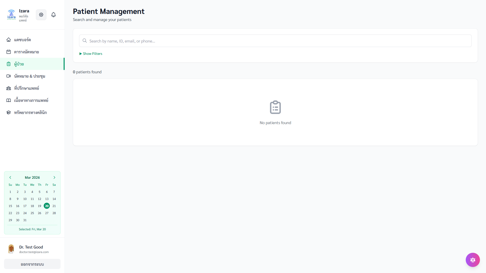


**Features:**
- Search patients by name or ID
- View patient demographics
- Access patient's PHR (with PDPA consent)
- Review appointment history
- View past EMR entries

---

### 3.8 Medical Content Creation — สร้างเนื้อหาทางการแพทย์

Create health education articles for the patient Health Library.

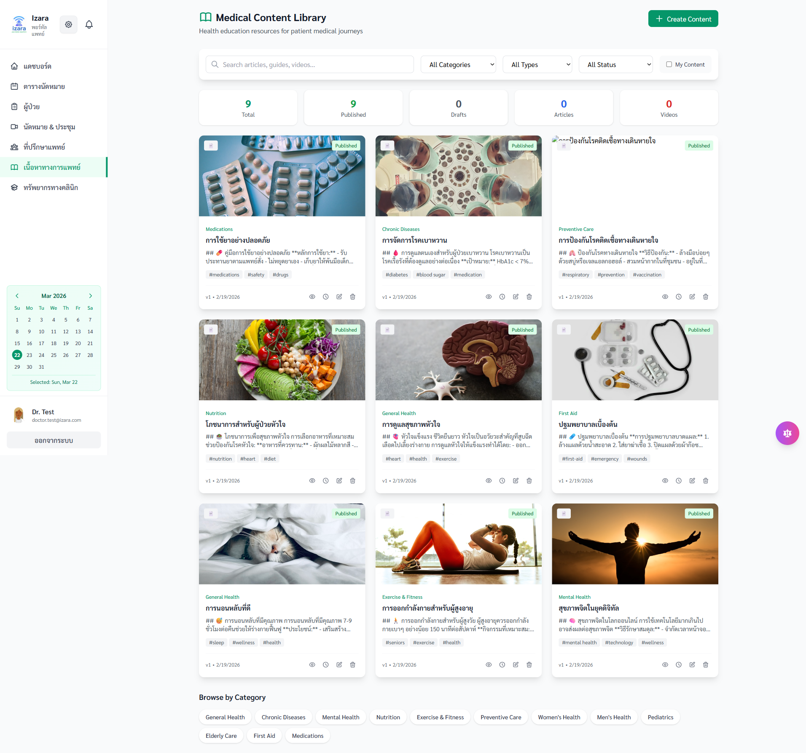


**Creating an Article:**
1. Click **"สร้างบทความ" (Create Article)**
2. Enter title (Thai required, English optional)
3. Write content with formatting support
4. Select category (Diseases, Medications, Wellness, Prevention)
5. Add images if needed
6. Save as **Draft** or **Submit for Approval**

**Article Lifecycle:**
```
📝 Draft → 📤 Submitted → 👑 Admin Reviews → ✅ Published
                                            → ❌ Rejected (revise)
```

> Articles are only visible to patients after admin approval and publishing.

---

### 3.9 Clinical Resources — แหล่งข้อมูลทางคลินิก

Access medical guidelines, protocols, and research papers.


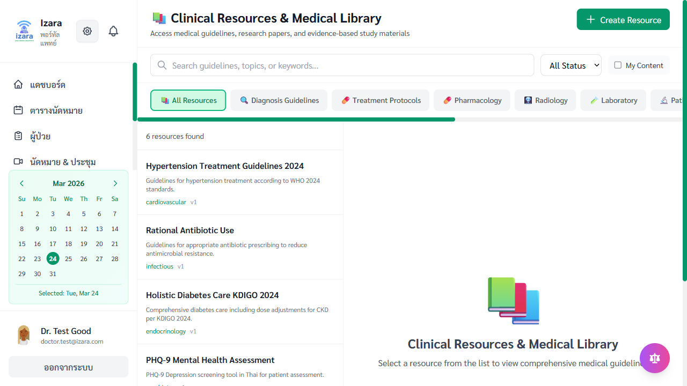

**Features:**
- Search clinical guidelines by keyword or condition
- RAG-powered search for relevant medical information
- Create and submit new clinical resources (admin approval required)
- Rate and review existing resources

---

### 3.10 Medical Consultants Directory — ทำเนียบแพทย์ที่ปรึกษา

Browse and manage specialist consultant directory.


**Features:**
- View all specialist consultants with profile details
- Search by specialty, name, or hospital
- View ratings and reviews from other doctors
- Submit your own rating (1-5 stars) with comments
- Contact information: phone, email, hospital

---

### 3.11 Doctor Profile — โปรไฟล์แพทย์

Manage your professional profile.


**Editable Fields:**
- Display name and avatar
- Medical specialty
- License number
- Hospital/clinic affiliation
- Phone and email
- Experience and qualifications

---

## 4. Admin Features — ระบบผู้ดูแล

Admin features are available to users with the **admin** role in the Doctor Portal.

### 4.1 Admin Dashboard — แดชบอร์ดผู้ดูแล

The Admin Dashboard provides a system-wide overview.


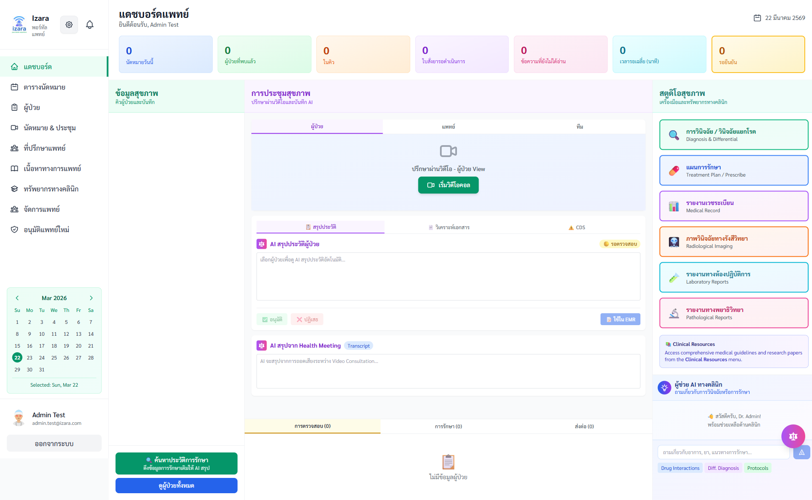


**Admin-Specific Sections:**
- System-wide appointment count
- Pending doctor approvals count
- Pending content submissions
- All user metrics

---

### 4.2 Doctor Registration & Approval

The complete workflow for adding new doctors to the system.

**Overview:**
New doctors cannot access the system until an admin approves their registration.

**Full Workflow:**

**Step 1: Doctor Registers (Self-Service)**
- A doctor registers through the Doctor Portal registration form
- Status is set to **"pending" (รอการอนุมัติ)**


**Step 2: Admin Reviews & Approves**
- Admin navigates to **"จัดการแพทย์" (Doctor Management)**
- The Pending tab shows doctors awaiting approval
- Admin reviews credentials (name, license, specialty)
- Click **"อนุมัติ" (Approve)** to activate the doctor


**Step 3: (Optional) Promote to Admin**
- Admin can promote an approved doctor to admin role
- Click **"เลื่อนเป็นผู้ดูแล" (Promote to Admin)**
- The doctor gains access to all admin features


**Step 4: New Doctor/Admin Logs In**
- The approved doctor can now log in
- If promoted to admin, they see the full admin dashboard


**Doctor Management Tabs:**

| Tab | Description |
|-----|-------------|
| **All** | All registered doctors |
| **Pending** | Awaiting admin approval |
| **Approved** | Active doctors |
| **Rejected** | Declined applications |
| **Admins** | Users with admin privileges |

**Admin Actions:**
- ✅ Approve — Activate doctor account
- ❌ Reject — Decline with reason
- 👑 Promote — Grant admin privileges
- 🔒 Deactivate — Disable account
- ✏️ Edit — Update doctor profile
- 📋 View Details — Full profile modal


---

### 4.3 Appointment Pool Management

Manage system-wide appointments and assign unassigned requests to doctors.


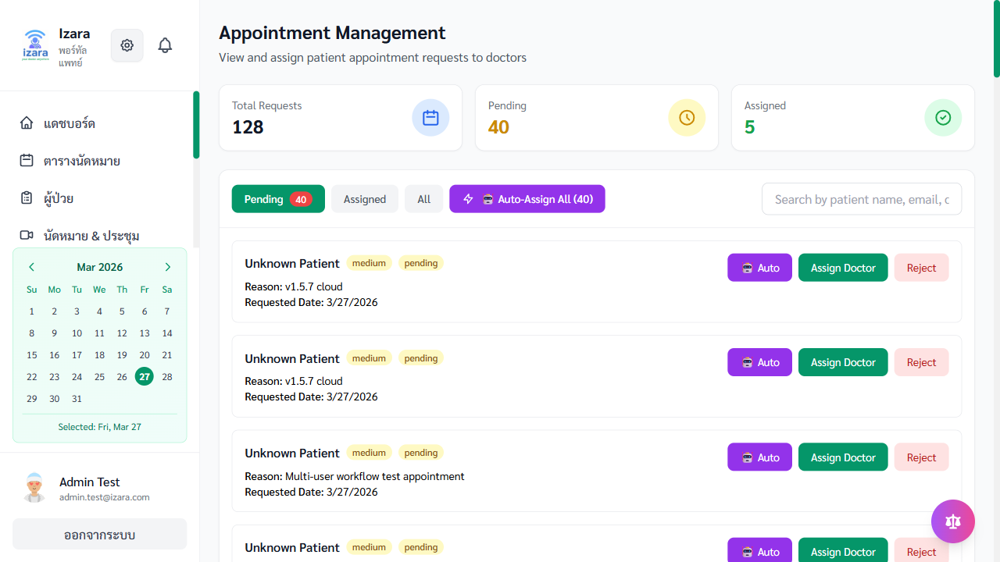

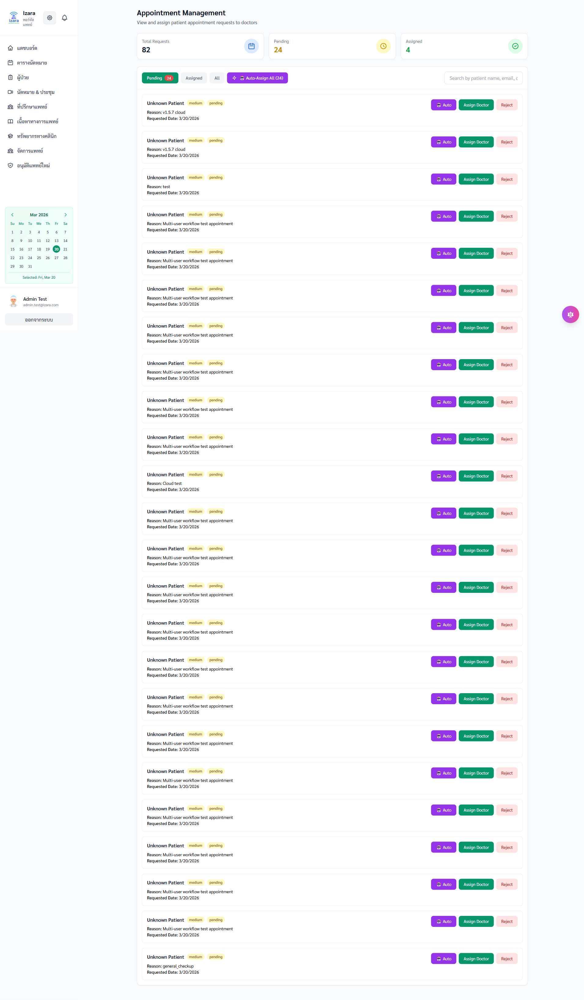

**Features:**
- View all system appointments across all statuses
- Filter by status: Pending, Assigned, Confirmed, Completed
- Assign unassigned appointments to specific doctors
- AI-assisted doctor matching by specialty
- Bulk assignment support
- Track appointment statistics


---

### 4.4 Content & Resource Approval

Review and approve medical content and clinical resources submitted by doctors.

**Medical Content Approval:**
- View submitted articles pending review
- Read full content before approving
- Approve → publishes to patient Health Library
- Reject → returns to doctor for revision


**Clinical Resources Approval:**
- Review submitted clinical guidelines
- Approve for doctor-only resource library
- Track submission and approval history


---

### 4.5 User & Notification Management

**Doctor Schedule Management:**
- View all doctors' schedules
- Override availability settings
- Manage schedule conflicts


**Notification Management:**
- View system-wide notification history
- Manage notification templates
- Track delivery status


**Living Will Administration:**
- View living will submissions
- Audit PDPA compliance


---

## 5. Complete Workflow Examples

### 5.1 Full Telemedicine Consultation Workflow

This is the complete end-to-end workflow from appointment booking to receiving care results.

```
┌─────────────────────────────────────────────────────────────────────┐
│                    FULL CONSULTATION WORKFLOW                        │
├─────────────────────────────────────────────────────────────────────┤
│                                                                     │
│  👤 PATIENT                    👨‍⚕️ DOCTOR                 👑 ADMIN  │
│                                                                     │
│  1. Login                                                           │
│     ↓                                                               │
│  2. Book Appointment                                                │
│     (symptoms, date/time)                                           │
│     ↓                                                               │
│  3. → Pending ──────────→  4. Review in Queue                      │
│                               ↓                                     │
│                            5. Confirm or                            │
│                               Assign ←──── 5a. Pool Assignment     │
│     ↓                         ↓                                     │
│  6. Receive Notification   (Meeting link generated)                 │
│     ↓                         ↓                                     │
│  7. Accept Agreement       8. Accept Agreement                      │
│     ↓                         ↓                                     │
│  9. Pre-Join Screen       10. Start as HOST                         │
│     ↓                         ↓                                     │
│  11. Join Meeting ←──────→ 12. Conduct Meeting                      │
│      (Lobby → Approved)       (Transcription ON)                    │
│     ↓                         ↓                                     │
│  13. Meeting Ends          14. AI generates SOAP + Instructions     │
│                               ↓                                     │
│                            15. Doctor validates AI output            │
│                               ↓                                     │
│                            16. Sign EMR                              │
│                               ↓                                     │
│                            17. Create Prescriptions & Lab Orders     │
│     ↓                         ↓                                     │
│  18. View in PHR           (Results sent to patient)                │
│  19. View on Timeline                                               │
│  20. Download Instructions                                          │
│                                                                     │
└─────────────────────────────────────────────────────────────────────┘
```

**Illustrated Step-by-Step:**

| Step | Action | Screenshot |
|------|--------|------------|
| 1 | Patient logs in |  |
| 2 | Patient dashboard |  |
| 3 | Book appointment |  |
| 4 | Appointment created (pending) |  |
| 5 | Doctor reviews queue |  |
| 6 | Appointment confirmed |  |
| 7 | Patient sees confirmed |  |
| 8 | Doctor accepts agreement |  |
| 9 | Doctor pre-join |  |
| 10 | Patient accepts agreement |  |
| 11 | Patient pre-join |  |
| 12 | Meeting with AI summary |  |
| 13 | Doctor reviews EMR |  |
| 14 | Patient appointments completed |  |
| 15 | Patient PHR updated |  |
| 16 | Patient timeline |  |

---

### 5.2 New Doctor Onboarding Workflow

Complete workflow for registering and activating a new doctor.

```
┌────────────────────────────────────────────────────┐
│           DOCTOR ONBOARDING WORKFLOW                │
├────────────────────────────────────────────────────┤
│                                                    │
│  1. New Doctor registers on Doctor Portal          │
│     ↓                                              │
│  2. Status = "pending" (cannot login yet)          │
│     ↓                                              │
│  3. Admin sees in Doctor Management → Pending tab  │
│     ↓                                              │
│  4. Admin reviews credentials                      │
│     ↓                                              │
│  5a. ✅ Approve → Status = "approved"              │
│  5b. ❌ Reject → Status = "rejected" (with reason) │
│     ↓                                              │
│  6. (Optional) Admin promotes to Admin role        │
│     ↓                                              │
│  7. Doctor can now login and access the portal     │
│     ↓                                              │
│  8. Doctor sets up profile & availability          │
│     ↓                                              │
│  9. Doctor starts receiving appointments           │
│                                                    │
└────────────────────────────────────────────────────┘
```

**Illustrated Steps:**

| Step | Screenshot |
|------|------------|
| 1. Patient registers first | 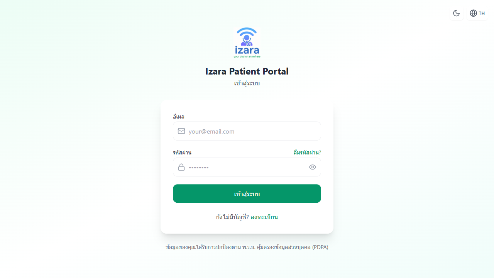 |
| 2. Patient dashboard after registration |  |
| 3. Doctor registers (status: pending) |  |
| 4. Admin approves doctor |  |
| 5. Admin promotes to admin |  |
| 6. New admin accesses portal |  |

---

### 5.3 Content Publishing Workflow

How medical content gets from draft to patient-visible.

```
┌────────────────────────────────────────────────────┐
│          CONTENT PUBLISHING WORKFLOW                 │
├────────────────────────────────────────────────────┤
│                                                    │
│  👨‍⚕️ Doctor:                                      │
│  1. Create medical article (Draft)                 │
│  2. Submit for Approval                            │
│     ↓                                              │
│  👑 Admin:                                         │
│  3. Review submitted content                       │
│  4a. ✅ Approve → Published to Health Library      │
│  4b. ❌ Reject → Returns to Doctor for revision    │
│     ↓                                              │
│  👤 Patient:                                       │
│  5. Browse Health Library → Read approved articles │
│                                                    │
└────────────────────────────────────────────────────┘
```

| Step | Screenshot |
|------|------------|
| Doctor creates content |  |
| Admin reviews & approves |  |
| Patient views in library |  |

---

## 6. Meeting Recording & Transcription

The platform includes full meeting recording and transcription capabilities.

**Recording Features:**
- Meeting video/audio is recorded and stored in the database (BYTEA format)
- Recordings are linked to appointments
- Doctor can review recordings post-meeting

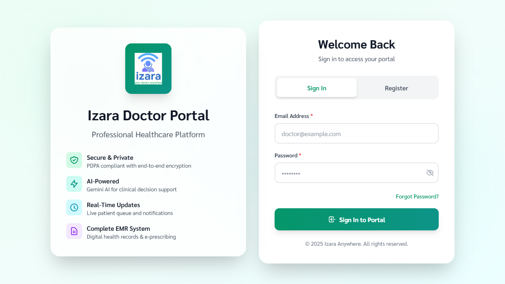

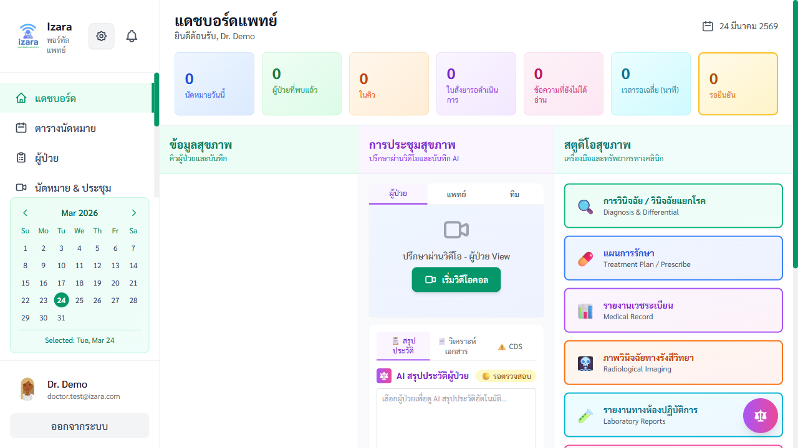


**Transcription Features:**
- Real-time speech-to-text using Web Speech API
- Speaker diarization (identifies who is speaking)
- Supports Thai and English
- Transcript stored in PostgreSQL


**Post-Meeting:**
- AI SOAP summary generated from transcript
- Doctor validates and signs


---

## 7. Notifications

The system sends notifications throughout workflows to keep all parties informed.

**Notification Types:**

| Type | When It's Sent | Who Receives |
|------|---------------|-------------|
| 📅 Appointment Requested | Patient books | Doctor/Admin |
| ✅ Appointment Confirmed | Doctor confirms | Patient |
| ❌ Appointment Cancelled | Either party cancels | Both |
| 📹 Meeting Ready | 15 min before meeting | Patient + Doctor |
| 📹 Meeting Started | Doctor starts meeting | Patient |
| 📄 EMR Ready | Doctor signs EMR | Patient |
| 💊 Prescription Ready | Doctor creates Rx | Patient |
| 🔬 Lab Results Ready | Results entered | Patient |
| 👨‍⚕️ Doctor Approved | Admin approves | Doctor |
| 📝 Content Submitted | Doctor submits article | Admin |
| ⏰ Appointment Reminder | 24h & 1h before | Patient + Doctor |

**Notification Channels:**
- 🔔 In-App (notification bell with count badge)
- 📧 Email (Gmail API)
- 📱 Browser Push Notifications (if enabled)

---

## 8. Troubleshooting & FAQ

### Common Issues

**Q: I can't log in as a doctor.**
> A: New doctor accounts require admin approval. Contact your admin to check if your registration has been approved. See [Section 4.2](#42-doctor-registration--approval).

**Q: My appointment is still "Pending."**
> A: Your appointment is waiting for the doctor to review and confirm. You will receive a notification when it's confirmed.

**Q: I can't join the video meeting.**
> A: Make sure you:
> 1. Accepted the meeting agreement/consent
> 2. Allowed camera and microphone access in your browser
> 3. Are using a supported browser (Chrome recommended)
> 4. The meeting hasn't ended already

**Q: Where can I see my lab results?**
> A: Go to **PHR → Lab & Imaging Results** tab. Results will appear there once your doctor enters them.

**Q: The map doesn't show any facilities.**
> A: Make sure:
> 1. You allowed location access in your browser
> 2. Try increasing the distance filter (10 km or 20 km)
> 3. Check your internet connection

**Q: How do I change the language?**
> A: Go to **Settings → Language** and toggle between Thai and English.

**Q: My AI Doctor chat isn't responding.**
> A: The AI service may need a moment. Try refreshing the page and starting a new session.

**Q: How do I share my health records with a doctor?**
> A: Go to **PDPA Consent** and enable sharing for the specific data types you want to share. You can set different permissions per doctor.

---

## Appendix: Platform Architecture

| Component | URL | Purpose |
|-----------|-----|---------|
| **Patient Portal** | https://patient-portal-url | Patient-facing web application |
| **Doctor Portal** | https://doctor-portal-url | Doctor and Admin web application |
| **Meeting Server** | https://meeting-server-url | Jitsi video meeting management |
| **Database** | PostgreSQL | All data storage (PHR, EMR, appointments) |
| **AI Engine** | Gemini 2.5 Flash Lite | Medical AI features |

---

**© 2026 IZARA Telemedicine Platform — All Rights Reserved**

*This user guide covers v1.5.10 with 215 verified automated tests across 10 test suites.*
