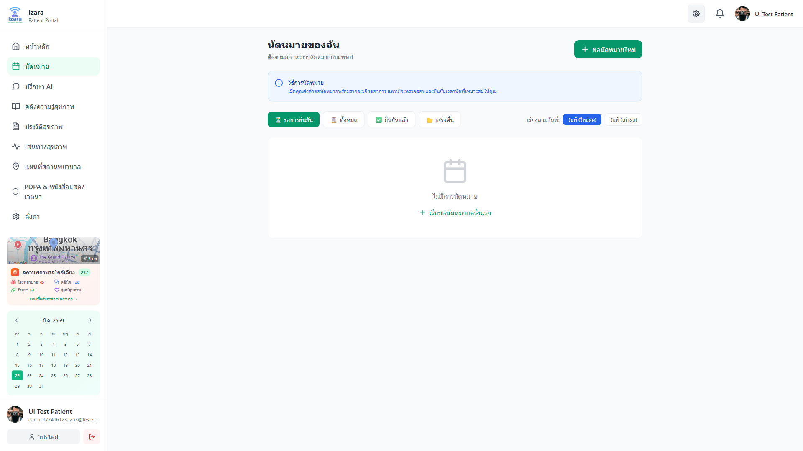
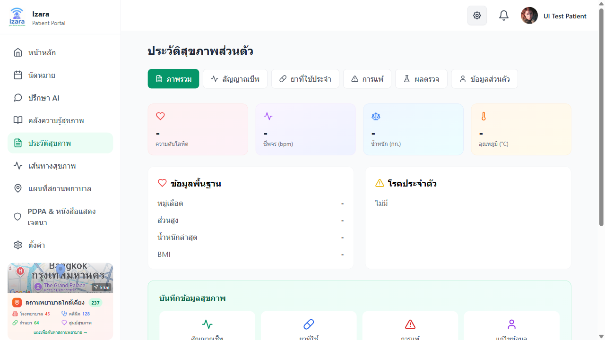
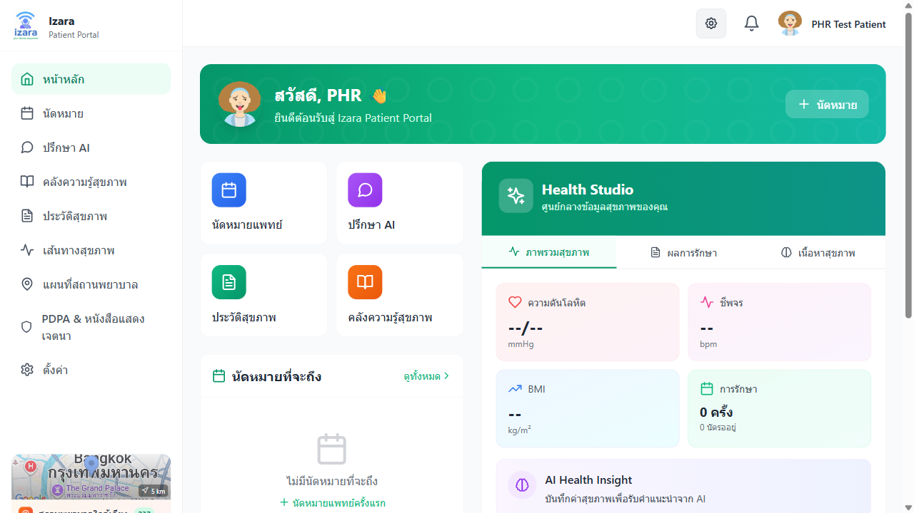
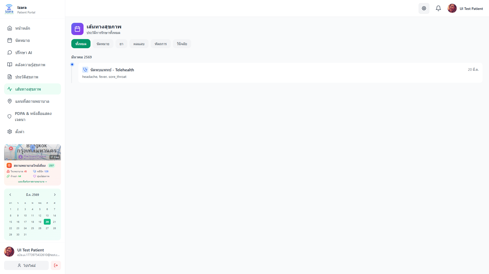
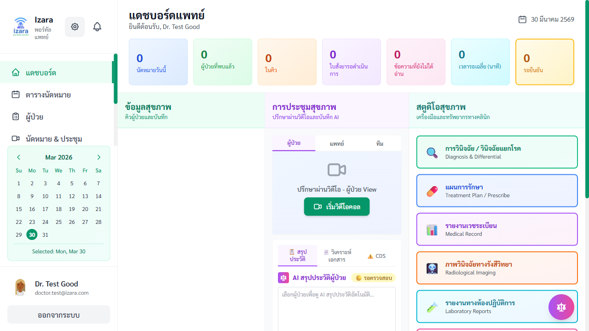
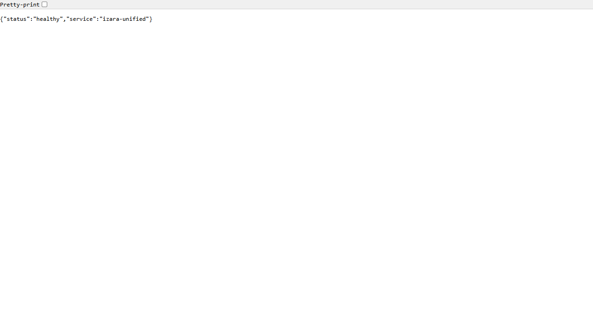

# 📖 คู่มือการใช้งาน IZARA Telemedicine

**เวอร์ชัน 1.5.10** | **วันที่ 28 มีนาคม 2569**

> ระบบแพทย์ทางไกล IZARA — คู่มือสำหรับผู้ป่วย แพทย์ และผู้ดูแลระบบ

---

## สารบัญ

1. [เริ่มต้นการใช้งาน](#1-เริ่มต้นการใช้งาน)
2. [ระบบผู้ป่วย](#2-ระบบผู้ป่วย)
3. [ระบบแพทย์](#3-ระบบแพทย์)
4. [ระบบผู้ดูแล (Admin)](#4-ระบบผู้ดูแล)
5. [กระบวนการให้คำปรึกษาทางไกล](#5-กระบวนการให้คำปรึกษาทางไกล)
6. [กระบวนการลงทะเบียนแพทย์ใหม่](#6-กระบวนการลงทะเบียนแพทย์ใหม่)
7. [ฟีเจอร์ AI และการบันทึก](#7-ฟีเจอร์-ai-และการบันทึก)
8. [ระบบแจ้งเตือน](#8-ระบบแจ้งเตือน)
9. [คำถามที่พบบ่อย](#9-คำถามที่พบบ่อย)

---

## 1. เริ่มต้นการใช้งาน

### 1.1 การลงทะเบียนผู้ป่วย

ผู้ป่วยใหม่สามารถลงทะเบียนด้วยตนเองผ่านระบบผู้ป่วย

**ขั้นตอน:**
1. เปิดเว็บไซต์ระบบผู้ป่วย (Patient Portal)
2. กดปุ่ม **"สมัครสมาชิก"**
3. กรอกข้อมูล: ชื่อ-นามสกุล, อีเมล, รหัสผ่าน, เบอร์โทร, ข้อมูลสุขภาพเบื้องต้น
4. กดปุ่ม **"ลงทะเบียน"** → ระบบจะพาไปหน้าหลักทันที


> 📌 **คำแนะนำ:** หลังลงทะเบียนควรกรอกข้อมูลสุขภาพ (ประวัติการแพ้ยา, โรคประจำตัว) ในหน้า PHR เพื่อให้ AI ช่วยวิเคราะห์ได้ดีขึ้น

---

### 1.2 การเข้าสู่ระบบผู้ป่วย

1. เปิดเว็บไซต์ระบบผู้ป่วย
2. กรอก **อีเมล** และ **รหัสผ่าน**
3. กดปุ่ม **"เข้าสู่ระบบ"** → ระบบจะพาไปหน้าหลัก (Dashboard)


> 🔑 เซสชั่นจะหมดอายุใน 30 นาที ต้องล็อกอินใหม่หลังหมดเวลา

---

### 1.3 การเข้าสู่ระบบแพทย์

แพทย์และผู้ดูแลระบบเข้าสู่ระบบผ่าน Doctor Portal

1. เปิดเว็บไซต์ระบบแพทย์
2. กรอก **อีเมล** และ **รหัสผ่าน**
3. กดปุ่ม **"เข้าสู่ระบบ"**


> ⚠️ แพทย์ใหม่ต้องได้รับ **การอนุมัติจากผู้ดูแลระบบ** ก่อนจึงจะเข้าสู่ระบบได้ (ดูหัวข้อ 6)

---

## 2. ระบบผู้ป่วย

### 2.1 หน้าหลัก (Dashboard)

หน้าหลักแสดง: การนัดหมายที่กำลังจะถึง, ภาพรวมสุขภาพ, ปุ่มลัดจองนัดหมาย/ดู PHR/ปรึกษา AI, กระดิ่งแจ้งเตือน


---

### 2.2 การนัดหมายแพทย์

**ขั้นตอนการจองนัดหมาย:**

**ขั้นที่ 1:** กดเมนู **"นัดหมาย"** ที่แถบด้านข้าง → จะเห็นรายการนัดหมาย


**ขั้นที่ 2:** กดปุ่ม **"จองนัดหมายใหม่"** แล้วกรอกข้อมูล:
- เลือกแพทย์ หรือให้ระบบจับคู่อัตโนมัติ
- อธิบายอาการ (ระบบ AI จะวิเคราะห์ระดับความเร่งด่วน)
- เลือกวันเวลา และประเภท (ออนไลน์/ไปพบที่โรงพยาบาล)
- เชิญญาติหรือผู้ปรึกษาร่วมผ่านอีเมล (ไม่บังคับ)


**ขั้นที่ 3:** ตรวจสอบข้อมูล → กดปุ่ม **"ยืนยัน"** → สถานะจะเป็น **"รอดำเนินการ"**


---

### 2.3 วงจรสถานะการนัดหมาย

```
📝 จองนัดหมาย → ⏳ รอดำเนินการ → 👨‍⚕️ แพทย์ตรวจสอบ → ✅ ยืนยันแล้ว → 📹 ประชุม → ✔️ เสร็จสิ้น
```

| สถานะ | คำอธิบาย |
|--------|---------|
| **รอดำเนินการ** | ส่งคำขอแล้ว รอแพทย์ตรวจสอบ |
| **มอบหมายแล้ว** | ผู้ดูแลมอบหมายให้แพทย์แล้ว |
| **ยืนยันแล้ว** | แพทย์ยืนยัน — ลิงก์ประชุมพร้อมใช้ |
| **กำลังดำเนินการ** | กำลังประชุมวิดีโออยู่ |
| **เสร็จสิ้น** | ปรึกษาเสร็จ ดูผลสรุปและ EMR ได้ |
| **ยกเลิก** | ถูกยกเลิกโดยผู้ป่วยหรือแพทย์ |

เมื่อนัดหมาย **ยืนยันแล้ว** → จะได้รับแจ้งเตือน + ลิงก์วิดีโอ + ปุ่ม **"เข้าร่วมการประชุม"**


เมื่อการประชุม **เสร็จสิ้น:**



---

### 2.4 การเข้าร่วมวิดีโอคอล

**ขั้นที่ 1: ยอมรับข้อตกลง** — ต้องยอมรับเงื่อนไขการบันทึก, PDPA และการแพทย์ทางไกล


**ขั้นที่ 2: หน้าเตรียมก่อนเข้าร่วม** — ทดสอบกล้อง/ไมโครโฟน + ดูลิงก์เชิญสำหรับญาติ


**ขั้นที่ 3: เข้าห้องประชุม** — กดปุ่ม **"เข้าร่วม"** → รอแพทย์อนุมัติจาก Lobby
- 🎥 เปิด/ปิดกล้อง
- 🎤 เปิด/ปิดไมค์
- 💬 แชทข้อความ
- 📱 แชร์หน้าจอ


**ขั้นที่ 4: หลังการประชุม** — AI จะสร้างสรุปการปรึกษา + คำแนะนำผู้ป่วย → ดูได้ที่หน้า PHR


---

### 2.5 ประวัติสุขภาพส่วนบุคคล (PHR)

กดเมนู **"สุขภาพของฉัน"** เพื่อเข้าสู่หน้า PHR ที่มี 7 แท็บ:

| แท็บ | เนื้อหา |
|------|--------|
| **ภาพรวม** | สัญญาณชีพล่าสุด ยา การแพ้ โรคประจำตัว |
| **สัญญาณชีพ** | ความดัน ชีพจร อุณหภูมิ น้ำหนัก น้ำตาล ออกซิเจน |
| **ยาที่ใช้** | ชื่อยา ขนาด ความถี่ สถานะ |
| **การแพ้** | สารก่อภูมิแพ้ ประเภท ความรุนแรง อาการ |
| **ผลแลป/ภาพถ่าย** | ผลแลป ภาพ X-ray AI วิเคราะห์ |
| **ข้อมูลส่วนตัว** | ส่วนสูง น้ำหนัก กรุ๊ปเลือด |
| **วิถีชีวิต** | อาหาร ออกกำลังกาย การนอน สูบบุหรี่ แอลกอฮอล์ |




**การเพิ่มข้อมูล:** เลือกแท็บ → กดปุ่ม **"เพิ่ม"** → กรอกค่า → กดปุ่ม **"บันทึก"**



**ผลแลปจากแพทย์:** เมื่อแพทย์สั่งตรวจและบันทึกผล จะปรากฏในแท็บ **ผลแลป/ภาพถ่าย** อัตโนมัติ


---

### 2.6 ไทม์ไลน์สุขภาพ

กดเมนู **"ไทม์ไลน์"** เพื่อดูเหตุการณ์ทางการแพทย์ทั้งหมดเรียงตามเวลา:
- 📅 วันนัดหมาย
- 💊 การเปลี่ยนแปลงยา
- 🔬 ผลแลปที่ได้รับ
- 📝 บันทึก EMR
- 🩺 การวินิจฉัย

ใช้ปุ่มกรองด้านบนเพื่อกรองตามประเภทเหตุการณ์ กดการ์ดเพื่อขยายดูรายละเอียด




---

### 2.7 ปรึกษา AI Doctor

แชทกับ AI สำหรับคำแนะนำสุขภาพเบื้องต้น:

1. กดเมนู **"AI Doctor"**
2. พิมพ์คำถามสุขภาพ (ไทยหรืออังกฤษ)
3. AI จะตอบพร้อมคำแนะนำ สามารถสนทนาต่อเนื่องได้
4. บันทึกเซสชั่น หรือเปิดเซสชั่นเก่าได้


> ⚠️ AI Doctor ให้ข้อมูลสุขภาพทั่วไปเท่านั้น **ไม่ใช่การวินิจฉัยโรค** ควรปรึกษาแพทย์จริงเสมอ

---

### 2.8 ห้องสมุดสุขภาพ

กดเมนู **"ห้องสมุด"** เพื่ออ่านบทความสุขภาพที่เขียนโดยแพทย์และผ่านการอนุมัติแล้ว

- ค้นหาตามคำสำคัญหรือหมวดหมู่ (โรค ยา สุขภาวะ การป้องกัน)
- เนื้อหาเป็นภาษาไทยเป็นหลัก


---

### 2.9 แผนที่สถานพยาบาลใกล้เคียง

กดเมนู **"แผนที่"** → อนุญาตตำแหน่ง GPS

- **แผนที่แบบโต้ตอบ** แสดงโรงพยาบาล คลินิก ร้านยา
- **ฟิลเตอร์ระยะทาง:** 1, 3, 5 (ค่าเริ่มต้น), 10, 15, 20 กม.
- **ข้อมูลสถานพยาบาล:** ชื่อ ที่อยู่ เบอร์โทร ระยะทาง เวลาเปิด
- **นำทาง:** กดเพื่อเปิด Google Maps นำทางได้ทันที


---

### 2.10 พินัยกรรมชีวิต (Living Will)

กดเมนู **"พินัยกรรมชีวิต"** เพื่อสร้างหนังสือแสดงเจตนาล่วงหน้า ผ่านวิซาร์ด 4 ขั้นตอน:

| ขั้นตอน | เนื้อหา |
|---------|--------|
| **1. ตัวแทนหลัก** | ชื่อ ความสัมพันธ์ ข้อมูลติดต่อ |
| **2. ตัวแทนสำรอง** | ผู้แทนสำรองกรณีตัวแทนหลักไม่สะดวก (ไม่บังคับ) |
| **3. ข้อกำหนดการรักษา** | CPR, เครื่องช่วยหายใจ, ให้อาหารทางสาย, ฟอกไต, ยาปฏิชีวนะ, การจัดการความเจ็บปวด, บริจาคอวัยวะ |
| **4. ลงนามดิจิทัล** | ลายเซ็นดิจิทัล + เปิด/ปิดการแชร์กับแพทย์ |


---

### 2.11 ความยินยอม PDPA

กดเมนู **"PDPA"** เพื่อจัดการสิทธิ์การแชร์ข้อมูลตาม พ.ร.บ.คุ้มครองข้อมูลส่วนบุคคล

- เปิด/ปิดการแชร์ทีละประเภท: ข้อมูลประชากร, ประวัติรักษา, ยา, การแพ้, ผลแลป, ใบสั่งยา, สัญญาณชีพ, PHR, EMR, พินัยกรรม
- ตั้งค่าต่างกันสำหรับแพทย์แต่ละท่านได้


---

### 2.12 โปรไฟล์และการตั้งค่า

**โปรไฟล์:** แก้ไขรูปโปรไฟล์ ชื่อ ข้อมูลติดต่อ ผู้ติดต่อฉุกเฉิน

**การตั้งค่า:**
- 🌐 เปลี่ยนภาษา (ไทย/อังกฤษ)
- 🎨 ธีม (สว่าง/มืด)
- 🔔 การแจ้งเตือน (ในแอป/อีเมล/push)
- 🔒 ความเป็นส่วนตัว


---

## 3. ระบบแพทย์

### 3.1 แดชบอร์ดแพทย์

แสดง: ตัวเลขนัดหมายวันนี้, นัดหมายที่กำลังมาถึง, EMR รอตรวจสอบ, AI Assistant


---

### 3.2 การจัดการตารางเวลา

กดเมนู **"ตารางเวลา"** → กดวัน/เวลาเพื่อตั้งว่าง/ไม่ว่าง ตั้งตารางซ้ำได้ สลับมุมมองวัน/สัปดาห์/เดือน


---

### 3.3 คิวผู้ป่วยและยืนยันนัดหมาย

กดเมนู **"สุขภาพการประชุม"** → ดูคิวนัดหมาย → ตรวจสอบอาการ + AI วิเคราะห์ → กดปุ่ม **"ยืนยัน"** (ระบบสร้างลิงก์ Jitsi อัตโนมัติ + ส่งแจ้งเตือนผู้ป่วย) หรือ **"ปฏิเสธ"** พร้อมเหตุผล


---

### 3.4 การเริ่มและดำเนินการประชุมวิดีโอ

**ขั้นที่ 1:** ยอมรับข้อตกลงการประชุม (บันทึก, PDPA)


**ขั้นที่ 2:** หน้าเตรียมก่อนเข้าร่วม — ทดสอบกล้อง/ไมค์ ดูสถานะผู้เข้าร่วม


**ขั้นที่ 3:** เข้าร่วมในฐานะ **HOST** (ผู้ดำเนินรายการ)
- อนุมัติผู้ป่วยและแขกจาก Lobby
- ควบคุมการถอดเสียง: ▶️ เริ่ม, ⏸️ หยุดชั่วคราว, ⏯️ ทำต่อ, ⏹️ หยุด
- ระบบแยกผู้พูดอัตโนมัติ (แพทย์/ผู้ป่วย/แขก)
- สลับภาษาถอดเสียงได้ (ไทย ↔ อังกฤษ)


**ขั้นที่ 4:** กดปุ่ม **"วางสาย"** เพื่อจบการประชุม → AI เริ่มประมวลผลอัตโนมัติ

---

### 3.5 หลังการประชุม: AI สรุปและ EMR

หลังประชุมจบ AI จะสร้างอัตโนมัติ:
- **สรุป SOAP** — เวชระเบียนในรูปแบบ OPD Card มาตรฐาน
- **คำแนะนำผู้ป่วย** — คำแนะนำการดูแลตัวเองเป็นภาษาง่าย
- **CDS** — เตือนปฏิกิริยาระหว่างยา ขนาดยา และการแพ้


**แพทย์ต้องตรวจสอบก่อนเผยแพร่ (Man-in-the-Loop):**

| การดำเนินการ | คำอธิบาย |
|-------------|---------|
| ✅ **อนุมัติ** | ยอมรับผลลัพธ์ AI ตามที่เป็น |
| ✏️ **แก้ไข** | ปรับแก้เฉพาะส่วน (S/O/A/P) |
| 🔄 **สร้างใหม่** | ให้ AI สร้างใหม่ด้วยบริบทเพิ่ม |
| ❌ **ปฏิเสธ** | ทิ้งผลลัพธ์ AI เขียนเอง |


หลังอนุมัติ → EMR ถูกล็อก + ผู้ป่วยเห็นสรุปใน PHR + สร้างรายการใน Timeline

---

### 3.6 EMR, ใบสั่งยา และคำสั่งตรวจแลป

**EMR (เวชระเบียนอิเล็กทรอนิกส์):**
- รูปแบบ SOAP: ประวัติ (S), ตรวจร่างกาย (O), วินิจฉัย (A), แผนการรักษา (P)
- ลงลายเซ็นดิจิทัลเพื่อล็อก + เก็บประวัติเวอร์ชัน


**ใบสั่งยา:**
- ชื่อยา ขนาด ความถี่ ระยะเวลา
- AI ตรวจสอบปฏิกิริยาระหว่างยา + การแพ้


**คำสั่งตรวจแลป:**
- เลือกรายการตรวจ ความเร่งด่วน (ปกติ/ด่วน/ด่วนมาก)
- เพิ่มหมายเหตุทางคลินิก
- ผลแลปจะปรากฏในหน้า PHR ของผู้ป่วยอัตโนมัติ


---

### 3.7 จัดการผู้ป่วย

กดเมนู **"ผู้ป่วย"** เพื่อดูรายชื่อผู้ป่วยที่เคยรักษา

- ค้นหาด้วยชื่อ อีเมล หรือ ID
- ดูข้อมูลประชากร PHR (ตาม PDPA consent) ประวัตินัดหมาย EMR เก่า


---

### 3.8 สร้างเนื้อหาทางการแพทย์

กดเมนู **"เนื้อหาทางการแพทย์"** เพื่อสร้างบทความสุขภาพสำหรับห้องสมุดผู้ป่วย

1. กดปุ่ม **"สร้างบทความ"**
2. กรอกหัวข้อ เนื้อหา (ไทยเป็นหลัก) หมวดหมู่
3. บันทึกเป็น **ฉบับร่าง** หรือ **ส่งขออนุมัติ**
4. ผู้ดูแลตรวจสอบ → อนุมัติ → เผยแพร่ในห้องสมุด

```
📝 ฉบับร่าง → 📤 ส่งขออนุมัติ → 👑 ผู้ดูแลตรวจ → ✅ เผยแพร่
```


---

### 3.9 ทรัพยากรทางคลินิก

กดเมนู **"ทรัพยากรทางคลินิก"** เพื่อเข้าถึงแนวทางเวชปฏิบัติ งานวิจัย และโปรโตคอลทางการแพทย์

- ค้นหาด้วยคำสำคัญ (ระบบ RAG ช่วยค้นหา)
- ให้คะแนนและรีวิวทรัพยากร


---

### 3.10 ทำเนียบแพทย์ที่ปรึกษา

กดเมนู **"แพทย์ที่ปรึกษา"** เพื่อดูรายชื่อแพทย์ผู้เชี่ยวชาญ

- ชื่อ ความเชี่ยวชาญ โรงพยาบาล อีเมล เบอร์โทร
- ค้นหาตามสาขาเฉพาะทาง
- ดูคะแนนและรีวิวจากแพทย์ท่านอื่น
- ให้คะแนน (1-5 ดาว) พร้อมความคิดเห็น


---

### 3.11 โปรไฟล์แพทย์

กดเมนู **"โปรไฟล์"** เพื่อจัดการข้อมูลวิชาชีพ

- รูปโปรไฟล์ ชื่อ ความเชี่ยวชาญ
- เลขที่ใบอนุญาตประกอบวิชาชีพ
- โรงพยาบาล/คลินิก เบอร์โทร อีเมล
- ประสบการณ์ คุณวุฒิ


---

## 4. ระบบผู้ดูแล

ฟีเจอร์ผู้ดูแลอยู่ใน Doctor Portal สำหรับผู้ใช้ที่มีบทบาท **admin**

### 4.1 แดชบอร์ดผู้ดูแล

แดชบอร์ดแสดงข้อมูลภาพรวมทั้งระบบ: จำนวนนัดหมาย, แพทย์รออนุมัติ, เนื้อหาที่ส่งมา



---

### 4.2 อนุมัติและจัดการแพทย์

กดเมนู **"จัดการแพทย์"** เพื่อดูรายชื่อแพทย์ทั้งหมดพร้อมสถานะ

**แท็บ:**
| แท็บ | คำอธิบาย |
|------|---------|
| ทั้งหมด | แพทย์ทุกคนในระบบ |
| รออนุมัติ | แพทย์ที่รอการอนุมัติ |
| อนุมัติแล้ว | แพทย์ที่ใช้งานอยู่ |
| ปฏิเสธ | แพทย์ที่ถูกปฏิเสธ |
| ผู้ดูแล | ผู้ใช้ที่มีสิทธิ์ admin |

**การดำเนินการของผู้ดูแล:**
- ✅ **อนุมัติ** — เปิดใช้งานบัญชีแพทย์
- ❌ **ปฏิเสธ** — ปฏิเสธพร้อมเหตุผล
- 👑 **เลื่อนเป็นผู้ดูแล** — ให้สิทธิ์ admin
- 🔒 **ปิดการใช้งาน** — ระงับบัญชี
- 📋 **ดูรายละเอียด** — ดูข้อมูลครบถ้วน


---

### 4.3 จัดการคิวนัดหมาย

กดเมนู **"จัดการนัดหมาย"** เพื่อดูนัดหมายทั้งระบบ

- ดูทุกสถานะ: รอดำเนินการ, มอบหมาย, ยืนยัน, เสร็จสิ้น
- **มอบหมายแพทย์:** เลือกแพทย์ตามความเชี่ยวชาญ (AI ช่วยแนะนำ)
- **ดำเนินการเป็นกลุ่ม:** มอบหมายหลายนัดหมายพร้อมกัน


---

### 4.4 อนุมัติเนื้อหาและทรัพยากร

ตรวจสอบบทความ/ทรัพยากรที่แพทย์ส่งมา → อนุมัติ/ปฏิเสธ → เผยแพร่ในห้องสมุด


---

### 4.5 จัดการผู้ใช้และการแจ้งเตือน

ดูตารางเวลาแพทย์ทุกท่าน, จัดการเท็มเพลตการแจ้งเตือน, ตรวจสอบ PDPA compliance


---

## 5. กระบวนการให้คำปรึกษาทางไกล

**ลำดับขั้นตอน:** ผู้ป่วยจองนัดหมาย → แพทย์ยืนยัน → ทั้งสองฝ่ายยอมรับข้อตกลง → เข้าประชุมวิดีโอ → AI สรุป SOAP → แพทย์ตรวจสอบ/ลงนาม EMR → ผู้ป่วยดูผลใน PHR/ไทม์ไลน์

| ขั้นตอน | ภาพ |
|---------|-----|
| 1. ผู้ป่วยจอง → แพทย์ยืนยัน |  |
| 2. เข้าห้องประชุมวิดีโอ |  |
| 3. AI สรุป SOAP → แพทย์ลงนาม |  |
| 4. ผู้ป่วยดูผลใน PHR + ไทม์ไลน์ |  |

---

## 6. กระบวนการลงทะเบียนแพทย์ใหม่

```
1. แพทย์ลงทะเบียน → 2. สถานะ "รออนุมัติ" → 3. ผู้ดูแลตรวจสอบ
→ 4. อนุมัติ/ปฏิเสธ → 5. (ไม่บังคับ) เลื่อนเป็นผู้ดูแล → 6. แพทย์เข้าสู่ระบบได้
```

| ขั้นตอน | การดำเนินการ | ภาพ |
|---------|-------------|-----|
| 1 | แพทย์ลงทะเบียน (สถานะ: pending) |  |
| 2 | ผู้ดูแลอนุมัติแพทย์ |  |
| 3 | ผู้ดูแลเลื่อนเป็น admin |  |
| 4 | แพทย์ใหม่เข้าสู่ระบบได้ |  |

---

## 7. ฟีเจอร์ AI และการบันทึก

### 7.1 AI สำหรับแพทย์

| ฟีเจอร์ | คำอธิบาย |
|---------|---------|
| **สรุปก่อนปรึกษา** | AI วิเคราะห์ PHR + คำขอนัดหมาย สร้างบริบทให้แพทย์ก่อนประชุม |
| **CDS** | ตรวจสอบปฏิกิริยาระหว่างยา ขนาดยา การแพ้ |
| **วิเคราะห์เอกสาร** | AI อ่าน PDF/ผลแลป สกัดข้อมูลทางการแพทย์ |
| **สรุป SOAP อัตโนมัติ** | ประมวลผลบทถอดเสียง + แชท → สร้าง EMR รูปแบบ SOAP |




### 7.2 การบันทึกการประชุม

- วิดีโอ/เสียงถูกบันทึกและจัดเก็บในฐานข้อมูล (BYTEA)
- การถอดเสียงเรียลไทม์ด้วย Web Speech API (ฟรี)
- แยกผู้พูดอัตโนมัติ (Speaker Diarization)
- รองรับภาษาไทยและอังกฤษ
- แพทย์เรียกดูบันทึกหลังประชุมได้


---

## 8. ระบบแจ้งเตือน

| ประเภท | เมื่อใด | ส่งถึง |
|--------|---------|------|
| 📅 ขอนัดหมาย | ผู้ป่วยจองนัดหมาย | แพทย์/ผู้ดูแล |
| ✅ ยืนยันนัดหมาย | แพทย์ยืนยัน | ผู้ป่วย |
| ❌ ยกเลิกนัดหมาย | ฝ่ายใดฝ่ายหนึ่งยกเลิก | ทั้งสอง |
| 📹 ประชุมพร้อม | 15 นาทีก่อนประชุม | ผู้ป่วย + แพทย์ |
| 📹 เริ่มประชุม | แพทย์เริ่มประชุม | ผู้ป่วย |
| 📄 EMR พร้อม | แพทย์ลงนาม EMR | ผู้ป่วย |
| 💊 ใบสั่งยาพร้อม | แพทย์สร้างใบสั่งยา | ผู้ป่วย |
| 🔬 ผลแลปพร้อม | บันทึกผลแลป | ผู้ป่วย |
| 👨‍⚕️ อนุมัติแพทย์ | ผู้ดูแลอนุมัติ | แพทย์ |
| ⏰ เตือนนัดหมาย | 24 ชม. + 1 ชม. ก่อน | ผู้ป่วย + แพทย์ |

**ช่องทาง:** 🔔 ในแอป (กระดิ่ง) • 📧 อีเมล (Gmail API) • 📱 Push Notification

---

## 9. คำถามที่พบบ่อย

**ถ: เข้าสู่ระบบแพทย์ไม่ได้**
> ตอบ: บัญชีแพทย์ใหม่ต้องรอผู้ดูแลอนุมัติ ติดต่อผู้ดูแลระบบ (ดูหัวข้อ 6)

**ถ: นัดหมายยังเป็น "รอดำเนินการ" อยู่**
> ตอบ: นัดหมายกำลังรอแพทย์ตรวจสอบ จะได้รับแจ้งเตือนเมื่อยืนยัน

**ถ: เข้าร่วมวิดีโอคอลไม่ได้**
> ตอบ: ตรวจสอบว่า (1) ยอมรับข้อตกลงแล้ว (2) อนุญาตกล้อง/ไมค์ในเบราว์เซอร์ (3) ใช้ Chrome (4) ประชุมยังไม่จบ

**ถ: ดูผลแลปได้ที่ไหน**
> ตอบ: ไปที่ **PHR → แท็บ ผลแลป/ภาพถ่าย** ผลจะปรากฏเมื่อแพทย์บันทึก

**ถ: แผนที่ไม่แสดงสถานพยาบาล**
> ตอบ: ตรวจสอบว่าอนุญาตตำแหน่ง GPS + ลองเพิ่มระยะฟิลเตอร์ (10-20 กม.)

**ถ: เปลี่ยนภาษาได้อย่างไร**
> ตอบ: ไปที่ **การตั้งค่า → ภาษา** สลับระหว่างไทยและอังกฤษ

**ถ: AI Doctor ไม่ตอบ**
> ตอบ: ลองรีเฟรชหน้า + เริ่มเซสชั่นใหม่ บริการ AI อาจต้องใช้เวลาสักครู่

**ถ: แชร์ข้อมูลสุขภาพกับแพทย์ได้อย่างไร**
> ตอบ: ไปที่ **PDPA** เปิดการแชร์ทีละประเภท ตั้งค่าต่างกันสำหรับแพทย์แต่ละท่านได้

**ถ: ลืมรหัสผ่าน**
> ตอบ: กดปุ่ม **"ลืมรหัสผ่าน"** ที่หน้าล็อกอิน ระบบจะส่งลิงก์ตั้งรหัสใหม่ทางอีเมล

**ถ: ใบสั่งยาดูได้ที่ไหน**
> ตอบ: ดูได้ที่หน้า PHR หลังแพทย์สร้างใบสั่งยาเสร็จ จะปรากฏในประวัติสุขภาพ

**ถ: ข้อมูลของฉันปลอดภัยไหม**
> ตอบ: ระบบเข้ารหัสข้อมูลด้วย JWT + PostgreSQL, ปฏิบัติตาม PDPA, ผู้ป่วยควบคุมสิทธิ์การแชร์เอง

**ถ: สามารถเชิญญาติเข้าร่วมประชุมวิดีโอได้ไหม**
> ตอบ: ได้ เมื่อจองนัดหมายสามารถเชิญผ่านอีเมล แขกเข้าร่วมผ่านลิงก์โดยไม่ต้องลงทะเบียน

---

**© 2569 ระบบแพทย์ทางไกล IZARA — สงวนลิขสิทธิ์**

*คู่มือเวอร์ชัน 1.5.10 • ผ่านการทดสอบอัตโนมัติ 215 รายการ จาก 10 ไฟล์ทดสอบ*
