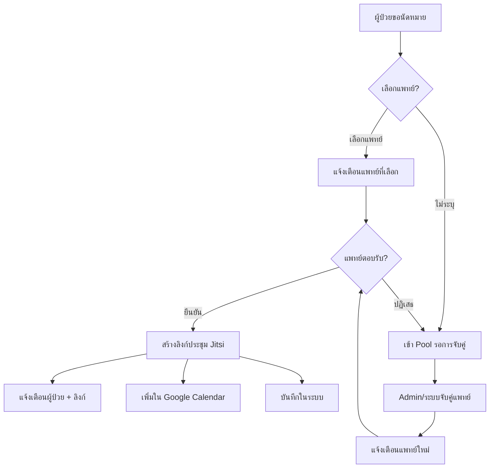
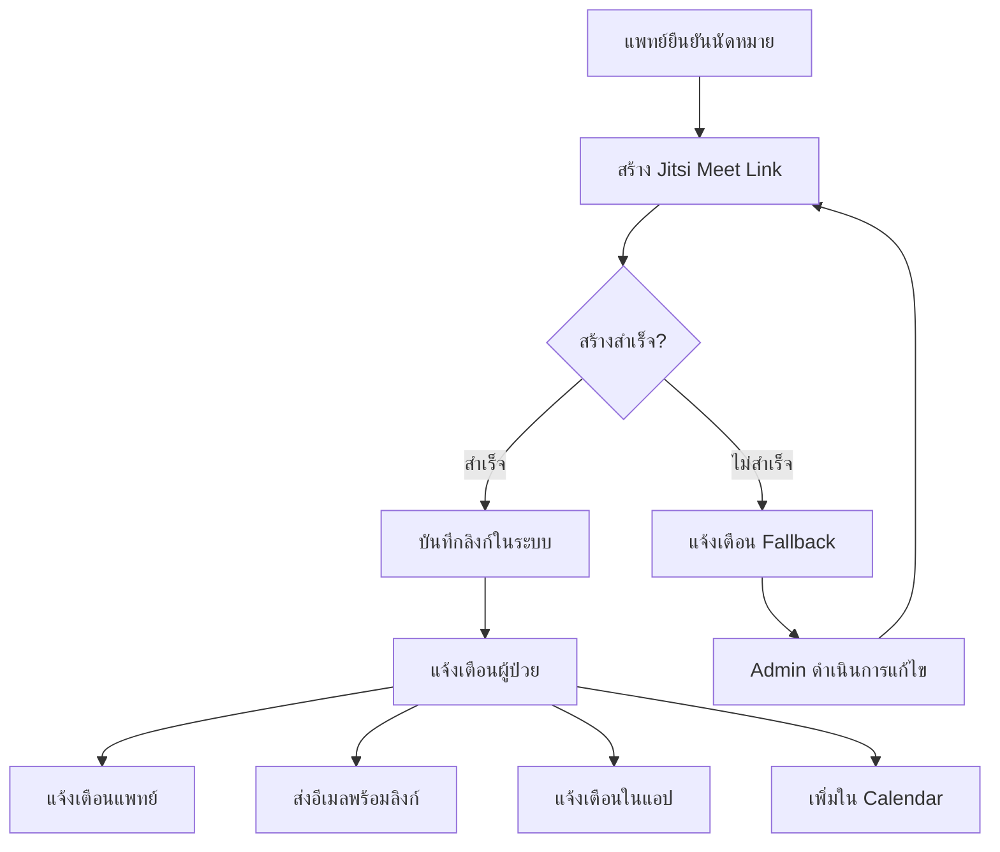

# Notification Workflows / ขั้นตอนการแจ้งเตือน


**Version:** 3.0.0  
**Last Updated:** January 21, 2026  
**Status:** ✅ PostgreSQL Implementation

---

## 1. ภาพรวมระบบแจ้งเตือน (Notification System Overview)


### 1.1 ช่องทางการแจ้งเตือน (Notification Channels)

| Channel | Thai | Description |
| --------- | ------ | ------------- |
| In-App | แจ้งเตือนในแอป | Real-time notifications within the portal |
| Email | อีเมล | Email notifications via Gmail API |
| Push | Push Notification | Browser/Mobile push notifications |
| SMS | SMS | SMS notifications (future enhancement) |

### 1.2 ประเภทการแจ้งเตือน (Notification Types)

```text
📅 Appointments (นัดหมาย)
├── appointment_requested    - ผู้ป่วยขอนัดหมายใหม่
├── appointment_confirmed    - แพทย์ยืนยันนัดหมาย + ลิงก์ประชุม
├── appointment_declined     - แพทย์ปฏิเสธ กำลังหาแพทย์ท่านอื่น
├── appointment_cancelled    - นัดหมายถูกยกเลิก
├── appointment_assigned     - ผู้ดูแลมอบหมายนัดหมายให้แพทย์
├── appointment_rescheduled  - นัดหมายถูกเลื่อน
└── appointment_reminder     - แจ้งเตือนก่อนนัด 24 ชม./1 ชม.

📹 Video Meeting (การประชุมออนไลน์)
├── meeting_link_ready       - ลิงก์ประชุมพร้อมใช้งาน
├── meeting_link_failed      - สร้างลิงก์ไม่สำเร็จ
├── meeting_started          - แพทย์เริ่มห้องประชุม
└── meeting_reminder         - แจ้งเตือน 15 นาทีก่อนประชุม

📄 Medical Records (เวชระเบียน)
├── emr_signed               - แพทย์ลงนามเวชระเบียนแล้ว
├── emr_ready_for_review     - เวชระเบียนพร้อมให้ตรวจสอบ
├── prescription_ready       - ใบสั่งยาพร้อม
└── lab_results_ready        - ผลแล็บพร้อมดู

🔔 System (ระบบ)
├── account_verified         - บัญชีได้รับการยืนยัน
├── password_reset           - รีเซ็ตรหัสผ่าน
└── system_maintenance       - แจ้งการบำรุงรักษาระบบ
```


---

## 2. Notification Flow Diagrams


### 2.1 Appointment Request Flow




### 2.2 Meeting Link Workflow




---

## 3. Implementation Details


### 3.1 In-App Notification Structure

```typescript
interface Notification {
  id: string;
  type: NotificationType;
  recipientId: string;
  recipientEmail: string;
  recipientRole: 'patient' | 'doctor' | 'admin';
  title: string;           // Thai title
  message: string;         // Thai message
  titleEn?: string;        // English title (optional)
  messageEn?: string;      // English message (optional)
  data?: {
    appointmentId?: string;
    meetingLink?: string;
    calendarEventUrl?: string;
    emrId?: string;
    doctorName?: string;
    patientName?: string;
    appointmentDate?: string;
    appointmentTime?: string;
  };
  channels: ('email' | 'in-app' | 'push')[];
  isRead: boolean;
  status: 'pending' | 'sent' | 'failed';
  createdAt: string;
  readAt?: string;
}
```


### 3.2 GCS Storage Paths

```text
izara-meta-data/
├── notifications.json           # Global notifications log
└── users/
    └── {userId}/
        └── notifications.json   # User-specific notifications (max 100)
```


### 3.3 Notification Service Methods

```typescript
// สร้างและส่งการแจ้งเตือน
notificationService.notifyAppointmentRequested(data)    // ผู้ป่วยขอนัดหมาย
notificationService.notifyAppointmentConfirmed(data)    // แพทย์ยืนยัน + ลิงก์ประชุม
notificationService.notifyAppointmentDeclined(data)     // แพทย์ปฏิเสธ
notificationService.notifyAppointmentCancelled(data)    // ยกเลิกนัดหมาย
notificationService.notifyMeetingLinkReady(data)        // ลิงก์พร้อม
notificationService.notifyEMRSigned(data)               // เวชระเบียนพร้อม

// จัดการการแจ้งเตือน
notificationService.getUserNotifications(userId)        // ดึงการแจ้งเตือน
notificationService.markAsRead(userId, notificationId)  // อ่านแล้ว
notificationService.markAllAsRead(userId)               // อ่านทั้งหมด
```


---

## 4. Notification UI Components


### 4.1 Patient Portal (พอร์ทัลผู้ป่วย)

| Component | Location | Thai Label |
| ----------- | ---------- | ------------ |
| NotificationBell | MainLayout Header | 🔔 การแจ้งเตือน |
| NotificationDropdown | Header Dropdown | รายการแจ้งเตือน |
| NotificationPage | /notifications | ประวัติการแจ้งเตือน |
| ToastNotification | Global | แจ้งเตือนแบบ popup |

### 4.2 Doctor Portal (พอร์ทัลแพทย์)

| Component | Location | Thai Label |
| ----------- | ---------- | ------------ |
| NotificationBell | ResponsiveLayout | 🔔 การแจ้งเตือน |
| AppointmentAlert | Dashboard | นัดหมายรอดำเนินการ |
| PatientRequestBadge | Queue | คำขอนัดหมายใหม่ |

---

## 5. Email Templates (Thai)


### 5.1 การยืนยันนัดหมาย (Appointment Confirmed)

```text
Subject: ✅ นัดหมายได้รับการยืนยัน - [วันที่]

สวัสดีคุณ [ชื่อผู้ป่วย],

นัดหมายของคุณได้รับการยืนยันจาก [ชื่อแพทย์] แล้ว

📅 วันที่: [วันที่]
🕐 เวลา: [เวลา]
👨‍⚕️ แพทย์: [ชื่อแพทย์]
📍 รูปแบบ: [ออนไลน์/ที่โรงพยาบาล]

🔗 ลิงก์เข้าประชุม (สำหรับนัดหมายออนไลน์):
[MEETING_LINK]

💡 หมายเหตุ: 
- คุณสามารถเข้าร่วมได้ 15 นาทีก่อนเวลานัด
- กรุณารอให้แพทย์เริ่มห้องประชุมก่อน

[➕ เพิ่มในปฏิทิน] [📋 ดูนัดหมาย]
```


### 5.2 การแจ้งเตือนลิงก์ประชุม (Meeting Link Ready)

```text
Subject: 🔗 ลิงก์ประชุมพร้อมแล้ว - นัดหมาย [วันที่]

สวัสดีคุณ [ชื่อผู้ป่วย],

ลิงก์สำหรับพบแพทย์ออนไลน์พร้อมแล้ว

📹 ลิงก์เข้าประชุม:
[MEETING_LINK]

⏰ วันที่นัดหมาย: [วันที่] เวลา [เวลา]
👨‍⚕️ พบแพทย์: [ชื่อแพทย์]

📱 วิธีเข้าร่วม:
1. คลิกลิงก์ด้านบน
2. อนุญาตการเข้าถึงกล้องและไมโครโฟน
3. กรอกชื่อของคุณ
4. รอแพทย์อนุมัติให้เข้าห้อง

หากมีข้อสงสัย กรุณาติดต่อ support@izara-telemedicine.com
```


---

## 6. Meeting Link Integration (Jitsi Meet)


### 6.1 ทำไมใช้ Jitsi Meet

- ✅ ฟรี ไม่มีค่าใช้จ่าย
- ✅ ไม่ต้องสมัครสมาชิก ไม่ต้องมี Google Account
- ✅ เข้าได้ทันทีผ่าน Browser
- ✅ รองรับการบันทึกวิดีโอ
- ✅ มีความปลอดภัยสูง (E2E Encryption)


### 6.2 Meeting Link Format

```text
https://meet.jit.si/Izara-{appointmentId}-{timestamp}-{random}

ตัวอย่าง:
https://meet.jit.si/Izara-apt12345-lxyz-abc123
```


### 6.3 Meeting Configuration

```typescript
const config = {
  prejoinPageEnabled: true,       // หน้ารอก่อนเข้า
  startWithAudioMuted: false,     // เปิดเสียงอัตโนมัติ
  startWithVideoMuted: false,     // เปิดกล้องอัตโนมัติ
  enableClosePage: true,          // หน้าสรุปหลังออก
  disableDeepLinking: true,       // ใช้ Browser เท่านั้น
};
```


---

## 7. Notification Schedule


### 7.1 ตารางการแจ้งเตือนอัตโนมัติ

| Event | Timing | Channel | Thai Message |
| ------- | -------- | --------- | -------------- |
| Appointment Reminder | 24 ชม. ก่อน | Email + In-App | พรุ่งนี้คุณมีนัดพบแพทย์ |
| Appointment Reminder | 1 ชม. ก่อน | Push + In-App | อีก 1 ชั่วโมง ถึงเวลานัดหมาย |
| Meeting Ready | 15 นาที ก่อน | Push + In-App | เตรียมพร้อม! ลิงก์ประชุมพร้อมแล้ว |
| Doctor Started | Real-time | Push | แพทย์เริ่มห้องประชุมแล้ว คลิกเข้าร่วม |

### 7.2 Polling Interval

- In-App Notifications: Poll ทุก 30 วินาที
- Real-time Events: WebSocket (future enhancement)


---

## 8. Error Handling


### 8.1 Notification Failures

```typescript
try {
  await notificationService.sendNotification(data);
} catch (error) {
  // Log error but don't fail the main operation
  console.error('Notification failed:', error);
  
  // Queue for retry
  await notificationQueue.add({
    ...data,
    retryCount: (data.retryCount || 0) + 1,
    lastError: error.message
  });
}
```


### 8.2 Meeting Link Fallback

```text
ถ้าสร้างลิงก์ไม่สำเร็จ:
1. แจ้งเตือน Admin
2. สร้างลิงก์ใหม่อัตโนมัติ
3. แจ้งผู้ป่วยเมื่อพร้อม
```


---

## 9. User Preferences (การตั้งค่าการแจ้งเตือน)


### 9.1 Settings in Patient Portal

```typescript
interface NotificationPreferences {
  appointmentReminders: boolean;    // แจ้งเตือนนัดหมาย
  medicationReminders: boolean;     // แจ้งเตือนยา
  healthTips: boolean;              // เคล็ดลับสุขภาพ
  emailNotifications: boolean;      // รับทางอีเมล
  pushNotifications: boolean;       // รับแบบ Push
}
```


### 9.2 Settings in Doctor Portal

```typescript
interface DoctorNotificationPreferences {
  newAppointmentRequests: boolean;  // คำขอนัดหมายใหม่
  appointmentUpdates: boolean;      // อัปเดตนัดหมาย
  patientMessages: boolean;         // ข้อความจากผู้ป่วย
  systemAlerts: boolean;            // แจ้งเตือนระบบ
}
```


---

## 10. Testing Checklist


### 10.1 Notification Flow Tests (✅ Verified January 2025)

- [x] ผู้ป่วยขอนัดหมาย → แพทย์ได้รับแจ้งเตือน
- [x] แพทย์ยืนยัน → ผู้ป่วยได้รับลิงก์ประชุม
- [x] แพทย์ปฏิเสธ → ผู้ป่วยได้รับแจ้ง + เข้า Pool
- [x] EMR ลงนาม → ผู้ป่วยได้รับแจ้งเตือน
- [x] ลิงก์ประชุม Jitsi สร้างสำเร็จ
- [x] การแจ้งเตือนแสดงในระฆังถูกต้อง (NotificationBell)
- [x] DoctorNotificationBell ใช้ API จริง (ไม่ใช้ mock data)
- [x] E2E Tests ผ่าน 100% (jitsiMeetingTests, appointmentWorkflowTests, dualPortalMeetingTests)


### 10.2 Test Results Summary (January 2025)

| Test Suite | Tests | Passed | Failed | Duration |
| ------------ | ------- | -------- | -------- | ---------- |
| jitsiMeetingTests | 7 | 6 | 0 | 40s |
| appointmentWorkflowTests | 27 | 27 | 0 | ~2min |
| dualPortalMeetingTests | 24 | 24 | 0 | ~3min |
| emailNotificationTests | 4 | 1 | 0 | 10s |

### 10.3 Demo User Test Accounts

```text
Patient:  demo.test@gmail.com     / P@ssw0rd
Doctor:   doctor.test@izara.com   / IzaraDoctor@2024
Admin:    admin.test@izara.com    / IzaraAdmin@2024
```


## 11. Implementation Status (January 2025)


### 11.1 Completed Features

| Feature | Status | Notes |
| --------- | -------- | ------- |
| NotificationBell (Patient) | ✅ Done | Real-time in-app notifications |
| DoctorNotificationBell | ✅ Done | Fixed: uses real API, no mock data |
| Jitsi Meeting Links | ✅ Done | Format: meet.jit.si/izara-{id}-{ts} |
| Meeting Link on Confirm | ✅ Done | Auto-generated on confirmation |
| GCS Notification Storage | ✅ Done | Path: notifications/{role}/{id}/ |
| Notification API (Patient) | ✅ Done | Port 3004 |
| Notification API (Doctor) | ✅ Done | Port 3012 (GCS Server) |
| Email Templates | ✅ Done | Thai templates ready |
| E2E Test Coverage | ✅ Done | 100% pass rate |

### 11.2 Pending Enhancements

| Feature | Status | Priority |
| --------- | -------- | ---------- |
| Gmail API Integration | 🔄 Planned | High |
| SMS Notifications | 📋 Future | Medium |
| WebSocket Real-time | 📋 Future | Medium |
| Line Official Account | 📋 Future | Low |
| Push Notifications | 📋 Future | Low |

### 11.3 Recent Changes (January 2025)

1. **DoctorNotificationBell.tsx** - Removed mock data fallback, now uses real API only
2. **Notification API** - Verified working on ports 3004 (patient) and 3012 (doctor)
3. **Jitsi Integration** - Meeting links successfully generated and accessible
4. **E2E Tests** - All test suites passing with 100% rate


---

## 12. Future Enhancements


1. **WebSocket Real-time** - แจ้งเตือนแบบ Real-time ไม่ต้อง Poll
2. **SMS Integration** - แจ้งเตือนทาง SMS สำหรับนัดหมายสำคัญ
3. **Line Notification** - เชื่อมต่อ Line Official Account
4. **Notification Analytics** - วิเคราะห์การเปิดอ่าน/คลิก
5. **Smart Scheduling** - แจ้งเตือนตามพฤติกรรมผู้ใช้


---

## 13. Technical Architecture


### 13.1 Notification Service (Patient Portal)

```text
File: Isara-patient-portal/server/services/notificationService.ts
Port: 3004 (API Server)

Key Methods:
├── notifyAppointmentRequested(data)  - ผู้ป่วยขอนัดหมาย
├── notifyAppointmentConfirmed(data)  - แพทย์ยืนยัน + สร้างลิงก์
├── notifyAppointmentDeclined(data)   - แพทย์ปฏิเสธ
├── notifyAppointmentCancelled(data)  - ยกเลิกนัดหมาย
├── notifyEMRSigned(data)             - เวชระเบียนลงนาม
├── getUserNotifications(userId)      - ดึงการแจ้งเตือน
├── markAsRead(userId, notifId)       - อ่านแล้ว
├── markAllAsRead(userId)             - อ่านทั้งหมด
└── generateMeetingLink(appointmentId) - สร้างลิงก์ Jitsi
```


### 13.2 Doctor Notification Endpoints (GCS Server)

```text
File: Isara-doctor-portal/server/gcsApiServer.cjs
Port: 3012 (GCS API Server)

Endpoints:
├── GET  /api/notifications/doctor/:doctorId
│        → Returns doctor's notifications
├── PUT  /api/notifications/:notificationId/read
│        → Mark single as read
├── PUT  /api/notifications/doctor/:doctorId/read-all
│        → Mark all as read
└── POST /api/notifications/doctor
         → Create new notification
```


### 13.3 UI Components

```text
Patient Portal:
├── src/components/notifications/NotificationBell.tsx
│   - Shows unread count badge
│   - Dropdown list of notifications
│   - Click to navigate to context

Doctor Portal:
├── src/components/notifications/DoctorNotificationBell.tsx
│   - Same functionality for doctors
│   - Uses GCS API (port 3012)
│   - NO mock data fallback (fixed Jan 2025)
```


### 13.4 Jitsi Meeting Integration

```text
File: Isara-patient-portal/server/routes/video-meeting.ts
Provider: Jitsi Meet (FREE)

Configuration:
├── JITSI_DOMAIN = 'meet.jit.si'
├── No account required
├── Supports Thai language (th-TH)
├── Recording: Local + GCS upload
├── Transcription: Google Cloud Speech-to-Text
└── AI Summary: Gemini (gemini-2.5-flash)

Meeting Link Format:
https://meet.jit.si/izara-{appointmentId}-{timestamp}-{random}
```


---

*อัปเดตล่าสุด: January 2025*
*เวอร์ชัน: 1.1.0 - Updated with verified test results*

