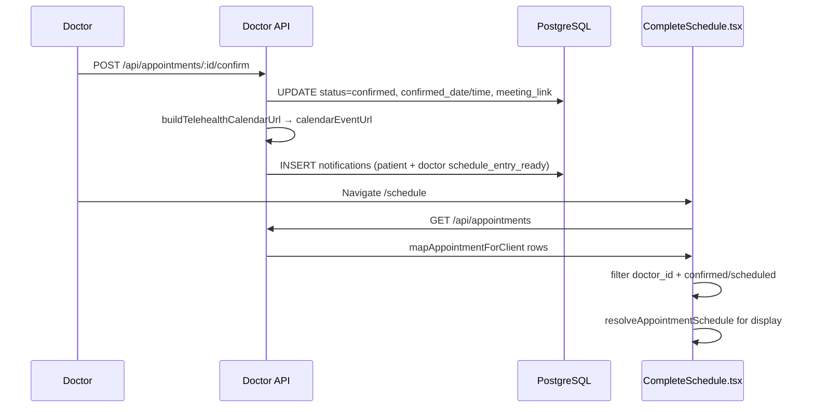

# 📅 Doctor Portal — Schedule Page

**Route:** `/schedule`  
**Component:** [`frontend/pages/schedule/CompleteSchedule.tsx`](../../../Isara-doctor-portal/frontend/pages/schedule/CompleteSchedule.tsx) (canonical; [`pages/CompleteSchedule.tsx`](../../../Isara-doctor-portal/frontend/pages/CompleteSchedule.tsx) re-exports)  
**Access:** 🔒 Doctor / Admin  
**Thai Title:** ตารางนัดหมาย / Schedule  
**Last Updated:** June 8, 2026 (v1.7.51 — calendar sync on confirm)

---

## มาตรฐานเอกสาร (รายงานภาษาไทย)

เอกสารชุดนี้จัดทำให้สอดคล้อง**มาตรฐานการรายงานภาษาไทย**ของหน่วยงานราชการและสาธารณสุข (โครงสร้าง: วัตถุประสงค์ → ขอบเขต → ขั้นตอน → ผลลัพธ์ → ข้อควรระวัง → อ้างอิง)

| รายการ | ค่าที่ใช้ |
|--------|-----------|
| เอกสาร Word / รายงาน PDF | **TH Sarabun New** — เนื้อหา **16 pt**, หัวข้อระดับ 1 **18 pt**, หัวข้อระดับ 2 **16 pt** (ตัวหนา), ชื่อเรื่อง **22 pt**, ระยะบรรทัด **1.15**, จัดชิดซ้าย |
| สไลด์นำเสนอ PowerPoint | **FC Iconic** — หัวข้อสไลด์ **32 pt**, หัวข้อรอง **22 pt**, เนื้อหา **18 pt**, บันทึกวิทยากร **16 pt** |
| ตัวเลขและวันที่ | ใช้ พ.ศ. ในข้อความไทย; คั่นหลักพันแบบไทยเมื่อจำเป็น |
| อ้างอิงคู่มือ | `docs/guides/patient/USER_GUIDE_PATIENT_WORD_TH.docx`, `docs/guides/doctor/USER_GUIDE_DOCTOR_WORD_TH.docx`, `docs/guides/patient|doctor/USER_GUIDE_*_PPT_TH.pptx` |
| เอกสารปฏิบัติการ Production | `docs/markdown/operations/PRODUCTION_DEPLOYMENT_AND_TECHNICAL_UPDATE.md` |
| สร้าง/อัปเดตคู่มือ | `python scripts/build-portal-user-guides.py` |
| อัปเดตหน้ากระบวนการ | `python scripts/enrich-process-pages.py --force-steps` |
| ล้างข้อมูลทดสอบ (ไม่ re-seed demo) | `npm run cleanup:cloud-test-only` |
| การทดสอบอัตโนมัติ | Playwright Groups A–Q + Vitest — `tests/PROCESS_COVERAGE_MATRIX.md` |
| รุ่นเอกสารหน้ากระบวนการ | **ENRICH-9** (Word TH Sarabun New 16 pt / PPT FC Iconic — ขั้นตอน 8–12 รายการ + คำอธิบายเชิงรายงานทุกหน้า) |
| โครงสร้างเทคนิค (สถาปัตยกรรม) | `docs/technical/word/TECHNICAL_ARCHITECTURE_WORD_TH.docx`, `docs/technical/ppt/TECHNICAL_ARCHITECTURE_PPT_TH.pptx`, `docs/diagrams/diagrams.drawio` |
| สร้างเอกสารโครงสร้างเทคนิค | `python scripts/build-technical-architecture-docs.py` |

**โครงสร้างบังคับในแต่ละหน้า Processes/Pages:**

1. **คำอธิบายและบริบท (รายงานภาษาไทย)** — บทบาทผู้ใช้ ขอบเขตข้อมูล และลิงก์ workflow  
2. **ขั้นตอนการใช้งาน (ละเอียด)** — ลำดับปฏิบัติ พร้อมจุดตรวจสอบและ `data-testid`  
3. **ผลลัพธ์ที่คาดหวัง** — สถานะระบบ / API / ฐานข้อมูลหลังจบขั้นตอน

---
## UI Controls Inventory

| # | Control | testid | Action | Expected | Screenshot |
|---|---------|--------|--------|----------|------------|
| 1 | Data Testid | `data-testid` | click | Documented control | U-data-testid |
| 2 | Doctorid | `doctorId` | click | Documented control | U-doctorId |
| 3 | Appointmentdate | `appointmentDate` | click | Documented control | U-appointmentDate |
| 4 | Mapappointmentforclient | `mapAppointmentForClient` | click | Documented control | U-mapAppointmentForClient |
| 5 | Resolveappointmentschedule | `resolveAppointmentSchedule` | click | Documented control | U-resolveAppointmentSchedule |
| 6 | Confirmeddate | `confirmedDate` | click | Documented control | U-confirmedDate |
| 7 | Appointmenttime | `appointmentTime` | click | Documented control | U-appointmentTime |
| 8 | Meetinglink | `meetingLink` | click | Documented control | U-meetingLink |
| 9 | Patientname | `patientName` | click | Documented control | U-patientName |
| 10 | Status | `status` | click | Documented control | U-status |
| 11 | Confirmed | `confirmed` | click | Documented control | U-confirmed |
| 12 | Scheduled | `scheduled` | click | Documented control | U-scheduled |
| 13 | Pending | `pending` | click | Documented control | U-pending |
| 14 | Assigned | `assigned` | click | Documented control | U-assigned |
| 15 | Buildtelehealthcalendarurl | `buildTelehealthCalendarUrl` | click | Documented control | U-buildTelehealthCalendarUrl |
| 16 | Buildgooglecalendarurl | `buildGoogleCalendarUrl` | click | Documented control | U-buildGoogleCalendarUrl |
| 17 | Calendareventurl | `calendarEventUrl` | click | Documented control | U-calendarEventUrl |
| 18 | Mini Calendar Appointment Day | `mini-calendar-appointment-day` | click | Documented control | U-mini-calendar-appointment-day |
| 19 | Doctor Portal | `doctor-portal` | click | Documented control | U-doctor-portal |
| 20 | Appointmentid | `appointmentId` | click | Documented control | U-appointmentId |
| 21 | Meetingid | `meetingId` | click | Documented control | U-meetingId |
| 22 | Success | `success` | click | Documented control | U-success |
| 23 | Message | `message` | click | Documented control | U-message |
| 24 | Code | `code` | click | Documented control | U-code |

## 1. Purpose (วัตถุประสงค์)

Provide a **Teams/Zoom-style schedule** for the logged-in doctor: confirmed telehealth visits appear automatically after `POST /api/appointments/:id/confirm`, with date/time, patient name, status badge, and one-click **Join Video Meeting**. Month view shows emerald dots on days that have appointments.

**Before v1.7.51:** Schedule often appeared empty because the UI read camelCase fields (`doctorId`, `appointmentDate`) while the API returned raw PostgreSQL snake_case (`doctor_id`, `confirmed_date`). **Fixed** via `mapAppointmentForClient` (API) + `resolveAppointmentSchedule` (UI).

---

## 2. Page Layout

```text
┌─────────────────────────────────────────────────────────────────────┐
│  📅 Schedule                                    data-testid=         │
│     doctor-schedule-page                                            │
│  View: [Day] [Week] [Month]                                         │
│                                                                     │
│  ┌── Today ──────────────────────────────────────────────────────┐   │
│  │  data-testid=schedule-appointment-{appointmentId}           │   │
│  │  ⏰ 10:00  👤 Demo Test Patient  [CONFIRMED]                │   │
│  │  [Join Video Meeting]  data-testid=schedule-meeting-link    │   │
│  └─────────────────────────────────────────────────────────────┘   │
│                                                                     │
│  ┌── Month (when Month selected) ──────────────────────────────┐   │
│  │  Su Mo Tu We Th Fr Sa                                       │   │
│  │  ·  ·  ·  ·  ·  1  2                                        │   │
│  │  3  4  ●5  ...   (● = schedule-month-appointment-day)       │   │
│  └─────────────────────────────────────────────────────────────┘   │
│                                                                     │
│  ┌── Upcoming (date > today only) ─────────────────────────────┐   │
│  │  Future confirmed visits (no duplicate of today's list)    │   │
│  └─────────────────────────────────────────────────────────────┘   │
└─────────────────────────────────────────────────────────────────────┘
```

---

## 3. Data flow (ละเอียด)



### 3.1 API mapping

| PostgreSQL column | Client field (after mapper) | Used in UI |
|-------------------|----------------------------|------------|
| `doctor_id` | `doctorId` | Doctor filter |
| `confirmed_date` | `appointmentDate`, `confirmedDate` | Today / month / upcoming |
| `confirmed_time` | `appointmentTime` | Time display |
| `meeting_link` | `meetingLink` | Join button href |
| `patient_name` | `patientName` | Card label |
| `status` | `status` | Badge (`confirmed`, `scheduled`) |

### 3.2 Status filter (calendar vs queue)

| View | Statuses shown | Rationale |
|------|----------------|-----------|
| **Schedule `/schedule`** | `confirmed`, `scheduled` only | Calendar entries after doctor approval |
| **Dashboard / queue** | Also `in_pool`, `pending`, `awaiting_doctor_response`, `assigned` | Operational queue (see D2 parity tests) |

---

## 4. Workflows

### Workflow A: View schedule after confirming an appointment

```text
Step 1: Doctor confirms telehealth appointment (Health Meeting or API confirm)
        POST /api/appointments/{id}/confirm
        Body: { doctorId, confirmedDate, confirmedTime, notes? }

Step 2: System generates Jitsi room + calendarEventUrl + notifications

Step 3: Doctor opens /schedule (menu: ตารางนัดหมาย)

Step 4: GET /api/appointments → filtered by doctor.id

Step 5: If confirmed_date = today → appears under "Today"
        Else → appears under "Upcoming"

Step 6: Month view → emerald dot on appointment day

Step 7: Click "Join Video Meeting" → new tab with meeting_link
```

### Workflow B: Add to personal Google Calendar

```text
Step 1: Doctor receives in-app notification type schedule_entry_ready
Step 2: Open notification → data.calendarEventUrl
Step 3: Browser opens Google Calendar TEMPLATE (no OAuth required)
Step 4: Doctor saves event to Google account
```

### Workflow C: E2E proof (D4cal)

```text
Step 1: D4 workflow confirms appointment (D4a)
Step 2: D4cal loads patient notifications → assert calendarEventUrl in appointment_confirmed data
Step 3: navDoctor → schedule → assert doctor-schedule-page visible
Step 4: assert schedule-appointment-{workflowAppointmentId} visible
Step 5: assert schedule-meeting-link visible
Step 6: Patient reload → optional mini-calendar-appointment-day on sidebar
```

---

## 5. API Endpoints

| Method | Endpoint | Purpose |
|--------|----------|---------|
| GET | `/api/appointments` | List appointments (`mapAppointmentForClient`); optional `?doctorId=` |
| GET | `/api/schedule/:doctorId` | Lightweight schedule alias (date, time, meetingLink per row) |
| POST | `/api/appointments/:id/confirm` | Confirm + calendarEventUrl + meeting links |

---

## 6. Key source files

| File | Role |
|------|------|
| [`appointmentMapper.cjs`](../../../Isara-doctor-portal/backend/appointmentMapper.cjs) | Snake_case → camelCase for API consumers |
| [`calendarEventLinks.cjs`](../../../Isara-doctor-portal/backend/calendarEventLinks.cjs) | `buildTelehealthCalendarUrl`, `buildGoogleCalendarUrl` |
| [`appointmentSchedule.ts`](../../../Isara-doctor-portal/frontend/utils/appointmentSchedule.ts) | `resolveAppointmentSchedule(apt)` — unified date/time |
| [`mainApiServer.cjs`](../../../Isara-doctor-portal/backend/mainApiServer.cjs) | Confirm handler + schedule route |

---

## 7. AI Agent Improvement Opportunities

- **Smart scheduling:** AI optimize appointment spacing based on urgency and no-show risk  
- **No-show prediction:** Flag high-risk slots on schedule cards  
- **Calendar sync:** Future OAuth Google Calendar API write (current: TEMPLATE URL only)  
- **External calendar:** ICS download for Outlook/Apple Calendar  

---

## 8. Expected results (ผลลัพธ์ที่คาดหวัง)

| Action | DB | Doctor UI | Patient UI |
|--------|-----|-----------|------------|
| Doctor confirms telehealth | `status=confirmed`, `confirmed_date/time` set, `meeting_link` set | Row on `/schedule` with join link | Confirmed tab + MiniCalendar dot + calendar link on detail |
| Doctor opens month view | — | Dots on days with confirmed visits | — |
| Playwright D4cal | Notification row with `calendarEventUrl` | `schedule-appointment-*` visible | Optional `mini-calendar-appointment-day` |

---

## 9. Troubleshooting

| Symptom | Cause | Fix |
|---------|-------|-----|
| Schedule empty after confirm | Old image without `mapAppointmentForClient` | Rebuild `doctor-portal` Docker image |
| Wrong date on card | `requested_date` used instead of `confirmed_date` | Confirm API must pass `confirmedDate`; UI uses `resolveAppointmentSchedule` |
| No join button | `meeting_link` null for non-telehealth | Confirm only generates links for `appointment_type=telehealth` |
| Duplicate cards same day | Today + upcoming both listed | Fixed: upcoming uses `date > today` only |

## คำอธิบายและบริบท (รายงานภาษาไทย)

### วัตถุประสงค์

หน้า **04 Schedule** อธิบายการทำงานของพอร์ทัลแพทย์/ผู้ดูแล ในระบบ Isara Anywhere ให้เจ้าหน้าที่ปฏิบัติการและทีมสนับสนุนใช้เป็นแนวทางเดียวกันกับคู่มือผู้ใช้และการทดสอบอัตโนมัติ

### มาตรฐานการจัดทำเอกสาร

- **รายงาน / Word:** แบบอักษร **TH Sarabun New** ขนาดเนื้อหา **16 pt** ระยะบรรทัด **1.15** (มาตรฐานรายงานภาษาไทย)
- **PowerPoint:** แบบอักษร **FC Iconic** หัวข้อ **32 pt** เนื้อหา **18 pt**
- สร้างไฟล์จริง: `python scripts/build-portal-user-guides.py` → `docs/guides/patient|doctor/USER_GUIDE_*_WORD_TH.docx` และ `*_PPT_TH.pptx`

### ขอบเขตและบทบาท

แพทย์เป็น **HOST** ของวิดีโอคอล: Admit lobby, บันทึก, จบประชุม, ตรวจสอบ AI Summary ก่อนลง EMR
ผู้ดูแลระบบ (admin) จัดการ Pool นัด อนุมัติบัญชี และเนื้อหา — ไม่แทนแพทย์ในการลงนาม EMR

### ลำดับความสัมพันธ์กับ workflow อื่น

1. **นัดหมาย** — สถานะ `confirmed` ก่อนเปิดวิดีโอ (`Processes/Appointment_Workflows.md`)
2. **ประชุม** — Izara Lobby → Jitsi → บันทึก → สรุป AI (`Processes/VIDEO_MEETING_JITSI_GEMINI.md`)
3. **บันทึกทางการแพทย์** — EMR / สั่งยา / แล็บ หลังแพทย์ตรวจสอบ AI

### การตรวจสอบคุณภาพ (QA)

| ลำดับ | รายการตรวจ | วิธี |
|------|------------|------|
| 1 | UI แจ้งเตือน | ไม่มี toast error / banner แดง |
| 2 | API | DevTools Network — status 2xx |
| 3 | ทดสอบอัตโนมัติ | Playwright + data-testid ใน tests/SELECTORS.md |
| 4 | เอกสาร | Word TH Sarabun New 16 pt / PPT FC Iconic จาก build-portal-user-guides.py |

### ผลลัพธ์ที่คาดหวังหลังใช้งานหน้านี้

- ผู้ใช้บรรลุวัตถุประสงค์ของหน้าโดยไม่ต้องขอความช่วยเหลือจากทีม IT
- ข้อมูลที่บันทึกปรากฏบนแดชบอร์ด/PHR/EMR ตามสิทธิ์
- เหตุการณ์สำคัญ (login, จองนัด, admit, จบประชุม) มี log ตรวจสอบได้ใน Cloud Logging

**เอกสารอ้างอิงหลัก:**

- `Processes/VIDEO_MEETING_JITSI_GEMINI.md` — วิดีโอ, lobby, บันทึก, AI
- `Processes/Appointment_Workflows.md` — Pool และสถานะนัด
- `docs/markdown/operations/PRODUCTION_DEPLOYMENT_AND_TECHNICAL_UPDATE.md` — deploy และ runbook
- `docs/guides/patient|doctor/USER_GUIDE_*_WORD_TH.docx` / `*_PPT_TH.pptx` — คู่มือผู้ใช้ฉบับสมบูรณ์

### องค์ประกอบ UI หลัก (data-testid)

- ดู `tests/SELECTORS.md` สำหรับหน้านี้

*(รุ่นเอกสารหน้านี้: ENRICH-9 — คู่มือ Word ตาราง+สารบัญ / PPT FC Iconic รายหน้าละเอียด v1.7.33)*


## ขั้นตอนการใช้งาน (ละเอียด)

**เงื่อนไขก่อนเริ่ม:** เข้าสู่ระบบด้วยบัญชีที่มีสิทธิ์ถูกต้อง, ใช้ HTTPS, เบราว์เซอร์ Chrome/Edge ล่าสุด, อินเทอร์เน็ตเสถียร (วิดีโอ ≥10 Mbps)

1. เข้าสู่ระบบพอร์ทัลแพทย์/ผู้ดูแล — ตรวจ URL และ HTTPS
   - **ปฏิบัติ:** ดำเนินการตาม UI/API จนเสร็จขั้นนี้
   - **รายละเอียด:** ดำเนินการบนหน้าจอจนจบขั้นนี้ — อย่าข้ามขั้นที่มีการยืนยัน (confirm/modal)
   - **รายละเอียด:** บันทึก `appointmentId` / `meetingId` จาก URL หรือ Network tab หากต้องส่งต่อทีมสนับสนุน
   - **รายละเอียด:** ลำดับขั้นที่ 1 ต้องสำเร็จก่อนขั้นถัดไป — หากล้มเหลวให้จับภาพหน้าจอและ requestId จาก Cloud Logging
   - **รายละเอียด:** จัดทำรายงาน/คู่มืออ้างอิง: Word ใช้ TH Sarabun New 16 pt (ระยะบรรทัด 1.15) — สไลด์ใช้ FC Iconic ตามมาตรฐานรายงานภาษาไทย
   - **รายละเอียด:** ตรวจว่า session มี JWT และไม่ถูก redirect กลับหน้า login
   - **UI หลัก:** ดู `tests/SELECTORS.md` สำหรับหน้านี้
   - **ตรวจสอบ:** ไม่มี error แดง / toast ล้มเหลว; HTTP 2xx บน API หลัก
   - **อ้างอิงทดสอบ:** `tests/SELECTORS.md` + Playwright group ที่เกี่ยวข้อง
2. เปิดหน้า «04 Schedule Page» จากเมนูหลัก — รอโหลด SPA จนไม่มี spinner ค้าง
   - **ปฏิบัติ:** ดำเนินการตาม UI/API จนเสร็จขั้นนี้
   - **รายละเอียด:** ดำเนินการบนหน้าจอจนจบขั้นนี้ — อย่าข้ามขั้นที่มีการยืนยัน (confirm/modal)
   - **รายละเอียด:** บันทึก `appointmentId` / `meetingId` จาก URL หรือ Network tab หากต้องส่งต่อทีมสนับสนุน
   - **รายละเอียด:** ลำดับขั้นที่ 2 ต้องสำเร็จก่อนขั้นถัดไป — หากล้มเหลวให้จับภาพหน้าจอและ requestId จาก Cloud Logging
   - **รายละเอียด:** จัดทำรายงาน/คู่มืออ้างอิง: Word ใช้ TH Sarabun New 16 pt (ระยะบรรทัด 1.15) — สไลด์ใช้ FC Iconic ตามมาตรฐานรายงานภาษาไทย
   - **ตรวจสอบ:** ไม่มี error แดง / toast ล้มเหลว; HTTP 2xx บน API หลัก
   - **อ้างอิงทดสอบ:** `tests/SELECTORS.md` + Playwright group ที่เกี่ยวข้อง
3. อ่านคำอธิบายบนหน้าจอและข้อความ PDPA/คำเตือนที่เกี่ยวข้อง
   - **ปฏิบัติ:** ดำเนินการตาม UI/API จนเสร็จขั้นนี้
   - **รายละเอียด:** ดำเนินการบนหน้าจอจนจบขั้นนี้ — อย่าข้ามขั้นที่มีการยืนยัน (confirm/modal)
   - **รายละเอียด:** บันทึก `appointmentId` / `meetingId` จาก URL หรือ Network tab หากต้องส่งต่อทีมสนับสนุน
   - **รายละเอียด:** ลำดับขั้นที่ 3 ต้องสำเร็จก่อนขั้นถัดไป — หากล้มเหลวให้จับภาพหน้าจอและ requestId จาก Cloud Logging
   - **รายละเอียด:** จัดทำรายงาน/คู่มืออ้างอิง: Word ใช้ TH Sarabun New 16 pt (ระยะบรรทัด 1.15) — สไลด์ใช้ FC Iconic ตามมาตรฐานรายงานภาษาไทย
   - **รายละเอียด:** การเปลี่ยนความยินยอมต้องปรากฏใน audit log — ห้ามแก้ย้อนหลัง
   - **ตรวจสอบ:** ไม่มี error แดง / toast ล้มเหลว; HTTP 2xx บน API หลัก
   - **อ้างอิงทดสอบ:** `tests/SELECTORS.md` + Playwright group ที่เกี่ยวข้อง
4. กรอกหรือเลือกข้อมูลตามฟอร์ม — ใช้ `data-testid` ใน tests/SELECTORS.md เป็นจุดอ้างอิง
   - **ปฏิบัติ:** ดำเนินการตาม UI/API จนเสร็จขั้นนี้
   - **รายละเอียด:** ดำเนินการบนหน้าจอจนจบขั้นนี้ — อย่าข้ามขั้นที่มีการยืนยัน (confirm/modal)
   - **รายละเอียด:** บันทึก `appointmentId` / `meetingId` จาก URL หรือ Network tab หากต้องส่งต่อทีมสนับสนุน
   - **รายละเอียด:** ลำดับขั้นที่ 4 ต้องสำเร็จก่อนขั้นถัดไป — หากล้มเหลวให้จับภาพหน้าจอและ requestId จาก Cloud Logging
   - **รายละเอียด:** จัดทำรายงาน/คู่มืออ้างอิง: Word ใช้ TH Sarabun New 16 pt (ระยะบรรทัด 1.15) — สไลด์ใช้ FC Iconic ตามมาตรฐานรายงานภาษาไทย
   - **UI:** ใช้ `data-testid` ที่ระบุในข้อความขั้นตอน
   - **ตรวจสอบ:** ไม่มี error แดง / toast ล้มเหลว; HTTP 2xx บน API หลัก
   - **อ้างอิงทดสอบ:** `tests/SELECTORS.md` + Playwright group ที่เกี่ยวข้อง
5. กดปุ่มบันทึก/ยืนยัน — ตรวจ Network tab: HTTP 2xx และ JSON `success`
   - **ปฏิบัติ:** ดำเนินการตาม UI/API จนเสร็จขั้นนี้
   - **รายละเอียด:** ดำเนินการบนหน้าจอจนจบขั้นนี้ — อย่าข้ามขั้นที่มีการยืนยัน (confirm/modal)
   - **รายละเอียด:** บันทึก `appointmentId` / `meetingId` จาก URL หรือ Network tab หากต้องส่งต่อทีมสนับสนุน
   - **รายละเอียด:** ลำดับขั้นที่ 5 ต้องสำเร็จก่อนขั้นถัดไป — หากล้มเหลวให้จับภาพหน้าจอและ requestId จาก Cloud Logging
   - **รายละเอียด:** จัดทำรายงาน/คู่มืออ้างอิง: Word ใช้ TH Sarabun New 16 pt (ระยะบรรทัด 1.15) — สไลด์ใช้ FC Iconic ตามมาตรฐานรายงานภาษาไทย
   - **UI:** ใช้ `data-testid` ที่ระบุในข้อความขั้นตอน
   - **ตรวจสอบ:** ไม่มี error แดง / toast ล้มเหลว; HTTP 2xx บน API หลัก
   - **อ้างอิงทดสอบ:** `tests/SELECTORS.md` + Playwright group ที่เกี่ยวข้อง
6. หากได้ข้อความผิดพลาด: อ่าน `message` / `code` จาก API ไม่รีเฟรชซ้ำโดยไม่จำเป็น
   - **ปฏิบัติ:** ดำเนินการตาม UI/API จนเสร็จขั้นนี้
   - **รายละเอียด:** ดำเนินการบนหน้าจอจนจบขั้นนี้ — อย่าข้ามขั้นที่มีการยืนยัน (confirm/modal)
   - **รายละเอียด:** บันทึก `appointmentId` / `meetingId` จาก URL หรือ Network tab หากต้องส่งต่อทีมสนับสนุน
   - **รายละเอียด:** ลำดับขั้นที่ 6 ต้องสำเร็จก่อนขั้นถัดไป — หากล้มเหลวให้จับภาพหน้าจอและ requestId จาก Cloud Logging
   - **รายละเอียด:** จัดทำรายงาน/คู่มืออ้างอิง: Word ใช้ TH Sarabun New 16 pt (ระยะบรรทัด 1.15) — สไลด์ใช้ FC Iconic ตามมาตรฐานรายงานภาษาไทย
   - **UI:** ใช้ `data-testid` ที่ระบุในข้อความขั้นตอน
   - **ตรวจสอบ:** ไม่มี error แดง / toast ล้มเหลว; HTTP 2xx บน API หลัก
   - **อ้างอิงทดสอบ:** `tests/SELECTORS.md` + Playwright group ที่เกี่ยวข้อง
7. ยืนยันผลลัพธ์บน UI (รายการ/สถานะ/KPI) ตรงกับที่คาดหวังใน § ผลลัพธ์ที่คาดหวัง
   - **ปฏิบัติ:** ดำเนินการตาม UI/API จนเสร็จขั้นนี้
   - **รายละเอียด:** ดำเนินการบนหน้าจอจนจบขั้นนี้ — อย่าข้ามขั้นที่มีการยืนยัน (confirm/modal)
   - **รายละเอียด:** บันทึก `appointmentId` / `meetingId` จาก URL หรือ Network tab หากต้องส่งต่อทีมสนับสนุน
   - **รายละเอียด:** ลำดับขั้นที่ 7 ต้องสำเร็จก่อนขั้นถัดไป — หากล้มเหลวให้จับภาพหน้าจอและ requestId จาก Cloud Logging
   - **รายละเอียด:** จัดทำรายงาน/คู่มืออ้างอิง: Word ใช้ TH Sarabun New 16 pt (ระยะบรรทัด 1.15) — สไลด์ใช้ FC Iconic ตามมาตรฐานรายงานภาษาไทย
   - **ตรวจสอบ:** ไม่มี error แดง / toast ล้มเหลว; HTTP 2xx บน API หลัก
   - **อ้างอิงทดสอบ:** `tests/SELECTORS.md` + Playwright group ที่เกี่ยวข้อง
8. ตรวจข้อมูลใน PostgreSQL หรือแดชบอร์ดฝั่งตรงข้าม (เมื่อ workflow ข้ามพอร์ทัล)
   - **ปฏิบัติ:** ดำเนินการตาม UI/API จนเสร็จขั้นนี้
   - **รายละเอียด:** ดำเนินการบนหน้าจอจนจบขั้นนี้ — อย่าข้ามขั้นที่มีการยืนยัน (confirm/modal)
   - **รายละเอียด:** บันทึก `appointmentId` / `meetingId` จาก URL หรือ Network tab หากต้องส่งต่อทีมสนับสนุน
   - **รายละเอียด:** ลำดับขั้นที่ 8 ต้องสำเร็จก่อนขั้นถัดไป — หากล้มเหลวให้จับภาพหน้าจอและ requestId จาก Cloud Logging
   - **รายละเอียด:** จัดทำรายงาน/คู่มืออ้างอิง: Word ใช้ TH Sarabun New 16 pt (ระยะบรรทัด 1.15) — สไลด์ใช้ FC Iconic ตามมาตรฐานรายงานภาษาไทย
   - **ตรวจสอบ:** ไม่มี error แดง / toast ล้มเหลว; HTTP 2xx บน API หลัก
   - **อ้างอิงทดสอบ:** `tests/SELECTORS.md` + Playwright group ที่เกี่ยวข้อง
9. จับภาพหน้าจอหรือรัน Playwright headed (`BASELINE_VISUAL=1`) สำหรับ baseline
   - **ปฏิบัติ:** ดำเนินการตาม UI/API จนเสร็จขั้นนี้
   - **รายละเอียด:** ดำเนินการบนหน้าจอจนจบขั้นนี้ — อย่าข้ามขั้นที่มีการยืนยัน (confirm/modal)
   - **รายละเอียด:** บันทึก `appointmentId` / `meetingId` จาก URL หรือ Network tab หากต้องส่งต่อทีมสนับสนุน
   - **รายละเอียด:** ลำดับขั้นที่ 9 ต้องสำเร็จก่อนขั้นถัดไป — หากล้มเหลวให้จับภาพหน้าจอและ requestId จาก Cloud Logging
   - **รายละเอียด:** จัดทำรายงาน/คู่มืออ้างอิง: Word ใช้ TH Sarabun New 16 pt (ระยะบรรทัด 1.15) — สไลด์ใช้ FC Iconic ตามมาตรฐานรายงานภาษาไทย
   - **UI:** ใช้ `data-testid` ที่ระบุในข้อความขั้นตอน
   - **ตรวจสอบ:** ไม่มี error แดง / toast ล้มเหลว; HTTP 2xx บน API หลัก
   - **อ้างอิงทดสอบ:** `tests/SELECTORS.md` + Playwright group ที่เกี่ยวข้อง
10. บันทึกหรือส่งต่อขั้นตอนถัดไปตาม Processes/ ที่อ้างอิง
   - **ปฏิบัติ:** ดำเนินการตาม UI/API จนเสร็จขั้นนี้
   - **รายละเอียด:** ดำเนินการบนหน้าจอจนจบขั้นนี้ — อย่าข้ามขั้นที่มีการยืนยัน (confirm/modal)
   - **รายละเอียด:** บันทึก `appointmentId` / `meetingId` จาก URL หรือ Network tab หากต้องส่งต่อทีมสนับสนุน
   - **รายละเอียด:** ลำดับขั้นที่ 10 ต้องสำเร็จก่อนขั้นถัดไป — หากล้มเหลวให้จับภาพหน้าจอและ requestId จาก Cloud Logging
   - **รายละเอียด:** จัดทำรายงาน/คู่มืออ้างอิง: Word ใช้ TH Sarabun New 16 pt (ระยะบรรทัด 1.15) — สไลด์ใช้ FC Iconic ตามมาตรฐานรายงานภาษาไทย
   - **ตรวจสอบ:** ไม่มี error แดง / toast ล้มเหลว; HTTP 2xx บน API หลัก
   - **อ้างอิงทดสอบ:** `tests/SELECTORS.md` + Playwright group ที่เกี่ยวข้อง

### ผลลัพธ์ที่คาดหวัง (สรุป)

- หน้าจอแสดงสถานะสำเร็จตามบทบาท (patient / doctor / guest)
- ไม่มี HTTP 4xx/5xx บนฟังก์ชันหลักของหน้านี้
- ข้อมูลใน PostgreSQL สอดคล้อง UI (เมื่อมีนัด/ประชุม/EMR)
- `data-testid` ตรงกับ `tests/SELECTORS.md`

### ข้อควรระวัง

- ข้อมูลสุขภาพเป็นความละเอียดอ่อน — ปฏิบัติตาม PDPA และนโยบายโรงพยาบาล
- อย่าแชร์ลิงก์ประชุมหรือ JWT ทางช่องทางไม่ปลอดภัย
- ผลลัพธ์ AI ไม่ใช่การวินิจฉัย — แพทย์ต้องตรวจก่อนลง EMR

