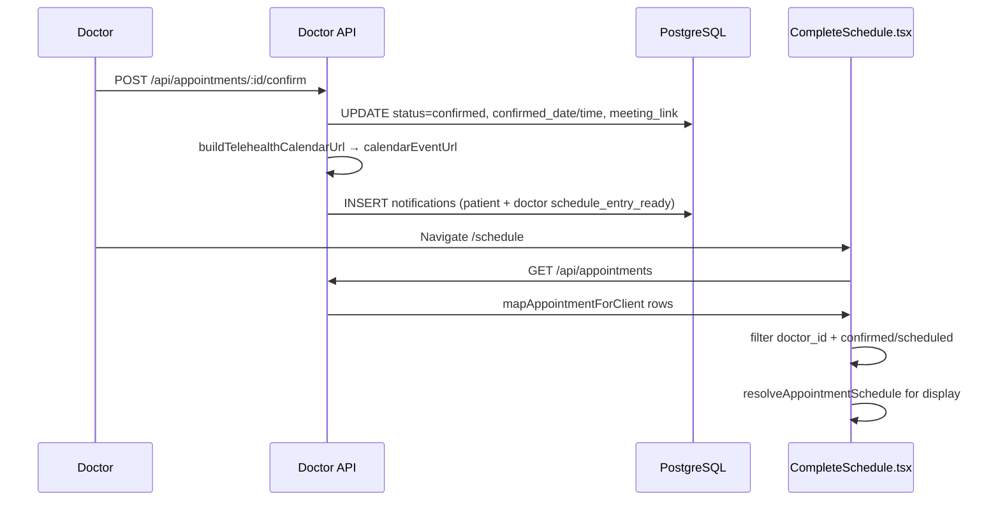

# 📅 Doctor Portal — Schedule Page

**Route:** `/schedule`  
**Component:** [`src/pages/schedule/CompleteSchedule.tsx`](../../../Isara-doctor-portal/src/pages/schedule/CompleteSchedule.tsx) (canonical; [`pages/CompleteSchedule.tsx`](../../../Isara-doctor-portal/src/pages/CompleteSchedule.tsx) re-exports)  
**Access:** 🔒 Doctor / Admin  
**Thai Title:** ตารางนัดหมาย / Schedule  
**Last Updated:** June 8, 2026 (v1.7.51 — calendar sync on confirm)

---

## มาตรฐานเอกสาร (รายงานภาษาไทย)

| รายการ | ค่าที่ใช้ |
|--------|-----------|
| การทดสอบอัตโนมัติ | Playwright **D4cal**, **D12–D13** (`group-D-appointment-workflows.ui-test.ts`); Vitest `scheduleParity.*`, `appointmentMapper.test.ts` |
| รุ่นเอกสารหน้ากระบวนการ | **ENRICH-10** — ปฏิทินหลังยืนยันนัด + ลิงก์ประชุม |

---

## 1. Purpose (วัตถุประสงค์)

Provide a **Teams/Zoom-style schedule** for the logged-in doctor: confirmed telehealth visits appear automatically after `POST /api/appointments/:id/confirm`, with date/time, patient name, status badge, and one-click **Join Video Meeting**. Month view shows emerald dots on days that have appointments.

**Before v1.7.51:** Schedule often appeared empty because the UI read camelCase fields (`doctorId`, `appointmentDate`) while the API returned raw PostgreSQL snake_case (`doctor_id`, `confirmed_date`). **Fixed** via `mapAppointmentForClient` (API) + `resolveAppointmentSchedule` (UI).

---

## 2. Page Layout

```text
┌─────────────────────────────────────────────────────────────────────┐
│  📅 Schedule                                    data-testid=         │
│     doctor-schedule-page                                            │
│  View: [Day] [Week] [Month]                                         │
│                                                                     │
│  ┌── Today ──────────────────────────────────────────────────────┐   │
│  │  data-testid=schedule-appointment-{appointmentId}           │   │
│  │  ⏰ 10:00  👤 Demo Test Patient  [CONFIRMED]                │   │
│  │  [Join Video Meeting]  data-testid=schedule-meeting-link    │   │
│  └─────────────────────────────────────────────────────────────┘   │
│                                                                     │
│  ┌── Month (when Month selected) ──────────────────────────────┐   │
│  │  Su Mo Tu We Th Fr Sa                                       │   │
│  │  ·  ·  ·  ·  ·  1  2                                        │   │
│  │  3  4  ●5  ...   (● = schedule-month-appointment-day)       │   │
│  └─────────────────────────────────────────────────────────────┘   │
│                                                                     │
│  ┌── Upcoming (date > today only) ─────────────────────────────┐   │
│  │  Future confirmed visits (no duplicate of today's list)    │   │
│  └─────────────────────────────────────────────────────────────┘   │
└─────────────────────────────────────────────────────────────────────┘
```

---

## 3. Data flow (ละเอียด)



### 3.1 API mapping

| PostgreSQL column | Client field (after mapper) | Used in UI |
|-------------------|----------------------------|------------|
| `doctor_id` | `doctorId` | Doctor filter |
| `confirmed_date` | `appointmentDate`, `confirmedDate` | Today / month / upcoming |
| `confirmed_time` | `appointmentTime` | Time display |
| `meeting_link` | `meetingLink` | Join button href |
| `patient_name` | `patientName` | Card label |
| `status` | `status` | Badge (`confirmed`, `scheduled`) |

### 3.2 Status filter (calendar vs queue)

| View | Statuses shown | Rationale |
|------|----------------|-----------|
| **Schedule `/schedule`** | `confirmed`, `scheduled` only | Calendar entries after doctor approval |
| **Dashboard / queue** | Also `in_pool`, `pending`, `awaiting_doctor_response`, `assigned` | Operational queue (see D2 parity tests) |

---

## 4. Workflows

### Workflow A: View schedule after confirming an appointment

```text
Step 1: Doctor confirms telehealth appointment (Health Meeting or API confirm)
        POST /api/appointments/{id}/confirm
        Body: { doctorId, confirmedDate, confirmedTime, notes? }

Step 2: System generates Jitsi room + calendarEventUrl + notifications

Step 3: Doctor opens /schedule (menu: ตารางนัดหมาย)

Step 4: GET /api/appointments → filtered by doctor.id

Step 5: If confirmed_date = today → appears under "Today"
        Else → appears under "Upcoming"

Step 6: Month view → emerald dot on appointment day

Step 7: Click "Join Video Meeting" → new tab with meeting_link
```

### Workflow B: Add to personal Google Calendar

```text
Step 1: Doctor receives in-app notification type schedule_entry_ready
Step 2: Open notification → data.calendarEventUrl
Step 3: Browser opens Google Calendar TEMPLATE (no OAuth required)
Step 4: Doctor saves event to Google account
```

### Workflow C: E2E proof (D4cal)

```text
Step 1: D4 workflow confirms appointment (D4a)
Step 2: D4cal loads patient notifications → assert calendarEventUrl in appointment_confirmed data
Step 3: navDoctor → schedule → assert doctor-schedule-page visible
Step 4: assert schedule-appointment-{workflowAppointmentId} visible
Step 5: assert schedule-meeting-link visible
Step 6: Patient reload → optional mini-calendar-appointment-day on sidebar
```

---

## 5. API Endpoints

| Method | Endpoint | Purpose |
|--------|----------|---------|
| GET | `/api/appointments` | List appointments (`mapAppointmentForClient`); optional `?doctorId=` |
| GET | `/api/schedule/:doctorId` | Lightweight schedule alias (date, time, meetingLink per row) |
| POST | `/api/appointments/:id/confirm` | Confirm + calendarEventUrl + meeting links |

---

## 6. Key source files

| File | Role |
|------|------|
| [`appointmentMapper.cjs`](../../../Isara-doctor-portal/server/appointmentMapper.cjs) | Snake_case → camelCase for API consumers |
| [`calendarEventLinks.cjs`](../../../Isara-doctor-portal/server/calendarEventLinks.cjs) | `buildTelehealthCalendarUrl`, `buildGoogleCalendarUrl` |
| [`appointmentSchedule.ts`](../../../Isara-doctor-portal/src/utils/appointmentSchedule.ts) | `resolveAppointmentSchedule(apt)` — unified date/time |
| [`mainApiServer.cjs`](../../../Isara-doctor-portal/server/mainApiServer.cjs) | Confirm handler + schedule route |

---

## 7. AI Agent Improvement Opportunities

- **Smart scheduling:** AI optimize appointment spacing based on urgency and no-show risk  
- **No-show prediction:** Flag high-risk slots on schedule cards  
- **Calendar sync:** Future OAuth Google Calendar API write (current: TEMPLATE URL only)  
- **External calendar:** ICS download for Outlook/Apple Calendar  

---

## 8. Expected results (ผลลัพธ์ที่คาดหวัง)

| Action | DB | Doctor UI | Patient UI |
|--------|-----|-----------|------------|
| Doctor confirms telehealth | `status=confirmed`, `confirmed_date/time` set, `meeting_link` set | Row on `/schedule` with join link | Confirmed tab + MiniCalendar dot + calendar link on detail |
| Doctor opens month view | — | Dots on days with confirmed visits | — |
| Playwright D4cal | Notification row with `calendarEventUrl` | `schedule-appointment-*` visible | Optional `mini-calendar-appointment-day` |

---

## 9. Troubleshooting

| Symptom | Cause | Fix |
|---------|-------|-----|
| Schedule empty after confirm | Old image without `mapAppointmentForClient` | Rebuild `doctor-portal` Docker image |
| Wrong date on card | `requested_date` used instead of `confirmed_date` | Confirm API must pass `confirmedDate`; UI uses `resolveAppointmentSchedule` |
| No join button | `meeting_link` null for non-telehealth | Confirm only generates links for `appointment_type=telehealth` |
| Duplicate cards same day | Today + upcoming both listed | Fixed: upcoming uses `date > today` only |
