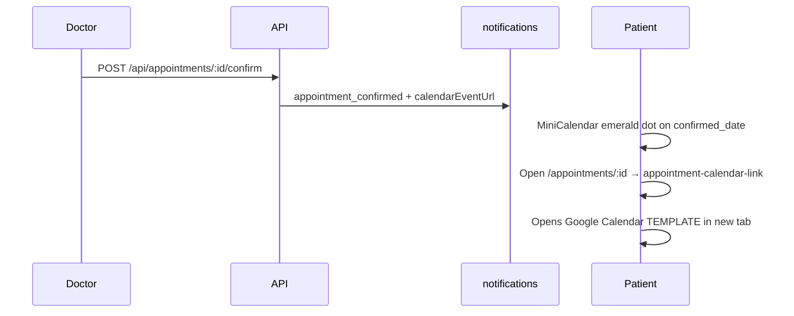

# 📅 Patient Portal — Appointments Page

**Version:** v1.7.51
**Last Updated:** June 8, 2026
**Route:** `/appointments`, `/book-appointment`, `/appointments/:id`
**Component:** `src/pages/AppointmentPages.tsx` (canonical); sidebar calendar in `src/components/MainLayout.tsx`
**Access:** 🔒 Authenticated patients
**Thai Title:** นัดหมายของฉัน / ขอนัดหมายแพทย์ / รายละเอียดนัดหมาย


## มาตรฐานเอกสาร (รายงานภาษาไทย)

เอกสารชุดนี้จัดทำให้สอดคล้อง**มาตรฐานการรายงานภาษาไทย**ของหน่วยงานราชการและสาธารณสุข (โครงสร้าง: วัตถุประสงค์ → ขอบเขต → ขั้นตอน → ผลลัพธ์ → ข้อควรระวัง → อ้างอิง)

| รายการ | ค่าที่ใช้ |
|--------|-----------|
| เอกสาร Word / รายงาน PDF | **TH Sarabun New** — เนื้อหา **16 pt**, หัวข้อระดับ 1 **18 pt**, หัวข้อระดับ 2 **16 pt** (ตัวหนา), ชื่อเรื่อง **22 pt**, ระยะบรรทัด **1.15**, จัดชิดซ้าย |
| สไลด์นำเสนอ PowerPoint | **FC Iconic** — หัวข้อสไลด์ **32 pt**, หัวข้อรอง **22 pt**, เนื้อหา **18 pt**, บันทึกวิทยากร **16 pt** |
| ตัวเลขและวันที่ | ใช้ พ.ศ. ในข้อความไทย; คั่นหลักพันแบบไทยเมื่อจำเป็น |
| อ้างอิงคู่มือ | `Documents/Documents/docs/guides/patient/USER_GUIDE_PATIENT_WORD_TH.docx`, `Documents/Documents/docs/guides/doctor/USER_GUIDE_DOCTOR_WORD_TH.docx`, `Documents/Documents/docs/guides/patient|doctor/USER_GUIDE_*_PPT_TH.pptx` |
| เอกสารปฏิบัติการ Production | `Documents/docs/markdown/operations/PRODUCTION_DEPLOYMENT_AND_TECHNICAL_UPDATE.md` |
| สร้าง/อัปเดตคู่มือ | `python scripts/build-portal-user-guides.py` |
| อัปเดตหน้ากระบวนการ | `python scripts/enrich-process-pages.py --force-steps` |
| ล้างข้อมูลทดสอบ (ไม่ re-seed demo) | `npm run cleanup:cloud-test-only` |
| การทดสอบอัตโนมัติ | Playwright Groups A–Q + Vitest — `tests/PROCESS_COVERAGE_MATRIX.md` |
| รุ่นเอกสารหน้ากระบวนการ | **ENRICH-9** (Word TH Sarabun New 16 pt / PPT FC Iconic — ขั้นตอน 8–12 รายการ + คำอธิบายเชิงรายงานทุกหน้า) |
| โครงสร้างเทคนิค (สถาปัตยกรรม) | `Documents/docs/technical/word/TECHNICAL_ARCHITECTURE_WORD_TH.docx`, `Documents/docs/technical/ppt/TECHNICAL_ARCHITECTURE_PPT_TH.pptx`, `Documents/docs/diagrams/diagrams.drawio` |
| สร้างเอกสารโครงสร้างเทคนิค | `python scripts/build-technical-architecture-docs.py` |

**โครงสร้างบังคับในแต่ละหน้า Processes/Pages:**

1. **คำอธิบายและบริบท (รายงานภาษาไทย)** — บทบาทผู้ใช้ ขอบเขตข้อมูล และลิงก์ workflow  
2. **ขั้นตอนการใช้งาน (ละเอียด)** — ลำดับปฏิบัติ พร้อมจุดตรวจสอบและ `data-testid`  
3. **ผลลัพธ์ที่คาดหวัง** — สถานะระบบ / API / ฐานข้อมูลหลังจบขั้นตอน

---


## 1. Purpose

Complete appointment management: view existing appointments, book new ones with AI-assisted symptom analysis, and view appointment details with meeting links.

---


## 2. Three Sub-Pages


### 2.1 Appointment List (`/appointments`)


### 2.2 Book Appointment (`/book-appointment`)


### 2.3 Appointment Detail (`/appointments/:id`)

---


## 3. Appointment List Page


### Layout

```text
┌─────────────────────────────────────────────────────────────────────┐
│  📅 นัดหมายของฉัน (My Appointments)                  [+ นัดหมายใหม่] │
│                                                                     │
│  Filter Tabs:                                                       │
│  [ทั้งหมด] [รอดำเนินการ] [ยืนยันแล้ว] [เสร็จสิ้น]                     │
│                                                                     │
│  Sort: [ล่าสุด ▼]                                                   │
│                                                                     │
│  ┌─────────────────────────────────────────────────────────────┐   │
│  │  🟡 รอดำเนินการ                     21 ม.ค. 2569 09:00       │   │
│  │  นพ. ทดสอบ ระบบ · อายุรกรรม                                   │   │
│  │  อาการ: ปวดหัว มึนงง                                          │   │
│  │  📹 Telehealth                                               │   │
│  └─────────────────────────────────────────────────────────────┘   │
│  ┌─────────────────────────────────────────────────────────────┐   │
│  │  🟢 ยืนยันแล้ว                       22 ม.ค. 2569 14:00       │   │
│  │  นพ. สมชาย แพทย์ · เวชศาสตร์ทั่วไป                             │   │
│  │  อาการ: ติดตามเบาหวาน                                         │   │
│  │  📹 [คัดลอกลิงก์] [เข้าร่วมประชุม]                              │   │
│  └─────────────────────────────────────────────────────────────┘   │
└─────────────────────────────────────────────────────────────────────┘
```


### Status Badges

| Status | Thai | Color | Description |
| ------ | ---- | ----- | ----------- |
| pending | รอดำเนินการ | Yellow | Awaiting doctor response |
| confirmed | ยืนยันแล้ว | Green | Doctor confirmed + meeting link |
| completed | เสร็จสิ้น | Blue | Consultation completed |
| cancelled | ยกเลิกแล้ว | Red | Appointment cancelled |
| in_pool | รอจัดสรร | Purple | In appointment pool |
| awaiting_doctor_response | รอแพทย์ตอบรับ | Orange | Assigned, waiting response |
| in_progress | กำลังดำเนินการ | Teal | Meeting in progress |
| no_show | ไม่มา | Gray | Patient didn't attend |
| rescheduled | เลื่อนนัด | Amber | Rescheduled to new time |


### Features


- Filter tabs (pending, all, confirmed, completed)


- Sort by newest/oldest


- Symptom preview on each card


- Meeting link with copy + join buttons for confirmed telehealth


- Click card → navigate to detail page

---


## 4. Book Appointment Page (3-Step Wizard)


### Book Appointment Layout

```text
┌─────────────────────────────────────────────────────────────────────┐
│  📅 ขอนัดหมายแพทย์ (Request Appointment)                            │
│                                                                     │
│  Progress: [1. อาการ ✓] ─── [2. กำหนดเวลา] ─── [3. ยืนยัน]        │
│                                                                     │
│  ┌─────────────────────────────────────────────────────────────┐   │
│  │                                                             │   │
│  │             (Current Step Content)                           │   │
│  │                                                             │   │
│  └─────────────────────────────────────────────────────────────┘   │
│                                                                     │
│  [← ย้อนกลับ]                                    [ถัดไป →]         │
└─────────────────────────────────────────────────────────────────────┘
```


### Step 1: Symptoms (อาการ) — SymptomInputStep Component

```text
┌─────────────────────────────────────────────────────────────────────┐
│  Input Tabs: [💬 ข้อความ] [🎤 เสียง] [📷 รูปภาพ]                    │
│                                                                     │
│  💬 Text Input Tab:                                                 │
│  ┌──────────────────────────────────────────┐                      │
│  │  Common Symptoms (quick buttons):        │                      │
│  │  [ปวดหัว] [ไข้] [ไอ] [ปวดท้อง] [คลื่นไส้] │                      │
│  │  [ปวดหลัง] [นอนไม่หลับ] [ผื่น] ...       │                      │
│  └──────────────────────────────────────────┘                      │
│  รายละเอียดอาการ:                                                   │
│  [textarea: บอกอาการของคุณ...]                                      │
│                                                                     │
│  🤖 AI Suggestion: "คุณอาจต้องการเพิ่มข้อมูล..." [ใช้คำแนะนำ]       │
│                                                                     │
│  📊 Medical Info Section:                                           │
│  ├── ระยะเวลา: [_] [วัน/สัปดาห์/เดือน]                               │
│  ├── ความรุนแรง: [1] [2] [3] [4] [5]                               │
│  ├── ☐ มีไข้ → อุณหภูมิ: [__]°C                                    │
│  ├── ยาที่ใช้อยู่: [__________]                                      │
│  ├── ประวัติแพ้ยา: [__________]                                      │
│  └── การรักษาก่อนหน้า: [__________]                                  │
│                                                                     │
│  [🤖 วิเคราะห์ด้วย AI]                                              │
│  ┌── AI Analysis Results ──────────────────────┐                   │
│  │  🔴 Triage: Urgent                          │                   │
│  │  💡 Reasoning: ...                          │                   │
│  │  🏠 Self-care: ...                          │                   │
│  │  ⚠️ Warning signs: ...                      │                   │
│  │  ⚕️ Specialty: อายุรกรรม                     │                   │
│  └──────────────────────────────────────────────┘                   │
│                                                                     │
│  🎤 Voice Input Tab:                                                │
│  [🔴 Record] → Playback → Transcript display                       │
│                                                                     │
│  📷 Image Input Tab:                                                │
│  [Choose Files] [📷 Camera] → Grid preview (max 5, 10MB each)      │
└─────────────────────────────────────────────────────────────────────┘
```


#### AI Symptom Analysis Features

| Feature | Description |
| ------- | ----------- |
| **Triage Level** | Emergency (red), Urgent (orange), Routine (green), Self-Care (blue) |
| **AI Reasoning** | Explanation of triage decision |
| **Self-Care Tips** | Recommendations if appropriate |
| **Warning Signs** | Red flags to watch for |
| **Suggested Specialty** | AI-recommended doctor specialty |
| **AI Description** | Improved symptom description suggestion |


### Step 2: Schedule + Doctor (กำหนดเวลา)

```text
┌─────────────────────────────────────────────────────────────────────┐
│  ประเภทนัดหมาย:                                                     │
│  [📹 Telehealth] [🏥 In-person]                                    │
│                                                                     │
│  ความเร่งด่วน:                                                      │
│  [🟢 ปกติ] [🟡 เร่งด่วน] [🔴 ฉุกเฉิน]                                │
│                                                                     │
│  📅 เลือกวันที่ (14-day grid):                                       │
│  [21] [22] [23] [24] [25] [26] [27]                                │
│  [28] [29] [30] [31] [ 1] [ 2] [ 3]                                │
│                                                                     │
│  ⏰ เลือกเวลา:                                                      │
│  เช้า:  [08:00] [08:30] [09:00] [09:30] [10:00] [10:30] [11:00]   │
│  บ่าย: [13:00] [13:30] [14:00] [14:30] [15:00] [15:30] [16:00]   │
│  เย็น: [17:00] [17:30] [18:00]                                     │
│                                                                     │
│  👨‍⚕️ เลือกแพทย์:                     [🔍 ค้นหา]                    │
│  ☐ ให้ระบบจัดสรรแพทย์ให้                                             │
│  ┌──────────────────────────────┐                                   │
│  │  นพ. ทดสอบ ระบบ              │                                   │
│  │  อายุรกรรม · ⭐ 4.8          │                                   │
│  │  [เลือกแพทย์]                │                                   │
│  └──────────────────────────────┘                                   │
│                                                                     │
│  🤖 AI แนะนำ: แผนก อายุรกรรม (based on symptoms)                    │
└─────────────────────────────────────────────────────────────────────┘
```


### Step 3: Confirm (ยืนยัน)

```text
┌─────────────────────────────────────────────────────────────────────┐
│  📋 ตรวจสอบข้อมูลนัดหมาย                                            │
│                                                                     │
│  👨‍⚕️ แพทย์: นพ. ทดสอบ ระบบ (อายุรกรรม)                              │
│  📅 วันที่: 22 มกราคม 2569                                          │
│  ⏰ เวลา: 09:00                                                    │
│  📹 ประเภท: Telehealth                                              │
│  🚨 ความเร่งด่วน: ปกติ                                               │
│                                                                     │
│  อาการ: ปวดหัว มึนงง ประมาณ 3 วัน                                    │
│  🎤 Voice: 1 recording attached                                     │
│  📷 Images: 2 images attached                                       │
│                                                                     │
│  [      ส่งคำขอนัดหมาย      ]                                       │
└─────────────────────────────────────────────────────────────────────┘
```

---


## 5. Appointment Detail Page


### Appointment Detail Layout

```text
┌─────────────────────────────────────────────────────────────────────┐
│  [← กลับ]                                                          │
│                                                                     │
│  ┌── Status Banner ──────────────────────────────────────────┐     │
│  │  🟢 ยืนยันแล้ว — แพทย์ยืนยันนัดหมายของคุณแล้ว                │     │
│  └────────────────────────────────────────────────────────────┘     │
│                                                                     │
│  👨‍⚕️ Doctor Info:                                                   │
│  นพ. ทดสอบ ระบบ · อายุรกรรม                                         │
│                                                                     │
│  📅 วันที่: 22 มกราคม 2569                                          │
│  ⏰ เวลา: 09:00 - 09:30                                            │
│  📹 ประเภท: Telehealth                                              │
│                                                                     │
│  📝 Symptom Information:                                            │
│  ├── อาการหลัก: ปวดหัว มึนงง                                        │
│  ├── ระยะเวลา: 3 วัน                                                │
│  ├── ความรุนแรง: 3/5                                                │
│  ├── ไข้: ไม่มี                                                      │
│  ├── ยาที่ใช้: Paracetamol                                          │
│  └── AI วิเคราะห์: Routine - อายุรกรรม                               │
│                                                                     │
│  Actions:                                                           │
│  [📆 Add to Google Calendar]  data-testid=appointment-calendar-link │
│  [📹 เข้าร่วมประชุม] (if confirmed telehealth)                      │
│  [📋 คัดลอกลิงก์] (copy meeting link)                               │
│  [👥 เชิญญาติ/เพื่อน] (invite guests)                               │
│  [❌ ยกเลิกนัดหมาย]                                                  │
│                                                                     │
│  ┌── Meeting Link Section (confirmed telehealth only) ──────┐     │
│  │  📹 ลิงก์การประชุม:                                        │     │
│  │  <https://meet.jit.si/isara-{roomId}>                       │     │
│  │  [📋 คัดลอก] [📹 เข้าร่วม] [👥 แชร์]                      │     │
│  │                                                           │     │
│  │  ⏰ ห้องประชุมจะเปิดก่อนเวลานัด 10 นาที                    │     │
│  │  👥 ญาติ/เพื่อนสามารถเข้าร่วมได้โดยไม่ต้องล็อกอิน          │     │
│  └───────────────────────────────────────────────────────────┘     │
│                                                                     │
│  ┌── Post-Meeting Results (completed only) ──────────────────┐     │
│  │  📋 ผลการตรวจ:                                             │     │
│  │  ├── วินิจฉัย: ความดันโลหิตสูง ระยะที่ 1                    │     │
│  │  ├── แผนการรักษา: ปรับยา Amlodipine 5mg                   │     │
│  │  ├── ยา: Amlodipine 5mg วันละ 1 เม็ด หลังอาหารเช้า         │     │
│  │  ├── นัดติดตาม: 22 ก.พ. 2569                               │     │
│  │  └── ⚠️ อาการเฝ้าระวัง: ปวดศีรษะรุนแรง, ตาพร่ามัว          │     │
│  │  [📥 ดาวน์โหลดเอกสารคำแนะนำ (PDF)]                        │     │
│  └───────────────────────────────────────────────────────────┘     │
└─────────────────────────────────────────────────────────────────────┘
```

---


## 6. Calendar integration (v1.7.51 — Teams/Zoom parity)

After the **assigned doctor** confirms a telehealth appointment, the patient sees the visit on **two calendar surfaces** without manual re-entry.

### 6.1 Sidebar MiniCalendar (`MainLayout.tsx`)

| Item | Detail |
|------|--------|
| Location | Left sidebar on every authenticated page |
| Data | `appointmentService.getByPatient()` — filters `status` in `confirmed`, `scheduled` |
| Visual | Emerald highlight on days with at least one confirmed visit |
| Test ID | `data-testid="mini-calendar-appointment-day"` on highlighted day cells |
| E2E | Playwright **D4cal** — optional assert after doctor confirm in group-D |

### 6.2 Appointment detail — Add to Google Calendar

| Item | Detail |
|------|--------|
| When shown | `status=confirmed` (or `scheduled`) and date/time known |
| Primary source | Patient notification `appointment_confirmed` → `data.calendarEventUrl` |
| Fallback | `buildCalendarEventUrl.ts` rebuilds Google Calendar TEMPLATE URL from appointment row |
| Test ID | `data-testid="appointment-calendar-link"` |
| Location field | **Izara Video Meeting** (not "Google Meet") |
| Duration | 30 minutes from `confirmed_time` (Asia/Bangkok) |

### 6.3 End-to-end calendar flow



### 6.4 Related E2E and unit tests

| Test | Scope |
|------|-------|
| **D4cal** | Notification `calendarEventUrl` + doctor `/schedule` + patient mini-calendar |
| `buildCalendarEventUrl.test.ts` | Patient-side URL builder |
| `calendarEventLinks.test.ts` | Doctor API `buildTelehealthCalendarUrl` |
| `appointmentMapper.test.ts` | `confirmed_date` → `appointmentDate` for UI |

---

## 7. Workflows


### Workflow 1: Book New Appointment

```text
Step 1:  Patient clicks "นัดหมายใหม่" from list or dashboard
Step 2:  Step 1 - Enter symptoms via text/voice/image
Step 3:  (Optional) Click "วิเคราะห์ด้วย AI" → POST /api/ai/symptom-triage
Step 4:  AI returns triage level + specialty recommendation
Step 5:  Fill medical info (duration, severity, fever, meds, allergies)
Step 6:  Click "ถัดไป" → Step 2
Step 7:  Select appointment type (telehealth/in-person)
Step 8:  Select urgency level
Step 9:  Select date from 14-day grid
Step 10: Select time slot
Step 11: Select doctor from list OR check "let system assign"
Step 12: Click "ถัดไป" → Step 3
Step 13: Review all details
Step 14: Click "ส่งคำขอนัดหมาย"
Step 15: If doctor selected → POST /api/appointments
Step 16: If no doctor → POST /api/appointment-pool (pool assignment)
Step 17: Success → Redirect to appointment list
Step 18: Notification sent to doctor/admin
```


### Workflow 2: Join Video Meeting (Full Jitsi Lobby Flow)

```text
Step 1:  Patient sees confirmed appointment with 🟢 ยืนยันแล้ว status
Step 2:  Appointment card shows:
         - [📋 คัดลอกลิงก์] (Copy Meeting Link)
         - [📹 เข้าร่วมประชุม] (Join Meeting)
         - [👥 เชิญญาติ/เพื่อน] (Invite Relatives/Friends)
Step 3:  Patient clicks "เข้าร่วมประชุม" → Opens Jitsi Meet in new tab
Step 4:  Jitsi URL format: <https://meet.jit.si/{roomName}#{config}>
Step 5:  Patient enters LOBBY (ห้องรอ) automatically
         - Shows: "กรุณารอแพทย์อนุมัติเข้าห้องประชุม..."
         - Patient sees own video preview
         - Patient can toggle mic/camera while waiting
Step 6:  Doctor sees patient in lobby → clicks "Admit"
Step 7:  Patient enters meeting room → video consultation begins
Step 8:  During meeting, patient has:
         - ✅ Video (camera on/off toggle)
         - ✅ Audio (microphone on/off toggle)
         - ✅ Text chat (in-meeting chat panel)
         - ✅ Screen share (if needed)
Step 9:  Real-time transcription runs (if enabled by doctor)
Step 10: Doctor ends meeting → Patient sees "การประชุมสิ้นสุดแล้ว"
Step 11: Appointment status changes: in_progress → completed
Step 12: Doctor processes AI summary → validates → creates EMR
Step 13: Patient receives notification: "แพทย์ส่งผลการตรวจ"
```


### Workflow 3: Share Meeting Link with Relatives/Friends (Guest Invite)

```text
Step 1:  Patient views confirmed appointment with meeting link
Step 2:  Clicks "👥 เชิญญาติ/เพื่อน" (Invite Relatives/Friends)
Step 3:  Share dialog appears with options:
         - 📋 Copy link to clipboard
         - 📱 Share via LINE
         - ✉️ Share via email
         - 📲 Share via SMS
Step 4:  Guest receives meeting link (no login required)
Step 5:  Guest clicks link → Enters Jitsi LOBBY
Step 6:  Doctor sees guest in lobby → admits them
Step 7:  Guest joins meeting as observer (video + audio + chat)

Note: Guests do NOT need an Isara account.
      Guests do NOT have access to medical records.
      The meeting link is valid only for the scheduled appointment time.
      Maximum 5 guests per meeting.
```


### Workflow 4: Post-Meeting Results (What Patient Receives)

```text
Step 1:  After meeting ends, doctor completes consultation:
         - AI generates meeting summary from transcription
         - Doctor validates and edits summary
         - Doctor creates EMR record
Step 2:  Patient receives the following (patient-friendly Thai format):
         ✅ Chief complaint and diagnosis (ภาษาไทยที่เข้าใจง่าย)
         ✅ Treatment plan summary (แผนการรักษา)
         ✅ Medications with instructions (ยาและวิธีกินยา)
         ✅ Patient Instruction Sheet PDF (เอกสารคำแนะนำผู้ป่วย)
         ✅ Follow-up schedule (กำหนดนัดติดตาม)
         ✅ Warning signs to watch for (อาการที่ต้องเฝ้าระวัง)
Step 3:  Patient does NOT receive:
         ❌ Internal doctor notes (บันทึกภายในของแพทย์)
         ❌ Raw AI outputs (ข้อมูลดิบจาก AI)
         ❌ Doctor-to-doctor communications
         ❌ CDS alerts (การแจ้งเตือนสนับสนุนการตัดสินใจทางคลินิก)
Step 4:  Results appear in:
         - 📊 Dashboard → Latest Result widget
         - 📋 Timeline → Treatment History entry
         - 💊 PHR → Health Logs
Step 5:  Patient can download Patient Instruction Sheet as PDF:
         - Click "📥 ดาวน์โหลดเอกสารคำแนะนำ"
         - PDF in Thai with: diagnosis, medications, instructions,
           follow-up date, warning signs
Step 6:  Appointment card status updates to 🔵 เสร็จสิ้น (Completed)
         with link: [ดูผลการรักษา] (View Results)
```


### Workflow 5: Cancel Appointment

```text
Step 1: Patient views appointment detail
Step 2: Clicks "ยกเลิกนัดหมาย" (Cancel)
Step 3: Confirmation dialog appears
Step 4: Patient confirms → PATCH /api/appointments/:id
Step 5: Status changes to "cancelled"
Step 6: Notification sent to doctor
```

---


## 7. API Endpoints

| Method | Endpoint | Purpose |
| ------ | -------- | ------- |
| GET | `/api/appointments` | List patient's appointments |
| GET | `/api/appointments/:id` | Get appointment details |
| POST | `/api/appointments` | Create new appointment |
| PATCH | `/api/appointments/:id` | Update/cancel appointment |
| POST | `/api/appointment-pool` | Submit to unassigned pool |
| GET | `/api/doctors` | List available doctors |
| GET | `/api/appointments/:id/meeting-link` | Get meeting link for confirmed appointment |
| POST | `/api/appointments/:id/share-link` | Generate shareable guest link |
| GET | `/api/appointments/:id/results` | Get post-meeting consultation results |
| GET | `/api/appointments/:id/instruction-sheet` | Download Patient Instruction Sheet (PDF) |
| GET | `/api/appointments/:id/emr-summary` | Get patient-friendly EMR summary |

---


## 8. Meeting Technology

| Component | Detail |
| --------- | ------ |
| **Video Platform** | Jitsi Meet (FREE, meet.jit.si) |
| **Lobby** | Enabled — patient waits until doctor admits |
| **Guest Access** | Via shared link, no login required |
| **Max Guests** | 5 per meeting (relatives/friends) |
| **Features** | Video, audio, text chat, screen share |
| **Recording** | Not recorded (privacy) |
| **Transcription** | Real-time AI transcription (doctor-side) |
| **Patient Portal** | Port 3005 |
| **Data Storage** | PostgreSQL |

---


## 9. Patient Data Privacy in Meetings

| What Patient RECEIVES | What Patient Does NOT Receive |
| --------------------- | ----------------------------- |
| ✅ Chief complaint & diagnosis (patient-friendly Thai) | ❌ Internal doctor notes |
| ✅ Treatment plan summary | ❌ Raw AI outputs |
| ✅ Medications with instructions (วิธีกินยา) | ❌ Doctor-to-doctor communications |
| ✅ Patient Instruction Sheet (PDF, Thai) | ❌ CDS alerts (internal clinical decision support) |
| ✅ Follow-up schedule | ❌ AI confidence scores |
| ✅ Warning signs to watch for | ❌ Billing/insurance internal codes |

| Method | Endpoint | Description |
| ------ | -------- | ----------- |
| POST | `/api/ai/symptom-triage` | AI symptom analysis |
| POST | `/api/ai/symptom-suggest` | AI description improvement |

---


## 8. Connections to Other Pages

| From | Action | Destination |
| ---- | ------ | ----------- |
| Dashboard | Quick Action | → Book Appointment |
| Appointment List | Click card | → Appointment Detail |
| Appointment Detail | Join Meeting | → Jitsi Meet (external) |
| Appointment Detail | Add to Calendar | → Google Calendar (external) |
| Notification | Click notification | → Appointment Detail |

---


## 9. AI Agent Improvement Opportunities


- **Smart symptom interview**: AI conversational symptom gathering


- **Auto-schedule optimization**: AI find optimal time based on urgency + doctor availability


- **Waiting time prediction**: AI estimate wait time for each doctor


- **Follow-up booking**: AI auto-suggest follow-up appointments after consultation


- **Multilingual symptom input**: AI translate symptoms from any language


- **Image diagnosis**: AI preliminary analysis of uploaded medical images

---


## PostgreSQL Database Integration


### Tables Used

| Table | Operation | Description |
| ----- | --------- | ----------- |
| appointments | CRUD | Create, view, update, cancel appointments |
| users | SELECT | Available doctors list (role = 'doctor') |
| doctor_schedules | SELECT | Available time slots for booking |


### API Endpoints

| Endpoint | Method | DB Operation |
| -------- | ------ | ------------ |
| /api/appointments | GET | SELECT appointments WHERE patient_id = current |
| /api/appointments | POST | INSERT appointments, SELECT doctor_schedules (available slots) |


### Real-time Events


- **NOTIFY:** appointment_changes → Socket.IO appointment status updates


### Deployment


- **Local Docker:** izara-postgres container (localhost:5433 external / 5432 internal) → database: izara_phase1


- **Production:** GCE VM at 35.240.157.230:5432 → database: izara_phase1 (asia-southeast1)


- **Service deployed via:** Cloud Run (gen2, CPU Boost) + Cloud Build CI/CD

## คำอธิบายและบริบท (รายงานภาษาไทย)

### วัตถุประสงค์

หน้า **05 Appointments** อธิบายการทำงานของพอร์ทัลผู้ป่วย ในระบบ Isara Anywhere ให้เจ้าหน้าที่ปฏิบัติการและทีมสนับสนุนใช้เป็นแนวทางเดียวกันกับคู่มือผู้ใช้และการทดสอบอัตโนมัติ

### มาตรฐานการจัดทำเอกสาร

- **รายงาน / Word:** แบบอักษร **TH Sarabun New** ขนาดเนื้อหา **16 pt** ระยะบรรทัด **1.15** (มาตรฐานรายงานภาษาไทย)
- **PowerPoint:** แบบอักษร **FC Iconic** หัวข้อ **32 pt** เนื้อหา **18 pt**
- สร้างไฟล์จริง: `python scripts/build-portal-user-guides.py` → `Documents/Documents/docs/guides/patient|doctor/USER_GUIDE_*_WORD_TH.docx` และ `*_PPT_TH.pptx`

### ขอบเขตและบทบาท

ผู้ป่วยดำเนินการบนข้อมูลของตนเองเท่านั้น (JWT `role=patient`) — จองนัด เข้าร่วมประชุม ดู PHR/EMR ที่แพทย์เผยแพร่แล้ว
ลิงก์ Guest ต้องออกจาก **Patient Portal** เท่านั้น

### ลำดับความสัมพันธ์กับ workflow อื่น

1. **นัดหมาย** — สถานะ `confirmed` ก่อนเปิดวิดีโอ (`Processes/Appointment_Workflows.md`)
2. **ประชุม** — Izara Lobby → Jitsi → บันทึก → สรุป AI (`Processes/VIDEO_MEETING_JITSI_GEMINI.md`)
3. **บันทึกทางการแพทย์** — EMR / สั่งยา / แล็บ หลังแพทย์ตรวจสอบ AI

### การตรวจสอบคุณภาพ (QA)

| ลำดับ | รายการตรวจ | วิธี |
|------|------------|------|
| 1 | UI แจ้งเตือน | ไม่มี toast error / banner แดง |
| 2 | API | DevTools Network — status 2xx |
| 3 | ทดสอบอัตโนมัติ | Playwright + data-testid ใน tests/SELECTORS.md |
| 4 | เอกสาร | Word TH Sarabun New 16 pt / PPT FC Iconic จาก build-portal-user-guides.py |

### ผลลัพธ์ที่คาดหวังหลังใช้งานหน้านี้

- ผู้ใช้บรรลุวัตถุประสงค์ของหน้าโดยไม่ต้องขอความช่วยเหลือจากทีม IT
- ข้อมูลที่บันทึกปรากฏบนแดชบอร์ด/PHR/EMR ตามสิทธิ์
- เหตุการณ์สำคัญ (login, จองนัด, admit, จบประชุม) มี log ตรวจสอบได้ใน Cloud Logging

**เอกสารอ้างอิงหลัก:**

- `Processes/VIDEO_MEETING_JITSI_GEMINI.md` — วิดีโอ, lobby, บันทึก, AI
- `Processes/Appointment_Workflows.md` — Pool และสถานะนัด
- `Documents/docs/markdown/operations/PRODUCTION_DEPLOYMENT_AND_TECHNICAL_UPDATE.md` — deploy และ runbook
- `Documents/Documents/docs/guides/patient|doctor/USER_GUIDE_*_WORD_TH.docx` / `Documents/Documents/docs/guides/patient|doctor/USER_GUIDE_*_PPT_TH.pptx` — คู่มือผู้ใช้ฉบับสมบูรณ์

### องค์ประกอบ UI หลัก (data-testid)

- `appointment-wizard-*`
- `appointment-join-meeting-btn`

*(รุ่นเอกสารหน้านี้: ENRICH-9 — คู่มือ Word ตาราง+สารบัญ / PPT FC Iconic รายหน้าละเอียด v1.7.33)*


## ขั้นตอนการใช้งาน (ละเอียด)

**เงื่อนไขก่อนเริ่ม:** เข้าสู่ระบบด้วยบัญชีที่มีสิทธิ์ถูกต้อง, ใช้ HTTPS, เบราว์เซอร์ Chrome/Edge ล่าสุด, อินเทอร์เน็ตเสถียร (วิดีโอ ≥10 Mbps)

1. ตรวจสอบสถานะนัดปัจจุบัน (pending / in_pool / awaiting_doctor_response / confirmed)
   - **ปฏิบัติ:** ดำเนินการตาม UI/API จนเสร็จขั้นนี้
   - **รายละเอียด:** ดำเนินการบนหน้าจอจนจบขั้นนี้ — อย่าข้ามขั้นที่มีการยืนยัน (confirm/modal)
   - **รายละเอียด:** บันทึก `appointmentId` / `meetingId` จาก URL หรือ Network tab หากต้องส่งต่อทีมสนับสนุน
   - **รายละเอียด:** ลำดับขั้นที่ 1 ต้องสำเร็จก่อนขั้นถัดไป — หากล้มเหลวให้จับภาพหน้าจอและ requestId จาก Cloud Logging
   - **รายละเอียด:** จัดทำรายงาน/คู่มืออ้างอิง: Word ใช้ TH Sarabun New 16 pt (ระยะบรรทัด 1.15) — สไลด์ใช้ FC Iconic ตามมาตรฐานรายงานภาษาไทย
   - **UI หลัก:** `appointment-wizard-*`, `appointment-join-meeting-btn`
   - **ตรวจสอบ:** ไม่มี error แดง / toast ล้มเหลว; HTTP 2xx บน API หลัก
   - **อ้างอิงทดสอบ:** `tests/SELECTORS.md` + Playwright group ที่เกี่ยวข้อง
2. ดำเนินการตามบทบาท: ผู้ป่วยจอง | แอดมินจัดสรร | แพทย์ยืนยัน
   - **ปฏิบัติ:** ดำเนินการตาม UI/API จนเสร็จขั้นนี้
   - **รายละเอียด:** ดำเนินการบนหน้าจอจนจบขั้นนี้ — อย่าข้ามขั้นที่มีการยืนยัน (confirm/modal)
   - **รายละเอียด:** บันทึก `appointmentId` / `meetingId` จาก URL หรือ Network tab หากต้องส่งต่อทีมสนับสนุน
   - **รายละเอียด:** ลำดับขั้นที่ 2 ต้องสำเร็จก่อนขั้นถัดไป — หากล้มเหลวให้จับภาพหน้าจอและ requestId จาก Cloud Logging
   - **รายละเอียด:** จัดทำรายงาน/คู่มืออ้างอิง: Word ใช้ TH Sarabun New 16 pt (ระยะบรรทัด 1.15) — สไลด์ใช้ FC Iconic ตามมาตรฐานรายงานภาษาไทย
   - **ตรวจสอบ:** ไม่มี error แดง / toast ล้มเหลว; HTTP 2xx บน API หลัก
   - **อ้างอิงทดสอบ:** `tests/SELECTORS.md` + Playwright group ที่เกี่ยวข้อง
3. ตรวจ KPI คิว (`queue-count`) และรายการใน `queue-list`
   - **ปฏิบัติ:** ดำเนินการตาม UI/API จนเสร็จขั้นนี้
   - **รายละเอียด:** ดำเนินการบนหน้าจอจนจบขั้นนี้ — อย่าข้ามขั้นที่มีการยืนยัน (confirm/modal)
   - **รายละเอียด:** บันทึก `appointmentId` / `meetingId` จาก URL หรือ Network tab หากต้องส่งต่อทีมสนับสนุน
   - **รายละเอียด:** ลำดับขั้นที่ 3 ต้องสำเร็จก่อนขั้นถัดไป — หากล้มเหลวให้จับภาพหน้าจอและ requestId จาก Cloud Logging
   - **รายละเอียด:** จัดทำรายงาน/คู่มืออ้างอิง: Word ใช้ TH Sarabun New 16 pt (ระยะบรรทัด 1.15) — สไลด์ใช้ FC Iconic ตามมาตรฐานรายงานภาษาไทย
   - **UI:** ใช้ `data-testid` ที่ระบุในข้อความขั้นตอน
   - **ตรวจสอบ:** ไม่มี error แดง / toast ล้มเหลว; HTTP 2xx บน API หลัก
   - **อ้างอิงทดสอบ:** `tests/SELECTORS.md` + Playwright group ที่เกี่ยวข้อง
4. อัปเดต realtime ผ่าน Socket.IO / รีเฟรช
   - **ปฏิบัติ:** ดำเนินการตาม UI/API จนเสร็จขั้นนี้
   - **รายละเอียด:** ดำเนินการบนหน้าจอจนจบขั้นนี้ — อย่าข้ามขั้นที่มีการยืนยัน (confirm/modal)
   - **รายละเอียด:** บันทึก `appointmentId` / `meetingId` จาก URL หรือ Network tab หากต้องส่งต่อทีมสนับสนุน
   - **รายละเอียด:** ลำดับขั้นที่ 4 ต้องสำเร็จก่อนขั้นถัดไป — หากล้มเหลวให้จับภาพหน้าจอและ requestId จาก Cloud Logging
   - **รายละเอียด:** จัดทำรายงาน/คู่มืออ้างอิง: Word ใช้ TH Sarabun New 16 pt (ระยะบรรทัด 1.15) — สไลด์ใช้ FC Iconic ตามมาตรฐานรายงานภาษาไทย
   - **ตรวจสอบ:** ไม่มี error แดง / toast ล้มเหลว; HTTP 2xx บน API หลัก
   - **อ้างอิงทดสอบ:** `tests/SELECTORS.md` + Playwright group ที่เกี่ยวข้อง
5. เริ่มวิดีโอคอลเมื่อสถานะ confirmed
   - **ปฏิบัติ:** ดำเนินการตาม UI/API จนเสร็จขั้นนี้
   - **รายละเอียด:** ดำเนินการบนหน้าจอจนจบขั้นนี้ — อย่าข้ามขั้นที่มีการยืนยัน (confirm/modal)
   - **รายละเอียด:** บันทึก `appointmentId` / `meetingId` จาก URL หรือ Network tab หากต้องส่งต่อทีมสนับสนุน
   - **รายละเอียด:** ลำดับขั้นที่ 5 ต้องสำเร็จก่อนขั้นถัดไป — หากล้มเหลวให้จับภาพหน้าจอและ requestId จาก Cloud Logging
   - **รายละเอียด:** จัดทำรายงาน/คู่มืออ้างอิง: Word ใช้ TH Sarabun New 16 pt (ระยะบรรทัด 1.15) — สไลด์ใช้ FC Iconic ตามมาตรฐานรายงานภาษาไทย
   - **ตรวจสอบ:** ไม่มี error แดง / toast ล้มเหลว; HTTP 2xx บน API หลัก
   - **อ้างอิงทดสอบ:** `tests/SELECTORS.md` + Playwright group ที่เกี่ยวข้อง
6. บันทึก EMR/สั่งยา/แล็บหลังจบการพบ
   - **ปฏิบัติ:** ดำเนินการตาม UI/API จนเสร็จขั้นนี้
   - **รายละเอียด:** ดำเนินการบนหน้าจอจนจบขั้นนี้ — อย่าข้ามขั้นที่มีการยืนยัน (confirm/modal)
   - **รายละเอียด:** บันทึก `appointmentId` / `meetingId` จาก URL หรือ Network tab หากต้องส่งต่อทีมสนับสนุน
   - **รายละเอียด:** ลำดับขั้นที่ 6 ต้องสำเร็จก่อนขั้นถัดไป — หากล้มเหลวให้จับภาพหน้าจอและ requestId จาก Cloud Logging
   - **รายละเอียด:** จัดทำรายงาน/คู่มืออ้างอิง: Word ใช้ TH Sarabun New 16 pt (ระยะบรรทัด 1.15) — สไลด์ใช้ FC Iconic ตามมาตรฐานรายงานภาษาไทย
   - **รายละเอียด:** EMR จาก AI ต้อง `ai_summary_approved = false` จนแพทย์ตรวจและลงนาม
   - **ตรวจสอบ:** ไม่มี error แดง / toast ล้มเหลว; HTTP 2xx บน API หลัก
   - **อ้างอิงทดสอบ:** `tests/SELECTORS.md` + Playwright group ที่เกี่ยวข้อง

### ผลลัพธ์ที่คาดหวัง (สรุป)

- หน้าจอแสดงสถานะสำเร็จตามบทบาท (patient / doctor / guest)
- ไม่มี HTTP 4xx/5xx บนฟังก์ชันหลักของหน้านี้
- ข้อมูลใน PostgreSQL สอดคล้อง UI (เมื่อมีนัด/ประชุม/EMR)
- `data-testid` ตรงกับ `tests/SELECTORS.md`

### ข้อควรระวัง

- ข้อมูลสุขภาพเป็นความละเอียดอ่อน — ปฏิบัติตาม PDPA และนโยบายโรงพยาบาล
- อย่าแชร์ลิงก์ประชุมหรือ JWT ทางช่องทางไม่ปลอดภัย
- ผลลัพธ์ AI ไม่ใช่การวินิจฉัย — แพทย์ต้องตรวจก่อนลง EMR


---

## Automated verification

| Field | Value |
|-------|-------|
| **Status** | covered |
| **Unit tests** | `appointmentWorkflow, appointmentSlotLock.test.ts` |
| **UI (Playwright)** | Group D, E, Q |
| **data-testid** | See [tests/SELECTORS.md](../../tests/SELECTORS.md) |
| **Last verified** | 2026-05-22 |

**Run locally**

```bash
npm run test:unit
npm run test:e2e:meeting-lifecycle   # meeting pages only; needs D→D-host first
```

**Matrix row:** `05_Appointments_Page` in [tests/PROCESS_COVERAGE_MATRIX.md](../../tests/PROCESS_COVERAGE_MATRIX.md)

**v1.7.49 regression:** After doctor accept, appointment moves to **Confirmed** tab (not lost). Pending filter still shows `in_pool` / `awaiting_doctor_response`. Vitest: `defectIsaraPdfMeetingQueue` DPDF-Q3.

---

## Detailed Workflow — Tabs After Doctor Accept (v1.7.51)

1. Pending tab: `in_pool`, `awaiting_doctor_response`, `pending` only  
2. After confirm: item leaves Pending → appears on **Confirmed** tab  
3. Banner `data-testid="confirmed-tab-hint"` when confirmed items exist while viewing Pending  
4. Realtime refresh via `useRealtimeSync` → `onAppointmentChange`  
5. Confirmed cards: `data-testid="appointment-confirmed-badge"`  

