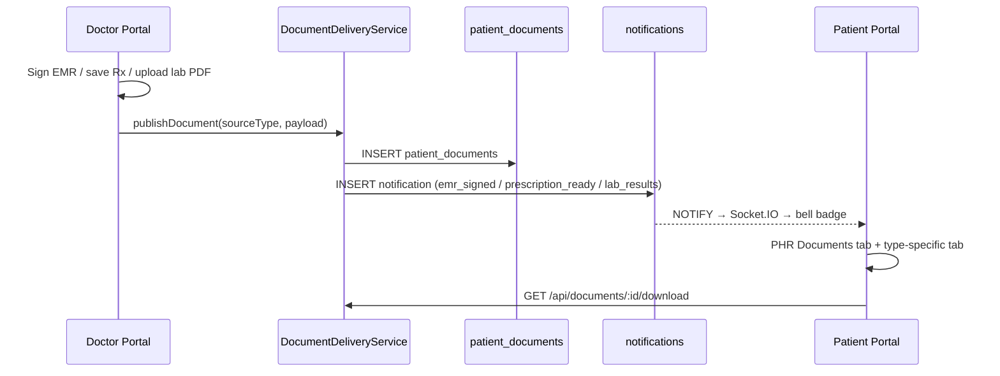

# ขั้นตอนส่งมอบเอกสารทางคลินิก

> **เอกสารภาษาไทย** — สร้างอัตโนมัติจาก `Clinical_Document_Delivery_Workflows.md`  
> **ต้นฉบับภาษาอังกฤษ:** [`Clinical_Document_Delivery_Workflows.md`](../Clinical_Document_Delivery_Workflows.md)  
> **อัปเดต:** 9 กรกฎาคม 2569 · รัน `python scripts/sync-processes-thai.py` เพื่อสร้างใหม่

**เวอร์ชัน:** 2.4.0  
**อัปเดตล่าสุด:** July 9, 2026  
**สถานะ:** Canonical (PostgreSQL + `patient_documents` registry)


---

## สารบัญ

1. [Overview](#1-overview)
2. [End-to-end delivery pipeline](#2-end-to-end-delivery-pipeline)
3. [Document types](#3-document-types)
4. [EMR delivery chain](#4-emr-delivery-chain)
5. [Lab / imaging delivery](#5-lab--imaging-delivery)
6. [ใบสั่งยา delivery](#6-ใบสั่งยา-delivery)
7. [ผู้ป่วย upload](#7-ผู้ป่วย-upload)
8. [Security](#8-security)
9. [APIs](#9-apis)
10. [Database](#10-database)
11. [Cross-references](#11-cross-references)

---

## 1. ภาพรวม

All clinical artifacts delivered to patients flow through a single registry table **`patient_documents`** and **`DocumentDeliveryService`** on แพทย์ and ผู้ป่วย backends.

Patients view files in **PHR → เอกสารทางการแพทย์** (Documents tab) and type-specific tabs (Lab, ใบสั่งยา, Treatment Results).

| Layer | Component | Role |
| ----- | --------- | ---- |
| พอร์ทัลแพทย์ | `documentDeliveryService.cjs` | Publish ลงนามแล้ว EMR, Rx, lab/imaging PDFs |
| พอร์ทัลผู้ป่วย | `documentDeliveryService.ts` | List, download, upload ผู้ป่วย documents |
| Database | `patient_documents` | Canonical registry with `source_type`, `file_path`, metadata |
| การแจ้งเตือน | `notifications` + NOTIFY | Real-time bell + email on new documents |

---

## 2. ลำดับการส่งมอบเอกสารแบบครบวงจร



### Working order (clinical visit → patient receipt)

| ขั้นตอน | ผู้ดำเนินการ | การกระทำ | Artifact | Next doc |
| ---- | ----- | ------ | -------- | -------- |
| 1 | แพทย์ | End meeting + Man-in-the-Loop (แพทย์ตรวจสอบก่อนส่งถึงผู้ป่วย) approve AI | `meeting_records.ai_summary` | [POST_MEETING_WORKFLOW.md](POST_MEETING_WORKFLOW.md) |
| 2 | แพทย์ | ลงนาม EMR in CompleteEMREditor | `emr.status = signed` | §4 below |
| 3 | Backend | Publish `emr_report` + `instruction_sheet` | `patient_documents` rows | This doc |
| 4 | แพทย์ | Save ใบสั่งยา (optional) | `prescriptions` + `prescription` doc | §6 |
| 5 | แพทย์ | Enter lab/imaging results + PDF (optional) | `lab_orders` / `imaging_orders` | §5 |
| 6 | System | แจ้งผู้ป่วย | `notifications` | [Notification_Workflows.md](Notification_Workflows.md) |
| 7 | ผู้ป่วย | View PHR → Documents / Treatment Results | Download via API | [Pages/Patient-Portal/06_PHR_Page.md](Pages/Patient-Portal/06_PHR_Page.md) |

```text
┌─────────────────────────────────────────────────────────────────────────┐
│              CLINICAL DOCUMENT DELIVERY (patient-facing)                 │
├─────────────────────────────────────────────────────────────────────────┤
│                                                                          │
│  DOCTOR PORTAL                          PATIENT PORTAL                   │
│  ┌──────────────────┐                  ┌──────────────────┐              │
│  │ CompleteEMREditor │──sign EMR──────►│ PHR → ผลการรักษา  │              │
│  │ CompletePrescribing│──save Rx──────►│ PHR → ใบสั่งยา    │              │
│  │ CompleteLabOrders  │──results+PDF──►│ PHR → แล็บ/ภาพ    │              │
│  └────────┬─────────┘                  │ PHR → เอกสาร      │              │
│           │                             └────────▲─────────┘              │
│           ▼                                      │                        │
│  ┌──────────────────┐     NOTIFY + Socket.IO     │                        │
│  │ patient_documents │────────────────────────────┘                        │
│  │ (single registry) │                                                   │
│  └──────────────────┘                                                    │
└─────────────────────────────────────────────────────────────────────────┘
```

---

## 3. ประเภทเอกสาร

| source_type | แพทย์ การกระทำ | ผู้ป่วย view |
|-------------|---------------|--------------|
| `emr_report` | Sign EMR in CompleteEMREditor | Treatment Results + Documents |
| `instruction_sheet` | EMR sign / meeting validate | Documents + meeting instructions API |
| `lab_report` | Upload results/PDF in Lab Orders | Lab tab + Documents |
| `imaging_report` | Imaging tab result upload | Lab & Imaging + Documents |
| `prescription` | Save prescription | Prescriptions tab + Documents |
| `patient_upload` | N/A (patient) | Documents upload |

---

## 4. EMR delivery chain

1. แพทย์ signs EMR → `PUT /api/emr/:id` + `POST /api/patients/:id/health-logs` (authenticated)
2. Backend sets `emr.status = signed`, publishes `emr_report` + `instruction_sheet` to `patient_documents`
3. `POST /api/notifications/emr-signed` notifies ผู้ป่วย
4. ผู้ป่วย reads mapped `HealthLogEntry` via `GET /api/phr/:id/health-logs` (ลงนามแล้ว-only)

---

## 5. Lab / imaging delivery

1. แพทย์ submits `PUT /api/lab-orders/:id/results` or `PUT /api/imaging-orders/:id/results` with optional PDF base64 in `documents[]`
2. Each attachment → `publishDocument({ sourceType: 'lab_report' | 'imaging_report' })`
3. Notification `lab_results` / `imaging_results`

---

## 6. Prescription delivery

1. `POST /api/prescriptions` creates Rx + publishes text/PDF artifact
2. Notification `prescription_ready`
3. ผู้ป่วย `GET /api/prescriptions` + Documents tab

---

## 7. Patient upload

1. `POST /api/patients/documents` (JSON base64)
2. `GET /api/documents/:id/download`

---

## 8. ความปลอดภัย

- Patients see **ลงนามแล้ว EMR only**
- Allergy **BLOCK** on conflicting ใบสั่งยา
- Clinical GCS paths disabled (`DISABLE_GCS_CLINICAL` default)

---

## 9. APIs

| Method | Path | Role |
|--------|------|------|
| GET | `/api/patients/documents` | Patient list |
| POST | `/api/patients/documents` | Patient upload |
| GET | `/api/documents/:id/download` | Patient download |
| GET | `/api/patients/:patientId/documents` | Doctor list/publish |
| POST | `/api/patients/:patientId/messages` | Doctor → patient message |

---

## 10. ฐานข้อมูล

See migration `scripts/database/migrations/v2.3.0-patient-documents-and-messages.sql`.

| Table | Purpose |
| ----- | ------- |
| `patient_documents` | Registry of all deliverable clinical files |
| `patient_messages` | Doctor-to-patient messages linked to visits |

---

## 11. เอกสารอ้างอิง

| Topic | Document |
| ----- | -------- |
| Platform pipeline | [WORKFLOW_CONNECTIONS.md](WORKFLOW_CONNECTIONS.md) §3 |
| EMR signing | [Health_Records_Processes.md](Health_Records_Processes.md) |
| หลังประชุม AI → EMR | [POST_MEETING_WORKFLOW.md](POST_MEETING_WORKFLOW.md) |
| การแจ้งเตือน | [Notification_Workflows.md](Notification_Workflows.md) |
| PHR UI | [Pages/Patient-Portal/06_PHR_Page.md](Pages/Patient-Portal/06_PHR_Page.md) |