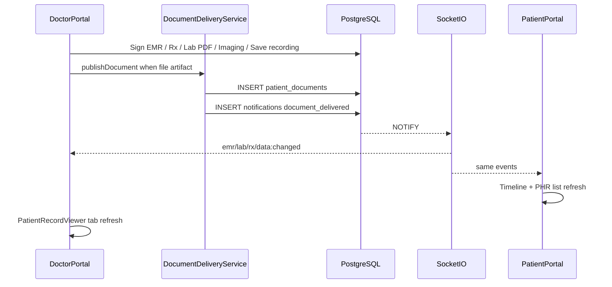

# ขั้นตอนส่งมอบเอกสารทางคลินิก

> **เอกสารภาษาไทย** — สร้างอัตโนมัติจาก `Clinical_Document_Delivery_Workflows.md`  
> **ต้นฉบับภาษาอังกฤษ:** [`Clinical_Document_Delivery_Workflows.md`](../Clinical_Document_Delivery_Workflows.md)  
> **อัปเดต:** 9 กรกฎาคม 2569 · รัน `python scripts/sync-processes-thai.py` เพื่อสร้างใหม่

**เวอร์ชัน:** 2.5.0  
**อัปเดตล่าสุด:** July 10, 2026  
**สถานะ:** Canonical (PostgreSQL + `patient_documents` registry + meeting recordings)

---

## สารบัญ

1. [Overview](#1-overview)
2. [End-to-end delivery pipeline](#2-end-to-end-delivery-pipeline)
3. [Document types](#3-document-types)
4. [EMR delivery chain](#4-emr-delivery-chain)
5. [Lab / imaging delivery](#5-lab--imaging-delivery)
6. [ใบสั่งยา delivery](#6-ใบสั่งยา-delivery)
7. [Meeting video delivery](#7-meeting-video-delivery)
8. [ผู้ป่วย upload](#8-ผู้ป่วย-upload)
9. [Near-real-time sync](#9-near-real-time-sync)
10. [Security](#10-security)
11. [APIs](#11-apis)
12. [Database](#12-database)
13. [Cross-references](#13-cross-references)

---

## 1. ภาพรวม

All clinical file artifacts delivered to patients flow through **`patient_documents`** and **`DocumentDeliveryService`**. Meeting videos stay on **`meeting_records.recording_url`** but use the same authenticated download UX.

| Layer | Component | Role |
| ----- | --------- | ---- |
| พอร์ทัลแพทย์ | `documentDeliveryService.cjs` + PatientRecordViewer | Publish + list/download parity |
| พอร์ทัลผู้ป่วย | `documentDeliveryService.ts` + PHR + Timeline | List, download, upload |
| Meeting Server | recording serve `?download=1` | Attachment download for videos |
| การแจ้งเตือน | `document_delivered` + type-specific | Bell + Socket.IO refresh |

**ผู้ป่วย labels:** ประวัติการรับยา (Rx history), ยาที่ใช้ปัจจุบัน (self-reported).  
**แพทย์ labels:** ประวัติการจ่ายยา (Rx history), เอกสาร, การประชุม.

---

## 2. ลำดับการส่งมอบเอกสารแบบครบวงจร

### Working order (clinical visit → both portals)

| ขั้นตอน | ผู้ดำเนินการ | การกระทำ | Artifact | ผู้ป่วย sees | แพทย์ sees |
| ---- | ----- | ------ | -------- | ------------ | ----------- |
| 1 | แพทย์ | Record + end meeting | `meeting_records.recording_url` | Timeline meeting + Download | Meetings tab + Download |
| 2 | แพทย์ | ลงนาม EMR | `emr_report` + `instruction_sheet` | Timeline + Documents | EMR + Docs |
| 3 | แพทย์ | Prescribe | `prescriptions` + `prescription` doc | **ประวัติการรับยา** + Documents | **ประวัติการจ่ายยา** + Docs |
| 4 | แพทย์ | Lab/imaging results + PDF | `lab_report` / `imaging_report` | Lab & Imaging + Documents | Labs & Imaging + Docs |
| 5 | ผู้ป่วย | Upload file | `patient_upload` | Documents | Docs (PDPA) |
| 6 | System | Notify + socket | `document_delivered` | Auto-refresh | Auto-refresh |
| 7 | Either | Download | Auth stream | File saved | File saved |

---

## 3. ประเภทเอกสาร

| source_type | แพทย์ การกระทำ | ผู้ป่วย view | แพทย์ view |
|-------------|---------------|--------------|-------------|
| `emr_report` | Sign EMR | Timeline + Documents | EMR + Docs |
| `instruction_sheet` | EMR sign | Documents | Docs |
| `lab_report` | Lab results + PDF | Lab & Imaging + Documents | Labs + Docs |
| `imaging_report` | Imaging results | Lab & Imaging + Timeline + Documents | Labs & Imaging + Docs |
| `prescription` | Save Rx | **ประวัติการรับยา** + Documents | **ประวัติการจ่ายยา** + Docs |
| `patient_upload` | Doctor share or patient upload | Documents | Docs |
| *(recording)* | Meeting save | Timeline meeting download | Meetings download |

---

## 4. EMR delivery chain

1. แพทย์ signs EMR → `POST /api/patients/:id/health-logs`
2. Backend signs `emr`, publishes `emr_report` + `instruction_sheet`
3. Emits `document_delivered` (+ optional `emr-signed`)
4. ผู้ป่วย Timeline / Documents; แพทย์ EMR / Docs tabs refresh via Socket.IO

---

## 5. Lab / imaging delivery

1. `PUT /api/lab-orders/:id/results` or `PUT /api/imaging-orders/:id/results`
2. `publishDocument` for each PDF + structured text fallback
3. การแจ้งเตือน `lab_results` / `imaging_results` + `document_delivered`
4. แพทย์ `GET /api/patients/:id/ehr` returns `labGroups`, `imagingGroups`, `externalRecords` with `downloadUrl`

---

## 6. Prescription delivery

1. `POST /api/prescriptions` → DB + `prescription` document
2. การแจ้งเตือน `prescription_ready` + `document_delivered`
3. ผู้ป่วย **ประวัติการรับยา** via `GET /api/prescriptions` (`download_url`)
4. แพทย์ **ประวัติการจ่ายยา** via `GET /api/prescriptions/patient/:id`

---

## 7. Meeting video delivery

1. แพทย์ records in MeetingRoom → `POST .../save-recording`
2. Pipeline sets `meeting_records.recording_url` (e.g. `/api/recordings/meetings/.../video.webm`)
3. แพทย์: `GET /api/patients/:id/meetings` → Meetings tab download (`?download=1` / BFF stream)
4. Patient: Timeline `meeting` events + `/api/meetings/recording-download?path=...`

---

## 8. Patient upload

1. PHR Documents `phr-document-upload` → `POST /api/patients/documents`
2. แพทย์ may share via `POST /api/patients/:id/documents` (PDPA-gated)
3. Both Docs lists show download via `GET /api/documents/:id/download`

---

## 9. Near-real-time sync

| Surface | Hook | Refetch on |
|---------|------|------------|
| PatientRecordViewer | แพทย์ `useRealtimeSync` | emr, ใบสั่งยา, lab-order, data:changed |
| PHRPage | ผู้ป่วย `useRealtimeSync` | emr, Rx, lab, phr, notification, data:changed |
| TimelinePage | ผู้ป่วย `useRealtimeSync` | same |

Primary path: PG NOTIFY → Socket.IO. Fallback: notification bell 30s poll.

---

## 10. ความปลอดภัย

- Auth-only downloads (JWT); no public file URLs
- Patients see **ลงนามแล้ว EMR only**
- แพทย์ medical tabs PDPA-gated
- Recording access role-checked on meeting-server
- Clinical GCS paths disabled (`DISABLE_GCS_CLINICAL` default)

---

## 11. APIs

| Method | Path | Role |
|--------|------|------|
| GET | `/api/documents/:id/download` | Patient/doctor download |
| GET | `/api/patients/:patientId/documents` | Doctor list (PDPA) |
| POST | `/api/patients/:patientId/documents` | Doctor share upload |
| GET | `/api/patients/:patientId/ehr` | Labs + imaging + documents |
| GET | `/api/patients/:patientId/meetings` | Meeting history + video URLs |
| GET | `/api/prescriptions/patient/:patientId` | Doctor Rx history + download_url |
| GET | `/api/phr/:patientId/timeline` | Patient ประวัติการรักษา (+ imaging/meeting/docs) |
| GET | `/api/phr/meetings` | Patient meeting list |
| GET | `/api/meetings/recording-download?path=` | Patient recording proxy |
| GET | `/api/recordings/.../?download=1` | Attachment disposition |

---

## 12. ฐานข้อมูล

| Table | Purpose |
| ----- | ------- |
| `patient_documents` | Registry of deliverable clinical files |
| `prescriptions` | E-prescription history |
| `lab_orders` / `imaging_orders` | Orders + results |
| `meeting_records` | Sessions + `recording_url` / BYTEA |
| `notifications` | Includes `document_delivered` |

---

## 13. เอกสารอ้างอิง

| Topic | Document |
| ----- | -------- |
| แพทย์ viewer | [Pages/Doctor-Portal/11_Patient_Record_Viewer.md](Pages/Doctor-Portal/11_Patient_Record_Viewer.md) |
| ผู้ป่วย PHR | [Pages/Patient-Portal/06_PHR_Page.md](Pages/Patient-Portal/06_PHR_Page.md) |
| Timeline | [Pages/Patient-Portal/14_Timeline_Page.md](Pages/Patient-Portal/14_Timeline_Page.md) |
| เวชระเบียน | [Health_Records_Processes.md](Health_Records_Processes.md) |
| Data sync | [Data_Sync_Documentation.md](Data_Sync_Documentation.md) |
| การแจ้งเตือน | [Notification_Workflows.md](Notification_Workflows.md) |