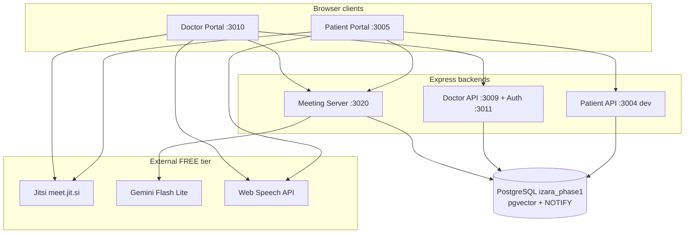
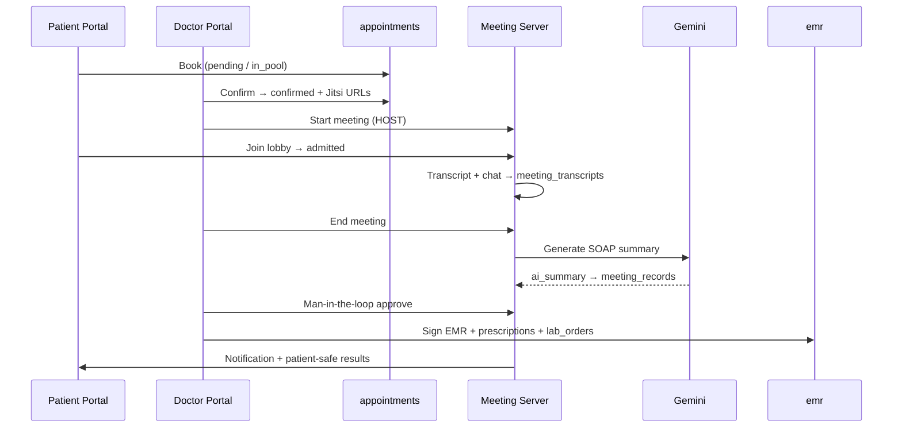
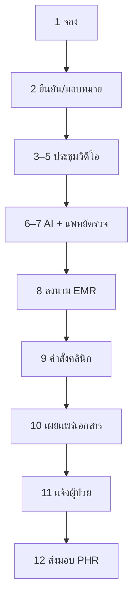
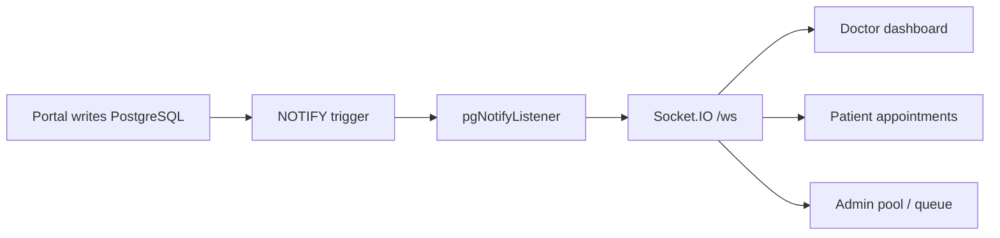

# การเชื่อมต่อ Workflow — ฟีเจอร์ ฟังก์ชัน และแผนภาพ

**เวอร์ชัน:** 1.1.0  
**อัปเดตล่าสุด:** 9 กรกฎาคม 2569  
**วัตถุประสงค์:** แผนที่เดียวที่แสดงการเชื่อมต่อพอร์ทัล บริการ ฐานข้อมูล และเรียลไทม์  
**รายละเอียด:** เอกสาร workflow โดเมนในลิงก์; สเปกหน้าใน [Pages/](Pages/)

> **ต้นฉบับ EN:** [WORKFLOW_CONNECTIONS.md](../WORKFLOW_CONNECTIONS.md)

---

## สารบัญ

1. [โทโพโลยีแพลตฟอร์ม](#1-โทโพโลยีแพลตฟอร์ม)
2. [แผนที่บริการข้ามพอร์ทัล](#2-แผนที่บริการข้ามพอร์ทัล)
3. [ไปป์ไลน์นัดหมาย → ส่งมอบเอกสาร](#3-ไปป์ไลน์นัดหมาย--ส่งมอบเอกสาร)
4. [ห่วงโซ่ซิงค์เรียลไทม์](#4-ห่วงโซ่ซิงค์เรียลไทม์)
5. [ตารางฟีเจอร์และฟังก์ชัน](#5-ตารางฟีเจอร์และฟังก์ชัน)
6. [แผนที่ฐานข้อมูล ↔ workflow](#6-แผนที่ฐานข้อมูล--workflow)
7. [แผนที่เอกสาร](#7-แผนที่เอกสาร)

---

## 1. โทโพโลยีแพลตฟอร์ม



| ชั้น | เทคโนโลยี | บทบาท |
| ----- | ---------- | ---- |
| UI ผู้ป่วย | React 18 + Vite | Booking, PHR, AI chat, join meeting |
| UI แพทย์ | React 18 + Vite + Nginx | Queue, host meeting, EMR, admin |
| Meeting Server | Express + Socket.IO | Lobby, transcript relay, AI SOAP pipeline |
| Database | PostgreSQL 18 | แหล่งข้อมูลเดียว — 53+ tables |
| Video | Jitsi Meet embed | Multi-party consult, doctor = HOST |
| AI | Gemini | Triage, SOAP summary, chat, document analysis |
| Transcript | Web Speech API | Free browser STT during meeting |

---
---

## 2. แผนที่บริการข้ามพอร์ทัล

| พอร์ต | บริการ | npm dev | Docker | เส้นทางหลัก |
| ---- | ------- | ------- | ------ | ----------- |
| 3005 | UI + API ผู้ป่วย | Vite + proxy | คอนเทนเนอร์เดียว | `/home`, `/appointments`, `/api/*` |
| 3010 | UI แพทย์ | Vite | Nginx :8080 | `/dashboard`, `/health-meeting`, `/meeting/:id` |
| 3020 | Meeting Server | Express | คอนเทนเนอร์ | `/api/meetings/*`, Socket.IO |
| 5433 | PostgreSQL | Docker host | `postgres:5432` | ทุกพอร์ทัลใช้ `izara_phase1` |

**สัญญา Auth:** `JWT_SECRET` / session ร่วมกันทุกพอร์ทัล

---

## 3. ไปป์ไลน์นัดหมาย → ส่งมอบเอกสาร


### ลำดับการทำงานเต็ม (เรียงตามขั้นตอน)

```text
 1. ผู้ป่วยจองนัด          → appointments (pending / in_pool)
 2. แอดมินมอบหมาย / แพทย์ยืนยัน → confirmed + Jitsi URLs + calendarEventUrl
 3. แพทย์เริ่มประชุม (HOST)     → meeting_records (in_progress)
 4. ผู้ป่วย/แขก lobby → เข้าห้อง   → Jitsi + transcript + chat
 5. แพทย์จบประชุม              → meeting_records (ended)
 6. Gemini SOAP pipeline             → meeting_records.ai_summary
 7. แพทย์ตรวจสอบ AI (Man-in-the-Loop)   → ai_validations
 8. แพทย์ลงนาม EMR               → emr (signed) → patient_documents
 9. สั่งยา / แล็บ / ภาพรวม        → prescriptions, lab_orders, imaging_orders
10. DocumentDeliveryService publish  → patient_documents
11. แจ้งเตือน + NOTIFY           → กระดิ่งผู้ป่วย + แท็บ PHR
12. ผู้ป่วยดูผล            → PHR เอกสาร / ผลการรักษา
```



| ขั้น | สถานะ / สิ่งประกอบ | ตารางหลัก | เอกสาร |
| ----- | ----------------- | -------------- | ----------- |
| จอง | `pending` / `in_pool` | `appointments` | Appointment_Workflows |
| มอบหมาย/ยืนยัน | `confirmed` | `appointments`, `notifications` | Appointment §pool |
| ประชุม | `in_progress` | `meeting_records`, `meeting_transcripts` | Video_Meeting |
| ร่าง AI | processing | `meeting_records.ai_summary` | POST_MEETING |
| แพทย์ตรวจ | `ai_validations` | `ai_validations` | หลังประชุม |
| ลงนามคลินิก | EMR `signed` | `emr`, `prescriptions`, `lab_orders` | Health_Records |
| ส่งมอบผู้ป่วย | `ready_for_patient` | `patient_documents`, `notifications` | Clinical_Document_Delivery |

---

## 4. ห่วงโซ่ซิงค์เรียลไทม์


| Trigger | ตาราง | อัปเดต UI ทั่วไป |
| ------- | ----- | ----------------- |
| `trg_appointments_notify` | `appointments` | คิว, pool, รายการผู้ป่วย |
| `trg_emr_notify` | `emr` | Timeline, ดูเวชระเบียน |
| `trg_prescriptions_notify` | `prescriptions` | ยาใน PHR |
| `trg_lab_orders_notify` | `lab_orders` | ผลแล็บ |
| `trg_notifications_notify` | `notifications` | กระดิ่งแจ้งเตือน |
| `trg_vital_signs_notify` | `vital_signs` | กราฟสัญญาณชีพ |
| `trg_phr_notify` | `phr` | ภาพรวม PHR |
| `trg_doctor_schedules_notify` | `doctor_schedules` | ช่องจอง |

รายละเอียดเต็ม: [Data_Sync_Documentation_TH.md](Data_Sync_Documentation_TH.md)

---

## 5. ตารางฟีเจอร์และฟังก์ชัน

| โดเมน | ฟีเจอร์หลัก | การกระทำของผู้ใช้ | เอกสารหลัก |
| ------ | ------------ | ------------------------ | ----------- |
| **Auth** | ลงทะเบียน, เข้าสู่ระบบ, รีเซ็ตรหัส | สร้างบัญชี, อนุมัติแพทย์ | User_management |
| **นัดหมาย** | จอง, pool, AI triage, ปฏิทิน | จอง, มอบหมาย, ยืนยัน | Appointment |
| **ประชุมวิดีโอ** | Jitsi, lobby, แขก | Host, อนุมัติ, ถอดเสียง | Video_Meeting |
| **หลังประชุม** | Gemini SOAP, Man-in-the-Loop | ตรวจ/อนุมัติ AI | POST_MEETING |
| **EMR** | SOAP, e-Rx, แล็บ | บันทึกการรักษา | Health_Records |
| **ส่งมอบเอกสาร** | EMR, Rx, PDF แล็บ | ลงนาม, เผยแพร่ | Clinical_Document_Delivery |
| **แจ้งเตือน** | In-app + realtime | กระดิ่ง, อ่านแล้ว | Notification |

---

## 6. แผนที่ฐานข้อมูล ↔ workflow

| Workflow | ตารางอ่าน/เขียน |
| -------- | ----------------- |
| เข้าสู่ระบบ | `users`, `sessions` |
| จองนัด | `appointments`, `notifications`, `doctor_schedules` |
| ประชุม | `meeting_records`, `meeting_transcripts`, `meeting_chats` |
| AI หลังประชุม | `ai_validations`, `meeting_records` |
| ลงนามการรักษา | `emr`, `prescriptions`, `lab_orders`, `imaging_orders` |
| ส่งมอบผู้ป่วย | `patient_documents`, `patient_instructions`, `notifications` |

---

## 7. แผนที่เอกสาร

| ความต้องการ | อ่านก่อน | ต่อด้วย |
| ---- | ---------- | ---- |
| ศูนย์กลาง | [README_TH.md](README_TH.md) | เอกสารนี้ |
| ทดสอบยอมรับ | FULL_WORKFLOW_CONTRACT_TH | PROCESS_TO_TEST_GATE_TH |
| สเปกหน้า | [Pages/README_TH.md](Pages/README_TH.md) | ไฟล์ใน Pages/ |
| สถาปัตยกรรม | System_Architecture_Overview_TH | ENV_AND_STACK_CHECK_TH |
