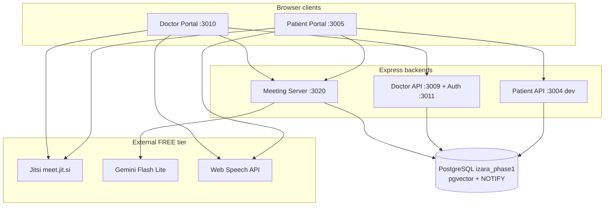
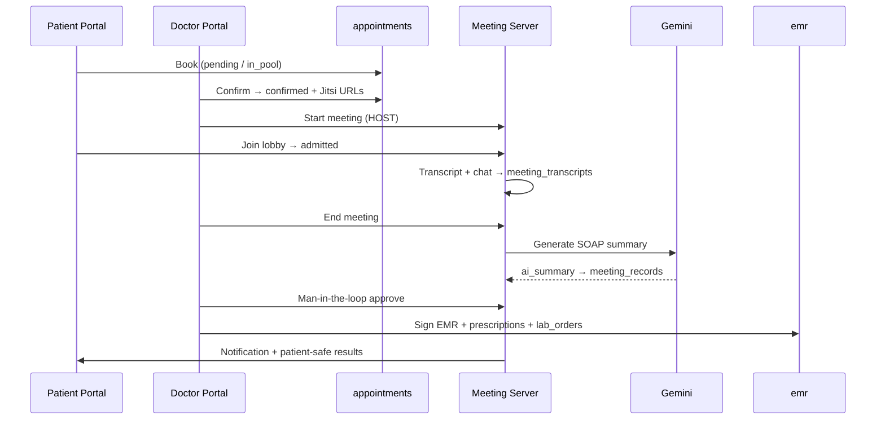
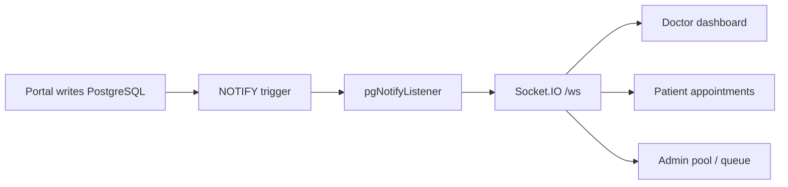

# Workflow Connections — Features, Functions & Diagrams

**Version:** 1.0.0  
**Last Updated:** June 25, 2026  
**Purpose:** Single map of how portals, services, database, and realtime layers connect.  
**Detail docs:** Domain workflows in linked files; page specs in [Pages/](Pages/).

---

## Table of Contents

1. [Platform topology](#1-platform-topology)
2. [Cross-portal service map](#2-cross-portal-service-map)
3. [Core appointment → delivery pipeline](#3-core-appointment--delivery-pipeline)
4. [Realtime sync chain](#4-realtime-sync-chain)
5. [Feature & function matrix](#5-feature--function-matrix)
6. [Database ↔ workflow map](#6-database--workflow-map)
7. [Document map (what to read)](#7-document-map-what-to-read)

---

## 1. Platform topology

| Layer | Technology | Role |
| ----- | ---------- | ---- |
| Patient UI | React 18 + Vite | Booking, PHR, AI chat, join meeting |
| Doctor UI | React 18 + Vite + Nginx | Queue, host meeting, EMR, admin |
| Meeting Server | Express + Socket.IO | Lobby, transcript relay, AI SOAP pipeline |
| Database | PostgreSQL 18 | Single source of truth — 53+ tables |
| Video | Jitsi Meet embed | Multi-party consult, doctor = HOST |
| AI | Gemini | Triage, SOAP summary, chat, document analysis |
| Transcript | Web Speech API | Free browser STT during meeting |

---

## 2. Cross-portal service map

| Port | Service | npm dev | Docker | Primary routes / sockets |
| ---- | ------- | ------- | ------ | ------------------------- |
| 3005 | Patient UI + unified API | Vite + proxy | Single container | `/home`, `/appointments`, `/api/*` |
| 3004 | Patient API (dev only) | Express | — | REST + session auth |
| 3010 | Doctor UI | Vite | Nginx :8080 | `/dashboard`, `/health-meeting`, `/meeting/:id` |
| 3011 | Doctor auth | Express | Internal | `/auth/login`, `/auth/register` |
| 3009 | Doctor API + Socket.IO | Express | Internal | `/api/*`, `/ws` |
| 3020 | Meeting Server | Express | Container | `/api/meetings/*`, Socket.IO transcript |
| 5433 | PostgreSQL | Docker host | `postgres:5432` | All portals share `izara_phase1` |

**Auth contract:** Shared `JWT_SECRET` / session tokens across patient, doctor, and meeting server.  
**Env sync:** `.env.docker` → `npm run env:sync` → portal `.env` files. See [docs/ENV_SETUP.md](../docs/ENV_SETUP.md).

---

## 3. Core appointment → delivery pipeline

| Stage | Status / artifact | Primary tables | Process doc |
| ----- | ----------------- | -------------- | ----------- |
| Book | `pending` / `in_pool` | `appointments` | [Appointment_Workflows.md](Appointment_Workflows.md) |
| Assign / confirm | `confirmed` | `appointments`, `notifications` | Appointment §pool |
| Meeting | `in_progress` | `meeting_records`, `meeting_transcripts`, `meeting_chats` | [VIDEO_MEETING_JITSI_GEMINI.md](VIDEO_MEETING_JITSI_GEMINI.md) |
| AI draft | processing | `meeting_records.ai_summary` | [POST_MEETING_WORKFLOW.md](POST_MEETING_WORKFLOW.md) |
| Doctor review | `ai_validations` | `ai_validations` | Post-meeting |
| Clinical sign-off | `signed` EMR | `emr`, `prescriptions`, `lab_orders`, `imaging_orders` | [Health_Records_Processes.md](Health_Records_Processes.md) |
| Patient delivery | `ready_for_patient` | `patient_instructions`, `notifications`, `health_timeline` | [Pages/Patient-Portal/04_Dashboard_Page.md](Pages/Patient-Portal/04_Dashboard_Page.md) |

**Page navigation map:** [Pages/README.md](Pages/README.md) § Meeting Workflow.

---

## 4. Realtime sync chain

| Trigger | Table | Typical UI update |
| ------- | ----- | ----------------- |
| `trg_appointments_notify` | `appointments` | Queue, pool, patient list |
| `trg_emr_notify` | `emr` | Patient timeline, record viewer |
| `trg_prescriptions_notify` | `prescriptions` | PHR medications |
| `trg_lab_orders_notify` | `lab_orders` | Lab results tab |
| `trg_notifications_notify` | `notifications` | Bell badge, dropdown |
| `trg_vital_signs_notify` | `vital_signs` | PHR vitals chart |
| `trg_phr_notify` | `phr` | PHR overview |
| `trg_doctor_schedules_notify` | `doctor_schedules` | Booking slots |

Full catalog: [Data_Sync_Documentation.md](Data_Sync_Documentation.md).

---

## 5. Feature & function matrix

| Domain | Key features | Functions (user actions) | Primary doc | Pages |
| ------ | ------------ | ------------------------ | ----------- | ----- |
| **Auth** | Register, login, SSO, reset, admin approval | Create account, login, approve doctor | [User_management_Workflows.md](User_management_Workflows.md) | 01–03 both portals |
| **Appointments** | Book wizard, pool, AI triage, calendar sync | Book, assign, confirm, cancel | [Appointment_Workflows.md](Appointment_Workflows.md) | P05, D06, D20 |
| **Video meeting** | Jitsi embed, lobby, guest invite, chat | Host, admit, transcript, record | [VIDEO_MEETING_JITSI_GEMINI.md](VIDEO_MEETING_JITSI_GEMINI.md) | [01_Meeting_Room.md](Pages/Meeting-Server/01_Meeting_Room.md) |
| **Post-meeting** | Gemini SOAP, man-in-the-loop | Review, approve, reject AI | [POST_MEETING_WORKFLOW.md](POST_MEETING_WORKFLOW.md) | [02_Meeting_Results.md](Pages/Meeting-Server/02_Meeting_Results.md) |
| **EMR / clinical** | SOAP editor, e-Rx, labs, imaging | Document visit, prescribe, order | [Health_Records_Processes.md](Health_Records_Processes.md) | D08–11 |
| **PHR** | Vitals, meds, allergies, timeline | Self-entry, view history | Health Records | P06, P14 |
| **Living will / PDPA** | 4-step wizard, consent, audit | Create will, share, revoke | [Living_Will_Processes.md](Living_Will_Processes.md) | P10–11 |
| **Content** | Thai-first articles, admin approval | Draft → publish | [Medicine_Content_Processes.md](Medicine_Content_Processes.md) | P08, D13–14 |
| **AI chat / studio** | Patient AI doctor, doctor copilot | Chat, calculators | Separated §Q–R | P07, D15 |
| **Notifications** | In-app + realtime | Bell, mark read | [Notification_Workflows.md](Notification_Workflows.md) | P15 |
| **Admin** | Pool, doctor approval, all appointments | Assign, approve, override | Combined §3 | D17–21 |

**Journey diagrams:** [Combined_Workflows_And_Actions.md](Combined_Workflows_And_Actions.md)  
**Atomic steps:** [Separated_Workflows_And_Functions.md](Separated_Workflows_And_Functions.md)

---

## 6. Database ↔ workflow map

Quick lookup — full column defs: [DATABASE_TABLES_REFERENCE.md](DATABASE_TABLES_REFERENCE.md).

| Workflow | Read/write tables |
| -------- | ----------------- |
| Login | `users`, `sessions` |
| Book appointment | `appointments`, `notifications`, `doctor_schedules` |
| Meeting | `meeting_records`, `meeting_transcripts`, `meeting_chats`, `meeting_invites` |
| Post-meeting AI | `ai_validations`, `meeting_records` |
| Sign visit | `emr`, `prescriptions`, `lab_orders`, `imaging_orders` |
| Patient delivery | `patient_instructions`, `notifications`, `health_timeline` |
| Content publish | `medical_content`, `clinical_resources`, `knowledge_base` |
| Realtime | 8 NOTIFY tables (see §4) |

---

## 7. Document map (what to read)

| Need | Read first | Then |
| ---- | ---------- | ---- |
| Hub / index | [README.md](README.md) | This file |
| Acceptance tests | [FULL_WORKFLOW_CONTRACT.md](FULL_WORKFLOW_CONTRACT.md) | [PROCESS_TO_TEST_GATE.md](PROCESS_TO_TEST_GATE.md) |
| One page spec | [Pages/README.md](Pages/README.md) | `Pages/*/` file |
| Database schema | [DATABASE_TABLES_REFERENCE.md](DATABASE_TABLES_REFERENCE.md) | [PostgreSQL_Database_Architecture.md](PostgreSQL_Database_Architecture.md) |
| Architecture | [System_Architecture_Overview.md](System_Architecture_Overview.md) | [ENV_AND_STACK_CHECK.md](ENV_AND_STACK_CHECK.md) |

**Superseded (do not extend):**

- [UI_Pages_Workflows.md](UI_Pages_Workflows.md) → use `Pages/`
- [Pages/Doctor-Portal/07_Virtual_Meeting.md](Pages/Doctor-Portal/07_Virtual_Meeting.md) → use [01_Meeting_Room.md](Pages/Meeting-Server/01_Meeting_Room.md)
- [Living_Will_Implementation_Plan.md](Living_Will_Implementation_Plan.md) → merged into [Living_Will_Processes.md](Living_Will_Processes.md)
- [PHASE1_BASELINE_WORKFLOW_CONTRACT.md](PHASE1_BASELINE_WORKFLOW_CONTRACT.md) → merged into [FULL_WORKFLOW_CONTRACT.md](FULL_WORKFLOW_CONTRACT.md)
