# 📖 Isara Anywhere — คู่มือการใช้งานฉบับสมบูรณ์ (ภาษาไทย)

**เวอร์ชัน 2.1** | **อัปเดต: 22 พฤษภาคม 2569**

> คู่มือนี้ครอบคลุมการใช้งานทั้งหมดของระบบ Isara Anywhere สำหรับ **ผู้ป่วย** และ **แพทย์**
> ภาพหน้าจอทั้งหมดมาจาก Cloud Run dev-testing (`*.run.app`) ตามรอบทดสอบล่าสุด

---

## 📑 สารบัญ

1. [ภาพรวมระบบ Isara Anywhere](#1-ภาพรวมระบบ-isara-anywhere)
2. [ผู้ป่วย — ลงทะเบียนและเข้าสู่ระบบ](#2-ผู้ป่วย--ลงทะเบียนและเข้าสู่ระบบ)
3. [ผู้ป่วย — ฟีเจอร์ทั้งหมด](#3-ผู้ป่วย--ฟีเจอร์ทั้งหมด)
   - [3.1 แดชบอร์ดผู้ป่วย](#31-แดชบอร์ดผู้ป่วย)
   - [3.2 การนัดหมาย (Appointments)](#32-การนัดหมาย-appointments)
   - [3.3 ระเบียนสุขภาพส่วนตัว (PHR)](#33-ระเบียนสุขภาพส่วนตัว-phr)
   - [3.4 ไทม์ไลน์สุขภาพ](#34-ไทม์ไลน์สุขภาพ)
   - [3.5 AI Doctor (ปรึกษา AI)](#35-ai-doctor-ปรึกษา-ai)
   - [3.6 คลังความรู้ด้านสุขภาพ](#36-คลังความรู้ด้านสุขภาพ)
   - [3.7 Living Will (พินัยกรรมชีวิต)](#37-living-will-พินัยกรรมชีวิต)
   - [3.8 แผนที่สถานพยาบาล](#38-แผนที่สถานพยาบาล)
   - [3.9 นโยบาย PDPA](#39-นโยบาย-pdpa)
   - [3.10 โปรไฟล์และการตั้งค่า](#310-โปรไฟล์และการตั้งค่า)
4. [แพทย์ — เข้าสู่ระบบและแดชบอร์ด](#4-แพทย์--เข้าสู่ระบบและแดชบอร์ด)
5. [แพทย์ — ฟีเจอร์ทั้งหมด](#5-แพทย์--ฟีเจอร์ทั้งหมด)
   - [5.1 การจัดการนัดหมาย](#51-การจัดการนัดหมาย)
   - [5.2 Health Meeting (พบแพทย์ออนไลน์)](#52-health-meeting-พบแพทย์ออนไลน์)
   - [5.3 ตารางงานแพทย์](#53-ตารางงานแพทย์)
   - [5.4 การจัดการผู้ป่วย](#54-การจัดการผู้ป่วย)
   - [5.5 เวชระเบียนอิเล็กทรอนิกส์ (EMR)](#55-เวชระเบียนอิเล็กทรอนิกส์-emr)
   - [5.6 การสั่งจ่ายยา (Prescriptions)](#56-การสั่งจ่ายยา-prescriptions)
   - [5.7 คำสั่งตรวจทางห้องปฏิบัติการ (Lab Orders)](#57-คำสั่งตรวจทางห้องปฏิบัติการ-lab-orders)
   - [5.8 ที่ปรึกษาทางการแพทย์](#58-ที่ปรึกษาทางการแพทย์)
   - [5.9 เนื้อหาทางการแพทย์](#59-เนื้อหาทางการแพทย์)
   - [5.10 ทรัพยากรคลินิก](#510-ทรัพยากรคลินิก)
   - [5.11 โปรไฟล์แพทย์](#511-โปรไฟล์แพทย์)
   - [5.12 การจัดการแพทย์ (เฉพาะผู้ดูแลระบบ)](#512-การจัดการแพทย์-เฉพาะผู้ดูแลระบบ)
6. [กระบวนการประชุมวิดีโอ (Telemedicine)](#6-กระบวนการประชุมวิดีโอ-telemedicine)
   - [6.1 แพทย์เริ่มต้นประชุม](#61-แพทย์เริ่มต้นประชุม)
   - [6.2 ผู้ป่วยเข้าร่วมประชุม](#62-ผู้ป่วยเข้าร่วมประชุม)
   - [6.3 การเชิญแขกภายนอก (Guest)](#63-การเชิญแขกภายนอก-guest)
   - [6.4 ระหว่างการประชุม — การควบคุมต่างๆ](#64-ระหว่างการประชุม--การควบคุมต่างๆ)
   - [6.5 หลังการประชุม — AI สรุปและบันทึก](#65-หลังการประชุม--ai-สรุปและบันทึก)
   - [6.6 ประวัติการประชุม](#66-ประวัติการประชุม)
7. [คำถามที่พบบ่อย (FAQ)](#7-คำถามที่พบบ่อย-faq)

---

## 1. ภาพรวมระบบ Isara Anywhere

Isara Anywhere คือระบบการแพทย์ทางไกล (Telemedicine) ที่ให้บริการปรึกษาแพทย์ออนไลน์ผ่านวิดีโอ บริหารจัดการนัดหมาย เวชระเบียน และข้อมูลสุขภาพส่วนตัวได้อย่างครบวงจร

### ระบบหลักทั้งหมด 3 ส่วน

| ระบบ | สำหรับ | คำอธิบาย |
|------|--------|-----------|
| **ระบบผู้ป่วย (Patient Portal)** | ผู้ป่วย | จองนัดหมาย, ดูผลตรวจ, ปรึกษา AI Doctor, ดูประวัติสุขภาพ |
| **ระบบแพทย์ (Doctor Portal)** | แพทย์ + ผู้ดูแลระบบ | รับนัดหมาย, ทำเวชระเบียน, สั่งยา, เริ่มประชุมวิดีโอ |
| **เซิร์ฟเวอร์ประชุม (Meeting Server)** | ทุกคน | ระบบวิดีโอประชุม Jitsi + ถอดเสียง AI + บันทึกการประชุม |

### บทบาทของผู้ใช้งาน

| บทบาท | สิทธิ์การใช้งาน |
|-------|----------------|
| **ผู้ป่วย** | ใช้ Patient Portal — จองนัด, ดู PHR, ปรึกษา AI |
| **แพทย์** | ใช้ Doctor Portal — ยืนยันนัด, ทำ EMR, สั่งยา, เริ่มประชุม |
| **ผู้ดูแลระบบ (Admin)** | ใช้ Doctor Portal + เมนูพิเศษ — จัดการแพทย์, อนุมัติเนื้อหา |
| **แขก (Guest)** | เข้าร่วมประชุมวิดีโอผ่านลิงก์เชิญ — ไม่ต้องสมัครสมาชิก |

> 🔒 **ความปลอดภัย:** ระบบปฏิบัติตามมาตรฐาน PDPA และมีการยืนยันตัวตนด้วย JWT Token ทุกครั้ง

---

## 2. ผู้ป่วย — ลงทะเบียนและเข้าสู่ระบบ

### 2.1 การลงทะเบียนสมาชิกใหม่ (ผู้ป่วย)

ผู้ป่วยใหม่สามารถสมัครสมาชิกได้ด้วยตนเองผ่าน Patient Portal โดยไม่ต้องรอการอนุมัติ

**ขั้นตอน:**

1. เปิดเว็บเบราว์เซอร์ แล้วเข้าสู่ URL ของ Patient Portal
2. คลิกปุ่ม **"ลงทะเบียน"** (Register) บนหน้าหลัก

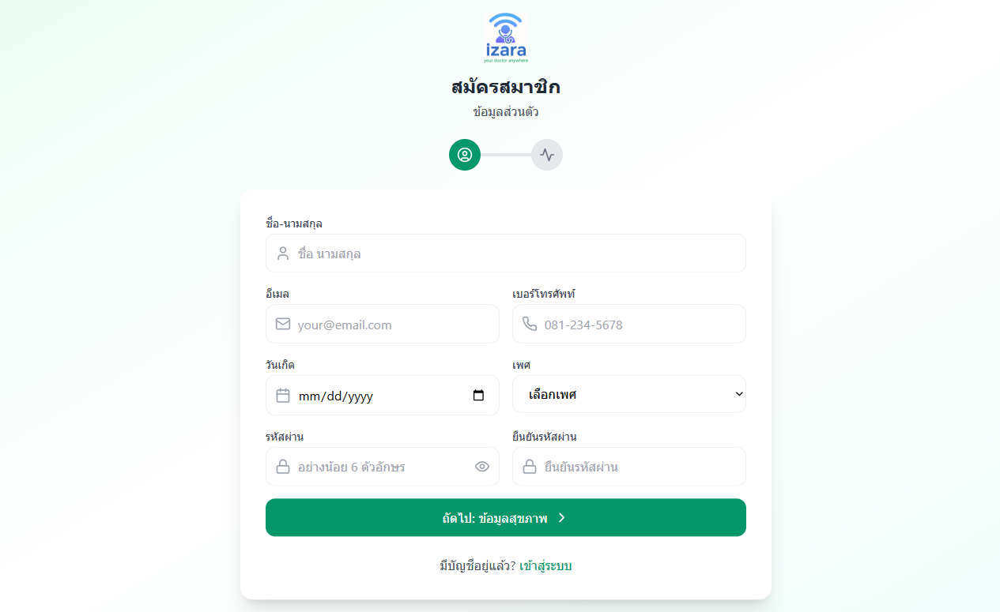

3. กรอกข้อมูลที่จำเป็น:
   - **ชื่อ-นามสกุล** (ภาษาไทยหรือภาษาอังกฤษ)
   - **อีเมล** (ใช้เป็น Username สำหรับเข้าสู่ระบบ)
   - **รหัสผ่าน** (อย่างน้อย 8 ตัวอักษร)
   - **เบอร์โทรศัพท์**
   - **วันเดือนปีเกิด** (ถ้ามี)

4. คลิกปุ่ม **"ลงทะเบียน"** เพื่อยืนยัน
5. ระบบจะพาเข้าสู่ **แดชบอร์ดผู้ป่วย** โดยอัตโนมัติ

> 💡 **แนะนำ:** หลังจากลงทะเบียนแล้ว ควรกรอกข้อมูลสุขภาพพื้นฐาน (โรคประจำตัว, ยาที่แพ้) ในส่วน PHR เพื่อให้แพทย์ทราบข้อมูลสำคัญก่อนการปรึกษา

---

### 2.2 เข้าสู่ระบบ (ผู้ป่วย)

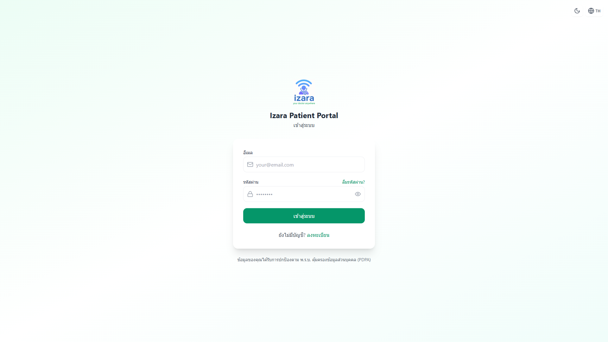

**ขั้นตอน:**

1. เปิด Patient Portal
2. หน้าเข้าสู่ระบบจะแสดงขึ้นมาโดยอัตโนมัติ


3. กรอก **อีเมล** และ **รหัสผ่าน** ที่ลงทะเบียนไว้
4. คลิกปุ่ม **"เข้าสู่ระบบ"**


5. ระบบจะพาเข้าสู่ **แดชบอร์ดผู้ป่วย** โดยอัตโนมัติ


> ⚠️ **หมายเหตุ:** Session จะหมดอายุใน 30 นาที หากไม่มีการใช้งาน ให้เข้าสู่ระบบใหม่อีกครั้ง

---

### 2.3 ลืมรหัสผ่าน (ผู้ป่วย)

**ขั้นตอน:**

1. คลิก **"ลืมรหัสผ่าน?"** บนหน้าเข้าสู่ระบบ
2. กรอก **อีเมล** ที่ใช้ลงทะเบียน
3. คลิก **"ส่งลิงก์รีเซ็ต"**
4. เปิดอีเมลและคลิกลิงก์ที่ได้รับ (หมดอายุใน 15 นาที)
5. กรอก **รหัสผ่านใหม่** และยืนยัน
6. เข้าสู่ระบบด้วยรหัสผ่านใหม่

---

### 2.4 เข้าสู่ระบบด้วย Google (ผู้ป่วย)

> ใช้ได้เมื่อสมัครด้วยอีเมล Gmail เดียวกันและตั้งรหัสผ่านแล้วเท่านั้น

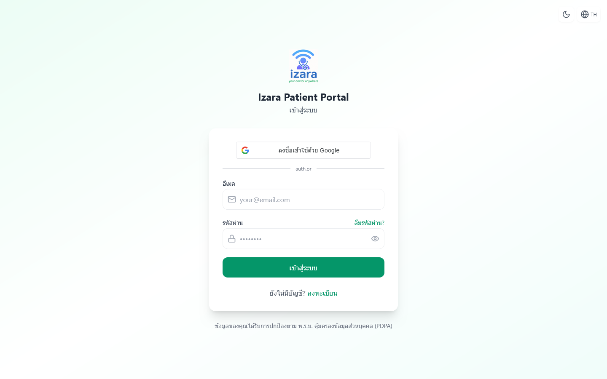

**ขั้นตอน:**

1. เปิดหน้าเข้าสู่ระบบ รอให้ปุ่ม **ลงชื่อเข้าใช้ด้วย Google** แสดง
2. กดปุ่ม Google แล้วเลือกบัญชี Gmail
3. อนุญาตให้แอปใช้ชื่อและอีเมล

**กรณีอีเมลยังไม่มีบัญชี:**

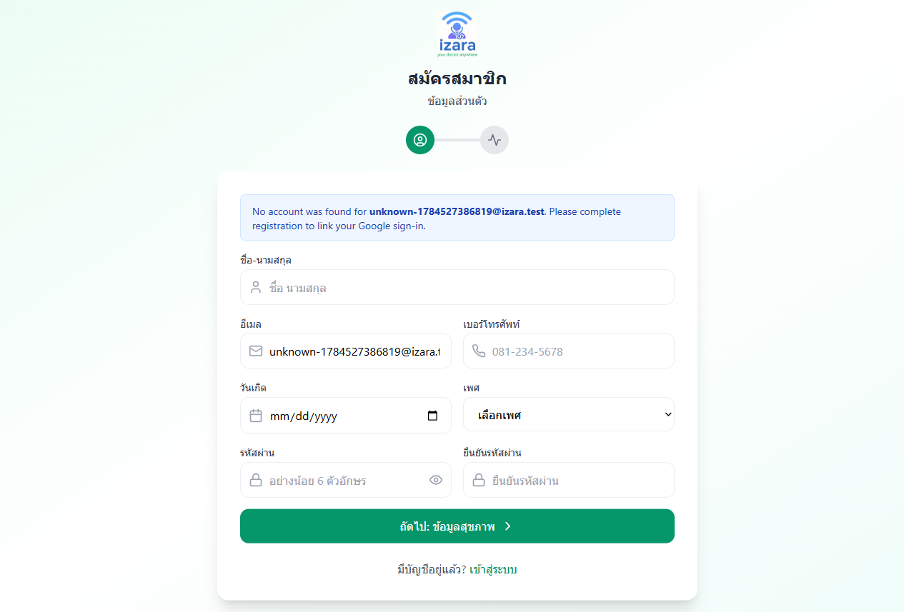

**กรณีบัญชี Google ไม่ตรงกับที่เคยผูก (`GOOGLE_ACCOUNT_MISMATCH`):** ใช้บัญชี Google เดิมหรือเข้าด้วยรหัสผ่าน แล้วติดต่อผู้ดูแลหากต้องการเปลี่ยนการผูกบัญชี

---

## 3. ผู้ป่วย — ฟีเจอร์ทั้งหมด

### 3.1 แดชบอร์ดผู้ป่วย

แดชบอร์ดเป็นหน้าหลักที่แสดงข้อมูลสรุปสุขภาพและการนัดหมายล่าสุด

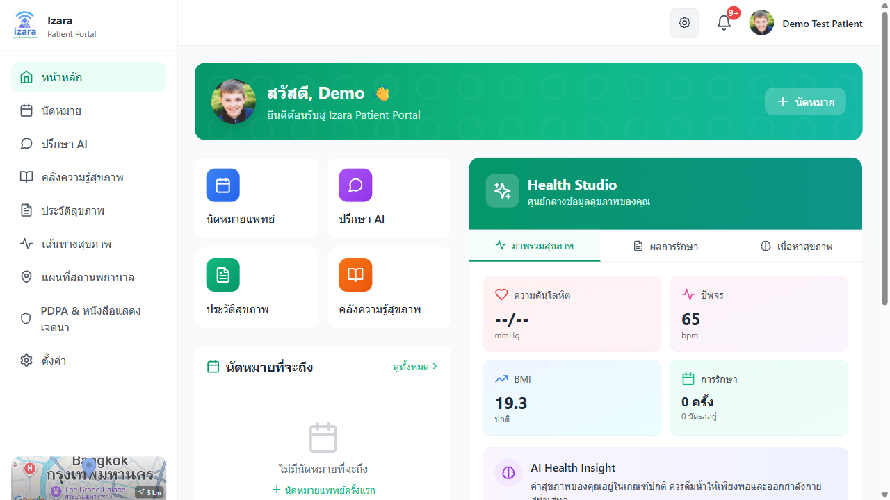

**สิ่งที่แดชบอร์ดแสดง:**
- **สรุปนัดหมายล่าสุด** — นัดหมายที่กำลังจะมาถึงและสถานะปัจจุบัน
- **สรุปสุขภาพ** — ค่าสัญญาณชีพล่าสุด (ความดัน, น้ำหนัก, ฯลฯ)
- **การแจ้งเตือน** — ข้อความแจ้งเตือนจากแพทย์หรือระบบ
- **ทางลัดฟีเจอร์หลัก** — ปุ่มลัดไปยังส่วนต่างๆ

**เมนูนำทางด้านซ้าย (Sidebar):**

| เมนู | คำอธิบาย |
|------|-----------|
| 🏠 แดชบอร์ด | หน้าหลักสรุปข้อมูล |
| 📅 นัดหมาย | จองและดูนัดหมายทั้งหมด |
| 📋 PHR | ระเบียนสุขภาพส่วนตัว |
| 📊 ไทม์ไลน์ | ประวัติสุขภาพตามเวลา |
| 🤖 AI Doctor | ปรึกษา AI เบื้องต้น |
| 📚 คลังความรู้ | บทความสุขภาพ |
| 📝 Living Will | พินัยกรรมชีวิต |
| 🗺️ แผนที่ | ค้นหาสถานพยาบาลใกล้เคียง |
| 👤 โปรไฟล์ | ข้อมูลส่วนตัว |
| ⚙️ ตั้งค่า | การตั้งค่าบัญชี |

---

### 3.2 การนัดหมาย (Appointments)

#### 3.2.1 ดูรายการนัดหมาย


1. คลิกเมนู **"นัดหมาย"** ด้านซ้าย
2. หน้านัดหมายจะแสดงรายการนัดหมายทั้งหมด พร้อมสถานะ:
   - 🟡 **รอดำเนินการ** (Pending) — รอแพทย์ยืนยัน
   - 🟢 **ยืนยันแล้ว** (Confirmed) — แพทย์ยืนยันและมีลิงก์ประชุม
   - ✅ **เสร็จสิ้น** (Completed) — การปรึกษาสำเร็จแล้ว
   - ❌ **ยกเลิก** (Cancelled) — ยกเลิกโดยผู้ป่วยหรือแพทย์


---

#### 3.2.2 จองนัดหมายใหม่


**ขั้นตอนการจองนัดหมาย:**

1. คลิกปุ่ม **"จองนัดหมายใหม่"** หรือ **"+ นัดหมาย"**


2. กรอกข้อมูลนัดหมาย:
   - **ประเภทการปรึกษา** (เช่น ปรึกษาทั่วไป, โรคเรื้อรัง, ฉุกเฉิน)
   - **วันที่และเวลา** ที่ต้องการ
   - **อาการหรือปัญหาสุขภาพ** ที่ต้องการปรึกษา (อธิบายโดยละเอียด)
   - **แพทย์ที่ต้องการ** (ถ้ามี หรือปล่อยให้ระบบจัดสรร)

3. ตรวจสอบข้อมูลและคลิก **"ยืนยันการจอง"**

4. ระบบจะสร้างนัดหมายและแสดงสถานะ **"รอดำเนินการ"**


5. รายละเอียดนัดหมายจะแสดงขึ้น พร้อมข้อมูลสถานะ


> 📬 **การแจ้งเตือน:** เมื่อแพทย์ยืนยันนัดหมาย ระบบจะแจ้งเตือนผ่านหน้าเว็บทันที

---

#### 3.2.3 ดูนัดหมายที่ยืนยันแล้ว

เมื่อแพทย์ยืนยันนัดหมาย สถานะจะเปลี่ยนเป็น **"ยืนยันแล้ว"** พร้อมลิงก์สำหรับเข้าร่วมประชุมวิดีโอ


**ข้อมูลในนัดหมายที่ยืนยันแล้ว:**
- ชื่อแพทย์ที่รับนัด
- วันเวลาการประชุม
- ลิงก์ Jitsi สำหรับเข้าร่วมการปรึกษาวิดีโอ
- หมายเหตุจากแพทย์ (ถ้ามี)

---

#### 3.2.4 นัดหมายที่เสร็จสิ้นแล้ว


หลังการปรึกษาเสร็จสิ้น ผู้ป่วยสามารถดู:
- **สรุปการปรึกษา** จาก AI
- **ใบสั่งยา** (ถ้าแพทย์สั่ง)
- **ผลตรวจทางห้องปฏิบัติการ** (ถ้ามี)
- **เวชระเบียน** (EMR) ที่แพทย์บันทึกไว้

---

### 3.3 ระเบียนสุขภาพส่วนตัว (PHR)

PHR (Personal Health Record) คือคลังข้อมูลสุขภาพส่วนตัวของผู้ป่วย


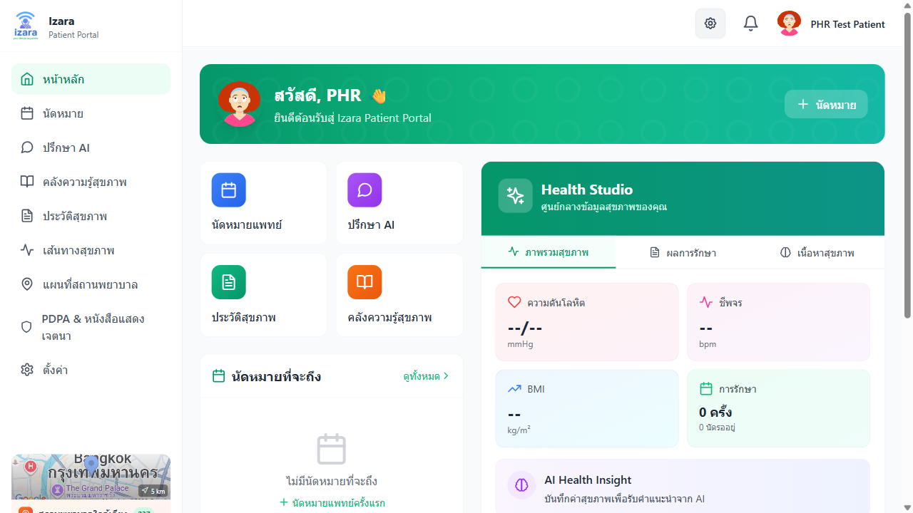

#### ข้อมูลที่บันทึกใน PHR

**1. ข้อมูลส่วนตัวด้านสุขภาพ**


ขั้นตอนเพิ่ม/แก้ไขข้อมูลสุขภาพ:
1. คลิกเมนู **"PHR"** หรือ **"ระเบียนสุขภาพ"**
2. คลิกแท็บที่ต้องการแก้ไข เช่น "ข้อมูลส่วนตัว"
3. คลิก **"แก้ไข"** (Edit)
4. กรอกหรืออัปเดตข้อมูล:
   - โรคประจำตัว
   - ยาที่แพ้
   - ยาที่รับประทานอยู่
   - ประวัติการผ่าตัด
   - ประวัติครอบครัว (โรคทางพันธุกรรม)
5. คลิก **"บันทึก"**

**2. สัญญาณชีพ (Vital Signs)**


ขั้นตอนบันทึกสัญญาณชีพ:
1. ในหน้า PHR คลิกแท็บ **"สัญญาณชีพ"**
2. คลิก **"+ บันทึกค่าใหม่"**
3. กรอกข้อมูล:
   - ความดันโลหิต (mmHg)
   - อัตราการเต้นของหัวใจ (bpm)
   - น้ำหนัก (kg) และส่วนสูง (cm)
   - อุณหภูมิร่างกาย (°C)
   - ระดับออกซิเจนในเลือด (%)
4. คลิก **"บันทึก"**

---

### 3.4 ไทม์ไลน์สุขภาพ

ไทม์ไลน์แสดงประวัติสุขภาพทั้งหมดเรียงตามเวลา ตั้งแต่การนัดหมาย ผลตรวจ ยา ไปจนถึงค่าสัญญาณชีพ


**ขั้นตอนดูไทม์ไลน์:**

1. คลิกเมนู **"ไทม์ไลน์"** ด้านซ้าย
2. ไทม์ไลน์จะแสดงเหตุการณ์สุขภาพทั้งหมดเรียงตามวันที่


3. คลิกที่รายการใดก็ได้เพื่อดูรายละเอียด
4. ใช้ตัวกรอง (Filter) เพื่อดูเฉพาะประเภทที่ต้องการ:
   - นัดหมาย
   - ยา
   - ผลตรวจ
   - สัญญาณชีพ

---

### 3.5 AI Doctor (ปรึกษา AI)

AI Doctor คือผู้ช่วย AI ที่ให้ข้อมูลสุขภาพเบื้องต้น **ไม่ใช่การวินิจฉัยโรค** — ใช้เพื่อประเมินอาการก่อนพบแพทย์จริง

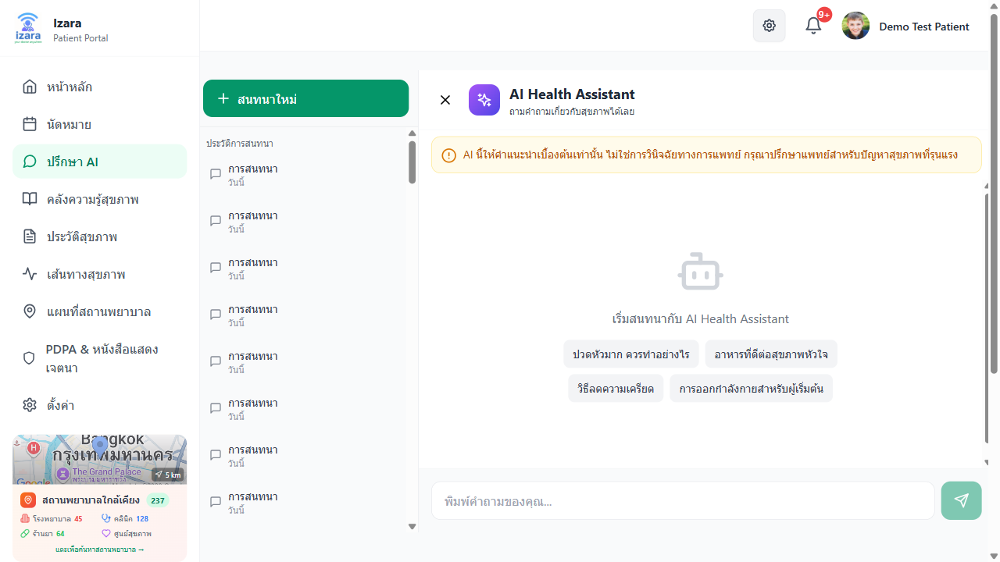

**ขั้นตอนใช้งาน AI Doctor:**

1. คลิกเมนู **"AI Doctor"** ด้านซ้าย
2. พิมพ์อาการหรือคำถามสุขภาพในช่องข้อความ


3. คลิก **"ส่ง"** หรือกด Enter
4. AI จะวิเคราะห์อาการและให้ข้อมูลเบื้องต้น เช่น:
   - ความเป็นไปได้ของสาเหตุ
   - คำแนะนำเบื้องต้น
   - ควรพบแพทย์ด่วนหรือไม่
5. สามารถถามเพิ่มเติมได้ในลักษณะการสนทนา

> ⚠️ **คำเตือน:** AI Doctor ให้ข้อมูลเบื้องต้นเท่านั้น ไม่ใช่การวินิจฉัยหรือรักษาโรค หากมีอาการรุนแรงควรพบแพทย์ทันที

---

### 3.6 คลังความรู้ด้านสุขภาพ

คลังความรู้รวบรวมบทความ วิดีโอ และข้อมูลสุขภาพที่ผ่านการตรวจสอบจากแพทย์

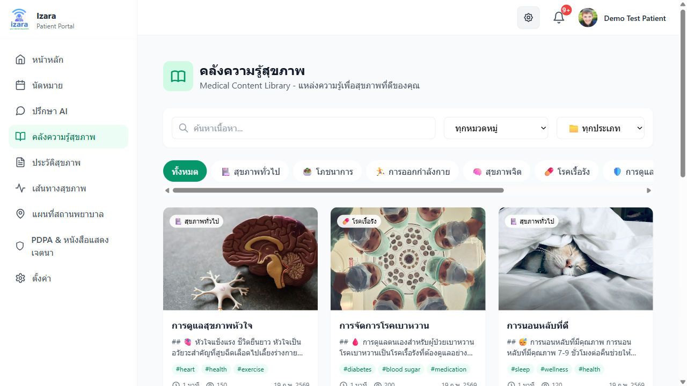

**ขั้นตอนใช้งาน:**

1. คลิกเมนู **"คลังความรู้"** ด้านซ้าย
2. เลือกหมวดหมู่ที่ต้องการ เช่น โรคเรื้อรัง, สุขภาพจิต, โภชนาการ
3. คลิกบทความเพื่ออ่านรายละเอียด
4. ใช้ช่องค้นหาเพื่อหาบทความตามคำสำคัญ

---

### 3.7 Living Will (พินัยกรรมชีวิต)

Living Will คือเอกสารแสดงเจตนาเกี่ยวกับการรักษาพยาบาลในกรณีที่ไม่สามารถสื่อสารได้ด้วยตนเอง

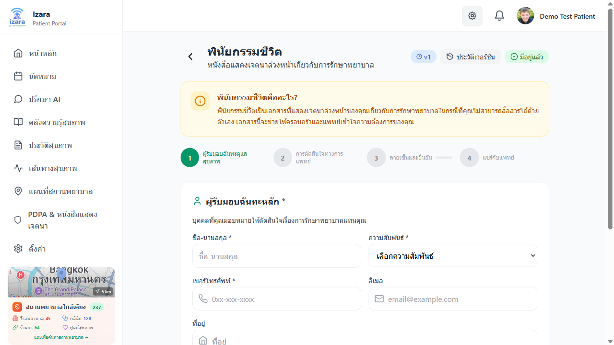


**ขั้นตอนสร้าง Living Will:**

1. คลิกเมนู **"Living Will"** ด้านซ้าย
2. อ่านคำอธิบายและข้อกำหนดทางกฎหมาย
3. คลิก **"สร้าง Living Will"**
4. กรอกข้อมูลตามส่วนต่างๆ:
   - ความต้องการเกี่ยวกับการรักษาพยาบาล
   - ผู้รับมอบอำนาจตัดสินใจแทน (ชื่อ, เบอร์โทร, ความสัมพันธ์)
   - เงื่อนไขพิเศษ (ถ้ามี)
5. คลิก **"บันทึกและลงนาม"**
6. ยืนยันด้วยรหัสผ่านเพื่อความปลอดภัย

> 📋 Living Will ที่บันทึกไว้จะปรากฏในเวชระเบียนของผู้ป่วยและแพทย์สามารถดูได้

---

### 3.8 แผนที่สถานพยาบาล

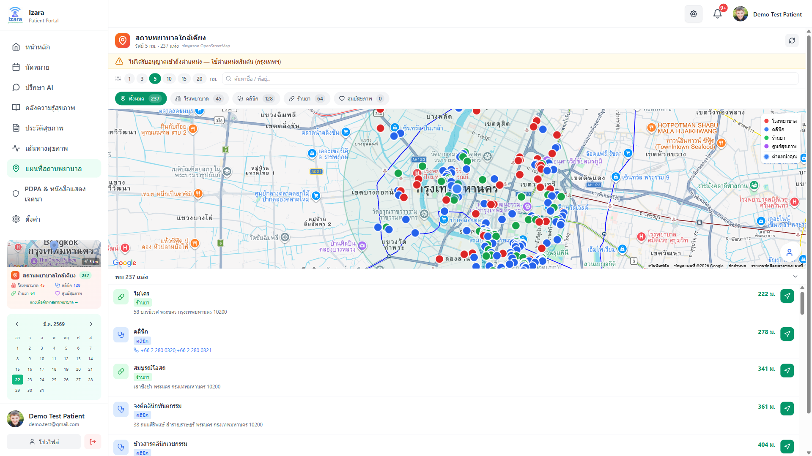

**ขั้นตอนค้นหาสถานพยาบาล:**

1. คลิกเมนู **"แผนที่"** ด้านซ้าย
2. ระบบจะแสดงแผนที่พร้อมสถานพยาบาลในพื้นที่ใกล้เคียง
3. คลิกที่ไอคอนสถานพยาบาลเพื่อดูรายละเอียด:
   - ชื่อสถานพยาบาล
   - ที่อยู่และเบอร์โทร
   - เวลาทำการ
   - ระยะทางจากตำแหน่งปัจจุบัน
4. คลิก **"นำทาง"** เพื่อเปิด Google Maps

---

### 3.9 นโยบาย PDPA


**ขั้นตอนดูและจัดการ PDPA:**

1. คลิกเมนู **"PDPA"** หรือ **"ความเป็นส่วนตัว"** ด้านซ้าย
2. อ่านนโยบายความเป็นส่วนตัวที่แสดง
3. ดูรายการข้อมูลที่ระบบเก็บรวบรวม
4. จัดการการยินยอม (Consent):
   - ✅ ยินยอมให้เก็บข้อมูลสุขภาพ
   - ✅ ยินยอมให้แพทย์ดูข้อมูล PHR
   - ✅ ยินยอมให้ส่งการแจ้งเตือนผ่านอีเมล
5. คลิก **"บันทึกการตั้งค่า"**

---

### 3.10 โปรไฟล์และการตั้งค่า

#### โปรไฟล์ส่วนตัว


**ขั้นตอนแก้ไขโปรไฟล์:**

1. คลิกไอคอนรูปภาพหรือชื่อผู้ใช้ด้านบนขวา หรือคลิกเมนู **"โปรไฟล์"**
2. คลิกปุ่ม **"แก้ไข"**
3. อัปเดตข้อมูล:
   - รูปโปรไฟล์ (คลิก "เปลี่ยนรูป")
   - ชื่อ-นามสกุล
   - เบอร์โทรศัพท์
   - วันเดือนปีเกิด
   - ที่อยู่
4. คลิก **"บันทึก"**

#### การตั้งค่า

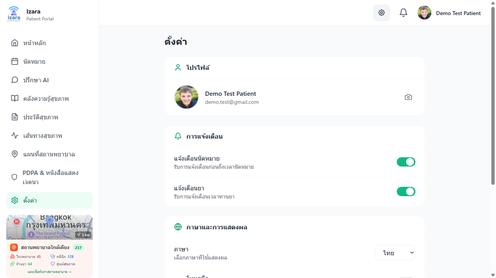

**ขั้นตอนตั้งค่า:**

1. คลิกเมนู **"ตั้งค่า"** ด้านซ้าย
2. ปรับการตั้งค่าตามต้องการ:
   - **การแจ้งเตือน** — เปิด/ปิดการแจ้งเตือนทางอีเมลและในแอป
   - **ภาษา** — เลือกภาษาไทยหรืออังกฤษ
   - **ธีม** — สว่าง (Light) หรือมืด (Dark)
   - **การรักษาความปลอดภัย** — เปลี่ยนรหัสผ่าน

**เปลี่ยนรหัสผ่าน:**
1. ในหน้าตั้งค่า คลิก **"เปลี่ยนรหัสผ่าน"**
2. กรอกรหัสผ่านเดิม
3. กรอกรหัสผ่านใหม่และยืนยัน
4. คลิก **"บันทึก"**

---

## 4. แพทย์ — เข้าสู่ระบบและแดชบอร์ด

### 4.1 เข้าสู่ระบบ (แพทย์และผู้ดูแลระบบ)

แพทย์และผู้ดูแลระบบเข้าสู่ระบบผ่าน **Doctor Portal** ซึ่งเป็นคนละระบบกับ Patient Portal

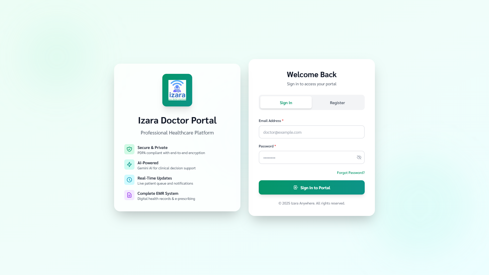

**ขั้นตอน:**

1. เปิด URL ของ Doctor Portal


2. กรอก **อีเมล** และ **รหัสผ่าน** ของแพทย์
3. คลิก **"Sign In to Portal"**
4. ระบบจะพาเข้าสู่ **แดชบอร์ดแพทย์**


> ⚠️ **หมายเหตุสำหรับแพทย์ใหม่:** แพทย์ที่สมัครใหม่จะต้องรอ **ผู้ดูแลระบบอนุมัติ** ก่อนถึงจะเข้าสู่ระบบได้ (ดูส่วน 5.12)

---

### 4.2 แดชบอร์ดแพทย์

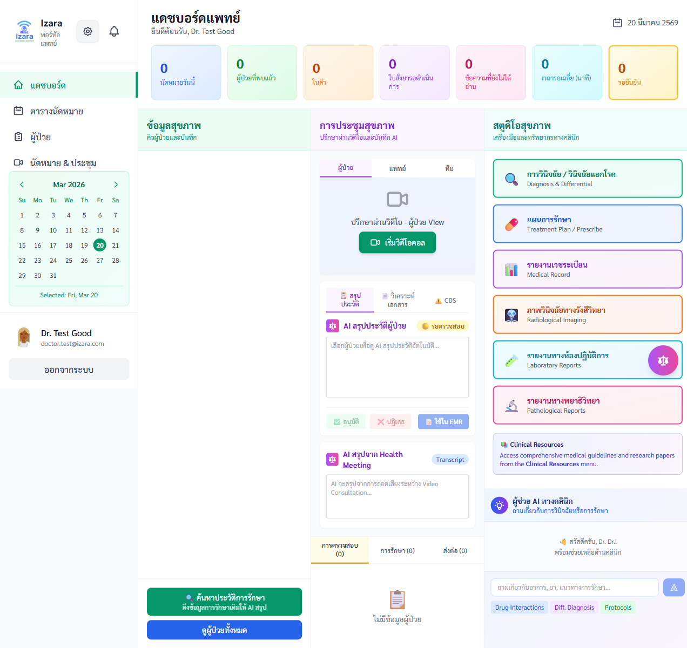

**สิ่งที่แดชบอร์ดแสดง:**
- **นัดหมายวันนี้** — รายการนัดหมายที่ต้องดูแลในวันนี้
- **คิวผู้ป่วย** — จำนวนผู้ป่วยที่รอการยืนยัน
- **สถิติรายเดือน** — จำนวนผู้ป่วย, การปรึกษา, ยา
- **การแจ้งเตือนล่าสุด** — ข้อความจากระบบ

**เมนูนำทางด้านซ้าย (Doctor Portal):**

| เมนู | คำอธิบาย |
|------|-----------|
| 🏠 แดชบอร์ด | หน้าสรุปข้อมูลแพทย์ |
| 📅 ตารางงาน | ตารางนัดหมายรายวัน/สัปดาห์ |
| 👥 การจัดการนัดหมาย | รับและยืนยันนัดหมายจากผู้ป่วย |
| 🎥 Health Meeting | นัดหมายที่พร้อมประชุม |
| 👤 ผู้ป่วย | รายชื่อผู้ป่วยทั้งหมด |
| 📋 EMR | เวชระเบียนอิเล็กทรอนิกส์ |
| 💊 ยา | สั่งจ่ายยา |
| 🔬 Lab | สั่งตรวจทางห้องปฏิบัติการ |
| 👨‍⚕️ ที่ปรึกษา | แพทย์ที่ปรึกษา |
| 📰 เนื้อหา | บทความและเนื้อหาทางการแพทย์ |
| 📚 ทรัพยากร | คลินิกทรัพยากร |
| 👤 โปรไฟล์ | ข้อมูลส่วนตัวแพทย์ |
| 🔧 จัดการแพทย์ | *(Admin เท่านั้น)* จัดการบัญชีแพทย์ |

---

## 5. แพทย์ — ฟีเจอร์ทั้งหมด

### 5.1 การจัดการนัดหมาย

เมื่อผู้ป่วยจองนัดหมาย นัดหมายจะเข้ามาใน **คิวนัดหมาย** (Appointment Pool) รอให้แพทย์รับและยืนยัน

#### ดูคิวนัดหมายที่รอการยืนยัน


1. คลิกเมนู **"การจัดการนัดหมาย"** ด้านซ้าย
2. แท็บ **"คิวนัดหมาย"** จะแสดงนัดหมายที่ผู้ป่วยส่งมาและรอการยืนยัน


**ข้อมูลที่แสดงในคิว:**
- ชื่อผู้ป่วย
- อาการ/เหตุผลการนัด
- วันเวลาที่ขอ
- ประเภทการปรึกษา

#### ยืนยันนัดหมาย (Confirm)


**ขั้นตอน:**

1. คลิกที่นัดหมายในคิวเพื่อดูรายละเอียด
2. ตรวจสอบอาการและข้อมูลผู้ป่วย
3. คลิกปุ่ม **"ยืนยันนัดหมาย"** (Confirm Appointment)
4. ระบบจะ:
   - สร้างลิงก์ Jitsi สำหรับการประชุมวิดีโอโดยอัตโนมัติ
   - เปลี่ยนสถานะนัดหมายเป็น **"ยืนยันแล้ว"**
   - ส่งการแจ้งเตือนไปยังผู้ป่วย
5. นัดหมายที่ยืนยันแล้วจะปรากฏในแท็บ **"Health Meeting"**

#### การแจ้งเตือนนัดหมายใหม่


เมื่อผู้ป่วยสร้างนัดหมายใหม่ แพทย์จะได้รับการแจ้งเตือนผ่าน:
- ไอคอนกระดิ่งด้านบนขวาของหน้าจอ (แสดงจำนวนการแจ้งเตือน)
- การอัปเดตแบบ Real-time ในหน้าคิวนัดหมาย

---

### 5.2 Health Meeting (พบแพทย์ออนไลน์)

Health Meeting เป็นส่วนที่รวบรวม **นัดหมายที่ยืนยันแล้ว** พร้อมลิงก์สำหรับเริ่มการประชุมวิดีโอ


**ขั้นตอนเริ่มการประชุม:**

1. คลิกเมนู **"Health Meeting"** ด้านซ้าย


2. แท็บ **"นัดหมายที่กำหนด"** (Scheduled Meetings) จะแสดงนัดหมายที่ยืนยันแล้วพร้อมลิงก์ Jitsi
3. เลือกนัดหมายที่ต้องการเริ่มประชุม
4. คลิก **"🎥 เริ่มประชุม (In-App)"** เพื่อเปิดห้องประชุมในระบบ
   — หรือ —
   คลิก **"🔗 Open Jitsi (New Tab)"** เพื่อเปิดในแท็บใหม่
5. แพทย์จะเข้าสู่ห้องประชุมในฐานะ **Host (เจ้าภาพ)**

> 💡 **หมายเหตุ:** แพทย์ต้องเข้าห้องประชุมก่อน แล้วค่อยอนุมัติให้ผู้ป่วยเข้าร่วม (ระบบ Lobby)

---

### 5.3 ตารางงานแพทย์

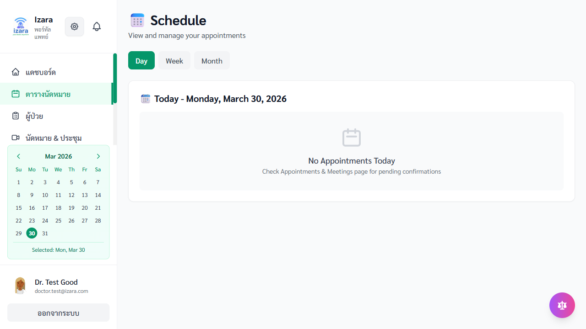

**ขั้นตอนดูตารางงาน:**

1. คลิกเมนู **"ตารางงาน"** ด้านซ้าย
2. เลือกมุมมอง: รายวัน, รายสัปดาห์, หรือรายเดือน
3. คลิกที่นัดหมายเพื่อดูรายละเอียด

**ขั้นตอนเพิ่มช่วงเวลาให้คำปรึกษา:**
1. คลิกที่ช่วงเวลาว่างในตาราง
2. กรอกรายละเอียด (ชนิดการปรึกษา, เวลา, ข้อมูลเพิ่มเติม)
3. คลิก **"บันทึก"**

---

### 5.4 การจัดการผู้ป่วย

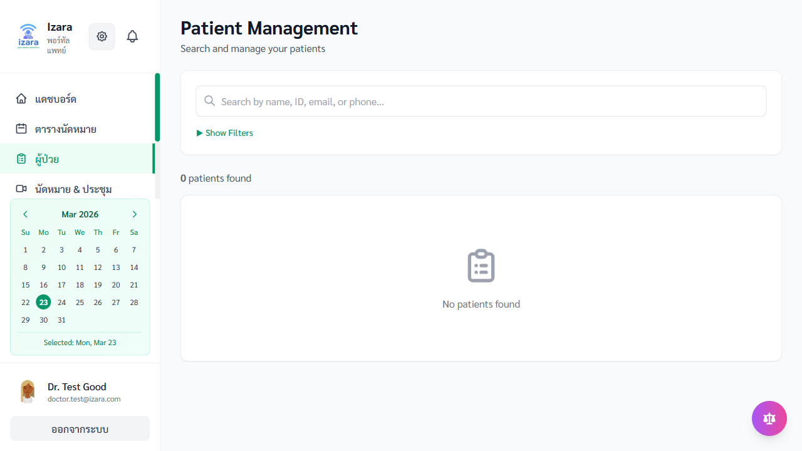

**ขั้นตอนค้นหาและดูข้อมูลผู้ป่วย:**

1. คลิกเมนู **"ผู้ป่วย"** ด้านซ้าย
2. ใช้ช่องค้นหาเพื่อหาผู้ป่วยตามชื่อหรืออีเมล
3. คลิกที่ชื่อผู้ป่วยเพื่อดูข้อมูลทั้งหมด:
   - ประวัติสุขภาพ (PHR)
   - ประวัติการนัดหมาย
   - เวชระเบียน (EMR) ที่เคยบันทึก
   - ใบสั่งยา
   - ผลตรวจทางห้องปฏิบัติการ

---

### 5.5 เวชระเบียนอิเล็กทรอนิกส์ (EMR)

EMR (Electronic Medical Record) คือเวชระเบียนที่แพทย์บันทึกระหว่างหรือหลังการปรึกษา


**ขั้นตอนสร้าง EMR ใหม่:**

1. คลิกเมนู **"EMR"** ด้านซ้าย หรือเข้าจากหน้าผู้ป่วย
2. คลิก **"+ สร้าง EMR ใหม่"**


3. กรอกข้อมูลในรูปแบบ **SOAP**:
   - **S (Subjective)** — อาการที่ผู้ป่วยแจ้ง / ประวัติการเจ็บป่วย
   - **O (Objective)** — ผลการตรวจร่างกาย / สัญญาณชีพ
   - **A (Assessment)** — การวินิจฉัย / ความประทับใจทางคลินิก
   - **P (Plan)** — แผนการรักษา / ยาที่สั่งจ่าย / การนัดติดตาม
4. เพิ่มรหัส ICD-10 (ถ้ามี)
5. คลิก **"บันทึก EMR"**

> 💡 **ฟีเจอร์ AI:** ระบบมี AI ช่วยสรุป EMR จากการถอดเสียงการประชุมโดยอัตโนมัติ (ดูส่วน 6.5)

---

### 5.6 การสั่งจ่ายยา (Prescriptions)


**ขั้นตอนสั่งจ่ายยา:**

1. คลิกเมนู **"ยา"** หรือ **"Prescriptions"** ด้านซ้าย
2. คลิก **"+ สั่งจ่ายยาใหม่"**


3. เลือกผู้ป่วย (ค้นหาชื่อ)
4. เพิ่มรายการยา:
   - ชื่อยา (พิมพ์เพื่อค้นหา)
   - ขนาดยา (Dosage)
   - วิธีรับประทาน (เช่น "1 เม็ด หลังอาหาร เช้า-เย็น")
   - จำนวนวัน
5. เพิ่มหมายเหตุสำหรับเภสัชกร (ถ้ามี)
6. คลิก **"บันทึกใบสั่งยา"**
7. ผู้ป่วยจะเห็นใบสั่งยาใน Patient Portal โดยอัตโนมัติ

---

### 5.7 คำสั่งตรวจทางห้องปฏิบัติการ (Lab Orders)


**ขั้นตอนสั่งตรวจ:**

1. คลิกเมนู **"Lab"** ด้านซ้าย
2. คลิก **"+ สั่งตรวจใหม่"**


3. เลือกผู้ป่วย
4. เลือกรายการตรวจ (เช่น CBC, LFT, ระดับน้ำตาล)
5. กรอกเหตุผลการตรวจ
6. คลิก **"บันทึกคำสั่งตรวจ"**

**การดูผลตรวจ:**


1. ในหน้า Lab คลิกแท็บ **"ผลตรวจ"**
2. เลือกผู้ป่วยเพื่อดูผลตรวจทั้งหมด
3. คลิกที่รายการผลตรวจเพื่อดูรายละเอียดและค่าอ้างอิง

---

### 5.8 ที่ปรึกษาทางการแพทย์


**ขั้นตอนใช้งาน:**

1. คลิกเมนู **"ที่ปรึกษา"** ด้านซ้าย
2. ดูรายชื่อแพทย์ที่ปรึกษาที่พร้อมให้บริการ
3. คลิกที่แพทย์เพื่อส่งคำถามหรือขอคำปรึกษา
4. กรอกรายละเอียดกรณีและคำถาม
5. คลิก **"ส่งคำขอ"**

---

### 5.9 เนื้อหาทางการแพทย์

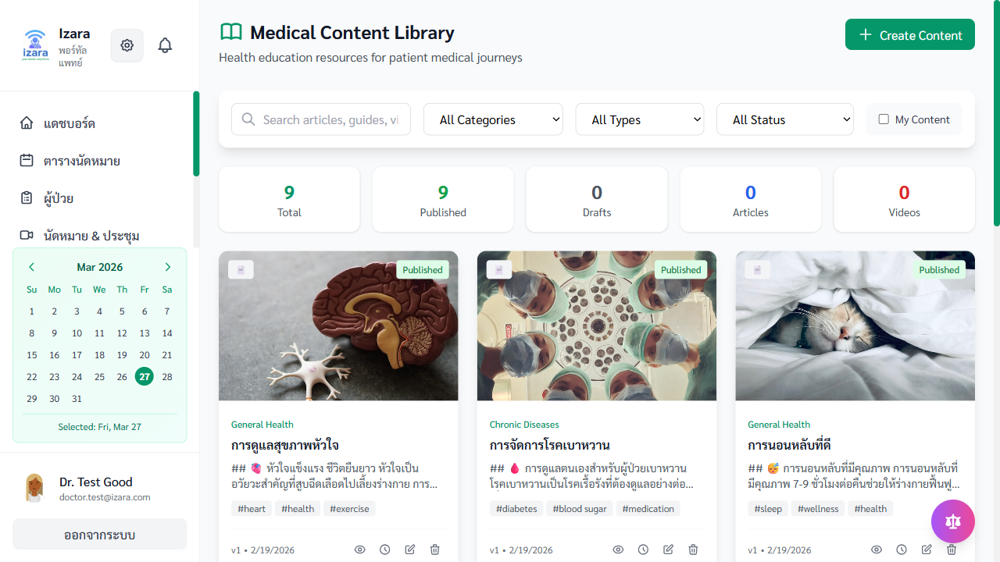

**ขั้นตอนสร้างเนื้อหา:**

1. คลิกเมนู **"เนื้อหา"** ด้านซ้าย
2. คลิก **"+ สร้างเนื้อหาใหม่"**
3. กรอกหัวข้อ, เนื้อหา, หมวดหมู่, และแท็ก
4. เพิ่มรูปภาพ (ถ้ามี)
5. คลิก **"บันทึกเป็น Draft"** หรือ **"ส่งอนุมัติ"**

> 📋 เนื้อหาต้องได้รับการอนุมัติจาก Admin ก่อนเผยแพร่สู่คลังความรู้ของผู้ป่วย

---

### 5.10 ทรัพยากรคลินิก

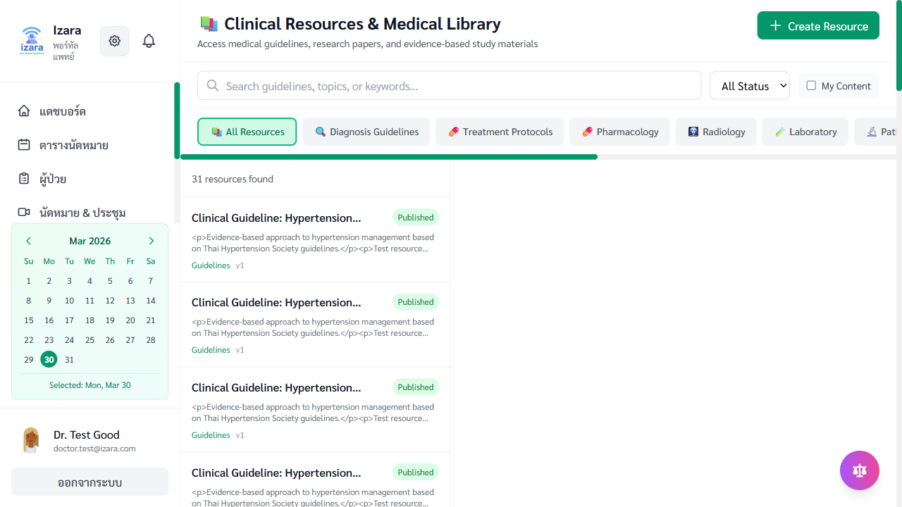

**ขั้นตอนค้นหาทรัพยากร:**

1. คลิกเมนู **"ทรัพยากรคลินิก"** ด้านซ้าย
2. เลือกหมวดหมู่ (แนวทางการรักษา, แผนการรักษา, แบบฟอร์ม)
3. ค้นหาด้วยคำสำคัญหรือรหัส ICD-10
4. คลิกที่เอกสารเพื่อดูหรือดาวน์โหลด

---

### 5.11 โปรไฟล์แพทย์

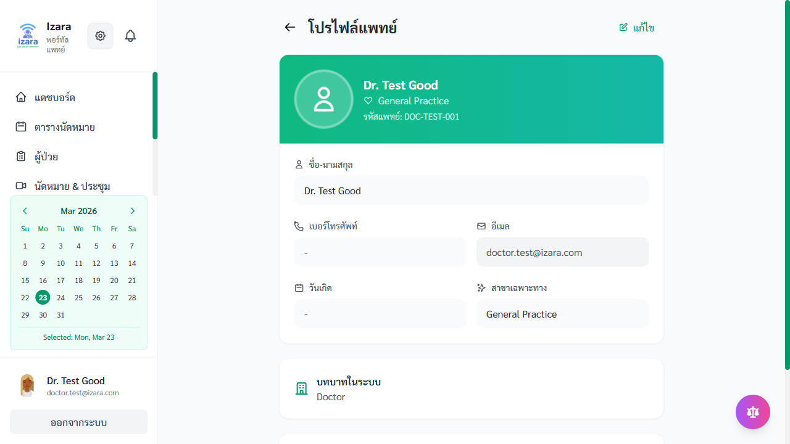

**ขั้นตอนแก้ไขโปรไฟล์:**

1. คลิกชื่อหรือรูปโปรไฟล์ด้านบนขวา
2. คลิก **"แก้ไขโปรไฟล์"**
3. อัปเดตข้อมูล:
   - รูปโปรไฟล์
   - ชื่อ-นามสกุล (ภาษาไทยและอังกฤษ)
   - ความเชี่ยวชาญพิเศษ
   - เลขที่ใบอนุญาตประกอบวิชาชีพ
   - ประวัติการศึกษา
   - เบอร์โทรติดต่อ
4. คลิก **"บันทึก"**

---

### 5.12 การจัดการแพทย์ *(เฉพาะผู้ดูแลระบบ)*

ส่วนนี้สามารถใช้งานได้เฉพาะ **ผู้ดูแลระบบ (Admin)** เท่านั้น


#### อนุมัติแพทย์ใหม่


**ขั้นตอน:**

1. คลิกเมนู **"การจัดการแพทย์"** หรือ **"Doctor Management"**

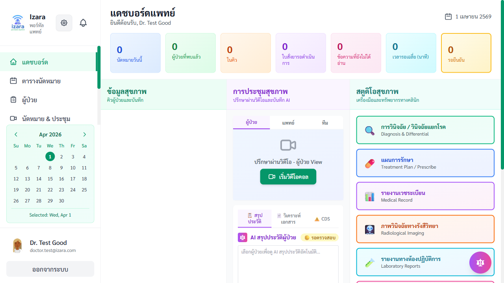

2. คลิกแท็บ **"รอการอนุมัติ"** เพื่อดูรายการแพทย์ที่สมัครใหม่
3. คลิกที่ชื่อแพทย์เพื่อดูข้อมูลและเอกสาร:
   - ใบอนุญาตประกอบวิชาชีพ
   - ประวัติการศึกษา
   - ความเชี่ยวชาญ
4. คลิก **"อนุมัติ"** หรือ **"ปฏิเสธ"** พร้อมเหตุผล

#### จัดการตารางงานแพทย์ *(Admin)*


1. คลิกเมนู **"ตารางงานแพทย์"**
2. เลือกแพทย์จากรายการ
3. จัดการช่วงเวลาให้บริการของแพทย์แต่ละคน

#### จัดการนัดหมายทั้งระบบ *(Admin)*


1. คลิกเมนู **"การจัดการนัดหมาย"**
2. ดูรายการนัดหมายทั้งระบบ กรองตามสถานะ, แพทย์, หรือวันที่
3. สามารถมอบหมายนัดหมายให้แพทย์คนใดก็ได้

---

## 6. กระบวนการประชุมวิดีโอ (Telemedicine)

กระบวนการประชุมวิดีโอเริ่มต้นหลังจากแพทย์ **ยืนยันนัดหมาย** แล้ว ทั้งสองฝ่ายจะได้รับลิงก์สำหรับเข้าร่วมการประชุม

### ภาพรวมขั้นตอนทั้งหมด

```
ผู้ป่วยจองนัด → แพทย์ยืนยัน → ทั้งสองฝ่ายได้รับลิงก์
     ↓                                        ↓
แพทย์เข้าห้องประชุม (Host)      ผู้ป่วยเข้าห้องรอ (Lobby)
     ↓                                        ↓
แพทย์อนุมัติให้ผู้ป่วยเข้า ← ระบบ Lobby แจ้งเตือนแพทย์
     ↓
ประชุมวิดีโอ (Jitsi Meet)
     ↓
AI ถอดเสียงและสรุปอัตโนมัติ
     ↓
แพทย์บันทึก EMR + สั่งยา/Lab
     ↓
ผู้ป่วยรับผลสรุปใน Patient Portal
```

---

### 6.1 แพทย์เริ่มต้นประชุม

#### ขั้นตอนที่ 1 — ยืนยันข้อตกลง (Agreement)

ก่อนเข้าห้องประชุม แพทย์จะต้องยืนยันข้อตกลงการรักษาความลับข้อมูลผู้ป่วย


1. หน้าข้อตกลงจะปรากฏขึ้นโดยอัตโนมัติเมื่อคลิกเริ่มประชุม
2. อ่านข้อตกลงการรักษาความลับข้อมูลผู้ป่วย
3. คลิก **"ยืนยันและดำเนินการต่อ"**

#### ขั้นตอนที่ 2 — ห้องรอก่อนเข้าประชุม (Pre-Join)


1. หน้าเช็คอุปกรณ์จะแสดงขึ้น
2. ตรวจสอบกล้องและไมโครโฟน
3. พิมพ์ **ชื่อที่ต้องการแสดง** (ระบบจะใส่ชื่อแพทย์อัตโนมัติ)
4. คลิก **"เข้าร่วมประชุม"** (Join Meeting)
5. แพทย์จะเข้าห้องประชุมในฐานะ **Host** และรอผู้ป่วย

---

### 6.2 ผู้ป่วยเข้าร่วมประชุม

#### ขั้นตอนที่ 1 — ยืนยันข้อตกลง (ผู้ป่วย)


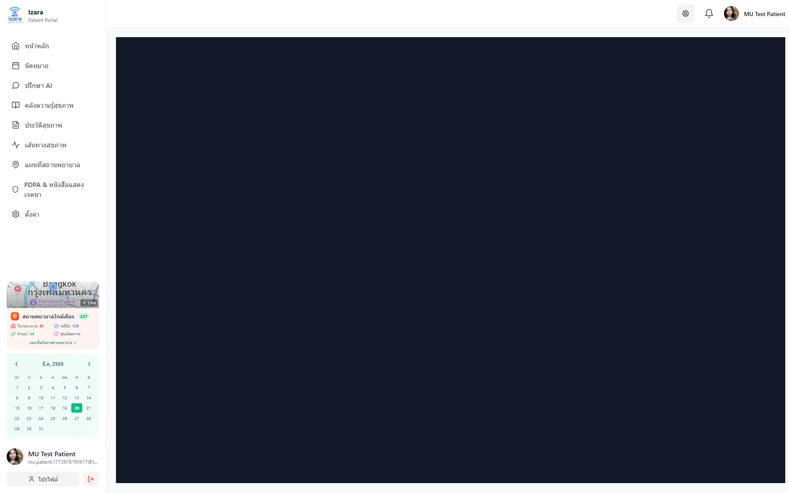

1. ผู้ป่วยคลิกลิงก์ประชุมจากหน้านัดหมาย (Patient Portal)
2. หน้าข้อตกลงจะปรากฏขึ้น
3. อ่านข้อตกลงและคลิก **"ยืนยันและดำเนินการต่อ"**

#### ขั้นตอนที่ 2 — ห้องรอผู้ป่วย (Lobby)


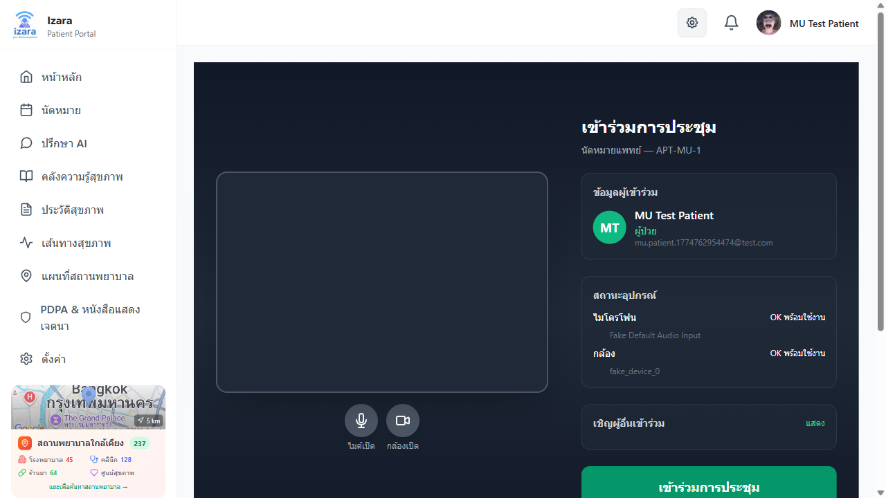

1. หน้าเช็คอุปกรณ์จะแสดงขึ้น
2. ตรวจสอบกล้องและไมโครโฟน
3. คลิก **"เข้าร่วมประชุม"**
4. ผู้ป่วยจะเข้าสู่ **ห้องรอ (Lobby)** พร้อมข้อความ "กรุณารอแพทย์อนุมัติ"
5. แพทย์จะเห็นการแจ้งเตือนว่าผู้ป่วยรออยู่ในห้อง Lobby
6. แพทย์คลิก **"อนุมัติ"** ผู้ป่วยจะเข้าห้องประชุมทันที

---

### 6.3 การเชิญแขกภายนอก (Guest)

แพทย์สามารถเชิญบุคคลภายนอก เช่น แพทย์ผู้เชี่ยวชาญ, ญาติผู้ป่วย ให้เข้าร่วมประชุมโดยไม่ต้องมีบัญชีในระบบ


**ขั้นตอนเชิญแขก:**

1. ในห้องประชุม คลิกปุ่ม **"เชิญแขก"** หรือ **"Share Link"**


2. ระบบจะแสดงลิงก์สำหรับส่งให้แขก
3. **คัดลอกลิงก์** และส่งให้แขกทางอีเมลหรือ LINE


**ขั้นตอนสำหรับแขก (Guest):**

1. แขกเปิดลิงก์ที่ได้รับ
2. กรอกชื่อที่ต้องการแสดงในห้องประชุม

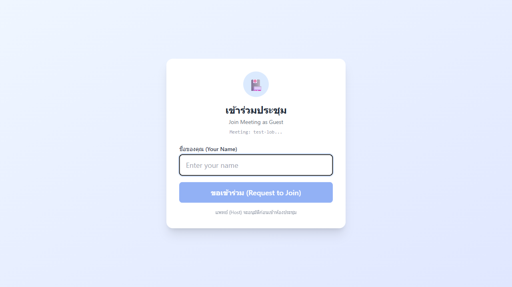

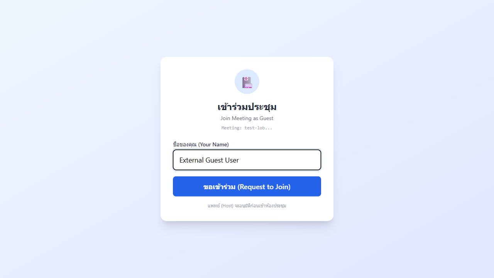

3. คลิก **"เข้าร่วมประชุม"**
4. แขกจะเข้าสู่ **ห้องรอ (Lobby)** รอให้แพทย์อนุมัติ

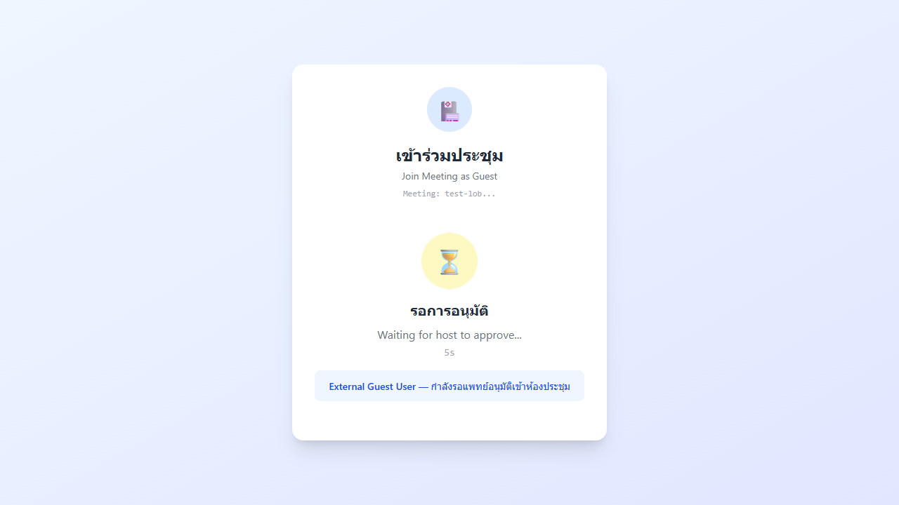

5. แพทย์คลิก **"อนุมัติ"** แขกจะเข้าร่วมประชุมทันที


---

### 6.4 ระหว่างการประชุม — การควบคุมต่างๆ

#### การควบคุมของแพทย์ (Host Controls)


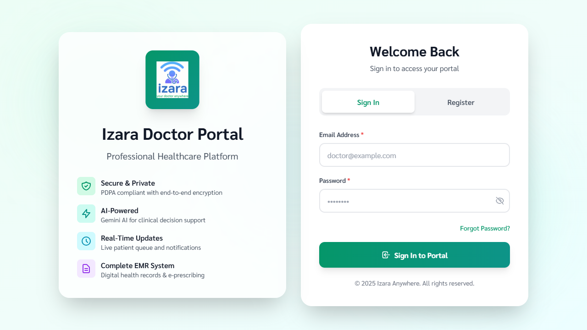

**ปุ่มควบคุมหลัก:**

| ปุ่ม | ฟังก์ชัน |
|------|----------|
| 🎤 ไมโครโฟน | เปิด/ปิดเสียง |
| 📷 กล้อง | เปิด/ปิดวิดีโอ |
| 🖥️ แชร์หน้าจอ | แชร์หน้าจอ/หน้าต่าง |
| 💬 แชท | แชทข้อความในห้องประชุม |
| ✋ ยกมือ | แจ้งแพทย์ว่าต้องการพูด |
| 🎦 บันทึก | บันทึกการประชุมในเครื่อง |
| 🔒 ความปลอดภัย | จัดการสิทธิ์ผู้เข้าร่วม |
| 📋 ผู้เข้าร่วม | ดูรายชื่อและอนุมัติจาก Lobby |
| 📞 วางสาย | ออกจากห้องประชุม |

#### มุมมองผู้ป่วยระหว่างประชุม

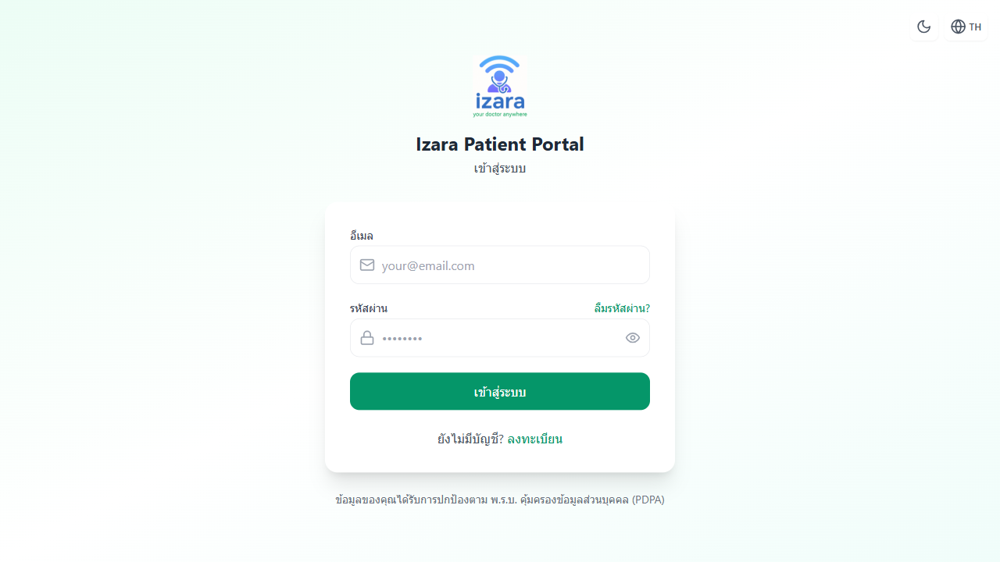

---

### 6.5 หลังการประชุม — AI สรุปและบันทึก

หลังจากแพทย์วางสายหรือปิดห้องประชุม ระบบ AI จะประมวลผลการประชุมโดยอัตโนมัติ

#### AI ถอดเสียงและระบุผู้พูด


- ระบบ AI จะ **ถอดเสียงการประชุมทั้งหมด** เป็นข้อความ
- ระบุผู้พูดแต่ละคน (Speaker Diarization)
- แสดงผลใน Doctor Portal ในแท็บ **"Transcript"**

#### AI สรุป SOAP อัตโนมัติ


- AI จะสรุปเนื้อหาการประชุมในรูปแบบ SOAP:
  - **S:** อาการที่ผู้ป่วยแจ้ง
  - **O:** สิ่งที่แพทย์ตรวจพบ
  - **A:** การวินิจฉัยเบื้องต้น
  - **P:** แผนการรักษาที่หารือ
- แพทย์สามารถ **แก้ไขและบันทึก** เป็น EMR ได้ทันที

#### การดำเนินการหลังการประชุม


**แพทย์ดำเนินการหลังประชุม:**
1. ตรวจสอบและแก้ไข AI สรุป SOAP
2. คลิก **"บันทึกเป็น EMR"** เพื่อสร้างเวชระเบียนอย่างเป็นทางการ
3. สั่งจ่ายยาหรือตรวจ Lab (ถ้าจำเป็น)
4. คลิก **"เสร็จสิ้นการปรึกษา"** เพื่อปิดนัดหมาย

---

### 6.6 ประวัติการประชุม


**ขั้นตอนดูประวัติการประชุม:**

1. ในหน้า Health Meeting คลิกแท็บ **"ประวัติการประชุม"**
2. แสดงรายการการประชุมทั้งหมดพร้อม:
   - วันเวลาที่ประชุม
   - ชื่อผู้เข้าร่วม
   - ระยะเวลาการประชุม
   - ลิงก์ไปยัง Transcript และ AI สรุป
   - EMR ที่บันทึก
3. คลิกที่รายการเพื่อดูรายละเอียดทั้งหมด

---

## 7. คำถามที่พบบ่อย (FAQ)

### ❓ ผู้ป่วย — คำถามทั่วไป

**Q: ลงทะเบียนแล้วเข้าสู่ระบบไม่ได้ ทำอย่างไร?**

A: ตรวจสอบสิ่งต่อไปนี้:
1. ตรวจสอบว่าพิมพ์อีเมลและรหัสผ่านถูกต้อง
2. ลองคลิก "ลืมรหัสผ่าน?" เพื่อรีเซ็ตรหัสผ่าน
3. ล้าง Cache ของเบราว์เซอร์แล้วลองใหม่
4. ลองเปิด Tab แบบ Incognito/Private

---

**Q: จองนัดหมายแล้ว แต่สถานะยังเป็น "รอดำเนินการ" นานมาก?**

A: นัดหมายจะอยู่ในสถานะ "รอดำเนินการ" จนกว่าแพทย์จะยืนยัน โดยปกติแพทย์จะยืนยันภายใน **2-4 ชั่วโมง** ในเวลาทำการ (จ-ศ 8:00-17:00 น.) หากรอนานกว่านั้น ติดต่อสอบถามทีมสนับสนุน

---

**Q: เข้าห้องประชุมวิดีโอไม่ได้ ทำอย่างไร?**

A: ตรวจสอบสิ่งต่อไปนี้:
1. **เบราว์เซอร์:** ใช้ Google Chrome หรือ Firefox เวอร์ชันล่าสุด (แนะนำ Chrome)
2. **สิทธิ์กล้องและไมโครโฟน:** คลิกไอคอนกล้องในแถบที่อยู่ URL แล้วเลือก "อนุญาต"
3. **ลิงก์:** ตรวจสอบว่าใช้ลิงก์ล่าสุดจากหน้านัดหมาย (ไม่ใช่ลิงก์เก่า)
4. **เวลา:** ตรวจสอบว่าเข้าตรงตามเวลานัดหมาย
5. **อินเทอร์เน็ต:** ตรวจสอบความเร็วอินเทอร์เน็ต (ต้องการขั้นต่ำ 5 Mbps)

---

**Q: ข้อมูล PHR ของฉันปลอดภัยหรือไม่?**

A: ระบบรักษาความปลอดภัยข้อมูลด้วย:
- การเข้ารหัสข้อมูล SSL/TLS ทุกการรับส่งข้อมูล
- ข้อมูลเก็บใน Cloud PostgreSQL ที่ปลอดภัย
- ปฏิบัติตามมาตรฐาน **PDPA** (พ.ร.บ.คุ้มครองข้อมูลส่วนบุคคล)
- มีการบันทึก Log การเข้าถึงข้อมูลทุกครั้ง

---

**Q: ยกเลิกนัดหมายได้อย่างไร?**

A:
1. ไปที่เมนู **"นัดหมาย"**
2. คลิกที่นัดหมายที่ต้องการยกเลิก
3. คลิก **"ยกเลิกนัดหมาย"**
4. ระบุเหตุผลและยืนยัน

> ⚠️ ควรยกเลิกล่วงหน้าอย่างน้อย 2 ชั่วโมงก่อนเวลานัด เพื่อให้แพทย์รับนัดผู้ป่วยรายอื่นได้

---

**Q: AI Doctor บอกว่าอาการของฉันเป็นอะไร เชื่อได้เลยไหม?**

A: AI Doctor ให้ **ข้อมูลเบื้องต้น** เพื่อช่วยประเมินความเร่งด่วนเท่านั้น ไม่ใช่การวินิจฉัยโรคอย่างเป็นทางการ ควรปรึกษาแพทย์จริงเสมอ โดยเฉพาะหากมีอาการรุนแรงหรือเรื้อรัง

---

### ❓ แพทย์ — คำถามทั่วไป

**Q: สมัครเป็นแพทย์แล้ว ทำไมเข้าสู่ระบบไม่ได้?**

A: แพทย์ใหม่ต้องรอ **ผู้ดูแลระบบ (Admin)** ตรวจสอบและอนุมัติบัญชีก่อน กระบวนการอนุมัติปกติใช้เวลา 1-2 วันทำการ หากรอนานกว่านั้น ติดต่อ Admin ของระบบ

---

**Q: ผู้ป่วยจองนัดมาแล้ว แต่ไม่เห็นการแจ้งเตือนในระบบ?**

A: ตรวจสอบสิ่งต่อไปนี้:
1. รีเฟรชหน้า (กด F5) เพื่ออัปเดตข้อมูล
2. คลิกเมนู **"การจัดการนัดหมาย"** → แท็บ **"คิวนัดหมาย"**
3. ตรวจสอบว่าเบราว์เซอร์อนุญาตการแจ้งเตือน (Notification) สำหรับเว็บไซต์นี้
4. ตรวจสอบว่าอินเทอร์เน็ตเชื่อมต่อสมบูรณ์

---

**Q: ลิงก์ Jitsi ในหน้า Health Meeting ไม่ปรากฏ ทำอย่างไร?**

A: ลิงก์ Jitsi จะปรากฏหลังจากแพทย์ **ยืนยันนัดหมาย** แล้วเท่านั้น ตรวจสอบว่า:
1. นัดหมายมีสถานะ **"ยืนยันแล้ว"** (Confirmed)
2. รีเฟรชหน้า Health Meeting
3. ถ้ายังไม่มีลิงก์ ให้คลิก **"ยืนยันนัดหมาย"** อีกครั้งเพื่อสร้างลิงก์ใหม่

---

**Q: ผู้ป่วยเข้าห้องประชุมไม่ได้ ทำอย่างไร?**

A: แพทย์ตรวจสอบดังนี้:
1. ตรวจสอบว่ามีผู้ป่วยรออยู่ใน **Lobby** — คลิกไอคอน "ผู้เข้าร่วม" ในห้องประชุม
2. คลิก **"อนุมัติ"** (Admit) เพื่อให้ผู้ป่วยเข้าร่วม
3. ถ้าผู้ป่วยใช้ลิงก์เก่า ให้ส่งลิงก์ใหม่จากหน้า Health Meeting

---

**Q: AI สรุปผิดพลาด จะแก้ไขได้อย่างไร?**

A:
1. ในหน้า "หลังการประชุม" คลิก **"แก้ไข AI สรุป"**
2. แก้ไขเนื้อหาในแต่ละส่วน S/O/A/P ที่ผิดพลาด
3. คลิก **"บันทึก"** ก่อนสร้าง EMR

---

**Q: จะส่ง Transcript การประชุมให้ผู้ป่วยได้อย่างไร?**

A:
1. ในหน้าประวัติการประชุม เลือกการประชุมที่ต้องการ
2. คลิก **"ดาวน์โหลด Transcript"**
3. ส่งไฟล์ PDF ให้ผู้ป่วยทางอีเมลหรือช่องทางที่ปลอดภัย

---

### ❓ ปัญหาทางเทคนิค

**Q: หน้าจอค้างหรือโหลดช้ามาก?**

A:
1. กด **Ctrl+Shift+R** (Windows) หรือ **Cmd+Shift+R** (Mac) เพื่อ Hard Refresh
2. ล้าง Cache เบราว์เซอร์: ไปที่ Settings → Privacy → Clear Cache
3. ลองเปลี่ยนเบราว์เซอร์ (แนะนำ Google Chrome)
4. ตรวจสอบความเร็วอินเทอร์เน็ต

---

**Q: กล้องหรือไมโครโฟนไม่ทำงานในห้องประชุม?**

A:
1. ตรวจสอบว่าเบราว์เซอร์ได้รับสิทธิ์เข้าถึงกล้องและไมโครโฟน:
   - Chrome: คลิกไอคอนกุญแจ (🔒) ในแถบ URL → ตรวจสอบสิทธิ์
2. ปิดโปรแกรมอื่นที่ใช้กล้อง/ไมโครโฟนอยู่ (Zoom, Teams, ฯลฯ)
3. ลองรีสตาร์ทเบราว์เซอร์
4. ถ้ายังไม่ได้ผล รีสตาร์ทคอมพิวเตอร์

---

**Q: ไม่ได้รับอีเมลยืนยันหรือแจ้งเตือน?**

A:
1. ตรวจสอบโฟลเดอร์ **Spam/Junk Mail**
2. เพิ่มอีเมลของระบบ (`noreply@izara.com`) ในรายชื่อที่อนุญาต (Whitelist)
3. ตรวจสอบการตั้งค่าการแจ้งเตือนใน Settings ของ Portal
4. ติดต่อทีมสนับสนุนถ้าปัญหายังคงอยู่

---

## 📞 ติดต่อฝ่ายสนับสนุน

หากพบปัญหาที่ไม่ได้อยู่ในคู่มือนี้ กรุณาติดต่อ:

| ช่องทาง | รายละเอียด |
|---------|-----------|
| 📧 อีเมล | support@izara.com |
| 📱 LINE Official | @izara-support |
| ☎️ โทรศัพท์ | 02-xxx-xxxx (จ-ศ 8:00-18:00 น.) |

---

*คู่มือนี้จัดทำจากการทดสอบระบบ Isara Anywhere เวอร์ชัน 2.0 | อัปเดต: พฤษภาคม 2569*
*ภาพหน้าจอทั้งหมดได้มาจากการทดสอบอัตโนมัติ (Automated UI Testing) ที่ผ่านแล้ว*
