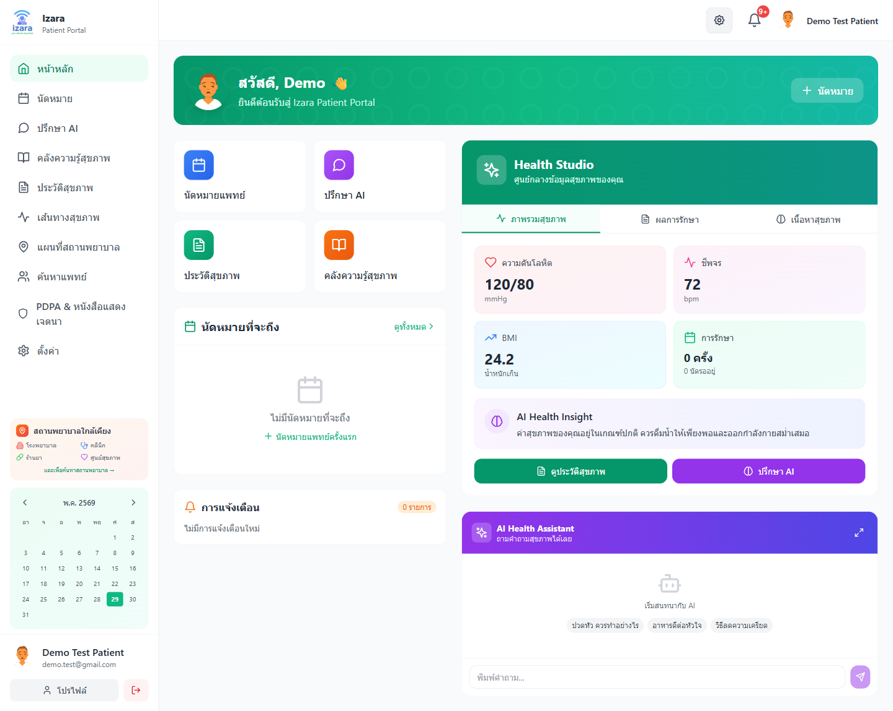
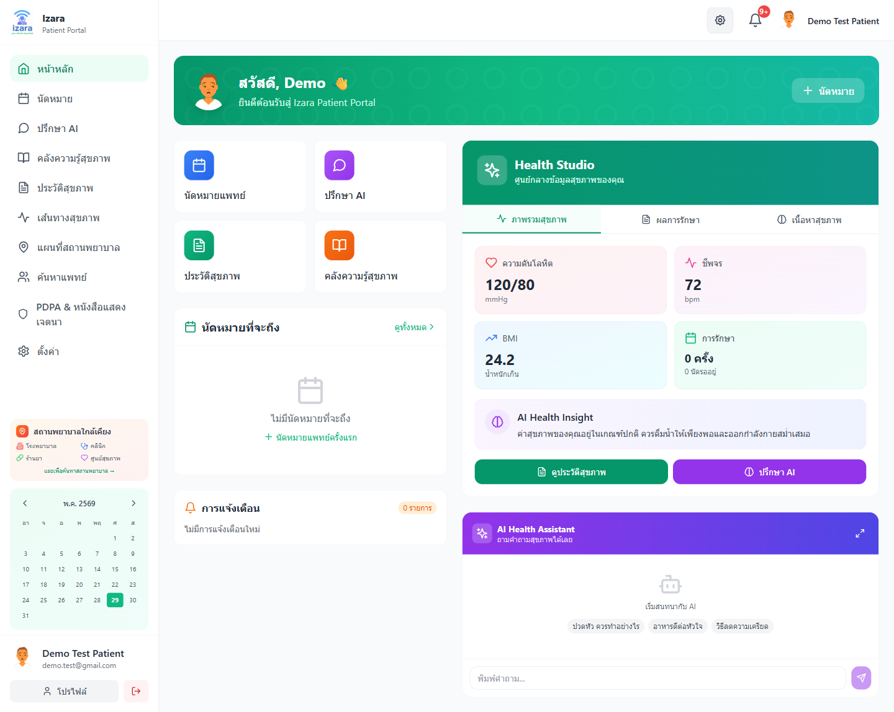
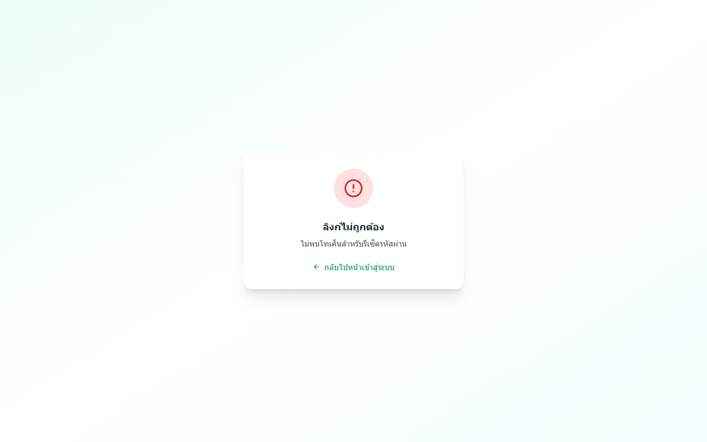
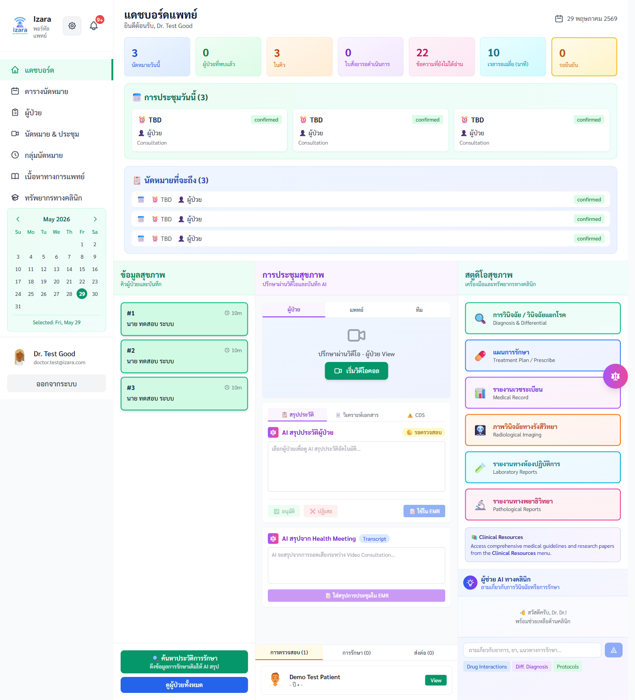
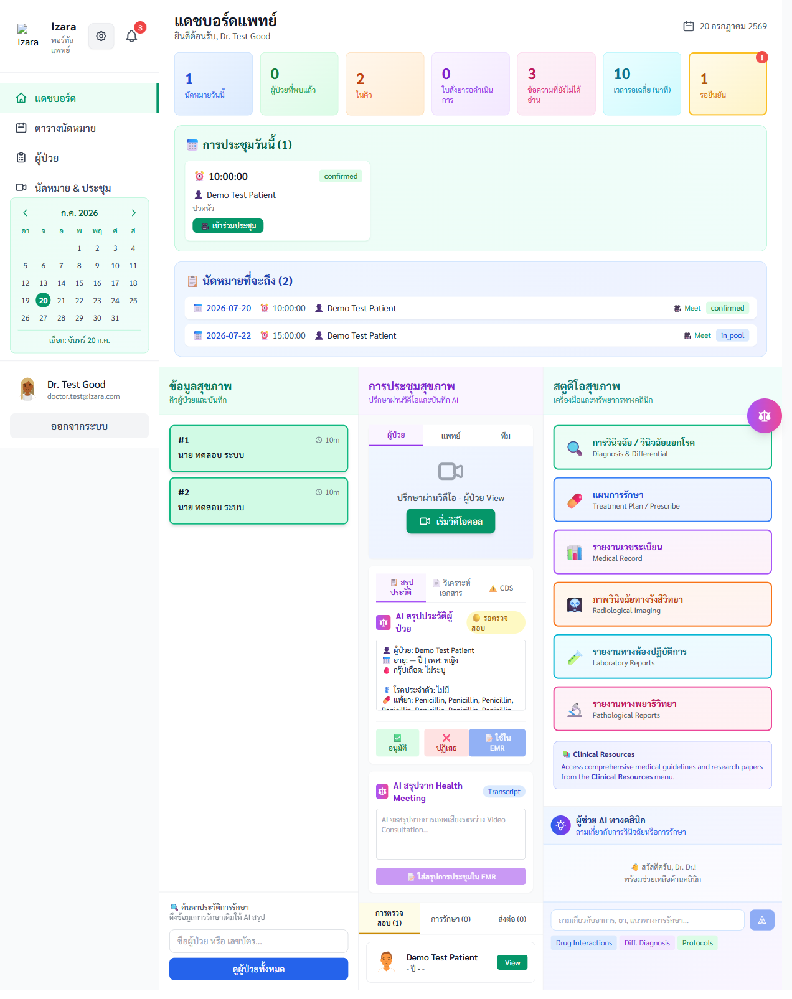
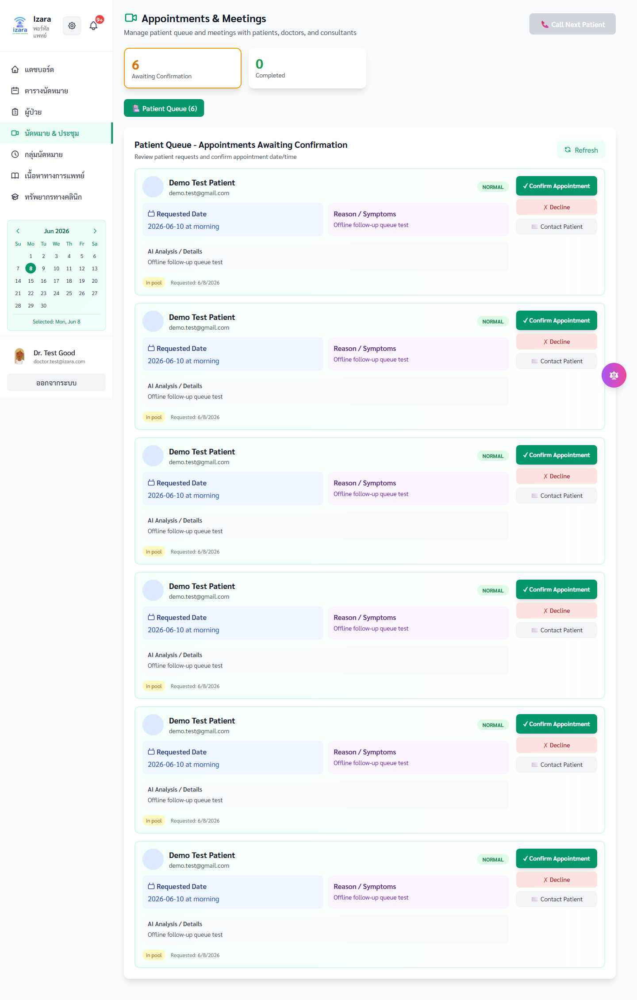

# Unit Test + UI Screenshot Coverage — v1.7.37

> Generated: 2026-05-28T16:23:41.340Z | Full run log: [reports/unit/v1.7.37-full-unit-run.log](../reports/unit/v1.7.37-full-unit-run.log)

## Summary

| Metric | Value |
|--------|-------|
| Unit test files passed | 114 |
| Unit tests passed | 2646 |
| Run status | PASS |
| UI screenshot folders | 15 |
| UI PNG artifacts | 188 |
| Cloud gate UI (A + 7 viewports) | 41 Playwright tests |
| Sonar / quality | `npm run sonar:lint` |

## Unit domain → UI proof mapping

Vitest validates logic in isolation; Playwright screenshots prove the same flows on cloud UI.

| Unit domain | Vitest scope | UI screenshot folders |
|-------------|--------------|------------------------|
| **auth** | doctor-portal/auth*, patient-portal/auth* | group-A, sso (14 PNG) |
| **appointments** | *appointment*, *queue*, *book* | group-D (29 PNG) |
| **clinical** | *emr*, *phr*, *prescri*, *lab*, *pdpa* | group-F, group-G (28 PNG) |
| **meeting** | meeting-server/*, *meeting*, *jitsi* | group-E, group-J-meeting-jitsi, group-Q (31 PNG) |
| **security** | *owasp*, *sanitize*, *jwt*, security/* | group-A (10 PNG) |
| **responsive** | *responsive*, layout* | group-S (4 PNG) |
| **ai** | *ai*, *gemini* | group-J, group-H (26 PNG) |
| **admin** | *admin* | group-C, group-I (27 PNG) |

## Gate screenshots (cloud verification)

### group-A

- 
- 
- 
- 
- 
- 
- 
- 
- 
- 

### group-S

- 
- 
- 
- 

## Sample workflow screenshots

### workflows/auth-login

- 
- 
- 
- 
- 
- 

### workflows/appointment-lifecycle

- 
- 
- 
- 
- 
- 

## Commands

```powershell
npm run test:unit
npm run test:unit:report
npm run test:gate:ui-showup
npm run test:cloud:unit-gate
```
