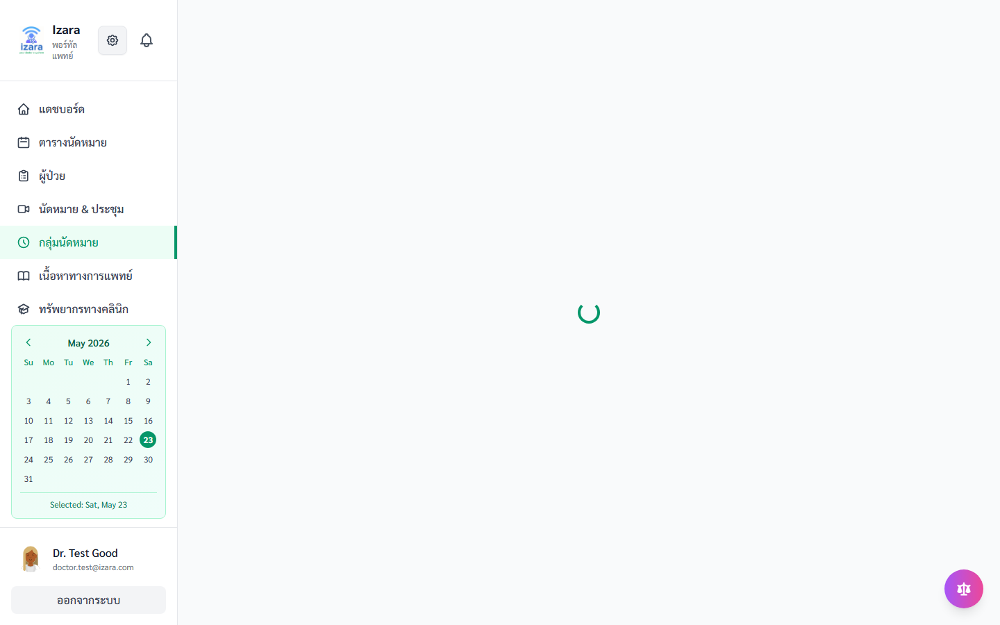
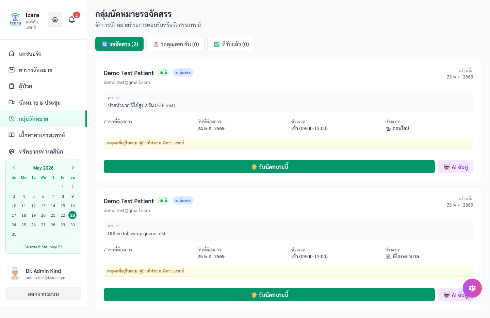
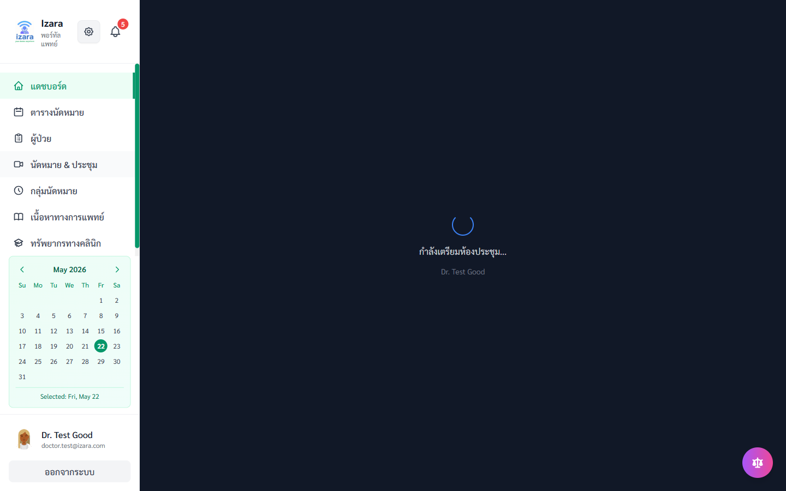
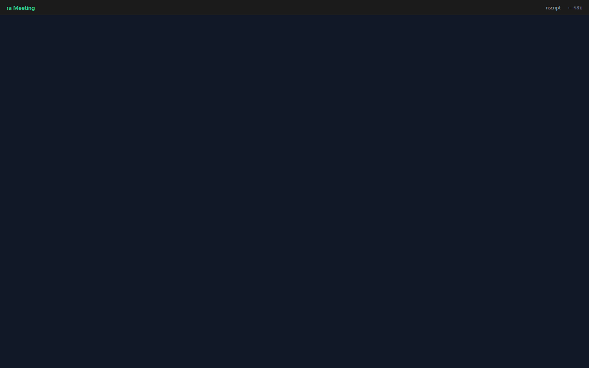

# คู่มือผู้ใช้งาน — Isara Anywhere (ฝั่งแพทย์)

> เวอร์ชัน **1.7.21** · อัปเดต 22 พฤษภาคม 2569  
> **Word:** [USER_GUIDE_DOCTOR_WORD_TH.docx](USER_GUIDE_DOCTOR_WORD_TH.docx) — **TH Sarabun New 16 pt**  
> **PowerPoint:** [USER_GUIDE_DOCTOR_PPT_TH.pptx](USER_GUIDE_DOCTOR_PPT_TH.pptx) — **FC Iconic**  
> สร้างด้วย `python scripts/build-portal-user-guides.py` · อ้างอิง `Processes/Pages/Doctor-Portal/` และ UI test 93 ภาพ  
> การเข้าห้องประชุม: แพทย์เป็น HOST · ผู้ป่วย/แขกผ่าน Izara Lobby

---

## หมายเหตุการตรวจสอบล่าสุด (22 พ.ค. 2569)

- ยืนยันเส้นทางหลักฝั่งแพทย์/แอดมิน: คิวนัดหมาย, การมอบหมายแพทย์, Health Meeting, ลอบบี้, การเชิญแขก, การเข้าห้องวิดีโอ, และการติดตามสถานะนัด
- การแสดงสถานะลอบบี้ของผู้ป่วยก่อนแพทย์เข้าห้อง อาจพบได้ทั้ง "waiting" หรือ "admitted" ตามเงื่อนไขเซิร์ฟเวอร์ระหว่างการทดสอบจริง
- ภาพประกอบใน `docs/screenshots/group-D`, `docs/screenshots/group-E`, และ `docs/screenshots/sso` ได้อัปเดตให้ตรงกับพฤติกรรมล่าสุดของระบบ
- Playwright cloud **79/79** กลุ่ม A–P ผ่านครบ (headed) · คู่มือ Word/PPT ฉบับแพทย์ 93 ภาพ (22 พ.ค. 2569)
- รอบทดสอบ Cloud เต็มชุดผ่าน **79/79** ครั้งที่สอง (Playwright `--workers=1 --no-deps`) หลังแก้ regression รอบแรก

---

## สารบัญ

1. [เข้าสู่ระบบ](#1-เข้าสู่ระบบ)
2. [แดชบอร์ดและเมนูหลัก](#2-แดชบอร์ดและเมนูหลัก)
3. [คิวนัดหมายและ Health Meeting](#3-คิวนัดหมายและ-health-meeting)
4. [การมอบหมายนัด (สำหรับ Admin)](#4-การมอบหมายนัด-สำหรับ-admin)
5. [จัดการผู้ป่วยและข้อมูลคลินิก](#5-จัดการผู้ป่วยและข้อมูลคลินิก)
6. [สร้างและเข้าห้องประชุมวิดีโอ](#6-สร้างและเข้าห้องประชุมวิดีโอ)
7. [เชิญแขกและ Lobby](#7-เชิญแขกและ-lobby)
8. [ดู PHR ผู้ป่วย](#8-ดู-phr-ผู้ป่วย)
9. [คำถามที่พบบ่อย](#9-คำถามที่พบบ่อย)

---

## 1. เข้าสู่ระบบ

### 1.1 ที่อยู่แอปพลิเคชัน

```
https://izara-doctor-portal-dev-testing-724889190329.asia-southeast1.run.app
```

### 1.2 เข้าด้วยอีเมลและรหัสผ่าน

1. กรอก **อีเมล** และ **รหัสผ่าน** ที่ลงทะเบียนกับโรงพยาบาล
2. กด **เข้าสู่ระบบ**

### 1.3 เข้าด้วย Google (SSO)

ใช้ได้เมื่อสมัครด้วยอีเมลเดียวกันและตั้งรหัสผ่านแล้ว


หากบัญชียังรออนุมัติจาก Admin ระบบจะแสดงสถานะรออนุมัติ


---

## 2. แดชบอร์ดและเมนูหลัก

หลังเข้าสู่ระบบ คุณจะเห็น **แดชบอร์ดแพทย์** พร้อมตัวเลขสรุปงานวันนี้


**เมนูด้านซ้าย (ตัวอย่าง):**

| เมนู | หน้าที่ |
|------|--------|
| แดชบอร์ด | ภาพรวมคิวและนัดวันนี้ |
| ตารางนัดหมาย | ตารางเวรและช่วงเวลาว่าง |
| ผู้ป่วย | รายชื่อและประวัติผู้ป่วย |
| นัดหมาย & ประชุม | Health Meeting / คิววิดีโอ |
| กลุ่มนัดหมาย | จัดการคิวกลาง |
| เนื้อหาทางการแพทย์ | บทความสำหรับผู้ป่วย |
| ทรัพยากรทางคลินิก | แนวทางและเอกสารอ้างอิง |


### 2.1 ตัวเลขบนแดชบอร์ด (หลังมีนัดในคิว)

เมื่อมีนัดที่มอบหมายแล้ว การ์ดจะแสดงจำนวน **ในคิว** และ **รอยืนยัน**


---

## 3. คิวนัดหมายและ Health Meeting

### 3.1 เปิดหน้า Health Meeting

1. คลิกเมนู **นัดหมาย & ประชุม**
2. ดูคิวผู้ป่วย แท็บผู้ป่วย/แพทย์/ทีม และปุ่มเริ่มวิดีโอคอล


### 3.2 คิวกลาง (Appointment Pool)

แพทย์และ Admin ใช้ดูนัดที่ผู้ป่วยจองเข้ามาแต่ยังไม่มีแพทย์ประจำ



### 3.3 ตารางเวร

เมนู **ตารางนัดหมาย** แสดงช่วงเวลาว่างของแพทย์


---

## 4. การมอบหมายนัด (สำหรับ Admin)

> ขั้นตอนนี้ทำโดย **ผู้ดูแลระบบ (Admin)** — แพทย์จะเห็นนัดในคิวหลังมอบหมายแล้ว

1. Admin เข้าเมนู **กลุ่มนัดหมาย / Appointment Pool**
2. เลือกนัดสถานะ **in_pool** (ยังไม่มีแพทย์)
3. มอบหมายแพทย์ (เช่น DOC-TEST-001)


แพทย์เปิด Health Meeting อีกครั้งจะเห็นนัดในคิวพร้อมดำเนินการ



---

## 5. จัดการผู้ป่วยและข้อมูลคลินิก

### 5.1 รายชื่อผู้ป่วย

1. คลิกเมนู **ผู้ป่วย**
2. ใช้ช่องค้นหา (เช่น พิมพ์ "demo") เพื่อหาผู้ป่วย


### 5.2 เปิดรายละเอียดผู้ป่วย

คลิกการ์ดผู้ป่วยเพื่อดูข้อมูลและปุ่มดำเนินการทางคลินิก


### 5.3 ดูนัดจากมุมแพทย์


---

## 6. สร้างและเข้าห้องประชุมวิดีโอ

### 6.1 สร้างห้องประชุมจากนัด

1. เลือกนัดที่สถานะ **awaiting_doctor_response** (รอแพทย์ตอบรับ)
2. ระบบสร้างห้อง Jitsi ผ่าน Meeting Server — ชื่อห้องผูกกับรหัสนัด
3. ชื่อแสดงใน Jitsi ดึงจากโปรไฟล์ Izara (`requireDisplayName=false`)


### 6.2 เข้าห้องในแอป (ไม่เปิด meet.jit.si แยก)

1. ไปที่ URL: `/doctor/{รหัสแพทย์}/meeting/{รหัสนัด}`
2. รอโหลด → ยอมรับข้อตกลง → หน้าก่อนเข้า (Pre-join) → กด **เข้าร่วมการประชุม**
3. Jitsi แสดงใน iframe ภายใน Izara




### 6.3 ผู้ป่วยเข้าห้องเดียวกัน

ผู้ป่วยใช้ลิงก์ `/meeting/{รหัสนัด}` บนพอร์ทัลผู้ป่วย — ชื่อแสดงอัตโนมัติเช่นกัน



### 6.4 ตรวจสอบนัดและลิงก์ประชุม (มุมผู้ป่วยในระบบ)


---

## 7. เชิญแขกและ Lobby

### 7.1 สร้างลิงก์เชิญแขก

จากหน้าประชุมหรือ API สร้าง **Guest Invite Token** สำหรับญาติ/ผู้ดูแล


### 7.2 แขกเข้า Lobby

แขกใช้ลิงก์เชิญ → รอในห้องรอ (Lobby) จนแพทย์ **อนุมัติเข้า**


### 7.3 มุม Admin ดูคิวหลังเชิญ


---

## 8. ดู PHR ผู้ป่วย

1. เปิดเมนู **ผู้ป่วย** → ค้นหาและเลือกผู้ป่วย
2. ดูแท็บข้อมูลสุขภาพ / PHR Overview (ถ้ามีในหน้ารายละเอียด)


---

## 9. คำถามที่พบบ่อย

**ถาม:** Google SSO แจ้งว่าบัญชีไม่ตรง (`GOOGLE_ACCOUNT_MISMATCH`)  
**ตอบ:** อีเมลนี้เคยผูกกับ Google subject อื่น — ใช้บัญชี Google เดิมหรือรหัสผ่าน หากต้องการเปลี่ยนการผูกให้ติดต่อ Admin


**ถาม:** ทำไมไม่เห็นนัดที่ผู้ป่วยเพิ่งจอง?  
**ตอบ:** นัดอาจยังอยู่ในคิวกลาง — ต้องให้ Admin มอบหมายแพทย์ก่อน

**ถาม:** ห้องประชุมค้างที่ "กำลังเตรียมห้องประชุม..."  
**ตอบ:** รอสักครู่หรือรีเฟรช — ตรวจสอบว่า Meeting Server ทำงานและอนุญาตกล้อง-ไมค์

**ถาม:** Transcript / AI สรุปอยู่ที่ไหน?  
**ตอบ:** ในแถบ **Transcript** และ **AI** บนหน้าประชุม (แพทย์เป็นผู้เริ่มถอดเสียง)

**ถาม:** บัญชี Google เข้าไม่ได้  
**ตอบ:** ต้องสมัครด้วยอีเมลเดียวกัน ตั้งรหัสผ่าน และรอ Admin อนุมัติ (ถ้าเป็นแพทย์ใหม่)

---

## ภาคผนวก — เมนู Admin (ถ้าคุณมีสิทธิ์ Admin)


---

*เอกสารนี้จัดทำจากผลการทดสอบอัตโนมัติบน Cloud Run — Izara Anywhere · โครงการ Izara Telemedicine*
