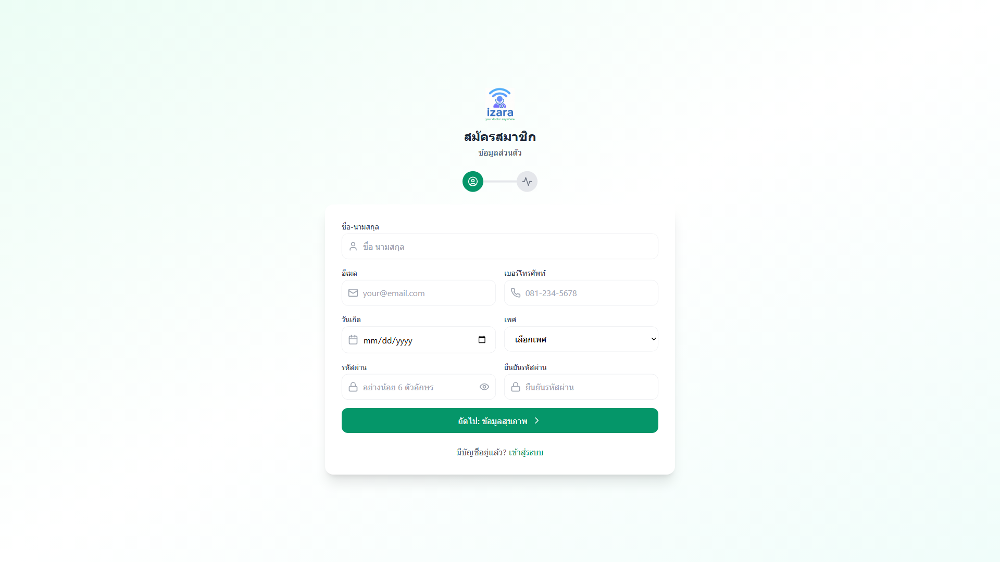
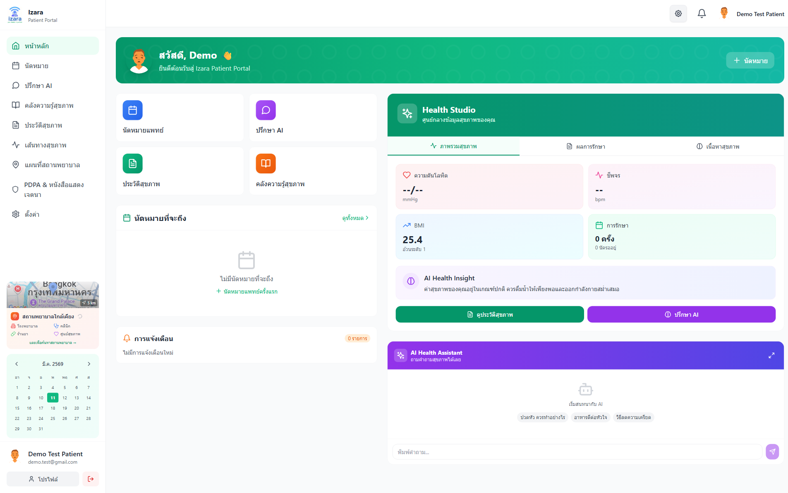
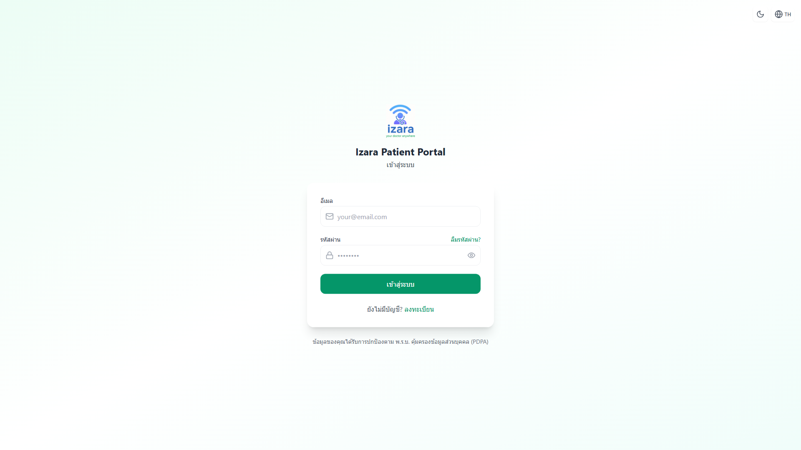
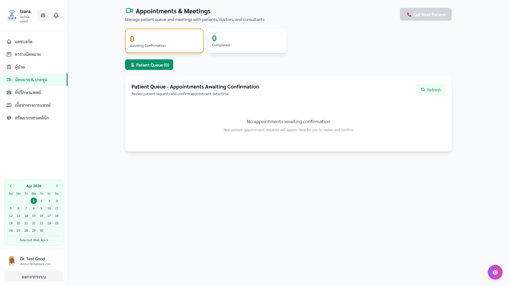
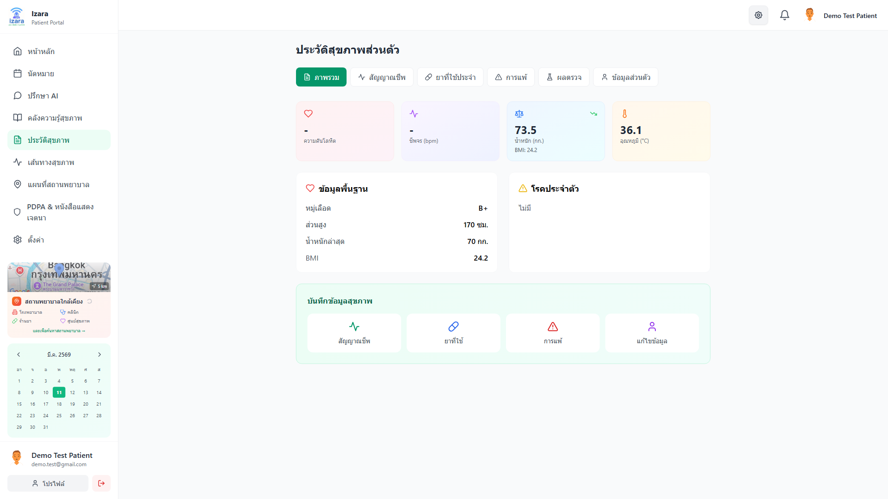
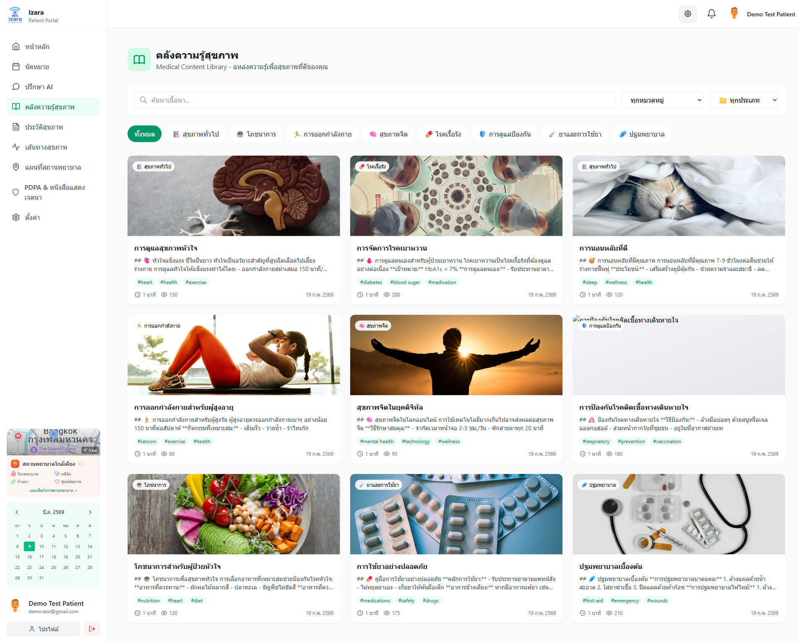
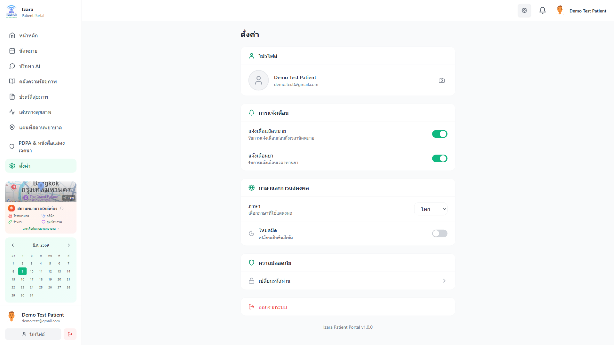

# คู่มือผู้ใช้งาน — Isara Anywhere (สำหรับผู้ป่วย)

> เวอร์ชัน 1.7.6 · ปรับปรุงล่าสุด พฤษภาคม 2569
>
> เอกสารฉบับนี้อธิบายการใช้งานแอปพลิเคชัน Isara Anywhere ฝั่งผู้ป่วยแบบทีละขั้นตอน ทั้งบนเว็บเบราว์เซอร์ (Cloud Run) และในเครือข่ายภายในโรงพยาบาล

---

## สารบัญ
1. การเข้าใช้งานครั้งแรก
2. การสมัครสมาชิก
3. การเข้าสู่ระบบด้วย Google (SSO)
4. หน้าแดชบอร์ดผู้ป่วย
5. การจองนัดหมาย
6. การเข้าห้องประชุมแพทย์ (Lobby + Jitsi)
7. ประวัติสุขภาพส่วนตัว (PHR)
8. ห้องสมุดความรู้สุขภาพและ AI Doctor
9. การตั้งค่าและความเป็นส่วนตัว (PDPA)
10. การติดต่อขอความช่วยเหลือ

---

## 1. การเข้าใช้งานครั้งแรก

เปิดเบราว์เซอร์ Google Chrome หรือ Microsoft Edge แล้วเข้า URL:

```
https://izara-patient-portal-dev-testing-hvht4obouq-as.a.run.app
```

ระบบจะแสดงหน้าเข้าสู่ระบบสำหรับผู้ป่วยอัตโนมัติ


หากเป็นการเข้าใช้ครั้งแรก ให้กดปุ่ม **"สมัครสมาชิก"** เพื่อสร้างบัญชีใหม่ หรือกด **"ลงชื่อเข้าใช้ด้วย Google"** หากมีบัญชี Gmail อยู่แล้ว

---

## 2. การสมัครสมาชิก

1. กดปุ่ม **"สมัครสมาชิก"** ที่หน้าเข้าสู่ระบบ
2. กรอกข้อมูลส่วนบุคคล: ชื่อ-นามสกุล, อีเมล, รหัสผ่าน (อย่างน้อย 8 ตัวอักษร), เบอร์โทรศัพท์
3. อ่านและยอมรับข้อตกลงตามพระราชบัญญัติคุ้มครองข้อมูลส่วนบุคคล (PDPA)
4. กดปุ่ม **"สร้างบัญชี"** ระบบจะส่งอีเมลยืนยันไปยังอีเมลที่ระบุ
5. คลิกลิงก์ในอีเมลเพื่อเปิดใช้บัญชี



> หมายเหตุ: หากไม่ได้รับอีเมลยืนยันภายใน 5 นาที ให้ตรวจสอบโฟลเดอร์สแปม (Junk Mail)

---

## 3. การเข้าสู่ระบบด้วย Google (SSO)

ระบบรองรับการเข้าสู่ระบบด้วยบัญชี Google (Single Sign-On) แบบ "เชื่อมโยงด้วยอีเมลที่ผ่านการยืนยัน"

1. ที่หน้าเข้าสู่ระบบ กดปุ่ม **"ลงชื่อเข้าใช้ด้วย Google"**
2. เลือกบัญชี Google ที่ต้องการใช้
3. อนุญาตให้แอป Isara Anywhere เข้าถึงข้อมูลพื้นฐาน (ชื่อ, อีเมล)
4. หากอีเมลตรงกับบัญชีผู้ป่วยที่มีอยู่แล้ว ระบบจะเชื่อมโยงและพาเข้าหน้าแดชบอร์ดทันที
5. หากเป็นอีเมลใหม่ ระบบจะสร้างบัญชีผู้ป่วยให้โดยอัตโนมัติ

> ข้อกำหนดด้านความปลอดภัย: ระบบจะรับเฉพาะบัญชี Google ที่อีเมลผ่านการยืนยัน (`email_verified = true`) เท่านั้น

---

## 4. หน้าแดชบอร์ดผู้ป่วย

หลังเข้าสู่ระบบสำเร็จ คุณจะเห็นหน้าแดชบอร์ดซึ่งแสดง:
- นัดหมายล่าสุด
- การแจ้งเตือนจากแพทย์/พยาบาล
- สรุปข้อมูลสุขภาพ (ความดัน, น้ำตาล, น้ำหนัก ฯลฯ)
- เมนูลัดไปยังหน้าจองนัด / ประวัติสุขภาพ / AI Doctor



เมนูด้านข้าง (Sidebar) ใช้สำหรับเลื่อนไประหว่างหน้าต่าง ๆ ของแอป

---

## 5. การจองนัดหมาย

1. คลิกเมนู **"นัดหมาย"** จากแถบด้านข้าง
2. กดปุ่ม **"จองนัดใหม่"**
3. เลือกประเภทการพบแพทย์ (แบบ Video Call / มาที่โรงพยาบาล)
4. เลือกแผนกและแพทย์ที่ต้องการ
5. เลือกวันและเวลาที่ว่าง (ปฏิทินจะแสดงช่วงเวลาที่แพทย์รับนัดได้)
6. ระบุอาการเบื้องต้น (สูงสุด 500 ตัวอักษร)
7. กดปุ่ม **"ยืนยันการจอง"**



หลังจองสำเร็จ:
- ระบบจะส่งอีเมลและการแจ้งเตือนเข้าแอปทันที
- แพทย์/พยาบาลจะเห็นนัดของคุณบน Doctor Portal แบบเรียลไทม์ (ภายใน 3 วินาที)
- สถานะเริ่มต้นคือ **"รอการยืนยัน (Pending)"** เมื่อแพทย์กดรับนัดจะเปลี่ยนเป็น **"ยืนยันแล้ว (Confirmed)"**

---

## 6. การเข้าห้องประชุมแพทย์

เมื่อถึงเวลานัด:

1. เปิดเมนู **"นัดหมาย"** เลือกนัดที่ต้องการเข้าประชุม
2. กดปุ่ม **"เข้าห้องประชุม"** — ระบบจะเปิดหน้า Lobby
3. อนุญาตให้เบราว์เซอร์ใช้กล้องและไมโครโฟน
4. รอแพทย์อนุมัติให้เข้าห้อง (สถานะ "Waiting for host")
5. เมื่อแพทย์อนุมัติ ระบบจะเข้าห้องประชุม Jitsi โดยอัตโนมัติ



ระหว่างประชุม คุณสามารถ:
- เปิด/ปิดกล้องและไมโครโฟน
- แชร์หน้าจอ (Screen Share)
- ส่งข้อความผ่านแชทในห้อง
- ส่งไฟล์ผลตรวจ/รูปภาพไปให้แพทย์

> หมายเหตุ: ห้องประชุมรองรับสูงสุด 4 คน (ผู้ป่วย + ผู้ดูแล + แพทย์ + ล่ามแพทย์)

---

## 7. ประวัติสุขภาพส่วนตัว (PHR)

เมนู **"ประวัติสุขภาพ"** แสดงข้อมูลสุขภาพของคุณทั้งหมด:
- ผลตรวจห้องปฏิบัติการ (Lab Results)
- ภาพถ่ายรังสี (Imaging)
- ใบสั่งยา (Prescriptions)
- สรุปการนัดประชุมที่ผ่านมา (Encounter Notes ที่แพทย์บันทึก)
- กราฟแนวโน้มสุขภาพ (Timeline)



ข้อมูลทั้งหมดเก็บใน PostgreSQL ที่เข้ารหัสและมีการบันทึก Audit Log ตามมาตรฐาน PDPA

---

## 8. ห้องสมุดความรู้สุขภาพและ AI Doctor

### ห้องสมุดความรู้สุขภาพ
- เลือกเมนู **"ห้องสมุด"** เพื่ออ่านบทความสุขภาพภาษาไทย
- ค้นหาตามอาการ, โรค, หรือยา



### AI Doctor (ผู้ช่วยตอบคำถามสุขภาพ)
- เลือกเมนู **"AI Doctor"**
- พิมพ์คำถามเป็นภาษาไทย เช่น "ปวดหัวข้างขวาเป็นอะไรได้บ้าง"
- ระบบ Gemini จะตอบกลับพร้อมแหล่งอ้างอิงจากห้องสมุด


> ข้อสำคัญ: คำตอบจาก AI Doctor ไม่ถือเป็นการวินิจฉัยทางการแพทย์ ใช้สำหรับเป็นข้อมูลเบื้องต้นเท่านั้น หากมีอาการรุนแรงให้ติดต่อแพทย์โดยตรง

---

## 9. การตั้งค่าและความเป็นส่วนตัว (PDPA)

เมนู **"การตั้งค่า"** ให้คุณ:
- แก้ไขข้อมูลส่วนตัว, รูปโปรไฟล์
- ตั้งรหัสผ่านใหม่
- เปิด/ปิดการแจ้งเตือน
- ดูประวัติการเข้าใช้งาน (Audit Log)



ในหน้า **"ความเป็นส่วนตัว (PDPA)"** คุณสามารถ:
- ขอสำเนาข้อมูลของคุณ (Right to Access)
- ขอแก้ไขข้อมูล (Right to Rectification)
- ขอลบบัญชี (Right to Erasure)
- เพิกถอนความยินยอม (Right to Withdraw Consent)

ทุกคำขอจะถูกบันทึกใน Audit Log และดำเนินการภายใน 30 วัน

---

## 10. การติดต่อขอความช่วยเหลือ

- ปุ่ม **"ช่วยเหลือ"** ที่มุมล่างขวาของทุกหน้า → ส่งข้อความถึงทีมสนับสนุน
- อีเมล: support@isara-anywhere.local
- เวลาทำการ: จันทร์-ศุกร์ 08:00–18:00 น.

> หากพบปัญหาวิกฤต (เข้าห้องประชุมไม่ได้, ข้อมูลหาย) ให้รีเฟรชหน้า, ออกจากระบบและเข้าใหม่, หรือล้างแคชเบราว์เซอร์เป็นลำดับแรก

---

*เอกสารฉบับนี้สร้างโดยอัตโนมัติจากผลการทดสอบ Playwright รอบที่ผ่านเกณฑ์ 100% เท่านั้น ภาพประกอบทุกภาพมาจากการทดสอบจริงในระบบ*
