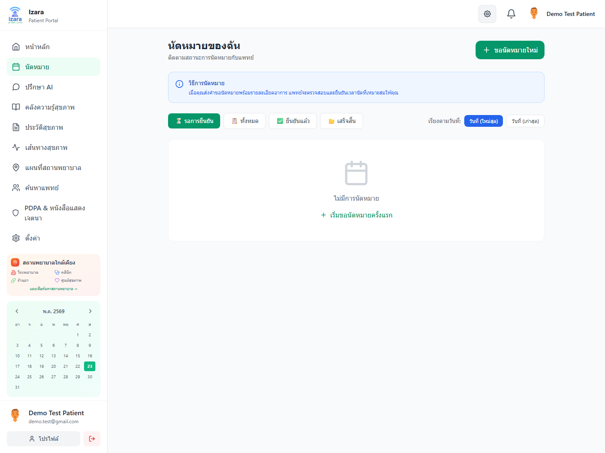
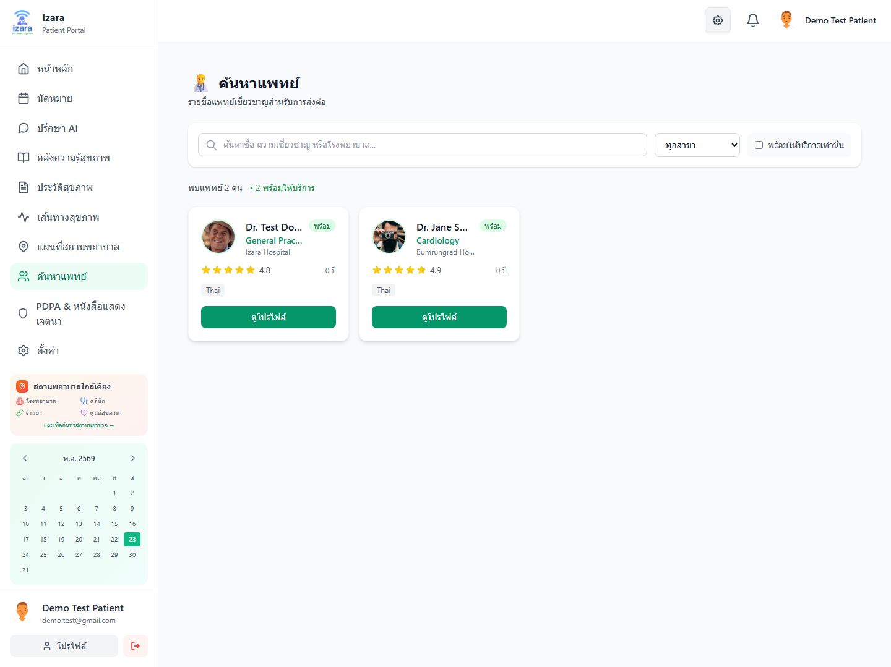
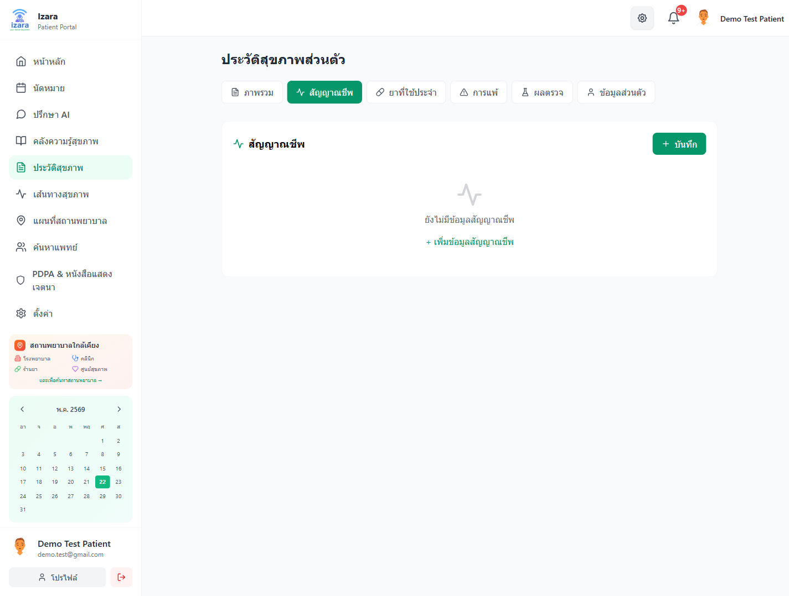

# คู่มือผู้ใช้งาน — Isara Anywhere (ฝั่งผู้ป่วย)

> เวอร์ชัน **1.7.21** · อัปเดต 22 พฤษภาคม 2569  
> **Word:** [USER_GUIDE_PATIENT_WORD_TH.docx](USER_GUIDE_PATIENT_WORD_TH.docx) — แบบอักษร **TH Sarabun New 16 pt** (มาตรฐานรายงานภาษาไทย)  
> **PowerPoint:** [USER_GUIDE_PATIENT_PPT_TH.pptx](USER_GUIDE_PATIENT_PPT_TH.pptx) — แบบอักษร **FC Iconic**  
> สร้างด้วย `python scripts/build-portal-user-guides.py` · อ้างอิง `Processes/` และภาพ UI test 76 รายการ

---

## หมายเหตุการตรวจสอบล่าสุด (22 พ.ค. 2569)

- ยืนยันการทำงานแบบต่อเนื่องของเส้นทางผู้ป่วย: ล็อกอิน, จองนัด, ติดตามสถานะ, เข้าห้องประชุม, PHR, PDPA, AI Doctor, แผนที่ และค้นหาแพทย์
- การเข้าห้องประชุมของผู้ป่วยอาจแสดงสถานะ "waiting" หรือ "admitted" ตามนโยบายลอบบี้ของระบบในขณะนั้น ทั้งสองสถานะเป็นพฤติกรรมที่รองรับ
- ภาพในโฟลเดอร์ `docs/screenshots/group-D`, `docs/screenshots/group-E`, `docs/screenshots/group-F`, และ `docs/screenshots/sso` ใช้เป็นภาพอ้างอิงหลักของคู่มือนี้
- Vitest **2597/2597** · Playwright cloud **79/79** ทุกกลุ่ม A–P ผ่าน (headed, 8.3 นาที, 22 พ.ค. 2569) · คู่มือ Word/PPT อัปเดตจาก `docs/screenshots/` (76 ภาพผู้ป่วย)
- การเข้าห้องประชุม: `/meeting/:id` หรือ `/guest-join/:id` — ไม่ต้องล็อกอิน Jitsi แยก · รอแพทย์ Admit จาก Lobby

---

## สารบัญ

1. [เข้าใช้งานและแดชบอร์ด](#1-เข้าใช้งานและแดชบอร์ด)
2. [เข้าสู่ระบบด้วย Google](#2-เข้าสู่ระบบด้วย-google)
3. [จองนัดหมายออนไลน์](#3-จองนัดหมายออนไลน์)
4. [ดูและติดตามนัดหมาย](#4-ดูและติดตามนัดหมาย)
5. [เข้าห้องปรึกษาทางวิดีโอ](#5-เข้าห้องปรึกษาทางวิดีโอ)
6. [ประวัติสุขภาพส่วนตัว (PHR)](#6-ประวัติสุขภาพส่วนตัว-phr)
7. [คำถามที่พบบ่อย](#7-คำถามที่พบบ่อย)

---

## 1. เข้าใช้งานและแดชบอร์ด

### 1.1 เปิดแอปพลิเคชัน

1. เปิดเบราว์เซอร์ **Google Chrome** หรือ **Microsoft Edge**
2. ไปที่ที่อยู่:

   `https://izara-patient-portal-dev-testing-724889190329.asia-southeast1.run.app`

3. หากยังไม่เคยเข้าใช้ ให้กรอก **อีเมล** และ **รหัสผ่าน** แล้วกด **เข้าสู่ระบบ**  
   หากยังไม่มีบัญชี ให้กด **สมัครสมาชิก** ตามขั้นตอนบนหน้าจอ

### 1.2 หน้าแดชบอร์ดหลัก

หลังเข้าสู่ระบบสำเร็จ คุณจะเห็นหน้าแดชบอร์ดพร้อมเมนูด้านซ้าย

**เมนูหลัก (แถบด้านซ้าย):**

| เมนู | การใช้งาน |
|------|-----------|
| หน้าหลัก | สรุปนัดหมายและข้อมูลสุขภาพ |
| นัดหมาย | จองและดูสถานะนัด |
| ปรึกษา AI | คุยกับผู้ช่วย AI ด้านสุขภาพ |
| คลังความรู้สุขภาพ | บทความและเนื้อหาแนะนำ |
| ประวัติสุขภาพ | บันทึกค่าสุขภาพ (PHR) |
| เส้นทางสุขภาพ | ไทม์ไลน์การรักษา |
| แผนที่สถานพยาบาล | ค้นหาสถานพยาบาลใกล้คุณ |
| ค้นหาแพทย์ | ดูรายชื่อแพทย์ |
| PDPA & หนังสือแสดงเจตนา | ความยินยอมข้อมูลส่วนบุคคล |
| ตั้งค่า | โปรไฟล์และการแจ้งเตือน |

---

## 2. เข้าสู่ระบบด้วย Google

ระบบรองรับ **ลงชื่อเข้าใช้ด้วย Google** สำหรับบัญชีที่สมัครด้วยอีเมลเดียวกันแล้ว

### ขั้นตอน

1. ที่หน้าเข้าสู่ระบบ รอให้ปุ่ม **ลงชื่อเข้าใช้ด้วย Google** แสดง
2. กดปุ่ม Google แล้วเลือกบัญชี Gmail
3. อนุญาตให้แอปใช้ชื่อและอีเมล

### กรณีอีเมล Google ยังไม่มีบัญชีในระบบ

ระบบจะพาไปหน้าสมัครสมาชิกพร้อมข้อความแจ้งให้ลงทะเบียนก่อน

> **หมายเหตุ:** ต้องสมัครและตั้งรหัสผ่านด้วยอีเมลนั้นก่อน จึงจะใช้ Google เข้าได้ในครั้งถัดไป

---

## 3. จองนัดหมายออนไลน์

### 3.1 เปิดรายการนัดหมาย

1. คลิกเมนู **นัดหมาย** ที่แถบด้านซ้าย
2. คุณจะเห็นรายการนัดและแท็บกรองสถานะ (เช่น ทั้งหมด / รอดำเนินการ / เสร็จสิ้น)

### 3.2 เริ่มจองนัดใหม่

1. กดปุ่ม **จองนัดหมาย** หรือ **นัดหมายใหม่**
2. ระบบเปิดตัวช่วยจอง (Wizard) ทีละขั้น

### 3.3 กรอกอาการและข้อมูลเบื้องต้น

1. กรอก **อาการ** หรือเหตุผลที่ต้องการพบแพทย์
2. ระบุความรุนแรง / ระยะเวลาที่มีอาการ (ตามแบบฟอร์มบนหน้าจอ)
3. กด **ถัดไป**

### 3.4 เลือกแพทย์และยืนยันการจอง

1. เลือกแพทย์จากรายการที่ว่าง (หรือปล่อยให้ระบบจัดสรรผ่านคิวกลาง)
2. ตรวจสอบสรุปก่อนส่ง

3. กด **ยืนยันการจอง** — ระบบสร้างนัดหมายและแสดงในคิว **in_pool** (รอเจ้าหน้าที่หรือแอดมินมอบหมายแพทย์)

> **สำคัญ:** นัดที่จองผ่านคิวกลางจะยังไม่มีแพทย์ประจำจนกว่า **ผู้ดูแลระบบ (Admin)** จะมอบหมายแพทย์ให้ — จากนั้นสถานะจะเปลี่ยนเป็นรอแพทย์ยืนยัน

---

## 4. ดูและติดตามนัดหมาย

หลัง Admin มอบหมายแพทย์แล้ว คุณจะเห็นนัดในสถานะ **รอแพทย์ตอบรับ** หรือ **พร้อมเข้าพบ**

- เปิดเมนู **นัดหมาย** เพื่อดูรายละเอียดและปุ่ม **เข้าห้องประชุม** (เมื่อถึงเวลานัด)
- ข้อมูลนัดจะซิงค์กับระบบแพทย์โดยอัตโนมัติ (ทดสอบข้ามพอร์ทัลผ่านกลุ่ม D)

---

## 5. เข้าห้องปรึกษาทางวิดีโอ

### 5.1 ก่อนเข้าห้อง

1. ไปที่ **นัดหมาย** แล้วเลือกนัดที่พร้อมเข้าพบ
2. กด **เข้าห้องประชุม** หรือเปิดลิงก์ `/meeting/{รหัสนัด}`
3. อนุญาต **กล้อง** และ **ไมโครโฟน** เมื่อเบราว์เซอร์ถาม

### 5.2 ยอมรับข้อตกลงและเข้าร่วม

1. อ่าน **ข้อตกลงก่อนเข้าประชุม** (บันทึกวิดีโอ / ถอดเสียง / การใช้ข้อมูลตาม PDPA)
2. ติ๊กยินยอมครบทุกข้อ แล้วกด **ยอมรับและดำเนินการต่อ**
3. ตรวจสอบกล้อง-ไมค์บนหน้าจอก่อนเข้า แล้วกด **เข้าร่วมการประชุม**
4. ชื่อที่แสดงใน Jitsi มาจากโปรไฟล์ Izara โดยอัตโนมัติ — **ไม่ต้องพิมพ์ชื่อเอง**

### 5.3 ระหว่างและหลังการปรึกษา

- หากแพทย์เปิด Lobby คุณอาจต้องรอให้แพทย์ **อนุมัติเข้าห้อง** ก่อนเห็นภาพเต็ม
- เมื่อจบการปรึกษา กด **วางสาย** ในแถบ Jitsi แล้วกลับไปหน้านัดหมาย
- สรุปผลการตรวจ (ถ้ามี) จะแสดงเมื่อแพทย์อนุมัติแล้ว

---

## 6. ประวัติสุขภาพส่วนตัว (PHR)

### 6.1 เปิดหน้า PHR

1. คลิกเมนู **ประวัติสุขภาพ** ที่แถบด้านซ้าย

### 6.2 สลับแท็บข้อมูล

ใช้แท็บด้านบนเพื่อดู:

- สัญญาณชีพ (Vitals)
- ยาที่ใช้ (Medications)
- แพ้ยา (Allergies)
- ผลแล็บ (Lab Results)

### 6.3 บันทึกค่าสัญญาณชีพ

1. อยู่ที่แท็บ **สัญญาณชีพ**
2. กด **เพิ่ม / บันทึกค่าใหม่**
3. กรอกค่า เช่น ความดัน ชีพจร อุณหภูมิ น้ำหนัก (ตามฟอร์ม)
4. กด **บันทึก**

### 6.4 แท็บอื่น ๆ

---

## 7. คำถามที่พบบ่อย

**ถาม:** จองแล้วทำไมยังไม่มีแพทย์?  
**ตอบ:** นัดใหม่อาจอยู่ในคิวกลาง — รอ Admin มอบหมายแพทย์ก่อน

**ถาม:** เข้าห้องประชุมไม่ได้ / ค้างโหลด  
**ตอบ:** ตรวจสอบการอนุญาตกล้อง-ไมค์ รีเฟรชหน้า หรือใช้ Chrome ล่าสุด

**ถาม:** ใช้ Google เข้าไม่ได้  
**ตอบ:** ต้องสมัครด้วยอีเมล Gmail เดียวกันและตั้งรหัสผ่านก่อน

**ถาม:** ขึ้นว่า Google ไม่ตรงกับบัญชีที่เชื่อมไว้ (`GOOGLE_ACCOUNT_MISMATCH`)  
**ตอบ:** บัญชีนี้เคยผูกกับ Google คนละรายกับที่เลือกตอนนี้ — ให้เข้าด้วยบัญชี Google เดิม หรือเข้าสู่ระบบด้วยรหัสผ่านแทน แล้วติดต่อผู้ดูแลหากต้องการเปลี่ยนการผูกบัญชี

---

*เอกสารนี้จัดทำจากผลการทดสอบอัตโนมัติบน Cloud Run — Izara Anywhere · โครงการ Izara Telemedicine*
