# 📖 IZARA Telemedicine — คู่มือการใช้งานฉบับสมบูรณ์

**เวอร์ชัน 1.6.0** | **อัปเดตล่าสุด: 1 เมษายน 2569**

> คู่มือฉบับสมบูรณ์สำหรับผู้ป่วย แพทย์ และผู้ดูแลระบบ
> ทดสอบอัตโนมัติ 2,018 รายการ (Unit Tests) + ทดสอบ E2E 143 รายการผ่านทั้งหมด | ภาพถ่ายหน้าจอ 103 ภาพ

---


## 📑 สารบัญ

1. [เริ่มต้นการใช้งาน](#1-เริ่มต้นการใช้งาน)
2. [ระบบผู้ป่วย (ผู้ป่วย Portal)](#2-ระบบผู้ป่วย-patient-portal)
3. [ระบบแพทย์ (แพทย์ Portal)](#3-ระบบแพทย์-doctor-portal)
4. [ระบบผู้ดูแลระบบ](#4-ระบบผู้ดูแลระบบ)
5. [กระบวนการให้คำปรึกษาทางไกล](#5-กระบวนการให้คำปรึกษาทางไกล)
6. [กระบวนการลงทะเบียนแพทย์ใหม่](#6-กระบวนการลงทะเบียนแพทย์ใหม่)
7. [ระบบวิดีโอประชุม](#7-ระบบวิดีโอประชุม)
8. [ฟีเจอร์ AI (Gemini)](#8-ฟีเจอร์-ai-gemini)
9. [ระบบบันทึกและถอดเสียง](#9-ระบบบันทึกและถอดเสียง)
10. [ระบบแจ้งเตือน](#10-ระบบแจ้งเตือน)
11. [การจัดการเนื้อหา](#11-การจัดการเนื้อหา)
12. [ความปลอดภัยและ PDPA](#12-ความปลอดภัยและ-pdpa)
13. [คำถามที่พบบ่อย](#13-คำถามที่พบบ่อย)

---


## 1. เริ่มต้นการใช้งาน


### 1.1 ภาพรวมระบบ

IZARA Telemedicine consists of 3 main systems:

| System | URL | For |
| --------|-----|----- |
| **ผู้ป่วย Portal** | `patient-portal.run.app` | ผู้ป่วยs — book appointments, view PHR, consult AI |
| **แพทย์ Portal** | `doctor-portal.run.app` | แพทย์s + ผู้ดูแลs — manage appointments, EMR, prescriptions |
| **Meeting Server** | `meeting-server.run.app` | Jitsi video meeting + Socket.IO server |


**Technology Stack:** React + TypeScript, Node.js, PostgreSQL, Jitsi Meet, Gemini AI 2.5 Flash, Google Cloud Run

---


### 1.2 การลงทะเบียนผู้ป่วย

New patients can self-register through the ผู้ป่วย Portal.


## ขั้นตอน:
1. เปิด URL ของระบบผู้ป่วย
2. คลิก **"ลงทะเบียน" (Register)**
3. Fill in: Full Name, Email, Password, Phone, Basic Health Profile
4. คลิก **"ลงทะเบียน" (Submit)** → redirected to Dashboard immediately

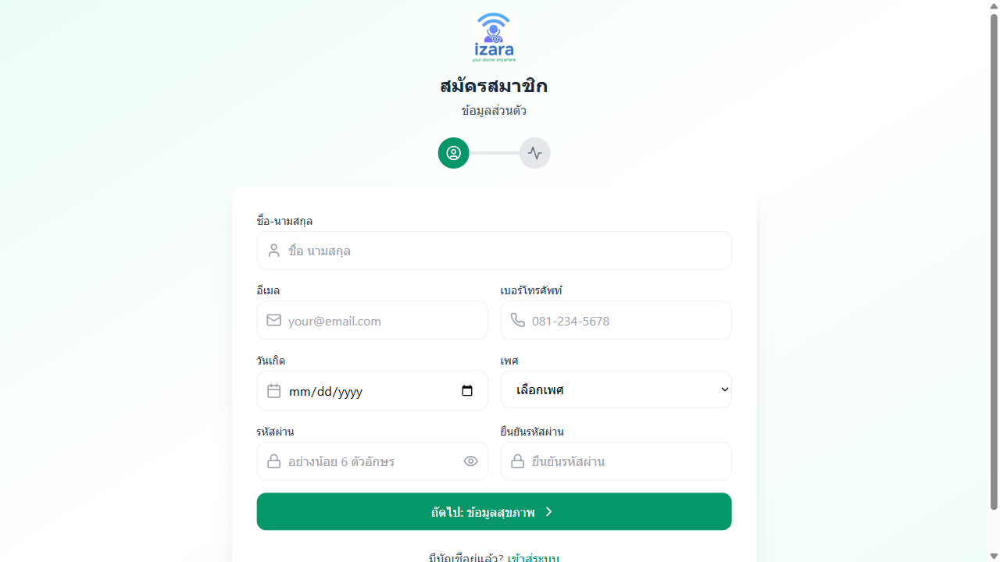


> 📌 **Tip:** After registration, fill in your health profile (allergies, medications, chronic conditions) in the PHR section for better AI-assisted consultations.

---


### 1.3 เข้าสู่ระบบผู้ป่วย

1. Open the ผู้ป่วย Portal
2. กรอก **อีเมล** และ **รหัสผ่าน**
3. คลิก **"เข้าสู่ระบบ" (Login)** → redirected to Dashboard


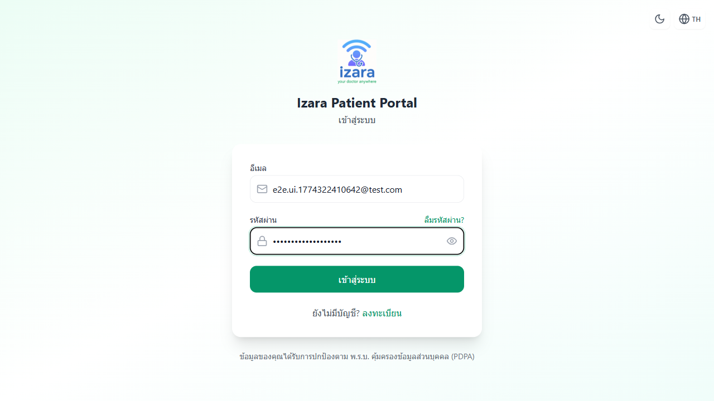

> 🔑 Sessions expire in 30 minutes. Re-login required after expiration.

---


### 1.4 เข้าสู่ระบบแพทย์

แพทย์s and ผู้ดูแลs log in through the แพทย์ Portal.

1. Open the แพทย์ Portal URL
2. กรอก **อีเมล** และ **รหัสผ่าน**
3. คลิก **"Sign In to Portal"**


> ⚠️ New doctors must be **approved by an admin** before they can log in. See [Section 6](#6-doctor-onboarding-workflow).

---


### 1.5 รีเซ็ตรหัสผ่าน

1. คลิก **"ลืมรหัสผ่าน?" (Forgot Password?)** on the login page
2. Enter your registered email
3. System sends a password reset link → click it → set new password

> 📧 Reset link expires in 15 minutes.

---


### 1.6 การควบคุมสิทธิ์ตามบทบาท (RBAC)

| บทบาท | Access |
| ------|-------- |
| **ผู้ป่วย** | Full ผู้ป่วย Portal — appointments, PHR, AI แพทย์ |
| **แพทย์** | แพทย์ Portal — appointments, EMR, prescriptions, meetings |
| **ผู้ดูแล** | แพทย์ Portal + ผู้ดูแล menu — doctor management, content approval |


> 🔒 ผู้ป่วยs cannot access the แพทย์ Portal (API returns 401). JWT + role verification on every request.

---


## 2. ระบบผู้ป่วย (ผู้ป่วย Portal)


### 2.1 หน้าหลัก (Dashboard)

The main page shows a comprehensive health overview:


- **Quick การดำเนินการ:** Book appointment, AI consultation, health records, health library

- **Health Studio:** Vital signs overview (blood pressure, heart rate, BMI, treatments)

- **AI Health Insight:** Personalized recommendations based on your PHR

- **Upcoming Appointments:** Latest appointments with view-all button

- **Healthcare Map:** Nearby facilities shown at the bottom

- **Notification Bell:** Top-right corner

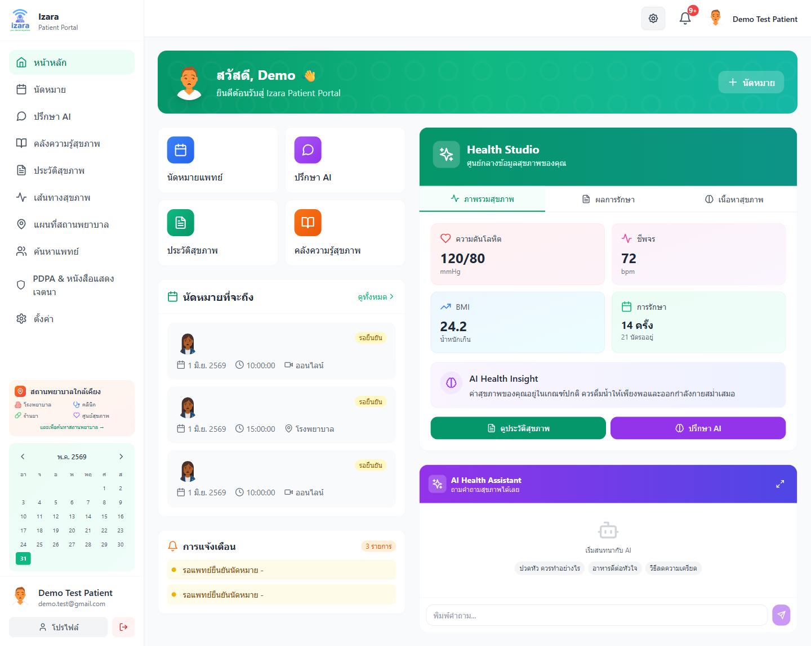
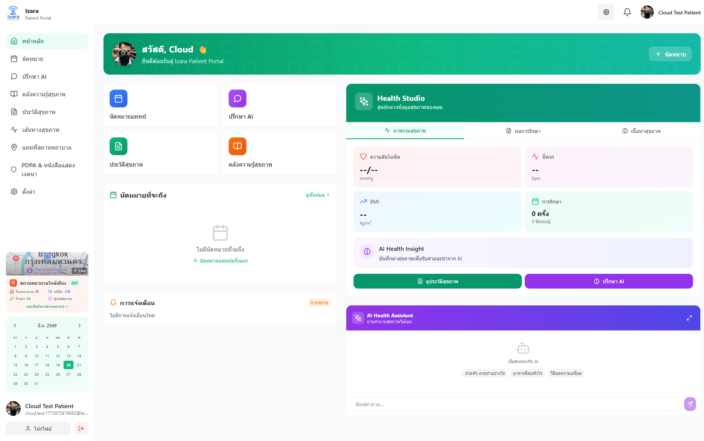
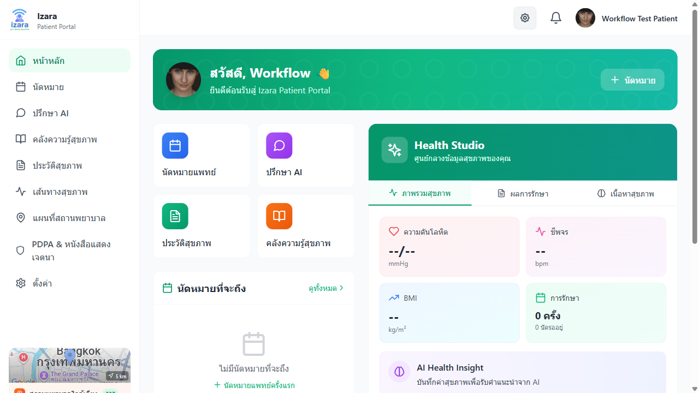

---


### 2.2 การนัดหมายแพทย์


#### 2.2.1 View Appointments

คลิก **"นัดหมาย" (Appointments)** in the sidebar.


## สถานะ Filters:

- **Pending** — Request sent, awaiting doctor review

- **All** — All statuses

- **Confirmed** — แพทย์ confirmed, meeting link ready

- **Completed** — Consultation done, view summary/EMR

**Sort:** By date (newest or oldest first)


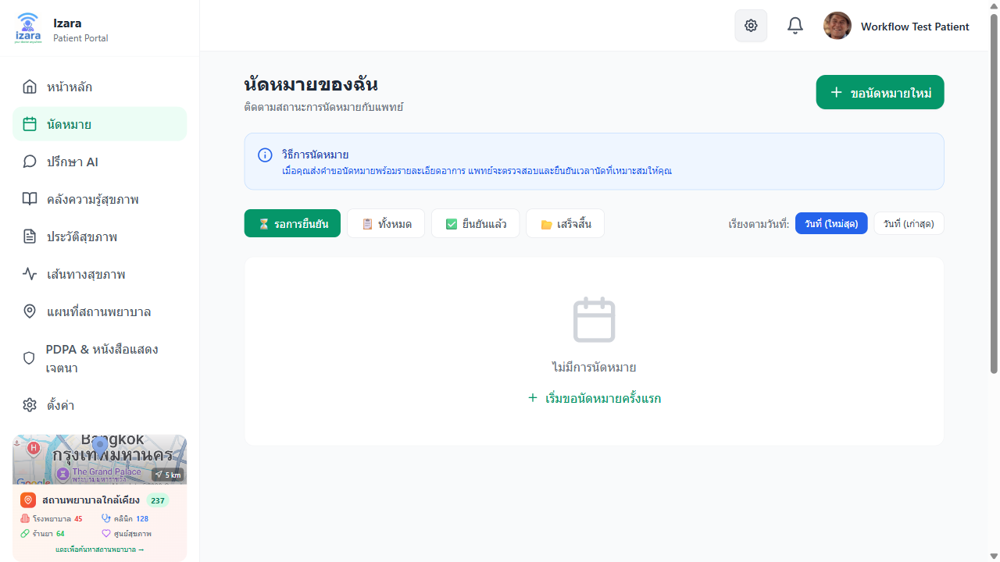


#### 2.2.2 Book New Appointment

คลิก **"+ ขอนัดหมายใหม่" (Book New Appointment)** for a 3-step booking process:


## Step 1 — Symptoms (Voice/Image):

- Select main symptoms: headache, fever, cough, sore throat, nausea, etc.

- Describe symptoms in detail (text / voice recording / image attachment)

- AI auto-analyzes urgency level

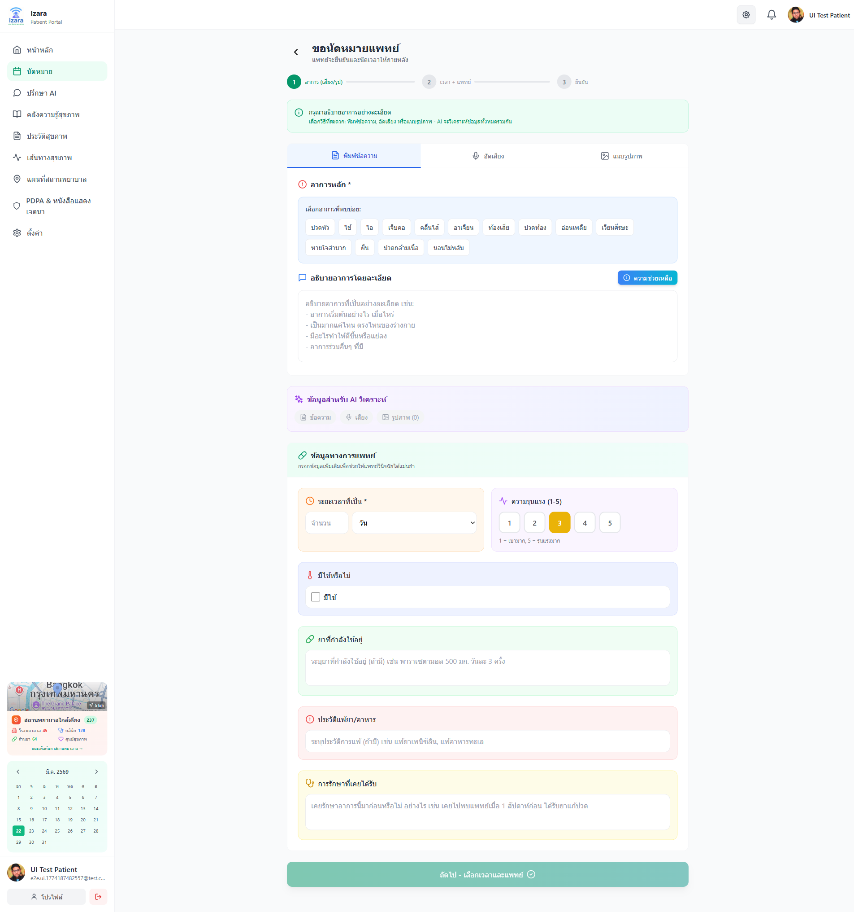
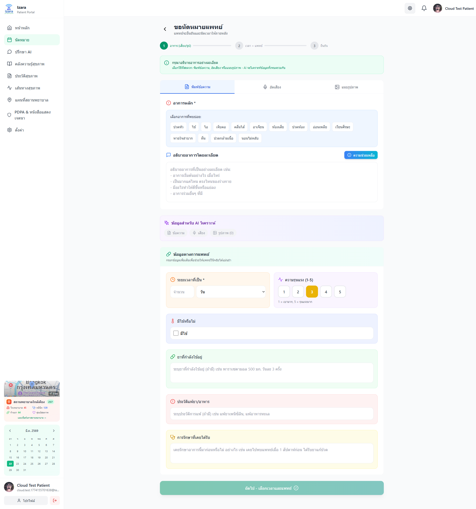


## Step 2 — Time + แพทย์:

- Select doctor or let AI auto-match by specialty

- Choose date/time (calendar) + type (online / in-person)

- Invite relatives/external participants via email (optional)


## Step 3 — Confirm:

- Review all details → click **"ยืนยัน" (Confirm)**

- สถานะ becomes **"Pending"** → doctor receives notification immediately

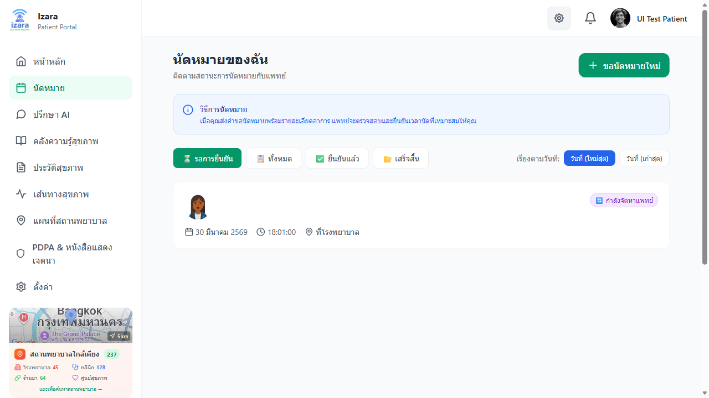
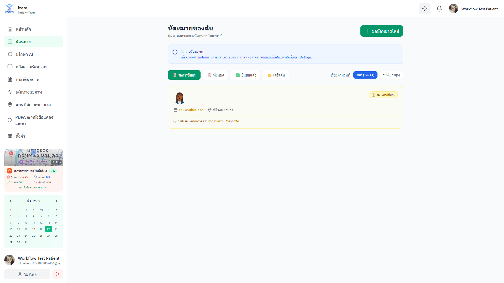


#### 2.2.3 Appointment Details

คลิก an appointment card to view:

- Current status (color + icon)

- แพทย์ photo, name

- Date, time, location

- Reported symptoms (tags)

- **"เข้าร่วมการประชุม" (Join Meeting)** button (when confirmed)

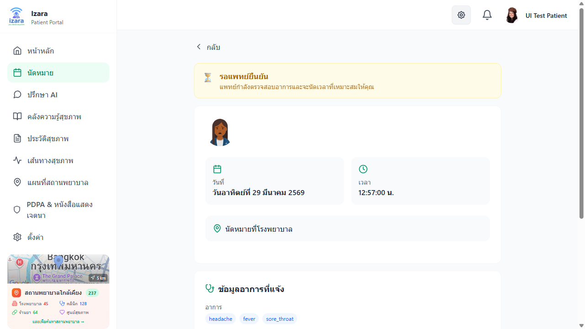
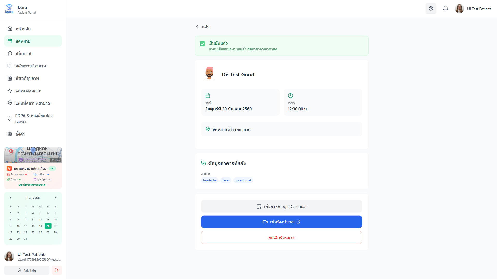

---


### 2.3 วงจรสถานะการนัดหมาย

```
📝 ผู้ป่วย Books → ⏳ Pending → 👨‍⚕️ แพทย์ Reviews → ✅ Confirmed → 📹 Meeting → ✔️ Completed
```

| สถานะ | ไทย | สี | รายละเอียด |
| --------|------|-------|------------- |
| **Pending** | รอดำเนินการ | 🟡 Yellow | Request sent, awaiting doctor review |
| **Finding แพทย์** | กำลังจัดหาแพทย์ | 🟠 Orange | ผู้ดูแล matching a doctor |
| **Assigned** | มอบหมายแล้ว | 🔵 Blue | ผู้ดูแล assigned to a doctor |
| **Confirmed** | ยืนยันแล้ว | 🟢 Green | แพทย์ confirmed — meeting link ready |
| **In Progress** | กำลังดำเนินการ | 🔴 Red | Video meeting active |
| **Completed** | เสร็จสิ้น | ⚪ Gray | Consultation done, EMR available |
| **Cancelled** | ยกเลิก | ⬛ Black | Cancelled by patient or doctor |


When **Confirmed** → notification + video link + **"Join Meeting"** button


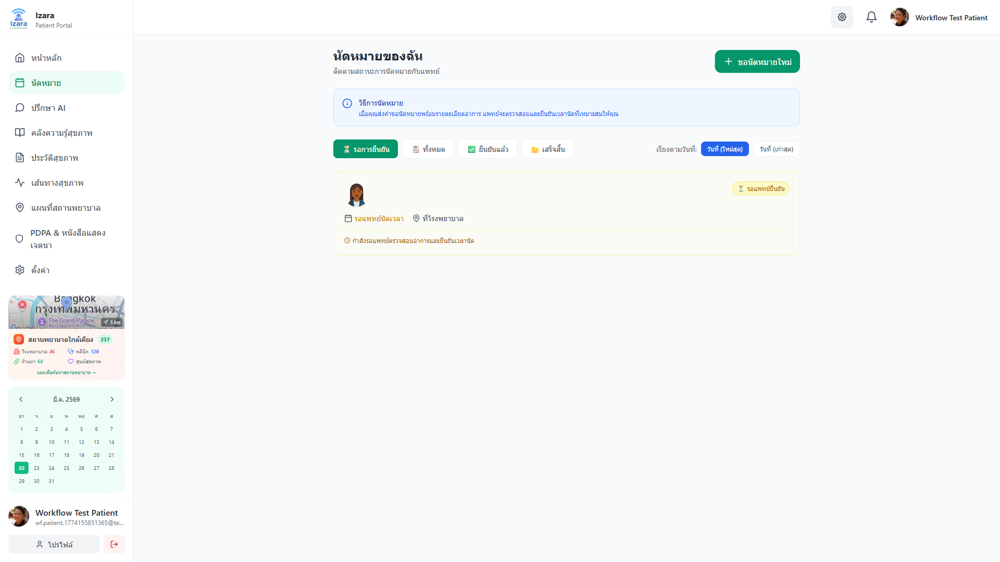

---


### 2.4 เข้าร่วมวิดีโอคอล

**Step 1: Accept Agreement** — 3 consent items:

- ☑️ Video recording consent (for medical purposes)

- ☑️ Transcription consent (for medical records)

- ☑️ Data sharing consent (per PDPA)

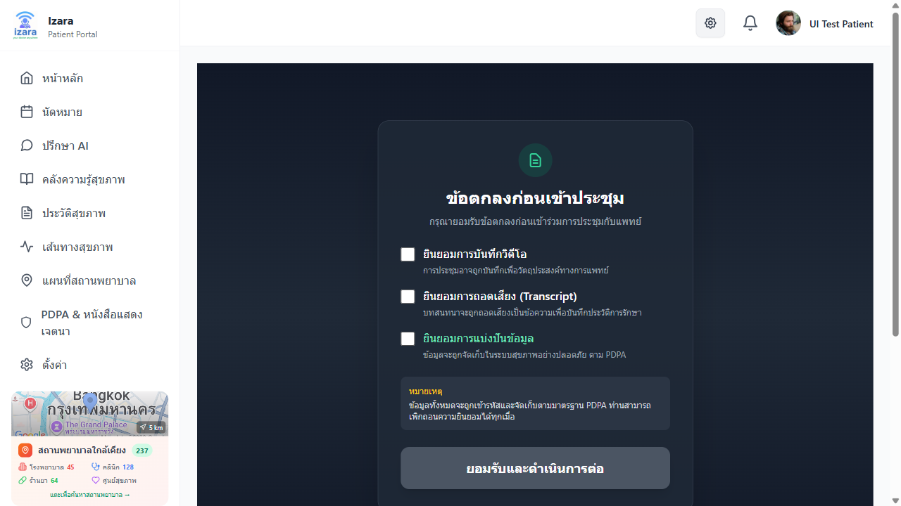

**Step 2: Pre-Join Screen** — Microsoft Teams style:

- Test camera/microphone (shows OK status)

- View participant info (doctor name, role)

- View invite link for family/caregivers

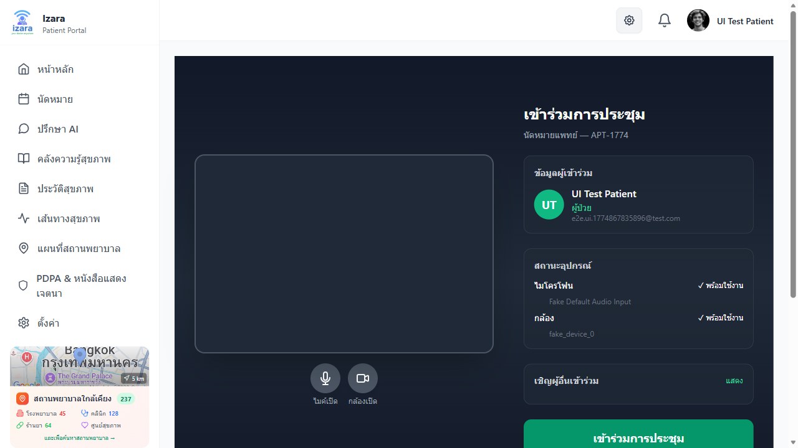

**Step 3: Enter Meeting Room** — คลิก **"เข้าร่วม" (Join)** → enter Lobby, wait for doctor approval

- 🎥 Camera ON/OFF

- 🎤 Microphone ON/OFF

- 💬 Text chat (Socket.IO)

- 📱 Screen sharing

- ⌛ Wait in Lobby with timer

**Step 4: Post-Meeting** — AI auto-generates consultation summary → view in PHR + Timeline

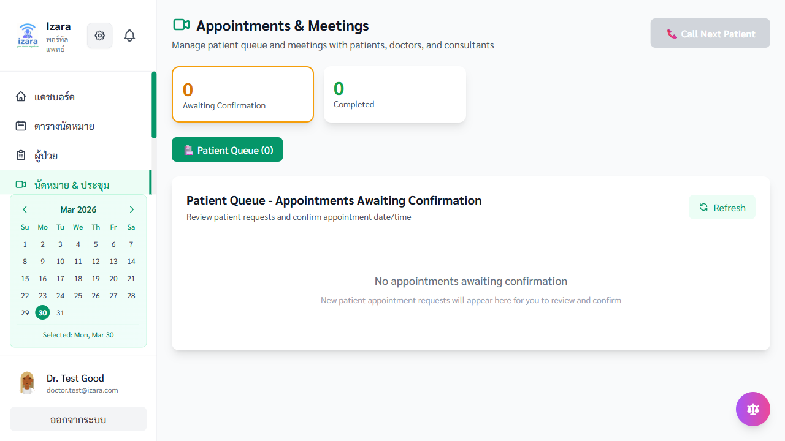

---


### 2.5 เชิญผู้เข้าร่วม (แบบ Microsoft Teams)

ผู้ป่วยs can invite **family, friends, or external participants** — guests **do not need an account**.


## How Guests Join:
1. **Receive invite link** from patient — URL: `/guest-join/:meetingId`
2. **Enter name** on Guest Join page (no login, no email required)
3. **คลิก "ขอเข้าร่วม" (Request to Join)** → doctor notified instantly (Socket.IO)
4. **Wait for approval** — waiting screen with timer displayed
5. **Enter meeting** — when doctor clicks "Admit", Jitsi video call opens
6. **If rejected** — red screen: "แพทย์ไม่อนุญาตให้เข้าร่วม" + back button


## For the แพทย์ (Host):

- **Waiting Room** panel shows all pending participants

- คลิก **"อนุญาต" (✓ Admit)** or **"ปฏิเสธ" (✗ Reject)** per person

- ผู้ดูแล users also join through Lobby — แพทย์ต้องอนุมัติ

---


### 2.6 ประวัติสุขภาพ (PHR)

คลิก **"ประวัติสุขภาพ" (PHR)** in the sidebar. 7 tabs:

| แท็บ | ไทย | Content |
| -----|------|--------- |
| **Overview** | ภาพรวม | Latest vitals, meds, allergies, chronic conditions |
| **Vital Signs** | สัญญาณชีพ | Blood pressure, heart rate, temperature, weight, glucose, O₂ — trend graphs |
| **Medications** | ยาที่ใช้ | Drug name, dosage, frequency, status (active/stopped) |
| **Allergies** | การแพ้ | Allergens, type, severity, symptoms — auto-alerts on prescriptions |
| **Lab & Imaging** | ผลแลป/ภาพถ่าย | Lab results, X-ray, CT, MRI — AI analysis available |
| **Profile** | ข้อมูลส่วนตัว | Height, weight, blood type, DOB |
| **Lifestyle** | วิถีชีวิต | Diet, exercise, sleep, smoking, alcohol — AI recommendations |


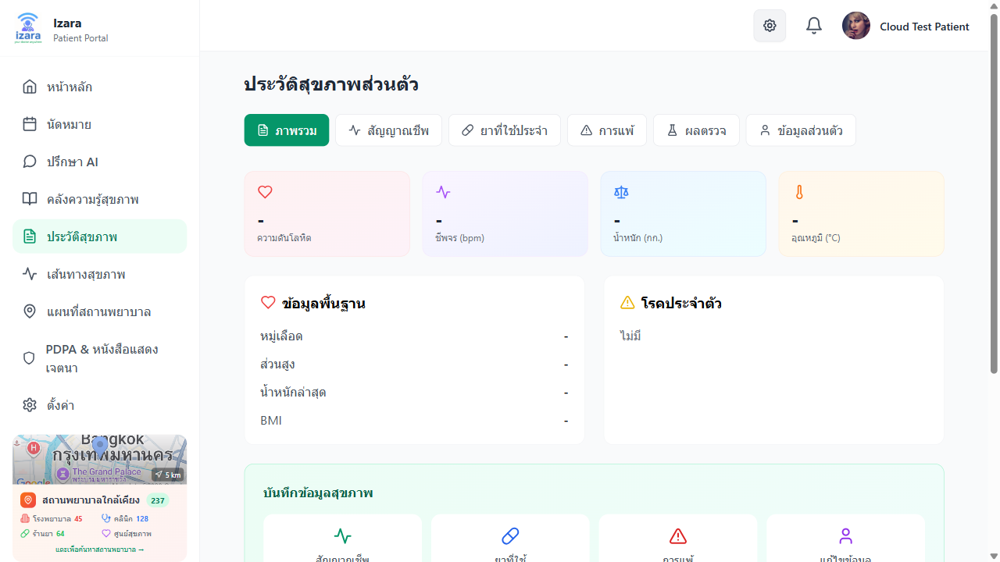
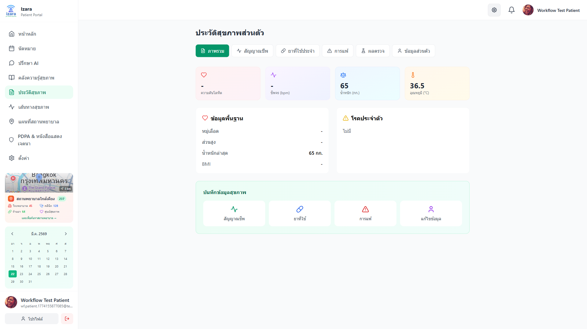
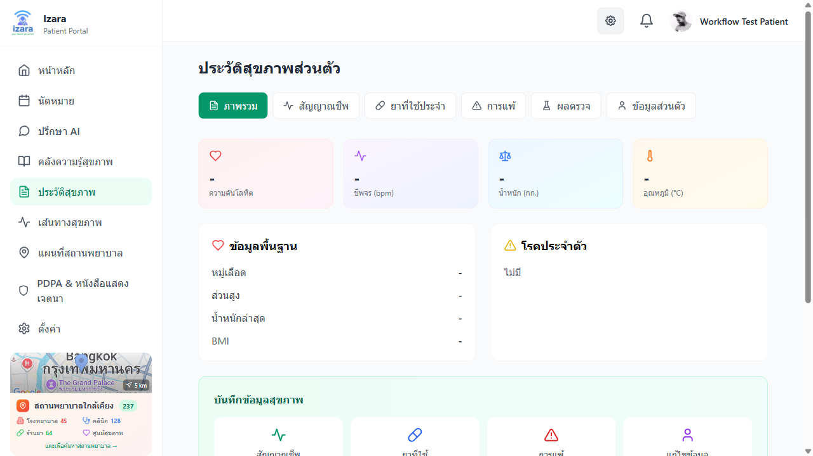

**Adding Data:** Select tab → click **"เพิ่ม" (Add)** → fill values → click **"บันทึก" (Save)**

**Lab Reports from แพทย์:** When doctors order and record results, they appear in the Lab & Imaging tab automatically.


---


### 2.7 ไทม์ไลน์สุขภาพ

คลิก **"เส้นทางสุขภาพ" (Timeline)** for chronological medical events:


- 📅 Appointment dates + status

- 💊 Medication changes

- 🔬 Lab results received

- 📝 EMR entries from doctors

- 🩺 Diagnosis records

- 🏥 Video consultation summaries

- 📋 PHR updates

**Filter:** By event type + date range. คลิก cards to expand details.

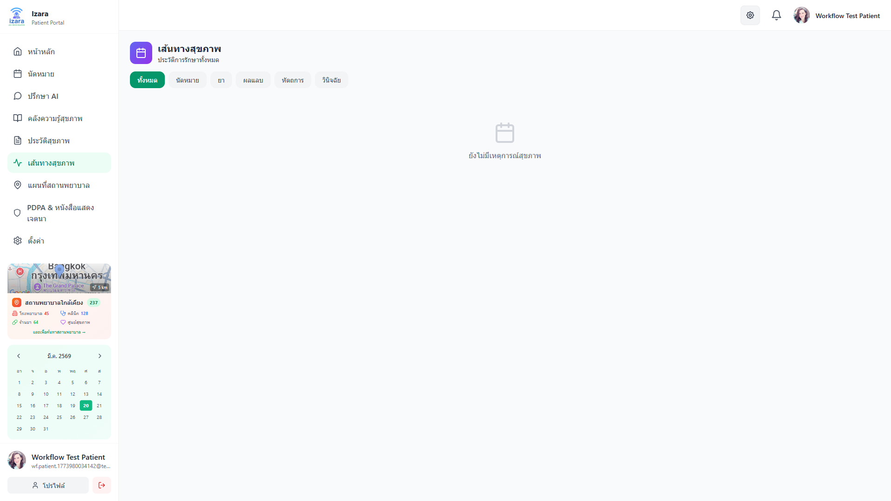
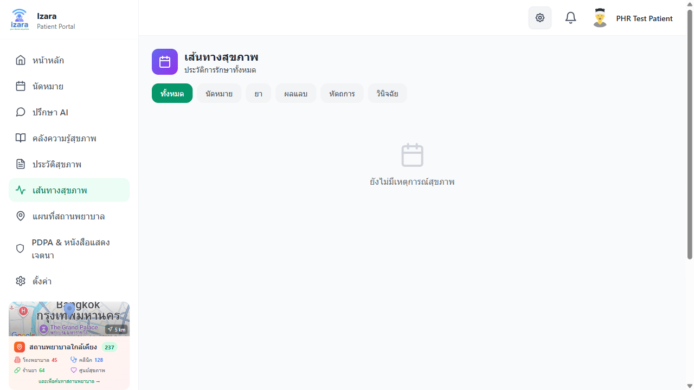

---


### 2.8 ปรึกษาหมอ AI

แชทกับ Gemini AI สำหรับคำแนะนำสุขภาพทั่วไป:

1. คลิก **"ปรึกษา AI" (AI แพทย์)** in the sidebar
2. Type health questions (ไทย or English)
3. AI responds with advice — multi-turn conversation supported
4. AI references your PHR data for personalized answers
5. Save sessions or browse past sessions


## Example Questions:

- "ปวดหัวบ่อย ๆ ควรทำอย่างไร" (Frequent headaches — what should I do?)

- "ยา Paracetamol กินกับ Ibuprofen ได้ไหม" (Can I take Paracetamol with Ibuprofen?)

- "ค่า BMI เท่าไหร่ จากข้อมูลของฉัน" (What's my BMI from my data?)


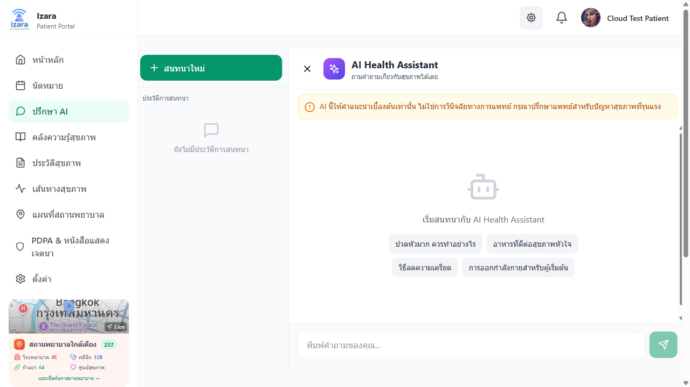

> ⚠️ AI แพทย์ provides general health information only — **not a medical diagnosis**. Always consult a real doctor.

---


### 2.9 คลังความรู้สุขภาพ

คลิก **"คลังความรู้สุขภาพ" (Health Library)** to read doctor-published articles:


- Search by keyword or category (diseases, medications, wellness, prevention)

- ไทย-language content with images

- คลิก article for full detail view

- Shows author, publish date, category

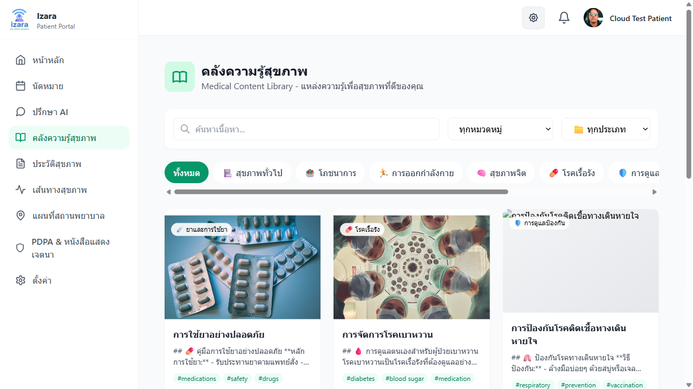
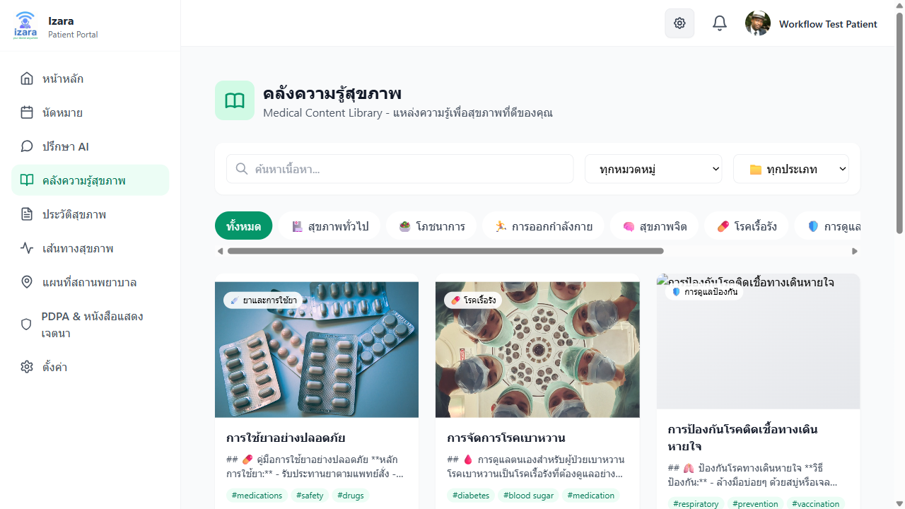
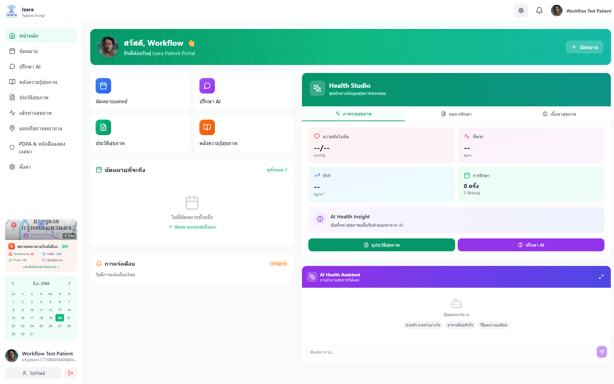

---


### 2.10 แผนที่สถานพยาบาลใกล้เคียง

คลิก **"แผนที่สถานพยาบาล" (Map)** → allow GPS location.


- **Interactive Map** (Google Maps) — hospitals, clinics, pharmacies, health centers

- **Distance Filter:** 1, 3, 5 (default), 10, 15, 20 km

- **Facility Info:** Name, address, phone, distance, hours

- **Summary Count:** Hospitals XX, Clinics XX, Pharmacies XX, Centers XX

- **Navigation:** One-tap Google Maps navigation

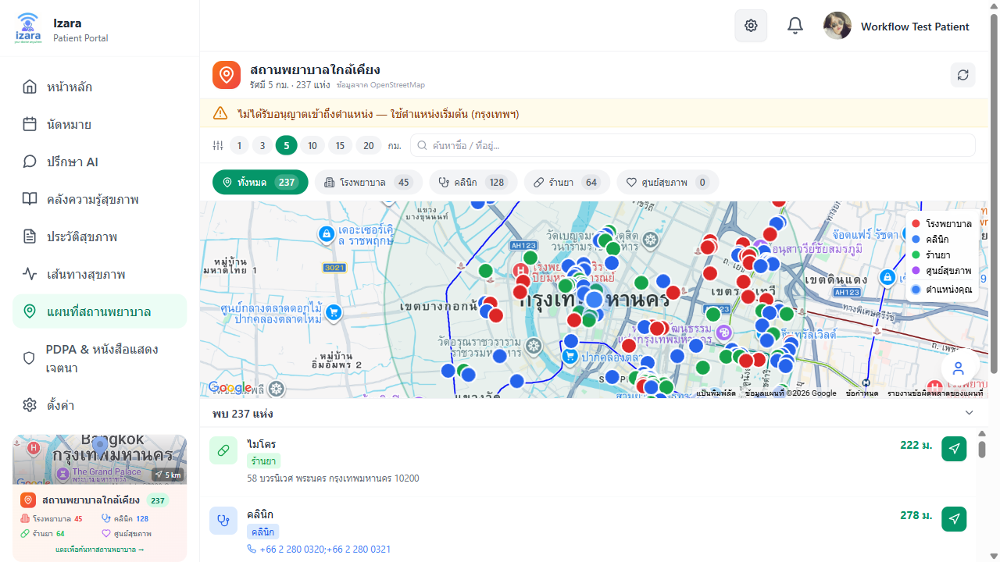
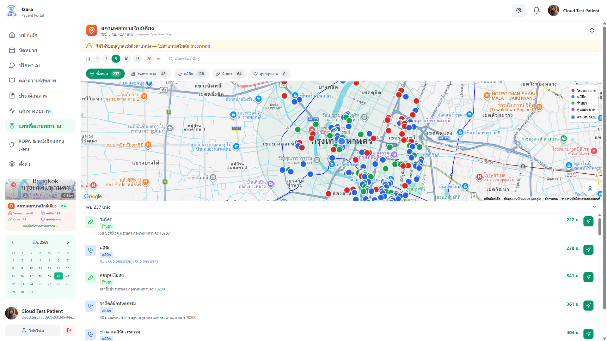

---


### 2.11 พินัยกรรมชีวิต

คลิก **"PDPA & หนังสือแสดงเจตนา"** → **"พินัยกรรมชีวิต" tab**

4-step wizard for advance healthcare directives:

| Step | Content |
| ------|--------- |
| **1. Primary Proxy** | Name, relationship, contact (phone, email, address) |
| **2. Alternate Proxy** | Backup proxy if primary unavailable (optional) |
| **3. Treatment Preferences** | CPR, ventilator, tube feeding, dialysis, antibiotics, pain management, organ donation |
| **4. Digital Signature** | Digital signature + toggle doctor sharing |


## Document สถานะ:

- **Draft** — Created but not signed

- **Active** — Signed, doctors can view (per PDPA consent)

- **Revoked** — Document cancelled

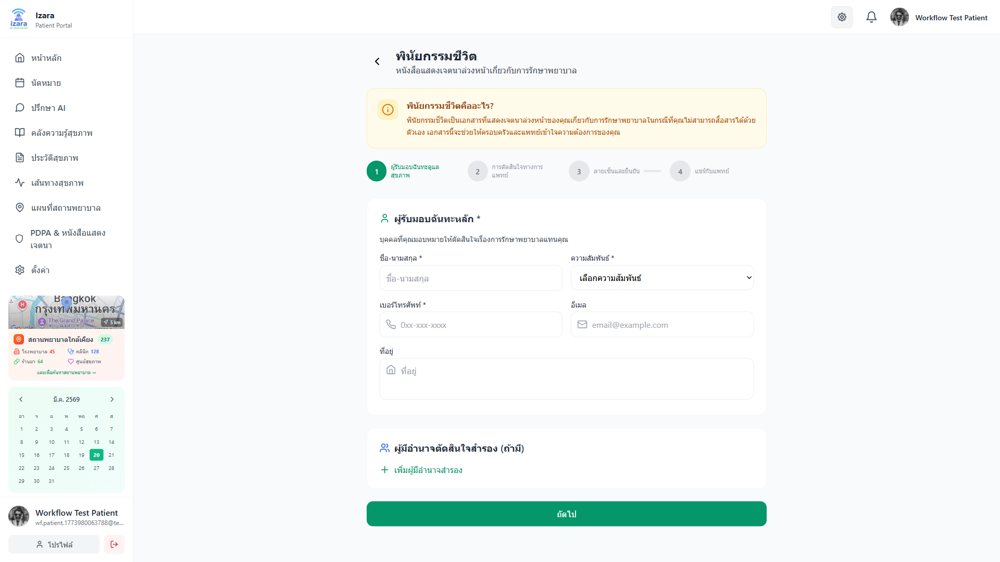
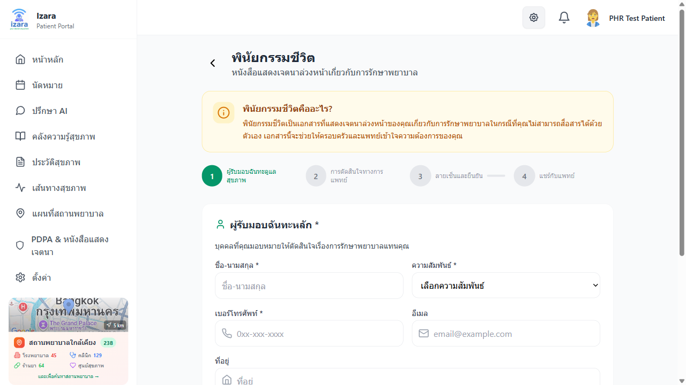

---


### 2.12 ความยินยอม PDPA

คลิก **"PDPA & หนังสือแสดงเจตนา"** → **"PDPA" tab**

Manage data privacy consent under ไทยland's Personal Data Protection Act:

| Data Type | รายละเอียด |
| -----------|------------- |
| Demographics | Name, age, address, phone |
| Medical History | All treatment records |
| Medications | Current and past medications |
| Allergies | Drug and substance allergy history |
| Lab Results | Laboratory test results |
| Prescriptions | แพทย์ prescriptions |
| Vital Signs | Blood pressure, heart rate, weight |
| PHR | Personal health records |
| EMR | Electronic medical records |
| Living Will | Advance directive documents |


- Toggle ON/OFF per data type

- Set different sharing per doctor

- Revoke consent at any time

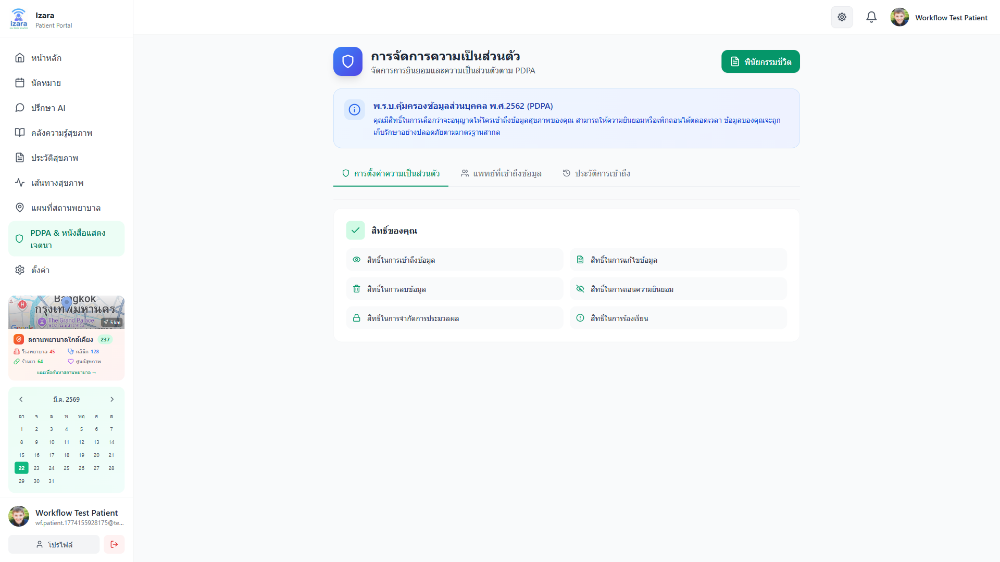
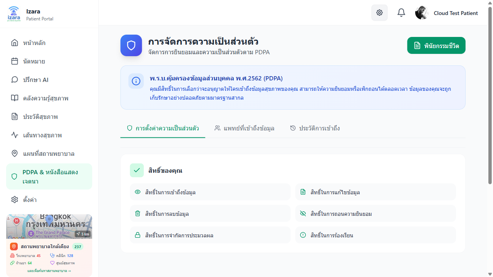

---


### 2.13 โปรไฟล์และการตั้งค่า

**Profile:** Edit avatar, name, contact details, emergency contact, insurance info.

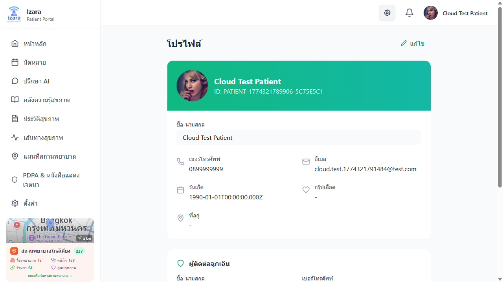


## Settings:

- 🌐 **Language:** ไทย ↔ English (instant switch)

- 🎨 **Theme:** Light / Dark

- 🔔 **Notifications:** In-app / Email / Push — toggle per type

- 🔒 **Privacy:** PDPA consent management

- 📱 **Devices:** Manage active sessions

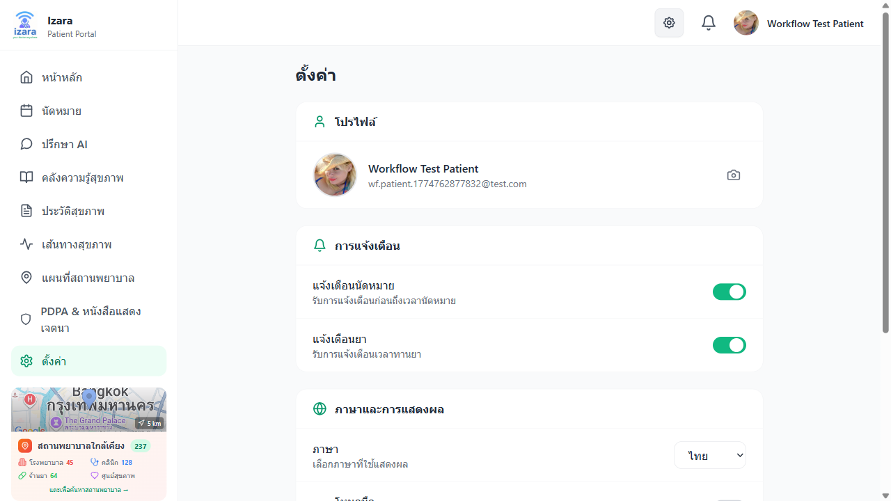
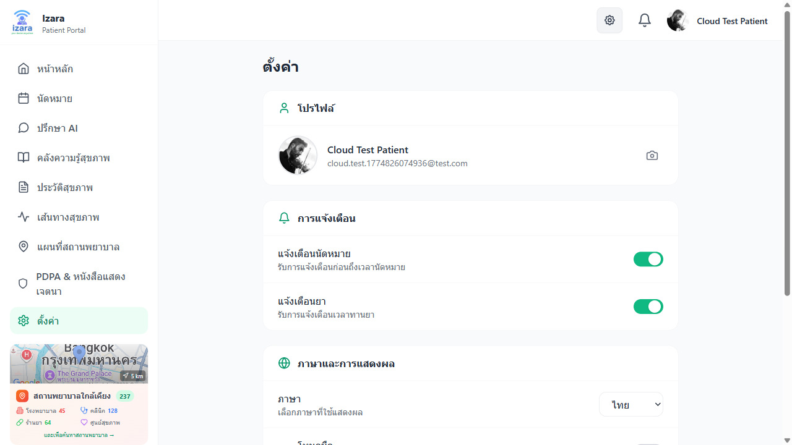

---


## 3. ระบบแพทย์ (แพทย์ Portal)


### 3.1 แดชบอร์ดแพทย์

Overview of all key information on one page:


## Summary Bar (6 cards):
| Metric | รายละเอียด |
| --------|------------- |
| Today's Appointments | Scheduled for today |
| ผู้ป่วยs Seen | Total patients treated |
| In Queue | ผู้ป่วยs currently waiting |
| Pending Prescriptions | Uncompleted prescriptions |
| Unread Messages | Unread notifications |
| Avg Wait Time (min) | Average patient wait time |


## 3 Main Areas:
1. **Health Data** — ผู้ป่วย queue and records
2. **Health Meeting** — Video consultation + patient/doctor/team views
3. **Health Studio** — Clinical tools (diagnosis, treatment plans, EMR, radiology, lab reports)

**AI ผู้ป่วย Summary:** Select a patient to view auto-generated AI history summary (status: awaiting review)

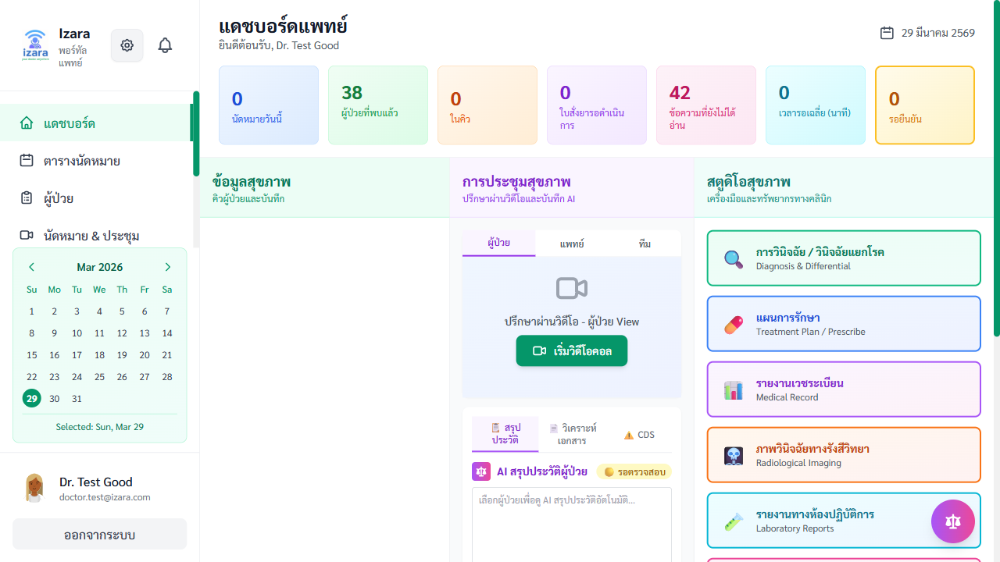


---


### 3.2 จัดการตารางเวลา

คลิก **"ตารางนัดหมาย" (Schedule)** in the sidebar.


## ฟีเจอร์s:

- คลิก date/time slots to set **Available** or **Unavailable**

- Set recurring patterns (daily / weekly / monthly)

- Switch views: Day / Week / Month

- View confirmed appointments on calendar

- สี-coded: online / in-person / holiday


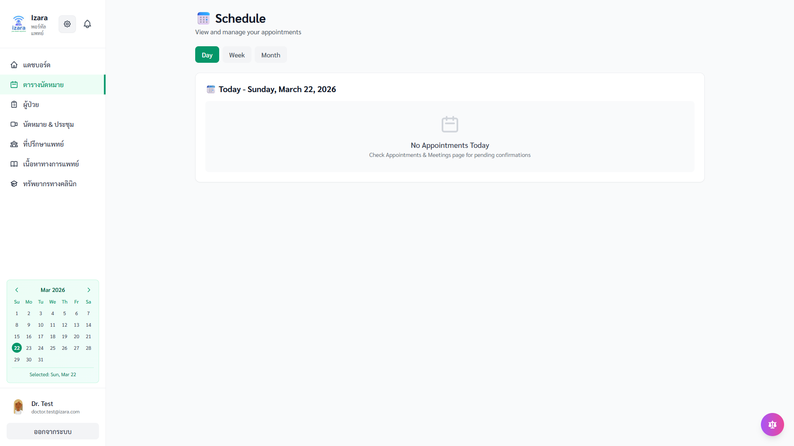

---


### 3.3 คิวนัดหมาย

คลิก **"นัดหมาย & ประชุม" (Appointments & Meeting)** in the sidebar.


## Summary Bar:

- **Awaiting Confirmation** — Count pending

- **Completed** — Count finished


## ผู้ป่วย Queue:

- List of pending appointments

- คลิก **"Refresh"** to update

- View symptoms + AI urgency analysis

- คลิก **"ยืนยัน" (Confirm)** → auto-generates Jitsi link + notifies patient

- คลิก **"ปฏิเสธ" (Decline)** → enter reason + notify patient

- **Call Next ผู้ป่วย** button for auto-queue advancement


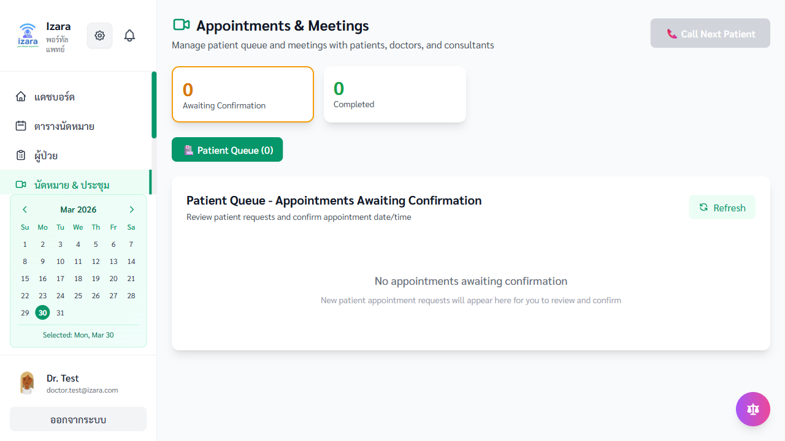
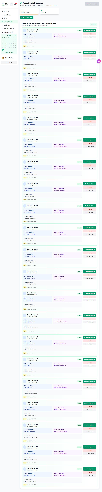

---


### 3.4 การดำเนินการประชุมวิดีโอ

**Step 1:** Accept meeting agreement (recording, transcription, PDPA)


**Step 2:** Pre-join screen — test camera/mic, view participant status


**Step 3:** Join as **HOST** (moderator — highest privileges)


## Host ฟีเจอร์s:

- 🔑 **Lobby Control:** Admit/reject patients, guests, admins from Waiting Room

- 🎙️ **Transcription:** ▶️ Start → ⏸️ Pause → ⏯️ Resume → ⏹️ Stop

- 🗣️ **Speaker Diarization:** Auto-identifies doctor/patient/guest speech

- 🌐 **Language Toggle:** ไทย ↔ English transcription

- 📹 **Video Recording:** Start/stop recording (200MB limit)

- 💬 **Chat:** Send messages during meeting (Socket.IO)

- 📱 **Screen Sharing:** Share documents/images via screen


**Step 4:** คลิก **"วางสาย" (Hang Up)** → การประมวลผล AI เริ่มต้นโดยอัตโนมัติ

---


### 3.5 หลังการประชุม: สรุป AI และเวชระเบียน

After the meeting, Gemini AI auto-generates:

| Output | Format |
| --------|-------- |
| **SOAP Summary** | S (Subjective), O (Objective), A (Assessment), P (Plan) |
| **ผู้ป่วย Instructions** | Easy-language care advice (ไทย + English) |
| **CDS** | การแจ้งเตือนปฏิกิริยาระหว่างยา, dosage checks, allergy contraindications |


## แพทย์ Validation (Man-in-the-Loop):
| การดำเนินการ | รายละเอียด |
| --------|------------- |
| ✅ **Approve** | Accept AI output as-is → lock EMR |
| ✏️ **Edit** | Modify specific sections (S/O/A/P) before approval |
| 🔄 **Regenerate** | Ask AI to regenerate with refined context |
| ❌ **Reject** | Discard AI output → write manually |


## After Approval:

- EMR locked + digitally signed

- ผู้ป่วย sees summary in PHR + Timeline immediately

- Notification sent to patient

---


### 3.6 เวชระเบียนอิเล็กทรอนิกส์ (EMR)

Access from dashboard → **"Medical Record (รายงานเวชระเบียน)"**


## SOAP Format:
| Section | Content |
| ---------|--------- |
| **S** (Subjective) | ผู้ป่วย history — symptoms, duration, triggers |
| **O** (Objective) | Physical exam — vital signs, lab results |
| **A** (Assessment) | Diagnosis — ICD-10 code + description |
| **P** (Plan) | Treatment plan — medications, follow-up, referral |


## ฟีเจอร์s:

- Digital signature to lock → version history maintained

- Reference lab results, prescriptions, images

- AI auto-drafts from transcription

- Export as PDF


---


### 3.7 ใบสั่งยา

Access from dashboard → **"Treatment Plan (แผนการรักษา / Prescribe)"**


## ขั้นตอน:
1. Search drug name (autocomplete from ไทย drug database)
2. Set dosage, frequency, duration, instructions
3. AI auto-checks:
   - ⚠️ Drug interactions
   - ⚠️ PHR allergy records
   - ⚠️ Inappropriate dosage
4. Confirm → prescription appears in patient's PHR


---


### 3.8 คำสั่งตรวจแลป

Access from dashboard → **"Laboratory Reports (รายงานทางห้องปฏิบัติการ)"**


## ขั้นตอน:
1. Select tests from standardized list
2. Set priority: **Routine / Stat / Urgent**
3. Add clinical notes
4. Submit lab order → await lab results
5. Record results → appears in patient's PHR automatically
6. AI analyzes results and alerts on abnormal values


---


### 3.9 จัดการผู้ป่วย

คลิก **"ผู้ป่วย" (ผู้ป่วยs)** to view treated patients.


## ฟีเจอร์s:

- Search by name, email, or ID

- View demographics (per PDPA consent)

- View PHR: vital signs, medications, allergies, lab results

- View appointment history + past EMR records

- View prescriptions + lab orders

- View Living Will (if patient authorized)

**ผู้ป่วย Record Viewer:** คลิก a patient name for full detail view.

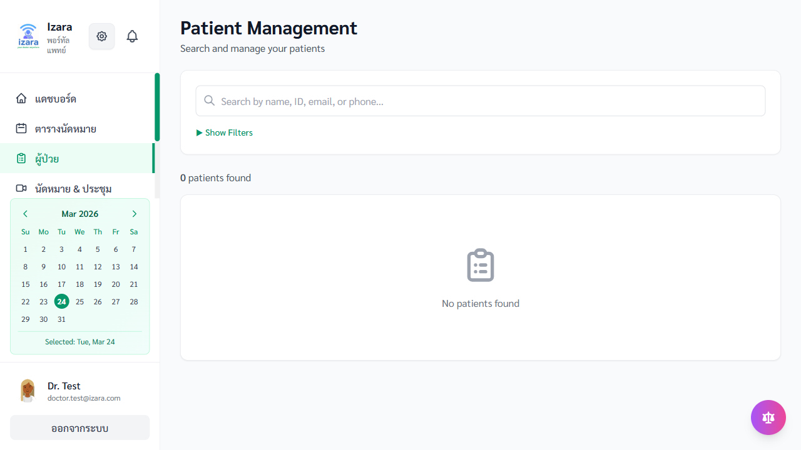


---


### 3.10 สร้างเนื้อหาทางการแพทย์

คลิก **"เนื้อหาทางการแพทย์" (Medical Content)** to create health articles for the patient Health Library.


## ขั้นตอน:
1. คลิก **"สร้างบทความ" (Create Article)**
2. Enter title, content (ไทย primary), category, tags
3. Save as **Draft** or **Submit for Approval**
4. ผู้ดูแล reviews → Approve → published in Health Library


## วงจรเนื้อหา:
```
📝 Draft → 📤 Submitted → 👑 ผู้ดูแล Reviews → ✅ Published
                                            → ❌ Rejected (revise)
```


---


### 3.11 ทรัพยากรทางคลินิก

คลิก **"ทรัพยากรทางคลินิก" (Clinical Resources)** to access:


- **Clinical Practice Guidelines** (แนวทางเวชปฏิบัติ)

- **Research Papers** (งานวิจัยทางการแพทย์)

- **Treatment Protocols** (โปรโตคอลการรักษา)

- **Reference Materials** (คู่มืออ้างอิง)


## ฟีเจอร์s:

- Search with keywords (RAG + Gemini AI powered)

- Filter by type/category

- Rate (1-5 stars) with reviews

- Save favorites

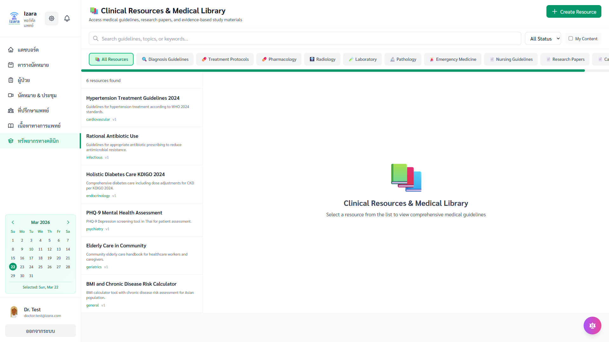


---


### 3.12 แพทย์ที่ปรึกษาและทำเนียบแพทย์


## Medical Consultants:
คลิก **"แพทย์ที่ปรึกษา" (Medical Consultants)** — specialist expert directory.


- Name, specialty, hospital, email, phone

- Search by subspecialty

- View ratings and reviews from other doctors

- Rate (1-5 stars) with comments


## แพทย์s Directory:
คลิก **"ทำเนียบแพทย์" (แพทย์s Directory)** — all system doctors.


- Search by name/specialty

- View contact info and profiles

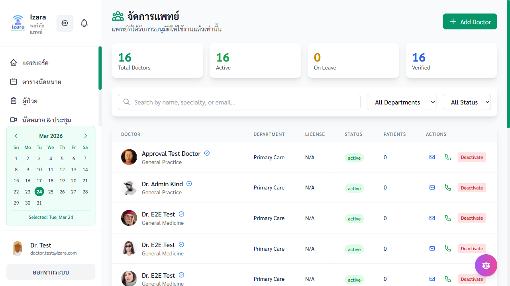
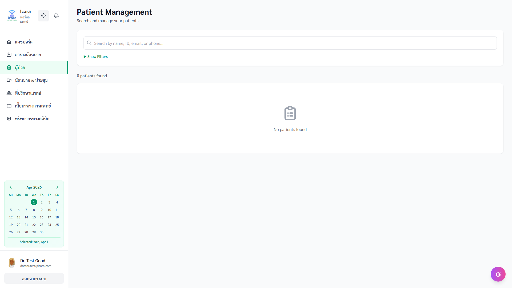

---


### 3.13 เครื่องมือ AI สำหรับแพทย์ (Gemini AI Studio)

Access from dashboard → purple AI button (bottom-right corner).

| ฟีเจอร์ | รายละเอียด |
| ---------|------------- |
| **Diagnosis / Differential Diagnosis** | AI analyzes symptoms → suggests differential diagnosis |
| **Treatment Plan** | AI recommends treatment based on clinical guidelines |
| **Document Analysis** | AI reads PDF lab reports, images → extracts data |
| **ผู้ป่วย History Summary** | AI summarizes PHR + EMR before consultation |
| **CDS (Clinical Decision Support)** | Checks drug interactions, dosage, contraindications |


> 🤖 Gemini AI Studio is a **clinical decision support tool** — not a diagnostician. แพทย์ verification required for all outputs.

---


### 3.14 โปรไฟล์แพทย์

คลิก **"โปรไฟล์" (Profile)** to manage professional information:


- Avatar, full name

- Medical license number

- Specialty (subspecialty)

- Hospital/clinic

- Phone, email

- Experience, qualifications


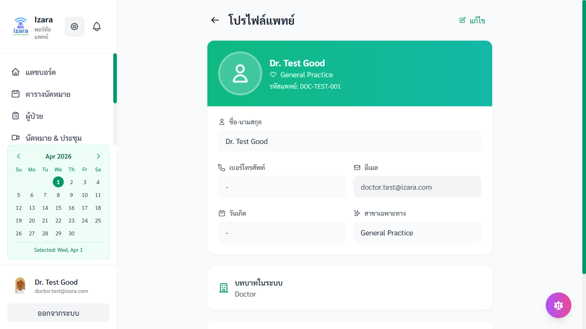

---


## 4. ระบบผู้ดูแลระบบ

ผู้ดูแล features are in the แพทย์ Portal for users with บทบาท **ผู้ดูแลระบบ**.


### 4.1 แดชบอร์ดผู้ดูแล

เหมือนแดชบอร์ดแพทย์ แต่มีเมนูเพิ่มเติมและภาพรวมทั้งระบบ:

- จำนวนนัดหมายทั้งระบบ

- จำนวนแพทย์รอการอนุมัติ

- เนื้อหารอการตรวจสอบ

- สถิติการใช้งาน

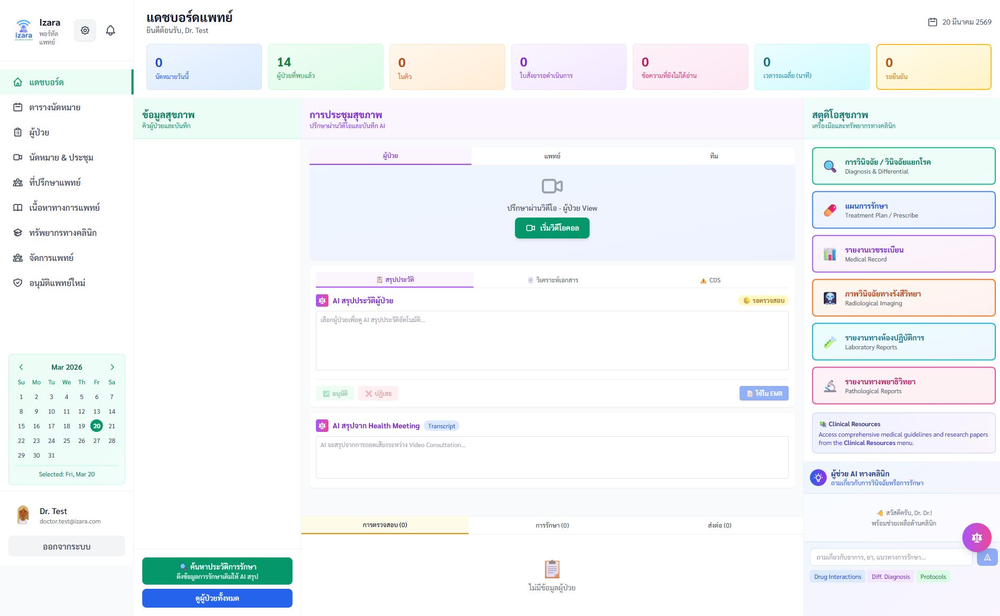

---


### 4.2 อนุมัติและจัดการแพทย์

คลิก **"จัดการแพทย์" (แพทย์ Management)** สำหรับแพทย์ทุกคนพร้อมสถานะ


## แท็บ:
| แท็บ | รายละเอียด |
| -----|------------- |
| All | แพทย์ทุกคนในระบบ |
| Pending | ลงทะเบียนแล้ว รอตรวจสอบ |
| Approved | แพทย์ที่ใช้งาน |
| Rejected | ใบสมัครที่ถูกปฏิเสธ |
| ผู้ดูแลs | ผู้ใช้ที่มีสิทธิ์ผู้ดูแล |


## การดำเนินการ:

- ✅ **Approve** — Activate doctor account → send notification

- ❌ **Reject** — Decline with reason → send notification

- 👑 **Promote to ผู้ดูแล** — Grant admin privileges

- 🔒 **Deactivate** — Suspend account temporarily

- 📋 **View Details** — Full profile view (license, experience, etc.)


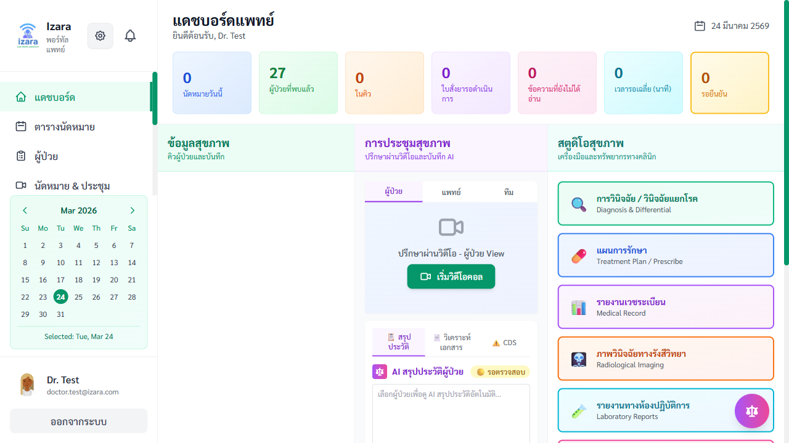

---


### 4.3 จัดการนัดหมายทั้งระบบ

คลิก **"จัดการนัดหมาย" (Appointment Management)** สำหรับดูภาพรวมทั้งระบบ


## ฟีเจอร์s:

- View all statuses: pending, assigned, confirmed, completed, cancelled

- **Assign แพทย์:** Select by specialty (AI-assisted recommendation)

- **Bulk Operations:** Assign/cancel multiple appointments at once

- **Filter:** By doctor, status, date, type

- **Search:** By patient/doctor name or appointment ID


---


### 4.4 อนุมัติเนื้อหา

ตรวจสอบบทความ/ทรัพยากรที่แพทย์ส่งมา:

1. ดูเนื้อหาที่รอการอนุมัติ
2. อ่านเนื้อหาทั้งหมด — ตรวจสอบความถูกต้อง
3. คลิก **"อนุมัติ" (Approve)** → published in Health Library
4. คลิก **"ปฏิเสธ" (Reject)** → return to doctor with comments

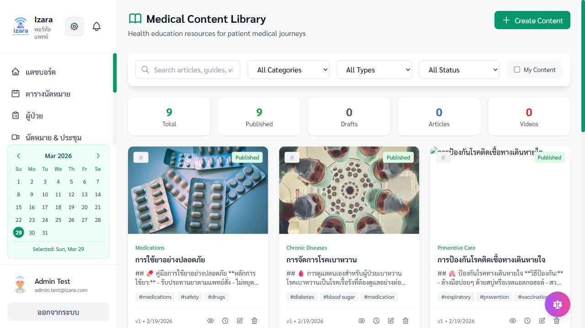

---


## 5. กระบวนการให้คำปรึกษาทางไกล


### 5.1 ภาพรวมกระบวนการตั้งแต่ต้นจนจบ

กระบวนการให้คำปรึกษาทั้งหมดมี 6 ระยะ:

```
📝 ผู้ป่วย Books → ⏳ Pending → 👨‍⚕️ แพทย์ Reviews → ✅ Confirmed → 📹 Meeting → ✔️ Completed
```


## Phase 1 — Booking & Approval:
1. ผู้ป่วย books appointment (symptoms + preferred time + doctor selection or auto-match)
2. AI analyzes symptoms → urgency level + specialty suggestion
3. Two approval paths: **Path A** (doctor confirms directly) or **Path B** (admin assigns → doctor confirms)
4. On confirmation: Jitsi meeting URLs auto-generated, patient notified with link


## Phase 2 — Pre-Meeting Preparation:
5. ผู้ป่วย optionally invites relatives/friends (no account needed)
6. แพทย์ optionally invites specialists/other doctors (token-based invite)
7. AI generates Pre-Consultation Summary from patient's PHR + EMR history

**Phase 3 — Meeting Execution** (see [Section 7](#7-video-meeting-system--jitsi--ระบบวิดีโอประชุม))

**Phase 4 — Post-Meeting AI Processing** (see [Section 8](#8-ai-features--gemini--ฟีเจอร์-ai) and [Section 9](#9-meeting-recording--transcription--ระบบบันทึกและถอดเสียง))


## Phase 5 — แพทย์ Review & EMR Documentation:
8. AI summary appears in แพทย์ Portal → Health Meeting page
9. แพทย์ validates: [✅ Approve] [✏️ Edit] [🔄 Regenerate] [❌ Reject]
10. EMR editor opens with AI-prefilled SOAP tabs (S/O/A/P)
11. แพทย์ signs EMR → AI generates ผู้ป่วย Instruction Sheet
12. Optional: E-prescribing + lab orders


## Phase 6 — ผู้ป่วย Delivery:
13. ผู้ป่วย receives: diagnosis, treatment plan, medications, instruction sheet (PDF), follow-up schedule, warning signs
14. ผู้ป่วย does NOT receive: internal notes, raw AI outputs, CDS alerts
15. Visible in: Dashboard (latest result), Timeline (history entry), PHR (health logs)
16. Appointment status → **completed**


> 📌 **Tip:** ผู้ป่วยจะได้รับลิงก์การประชุมทันทีเมื่อแพทย์ยืนยันนัดหมาย — ส่งทั้งอีเมลและแจ้งเตือนในแอป

---


### 5.2 สถานะการนัดหมาย

| สถานะ | ไทย | สี | รายละเอียด |
| --------|------|-------|------------- |
| **Pending** | รอดำเนินการ | 🟡 Yellow | Request sent, awaiting doctor review |
| **Finding แพทย์** | กำลังจัดหาแพทย์ | 🟠 Orange | ผู้ดูแล searching for available doctor |
| **Assigned** | มอบหมายแล้ว | 🔵 Blue | ผู้ดูแล assigned a doctor |
| **Confirmed** | ยืนยันแล้ว | 🟢 Green | แพทย์ confirmed — meeting link ready |
| **In Progress** | กำลังดำเนินการ | 🔴 Red | Video consultation in progress |
| **Completed** | เสร็จสิ้น | ⚪ Gray | Consultation done — view summary/EMR |
| **Cancelled** | ยกเลิก | ⬛ Black | Cancelled by patient, doctor, or admin |


---


## 6. กระบวนการลงทะเบียนแพทย์ใหม่


### 6.1 การลงทะเบียนแพทย์

แพทย์ใหม่ต้องลงทะเบียนและรอการอนุมัติจากผู้ดูแลก่อนเข้าใช้ระบบ


## ขั้นตอน:
1. Open แพทย์ Portal → click **"Register"**
2. Fill in: Name, Email, Phone, Medical License Number, Specialty, Password
3. Submit → see **"Pending Approval"** message
4. แพทย์ **cannot log in** until admin approves


> ⚠️ **Note:** แพทย์ใหม่จะไม่สามารถเข้าสู่ระบบได้จนกว่าผู้ดูแลระบบจะอนุมัติ

---


### 6.2 กระบวนการอนุมัติโดยผู้ดูแล

1. ผู้ดูแล navigates to **"จัดการแพทย์" (แพทย์ Management)** page
2. Views **Pending** tab (badge shows count of waiting doctors)
3. Reviews doctor details: name, email, license, specialty, registration date
4. คลิกs **"Approve"** → doctor account activated → notification email sent
5. Or clicks **"Reject"** → enters rejection reason → doctor notified

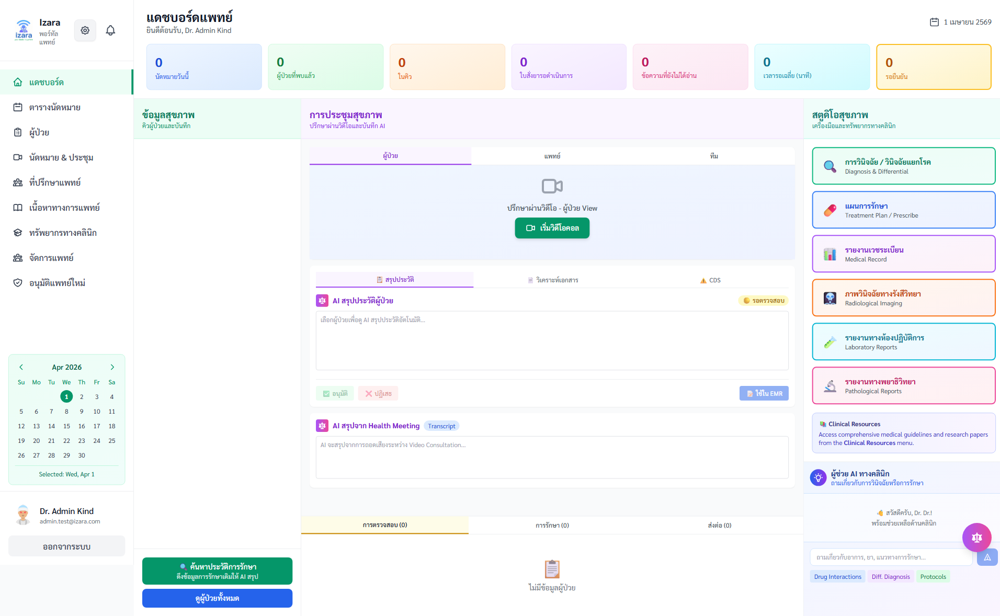


---


### 6.3 สถานะการอนุมัติ

| สถานะ | เข้าสู่ระบบได้? | is_active | is_approved |
| -------|-----------|-----------|------------- |
| **Pending** | ❌ | false | false |
| **Approved** | ✅ | true | true |
| **Rejected** | ❌ | false | false |


> 📌 **Tip:** ผู้ดูแลs can also promote approved doctors to admin role or demote admins back to doctor

---


## 7. ระบบวิดีโอประชุม


### 7.1 ผู้เข้าร่วมประชุมและบทบาท

| บทบาท | วิธีเข้าร่วม | ล็อบบี้? |
| ------|--------------|-------- |
| **แพทย์ (HOST)** | "Join Meeting" from Scheduled tab | ไม่ (ผู้ดำเนินรายการ) |
| **ผู้ป่วย** | Meeting link from appointments page | ใช่ (รอแพทย์) |
| **ผู้ป่วย's Relatives** | Shared link from patient | ใช่ (สร้างชื่อ + ล็อบบี้) |
| **Other แพทย์s/ผู้ดูแล** | Token-based invite from doctor | ใช่ (ล็อบบี้) |
| **External Guests** | Direct link (no account needed) | ใช่ (สร้างชื่อ + ล็อบบี้) |


---


### 7.2 การเข้าประชุมของแพทย์ (HOST)

1. Open **"ตารางประชุม" (Scheduled Meetings)** → click **"🎥 เข้าร่วมประชุม" (Join Meeting)**
2. Pre-join screen: camera/mic preview (both ON by default)
3. Enter room as HOST/Moderator — the meeting room is created and synchronized so the patient sees the same room
4. **Host Controls:** Lobby admission (individual or **"อนุญาตทั้งหมด" Admit All**), kick, mute all, start/stop recording, invite guests


---


### 7.3 การเข้าประชุมของผู้ป่วย

1. See meeting link in **"นัดหมายของฉัน" (My Appointments)** page
2. Accept 3-consent agreement (video recording, transcription, PDPA)
3. Pre-join screen: test camera/mic
4. คลิก **"เข้าร่วม" (Join)** → enter Lobby → wait for doctor
5. แพทย์ approves → enters meeting room


> 🔒 **Security:** ผู้ป่วยต้องยอมรับข้อตกลง 3 ข้อก่อนเข้าร่วมประชุม (การบันทึกวิดีโอ, ถอดเสียง, PDPA)

---


### 7.4 การเข้าร่วมแบบผู้เยี่ยม (ไม่ต้องสร้างบัญชี)

1. Receive invite link (email or shared by patient/doctor)
2. คลิก link → Guest Join page (`/guest-join/:meetingId`)
3. Enter display name and **email address** (no login required)
4. คลิก **"ขอเข้าร่วม" (Request to Join)** → enter Lobby
5. แพทย์ approves → enters meeting
6. If rejected: red screen with **"แพทย์ไม่อนุญาตให้เข้าร่วม" (แพทย์ denied access)**

> ⏱️ **Lobby Timeout:** After 5 minutes waiting in the lobby without doctor approval, a yellow warning banner appears: *"คุณรออยู่ใน Lobby นานกว่า 5 นาที"* with a **"กลับหน้าแรก" (Return Home)** button. The guest may continue waiting or return to the home page.

---


### 7.5 ฟีเจอร์ระหว่างประชุม


- 📹 วิดีโอ/เสียงสำหรับผู้เข้าร่วมทุกคน (กล้อง/ไมค์เปิดตามค่าเริ่มต้น สลับได้)

- 💬 แชทข้อความ (ใช้งานได้ตลอด บันทึกข้อความทั้งหมด)

- 📱 แชร์หน้าจอสำหรับภาพทางการแพทย์

- 🎙️ Transcript streaming (doctor-controlled — see [Section 9](#9-meeting-recording--transcription--ระบบบันทึกและถอดเสียง))

- แนะนำผู้เข้าร่วมไม่เกิน 8 คน


---


### 7.6 จบการประชุม

1. แพทย์ clicks **"วางสาย" (Hang Up)**
2. ผู้เข้าร่วมทุกคนจะถูกตัดการเชื่อมต่อ
3. การประมวลผล AI เริ่มต้นโดยอัตโนมัติ (see [Section 8](#8-ai-features--gemini--ฟีเจอร์-ai))


---


## 8. ฟีเจอร์ AI (Gemini)


### 8.1 AI สรุปหลังประชุม (อัตโนมัติ)

หลังการประชุมสิ้นสุด ระบบ AI ทำงานโดยอัตโนมัติ:

- **Input:** Full transcript + all chat messages + video metadata + patient PHR/EMR

- **Output:** SOAP summary (ไทย), CDS recommendations, ผู้ป่วย Instruction Sheet draft

- For meetings > 30 min: split into 30-minute sections with separate summaries

- ผลลัพธ์ทั้งหมดถูกระบุว่า `requiresValidation: true` — แพทย์ต้องอนุมัติ

---


### 8.2 สรุป SOAP

The AI generates a structured ไทย-language SOAP note:


- 🎯 อาการสำคัญ (Chief Complaint)

- 📝 อาการที่พบ (Presenting Symptoms)

- 🔍 การสืบค้น/ตรวจเพิ่มเติม (Investigation)

- 📋 การประเมินเบื้องต้น (Assessment)

- 💊 คำแนะนำการรักษา (Treatment Recommendations)

- 📅 นัดติดตาม (Follow-up Schedule)

- 🚩 อาการเตือน (Red Flags)

- 🏠 คำแนะนำไลฟ์สไตล์ (Lifestyle Recommendations)


---


### 8.3 แพทย์ตรวจสอบ (Man-in-the-Loop)

แพทย์ reviews AI output with 4 actions:

| การดำเนินการ | รายละเอียด |
| --------|------------- |
| ✅ **Approve** | ยอมรับ → ล็อค EMR → ส่งให้ผู้ป่วย |
| ✏️ **Edit** | แก้ไขส่วนต่างๆ ก่อนอนุมัติ |
| 🔄 **Regenerate** | AI สร้างใหม่ด้วยบริบทที่ปรับปรุง |
| ❌ **Reject** | ยกเลิก AI → เขียนด้วยตนเอง |


> 🔒 **Security:** ผู้ป่วยจะไม่ได้รับผลสรุป AI โดยตรง — แพทย์ต้องตรวจสอบและอนุมัติทุกครั้ง

---


### 8.4 ใบคำแนะนำผู้ป่วย

สร้างอัตโนมัติหลังแพทย์อนุมัติสรุป AI:


- วินิจฉัย (Diagnosis in simple ไทย)

- ยาที่ได้รับ (Medications with dosage)

- การปฏิบัติตัว (Self-care instructions)

- อาการเตือน (Warning signs to watch for)

- นัดติดตาม (Follow-up schedule)

แพทย์ validates before sending → patient downloads as PDF.

---


### 8.5 ระบบสนับสนุนการตัดสินใจทางคลินิก (CDS)

| ฟีเจอร์ | รายละเอียด |
| ---------|------------- |
| Differential Diagnosis | AI แนะนำการวินิจฉัยที่เป็นไปได้ |
| Lab Tests | แนะนำการตรวจแลปและการถ่ายภาพ |
| Drug Interactions | การแจ้งเตือนปฏิกิริยาระหว่างยา |
| Dosage Alerts | ตรวจสอบขนาดยา/ข้อห้ามการแพ้ยา |
| Guidelines | อ้างอิงแนวทางเวชปฏิบัติ (2024-2025) |


---


### 8.6 หมอ AI (ระบบผู้ป่วย)


- แชทกับ Gemini AI สำหรับคำแนะนำสุขภาพทั่วไป

- อ้างอิงข้อมูล PHR ของคุณสำหรับคำตอบเฉพาะบุคคล

- สนทนาหลายรอบ บันทึก/เรียกดูเซสชัน

- ไม่ใช่การวินิจฉัยทางการแพทย์ — ควรปรึกษาแพทย์จริงเสมอ


---


### 8.7 AI Studio สำหรับแพทย์

แพทย์s access advanced AI tools:

- การวินิจฉัย / การวินิจฉัยแยกโรค

- สร้างแผนการรักษา

- วิเคราะห์เอกสาร (รายงานแลป PDF, ภาพ)

- ผู้ป่วย history summary

---


### 8.8 ต้นทุน

| บริการ | ต้นทุน |
| ---------|------ |
| Jitsi Meet | **$0** (FREE) |
| Web Speech API | **$0** (FREE) |
| Gemini AI | ~$0.001/1K tokens |
| **Total per 15-min consultation** | **~$0.01-0.05** |


---


## 9. ระบบบันทึกและถอดเสียง


### 9.1 การบันทึกวิดีโอ


- บันทึกในเบราว์เซอร์ (Jitsi ในตัว, ฟรี)

- แพทย์ (HOST) starts/stops recording

- รูปแบบ: WebM, สูงสุด 200MB

- อัพโหลดการบันทึกไปยังที่เก็บข้อมูลหลังประชุมสิ้นสุด

---


### 9.2 การถอดเสียงแบบเรียลไทม์

แพทย์ controls transcription during the meeting:

1. แพทย์ clicks **"▶ Start Transcription"**
2. Web Speech API begins listening (FREE, browser-based)
3. เรียลไทม์ transcript appears in bottom panel
4. Speaker labels: 👨‍⚕️ แพทย์ / 🧑 ผู้ป่วย / 👥 Guest
5. Interim text shown with yellow pulsing background
6. แพทย์ can **⏸ Pause** / **▶ Resume** / **⏹ Stop** anytime
7. Language toggle: ไทย (th-TH) ↔ English (en-US)
8. Transcript segments saved to database continuously


> 📌 **Note:** เฉพาะแพทย์ (HOST) เท่านั้นที่ควบคุมการถอดเสียงและการบันทึก — ผู้ป่วยไม่สามารถเริ่ม/หยุดได้

---


### 9.3 การประมวลผลหลังประชุม

1. รวบรวมบทถอดเสียงจากทุกส่วน
2. รวมข้อความแชททั้งหมดเข้ากับบทถอดเสียง
3. ส่งข้อมูลรวมไปยัง Gemini AI เพื่อสร้างสรุป SOAP
4. สำหรับประชุมยาว (>30 นาที): สรุปแยกเป็นช่วงละ 30 นาที


---


## 10. ระบบแจ้งเตือน


### 10.1 ช่องทางแจ้งเตือน

| ช่องทาง | รายละเอียด |
| ---------|------------- |
| **In-App** | 🔔 ไอคอนกระดิ่งในส่วนหัว — รายการดร็อปดาวน์ |
| **Email** | อีเมลภาษาไทยพร้อมรายละเอียดการดำเนินการ |
| **Push** | การแจ้งเตือนเบราว์เซอร์ (เรียลไทม์) |


---


### 10.2 ประเภทการแจ้งเตือน

| หมวดหมู่ | เหตุการณ์ |
| ----------|-------- |
| **นัดหมาย** | ขอนัดหมาย, ยืนยัน (+ ลิงก์ประชุม), ปฏิเสธ, ยกเลิก, มอบหมาย, เลื่อนนัด, เตือนล่วงหน้า (24ชม., 1ชม.) |
| **วิดีโอประชุม** | ลิงก์พร้อม, ลิงก์ล้มเหลว, ประชุมเริ่ม, เตือน (15 นาที) |
| **เวชระเบียน** | EMR ลงนามแล้ว, EMR พร้อมตรวจสอบ, ใบสั่งยาพร้อม, ผลแลปพร้อม |
| **ระบบ** | ยืนยันบัญชี, รีเซ็ตรหัสผ่าน, บำรุงรักษาระบบ |


---


### 10.3 ตารางแจ้งเตือนอัตโนมัติ

| เวลา | ช่องทาง | ข้อความ |
| --------|---------|------------- |
| 24 ชั่วโมงก่อน | Email + In-App | พรุ่งนี้คุณมีนัดพบแพทย์ |
| 1 ชั่วโมงก่อน | Push + In-App | อีก 1 ชั่วโมง ถึงเวลานัดหมาย |
| 15 นาทีก่อน | Push + In-App | เตรียมพร้อม! ลิงก์ประชุมพร้อมแล้ว |
| เรียลไทม์ | Push | แพทย์เริ่มห้องประชุมแล้ว คลิกเข้าร่วม |


> 📌 **Tip:** ตั้งค่าการแจ้งเตือนได้ที่ ตั้งค่า → การแจ้งเตือน — เปิด/ปิดได้ตามประเภทและช่องทาง

---


## 11. การจัดการเนื้อหา


### 11.1 คลังความรู้สุขภาพ (Health Library)

| บทบาท | สิทธิ์ |
| ------|-------- |
| **ผู้ป่วย** | อ่านบทความที่เผยแพร่แล้วเท่านั้น |
| **แพทย์** | สร้าง แก้ไข ลบบทความตัวเอง เผยแพร่ (โดยตรงหรือผ่านการอนุมัติ) |
| **ผู้ดูแล** | CRUD ทั้งหมด + อนุมัติ/ปฏิเสธ + บันทึกตรวจสอบ |


## วงจรเนื้อหา:
```
📝 ร่าง → 📤 รอตรวจสอบ → 👑 ผู้ดูแลตรวจสอบ → ✅ เผยแพร่ (แสดงในคลังความรู้)
                                          → ❌ ปฏิเสธ → แพทย์แก้ไข → ส่งใหม่
```


---


### 11.2 แพทย์: สร้างบทความ

1. คลิก **"สร้างบทความ" (Create Article)**
2. กรอก: หัวข้อ (ภาษาไทยบังคับ), เนื้อหา (ภาษาไทยบังคับ), หมวดหมู่, แท็ก
3. เลือก: **บันทึกเป็นร่าง** หรือ **ส่งเพื่อขออนุมัติ**
4. หากส่งแล้ว → เข้าคิวรอการอนุมัติ


---


### 11.3 Clinical Resources (แพทย์-Only) — ทรัพยากรทางคลินิก

| บทบาท | สิทธิ์ |
| ------|-------- |
| **แพทย์** | Create, edit own, submit for approval |
| **ผู้ดูแล** | Approve/reject, view all including pending |
| **ผู้ป่วย** | ❌ No access |


**Categories:** Diagnosis Guidelines, Treatment Protocols, Pharmacology, Radiology, Laboratory, Pathology, Emergency Medicine, Nursing Guidelines, Research Papers, Case Studies

**Resource Types:** guideline, protocol, research, template, reference


> 🔒 **Note:** Clinical resources ALWAYS require admin approval before being published

---


## 12. ความปลอดภัยและ PDPA


### 12.1 PDPA Consent Management — การจัดการความยินยอม PDPA

Navigate to **"PDPA & หนังสือแสดงเจตนา"** → **"PDPA"** tab:


- Toggle ON/OFF per data type: Demographics, Medical History, Medications, Allergies, Lab Results, Prescriptions, Vital Signs, PHR, EMR, Living Will

- Set different sharing per doctor

- Revoke consent at any time


---


### 12.2 Living Will — พินัยกรรมชีวิต

Navigate to **"PDPA & หนังสือแสดงเจตนา"** → **"พินัยกรรมชีวิต"** tab:


## 4-step wizard:
1. **Step 1:** Primary Proxy (name, relationship, contact)
2. **Step 2:** Alternate Proxy (optional)
3. **Step 3:** Treatment Preferences (CPR, ventilator, tube feeding, dialysis, antibiotics, pain management, organ donation)
4. **Step 4:** Digital Signature + toggle doctor sharing


## Sharing Options:

- 🔒 Keep Private — only you can see

- 🌐 Share with authorized doctors — doctors with treatment history or admins

**สถานะ:** Draft → Active (signed) → Revoked


---


### 12.3 Security ฟีเจอร์s — ความปลอดภัย

| ฟีเจอร์ | Detail |
| ---------|-------- |
| Password Hashing | bcrypt (all portals) |
| Account Lockout | 5 failed attempts → locked 30 minutes |
| Rate Limiting | Login: 10/15min, Password Reset: 5/hr, API: 500/15min |
| Session Security | 64-char crypto token, IP binding, user-agent tracking |
| JWT Authentication | Cross-service JWT with role verification |
| Man-in-the-Loop | แพทย์ validates ALL AI outputs before patient delivery |
| Audit Logging | All access to Living Will + PHR + EMR logged |
| OWASP Headers | Helmet.js (CSP, XSS protection, HSTS, X-Frame) |
| TypeScript Safety | Zero `error: any` — strict type narrowing |
| SonarQube | Clean — no security vulnerabilities |


---


### 12.4 บทบาท-Based Access Control (RBAC) — การควบคุมสิทธิ์

| บทบาท | Portal | Access |
| ------|--------|-------- |
| **ผู้ป่วย** | ผู้ป่วย Portal | Own data only — PHR, appointments, AI, health library |
| **แพทย์** | แพทย์ Portal | Treated patients' data (per PDPA), EMR, prescriptions |
| **ผู้ดูแล** | แพทย์ Portal + ผู้ดูแล | System-wide — doctor management, content approval, all appointments |


> 🔒 ผู้ป่วยไม่สามารถเข้า แพทย์ Portal ได้ — API ตอบ 401 ทุกครั้ง

---


## 13. คำถามที่พบบ่อย


### 13.1 Login Issues — ปัญหาการเข้าสู่ระบบ

| Problem | Solution |
| ---------|---------- |
| Cannot log in as doctor | Check if your account has been approved by admin ([Section 6](#6-doctor-onboarding-workflow--กระบวนการลงทะเบียนแพทย์ใหม่)) |
| Account locked | Wait 30 minutes after 5 failed login attempts |
| Session expired | Re-login — sessions expire after 30 minutes |
| Forgot password | Use "Forgot Password" link → reset via email (link expires in 15 min) |


---


### 13.2 Appointment Issues — ปัญหาการนัดหมาย

| Problem | Solution |
| ---------|---------- |
| No meeting link | Meeting link is generated when doctor confirms — check appointment status |
| Meeting link failed | Fallback notification sent — contact admin |
| Can't book appointment | Ensure profile is complete — fill symptoms and select date/time |
| แพทย์ declined | Appointment returns to pool — admin will re-assign another doctor |


---


### 13.3 Video Meeting Issues — ปัญหาการประชุมวิดีโอ

| Problem | Solution |
| ---------|---------- |
| Camera/mic not working | Allow browser permissions — test on pre-join screen |
| Stuck in lobby | แพทย์ must be in the meeting to admit you — wait for doctor |
| Guest can't join | Ensure correct invite link and enter a display name |
| Video quality poor | Check internet speed — reduce camera resolution if needed |


---


### 13.4 AI & Summary Issues — ปัญหา AI

| Problem | Solution |
| ---------|---------- |
| AI summary not generated | Requires transcript + chat data — ensure transcription was started during meeting |
| Summary in wrong language | แพทย์ can toggle ไทย ↔ English during transcription |
| AI แพทย์ not responding | Check internet connection — Gemini API must be reachable |


---


### 13.5 Notification Issues — ปัญหาการแจ้งเตือน

| Problem | Solution |
| ---------|---------- |
| Not receiving notifications | Check Settings → Notifications — ensure toggle is ON |
| No email received | Check spam folder — verify registered email is correct |
| Push notifications blocked | Allow browser notifications in browser settings |


---


## Appendix — ภาคผนวก


### Platform Architecture — สถาปัตยกรรมระบบ

| บริการ | Technology | Port |
| ---------|-----------|------ |
| **ผู้ป่วย Portal** | React + TypeScript + Vite | 3005 |
| **แพทย์ Portal** | React + TypeScript + Vite | 3010 |
| **Meeting Server** | Express + Socket.IO | 3020 |
| **Database** | PostgreSQL 18 + pgvector | 5433 |


## External บริการs:

- Jitsi Meet — Video Conferencing (FREE)

- Google Gemini AI — Chat, CDS, SOAP Summaries

- Web Speech API — FREE Live Transcription

- Google Maps — Healthcare Facilities Map

- Google Cloud Run — Container Hosting (Production)


### Test Coverage — ความครอบคลุมการทดสอบ

| หมวดหมู่ | Tests | Files |
| ----------|-------|------- |
| Unit Tests (Vitest) | 2,013 | 58 |
| E2E Tests (Playwright) | 1,149 | 33 |
| UI Tests (Playwright) | 516 | 14 |
| **Total** | **3,678** | **105** |


## Test Run Results (March 29, 2026):

- Unit: 2,013 passed (100%)

- E2E: 1,149 passed (100%)

- UI: 351 passed, 50 skipped, 9 failed (pre-existing infra), 106 did not run

- **638 screenshots** captured across all portal pages and workflows

---

*User Guide Version 1.5.10 • 2,013 Unit Tests + 1,149 E2E Tests + 516 UI Tests from 105 test files • 638 screenshots*

---


### 4.5 Schedule & User Management — จัดตาราง & จัดการผู้ใช้


## Additional ผู้ดูแล features:

- View all doctors' schedules — combined view

- Manage notification templates

- Review PDPA compliance reports

- View system usage statistics

---


## 5. Telemedicine Consultation Workflow


### 5.1 End-to-End Process Overview

```
ผู้ป่วย Books → ผู้ดูแล Assigns → แพทย์ Confirms → Accept Agreement → Video Meeting
→ AI SOAP Summary → แพทย์ Validates → Sign EMR → ผู้ป่วย Views in PHR/Timeline
```


### 5.2 Detailed Step-by-Step

| Step | Actor | การดำเนินการ | Screenshot |
| ------|-------|--------|------------ |
| 1 | ผู้ป่วย | Book appointment (symptoms + date/time + invite guests) |  |
| 2 | ผู้ดูแล | Assign doctor (by specialty / AI recommendation) |  |
| 3 | แพทย์ | Confirm appointment + set meeting time |  |
| 4 | Both | Accept agreement (recording + PDPA) |  |
| 5 | Both | Enter video meeting room (Jitsi) |  |
| 6 | แพทย์ | Conduct consultation + transcription + recording |  |
| 7 | AI | Generate SOAP summary + patient instructions + CDS |  |
| 8 | แพทย์ | Validate → approve/edit/regenerate/reject |  |
| 9 | แพทย์ | Prescribe medications + order labs (if needed) |  |
| 10 | System | Send results to PHR/Timeline + notify patient |  |


---


## 6. แพทย์ Onboarding Workflow


### 6.1 Registration Lifecycle

```
1. แพทย์ Registers → 2. สถานะ "Pending" → 3. ผู้ดูแล Reviews
→ 4. Approve/Reject → 5. (Optional) Promote to ผู้ดูแล → 6. แพทย์ Can Login
```


### 6.2 Detailed Steps

| Step | การดำเนินการ | Details | Screenshot |
| ------|--------|---------|------------ |
| 1 | แพทย์ registers | Name, email, password, license number, specialty → status: **pending** | 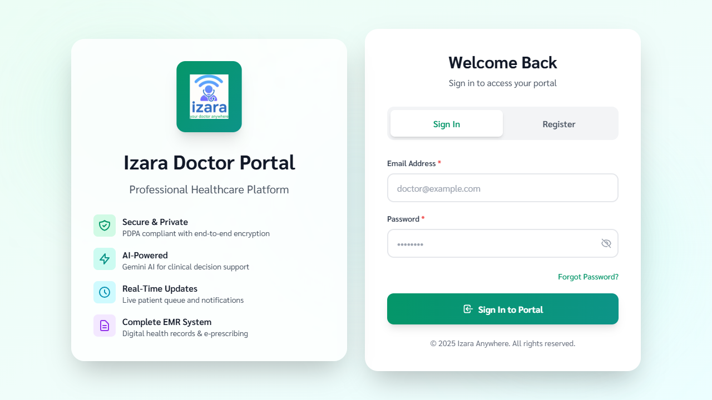 |
| 2 | System creates account | Account created but **cannot login** until approved | |
| 3 | ผู้ดูแล reviews | แพทย์ Management → Pending tab → review credentials | |
| 4 | ผู้ดูแล approves | คลิก "Approve" → status: **approved** → send notification |  |
| 5 | Promote to admin | (Optional) คลิก "Promote to ผู้ดูแล" → grant admin privileges | 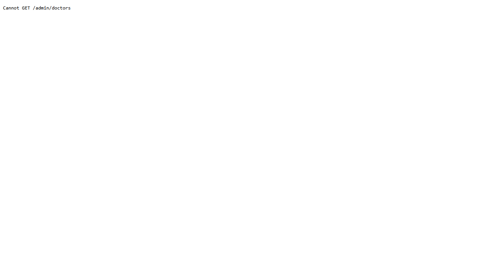 |
| 6 | แพทย์ logs in | Login with registered email/password |  |


> ⚠️ **Security:** Rejected or suspended doctors cannot log in. JWT is immediately revoked.

---


## 7. Video Meeting System & Jitsi


### 7.1 Meeting System Architecture

```
ผู้ป่วย (ผู้ป่วย Portal)  ─→  Meeting Server (Socket.IO)  ←─  แพทย์ (แพทย์ Portal)
                                       ↕
                                Jitsi Meet (WebRTC)
                                       ↕
                             Gemini AI (SOAP Summary)
```


### 7.2 Meeting Room ฟีเจอร์ Matrix

| ฟีเจอร์ | ผู้ป่วย | แพทย์ (Host) | Guest |
| ---------|---------|---------------|------- |
| Video/Audio | ✅ | ✅ | ✅ |
| Text Chat | ✅ | ✅ | ✅ |
| Screen Sharing | ✅ | ✅ | ❌ |
| Transcription | — | ✅ (controls) | — |
| Video Recording | — | ✅ | — |
| Lobby Control | — | ✅ | — |
| Mute Others | — | ✅ | — |
| End Meeting for All | — | ✅ | — |


### 7.3 Lobby System — Microsoft Teams Style

```
Guest/ผู้ป่วย enters link → Enter name + email → Wait in Lobby → แพทย์ admits/rejects → Enter/Exit room
```


## For แพทย์s:

- See list of waiting participants (name, email, type: patient/guest/admin)

- ✓ **Admit** — Participant enters meeting immediately

- ✓ **Admit All (อนุญาตทั้งหมด)** — Admit all waiting participants at once

- ✗ **Reject** — Participant sees red screen in ไทย + exit button


### 7.4 Guest Join — No Account Required

ผู้ป่วยs can send `/guest-join/:meetingId` link to family/caregivers:

1. Open link → Guest Join page shows meeting name
2. Enter name and **email address** (no login required)
3. Test camera/mic → click Join → enter Lobby
4. ⏱️ After **5 minutes** waiting — yellow warning banner appears with "กลับหน้าแรก" (Return Home) button
5. When admitted → enter Jitsi room with settings:
   - Skip secondary lobby for pre-approved participants
   - Default muted on entry
   - Recording buttons hidden for guests

---


## 8. AI ฟีเจอร์s & Gemini


### 8.1 AI ฟีเจอร์ Overview

| ฟีเจอร์ | Portal | รายละเอียด |
| ---------|--------|------------- |
| **AI แพทย์ Chat** | ผู้ป่วย | Multi-turn health Q&A with PHR context |
| **AI Triage** | ผู้ป่วย | Auto-analyze symptom urgency during booking |
| **AI ผู้ป่วย Summary** | แพทย์ | Pre-consultation PHR+EMR summary |
| **AI SOAP Summary** | แพทย์ | Post-meeting SOAP note from transcription |
| **AI ผู้ป่วย Instructions** | แพทย์ | Auto-generate patient care instructions |
| **AI CDS** | แพทย์ | Drug interaction, dosage, allergy checks |
| **AI Document Analysis** | แพทย์ | Extract data from PDF/images |
| **AI Diagnosis Assist** | แพทย์ | Differential diagnosis suggestions |


### 8.2 Man-in-the-Loop Principle

All AI-generated medical outputs **require doctor validation** before being published to patients:

```
AI generates → แพทย์ reviews → Approve / Edit / Regenerate / Reject → ผู้ป่วย receives
```


- AI **never** auto-publishes diagnoses, prescriptions, or EMR

- All AI outputs are marked with "AI-generated, awaiting review" status

- Audit trail maintained for every AI interaction

---


## 9. Meeting Recording & Transcription


### 9.1 Video Recording


- Meeting video/audio recorded and stored in database (BYTEA format)

- Recordings linked to appointments

- แพทย์ can review recordings post-meeting

- Maximum recording size: 200MB


### 9.2 Real-Time Transcription


- เรียลไทม์ speech-to-text using Web Speech API

- **Speaker diarization** — identifies who is speaking (doctor/patient/guest)

- Supports ไทย and English with language toggle

- Transcript stored in PostgreSQL


### 9.3 Transcription Controls (แพทย์ Only)

| Control | การดำเนินการ |
| ---------|-------- |
| ▶️ **Start** | Begin transcription |
| ⏸️ **Pause** | Temporarily pause |
| ⏯️ **Resume** | Continue transcription |
| ⏹️ **Stop** | End transcription |


- Language toggle: ไทย ↔ English

- เรียลไทม์ display in meeting sidebar

- Transcript feeds into AI SOAP summary

---


## 10. Notifications


### 10.1 Notification Types

| Type | When Sent | Recipient |
| ------|-----------|----------- |
| 📅 Appointment Requested | ผู้ป่วย books | แพทย์/ผู้ดูแล |
| ✅ Appointment Confirmed | แพทย์ confirms | ผู้ป่วย |
| ❌ Appointment Cancelled | Either party cancels | Both |
| 📹 Meeting Ready | 15 นาทีก่อน meeting | ผู้ป่วย + แพทย์ |
| 📹 Meeting Started | แพทย์ starts meeting | ผู้ป่วย |
| 📄 EMR Ready | แพทย์ signs EMR | ผู้ป่วย |
| 💊 Prescription Ready | แพทย์ creates Rx | ผู้ป่วย |
| 🔬 Lab Results Ready | Results entered | ผู้ป่วย |
| 👨‍⚕️ แพทย์ Approved | ผู้ดูแล approves | แพทย์ |
| 📝 Content Submitted | แพทย์ submits article | ผู้ดูแล |
| ⏰ Appointment Reminder | 24h & 1h before | ผู้ป่วย + แพทย์ |
| 🚪 Lobby Request | Guest requests entry | แพทย์ |


### 10.2 Notification ช่องทางs


- 🔔 **In-App** — notification bell with count badge

- 📧 **Email** — Gmail API integration

- 📱 **Browser Push** — if enabled in settings

---


## 11. Content & Resource Management


### 11.1 Content Lifecycle

```
📝 แพทย์ drafts → 📤 Submit for approval → 👑 ผู้ดูแล reviews → ✅ Published → 👤 ผู้ป่วย reads
                                                             → ❌ Rejected → 📝 แพทย์ revises
```


### 11.2 Content Types

| Type | Creator | Audience | Approval |
| ------|---------|----------|---------- |
| **Health Articles** | แพทย์ | ผู้ป่วยs (Health Library) | ผู้ดูแล required |
| **Clinical Resources** | แพทย์ | แพทย์s only | ผู้ดูแล required |
| **Medical Guidelines** | แพทย์/ผู้ดูแล | แพทย์s only | ผู้ดูแล required |
| **Reference Materials** | แพทย์ | แพทย์s only | ผู้ดูแล required |


### 11.3 Clinical Resources


- Searchable medical knowledge base for doctors

- RAG + Gemini AI-powered search

- Rating system (1-5 stars) with reviews

- Categories: guidelines, research, protocols, references

---


## 12. Security & PDPA


### 12.1 Security Measures

| Measure | Implementation |
| ---------|--------------- |
| **JWT Authentication** | Signed tokens with 30-min expiration |
| **RBAC** | บทบาท-based access control (patient/doctor/admin) |
| **API Protection** | JWT + role verification on every endpoint |
| **Password Hashing** | bcrypt with salt rounds |
| **Input Validation** | Server-side validation + SQL parameterization |
| **HTTPS** | TLS encryption on all Cloud Run services |
| **Session Management** | Secure cookies + automatic expiration |
| **CORS** | Restricted cross-origin resource sharing |


### 12.2 PDPA Compliance

ไทยland's Personal Data Protection Act compliance:


- **Consent Management:** Granular per-data-type consent controls

- **Data Minimization:** Only collect necessary health data

- **Right to Access:** ผู้ป่วยs can view all their data

- **Right to Delete:** ผู้ป่วยs can request data deletion

- **Right to Withdraw:** Revoke consent at any time

- **Data Portability:** Export health data as needed

- **Per-แพทย์ Controls:** Different sharing settings per treating doctor


### 12.3 Data Encryption & Storage


- All data stored in PostgreSQL with parameterized queries

- Passwords hashed with bcrypt

- JWT signed with shared secret across services

- Cloud Run services behind Google Cloud infrastructure

- Meeting recordings stored as encrypted BYTEA in database

---


## 13. Troubleshooting & FAQ


## Q: I can't log in as a doctor.
> New doctor accounts require admin approval. Contact your admin. See [Section 6](#6-doctor-onboarding-workflow).


## Q: My appointment is still "Pending."
> Waiting for doctor review. You'll receive a notification when confirmed.


## Q: I can't join the video meeting.
> Make sure you: (1) accepted the meeting agreement, (2) allowed camera/mic access, (3) use Chrome, (4) meeting hasn't ended already.


## Q: Where can I see my lab results?
> Go to **PHR → Lab & Imaging** tab. Results appear there once your doctor enters them.


## Q: The map doesn't show facilities.
> Allow location access in browser. Try increasing the distance filter (10 or 20 km).


## Q: How do I change the language?
> Go to **Settings → Language** and toggle ไทย ↔ English.


## Q: AI แพทย์ chat isn't responding.
> The AI service may need a moment. Try refreshing and starting a new session.


## Q: How do I share health records with a doctor?
> Go to **PDPA Consent** and enable sharing for specific data types per doctor.


## Q: Guest can't enter the meeting.
> Guest must wait in the Lobby for doctor approval. แพทย์ needs to click "Admit" in the Waiting Room panel.


## Q: How do I invite family to my meeting?
> Copy the guest join link from the pre-join screen and share it. Guests only need a name — no account required.


## Q: Where is the AI SOAP summary?
> After doctor approves, it appears in your PHR and Timeline. You'll receive a notification.


## Q: Can I revoke my Living Will?
> Yes. Go to Living Will page → click "Revoke." The document will be immediately marked as revoked.


## Q: How do I see other doctors in the system?
> Go to **แพทย์s Directory** in the sidebar. You can search by name or specialty.


## Q: What is CDS (Clinical Decision Support)?
> AI automatically checks drug interactions, dosage, and allergy contraindications when prescribing. The doctor sees alerts before finalizing prescriptions.


## Q: How is my data protected?
> All data is encrypted in transit (HTTPS), passwords are hashed (bcrypt), and you control exactly what data is shared via PDPA consent settings.


## Q: Meeting recording failed or is too large.
> Maximum recording size is 200MB. For longer meetings, pause/resume recording strategically. The transcript is always available regardless of recording status.


## Q: แพทย์ใหม่ลงทะเบียนแล้วแต่เข้าสู่ระบบไม่ได้?
> ต้องรอผู้ดูแลระบบอนุมัติก่อน (ดูหัวข้อ 6 กระบวนการลงทะเบียนแพทย์ใหม่)

---


## Appendix: Platform Architecture

| Component | URL | Purpose |
| -----------|-----|--------- |
| **ผู้ป่วย Portal** | `izara-patient-portal-dev-testing-*.run.app` | ผู้ป่วย-facing web application |
| **แพทย์ Portal** | `izara-doctor-portal-dev-testing-*.run.app` | แพทย์ and ผู้ดูแล web application |
| **Meeting Server** | `izara-meeting-server-dev-testing-*.run.app` | Jitsi video meeting management |
| **Database** | PostgreSQL (Cloud SQL) | All data storage (PHR, EMR, appointments) |
| **AI Engine** | Gemini 2.5 Flash | Medical AI features |


---


## © 2026 IZARA Telemedicine Platform — All Rights Reserved
*This user guide covers v1.5.10 with 2,013 unit tests + 1,149 E2E + 516 UI tests (638 screenshots) from 105 test files.*
