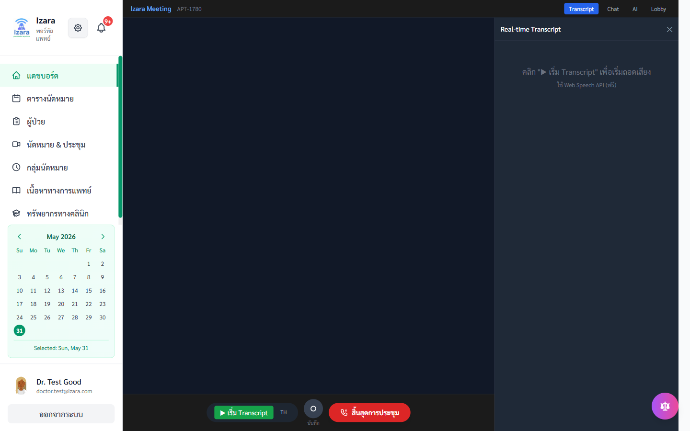
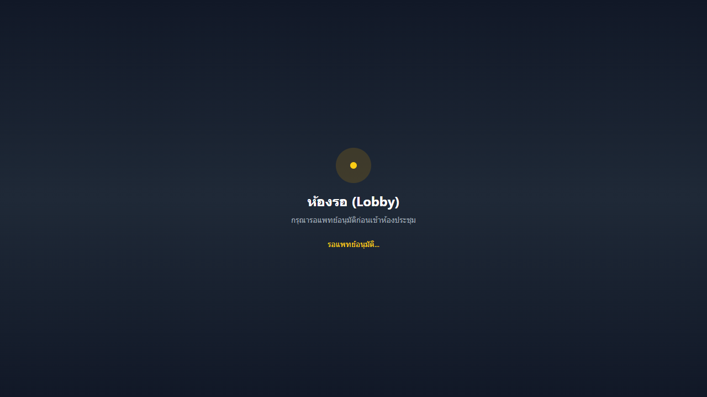
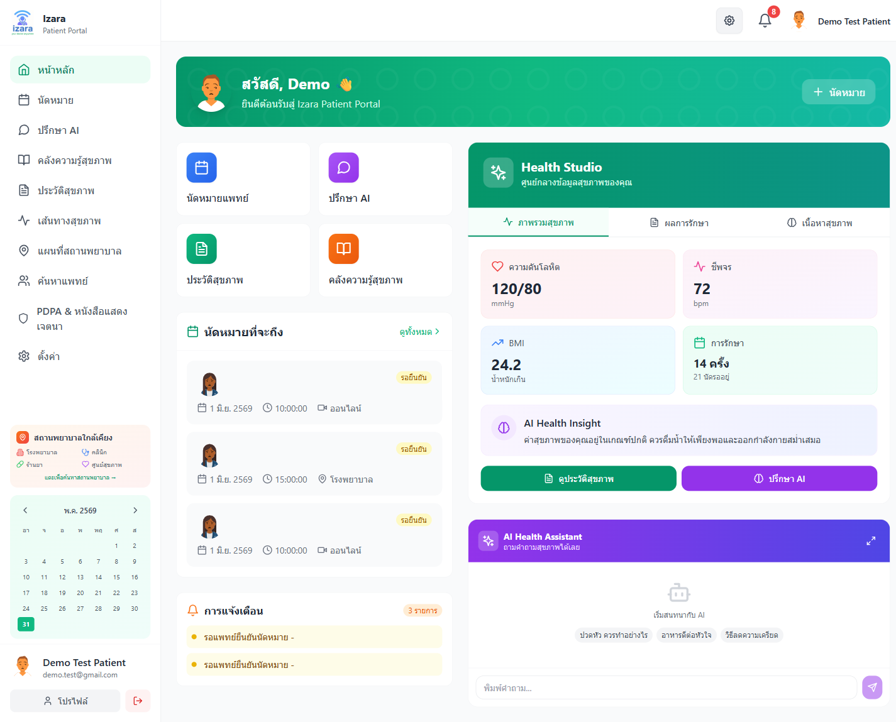

# Local Install Runbook

Quick path to run Izara on **Windows localhost** before full gates.

## Prerequisites

- Docker Desktop (WSL2 backend recommended)
- Node.js 22+
- Git clone: `Isara-Anywhere`

## 1. Environment

```powershell
cd Isara-Anywhere
copy .env.docker.example .env.docker
# Add GEMINI_API_KEY, JWT_SECRET, DB_PASSWORD in .env.docker
npm run env:sync
```

Portal copies: `Isara-doctor-portal/.env`, `Isara-patient-portal/.env`, `Izara-jitsi-server/.env` (from sync script).

## 2. Start stack

```powershell
docker compose --env-file .env.docker --profile full --profile jitsi up -d --build
npm run docker:probe-health
npm run docker:meeting-api-smoke
# One-time Jitsi JWT/domain sync (if not already run):
node scripts/jitsi/setup-local-jitsi.mjs
```

| Service | URL |
|---------|-----|
| Patient portal | http://localhost:3005/login |
| Doctor portal | http://localhost:3010/login |
| Meeting server | http://127.0.0.1:3020 |
| Self-hosted Jitsi | https://meet.localhost:8443 (`JITSI_DOMAIN` in `.env.docker`) |
| Postgres | localhost:5433 |

**Jitsi on Windows:** E2E maps `meet.localhost` via Chromium `--host-resolver-rules`; optional admin hosts entry `127.0.0.1 meet.localhost`.

### Apply v2.3.0 migration (existing Postgres volumes)

If `patient_documents` or content workflow columns are missing on a running DB:

```powershell
Get-Content scripts\database\migrations\v2.3.0-patient-documents-and-messages.sql -Raw |
  docker compose exec -T postgres psql -U postgres -d izara_phase1
docker compose build doctor-portal patient-portal
docker compose up -d doctor-portal patient-portal
```

Auto-migration on doctor-portal startup also adds `medical_content` / `clinical_resources` workflow columns.

## 2b. Phased local gate ladder (Round 6)

Run in order (headed, `PW_SKIP_LIVE_GEMINI=1`, `BASELINE_VISUAL=1`):

```powershell
$env:PW_HEADED='1'; $env:BASELINE_VISUAL='1'; $env:PW_SKIP_LIVE_GEMINI='1'
npm run phase:0    # lint + meeting contract
npm run phase:2    # auth A — ledger round 1
npm run phase:3    # post-meeting Q+Q2 — round 2
npm run phase:4    # live meeting Q+R — round 3
npm run phase:5    # appointments D+C+I — round 4
npm run phase:6    # patient B+G+H+J — round 5
npm run phase:7    # clinical E+F+L — round 6
npm run phase:8    # Defect+K+S regression
npm run test:local:pre-deploy-gate   # full merge — ledger round 9
```

Optional 3-party guest: `$env:PW_INCLUDE_GUEST='1'` on `phase:4` or isolated Q project.

## 3. Fast quality checks

```powershell
npm run phase:0
npm run test:guards:static
npm run test:unit:process-contracts
npm run sonar:lint
```

## 4. Full local gate (headed E2E + screenshots)

Browsers stay **visible** (`PW_HEADED=1`) so you can watch UI during the gate.

### Fast path — parallel gate (~45–90 min)

Runs independent groups **B, C, G, H, I, J** in parallel (`PW_WORKERS=2`); meeting pipeline **D → Q → E → F** stays serial via Playwright deps. Does **not** launch your personal Google Chrome (`PW_NO_CHROME=1`).

```powershell
$env:PW_HEADED='1'
$env:BASELINE_VISUAL='1'
$env:PW_SKIP_LIVE_GEMINI='1'
$env:GATE_SKIP_DOCKER_BUILD='1'   # if stack already up
npm run phase:9:parallel
# or E2E + screenshots only (skip unit re-run):
# $env:GATE_FROM_STEP='e2e-full-headed'
# npm run test:local:gate-parallel-resume
```

After pass: `npm run docs:evidence:local` and `npm run ledger:local`.

### Full serial gate (~2–4 h)

```powershell
$env:PW_HEADED='1'
$env:BASELINE_VISUAL='1'
$env:PW_SKIP_LIVE_GEMINI='1'
# If stack is already up, skip rebuild (avoids Docker Hub TLS timeouts):
$env:GATE_SKIP_DOCKER_BUILD='1'
npm run test:local:pre-deploy-gate
```

This runs headed Playwright, screenshot audits, syncs PNGs into `docs/screenshots/`, refreshes user-guide markdown, and updates the evidence section below.

**Cloud (headed UI + screenshots):**

```powershell
$env:PW_HEADED='1'
$env:BASELINE_VISUAL='1'
$env:TEST_ENV='cloud'
npm run test:cloud:release-gate
npm run docs:evidence:cloud
```

**Latest proof (2026-06-30):** `reports/local-error-ledger/round-9-latest.json` — local pre-deploy **P0=0**; LAN `meet.demotoday.net` on Ubuntu `192.168.10.239`; see [LAN_VIDEO_CLIENT_TH.md](../../Documents/docs/markdown/operations/LAN_VIDEO_CLIENT_TH.md).

## 5. Ubuntu LAN + Nginx (`*.demotoday.net`)

See [deploy/nginx/DEPLOYMENT.md](../../deploy/nginx/DEPLOYMENT.md) and [WINDOWS_CLIENT_SETUP.md](../../deploy/nginx/WINDOWS_CLIENT_SETUP.md).

**On Ubuntu server:**

```bash
bash scripts/deploy/ubuntu-lan-remaining.sh
# or: bash deploy/nginx/deploy.sh
```

**On Windows (doctor/patient laptops):**

1. Run `deploy/nginx/windows-update-hosts.ps1` as Administrator (includes `meet.demotoday.net`)
2. Trust mkcert CA from server (`deploy/nginx/isara-mkcert-rootCA.pem`)
3. Test: `https://meet.demotoday.net/external_api.js` → must return JavaScript

**Video:** camera/microphone use **your laptop** — not the Ubuntu server. User guide (TH): [LAN_VIDEO_CLIENT_TH.md](../../Documents/docs/markdown/operations/LAN_VIDEO_CLIENT_TH.md).

After LAN deploy:

```powershell
$env:TEST_ENV='lan'
$env:PATIENT_URL='https://patient.demotoday.net'
$env:DOCTOR_URL='https://doctor.demotoday.net'
$env:MEETING_URL='https://meeting.demotoday.net'
$env:NODE_TLS_REJECT_UNAUTHORIZED='0'
npm run docker:meeting-api-smoke
npm run test:lan:deploy-gate
```

## 6. Troubleshooting

| Symptom | Fix |
|---------|-----|
| Docker Hub TLS timeout on `docker compose --build` | Stack already running: `$env:GATE_SKIP_DOCKER_BUILD='1'` then re-run gate |
| probe-health fails | `docker compose logs patient-portal doctor-portal meeting-server` |
| Meeting 502 | Check `VITE_MEETING_SERVER_URL=http://127.0.0.1:3020` in portal builds |
| E2E auth loop | `node -e "import('./scripts/docker/e2eDockerCommon.mjs').then(m=>m.resetDatabaseBaseline())"` |
| Identical screenshots | Jitsi did not mount — fix meeting host gate, re-run group-Q |
| LAN: cam/mic dead / Start Meeting stuck | Add `meet.demotoday.net` to Windows hosts; trust mkcert; use doctor **laptop** browser; `ufw allow 10000/udp` on Ubuntu |
| `meet.demotoday.net` fails DNS | Hosts must include `meet.demotoday.net` → server IP (not public DNS) |

## Related

- [Processes/ENV_AND_STACK_CHECK.md](../../Processes/ENV_AND_STACK_CHECK.md)
- [Processes/PROCESS_TO_TEST_GATE.md](../../Processes/PROCESS_TO_TEST_GATE.md)
- [docs/SPLIT_REPOS.md](../SPLIT_REPOS.md)

<!-- EVIDENCE_START -->
## Visual test evidence (local, headed UI)

> Browsers run **visible** during gates: `$env:PW_HEADED='1'` + `$env:BASELINE_VISUAL='1'`
> Updated: 2026-07-09

**Ledger:** `reports/local-error-ledger/round-9-latest.json` — tests **?**, **P0=0**

### Headed local gate

```powershell
$env:PW_HEADED='1'
$env:BASELINE_VISUAL='1'
$env:PW_SKIP_LIVE_GEMINI='1'
$env:GATE_SKIP_DOCKER_BUILD='1'
npm run test:local:pre-deploy-gate
npm run docs:sync-screenshots
node scripts/docs/update-runbook-test-evidence.mjs --env local
```

### Headed cloud gate

```powershell
$env:PW_HEADED='1'
$env:BASELINE_VISUAL='1'
$env:TEST_ENV='cloud'
npm run test:cloud:release-gate
npm run docs:sync-screenshots
node scripts/docs/update-runbook-test-evidence.mjs --env cloud
npm run guides:build
```

### Passing UI screenshots (canonical `docs/screenshots/`)

### Patient dashboard (Group A)


### Doctor dashboard (Group A)


### Appointment booking wizard (Group D)


### Doctor health meeting (Group D)


### Doctor host in Jitsi (Group Q)



### Patient lobby wait (Group Q)



### Patient auto-lobby prejoin (Group J)


### Doctor lobby admit panel (Defect DM1)


### Post-meeting AI summary (Group Q2)


### Patient portal surfaces (Group B)




Screenshots live under `docs/screenshots/group-*`. User guides: `Documents/docs/guides/patient/`, `Documents/docs/guides/doctor/`.
<!-- EVIDENCE_END -->
